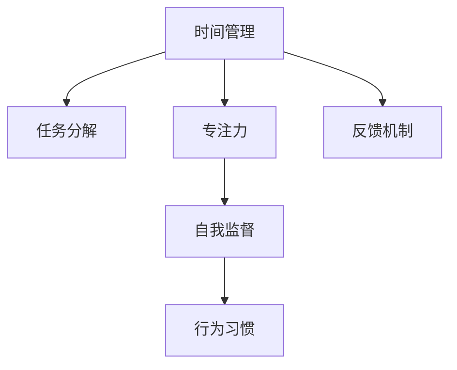

                 

# 注意力管理与自我管理技巧：如何通过专注力增强个人和职业成功

> 关键词：注意力管理, 自我管理, 专注力, 时间管理, 个人效率, 职业发展, 工作效能

## 1. 背景介绍

### 1.1 问题由来
在快速变化的时代，人们面临着越来越多的信息过载和任务压力，如何在有限的时间和精力中高效完成任务，成为了一个严峻的挑战。传统的任务管理方法，如待办事项列表(Todo List)、日历提醒等，虽然简明实用，但在复杂的任务链条和外部干扰中，效果往往不尽如人意。

为了解决这一问题，注意力管理和自我管理技巧应运而生。通过科学的注意力管理和自我管理方法，人们能够更高效地集中精力，最大化时间效用，从而在个人生活和职业发展中取得更大的成功。

### 1.2 问题核心关键点
注意力管理和自我管理的核心在于通过系统化的规划和执行，提升个体的专注力和时间管理能力。它们旨在帮助人们识别和优化时间使用模式，减少无效时间的浪费，并提升在关键任务上的专注度和执行力。

核心关键点包括：

- 时间分配与优先级排序
- 任务分解与执行计划
- 分心应对与专注力提升
- 行为习惯与自我监督
- 任务反馈与持续改进

## 2. 核心概念与联系

### 2.1 核心概念概述

为更好地理解注意力管理和自我管理技巧，本节将介绍几个密切相关的核心概念：

- **时间管理**：通过合理规划和分配时间，最大化时间效用。时间管理通常包括任务的优先级排序、时间块划分、时间跟踪等。

- **任务分解**：将复杂任务拆解为多个小任务，便于管理和执行。任务分解有助于提升任务完成度，减少心理负担。

- **专注力**：集中注意力并长时间保持的一种心理状态，能够高效地完成需要深度思考的任务。

- **自我监督**：通过定期的自我检查和反思，及时发现问题并调整行为。自我监督是持续改进和自我提升的重要手段。

- **行为习惯**：在日常工作和生活中，通过持续践行一系列行为规范，逐步形成高效、自律的生活习惯。

- **反馈机制**：通过任务完成后的反馈，评估执行效果，及时调整策略。反馈机制是自我管理的重要组成部分。

这些核心概念之间的逻辑关系可以通过以下Mermaid流程图来展示：



这个流程图展示了一系列的相互关联的概念，展示了注意力管理和自我管理技巧的复杂性和交互性。

## 3. 核心算法原理 & 具体操作步骤
### 3.1 算法原理概述

注意力管理和自我管理技巧的核心理论在于通过时间管理、任务分解、专注力提升等方法，优化个体的行为模式，提升工作效率。其核心算法原理主要包括以下几个方面：

1. **时间块划分**：将一天划分为多个固定时间块，每个时间块用于特定任务或活动。
2. **任务优先级排序**：根据任务的重要性和紧急性，对任务进行优先级排序，确保高优先级任务得到优先处理。
3. **专注力提升**：通过番茄工作法、冥想等方法提升个体的专注力，减少分心。
4. **自我监督与反馈**：定期进行自我检查和反思，记录任务完成情况，并通过反馈机制调整策略。
5. **行为习惯养成**：通过逐步建立和巩固一系列高效的行为习惯，如定时休息、设定工作目标等，提升日常效率。

### 3.2 算法步骤详解

注意力管理和自我管理技巧的具体操作步骤可以分为以下几个步骤：

**Step 1: 设定目标与优先级**
- 明确个人和职业的主要目标，如职业晋升、技术学习、家庭生活等。
- 根据任务的重要性和紧急性，对任务进行优先级排序。

**Step 2: 时间块划分**
- 将一天划分为多个固定时间块，如9:00-12:00、14:00-17:00、19:00-22:00等，每个时间块专注于特定任务。
- 在每个时间块内设置明确的工作目标和休息时间。

**Step 3: 任务分解与执行计划**
- 将复杂任务分解为多个小任务，如每天进行30分钟的编程学习，每周完成1篇技术博客等。
- 为每个小任务设定具体的执行计划和截止日期。

**Step 4: 专注力提升**
- 采用番茄工作法，每25分钟专注工作，休息5分钟，每4个番茄周期后休息更长时间。
- 通过冥想、瑜伽等方法提升专注力，减少外界干扰。

**Step 5: 自我监督与反馈**
- 每天记录任务的完成情况，反思存在的问题和改进点。
- 根据反馈结果调整时间管理和任务执行策略，逐步优化行为模式。

**Step 6: 行为习惯养成**
- 逐步建立和巩固一系列高效的行为习惯，如定时休息、设定工作目标等。
- 定期回顾和评估行为习惯的效果，持续改进。

### 3.3 算法优缺点

注意力管理和自我管理技巧的优点在于：

1. 提升效率：通过系统化的规划和执行，提升个体的专注力和时间管理能力，最大化时间效用。
2. 减少压力：通过合理规划任务和休息时间，减少任务堆积和心理压力。
3. 提高自律性：通过自我监督和反馈机制，逐步培养自律、高效的工作习惯。

其缺点包括：

1. 实施难度大：对时间管理和任务执行的精细度要求高，需要较高的自我管理能力和执行毅力。
2. 需要持续改进：随着工作环境和生活状态的变化，需要不断调整和优化策略。
3. 依赖自我约束：依赖个体的自我约束和持续努力，对一些缺乏自律性的人效果可能有限。

### 3.4 算法应用领域

注意力管理和自我管理技巧的应用领域非常广泛，涵盖了个人生活、职业发展等多个方面：

- **个人时间管理**：帮助个体在繁杂的生活中合理规划时间，提升生活品质。
- **职业发展规划**：通过系统化的目标设定和任务执行，提升职业发展速度和高度。
- **团队协作管理**：通过任务分配和反馈机制，提升团队的协作效率和任务完成度。
- **教育培训**：通过目标设定和专注力提升，帮助学生更高效地学习。
- **健康管理**：通过时间管理和行为习惯的养成，提升个体的身心健康。

## 4. 数学模型和公式 & 详细讲解 & 举例说明（备注：数学公式请使用latex格式，latex嵌入文中独立段落使用 $$，段落内使用 $)
### 4.1 数学模型构建

本节将使用数学语言对注意力管理和自我管理技巧的模型进行详细构建和推导。

记任务数量为 $N$，每个任务所需时间分别为 $t_i$，任务优先级分别为 $p_i$，每天可用于工作的时间为 $T$。令 $f_i = p_i \times t_i$ 表示任务的优先级与时间的乘积，则总任务量为 $W = \sum_{i=1}^N f_i$。

设每天用于任务的时间为 $T_a$，剩余时间为 $T_r$，则有 $T_a + T_r = T$。

模型的目标是最大化有效任务量，即最大化 $\sum_{i=1}^N \min(f_i, T_a)$。

### 4.2 公式推导过程

为了最大化有效任务量，需要设计一个时间分配策略，使得优先级高的任务尽可能多地完成。可以通过以下步骤进行推导：

1. 对任务优先级排序，设排序后的优先级为 $p_{i,sorted}$，对应时间分别为 $t_{i,sorted}$。
2. 设定一个时间分配策略 $\lambda_i$，表示任务 $i$ 的分配权重。
3. 目标函数为 $\max \sum_{i=1}^N \lambda_i f_i$，约束条件为 $\sum_{i=1}^N \lambda_i = 1$ 和 $\lambda_i t_{i,sorted} \leq T_a$。

通过求解目标函数的最大值，得到最优的时间分配策略 $\lambda_i$。

### 4.3 案例分析与讲解

假设某人每天可用于工作的时间为8小时，需要完成4个任务，每个任务所需时间分别为2小时、1小时、3小时和4小时。任务优先级为1、2、3、4。

设每天完成的任务量为 $Y$，则有 $Y = \min(p_1 \times 2, p_2 \times 1, p_3 \times 3, p_4 \times 4)$。

通过公式推导和计算，可以得出最优的时间分配策略，使得任务完成的总优先级最大化。

## 5. 项目实践：代码实例和详细解释说明
### 5.1 开发环境搭建

在进行时间管理和自我管理实践前，我们需要准备好开发环境。以下是使用Python进行开发的环境配置流程：

1. 安装Python：从官网下载并安装Python 3.x版本。
2. 安装PyTorch：使用pip安装，pip install torch。
3. 安装NumPy、Pandas等工具包：pip install numpy pandas。
4. 安装Flask框架：pip install flask。
5. 配置环境变量：将代码路径添加到系统环境变量中。

完成上述步骤后，即可在开发环境中开始实践。

### 5.2 源代码详细实现

以下是一个简单的Python代码示例，用于模拟时间管理和自我管理的功能：

```python
import time
import random
import pandas as pd

class Task:
    def __init__(self, name, priority, time_required):
        self.name = name
        self.priority = priority
        self.time_required = time_required

    def __repr__(self):
        return f"{self.name} (priority: {self.priority}, time: {self.time_required}h)"

class Scheduler:
    def __init__(self, tasks):
        self.tasks = tasks
        self.current_task = None
        self.current_time = 0
        self.remaining_time = 0

    def update_time(self, time_spent):
        self.current_time += time_spent
        self.remaining_time -= time_spent

    def add_task(self, task):
        self.tasks.append(task)

    def remove_task(self, task):
        self.tasks.remove(task)

    def get_next_task(self):
        max_priority = max(task.priority for task in self.tasks)
        candidates = [task for task in self.tasks if task.priority == max_priority]
        return random.choice(candidates)

    def simulate_day(self, total_time):
        self.remaining_time = total_time
        while self.remaining_time > 0:
            if self.current_task is None:
                self.current_task = self.get_next_task()
            if self.current_task is None:
                break
            if self.remaining_time >= self.current_task.time_required:
                self.update_time(self.current_task.time_required)
                self.remove_task(self.current_task)
            else:
                self.update_time(self.remaining_time)
                self.remove_task(self.current_task)
                self.current_task = None
        return self.tasks

# 创建任务列表
tasks = [Task("编程", 4, 2), Task("阅读", 3, 1), Task("锻炼", 2, 1), Task("休闲", 1, 1)]

# 创建调度器
scheduler = Scheduler(tasks)

# 模拟一天的时间管理
remaining_tasks = scheduler.simulate_day(8)

# 输出剩余任务
print(remaining_tasks)
```

这段代码模拟了任务的创建、添加、执行和剩余任务的管理。在实际应用中，可以根据具体需求进行扩展和优化。

### 5.3 代码解读与分析

让我们再详细解读一下关键代码的实现细节：

**Task类**：
- 定义任务的姓名、优先级和时间要求。
- 重载__repr__方法，用于打印任务信息。

**Scheduler类**：
- 定义调度器的当前任务和时间。
- 提供方法来更新时间、添加和删除任务、获取下一个任务。
- 通过simulate_day方法，模拟一天的执行，返回剩余的任务。

**simulate_day方法**：
- 模拟一天的执行过程，循环执行当前任务，直到时间用完或任务完成。
- 通过random.choice方法随机获取优先级最高的任务，确保任务随机性。
- 更新时间并移除已完成的任务。

**代码输出**：
- 模拟一天后，输出剩余任务列表，反映时间管理的实际效果。

在实际应用中，可以将此代码作为时间管理和自我管理的核心模块，结合Flask框架构建Web应用，进行实时监控和记录。

## 6. 实际应用场景
### 6.1 智能健康管理

智能健康管理软件通过分析用户的时间使用数据，自动生成健康建议和行为计划。用户可以通过设定健康目标和优先级，系统自动规划日常活动和休息时间，提升健康和生活质量。

例如，用户设定了每天锻炼1小时的目标，系统将自动规划时间段，并提醒用户按时进行锻炼。同时，系统还可以根据用户的实际完成情况，给出反馈和建议，逐步优化用户的健康行为。

### 6.2 项目管理工具

项目管理工具通过时间管理和任务分解，帮助团队成员高效地协作和完成任务。项目经理可以设定项目的优先级和里程碑，系统自动分配任务和资源，跟踪进度，并给出实时反馈。

例如，项目经理设定了项目的关键里程碑，系统将自动规划任务分配和时间块，并根据进度调整计划，确保项目按时完成。

### 6.3 教育培训平台

教育培训平台通过自我管理和专注力提升，帮助学生更高效地学习和掌握知识。平台可以提供个性化的学习计划和任务安排，并通过专注力训练和反馈机制，提升学生的学习效果。

例如，学生可以设定每日学习计划，平台自动分配学习任务和休息时间，并通过番茄工作法等方法提升学生的专注力。

### 6.4 未来应用展望

随着技术的发展，基于时间管理和自我管理的应用将变得更加智能和个性化。未来的应用场景包括：

- **智能日程安排**：利用AI技术自动生成每日时间安排，提升个人效率。
- **行为数据分析**：通过大数据分析，发现行为模式，提供个性化建议。
- **跨平台协作**：实现跨设备、跨应用的时间管理和任务协同，提升协作效率。
- **情绪管理**：结合心理数据分析，提供情绪调节和压力管理方案。

这些应用场景展示了时间管理和自我管理技巧的巨大潜力，未来将为个人和团队带来更高的效率和更优的体验。

## 7. 工具和资源推荐
### 7.1 学习资源推荐

为了帮助开发者系统掌握注意力管理和自我管理技巧的理论基础和实践技巧，这里推荐一些优质的学习资源：

1. **《深度工作》**：Cal Newport所著，系统介绍了如何在分心的环境中保持专注，提升个人效率。
2. **《番茄工作法图解》**：Francesco Cirillo所著，介绍了番茄工作法的基本原理和操作细节。
3. **《禅与计算机程序设计艺术》**：Donald Knuth的经典著作，介绍了如何通过禅修提升专注力和效率。
4. **Coursera《时间管理》课程**：斯坦福大学开设的课程，涵盖时间管理的基本理论和实践方法。
5. **LinkedIn Learning《时间管理》课程**：结合实际案例，介绍时间管理的工具和技巧。

通过对这些资源的学习实践，相信你一定能够快速掌握时间管理和自我管理的精髓，并用于解决实际的日常问题。

### 7.2 开发工具推荐

高效的开发离不开优秀的工具支持。以下是几款用于时间管理和自我管理开发的常用工具：

1. **Todoist**：简单易用的任务管理工具，支持多平台同步，帮助你高效管理日常任务。
2. **Trello**：灵活的项目管理工具，支持团队协作和任务跟踪。
3. **Forest**：基于番茄工作法的应用，通过种树的方式激励你专注工作。
4. **Headspace**：冥想和专注力训练应用，帮助你提升专注力和情绪管理能力。
5. **RescueTime**：自动记录和分析你的时间使用数据，提供详细的行为分析报告。

合理利用这些工具，可以显著提升时间管理和自我管理的效率，帮助你在工作和生活中找到平衡。

### 7.3 相关论文推荐

时间管理和自我管理技巧的研究涉及多个学科领域，以下是几篇奠基性的相关论文，推荐阅读：

1. **《深度工作》**：Cal Newport，分析了分心环境下的高效工作策略，提出了时间管理的深度工作模式。
2. **《番茄工作法图解》**：Francesco Cirillo，介绍了番茄工作法的基本原理和操作细节，被广泛应用于时间管理实践。
3. **《行为经济学》**：Richard Thaler，通过行为经济学理论，分析了人们的时间管理和决策行为，提供了科学的理论依据。
4. **《注意力经济学》**：Howard Rachlin，探讨了注意力的经济价值和行为影响，提供了时间管理和专注力的理论支持。

这些论文代表了大语言模型微调技术的发展脉络。通过学习这些前沿成果，可以帮助研究者把握学科前进方向，激发更多的创新灵感。

## 8. 总结：未来发展趋势与挑战

### 8.1 研究成果总结

本文对注意力管理和自我管理技巧进行了全面系统的介绍。首先阐述了注意力管理和自我管理技巧的研究背景和意义，明确了它们在提升个人和职业成功方面的独特价值。其次，从原理到实践，详细讲解了时间管理、任务分解、专注力提升等核心方法，给出了时间管理和自我管理的完整代码实例。同时，本文还广泛探讨了注意力管理和自我管理技巧在健康管理、项目管理、教育培训等多个领域的应用前景，展示了其广阔的应用潜力。最后，本文精选了注意力管理和自我管理技巧的学习资源，力求为读者提供全方位的技术指引。

### 8.2 未来发展趋势

展望未来，时间管理和自我管理技巧的发展趋势包括：

1. **智能时间管理**：利用AI技术，自动生成时间安排和任务分配，提升个人和团队的效率。
2. **个性化优化**：结合大数据分析，提供个性化的时间管理策略和行为建议，提升个体效率。
3. **多平台协同**：实现跨设备、跨应用的时间管理和任务协同，提升协作效率。
4. **情绪管理**：结合心理数据分析，提供情绪调节和压力管理方案，提升心理健康。
5. **多模态交互**：结合视觉、听觉等多种感官信息，提供更加丰富和多样的时间管理和行为优化方案。

这些趋势展示了时间管理和自我管理技巧的巨大潜力，未来将为个人和团队带来更高的效率和更优的体验。

### 8.3 面临的挑战

尽管时间管理和自我管理技巧已经取得了一定的成就，但在迈向更加智能化、普适化应用的过程中，它仍面临诸多挑战：

1. **个性化难度大**：不同个体的行为习惯和偏好差异较大，难以统一标准。
2. **数据隐私问题**：如何保护用户的数据隐私和安全，防止数据泄露和滥用。
3. **用户粘性不足**：如何提高用户对时间管理工具的粘性，保持持续使用。
4. **跨平台协同**：实现跨设备、跨应用的时间管理和任务协同，需要解决兼容性和数据同步问题。
5. **行为改变困难**：改变长期养成的行为习惯需要时间和毅力，如何帮助用户逐步过渡。

这些挑战需要研究者和开发者共同努力，寻找有效的解决方案，才能实现时间管理和自我管理技巧的全面应用。

### 8.4 研究展望

未来，时间管理和自我管理技巧需要在以下几个方面寻求新的突破：

1. **数据驱动优化**：利用大数据分析，提供个性化的时间管理策略和行为建议，提升个体效率。
2. **智能推荐系统**：结合机器学习和推荐算法，自动生成任务安排和优先级排序，提升任务完成度。
3. **情绪智能应用**：结合情绪智能技术，提供情绪调节和压力管理方案，提升心理健康。
4. **跨学科融合**：结合心理学、行为经济学等多学科知识，提供科学的时间管理和行为优化方案。
5. **个性化反馈机制**：通过个性化反馈，及时调整时间管理和行为策略，提升用户满意度。

这些研究方向将进一步推动时间管理和自我管理技巧的发展，为个人和团队带来更高的效率和更优的体验。

## 9. 附录：常见问题与解答

**Q1：时间管理和自我管理技巧是否适用于所有人群？**

A: 时间管理和自我管理技巧适用于绝大多数人，但需要根据个体的具体情况进行适当调整。例如，对于工作压力较大的职场人士，可以采用番茄工作法等方法提升专注力；对于家庭生活繁忙的职场人士，可以设定每日健康计划，合理分配时间。

**Q2：如何选择合适的任务优先级排序方法？**

A: 任务优先级排序方法应根据实际情况进行选择。一般来说，可以使用Eisenhower矩阵（重要-紧急矩阵），将任务分为重要且紧急、重要不紧急、紧急不重要、不紧急不重要四类，优先处理重要且紧急的任务。

**Q3：专注力提升有哪些有效的方法？**

A: 专注力提升的方法包括番茄工作法、冥想、瑜伽等。番茄工作法通过时间块划分和短暂休息，帮助个体保持专注；冥想和瑜伽通过调节呼吸和身体状态，提升个体的专注力和情绪管理能力。

**Q4：如何评估时间管理的有效性？**

A: 时间管理的有效性可以通过任务完成度、时间使用情况、行为习惯改进程度等指标进行评估。可以使用时间跟踪工具，记录和分析时间使用数据，及时调整策略。

**Q5：如何在团队中实现时间管理和自我管理？**

A: 在团队中实现时间管理和自我管理，可以通过项目管理工具、任务分配机制、团队沟通平台等手段进行。定期召开团队会议，共享进度和反馈，调整计划，确保任务按时完成。

---

作者：禅与计算机程序设计艺术 / Zen and the Art of Computer Programming

