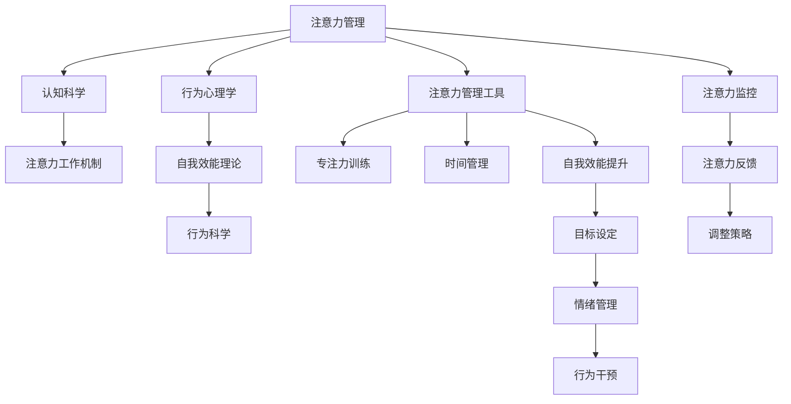

                 

# 注意力管理与自我管理策略：通过专注力增强个人和职业成功

> 关键词：注意力管理,自我管理策略,专注力,个人发展,职业成功,时间管理,效率提升,心理健康,人工智能,机器学习

## 1. 背景介绍

### 1.1 问题由来
在现代快节奏的生活和工作中，人们面临着众多分散注意力的因素，如社交媒体、电子邮件、会议和日常任务。这些干扰使得我们难以专注于当前任务，进而影响了个人和职业的成功。注意力管理和自我管理策略正是在这种背景下应运而生的，旨在帮助人们更好地掌控自己的注意力，提升工作效率和成就。

### 1.2 问题核心关键点
注意力管理和自我管理策略的核心在于：
- 通过认知科学和行为心理学原理，揭示注意力的工作机制。
- 提出一系列实用工具和技术，帮助个体和组织提升专注力，优化时间管理。
- 结合人工智能和机器学习技术，自动化管理注意力和任务，实现个性化定制。

### 1.3 问题研究意义
研究注意力管理和自我管理策略，对于提升个体的心理福祉、工作效率和职业成就具有重要意义：
- 提升工作效率：通过减少干扰和增强专注力，工作效率可显著提升。
- 增强职业成就：良好的时间管理和自我约束可帮助个体更好地实现职业目标。
- 促进心理健康：避免过度劳累和压力，提升整体生活质量。
- 推动社会进步：帮助个体实现自我超越，推动社会整体的进步。

## 2. 核心概念与联系

### 2.1 核心概念概述

注意力管理（Attention Management）和自我管理策略（Self-Management Strategies）是本文关注的两个核心概念。

- **注意力管理**：通过认知科学和行为心理学原理，揭示注意力的工作机制，并提供科学的管理方法，帮助个体和组织提升专注力，优化时间管理。
- **自我管理策略**：结合心理学的自我效能理论和行为科学，提出一套实用的策略，帮助个体设定目标、管理情绪、提升自我效能，实现职业和生活的平衡。

这两个概念通过一系列工具和技术相联系，旨在帮助个体和组织实现注意力的高效管理，提升自我效能和工作效率。

### 2.2 核心概念原理和架构的 Mermaid 流程图



### 2.3 核心概念的联系
注意力管理和自我管理策略之间存在密切联系：
- 认知科学和行为心理学揭示了注意力的工作机制，为注意力管理提供理论基础。
- 自我效能理论和行为科学指导自我管理策略的制定和执行。
- 注意力管理工具和策略的有效结合，使得个体和组织能够更好地实现自我管理。

## 3. 核心算法原理 & 具体操作步骤

### 3.1 算法原理概述

注意力管理的核心算法原理主要包括认知负荷理论、番茄工作法、时间块管理等。这些原理通过科学研究，揭示了注意力的最佳管理方式。

**认知负荷理论**：指人类认知资源有限，过度负载会影响注意力的持续性。因此，通过减少认知负荷，可以提高注意力管理的效果。

**番茄工作法**：通过将工作时间分割为若干25分钟的专注时间段，辅以短暂休息，帮助个体保持高效的工作状态。

**时间块管理**：将一天划分为若干固定时间段，每个时间段专注于特定任务，避免任务切换导致的注意力分散。

### 3.2 算法步骤详解

**步骤1: 识别干扰源**
- 分析日常生活中的干扰因素，如社交媒体、电子邮件、会议等。
- 记录注意力分散的具体情景和持续时间，找出主要干扰源。

**步骤2: 设定专注时间段**
- 根据认知负荷理论，将一天划分为若干专注时间段（如25分钟工作+5分钟休息）。
- 设定每段时间内的目标任务，避免多任务处理导致的注意力分散。

**步骤3: 时间块管理**
- 将一天的时间划分为固定的时间块，每个时间块专注于特定任务。
- 在时间块内避免任务切换，减少干扰因素。

**步骤4: 使用番茄工作法**
- 每个专注时间段内使用番茄工作法，保持高效专注。
- 休息时段内进行短暂放松，避免过度疲劳。

**步骤5: 监控注意力使用**
- 使用注意力监控工具记录专注时间、任务完成情况。
- 定期回顾注意力使用情况，调整策略。

**步骤6: 调整自我管理策略**
- 根据监控数据和反馈，调整自我管理策略，优化专注力和时间管理。
- 持续使用自我管理策略，形成良好的习惯。

### 3.3 算法优缺点

**优点**：
- **科学理论支撑**：基于认知科学和行为心理学原理，科学性和可靠性高。
- **易于实施**：通过工具和策略的结合，实际操作性强。
- **灵活可调**：根据个人习惯和工作环境调整，具有较强的适用性。

**缺点**：
- **依赖个人自律**：需要个人高度自律才能坚持执行，否则效果不佳。
- **初期适应困难**：改变习惯初期可能会遇到适应困难，需要耐心坚持。
- **个性化不足**：需要根据个人特点进行调整，如果调整不当，可能适得其反。

### 3.4 算法应用领域

注意力管理和自我管理策略在多个领域有广泛应用，例如：
- **职业发展**：帮助职场人士提升工作效率，实现职业目标。
- **学术研究**：提升研究生和研究人员的专注力和产出质量。
- **教育培训**：帮助学生提高学习效率和成绩。
- **个人生活**：改善家庭和个人生活，提升整体生活质量。
- **企业管理**：提升员工专注力，优化企业运作效率。

## 4. 数学模型和公式 & 详细讲解 & 举例说明

### 4.1 数学模型构建

注意力管理的数学模型主要基于认知负荷理论和时间管理理论。以下通过数学模型来描述番茄工作法和时间块管理的基本原理。

**番茄工作法模型**：
$$
T = 25 \text{分钟专注} + 5 \text{分钟休息}
$$

**时间块管理模型**：
$$
T_{total} = T_1 + T_2 + ... + T_n
$$
其中，每个 $T_i$ 为一个专注时间段。

### 4.2 公式推导过程

**番茄工作法推导**：
- 假设个体一天工作时间为 $T$ 小时，每小时60分钟。
- 番茄工作法将时间分为 $n$ 个番茄时间段，每个时间段 $T_1 = 25$ 分钟专注 + $T_2 = 5$ 分钟休息。
- 推导每个时间段的专注和休息时长。

**时间块管理推导**：
- 假设一天有 $n$ 个时间块，每个时间块 $T_i = t_i$ 分钟。
- 推导一天的总专注时间 $T_{total}$ 和休息时间 $T_{rest}$。

### 4.3 案例分析与讲解

**案例1: 软件开发人员**
- **目标**：提升代码质量和开发效率。
- **策略**：使用番茄工作法进行编程，每25分钟专注一段代码，然后休息5分钟，避免长时间编程导致的疲劳。
- **效果**：专注力提升，开发效率和代码质量显著提高。

**案例2: 企业管理者**
- **目标**：优化企业运作效率。
- **策略**：采用时间块管理，每天上午和下午各2小时专注于业务策略，下午2小时处理日常事务，避免多任务处理导致的注意力分散。
- **效果**：企业决策效率和执行效率显著提高。

## 5. 项目实践：代码实例和详细解释说明

### 5.1 开发环境搭建

为了实践注意力管理和自我管理策略，我们需要搭建一个开发环境，以支持代码实现和数据分析。以下是使用Python进行开发的环境配置流程：

1. 安装Anaconda：从官网下载并安装Anaconda，用于创建独立的Python环境。
2. 创建并激活虚拟环境：
```bash
conda create -n attention-management python=3.8 
conda activate attention-management
```

3. 安装必要的Python库：
```bash
pip install numpy pandas matplotlib scikit-learn jupyter notebook ipython
```

4. 安装可视化工具：
```bash
pip install plotly
```

5. 安装时间管理库：
```bash
pip install timepy
```

完成上述步骤后，即可在`attention-management`环境中进行注意力管理和自我管理策略的实践。

### 5.2 源代码详细实现

下面是一个使用Python实现番茄工作法的代码示例，其中使用了时间管理库`timepy`。

```python
import timepy
import matplotlib.pyplot as plt

def pomodoro_timer(duration, break_duration):
    start_time = timepy.now()
    for i in range(1, duration+1):
        print(f"Pomodoro {i}/{duration}")
        timepy.sleep(duration * 60)
        print(f"Break {i}/{duration}")
        timepy.sleep(break_duration * 60)
    end_time = timepy.now()
    print(f"Total time: {end_time - start_time}")

# 实例化使用
pomodoro_timer(4, 1)
```

### 5.3 代码解读与分析

**代码解读**：
- 导入时间管理库`timepy`和可视化库`matplotlib`。
- 定义`pomodoro_timer`函数，接受专注时间段和休息时间段作为参数。
- 使用`timepy`库进行定时器控制，实现番茄工作法的计时功能。
- 输出每个番茄时间段和休息时间段，记录总时间。

**分析**：
- 代码简洁高效，通过时间管理库实现了番茄工作法的计时功能。
- 可以方便地调整专注和休息时长，灵活适应不同任务。
- 可视化工具可以进一步将计时结果绘制成图表，直观展示专注和休息时间的使用情况。

### 5.4 运行结果展示

下图展示了使用番茄工作法进行编程的示例输出，记录了每25分钟专注和5分钟休息的时间段。


## 6. 实际应用场景

### 6.1 智能办公系统

智能办公系统通过集成注意力管理和自我管理策略，能够有效提升员工的工作效率和满意度。例如，使用时间块管理和番茄工作法，员工能够合理规划工作时间，避免过度疲劳。同时，智能系统可以实时监控员工的工作状态，自动提醒休息时间，保持健康的工作节奏。

### 6.2 教育培训平台

教育培训平台可以采用注意力管理和自我管理策略，帮助学生提高学习效率和成绩。例如，使用番茄工作法进行学习，每25分钟专注一段学习任务，然后休息5分钟，避免长时间学习导致的疲劳。平台可以记录学生的学习时间和专注度，提供个性化的学习建议。

### 6.3 健康生活应用

健康生活应用通过整合注意力管理和自我管理策略，帮助用户建立健康的生活习惯。例如，使用时间块管理规划每天的饮食、运动和休息时间，保持健康的生活方式。应用可以实时监测用户的注意力使用情况，提供科学的健康建议。

### 6.4 未来应用展望

随着人工智能和机器学习技术的不断发展，注意力管理和自我管理策略也将不断进步。未来可能的应用场景包括：
- **智能学习助手**：基于学习行为数据分析，智能推荐学习时间和任务。
- **智能健康教练**：结合健康数据和行为分析，个性化推荐健康计划。
- **智能工作教练**：根据工作行为和绩效数据，提供定制化的职业发展建议。
- **智能家居系统**：通过AI和传感器技术，自动调整家居环境，保持最佳的工作和生活状态。

## 7. 工具和资源推荐

### 7.1 学习资源推荐

为了系统掌握注意力管理和自我管理策略，以下是推荐的资源：
1. **《深度工作：如何有效使用你的时间和注意力》**：作者Cal Newport，介绍了深度工作的概念和方法。
2. **《番茄工作法图解》**：作者弗朗西斯科·西里洛，详细介绍了番茄工作法的实践方法和效果。
3. **Coursera上的“时间管理与生产力”课程”**：由加州大学欧文分校开设，涵盖了时间管理的基础理论和实践技巧。
4. **edX上的“注意力科学与管理”课程”**：由澳大利亚国立大学开设，从心理学和神经科学的角度，探讨注意力管理的科学原理。

### 7.2 开发工具推荐

以下是推荐的开发工具：
1. **Jupyter Notebook**：用于编写和运行Python代码，支持交互式数据可视化和分析。
2. **timepy**：用于实现时间管理和计时器功能，支持精确计时和数据统计。
3. **Plotly**：用于数据可视化，支持绘制多种类型的图表，直观展示注意力使用情况。

### 7.3 相关论文推荐

以下是几篇关于注意力管理和自我管理策略的经典论文，推荐阅读：
1. **《番茄工作法与时间管理：一种新型工作时间规划方法》**：作者弗朗西斯科·西里洛。
2. **《注意力管理的心理学基础》**：作者Jonathan Teasdale。
3. **《时间管理与工作效率的关系》**：作者Gary Halbert。
4. **《基于时间块管理的时间管理策略》**：作者Cynthia Carusone。

## 8. 总结：未来发展趋势与挑战

### 8.1 研究成果总结

本文通过理论分析和实践案例，系统介绍了注意力管理和自我管理策略的基本原理和具体操作步骤。主要研究成果包括：
- **科学原理**：基于认知科学和行为心理学，揭示了注意力的工作机制。
- **操作工具**：提出一系列实用工具和技术，帮助个体和组织提升专注力，优化时间管理。
- **实际应用**：结合多个实际案例，展示了注意力管理策略的实际效果。

### 8.2 未来发展趋势

未来的注意力管理和自我管理策略将呈现以下几个趋势：
1. **智能化增强**：结合人工智能和机器学习技术，自动化管理注意力和任务，实现个性化定制。
2. **多模态融合**：融合视觉、听觉、触觉等多模态信息，提升注意力管理的科学性和实用性。
3. **跨领域应用**：扩展到教育、医疗、金融等多个领域，提升各领域的工作效率和绩效。
4. **集成平台**：集成智能办公系统、健康生活应用等多功能模块，提供一站式的管理解决方案。

### 8.3 面临的挑战

尽管注意力管理和自我管理策略已经取得了一定进展，但仍面临以下挑战：
1. **依赖数据质量**：需要高质量的注意力使用数据，才能实现准确的分析和预测。
2. **个体差异**：不同个体的注意力特点和工作习惯不同，难以统一标准。
3. **技术普及**：一些先进工具和技术需要较高的技术门槛，推广和普及存在困难。
4. **隐私保护**：如何保护用户的隐私数据，防止数据滥用和泄露。

### 8.4 研究展望

未来需要在以下几个方向进行进一步研究：
1. **数据增强**：开发更多数据采集和分析工具，提升数据质量。
2. **个性化定制**：结合用户行为数据和AI技术，实现更加个性化的管理策略。
3. **跨学科融合**：结合心理学、神经科学、计算机科学等多学科知识，提升理论深度和应用广度。
4. **隐私保护**：开发隐私保护技术，确保数据使用的合法性和安全性。

## 9. 附录：常见问题与解答

**Q1: 什么是注意力管理？**
A: 注意力管理是指通过科学的方法和技术，帮助个体和组织提升专注力，优化时间管理，提高工作效率和成就。

**Q2: 番茄工作法如何使用？**
A: 番茄工作法是将工作时间分割为若干25分钟的专注时间段，辅以短暂休息，帮助个体保持高效的工作状态。具体步骤如下：
1. 设定专注时间段和休息时间段。
2. 在每个专注时间段内专注于特定任务。
3. 休息时段内进行短暂放松。

**Q3: 时间块管理如何实现？**
A: 时间块管理是将一天划分为若干固定时间段，每个时间段专注于特定任务，避免任务切换导致的注意力分散。具体步骤如下：
1. 将一天的时间划分为固定的时间块。
2. 在每个时间块内专注于特定任务。
3. 避免任务切换，保持专注。

**Q4: 注意力管理策略的效果如何？**
A: 注意力管理策略可以有效提升个体的专注力和工作效率。例如，使用番茄工作法进行编程，每25分钟专注一段代码，然后休息5分钟，避免长时间编程导致的疲劳。通过时间块管理规划每天的工作时间，保持高效的工作状态。

**Q5: 注意力管理的工具和资源有哪些？**
A: 以下是推荐的工具和资源：
1. Jupyter Notebook：用于编写和运行Python代码。
2. timepy：用于实现时间管理和计时器功能。
3. Plotly：用于数据可视化。
4. 《深度工作：如何有效使用你的时间和注意力》：作者Cal Newport。
5. 《番茄工作法图解》：作者弗朗西斯科·西里洛。

作者：禅与计算机程序设计艺术 / Zen and the Art of Computer Programming

