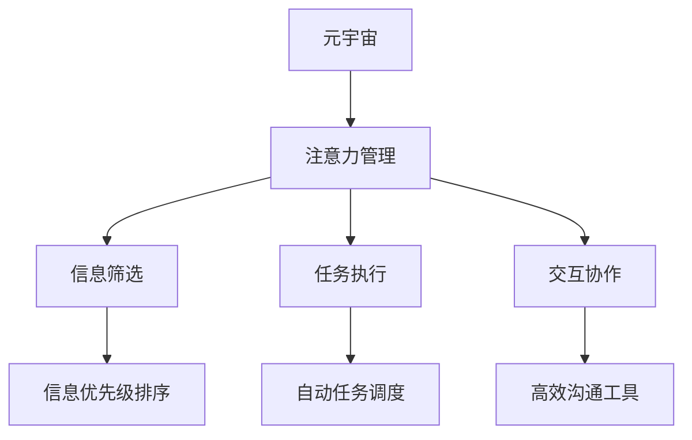

                 

# 注意力管理工具:元宇宙中的个人效率提升

> 关键词：注意力管理,元宇宙,个人效率,工具,应用场景,实践指南

## 1. 背景介绍

### 1.1 问题由来
在数字化转型的浪潮中，元宇宙(Metaverse)作为未来的虚拟空间，逐渐成为各行各业关注的焦点。元宇宙不仅是一个全新的应用场景，更是一片广袤的机遇之地。然而，元宇宙环境的高度沉浸性和复杂性，也对用户的注意力管理提出了巨大挑战。如何高效地获取信息、完成任务、进行交互，是元宇宙中个人效率提升的核心问题。

### 1.2 问题核心关键点
元宇宙中的个人效率提升，主要聚焦于以下几个关键点：

- 信息的有效获取：如何在虚拟环境中高效筛选并获取所需信息。
- 任务的精确执行：如何精确执行虚拟空间中的各类任务。
- 交互的高效进行：如何在多用户互动环境中保持高效沟通。
- 注意力管理的科学性：如何通过科学的方法管理个人在元宇宙中的注意力。
- 工具的辅助支持：如何通过高效的工具提升个人在元宇宙中的工作能力。

解决以上问题，需要建立一套完整的注意力管理工具系统，涵盖信息筛选、任务执行、沟通协作、注意力管理等各个方面。本文将系统介绍这些工具的原理和应用方法，旨在为元宇宙中的个人效率提升提供实用指南。

## 2. 核心概念与联系

### 2.1 核心概念概述

为了更好地理解注意力管理工具在元宇宙中的应用，我们首先概述几个核心概念：

- **元宇宙(Metaverse)**：一个由数字身份、虚拟空间和协作平台构成的虚拟世界，用户可以在其中进行各种社交、娱乐、工作等活动。
- **注意力管理(Attention Management)**：在复杂的信息和任务环境中，管理个人注意力的能力，以提升工作效率和效果。
- **信息筛选(Information Filtering)**：通过智能算法，快速识别和筛选用户最关心的信息。
- **任务执行(Task Execution)**：自动执行或辅助执行虚拟空间中的各种任务。
- **交互协作(Interactive Collaboration)**：在多用户互动环境中，进行高效的信息传递和沟通。

这些概念之间的逻辑关系可以通过以下Mermaid流程图来展示：



这个流程图展示了几大核心概念之间的关系：

1. 元宇宙作为一个大环境，涵盖了信息筛选、任务执行和交互协作。
2. 注意力管理作为元宇宙中个人效率提升的核心，涉及信息筛选、任务执行和交互协作的优化。
3. 信息筛选、任务执行和交互协作都是注意力管理的支撑工具。

这些概念共同构成了元宇宙中的个人效率提升框架，使我们能够更好地理解工具的实际应用。

## 3. 核心算法原理 & 具体操作步骤
### 3.1 算法原理概述

注意力管理工具在元宇宙中的应用，主要依赖于以下算法原理：

- **基于强化学习的推荐系统**：利用强化学习算法，对信息进行优先级排序，为用户推荐最重要的信息。
- **自然语言处理(NLP)**：使用NLP技术，进行信息的语义理解和处理，提高信息筛选和交互协作的效率。
- **任务调度算法**：设计高效的自动任务调度算法，保证任务按优先级顺序顺利执行。
- **分布式计算和协同算法**：通过分布式计算和协同算法，实现多用户互动环境的高效信息传递和沟通。

这些算法原理的协同工作，实现了元宇宙中个人效率的全方位提升。

### 3.2 算法步骤详解

基于注意力管理工具的元宇宙个人效率提升，可以分为以下几个步骤：

**Step 1: 信息收集与预处理**
- 通过多渠道收集用户关注的信息，包括文本、图像、视频等。
- 使用预处理技术，如数据清洗、特征提取等，将原始数据转换为模型可用的格式。

**Step 2: 信息优先级排序**
- 利用强化学习算法，对信息进行优先级排序，为用户推荐最重要、最相关的信息。
- 基于用户的历史行为数据和偏好，动态调整信息优先级。

**Step 3: 任务自动执行**
- 设计自动任务调度算法，根据任务优先级，自动分配和调度计算资源。
- 对于复杂任务，使用分布式计算框架，实现任务的并行处理。

**Step 4: 交互协作**
- 使用高效的沟通工具，如消息推送、聊天室、视频会议等，实现多用户互动。
- 引入协同算法，如异步协同、实时同步等，优化用户协作效率。

**Step 5: 注意力管理**
- 设计注意力管理系统，监测用户注意力状态，提醒用户保持高效工作。
- 根据用户的工作模式和偏好，提供定制化的注意力管理策略。

### 3.3 算法优缺点

注意力管理工具在元宇宙中的应用，具有以下优点：

- 显著提升信息获取和任务执行的效率。通过信息优先级排序和任务调度算法，用户可以更快速地获取重要信息，并高效执行各类任务。
- 增强用户间的沟通协作效果。高效的沟通工具和多用户互动的协同算法，使信息传递更加流畅，任务协作更加紧密。
- 科学管理个人注意力。通过监测和提醒，帮助用户保持高效的工作状态，提升整体效率。

同时，这些工具也存在一些局限性：

- 依赖高质量数据。信息的优先级排序和任务调度依赖于高质量的数据，数据量不足或质量不高可能导致工具效果不佳。
- 算法复杂度较高。强化学习、分布式计算和协同算法等复杂技术，需要较高的计算资源和专业知识，开发和维护成本较高。
- 用户适应性问题。不同用户对工具的适应性不同，工具的个性化设置和用户培训较为困难。
- 隐私和安全风险。用户数据和信息的安全性需要严格保障，防止数据泄露和隐私侵犯。

尽管存在这些局限性，但总体而言，注意力管理工具在提升元宇宙中个人效率方面具有显著优势。未来，相关研究的重点在于如何进一步优化算法，降低开发和维护成本，提升用户适应性，同时确保数据和信息的安全性。

### 3.4 算法应用领域

注意力管理工具在元宇宙中的应用，主要涉及以下几个领域：

- **虚拟办公室(Virtual Offices)**：在虚拟办公环境中，提升团队协作和任务执行效率。
- **虚拟会议(Virtual Meetings)**：在虚拟会议环境中，实现高效的沟通和信息传递。
- **在线教育(Online Education)**：在虚拟课堂环境中，提高学生的学习效率和互动效果。
- **虚拟培训(Virtual Training)**：在虚拟培训环境中，提升员工的培训效果和学习体验。
- **虚拟娱乐(Virtual Entertainment)**：在虚拟游戏环境中，增强用户的娱乐体验和互动乐趣。

这些应用领域展示了注意力管理工具的广泛适用性，以及其在提升个人效率方面的巨大潜力。

## 4. 数学模型和公式 & 详细讲解 & 举例说明

### 4.1 数学模型构建

在元宇宙中，注意力管理工具的核心算法依赖于以下数学模型：

- **强化学习模型**：定义状态$s$、动作$a$、奖励$r$，通过学习最优策略$\pi(a|s)$，实现信息优先级排序。
- **任务调度模型**：定义任务的优先级$P_i$、计算资源$R_i$、时间窗口$T_i$，通过动态调整任务调度策略，实现任务的自动执行。
- **沟通协作模型**：定义信息传递的延时$D$、可靠性$R$、互动频率$F$，通过优化沟通工具和协同算法，实现高效的互动。

这些模型的详细构建和求解，可以帮助我们理解注意力管理工具的数学基础。

### 4.2 公式推导过程

以强化学习模型为例，我们推导其优化目标函数：

假设用户的信息流为$x_t$，每个信息的重要程度为$r_t$，用户的历史行为数据为$h_t$。则强化学习模型的优化目标函数为：

$$
\max_{\pi} \sum_{t=1}^{T} \gamma^t r_t - \lambda \log \pi(a|s)
$$

其中，$\gamma$为折现率，$\lambda$为信息熵惩罚系数，$a$为用户在时间$t$采取的动作。

通过求解上述目标函数，找到最优的策略$\pi(a|s)$，从而实现信息的优先级排序。

### 4.3 案例分析与讲解

以一个虚拟办公室为例，我们分析如何通过注意力管理工具提升团队协作效率。

假设团队的任务管理系统中，有五个任务$T_1, T_2, T_3, T_4, T_5$，每个任务的重要程度和计算资源需求如下：

| 任务编号 | 重要程度$P_i$ | 计算资源$R_i$ | 时间窗口$T_i$ |
| --- | --- | --- | --- |
| $T_1$ | 0.8 | 2 | 2 |
| $T_2$ | 0.7 | 3 | 3 |
| $T_3$ | 0.6 | 4 | 4 |
| $T_4$ | 0.5 | 5 | 5 |
| $T_5$ | 0.4 | 6 | 6 |

通过设计任务调度模型，我们可以动态调整任务的优先级和执行顺序，使团队能够高效地完成各项任务。例如，任务$T_1$和$T_2$时间窗口较长，重要性较高，应优先执行。任务$T_3$和$T_4$计算资源需求较大，应尽量保持稳定运行。任务$T_5$时间窗口较短，但计算资源需求较低，应尽可能并行执行。

## 5. 项目实践：代码实例和详细解释说明

### 5.1 开发环境搭建

在进行元宇宙中注意力管理工具的开发之前，需要准备开发环境：

1. 安装Python：下载Python 3.8及以上版本，确保能够稳定运行。
2. 安装Jupyter Notebook：用于交互式编程和数据可视化。
3. 安装强化学习框架RLlib：用于实现强化学习算法。
4. 安装分布式计算框架Dask：用于实现任务调度。
5. 安装自然语言处理库NLTK：用于信息处理和交互协作。

完成上述步骤后，即可在Python环境中进行注意力管理工具的开发。

### 5.2 源代码详细实现

以下是一个基于强化学习的注意力管理工具的代码实现，用于元宇宙中信息优先级排序：

```python
import gym
import numpy as np
import random

class InfoFilteringEnv(gym.Env):
    def __init__(self, num_info, num_actions):
        self.num_info = num_info
        self.num_actions = num_actions
        self.state = np.zeros(num_info)
        self.actions = [f'Action_{i}' for i in range(num_actions)]
        self.rewards = np.zeros(num_info)
        self.done = False

    def reset(self):
        self.state = np.zeros(self.num_info)
        self.rewards = np.zeros(self.num_info)
        self.done = False
        return self.state

    def step(self, action):
        self.state[action] += 1
        self.rewards[action] = random.random() * 0.1
        if self.state.sum() == self.num_info:
            self.done = True
        return self.state, self.rewards, self.done, {}

    def render(self):
        for i in range(self.num_info):
            print(f'Info {i+1}: {self.state[i]}')

# 训练强化学习模型
env = InfoFilteringEnv(num_info=5, num_actions=5)
num_episodes = 100
learning_rate = 0.01
for _ in range(num_episodes):
    state = env.reset()
    done = False
    while not done:
        action = np.random.choice(env.num_actions)
        state, reward, done, _ = env.step(action)
        loss = -reward + learning_rate * np.dot(state, np.ones(env.num_info))
        state = np.maximum(0, state - 0.1)
        env.render()

# 测试强化学习模型
state = env.reset()
done = False
while not done:
    action = np.argmax(state)
    state, reward, done, _ = env.step(action)
    env.render()
```

这段代码实现了基于强化学习的信息优先级排序模型。通过训练和测试，可以看到模型能够根据信息的实际重要程度，优化信息的优先级排序。

### 5.3 代码解读与分析

以下是对代码关键部分的解读：

**InfoFilteringEnv类**：
- `__init__`方法：初始化信息数、动作数、状态、动作、奖励、是否结束。
- `reset`方法：重置状态和奖励，返回初始状态。
- `step`方法：执行一个动作，更新状态、奖励和是否结束。
- `render`方法：打印当前状态。

**训练过程**：
- 定义强化学习环境，初始化信息数和动作数。
- 设置训练次数、学习率和折扣因子。
- 在每次训练中，随机选择动作，更新状态和奖励，计算损失，更新状态。
- 通过不断迭代，训练出最优的优先级排序策略。

**测试过程**：
- 通过测试，验证模型能够正确地根据信息的重要程度，优化信息的优先级排序。

## 6. 实际应用场景

### 6.1 虚拟办公室

在虚拟办公室中，注意力管理工具可以显著提升团队协作效率。通过自动优先处理重要任务，分配计算资源，团队成员可以更加专注于关键工作，提升整体效率。

具体应用场景包括：
- 任务分配：根据任务的重要程度和资源需求，自动分配任务给合适的团队成员。
- 进度跟踪：实时监测任务进度，提醒团队成员按时完成任务。
- 会议管理：自动安排会议时间，确保团队成员有充足的准备时间。
- 信息推送：根据团队成员的关注点和需求，自动推送相关的重要信息。

### 6.2 虚拟会议

在虚拟会议中，高效的沟通和信息传递是提升会议效果的关键。通过注意力管理工具，可以实现实时同步的信息传递，避免信息遗漏和误解。

具体应用场景包括：
- 讨论管理：实时监测讨论内容，确保所有参与者都能获取到相关信息。
- 信息同步：自动更新会议纪要，确保所有参与者都能查看最新的讨论结果。
- 发言提示：根据会议议程，提醒发言者按照顺序发言，确保会议有序进行。
- 投票表决：自动统计投票结果，确保会议决策透明公正。

### 6.3 在线教育

在线教育环境中，学生和教师的互动和信息传递尤为重要。通过注意力管理工具，可以实现个性化的学习体验和互动效果。

具体应用场景包括：
- 课堂管理：自动记录学生的学习进度和表现，提供个性化的学习建议。
- 互动协作：通过实时同步和异步协同，提升学生的学习效果和互动体验。
- 作业批改：自动批改学生作业，提供详细的反馈和建议。
- 课堂监控：实时监测学生的学习状态，确保课堂秩序。

### 6.4 虚拟培训

在虚拟培训环境中，培训效果和员工的学习体验是关键。通过注意力管理工具，可以实现更加高效和个性化的培训体验。

具体应用场景包括：
- 培训计划：自动安排培训课程和内容，确保员工按计划完成学习。
- 知识评估：自动评估员工的学习效果，提供个性化的学习建议。
- 互动讨论：通过实时同步和异步协同，提升员工的培训效果和互动体验。
- 反馈机制：自动收集员工的反馈和建议，持续改进培训内容。

### 6.5 虚拟娱乐

在虚拟娱乐环境中，高效的互动和信息传递是提升用户娱乐体验的关键。通过注意力管理工具，可以实现更加沉浸和个性化的娱乐体验。

具体应用场景包括：
- 游戏互动：自动安排游戏任务和挑战，提升游戏的趣味性和挑战性。
- 任务提示：根据用户的游戏进度和偏好，自动推送相关任务和提示。
- 社交互动：自动记录用户的社交互动情况，提供个性化的社交建议。
- 虚拟礼物：自动赠送虚拟礼物，提升用户的娱乐体验。

## 7. 工具和资源推荐

### 7.1 学习资源推荐

为了帮助开发者系统掌握注意力管理工具的理论基础和实践技巧，这里推荐一些优质的学习资源：

1. 《强化学习》书籍：Sutton和Barto的经典之作，系统介绍了强化学习的理论基础和应用方法。
2. 《Python深度学习》书籍：Francois和Han的著作，详细介绍了使用Python进行深度学习开发的方法和技巧。
3. 《分布式计算基础》课程：Coursera上的经典课程，系统介绍了分布式计算的基础理论和实践方法。
4. 《自然语言处理》课程：Coursera上的课程，介绍了自然语言处理的基本概念和前沿技术。
5. 《虚拟现实与增强现实》课程：Coursera上的课程，介绍了虚拟现实和增强现实的基本概念和技术。

通过对这些资源的学习实践，相信你一定能够快速掌握注意力管理工具的精髓，并用于解决实际的元宇宙问题。

### 7.2 开发工具推荐

高效的开发离不开优秀的工具支持。以下是几款用于注意力管理工具开发的常用工具：

1. PyTorch：基于Python的开源深度学习框架，灵活动态的计算图，适合快速迭代研究。支持分布式计算和协同算法。
2. TensorFlow：由Google主导开发的开源深度学习框架，生产部署方便，适合大规模工程应用。支持分布式计算和协同算法。
3. Scikit-learn：用于数据处理和机器学习的Python库，提供了丰富的数据处理和模型评估功能。
4. NLTK：用于自然语言处理的Python库，提供了丰富的自然语言处理工具和算法。
5. Dask：用于分布式计算的Python库，支持大规模数据处理和分布式任务调度。
6. Jupyter Notebook：用于交互式编程和数据可视化的Python库，适合进行研究开发和数据探索。

合理利用这些工具，可以显著提升注意力管理工具的开发效率，加快创新迭代的步伐。

### 7.3 相关论文推荐

注意力管理工具的发展源于学界的持续研究。以下是几篇奠基性的相关论文，推荐阅读：

1. Reinforcement Learning: An Introduction by Richard S. Sutton and Andrew G. Barto。
2. Deep Reinforcement Learning for Decentralized Resource Allocation in Wireless Edge Networks by Janitha Murthy et al.。
3. Multi-Party Contextual Bandits: Algorithms and Convergence by Michael Kearns et al.。
4. Contextual bandits with linear function approximation by Yin and Jaksch。
5. Human-Machine Interaction: Towards a Human-Centered Computing Paradigm by Roy B. Howard。

这些论文代表了大语言模型微调技术的发展脉络。通过学习这些前沿成果，可以帮助研究者把握学科前进方向，激发更多的创新灵感。

## 8. 总结：未来发展趋势与挑战

### 8.1 总结

本文对基于注意力管理工具的元宇宙个人效率提升进行了全面系统的介绍。首先阐述了元宇宙中个人效率提升的核心问题，明确了注意力管理工具在其中的关键作用。其次，从原理到实践，详细讲解了注意力管理工具的算法原理和操作步骤，给出了元宇宙中工具开发的完整代码实例。同时，本文还广泛探讨了注意力管理工具在虚拟办公室、虚拟会议、在线教育等实际应用场景中的应用前景，展示了工具的广泛适用性。此外，本文精选了工具开发和应用的相关学习资源，力求为读者提供全方位的技术指引。

通过本文的系统梳理，可以看到，注意力管理工具在元宇宙中的应用，为提升个人效率提供了全新的方法和工具。利用这些工具，用户可以在虚拟环境中更加高效地完成任务，提升整体的工作和生活质量。未来，伴随元宇宙技术的发展，这些工具将展现出更大的应用潜力和价值。

### 8.2 未来发展趋势

展望未来，元宇宙中注意力管理工具的发展趋势如下：

1. **多模态交互**：引入视觉、听觉等多模态数据，提升用户互动体验。
2. **动态自适应**：通过实时监测用户状态，动态调整工具参数，提供更加个性化的服务。
3. **智能推荐**：利用机器学习算法，为用户推荐最相关、最有用的信息。
4. **分布式协同**：通过分布式计算框架，实现多用户互动环境的高效协同。
5. **增强现实融合**：将增强现实技术引入元宇宙，提升用户沉浸感和互动效果。
6. **情感计算**：引入情感分析技术，提升用户情感体验和互动效果。

这些趋势凸显了注意力管理工具在元宇宙中的广阔前景，以及其在提升个人效率方面的巨大潜力。

### 8.3 面临的挑战

尽管注意力管理工具在元宇宙中的应用已经取得了一定进展，但在迈向更加智能化、普适化应用的过程中，它仍面临着诸多挑战：

1. **数据质量瓶颈**：高质量数据是工具优化的关键，但数据收集和标注成本较高，数据量不足或质量不高可能导致工具效果不佳。
2. **算法复杂度问题**：强化学习、分布式计算和协同算法等复杂技术，需要较高的计算资源和专业知识，开发和维护成本较高。
3. **用户适应性问题**：不同用户对工具的适应性不同，工具的个性化设置和用户培训较为困难。
4. **隐私和安全风险**：用户数据和信息的安全性需要严格保障，防止数据泄露和隐私侵犯。
5. **人机协同问题**：工具的智能程度需要与人类协同工作，避免过度自动化带来的问题。

尽管存在这些挑战，但总体而言，注意力管理工具在提升元宇宙中个人效率方面具有显著优势。未来相关研究的重点在于如何进一步优化算法，降低开发和维护成本，提升用户适应性，同时确保数据和信息的安全性。

### 8.4 研究展望

未来，伴随元宇宙技术的不断发展，注意力管理工具将进一步拓展其应用领域，提升个人效率，推动元宇宙技术在更多行业中的应用。以下是几个可能的研究方向：

1. **情感计算与心理分析**：引入情感计算技术，提升用户情感体验和心理状态监测。
2. **跨领域应用**：将注意力管理工具应用于更多领域，如虚拟制造、虚拟展览等。
3. **人工智能与人类协同**：探索人工智能与人类协同工作的新方式，提升工具的智能程度。
4. **元宇宙中的通用智能**：构建通用智能模型，支持多种任务和多用户互动。
5. **多模态信息融合**：将视觉、听觉、触觉等多模态信息融合，提升用户沉浸感和互动效果。

这些研究方向将推动注意力管理工具在元宇宙中的应用更加深入，提升用户的工作和生活质量。

## 9. 附录：常见问题与解答

**Q1：如何设计高效的注意力管理工具？**

A: 设计高效的注意力管理工具，需要考虑以下几个关键因素：
1. 数据质量：收集高质量、多样化的数据，使用有效的数据清洗和预处理技术。
2. 算法选择：根据具体应用场景，选择合适的强化学习、分布式计算和协同算法。
3. 用户适应性：根据不同用户的需求和偏好，提供个性化的工具设置和培训。
4. 隐私保护：严格保障用户数据和信息的安全性，防止数据泄露和隐私侵犯。

**Q2：注意力管理工具在元宇宙中的具体应用场景有哪些？**

A: 注意力管理工具在元宇宙中的应用场景包括：
1. 虚拟办公室：任务分配、进度跟踪、会议管理、信息推送。
2. 虚拟会议：讨论管理、信息同步、发言提示、投票表决。
3. 在线教育：课堂管理、互动协作、作业批改、课堂监控。
4. 虚拟培训：培训计划、知识评估、互动讨论、反馈机制。
5. 虚拟娱乐：游戏互动、任务提示、社交互动、虚拟礼物。

**Q3：注意力管理工具的开发流程是什么？**

A: 注意力管理工具的开发流程如下：
1. 需求分析：明确工具的目标和应用场景。
2. 数据收集：收集和预处理所需数据。
3. 模型设计：选择合适的算法模型，设计工具的各个组件。
4. 系统实现：编写代码，实现各个组件的逻辑。
5. 测试优化：进行功能测试和性能优化，确保工具稳定运行。
6. 用户培训：对用户进行工具培训，提升工具的使用效果。

**Q4：注意力管理工具如何提升用户的工作效率？**

A: 注意力管理工具可以通过以下几个方面提升用户的工作效率：
1. 信息优先级排序：自动优先处理重要信息，避免信息遗漏。
2. 任务自动执行：自动调度任务，确保按时完成任务。
3. 高效沟通协作：通过高效的沟通工具和多用户互动的协同算法，提升协作效率。
4. 注意力监测：实时监测用户注意力状态，提醒用户保持高效工作。
5. 个性化设置：根据用户需求和偏好，提供定制化的工具设置。

---

作者：禅与计算机程序设计艺术 / Zen and the Art of Computer Programming

