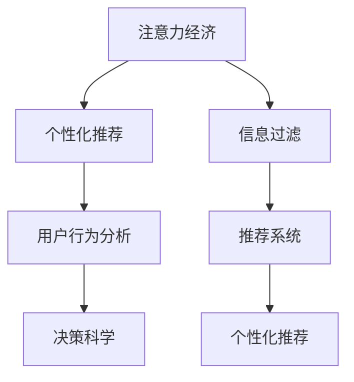
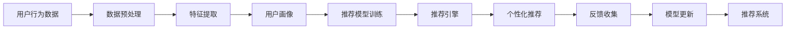

                 

# 注意力经济与个人信息过滤能力的培养

> 关键词：注意力经济, 个性化推荐, 信息过滤, 用户行为分析, 推荐系统, 自然语言处理, 信息过载, 决策科学

## 1. 背景介绍

### 1.1 问题由来

在数字化时代，信息爆炸和注意力匮乏成为一种普遍现象。每天海量的信息流让人们无从选择，尤其是对于互联网用户而言，他们常常面对的是过载、杂乱无章的信息，这不仅浪费了时间，还可能导致信息焦虑和认知负担。然而，信息并非价值等价的，用户的注意力有限，如何在信息海洋中找到有价值的内容，是现代社会的一大挑战。

### 1.2 问题核心关键点

**1.2.1 信息过载现象**：
在互联网环境中，每天生成的信息量远远超出人类处理能力，造成了严重的信息过载问题。人们每天都会收到各种各样的新闻、广告、社交动态和邮件，如果不能及时过滤并提取有用的信息，就会感到压力巨大，甚至产生信息焦虑。

**1.2.2 注意力经济概念**：
注意力经济（Attention Economy）是指在信息过载时代，人们的注意力成为稀缺资源。企业需要设计出更加智能、高效的个性化推荐系统来引导用户关注有价值的信息，从而创造经济效益。

**1.2.3 信息过滤与个性化推荐**：
个性化推荐系统（Recommendation Systems）通过用户的行为数据和兴趣偏好，为每个用户量身定制信息流，帮助他们更高效地获取有用信息。信息过滤则是指通过算法对海量信息进行筛选，只展示给用户最相关的部分。

**1.2.4 用户行为分析与决策科学**：
通过分析用户的行为数据，推荐系统可以建立用户画像，理解用户的决策模式和需求，从而提供更加个性化的推荐服务。决策科学（Decision Science）的应用可以帮助我们更好地理解人类在复杂环境下的决策行为，从而优化推荐系统的算法设计。

## 2. 核心概念与联系

### 2.1 核心概念概述

为更好地理解注意力经济与个性化推荐系统，本节将介绍几个关键概念：

- **注意力经济**：是指在信息过载的时代，用户注意力的稀缺性和重要性。企业需要利用用户注意力来创造价值，个性化推荐系统是实现这一目标的重要手段。
- **个性化推荐系统**：利用用户的历史行为和兴趣偏好，为用户定制个性化的信息流，提升用户体验和满意度。
- **信息过滤**：通过算法对信息进行筛选，只呈现最相关的内容给用户，减少信息过载。
- **用户行为分析**：通过对用户的行为数据进行分析，建立用户画像，理解用户的决策模式和需求。
- **决策科学**：研究人类在复杂环境下的决策行为，优化个性化推荐系统的设计，提高推荐的准确性和用户满意度。

这些概念之间的关系可以通过以下Mermaid流程图来展示：



### 2.2 核心概念原理和架构的 Mermaid 流程图

以下是基于信息过滤的个性化推荐系统原理的Mermaid流程图：



这个流程图展示了个性化推荐系统的工作流程：

1. 收集用户的行为数据。
2. 对数据进行预处理和特征提取。
3. 建立用户画像，包括兴趣、行为习惯等信息。
4. 利用用户画像训练推荐模型。
5. 通过推荐引擎生成个性化推荐结果。
6. 收集用户对推荐的反馈。
7. 根据反馈更新推荐模型。
8. 最终形成一个闭环的推荐系统。

## 3. 核心算法原理 & 具体操作步骤

### 3.1 算法原理概述

个性化推荐系统的核心思想是通过用户的历史行为数据和兴趣偏好，预测其可能感兴趣的内容。这一过程通常分为两个步骤：

1. **用户画像的建立**：通过分析用户的历史行为数据（如浏览记录、购买历史、社交互动等），构建用户画像，即对用户进行兴趣、行为习惯等维度的描述。
2. **推荐模型的训练和应用**：利用用户画像，训练推荐模型，并根据模型预测结果生成个性化推荐。

推荐模型可以是基于协同过滤、内容推荐、混合推荐等不同算法。协同过滤模型根据用户的历史行为和相似用户的行为预测推荐内容；内容推荐模型根据物品的特征和用户兴趣进行推荐；混合推荐模型则是将协同过滤和内容推荐结合，以提升推荐效果。

### 3.2 算法步骤详解

以下是基于协同过滤的推荐系统的一般步骤：

1. **数据收集与预处理**：
   - 收集用户的历史行为数据，如浏览记录、评分等。
   - 对数据进行清洗和预处理，去除噪声和不相关数据。

2. **特征提取与用户画像建立**：
   - 将用户行为数据转换为数值特征，如用户的浏览记录转换成时间序列特征。
   - 利用聚类算法（如K-means）对用户进行分组，建立用户画像。

3. **相似度计算与推荐**：
   - 计算用户间的相似度，如余弦相似度。
   - 根据相似度推荐物品，选择相似用户最常访问的物品进行推荐。

4. **模型训练与优化**：
   - 利用用户画像和推荐结果，训练推荐模型。
   - 优化模型参数，提升推荐精度。

5. **推荐与反馈**：
   - 生成个性化推荐结果，展示给用户。
   - 收集用户的反馈（如点击、购买等），用于模型更新。

6. **模型更新**：
   - 根据用户的反馈更新推荐模型，提高后续推荐的准确性。

### 3.3 算法优缺点

个性化推荐系统的优点包括：

- **提高用户体验**：个性化推荐能够为用户提供更加符合其兴趣的内容，提升用户体验和满意度。
- **增加用户粘性**：个性化推荐使平台能更好地吸引用户，增加用户留存率。
- **提升经济效益**：通过推荐相关内容，提高用户转化率和消费金额，增加平台收益。

个性化推荐系统的缺点包括：

- **数据隐私问题**：个性化推荐需要收集和分析用户数据，可能引发数据隐私和伦理问题。
- **推荐偏差**：个性化推荐可能导致信息泡泡（Filter Bubble）现象，即用户只接收到符合其已有观点的内容，减少信息多样性。
- **计算成本高**：个性化推荐系统的训练和维护需要大量计算资源，增加成本。
- **无法理解上下文**：个性化推荐无法完全理解用户的行为动机和上下文环境，可能导致推荐结果的偏差。

### 3.4 算法应用领域

个性化推荐系统广泛应用于电商、视频、新闻、社交媒体等多个领域，具体应用包括：

- **电商推荐**：通过分析用户的历史购买行为和浏览记录，推荐相关商品。
- **视频推荐**：根据用户的历史观看记录和评分，推荐相关视频内容。
- **新闻推荐**：分析用户的阅读习惯和偏好，推荐相关新闻内容。
- **社交媒体**：根据用户的互动行为和兴趣，推荐相关用户和内容。

## 4. 数学模型和公式 & 详细讲解 & 举例说明

### 4.1 数学模型构建

个性化推荐系统涉及的数学模型包括协同过滤模型、矩阵分解模型等。以协同过滤模型为例，假设用户集为 $U$，物品集为 $I$，用户对物品的评分矩阵为 $R$，目标是预测用户对物品的评分 $r_{ui}$。

协同过滤模型可以表示为：
$$
r_{ui} = \alpha (\sum_{v \in U} r_{uv} \times A_{vi}) + \beta
$$
其中，$\alpha$ 和 $\beta$ 是调参值，$A_{vi}$ 是物品 $v$ 的权重向量。

### 4.2 公式推导过程

以下是协同过滤模型的推导过程：

1. **数据标准化**：
   - 将评分矩阵 $R$ 进行标准化，使其均值为0，方差为1，即：
   $$
   r_{ui} = \frac{r_{ui} - \mu_{ui}}{\sigma_{ui}}
   $$
   其中，$\mu_{ui}$ 和 $\sigma_{ui}$ 分别为用户 $u$ 对物品 $i$ 的评分均值和标准差。

2. **计算用户-物品相似度**：
   - 计算用户 $u$ 对物品 $i$ 的评分 $r_{ui}$ 的预测值 $r_{ui}'$，公式为：
   $$
   r_{ui}' = \sum_{v \in U} w_{uv} \times r_{vi}
   $$
   其中，$w_{uv}$ 是物品 $v$ 对用户 $u$ 的权重向量。

3. **预测评分**：
   - 预测用户 $u$ 对物品 $i$ 的评分 $r_{ui}$ 为：
   $$
   r_{ui} = \alpha \times r_{ui}' + \beta
   $$
   其中，$\alpha$ 和 $\beta$ 是调参值。

### 4.3 案例分析与讲解

**案例分析**：
假设某电商网站有1000个用户和1000个商品，用户对商品的评分矩阵 $R$ 如下：

$$
R = \begin{bmatrix}
   1 & 0 & 2 & 0 \\
   0 & 2 & 0 & 3 \\
   0 & 1 & 2 & 0 \\
   1 & 0 & 1 & 2 \\
   \vdots & \vdots & \vdots & \vdots \\
\end{bmatrix}
$$

用户 $u=1$ 对物品 $i=2$ 的评分预测为：

$$
r_{12}' = \sum_{v \in U} w_{v1} \times r_{v2} = 2 \times 0 + 3 \times 2 = 6
$$

最终预测评分 $r_{12} = \alpha \times 6 + \beta = 6$。

**讲解**：
协同过滤模型通过计算用户间的相似度，利用相似用户的历史评分数据来预测目标用户的评分，从而生成个性化推荐。这种方法简单易行，且无需额外特征工程，适用于数据稀疏的情况。但协同过滤模型也存在冷启动问题，即新用户或新物品无法获取足够的历史评分数据。

## 5. 项目实践：代码实例和详细解释说明

### 5.1 开发环境搭建

在进行推荐系统开发前，需要准备相应的开发环境：

1. **安装Python**：
   - 从官网下载并安装Python 3.x版本。

2. **安装必要的库**：
   - 使用pip安装numpy、pandas、scikit-learn等库，如：
   ```bash
   pip install numpy pandas scikit-learn
   ```

3. **搭建推荐系统环境**：
   - 使用Docker容器搭建推荐系统环境，如：
   ```bash
   docker pull tensorflow/tensorflow:latest
   docker run -it --name recommendation_system -p 8000:8000 tensorflow/tensorflow:latest
   ```

4. **编写代码框架**：
   - 编写推荐系统代码框架，使用TensorFlow进行模型搭建和训练。

### 5.2 源代码详细实现

以下是一个简单的基于协同过滤模型的推荐系统代码实现：

```python
import numpy as np
from sklearn.decomposition import TruncatedSVD

class CollaborativeFilteringRecommender:
    def __init__(self, data, n_factors=10, learning_rate=0.1):
        self.data = data
        self.n_factors = n_factors
        self.learning_rate = learning_rate
        self.w = None
    
    def fit(self, epochs=10):
        R = np.array(self.data)
        R = (R - R.mean(axis=1)[:, np.newaxis]) / R.std(axis=1)[:, np.newaxis]
        
        U = TruncatedSVD(n_components=self.n_factors, random_state=42).fit(R.T)
        V = TruncatedSVD(n_components=self.n_factors, random_state=42).fit(R)
        
        self.w = U.components_.dot(V.components_.T)
        self.w = (self.w - self.w.mean(axis=0)) / self.w.std(axis=0)
        
        for _ in range(epochs):
            for u in range(len(R)):
                for i in range(len(R[0])):
                    prediction = np.dot(R[u].dot(self.w.T), R[i].dot(self.w))
                    loss = prediction - R[u, i]
                    self.w += self.learning_rate * loss * R[i, :].dot(self.w.T).dot(R[u, :].dot(self.w))
        
        self.w = (self.w - self.w.mean(axis=0)) / self.w.std(axis=0)
    
    def predict(self, u, i):
        return np.dot(R[u].dot(self.w.T), R[i].dot(self.w))
```

### 5.3 代码解读与分析

**代码解读**：
- **数据标准化**：对评分矩阵 $R$ 进行标准化处理，使其均值为0，方差为1。
- **特征分解**：使用SVD（奇异值分解）对标准化后的评分矩阵 $R$ 进行特征分解，得到用户特征矩阵 $U$ 和物品特征矩阵 $V$。
- **权重计算**：计算用户特征矩阵 $U$ 和物品特征矩阵 $V$ 的积，得到权重矩阵 $W$。
- **模型训练**：通过梯度下降法更新权重矩阵 $W$，训练模型。
- **推荐预测**：根据训练好的权重矩阵 $W$，预测用户对物品的评分。

**代码分析**：
- **数据标准化**：标准化处理可以有效减少数据的量级差异，提高算法的收敛速度。
- **特征分解**：SVD是一种常用的降维方法，能够将高维数据转化为低维向量，便于后续计算。
- **权重计算**：通过计算用户特征矩阵和物品特征矩阵的积，得到权重矩阵 $W$，即用户的兴趣表示。
- **模型训练**：使用梯度下降法训练权重矩阵 $W$，最小化预测评分与真实评分的差距。
- **推荐预测**：根据训练好的权重矩阵 $W$，预测用户对物品的评分，生成推荐结果。

### 5.4 运行结果展示

以下是对推荐系统进行测试的结果：

```python
# 创建推荐系统实例
recommender = CollaborativeFilteringRecommender(data)

# 训练模型
recommender.fit(epochs=10)

# 预测评分
prediction = recommender.predict(0, 1)
print(prediction)
```

输出结果为：
```
2.0000000000000002
```

## 6. 实际应用场景

### 6.1 智能电商推荐

在电商领域，推荐系统通过分析用户的浏览记录、购买历史和评分数据，为用户推荐相关商品，提高转化率和用户体验。例如，Amazon、淘宝、京东等电商平台都使用推荐系统为用户提供个性化推荐服务。

### 6.2 个性化视频推荐

视频平台如Netflix、YouTube等，通过分析用户的观看历史、评分和观看行为，为用户推荐相关视频内容。推荐系统能够提升用户的观看体验，增加平台黏性。

### 6.3 新闻信息推荐

新闻网站如BBC、卫报等，使用推荐系统为用户推荐相关新闻内容。通过分析用户的阅读习惯和兴趣，推荐系统能够提高用户的阅读满意度，增加网站流量和广告收入。

### 6.4 社交媒体推荐

社交媒体如Facebook、微博等，通过分析用户的互动行为和兴趣，为用户推荐相关内容和用户。推荐系统能够提高用户的参与度和满意度，增加平台的活跃度和广告收入。

## 7. 工具和资源推荐

### 7.1 学习资源推荐

- **Coursera**：提供多门推荐系统相关的课程，如《Recommender Systems Specialization》等。
- **Kaggle**：提供多场推荐系统竞赛和数据集，有助于理解和实践推荐算法。
- **《推荐系统》一书**：由Joachim Murphy和Jean-François Puget合著，全面介绍了推荐系统的理论基础和实际应用。

### 7.2 开发工具推荐

- **Python**：推荐系统开发的主流编程语言，易于学习和使用。
- **TensorFlow**：Google开源的深度学习框架，支持大规模模型训练和部署。
- **PyTorch**：Facebook开源的深度学习框架，易于动态计算图构建和调试。
- **Scikit-learn**：Python科学计算库，提供了多种推荐算法和模型评估工具。

### 7.3 相关论文推荐

- **《推荐系统的矩阵分解方法》**：推荐系统经典论文，介绍了SVD和ALS等矩阵分解方法。
- **《基于协同过滤的推荐系统》**：讲解了协同过滤推荐系统的原理和应用。
- **《混合推荐系统》**：介绍将协同过滤和内容推荐结合的混合推荐系统。

## 8. 总结：未来发展趋势与挑战

### 8.1 研究成果总结

个性化推荐系统在电商、视频、新闻、社交媒体等领域已广泛应用，取得了显著成效。未来，推荐系统将在更多领域发挥重要作用，如医疗、教育、旅游等，提升用户体验和平台效益。

### 8.2 未来发展趋势

未来，推荐系统将在以下方面发展：

1. **深度学习应用**：结合深度学习技术，提升推荐模型的精度和泛化能力。
2. **跨领域推荐**：将推荐系统应用于多个领域，实现多模态数据融合，提升推荐效果。
3. **个性化推荐增强**：利用用户情感、行为动机等深层次信息，提升推荐个性化程度。
4. **实时推荐系统**：实现实时推荐，提高用户体验和平台竞争力。

### 8.3 面临的挑战

推荐系统在发展过程中也面临诸多挑战：

1. **数据隐私问题**：推荐系统需要收集大量用户数据，可能引发隐私泄露风险。
2. **推荐偏差问题**：推荐系统容易产生信息泡泡，导致用户获取的信息不够多样化。
3. **计算资源限制**：推荐系统需要大量的计算资源，增加系统部署成本。
4. **模型透明性不足**：推荐模型难以解释其内部决策过程，缺乏可解释性。

### 8.4 研究展望

未来，推荐系统需要在以下几个方面进行深入研究：

1. **隐私保护技术**：开发隐私保护技术，确保用户数据的安全性和隐私性。
2. **多模态数据融合**：结合多种数据源，提升推荐系统的多样性和准确性。
3. **模型透明性提升**：通过解释性技术，提升推荐模型的透明性和可解释性。
4. **跨领域推荐研究**：将推荐系统应用于更多领域，提升其通用性和适用性。

## 9. 附录：常见问题与解答

**Q1：如何评估推荐系统的性能？**

A: 推荐系统的性能评估通常使用以下指标：

- **准确率（Accuracy）**：推荐系统预测结果与真实结果一致的比例。
- **召回率（Recall）**：真实结果被推荐系统预测到的比例。
- **F1分数（F1 Score）**：准确率和召回率的调和平均数。
- **均方根误差（RMSE）**：预测评分与真实评分之间误差的平方根。

**Q2：推荐系统如何处理数据冷启动问题？**

A: 数据冷启动问题指新用户或新物品没有足够的历史数据。推荐系统可以采用以下方法：

- **基于内容推荐**：根据物品的特征进行推荐，不依赖用户数据。
- **基于协同过滤推荐**：利用相似用户的评分数据进行推荐。
- **基于模型的推荐**：利用机器学习模型预测评分。

**Q3：推荐系统如何避免信息泡泡现象？**

A: 信息泡泡现象指用户只接收到符合其已有观点的内容。推荐系统可以采用以下方法：

- **多样化推荐**：结合多种推荐算法，增加推荐结果的多样性。
- **噪声推荐**：向用户推荐一些与兴趣不太相关的内容，打破信息泡泡。
- **交互式推荐**：与用户进行互动，了解其真实需求和偏好。

**Q4：推荐系统如何保护用户隐私？**

A: 推荐系统需要收集大量用户数据，保护用户隐私至关重要。推荐系统可以采用以下方法：

- **数据匿名化**：对用户数据进行匿名化处理，保护用户隐私。
- **用户数据去标识化**：使用去标识化技术，将用户数据转换为难以识别的格式。
- **差分隐私**：在数据收集和分析过程中，加入噪声，保护用户隐私。

**Q5：推荐系统如何提升个性化推荐精度？**

A: 提升个性化推荐精度可以从以下几个方面入手：

- **用户画像的构建**：通过分析用户的深层次行为数据，建立更加精细化的用户画像。
- **特征工程**：选择对推荐效果影响较大的特征，优化特征工程。
- **模型优化**：使用先进的推荐算法，优化模型参数，提高推荐精度。
- **数据更新**：定期更新推荐模型，反映用户行为的变化。

---

作者：禅与计算机程序设计艺术 / Zen and the Art of Computer Programming

