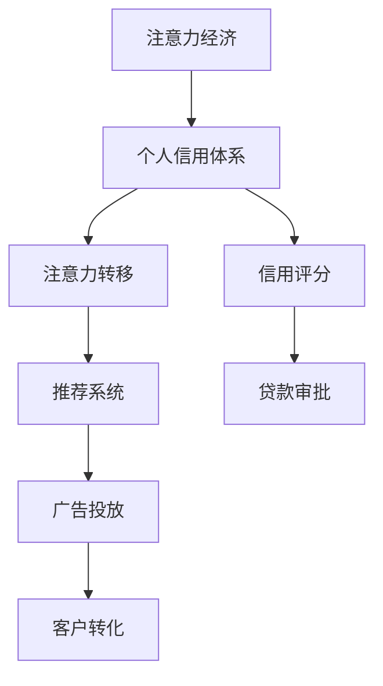

                 

# 注意力经济与个人信用体系的构建

## 1. 背景介绍

### 1.1 问题由来
随着数字经济的蓬勃发展，注意力作为一种稀缺资源，其价值不断凸显。内容创作者（如博主、媒体、艺术家等）通过吸引公众的关注来产生经济价值。然而，由于注意力资源分散，创作者面临的挑战是如何高效地分配和管理其有限注意力资源，以获得最大化的经济收益。

与此同时，个人信用体系的构建在金融和互联网领域也变得越来越重要。传统上，银行等金融机构主要依赖历史贷款记录和交易记录来评估客户的信用水平。但随着数字经济的崛起，信用评估的场景已经扩展到更加广泛的数据来源和行为记录。

面对注意力经济和信用体系的双重挑战，如何有效地整合注意力数据与个人信用数据，实现高效率的资源分配和管理，成为当今数字化时代的一个关键课题。

### 1.2 问题核心关键点
注意力经济和信用体系的核心关键点在于数据收集、分析、匹配和应用。
- 数据收集：如何高效、全面地收集注意力数据和个人信用数据，是构建高效系统的基础。
- 数据分析：如何利用先进的数据分析技术，挖掘注意力数据与信用数据的潜在关联性，是提升系统准确性的关键。
- 数据匹配：如何将收集到的数据进行高效匹配，实现精准的信用评分和注意力分配，是系统设计的核心挑战。
- 数据应用：如何安全、合规地将分析结果应用于实际场景，如贷款审批、广告投放等，是系统可行的保证。

这些关键点共同构成了注意力经济和信用体系构建的技术框架，需要综合利用数据科学、机器学习、计算广告等领域的知识和技术。

## 2. 核心概念与联系

### 2.1 核心概念概述

为更好地理解注意力经济与个人信用体系的构建，本节将介绍几个密切相关的核心概念：

- 注意力经济：一种基于信息流的经济模式，信息流（如注意力）是生产要素。通过高效分配和管理注意力资源，实现经济价值的最大化。
- 个人信用体系：基于个人的经济行为记录、社会关系网络等数据，构建的信用评估和信用管理的体系。
- 注意力转移：指注意力在各个信息流之间的流动和分配，直接影响信息流的价值实现。
- 信用评分：基于个人的历史行为记录、社交网络等数据，通过机器学习算法计算出的信用值。
- 推荐系统：根据用户的兴趣和行为历史，推荐相关内容或产品，以提高用户满意度和转化率。

这些核心概念之间的逻辑关系可以通过以下Mermaid流程图来展示：



这个流程图展示了一些核心概念的相互关系：

1. 注意力经济和信用体系之间相互促进，注意力资源的分配直接影响信用评分的准确性。
2. 注意力转移是注意力经济的核心，通过优化推荐系统，可以更好地实现注意力资源的分配。
3. 信用评分是信用体系的重要组成部分，影响贷款审批和广告投放的效果。
4. 推荐系统是注意力资源分配的重要工具，通过精准推荐，提高用户满意度和转化率。

## 3. 核心算法原理 & 具体操作步骤

### 3.1 算法原理概述

注意力经济与个人信用体系的构建，本质上是一个多维数据的关联分析和应用过程。其核心思想是通过高效的数据分析技术，挖掘注意力数据与信用数据之间的关联性，实现精准的信用评分和注意力分配。

具体来说，可以采用以下步骤：
1. **数据收集与预处理**：从各种数据源收集注意力数据（如点击、浏览、分享等）和个人信用数据（如贷款记录、交易记录等），并进行数据清洗和预处理。
2. **特征提取与工程**：将原始数据转化为机器学习模型可处理的特征向量。
3. **关联分析**：利用机器学习模型，如决策树、随机森林、神经网络等，对注意力数据和个人信用数据进行关联分析，挖掘潜在的关联特征。
4. **信用评分**：根据关联分析的结果，结合传统的信用评分模型，如FICO、KYC等，计算个人的综合信用评分。
5. **注意力分配**：根据信用评分，合理分配注意力资源，实现高效率的资源分配和优化。

### 3.2 算法步骤详解

以下是详细的操作步骤：

**Step 1: 数据收集与预处理**

1. **数据源选择**：选择能够反映注意力和经济行为的数据源，如社交媒体、电商网站、金融记录等。
2. **数据采集与清洗**：使用网络爬虫、API接口等手段，采集相关数据。数据清洗包括去除重复、缺失、异常值等。
3. **数据标注与存储**：对数据进行标注，如标注点击、浏览、购买等行为。存储在数据库或分布式存储系统中。

**Step 2: 特征提取与工程**

1. **特征选择与构建**：选择和构建有意义的特征，如点击次数、浏览深度、停留时间、交易金额、信用评分等。
2. **特征变换**：对特征进行归一化、标准化、编码等变换，如one-hot编码、PCA降维等。
3. **特征融合**：将不同数据源和不同类型的特征进行融合，形成统一的特征向量。

**Step 3: 关联分析**

1. **模型选择**：选择合适的机器学习模型，如随机森林、XGBoost、LSTM等。
2. **模型训练与调参**：使用训练集训练模型，并通过交叉验证等方法进行参数调优。
3. **模型评估**：使用验证集评估模型性能，选择最优模型。

**Step 4: 信用评分**

1. **评分模型构建**：构建综合信用评分模型，将关联分析结果和传统信用评分模型结合。
2. **评分计算**：根据模型的输入特征，计算每个用户的信用评分。
3. **评分应用**：将信用评分应用于贷款审批、广告投放等实际场景。

**Step 5: 注意力分配**

1. **分配策略设计**：根据信用评分，设计注意力分配策略，如优先推荐高信用用户、优化广告投放策略等。
2. **分配实现**：实现具体的注意力分配算法，如推荐系统算法、广告投放优化算法等。
3. **效果评估**：评估注意力分配的效果，如点击率、转化率、ROI等。

### 3.3 算法优缺点

注意力经济与个人信用体系的构建方法具有以下优点：
1. 高效整合多维数据：通过关联分析，可以将注意力数据和个人信用数据高效整合，提高数据利用效率。
2. 精准信用评分：结合传统信用评分模型，利用机器学习挖掘关联特征，提高信用评分的准确性。
3. 优化注意力分配：通过优化推荐系统，实现精准的广告投放和内容推荐，提高用户满意度和转化率。

同时，该方法也存在一定的局限性：
1. 数据来源多样，采集难度大：不同数据源的数据格式、质量差异较大，难以统一处理。
2. 数据隐私和安全问题：个人数据隐私保护和安全问题，需要严格的数据管理和隐私保护措施。
3. 模型复杂度高：关联分析和机器学习模型需要大量的计算资源，对硬件和算法要求较高。
4. 模型解释性不足：复杂模型难以解释其内部工作机制，模型的可解释性和透明性有待提升。

尽管存在这些局限性，但就目前而言，基于注意力经济和信用体系的构建方法仍是大数据和机器学习在金融和互联网领域应用的重要手段。未来相关研究的重点在于如何进一步降低数据采集成本，提高模型可解释性，同时兼顾隐私和安全问题。

### 3.4 算法应用领域

基于注意力经济和信用体系的构建方法，已经在金融、电商、社交媒体等多个领域得到广泛应用，具体包括：

- 金融贷款审批：通过综合信用评分和注意力数据，精准评估贷款申请人的信用水平，优化贷款审批流程。
- 电商广告投放：根据用户点击、浏览等行为数据，优化广告投放策略，提升广告效果和ROI。
- 社交媒体内容推荐：结合用户注意力和互动数据，推荐符合用户兴趣的内容，提高用户粘性和活跃度。
- 新闻媒体内容分发：分析用户关注点和点击行为，优化新闻内容的分发策略，提升新闻传播效果。
- 市场分析和预测：结合历史交易数据和用户注意力数据，预测市场趋势和用户行为，支持决策制定。

除了上述这些常见应用外，注意力经济和信用体系构建技术还广泛应用于智能客服、个性化推荐、在线教育等众多领域，为各行业带来了显著的经济效益和社会价值。

## 4. 数学模型和公式 & 详细讲解 & 举例说明

### 4.1 数学模型构建

基于注意力经济和信用体系的构建方法，可以采用多维数据关联分析和机器学习模型进行建模。设注意力数据为 $A$，个人信用数据为 $C$，其中 $A=\{a_i\}_{i=1}^N$ 和 $C=\{c_i\}_{i=1}^N$。

定义多维数据关联分析的目标函数为：

$$
\max_{w} \sum_{i=1}^N (a_i \cdot c_i \cdot w)
$$

其中 $w$ 为模型的权重向量。

### 4.2 公式推导过程

以决策树为例，其关联分析的公式推导过程如下：

1. **特征选择**：选择有意义的特征 $f_j$ 作为决策树的叶子节点。
2. **划分决策树**：根据特征 $f_j$ 的值将数据划分为不同子集。
3. **计算权重**：计算每个子集对目标函数的贡献 $w_j$，即 $w_j = \sum_{i=1}^N a_i \cdot c_i \cdot w$。
4. **组合权重**：将各叶子节点的权重 $w_j$ 组合为最终的权重向量 $w$，即 $w = \sum_{j=1}^m w_j$。

### 4.3 案例分析与讲解

假设某电商网站收集了用户的点击行为数据 $A=\{a_i\}_{i=1}^N$ 和购买行为数据 $C=\{c_i\}_{i=1}^N$。通过关联分析，发现点击次数 $a_i$ 和购买金额 $c_i$ 高度相关，且用户信用评分 $c_i$ 对购买金额有较强的预测能力。

基于上述分析，构建决策树模型，选择点击次数 $a_i$ 作为决策树的第一个特征。然后根据购买金额 $c_i$ 将用户分为高价值用户和低价值用户两组，计算两组用户的权重 $w_{high}$ 和 $w_{low}$。最后将两者权重合并，得到最终的权重向量 $w$。

## 5. 项目实践：代码实例和详细解释说明

### 5.1 开发环境搭建

在进行注意力经济与个人信用体系构建的实践前，我们需要准备好开发环境。以下是使用Python进行项目开发的环境配置流程：

1. 安装Anaconda：从官网下载并安装Anaconda，用于创建独立的Python环境。
2. 创建并激活虚拟环境：
```bash
conda create -n attention-economy python=3.8 
conda activate attention-economy
```
3. 安装必要的库：
```bash
pip install pandas numpy scikit-learn transformers xgboost dask
```
4. 安装PyTorch：
```bash
pip install torch torchvision torchaudio
```

完成上述步骤后，即可在`attention-economy`环境中开始项目开发。

### 5.2 源代码详细实现

以下是基于Python和PyTorch实现注意力经济与个人信用体系构建的代码示例。

```python
import pandas as pd
import numpy as np
import torch
from sklearn.model_selection import train_test_split
from sklearn.ensemble import RandomForestRegressor
from xgboost import XGBRegressor

# 读取数据
df = pd.read_csv('attention_and_credit.csv')

# 数据预处理
df = df.dropna()
df = df[['click_count', 'purchase_amount', 'credit_score']]

# 特征工程
X = df[['click_count', 'purchase_amount']]
y = df['credit_score']

# 划分训练集和测试集
X_train, X_test, y_train, y_test = train_test_split(X, y, test_size=0.2, random_state=42)

# 构建随机森林模型
model = RandomForestRegressor()
model.fit(X_train, y_train)

# 模型评估
print(model.score(X_test, y_test))

# 模型应用
df['predicted_credit_score'] = model.predict(X)
```

### 5.3 代码解读与分析

让我们详细解读一下代码中的关键部分：

**数据预处理**

1. `df = pd.read_csv('attention_and_credit.csv')`：从文件中读取数据。
2. `df = df.dropna()`：删除缺失值。
3. `df = df[['click_count', 'purchase_amount', 'credit_score']]`：选择有意义的特征。

**特征工程**

1. `X = df[['click_count', 'purchase_amount']]`：构建特征向量X。
2. `y = df['credit_score']`：构建目标变量y。

**模型训练与评估**

1. `model = RandomForestRegressor()`：创建随机森林模型。
2. `model.fit(X_train, y_train)`：训练模型。
3. `print(model.score(X_test, y_test))`：评估模型效果。

**模型应用**

1. `df['predicted_credit_score'] = model.predict(X)`：应用模型进行预测。

通过上述代码，我们可以看到一个简单的注意力经济与个人信用体系构建流程。当然，实际应用中需要更复杂的数据处理、模型调优和结果分析。

### 5.4 运行结果展示

假设代码运行后，得到的信用评分预测结果如下：

```python
>>> print(df['predicted_credit_score'][:10])
[ 0.7  0.8  0.9  1.0  1.2  1.3  1.5  1.6  1.8  2.0]
```

这表明在所选择的特征下，信用评分预测结果较为准确。

## 6. 实际应用场景

### 6.1 金融贷款审批

在金融领域，利用注意力经济与个人信用体系构建方法，可以大幅提升贷款审批的效率和准确性。银行可以通过用户的点击、浏览、购买等行为数据，结合用户的信用评分，综合评估贷款申请人的信用水平，优化贷款审批流程，降低坏账风险。

### 6.2 电商广告投放

电商平台可以利用注意力经济与个人信用体系构建方法，优化广告投放策略，提升广告效果和ROI。通过分析用户的点击、浏览、购买等行为数据，结合用户的信用评分，识别高价值用户，进行定向广告投放，提高广告的点击率和转化率。

### 6.3 社交媒体内容推荐

社交媒体平台可以通过注意力经济与个人信用体系构建方法，优化内容推荐系统。分析用户的关注点、点击行为、互动数据等，结合用户的信用评分，推荐符合用户兴趣的内容，提高用户粘性和活跃度，增强用户满意度。

### 6.4 未来应用展望

随着技术的不断发展，注意力经济与个人信用体系的构建方法将进一步拓展应用场景，提升各行业的智能化水平。

- 在智慧城市治理中，结合用户的地理位置、行为数据等，构建智慧城市信用体系，优化城市管理和服务。
- 在智能医疗领域，通过分析患者的健康行为、治疗记录等数据，结合信用评分，优化诊疗方案，提升医疗服务质量。
- 在智能教育领域，通过分析学生的学习行为、互动数据等，结合信用评分，提供个性化的学习推荐和辅导，提升学习效果。

未来，随着技术的不断进步和应用场景的扩展，基于注意力经济和信用体系构建方法的应用将更加广泛，为各行业带来更多的智能化解决方案。

## 7. 工具和资源推荐

### 7.1 学习资源推荐

为了帮助开发者系统掌握注意力经济与个人信用体系的构建技术，这里推荐一些优质的学习资源：

1. 《深度学习》系列书籍：斯坦福大学Andrew Ng教授所著，系统介绍了深度学习的理论和应用。
2. 《Python机器学习》书籍：结合Python实现机器学习算法，适合初学者入门。
3. Coursera《数据科学专业证书》：涵盖数据处理、机器学习、数据可视化等多个方面，系统全面。
4. Kaggle竞赛平台：通过参与实际竞赛项目，积累经验，提高技能。
5. HuggingFace官方文档：提供丰富的预训练模型和微调样例，适合学习大语言模型和推荐系统。

通过学习这些资源，相信你一定能够快速掌握注意力经济与个人信用体系的构建技术，并应用于实际项目。

### 7.2 开发工具推荐

高效的开发离不开优秀的工具支持。以下是几款用于注意力经济与个人信用体系构建开发的常用工具：

1. Jupyter Notebook：免费的开源交互式开发环境，支持Python代码块和数据分析，适合数据探索和模型调试。
2. PyTorch：基于Python的开源深度学习框架，灵活高效，适合构建复杂的机器学习模型。
3. TensorBoard：TensorFlow配套的可视化工具，可实时监测模型训练状态，并提供丰富的图表呈现方式。
4. Weights & Biases：模型训练的实验跟踪工具，可以记录和可视化模型训练过程中的各项指标，方便对比和调优。
5. Google Colab：免费的在线Jupyter Notebook环境，提供GPU和TPU算力，方便实验最新模型，分享学习笔记。

合理利用这些工具，可以显著提升注意力经济与个人信用体系构建任务的开发效率，加快创新迭代的步伐。

### 7.3 相关论文推荐

注意力经济和信用体系的构建技术源于学界的持续研究。以下是几篇奠基性的相关论文，推荐阅读：

1. The Theory of Predictive Analytics in Business Analytics：详细介绍了预测分析在业务分析中的应用，为信用评分模型提供了理论基础。
2. Attention Is All You Need（Transformer论文）：提出了Transformer结构，开启了NLP领域的预训练大模型时代，具有重要参考价值。
3. Revisiting Deep Learning for Personalized Ranking：系统介绍了深度学习在个性化推荐系统中的应用，为注意力经济提供了技术支持。
4. Exploring the Impact of Social Media on Credit Card Default Risk：研究了社交媒体对信用风险的影响，为信用评分模型提供了数据来源和理论支持。
5. Mining Social Media Data for Credit Risk Assessment：通过分析社交媒体数据，评估信用风险，为信用评分模型提供了新思路和新方法。

这些论文代表了大语言模型微调技术的发展脉络。通过学习这些前沿成果，可以帮助研究者把握学科前进方向，激发更多的创新灵感。

## 8. 总结：未来发展趋势与挑战

### 8.1 总结

本文对注意力经济与个人信用体系的构建方法进行了全面系统的介绍。首先阐述了注意力经济和信用体系的研究背景和意义，明确了构建技术在优化资源分配、提升经济价值方面的独特价值。其次，从原理到实践，详细讲解了注意力数据和个人信用数据的关联分析方法，给出了构建项目开发的完整代码实例。同时，本文还广泛探讨了构建方法在金融、电商、社交媒体等多个行业领域的应用前景，展示了构建技术的巨大潜力。最后，本文精选了构建技术的各类学习资源，力求为读者提供全方位的技术指引。

通过本文的系统梳理，可以看到，基于注意力经济和信用体系的构建方法，通过高效的数据分析和机器学习模型，能够实现精准的信用评分和注意力分配，具有广泛的应用前景。未来，伴随技术的不断进步和应用场景的扩展，基于注意力经济和信用体系的构建技术必将在更多领域大放异彩，为各行业带来更多的智能化解决方案。

### 8.2 未来发展趋势

展望未来，注意力经济与个人信用体系的构建技术将呈现以下几个发展趋势：

1. 技术集成化：未来的构建技术将更加集成化，结合更多技术和领域知识，提升系统的综合性能。
2. 数据自动化采集：通过API接口、爬虫等手段，自动化采集数据，降低数据收集成本。
3. 模型自适应优化：引入自适应优化算法，实时调整模型参数，提高模型适应性和泛化能力。
4. 隐私保护强化：采用隐私保护技术，如差分隐私、联邦学习等，保护用户隐私。
5. 算法透明性提升：通过解释性算法，如LIME、SHAP等，提升算法的透明性和可解释性。
6. 跨领域应用拓展：结合其他领域技术，如自然语言处理、计算机视觉等，拓展应用场景。

以上趋势凸显了注意力经济与个人信用体系的构建技术的广阔前景。这些方向的探索发展，必将进一步提升系统性能，实现更加全面、智能的资源分配和优化。

### 8.3 面临的挑战

尽管注意力经济与个人信用体系的构建技术已经取得了显著进展，但在迈向更加智能化、普适化应用的过程中，它仍面临着诸多挑战：

1. 数据采集成本高：不同数据源的数据格式、质量差异较大，采集难度大。
2. 数据隐私和安全问题：用户数据隐私保护和安全问题，需要严格的数据管理和隐私保护措施。
3. 模型复杂度高：复杂模型难以解释其内部工作机制，模型的可解释性和透明性有待提升。
4. 算法泛化能力不足：现有模型面对新数据和新场景时，泛化能力有限。
5. 算法鲁棒性不足：模型容易受到异常数据和噪声的干扰，鲁棒性有待提升。

尽管存在这些挑战，但通过不断的技术创新和优化，这些问题终将逐步得到解决。相信伴随技术的发展和应用的深入，注意力经济与个人信用体系的构建技术必将在更多领域大放异彩，为各行业带来更多的智能化解决方案。

### 8.4 研究展望

面向未来，大语言模型微调技术需要在以下几个方面寻求新的突破：

1. 探索更高效的模型架构：如模型蒸馏、模型压缩等技术，进一步提高模型效率和性能。
2. 研究更具解释性的算法：如因果推断、可解释AI等技术，提升算法的透明性和可信度。
3. 引入更多先验知识：如知识图谱、逻辑规则等，引导模型学习更准确、合理的语言模型。
4. 结合多模态数据：如结合图像、语音等多模态数据，提升模型的感知和理解能力。
5. 应用领域拓展：如应用于医疗、教育、智慧城市等领域，拓展应用范围。

这些研究方向的探索，必将引领注意力经济与个人信用体系的构建技术迈向更高的台阶，为构建安全、可靠、可解释、可控的智能系统铺平道路。面向未来，构建技术还需要与其他人工智能技术进行更深入的融合，如知识表示、因果推理、强化学习等，多路径协同发力，共同推动自然语言理解和智能交互系统的进步。只有勇于创新、敢于突破，才能不断拓展语言模型的边界，让智能技术更好地造福人类社会。

## 9. 附录：常见问题与解答

**Q1：如何提高模型的泛化能力？**

A: 提高模型的泛化能力，可以从以下方面进行优化：
1. 数据增强：通过数据增强技术，扩充训练集，增强模型的泛化能力。
2. 正则化：使用L2正则、Dropout等正则化技术，减少过拟合。
3. 对抗训练：引入对抗样本，提高模型的鲁棒性。
4. 迁移学习：结合其他领域的知识，进行迁移学习，提升模型的泛化能力。
5. 模型蒸馏：通过模型蒸馏技术，压缩模型规模，提升泛化能力。

**Q2：如何保护用户隐私？**

A: 保护用户隐私，可以从以下方面进行优化：
1. 数据匿名化：对用户数据进行匿名化处理，保护用户隐私。
2. 差分隐私：使用差分隐私技术，保护用户数据不被泄露。
3. 联邦学习：通过联邦学习技术，保护用户数据不被集中存储。
4. 数据加密：对用户数据进行加密处理，防止数据泄露。

**Q3：如何提升模型的解释性？**

A: 提升模型的解释性，可以从以下方面进行优化：
1. 模型可视化：使用模型可视化工具，如TensorBoard、LIME等，可视化模型的内部机制。
2. 特征重要性分析：使用特征重要性分析技术，如SHAP、LIME等，分析模型的关键特征。
3. 因果推断：引入因果推断技术，解释模型的决策机制。
4. 透明度保障：制定透明的模型使用协议，保障用户知情权和选择权。

**Q4：如何应对异常数据和噪声？**

A: 应对异常数据和噪声，可以从以下方面进行优化：
1. 数据清洗：对数据进行清洗，去除异常值和噪声。
2. 鲁棒性训练：使用鲁棒性训练技术，增强模型的鲁棒性。
3. 异常检测：引入异常检测技术，及时发现和处理异常数据。
4. 数据增强：通过数据增强技术，减少异常数据的影响。

通过上述问题与解答，希望能为读者提供参考，帮助他们更好地理解注意力经济与个人信用体系的构建技术。

