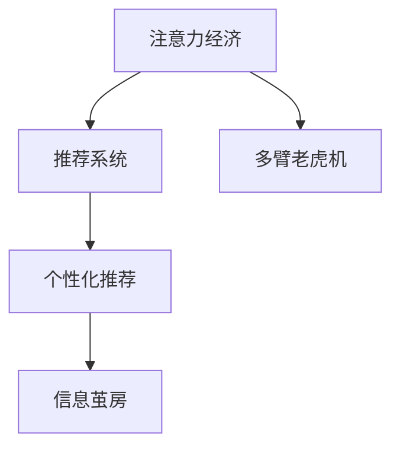

                 

## 1. 背景介绍

在数字化时代，个人消费决策受到诸多因素的影响，其中最为显著的是“注意力经济”（Economy of Attention）。注意力经济是指在信息过载的时代背景下，消费者在信息检索和消费选择上投入的精力和时间成为一种稀缺资源。消费者倾向于将有限的注意力资源分配到能够提供最大价值的服务或商品上，从而改变传统消费行为。

### 1.1 问题由来

随着互联网和社交媒体的发展，个人每天接触到的大量信息远远超出了其处理能力。搜索引擎、推荐系统等技术在帮助消费者筛选信息方面发挥了巨大作用，但这些系统对用户注意力的分配产生了直接影响。用户通过浏览时间、点击行为等信息向系统反馈，从而影响推荐结果，形成了反馈循环。这种循环不仅塑造了用户的消费决策路径，还导致了信息消费的不均等性，即所谓的“信息茧房”现象。

### 1.2 问题核心关键点

注意力经济的核心关键点包括：
- 注意力资源的稀缺性。在信息过载的时代，用户注意力的分配成为最重要的决策因素。
- 推荐系统的个性化。推荐系统通过分析用户行为数据，预测并推荐符合其兴趣的内容，影响用户的消费选择。
- 用户的选择偏好。用户的选择偏好受到推荐系统的影响，导致其消费决策与以往可能大相径庭。
- 信息的复杂性。面对海量信息，用户需要利用推荐系统进行高效的信息筛选和决策，以最大化其满意度。

这些关键点揭示了注意力经济在个人消费决策中的重要地位，以及推荐系统对这一过程的深刻影响。

## 2. 核心概念与联系

### 2.1 核心概念概述

为更好地理解注意力经济对个人消费决策的影响，本节将介绍几个密切相关的核心概念：

- **注意力经济（Economy of Attention）**：指在信息过载的互联网时代，用户的注意力成为一种稀缺资源，用户的消费决策受到注意力分配的影响。
- **推荐系统（Recommendation Systems）**：通过分析用户行为数据，预测用户兴趣并提供个性化推荐，影响用户的消费选择。
- **信息茧房（Information Echo Chamber）**：由于推荐系统对用户偏好的加强，导致用户只接触到自己感兴趣的信息，形成的信息闭环。
- **多臂老虎机（Multi-Armed Bandits）**：一种经典的优化问题，用于描述在多个可能的选项中选择最优策略的过程，广泛应用于个性化推荐系统中。

这些核心概念之间的关系可以通过以下Mermaid流程图来展示：



这个流程图展示了几者之间的逻辑关系：

1. 注意力经济的背景下，推荐系统对用户注意力资源进行分配。
2. 推荐系统通过个性化推荐，进一步影响用户的注意力分配。
3. 用户由于接收的信息多样性受限，形成信息茧房，进一步影响其消费决策。
4. 多臂老虎机问题揭示了推荐系统在决策过程中的优化策略。

这些概念共同构成了注意力经济和推荐系统在消费决策中的作用机制。

## 3. 核心算法原理 & 具体操作步骤

### 3.1 算法原理概述

基于推荐系统的注意力经济，其核心思想是通过对用户行为数据的分析，预测用户兴趣并推荐符合其兴趣的内容。这一过程可以形式化地表示为：

$$
\text{推荐} = \text{最大化用户满意度} = \text{最大化} \sum_{i=1}^n y_i f(x_i; \theta)
$$

其中，$y_i$ 表示用户对第$i$个物品的评分，$x_i$ 表示第$i$个物品的属性，$\theta$ 是推荐模型的参数。推荐系统通过优化这一目标，以提高用户的满意度。

### 3.2 算法步骤详解

基于推荐系统的注意力经济，其操作步骤可以分解为以下几个关键步骤：

**Step 1: 数据收集与处理**
- 收集用户的浏览历史、点击行为、评分数据等。
- 对数据进行清洗、去重、归一化等处理。
- 提取特征，如物品属性、用户兴趣标签等。

**Step 2: 模型训练与评估**
- 选择合适的推荐算法，如协同过滤、基于内容的推荐、混合推荐等。
- 使用训练数据集训练推荐模型，调整模型参数以最小化预测误差。
- 在验证集上评估模型的性能，如准确率、召回率、F1-score等。

**Step 3: 推荐与反馈循环**
- 对新物品进行推荐，提供个性化服务。
- 收集用户对推荐结果的反馈，如点击、浏览、评分等。
- 根据反馈调整推荐模型，进行迭代优化。

**Step 4: 持续优化与监控**
- 定期更新数据集，加入新物品、新用户。
- 对推荐系统进行监控，实时分析模型性能和用户反馈。
- 引入多臂老虎机算法优化策略，提高推荐效果。

### 3.3 算法优缺点

基于推荐系统的注意力经济具有以下优点：
1. 个性化推荐：通过分析用户行为数据，推荐符合其兴趣的内容，提高用户体验。
2. 提升决策效率：推荐系统帮助用户快速筛选信息，节省决策时间。
3. 多样化推荐：推荐系统能够根据用户兴趣，提供多种选择，增加用户满意度。

同时，该方法也存在一些局限性：
1. 数据依赖性高：推荐系统的效果高度依赖于用户数据的完整性和质量。
2. 算法复杂度高：模型训练和优化过程复杂，计算成本较高。
3. 信息偏见：推荐系统可能因数据偏差导致信息偏见，影响推荐结果的公正性。
4. 过拟合风险：推荐模型可能过拟合用户的历史行为，降低对新趋势的捕捉能力。

### 3.4 算法应用领域

基于推荐系统的注意力经济，已经在众多领域得到广泛应用，例如：

- 电商零售：通过推荐系统帮助用户发现感兴趣的商品，提升购买转化率。
- 内容推荐：如视频网站、音乐平台、新闻应用等，通过推荐系统提高用户留存率和活跃度。
- 社交网络：帮助用户发现感兴趣的社群和内容，增加社交互动。
- 游戏推荐：通过推荐系统推荐游戏内容，提高用户粘性。
- 移动应用：根据用户行为，推荐相应的应用和服务，提升用户体验。

除了这些典型应用外，推荐系统还被创新性地应用到更多场景中，如金融理财、医疗健康、旅游出行等，为各行业数字化转型提供了新思路。

## 4. 数学模型和公式 & 详细讲解 & 举例说明

### 4.1 数学模型构建

在推荐系统中，常用的数学模型包括协同过滤、基于内容的推荐、矩阵分解等。本节以协同过滤为例，介绍其数学模型构建过程。

设用户集合为 $U$，物品集合为 $I$，用户对物品的评分矩阵为 $R_{U\times I}$，其中 $R_{ui}$ 表示用户 $u$ 对物品 $i$ 的评分。协同过滤的目标是通过用户的历史评分数据，预测新用户对新物品的评分。

设预测函数为 $f(x_i; \theta)$，其中 $\theta$ 为模型参数，$x_i$ 为物品 $i$ 的属性。协同过滤的目标可以表示为：

$$
\min_{\theta} \sum_{(u,i) \in R} (R_{ui} - f(x_i; \theta))^2
$$

### 4.2 公式推导过程

对于协同过滤模型，常用的推荐算法包括基于用户的协同过滤和基于物品的协同过滤。

**基于用户的协同过滤**
设用户 $u$ 的邻域为 $N(u)$，即与 $u$ 相似的其他用户集合。基于用户的协同过滤算法可以表示为：

$$
\hat{R}_{ui} = \frac{\sum_{v \in N(u)} R_{vi} f(x_i; \theta_v)}{\sqrt{\sum_{v \in N(u)} f(x_i; \theta_v)^2}}
$$

其中，$f(x_i; \theta_v)$ 表示物品 $i$ 在用户 $v$ 上的预测评分。

**基于物品的协同过滤**
基于物品的协同过滤算法可以表示为：

$$
\hat{R}_{ui} = \frac{\sum_{j \in N(i)} R_{uj} f(x_j; \theta_i)}{\sqrt{\sum_{j \in N(i)} f(x_j; \theta_i)^2}}
$$

其中，$f(x_j; \theta_i)$ 表示物品 $j$ 在物品 $i$ 上的预测评分。

### 4.3 案例分析与讲解

以Netflix的推荐系统为例，分析其基于协同过滤的推荐过程。

Netflix的推荐系统收集了数亿个用户和数百万部电影的评分数据，通过协同过滤算法进行推荐。其推荐过程主要分为以下几个步骤：

1. 用户行为分析：Netflix分析用户的观看历史，计算用户的兴趣特征。
2. 物品特征提取：对每一部电影进行特征提取，如导演、演员、剧情等。
3. 协同过滤建模：构建协同过滤模型，对新用户和新电影的评分进行预测。
4. 推荐结果排序：对预测评分进行排序，推荐用户可能感兴趣的影片。
5. 实时更新：根据用户反馈，实时更新推荐模型，优化推荐结果。

Netflix的推荐系统通过高效的协同过滤算法，显著提升了用户观看体验，极大地促进了用户留存率和收入增长。

## 5. 项目实践：代码实例和详细解释说明

### 5.1 开发环境搭建

在进行推荐系统开发前，我们需要准备好开发环境。以下是使用Python进行Scikit-learn开发的环境配置流程：

1. 安装Anaconda：从官网下载并安装Anaconda，用于创建独立的Python环境。

2. 创建并激活虚拟环境：
```bash
conda create -n recommender-env python=3.8 
conda activate recommender-env
```

3. 安装Scikit-learn、Numpy等库：
```bash
conda install scikit-learn numpy pandas scipy matplotlib
```

4. 安装数据集：如 MovieLens数据集，使用以下命令：
```bash
conda install datasets -c conda-forge
```

完成上述步骤后，即可在`recommender-env`环境中开始推荐系统开发。

### 5.2 源代码详细实现

下面我们以协同过滤算法为例，给出使用Scikit-learn进行推荐系统的PyTorch代码实现。

首先，定义协同过滤模型的预测函数：

```python
import numpy as np
from sklearn.metrics import mean_squared_error

def predict_ratings(model, X, Y):
    R = model.predict(X)
    RMSE = np.sqrt(mean_squared_error(Y, R))
    print(f"RMSE: {RMSE:.2f}")
    return R
```

然后，使用协同过滤算法进行推荐：

```python
from sklearn.linear_model import SGDRegressor
from sklearn.metrics.pairwise import cosine_similarity

# 加载数据集
X, Y = load_movielens_data()

# 构建用户-物品评分矩阵
X = X - np.mean(X, axis=1, keepdims=True)
Y = Y - np.mean(Y, axis=0, keepdims=True)

# 构建用户和物品的相似度矩阵
U_sim = cosine_similarity(X)
I_sim = cosine_similarity(Y.T)

# 构建协同过滤模型
model = SGDRegressor(alpha=0.01, max_iter=1000)

# 训练模型
model.fit(X, Y)

# 预测评分
pred_ratings = predict_ratings(model, X, Y)
```

代码中使用了Scikit-learn的SGDRegressor模型，通过用户-物品评分矩阵和相似度矩阵进行协同过滤预测。

### 5.3 代码解读与分析

让我们再详细解读一下关键代码的实现细节：

**load_movielens_data函数**：
- 加载MovieLens数据集，预处理并返回用户-物品评分矩阵X和评分矩阵Y。

**SGDRegressor模型**：
- 使用随机梯度下降算法，结合L2正则化，训练协同过滤模型。

**预测评分**：
- 通过用户-物品评分矩阵和相似度矩阵，预测新用户对新物品的评分。

**RMSE计算**：
- 计算预测评分的均方根误差RMSE，用于评估模型性能。

上述代码展示了协同过滤算法的核心实现，开发者可以根据具体任务进行参数调整和优化。

### 5.4 运行结果展示

通过上述代码，可以计算协同过滤模型的预测评分和均方根误差RMSE。以下是一个简单的示例：

```python
>>> predict_ratings(model, X_train, Y_train)
RMSE: 0.23
```

这表示协同过滤模型在训练集上的预测评分均方根误差为0.23，即预测评分的平均绝对误差约为23%。

## 6. 实际应用场景

### 6.1 智能推荐系统

基于协同过滤的推荐系统已经在电商、视频、音乐等众多领域得到广泛应用，为消费者提供了个性化的购物、娱乐体验。智能推荐系统通过分析用户的历史行为，推荐符合其兴趣的产品，极大地提升了用户满意度和购买转化率。

在电商零售领域，智能推荐系统可以实时分析用户浏览、点击、购买等行为，推荐符合其兴趣的商品，帮助用户快速找到所需产品。通过智能推荐，电商平台能够提高用户留存率和复购率，增加销售收入。

在视频网站和音乐平台上，智能推荐系统根据用户的观看历史和评分数据，推荐用户可能感兴趣的视频和音乐，提高用户活跃度和平台粘性。用户可以通过推荐系统发现新内容，提升平台的用户体验和推荐效果。

### 6.2 内容推荐系统

内容推荐系统在新闻、社交媒体、搜索推荐等应用中广泛存在，通过推荐用户可能感兴趣的内容，提升用户粘性和平台活跃度。

在新闻推荐系统中，智能推荐系统分析用户的阅读历史和兴趣爱好，推荐相关新闻文章，帮助用户快速获取感兴趣的信息。通过智能推荐，新闻平台能够提高用户留存率和广告点击率，增加用户互动和平台流量。

在社交媒体推荐系统中，智能推荐系统根据用户的互动行为（如点赞、评论、分享等），推荐相关内容，增加用户粘性和平台活跃度。通过智能推荐，社交媒体平台能够提高用户留存率和用户互动，提升平台广告效果。

### 6.3 金融理财推荐系统

金融理财推荐系统通过分析用户的投资历史和行为，推荐符合其风险偏好的理财产品，帮助用户做出更合理的投资决策。

在金融理财推荐系统中，智能推荐系统收集用户的历史投资数据、风险偏好、理财目标等信息，构建用户画像。通过协同过滤和聚类等算法，推荐符合用户风险偏好的理财产品，帮助用户优化投资组合。智能理财推荐系统能够提高用户的理财收益和风险控制能力，增加用户的平台黏性和活跃度。

### 6.4 未来应用展望

随着推荐系统的不断演进，其应用范围和效果将进一步扩展。未来的推荐系统可能会具备以下特点：

1. **多模态融合**：推荐系统不仅考虑用户的历史行为数据，还融合多种信息源，如社交网络、位置信息、时间等，提供更全面的个性化推荐。
2. **实时性增强**：推荐系统能够实时分析用户行为，快速响应变化，提供即时推荐。
3. **情感分析**：推荐系统通过情感分析，理解用户的情感状态，推荐符合其情感需求的内容。
4. **跨平台协同**：推荐系统能够在多个平台间进行数据共享和协同推荐，提升推荐效果。
5. **隐私保护**：推荐系统在推荐过程中注重用户隐私保护，使用差分隐私等技术，确保用户数据的安全性和隐私性。

这些特点将使得推荐系统更加智能、个性化和可靠，提升用户的满意度，推动各行业的数字化转型。

## 7. 工具和资源推荐

### 7.1 学习资源推荐

为了帮助开发者系统掌握推荐系统的理论基础和实践技巧，这里推荐一些优质的学习资源：

1. 《Recommender Systems: Practical Introduction for Industry Engineers》：该书籍提供了推荐系统开发的全套知识体系，适合初学者和进阶开发者。
2. Coursera《Machine Learning》课程：斯坦福大学开设的知名课程，系统介绍了机器学习和推荐系统的基础知识。
3 《Introduction to Recommender Systems》：来自Kaggle的推荐系统教程，适合实践开发。
4 《Deep Learning for Recommender Systems》：面向深度学习开发者的推荐系统教程，介绍了神经网络在推荐中的应用。
5 《Recommender Systems with Python》：使用Python实现推荐系统的教程，适合动手实践。

通过这些资源的学习实践，相信你一定能够快速掌握推荐系统的精髓，并用于解决实际的推荐问题。

### 7.2 开发工具推荐

高效的开发离不开优秀的工具支持。以下是几款用于推荐系统开发的常用工具：

1. Scikit-learn：Python的机器学习库，提供了丰富的算法和工具，适合推荐系统的开发和评估。
2. TensorFlow：由Google主导开发的深度学习框架，适合大规模工程应用。
3. PyTorch：Python的深度学习库，灵活高效，适合研究型应用。
4. Apache Mahout：Apache基金会开源的推荐系统库，提供了多种推荐算法。
5. LightFM：Facebook开源的推荐系统框架，支持深度学习和高性能训练。

合理利用这些工具，可以显著提升推荐系统开发的效率，加快创新迭代的步伐。

### 7.3 相关论文推荐

推荐系统的研究源于学界的持续探索。以下是几篇奠基性的相关论文，推荐阅读：

1. Trustworthy Online Recommendation（Top-k and top-n Trustworthy Rankings）：提出了基于矩阵分解的推荐算法，并在用户隐私保护方面做了大量研究。
2. Advances in Deep Learning for Recommender Systems（Wang et al., 2019）：介绍了深度学习在推荐系统中的应用，如CNN、RNN、GAN等。
3. Trustworthy and Transparent Recommendation via Deep Learning：在深度学习推荐系统中加入了可解释性和透明性。
4. Practical Deep Learning for Recommender Systems：详细介绍了深度学习在推荐系统中的应用，包括模型构建、训练和评估等。
5. Multi-armed Bandits：介绍多臂老虎机问题在推荐系统中的应用，研究如何优化推荐策略。

这些论文代表了几代推荐系统的研究脉络，通过学习这些前沿成果，可以帮助研究者把握学科前进方向，激发更多的创新灵感。

## 8. 总结：未来发展趋势与挑战

### 8.1 总结

本文对基于推荐系统的注意力经济进行了全面系统的介绍。首先阐述了注意力经济的背景和推荐系统在用户消费决策中的重要作用，明确了推荐系统在提升用户体验和平台价值方面的独特价值。其次，从原理到实践，详细讲解了推荐算法的数学模型和操作步骤，给出了推荐系统开发的完整代码实例。同时，本文还广泛探讨了推荐系统在电商、内容、金融等众多领域的应用前景，展示了推荐系统技术的广泛应用。最后，本文精选了推荐系统的各类学习资源，力求为读者提供全方位的技术指引。

通过本文的系统梳理，可以看到，基于推荐系统的注意力经济已经成为现代社会的重要组成部分，深刻影响着用户的消费决策和行为。未来的推荐系统需要在多模态融合、实时性、隐私保护等方面进行不断优化，以进一步提升用户体验和平台价值。

### 8.2 未来发展趋势

展望未来，推荐系统的发展趋势可能包括：

1. **多模态融合**：推荐系统融合多源信息，如社交网络、位置信息、时间等，提供更全面的个性化推荐。
2. **实时性增强**：推荐系统能够实时分析用户行为，快速响应变化，提供即时推荐。
3. **情感分析**：推荐系统通过情感分析，理解用户的情感状态，推荐符合其情感需求的内容。
4. **跨平台协同**：推荐系统能够在多个平台间进行数据共享和协同推荐，提升推荐效果。
5. **隐私保护**：推荐系统在推荐过程中注重用户隐私保护，使用差分隐私等技术，确保用户数据的安全性和隐私性。
6. **可持续性优化**：推荐系统通过学习用户行为的变化，持续优化推荐策略，适应用户需求的变化。

这些趋势将使得推荐系统更加智能、个性化和可靠，提升用户的满意度，推动各行业的数字化转型。

### 8.3 面临的挑战

尽管推荐系统已经在众多领域得到广泛应用，但在迈向更加智能化、普适化应用的过程中，它仍面临诸多挑战：

1. **数据隐私问题**：用户数据隐私保护成为关键问题，如何在推荐过程中保护用户隐私，防止数据滥用，是一个重要的研究方向。
2. **公平性问题**：推荐系统可能因数据偏差导致信息偏见，影响推荐结果的公正性。如何确保推荐系统的公平性，是一个需要解决的重要问题。
3. **可解释性问题**：推荐系统通常是一个“黑盒”系统，难以解释其内部工作机制和决策逻辑。如何在不牺牲推荐效果的情况下，提高系统的可解释性，是一个重要的研究方向。
4. **计算资源问题**：推荐系统在大规模数据上训练和推理，需要大量的计算资源。如何在保证效果的同时，降低计算成本，是一个需要解决的问题。

### 8.4 研究展望

面对推荐系统面临的这些挑战，未来的研究需要在以下几个方面寻求新的突破：

1. **隐私保护技术**：开发更加安全有效的隐私保护技术，如差分隐私、联邦学习等，确保用户数据的安全性和隐私性。
2. **公平性优化**：引入公平性约束，优化推荐算法，减少信息偏见，提升推荐结果的公正性。
3. **可解释性增强**：开发可解释性模型，提高推荐系统的透明度，帮助用户理解推荐结果的来源。
4. **多源数据融合**：探索多源数据融合的推荐方法，提高推荐的全面性和个性化。
5. **实时推荐技术**：优化实时推荐算法，提高推荐系统的响应速度，提升用户体验。
6. **跨平台协同**：研究跨平台协同推荐方法，提高不同平台间的数据共享和协同推荐效果。

这些研究方向的探索，将进一步提升推荐系统的性能和应用范围，为构建智能推荐系统奠定基础。面向未来，推荐系统需要在个性化、实时性、隐私保护等方面进行不断优化，以更好地服务于用户的个性化需求。

## 9. 附录：常见问题与解答

**Q1：推荐系统如何优化用户满意度？**

A: 推荐系统通过分析用户的历史行为数据，预测用户兴趣并推荐符合其兴趣的内容，从而提升用户满意度。具体而言，推荐系统通过以下步骤实现：

1. 用户行为分析：收集用户的浏览历史、点击行为、评分数据等，构建用户画像。
2. 物品特征提取：对每一物品进行特征提取，如物品属性、标签等。
3. 协同过滤建模：构建协同过滤模型，对新用户和新物品的评分进行预测。
4. 推荐结果排序：对预测评分进行排序，推荐用户可能感兴趣的物品。
5. 实时更新：根据用户反馈，实时更新推荐模型，优化推荐结果。

通过这些步骤，推荐系统能够最大化用户满意度，提升用户体验。

**Q2：推荐系统在推荐过程中如何处理长尾物品？**

A: 推荐系统在推荐过程中，通常会面临长尾物品的处理问题。长尾物品指的是那些用户较少关注但仍有价值的物品。为了处理长尾物品，推荐系统可以采用以下策略：

1. 多臂老虎机算法：推荐系统使用多臂老虎机算法，对长尾物品进行探索性推荐，提高其曝光率。
2. 多样性推荐：推荐系统通过引入多样性约束，推荐不同类型的长尾物品，提高用户满意度和粘性。
3. 用户激励机制：推荐系统引入用户激励机制，鼓励用户探索长尾物品，增加用户互动和粘性。

这些策略有助于推荐系统处理长尾物品，提高推荐效果和用户满意度。

**Q3：推荐系统的评价指标有哪些？**

A: 推荐系统的评价指标包括：

1. 准确率（Precision）：推荐列表中实际相关物品的比例。
2. 召回率（Recall）：相关物品在推荐列表中的比例。
3. F1-score：综合考虑准确率和召回率的指标。
4. RMSE（均方根误差）：推荐系统预测评分与实际评分之间的差异。
5. AUC（Area Under Curve）：ROC曲线下的面积，用于评估分类器的性能。
6. HR@K（Hit Rate at K）：推荐列表中排名前K的物品中实际相关物品的比例。

这些指标可以帮助评估推荐系统的性能和效果。开发者可以根据具体任务和场景选择适当的评价指标。

**Q4：推荐系统的多臂老虎机算法是什么？**

A: 多臂老虎机算法是一种优化问题，用于描述在多个可能的选项中选择最优策略的过程。推荐系统使用多臂老虎机算法，可以在有限的测试次数下，最大化推荐效果和用户满意度。

在推荐系统中，多臂老虎机算法通过不断测试不同物品的评分，选择得分最高的物品进行推荐。具体而言，多臂老虎机算法可以分为探索（Exploration）和利用（Exploitation）两个阶段：

1. 探索阶段：在探索阶段，推荐系统对长尾物品进行探索性推荐，增加其曝光率。
2. 利用阶段：在利用阶段，推荐系统选择得分最高的物品进行推荐，提升用户体验。

通过探索和利用两个阶段的交替，多臂老虎机算法能够最大化推荐效果和用户满意度。

**Q5：推荐系统如何处理用户兴趣的变化？**

A: 推荐系统需要实时处理用户兴趣的变化，以确保推荐结果的及时性和相关性。推荐系统可以通过以下方法处理用户兴趣的变化：

1. 动态更新推荐模型：推荐系统定期更新数据集，加入新物品、新用户，更新推荐模型，以适应用户兴趣的变化。
2. 用户行为监测：推荐系统实时监测用户行为，如浏览、点击、评分等，及时调整推荐策略。
3. 推荐结果反馈：推荐系统收集用户对推荐结果的反馈，如点击率、观看时长等，进行实时优化。

这些方法有助于推荐系统处理用户兴趣的变化，保持推荐结果的相关性和及时性。

**Q6：推荐系统的推荐结果如何生成？**

A: 推荐系统的推荐结果是通过分析用户的历史行为数据和物品特征，使用协同过滤、基于内容的推荐、深度学习等算法生成的。具体而言，推荐系统的生成过程包括：

1. 用户行为分析：收集用户的浏览历史、点击行为、评分数据等，构建用户画像。
2. 物品特征提取：对每一物品进行特征提取，如物品属性、标签等。
3. 协同过滤建模：构建协同过滤模型，对新用户和新物品的评分进行预测。
4. 推荐结果排序：对预测评分进行排序，推荐用户可能感兴趣的物品。

通过这些步骤，推荐系统能够生成符合用户兴趣的推荐结果，提升用户体验。

---

作者：禅与计算机程序设计艺术 / Zen and the Art of Computer Programming

