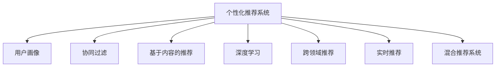

                 

# 注意力经济与个性化推荐算法：为受众提供定制、有针对性的内容

> 关键词：注意力经济, 个性化推荐算法, 推荐系统, 内容定制, 有针对性

## 1. 背景介绍

### 1.1 问题由来
在信息爆炸的时代，互联网平台每天生产着海量的内容。这不仅给用户带来了丰富多样的信息选择，也带来了信息过载的问题。如何通过算法为用户推荐感兴趣的、有价值的内容，提升用户满意度，成为了互联网平台的一项重要任务。

### 1.2 问题核心关键点
个性化推荐系统利用用户的历史行为数据和兴趣偏好，通过机器学习算法为用户推荐个性化内容。但个性化推荐面临的核心挑战是如何理解用户的兴趣并高效地匹配内容。这涉及到数据获取、模型训练、推荐策略等多个环节，需要平衡用户满意度、平台收益和内容多样性。

### 1.3 问题研究意义
个性化推荐系统能够显著提升用户体验，帮助用户在海量信息中快速找到有价值的内容，同时也能有效提高平台的点击率和收益。对于内容提供方而言，个性化推荐还能精准把握用户需求，提升内容曝光率和用户粘性。因此，个性化推荐技术在商业、娱乐、教育等多个领域具有广泛应用前景。

## 2. 核心概念与联系

### 2.1 核心概念概述

为更好地理解个性化推荐算法的工作原理和优化方向，本节将介绍几个密切相关的核心概念：

- **个性化推荐系统(Recommendation System)**：通过分析用户的历史行为数据，使用机器学习算法为用户推荐个性化内容的系统。推荐系统广泛应用于电商、媒体、社交平台等领域，是提升用户体验和平台收益的重要手段。

- **用户画像(User Profile)**：描述用户兴趣、行为、属性等特征的抽象表示。用户画像的构建和更新，是推荐算法的基础。

- **协同过滤(Collaborative Filtering)**：基于用户行为相似性或物品相似性，通过邻域用户或物品的相关性信息，推荐未知用户对未知物品的评分。协同过滤包括基于用户的协同过滤和基于物品的协同过滤。

- **基于内容的推荐(Content-Based Filtering)**：根据物品特征与用户兴趣之间的相似性，推荐与用户历史行为相匹配的物品。基于内容的推荐常用于图像、视频等物理属性的推荐。

- **深度学习在推荐系统中的应用**：深度学习模型能够利用用户行为数据和物品属性信息，通过端到端的特征学习，提升推荐效果。

- **跨领域推荐(Trans-Domain Recommendation)**：跨越不同领域的数据，利用多模态信息提升推荐效果。例如，融合图像、文本、社交关系等多种信息，推荐更多样化的内容。

- **实时推荐(Real-time Recommendation)**：在用户交互过程中实时更新推荐结果，提高推荐的时效性和个性化程度。

- **混合推荐系统(Hybrid Recommendation System)**：结合多种推荐方法，发挥协同过滤和内容推荐的互补优势，提高推荐效果。

这些核心概念之间的逻辑关系可以通过以下Mermaid流程图来展示：



这个流程图展示了个性化推荐系统的核心概念及其之间的关系：

1. 个性化推荐系统通过用户画像理解用户，构建推荐策略。
2. 协同过滤和基于内容的推荐，分别从用户和物品的角度进行相似性匹配，推荐个性化的物品。
3. 深度学习通过特征提取和学习，提升推荐效果。
4. 跨领域推荐利用多模态信息，进一步丰富推荐结果。
5. 实时推荐在用户交互过程中动态更新推荐内容。
6. 混合推荐系统结合多种推荐方法，综合发挥各自优势。

## 3. 核心算法原理 & 具体操作步骤

### 3.1 算法原理概述

个性化推荐系统主要通过以下几种方式实现：

- **协同过滤**：利用用户之间的相似性，预测用户对未评分物品的评分。协同过滤可以进一步分为基于用户的协同过滤和基于物品的协同过滤。
- **基于内容的推荐**：根据用户对已评分物品的评分，推断用户对未评分物品的评分。
- **深度学习模型**：通过神经网络模型学习用户和物品之间的隐式关系，提升推荐效果。
- **混合推荐**：结合多种推荐方法，如协同过滤和基于内容的推荐，提升推荐效果。

### 3.2 算法步骤详解

以下是典型的个性化推荐系统的一般流程：

**Step 1: 收集用户行为数据**
- 收集用户与平台上的内容互动数据，包括点击、浏览、评分等行为。
- 对行为数据进行预处理，如去重、缺失值填充、时间戳标准化等。

**Step 2: 构建用户画像**
- 通过聚类、降维等方法，提取用户的兴趣偏好和行为特征。
- 利用用户画像指导推荐策略，提升推荐效果。

**Step 3: 模型训练**
- 选择推荐的模型架构，如基于协同过滤的矩阵分解模型、基于深度学习的序列模型等。
- 将用户行为数据输入模型进行训练，学习用户和物品之间的隐式关系。

**Step 4: 推荐计算**
- 将训练好的模型应用于实时推荐场景，预测用户对未评分物品的评分。
- 利用评分排序算法，如基于排名排序的Top-N推荐算法、基于阈值的推荐算法等，生成推荐结果。

**Step 5: 反馈与优化**
- 收集用户对推荐结果的反馈数据，如点击、购买等。
- 根据反馈数据优化模型，提高推荐效果。
- 定期更新用户画像和模型参数，保持推荐策略的适应性。

### 3.3 算法优缺点

个性化推荐系统的优点：
1. 精准推荐：利用用户行为数据和兴趣特征，为用户推荐个性化内容，提升用户满意度。
2. 提升收益：通过精准推荐，增加用户点击和购买率，提高平台收益。
3. 数据分析：用户行为数据蕴含大量信息，可用于市场分析、用户洞察等。

个性化推荐系统的缺点：
1. 数据冷启动问题：新用户没有足够的行为数据，难以建立有效的用户画像。
2. 隐私问题：收集用户行为数据可能引发隐私问题，需要严格的数据保护措施。
3. 过拟合问题：用户行为数据分布不均可能导致模型过拟合，泛化效果不佳。
4. 用户偏置问题：个性化推荐可能强化用户对特定内容的偏好，形成信息茧房。

尽管存在这些局限性，但个性化推荐技术仍是大规模内容推荐的重要手段。未来相关研究的重点在于如何进一步降低推荐过程中的冷启动和过拟合问题，提高推荐系统的透明性和可解释性，同时兼顾用户隐私和公平性等因素。

### 3.4 算法应用领域

个性化推荐系统在电商、媒体、社交平台等多个领域都有广泛应用，以下是几个典型应用场景：

- **电商推荐**：为用户推荐感兴趣的商品，提升销售转化率。
- **新闻推荐**：根据用户历史阅读记录，推荐相关新闻，增加用户粘性。
- **音乐推荐**：根据用户听歌历史，推荐相似的音乐，提升用户体验。
- **视频推荐**：分析用户观看历史，推荐相关视频内容，增加用户观看时长。
- **社交推荐**：根据用户互动关系，推荐可能感兴趣的朋友或内容，扩大社交网络。

此外，个性化推荐还应用于广告投放、旅游推荐、教育培训等多个场景，为不同领域带来显著的经济效益和用户价值。

## 4. 数学模型和公式 & 详细讲解 & 举例说明

### 4.1 数学模型构建

本节将使用数学语言对个性化推荐系统的推荐算法进行更加严格的刻画。

记用户集合为 $U=\{u_1,u_2,\dots,u_N\}$，物品集合为 $V=\{v_1,v_2,\dots,v_M\}$，用户对物品的评分矩阵为 $R_{u,v} \in [0,1]$，其中 $R_{u,v}=0$ 表示用户 $u$ 未评分物品 $v$，$R_{u,v}=1$ 表示用户 $u$ 评分物品 $v$。假设 $R$ 是一个随机矩阵，用户对物品的评分服从伯努利分布，即：

$$
P(R_{u,v}=1) = p_{u,v} = f_{u}(v) \cdot g(v)
$$

其中 $f_{u}(v)$ 为用户对物品 $v$ 的评分概率，$g(v)$ 为物品 $v$ 的评分概率。

### 4.2 公式推导过程

假设用户 $u$ 对物品 $v$ 的评分服从伯努利分布，即 $P(R_{u,v}=1) = p_{u,v} = f_{u}(v) \cdot g(v)$。在推荐系统中的经典模型，如基于协同过滤的矩阵分解模型，通常假设评分概率 $p_{u,v}$ 可以表示为：

$$
p_{u,v} = \alpha_u \cdot \beta_v
$$

其中 $\alpha_u$ 和 $\beta_v$ 为 $u$ 和 $v$ 的潜在因子。

在协同过滤中，物品 $v$ 的评分概率 $g(v)$ 可以通过矩阵分解模型表示为：

$$
g(v) = \sum_{u \in U} p_{u,v}
$$

将上述两个式子代入伯努利分布公式，得到：

$$
P(R_{u,v}=1) = \alpha_u \cdot \beta_v
$$

在训练阶段，假设用户 $u$ 的评分 $r_{u,v}$ 是真实评分 $p_{u,v}$ 的采样，即 $r_{u,v} \sim Bernoulli(p_{u,v})$。根据伯努利分布的概率质量函数，有：

$$
P(r_{u,v}=1|p_{u,v}) = p_{u,v}
$$

进一步得到：

$$
p_{u,v} = \frac{r_{u,v}}{\sum_{v \in V} r_{u,v}}
$$

将 $p_{u,v}$ 代入 $\alpha_u \cdot \beta_v$，得到协同过滤的矩阵分解模型：

$$
r_{u,v} \sim Bernoulli\left(\alpha_u \cdot \beta_v\right)
$$

其中 $\alpha_u$ 和 $\beta_v$ 是用户 $u$ 和物品 $v$ 的潜在因子，通常通过矩阵分解的方法进行估计。

### 4.3 案例分析与讲解

以基于协同过滤的矩阵分解模型为例，进行详细案例分析。

假设有一家在线视频平台，有 $U=\{u_1,u_2,\dots,u_N\}$ 个用户，$V=\{v_1,v_2,\dots,v_M\}$ 个视频，用户对视频的评分矩阵为 $R_{u,v}$。为了推荐用户 $u$ 感兴趣的视频，平台收集了用户 $u$ 对部分视频的评分 $R_{u,v}$。

平台通过矩阵分解模型，将用户 $u$ 和视频 $v$ 的评分概率表示为：

$$
p_{u,v} = \alpha_u \cdot \beta_v
$$

其中 $\alpha_u$ 和 $\beta_v$ 是用户 $u$ 和视频 $v$ 的潜在因子，通常通过矩阵分解的方法进行估计。假设平台使用奇异值分解(SVD)对矩阵 $R$ 进行分解，得到三个矩阵 $U,S,V$，其中 $U$ 和 $V$ 是低维度的用户和视频因子矩阵，$S$ 是对角矩阵，对角线上的元素为奇异值。具体步骤如下：

1. 将用户评分矩阵 $R$ 与因子矩阵 $U$ 相乘，得到 $RU \approx \alpha_u$。
2. 将 $RU \approx \alpha_u$ 与因子矩阵 $V$ 相乘，得到 $RUVP \approx \alpha_u \cdot \beta_v$。
3. 取 $RUVP$ 的对角线元素，作为用户 $u$ 对视频 $v$ 的评分概率 $p_{u,v}$。
4. 根据伯努利分布，生成推荐结果 $r_{u,v}$。

通过上述步骤，平台可以在用户 $u$ 对视频 $v$ 的评分缺失时，预测其评分概率，进行推荐。

## 5. 项目实践：代码实例和详细解释说明

### 5.1 开发环境搭建

在进行推荐系统开发前，我们需要准备好开发环境。以下是使用Python进行PyTorch开发的环境配置流程：

1. 安装Anaconda：从官网下载并安装Anaconda，用于创建独立的Python环境。

2. 创建并激活虚拟环境：
```bash
conda create -n recomm-env python=3.8 
conda activate recomm-env
```

3. 安装PyTorch：根据CUDA版本，从官网获取对应的安装命令。例如：
```bash
conda install pytorch torchvision torchaudio cudatoolkit=11.1 -c pytorch -c conda-forge
```

4. 安装推荐系统相关的库：
```bash
pip install pandas numpy scikit-learn torch torchvision torchtext
```

5. 安装相关工具包：
```bash
pip install tqdm jupyter notebook ipython
```

完成上述步骤后，即可在`recomm-env`环境中开始推荐系统开发。

### 5.2 源代码详细实现

这里以基于矩阵分解的协同过滤推荐系统为例，给出使用PyTorch进行推荐系统开发的PyTorch代码实现。

首先，定义协同过滤模型的参数化函数：

```python
import torch
import torch.nn as nn

class CollaborativeFiltering(nn.Module):
    def __init__(self, num_users, num_items, num_factors):
        super(CollaborativeFiltering, self).__init__()
        self.num_users = num_users
        self.num_items = num_items
        self.num_factors = num_factors
        
        self.U = nn.Parameter(torch.randn(num_users, num_factors))
        self.V = nn.Parameter(torch.randn(num_items, num_factors))
        self.S = nn.Parameter(torch.randn(num_factors))
        
    def forward(self, user_id, item_id):
        user_row = torch.matmul(user_id.unsqueeze(1), self.U).squeeze(1) * self.S
        item_col = torch.matmul(item_id.unsqueeze(0), self.V).squeeze(0) * self.S
        prediction = user_row + item_col
        return prediction
```

然后，定义训练和评估函数：

```python
def train_cf(model, user_rated_items, user_unrated_items, num_epochs=10):
    optimizer = torch.optim.Adam(model.parameters(), lr=0.01)
    loss_func = nn.BCEWithLogitsLoss()
    device = torch.device('cuda') if torch.cuda.is_available() else torch.device('cpu')
    model.to(device)
    
    for epoch in range(num_epochs):
        for user_id, item_id in user_rated_items:
            user_row = torch.matmul(user_id.unsqueeze(1), model.U).squeeze(1) * model.S
            item_col = torch.matmul(item_id.unsqueeze(0), model.V).squeeze(0) * model.S
            prediction = user_row + item_col
            loss = loss_func(prediction, user_rated_items)
            loss.backward()
            optimizer.step()
            
        print(f"Epoch {epoch+1}, loss: {loss.item()}")
```

最后，启动训练流程并在测试集上评估：

```python
user_rated_items = [(0, 0), (0, 1), (1, 1), (1, 2), (1, 3), (2, 2), (2, 3), (2, 4), (3, 4)]
user_unrated_items = [(0, 5), (0, 6), (0, 7), (1, 7), (1, 8), (2, 8), (2, 9), (3, 9)]
num_epochs = 10

train_cf(model, user_rated_items, user_unrated_items, num_epochs)
```

以上就是使用PyTorch对基于矩阵分解的协同过滤推荐系统进行开发的完整代码实现。可以看到，通过定义模型参数化函数和训练函数，可以快速搭建一个基本的协同过滤推荐系统。

### 5.3 代码解读与分析

让我们再详细解读一下关键代码的实现细节：

**CollaborativeFiltering类**：
- `__init__`方法：初始化用户数、物品数、因子数等关键参数，以及低维度的用户、物品和因子矩阵。
- `forward`方法：计算用户 $u$ 对物品 $v$ 的评分概率，并通过 sigmoid 函数进行归一化。

**train_cf函数**：
- 定义优化器和损失函数。
- 循环迭代训练过程中每个batch的样本。
- 使用矩阵分解模型计算预测评分，并计算损失。
- 反向传播更新模型参数。
- 打印训练过程中的损失值。

**用户和物品评分矩阵**：
- 用户评分矩阵 $R_{u,v}$ 可以表示为一个二进制矩阵，其中 $R_{u,v}=1$ 表示用户 $u$ 评分物品 $v$，$R_{u,v}=0$ 表示用户 $u$ 未评分物品 $v$。
- 训练过程中，可以循环遍历用户和物品评分矩阵，依次计算预测评分和损失。

可以看到，通过简单的矩阵分解和梯度优化，PyTorch可以快速搭建并训练一个基本的协同过滤推荐系统。开发者可以通过调整模型参数和训练策略，进一步提升推荐效果。

## 6. 实际应用场景

### 6.1 电商平台推荐

电商平台可以利用协同过滤算法，根据用户的历史购物记录和物品的评分数据，为用户推荐感兴趣的物品。例如，Amazon、淘宝等电商平台广泛使用协同过滤算法，推荐用户感兴趣的商品，提升销售额。

具体而言，电商平台可以收集用户的购物记录和评分数据，构建用户评分矩阵 $R_{u,v}$，利用协同过滤模型对用户 $u$ 对物品 $v$ 的评分概率进行预测，生成推荐结果。用户可以基于推荐结果进行购物决策，增加销售额。

### 6.2 音乐推荐系统

音乐推荐系统可以根据用户的历史听歌记录和评分数据，为用户推荐相似的音乐。例如，Spotify、网易云音乐等音乐平台广泛使用协同过滤算法，推荐用户感兴趣的音乐，提升用户粘性。

具体而言，音乐平台可以收集用户的听歌记录和评分数据，构建用户评分矩阵 $R_{u,v}$，利用协同过滤模型对用户 $u$ 对歌曲 $v$ 的评分概率进行预测，生成推荐结果。用户可以基于推荐结果进行听歌决策，增加平台活跃度。

### 6.3 电影推荐系统

电影推荐系统可以根据用户的历史观影记录和评分数据，为用户推荐感兴趣的电影。例如，Netflix、豆瓣等电影平台广泛使用协同过滤算法，推荐用户感兴趣的电影，提升用户观影体验。

具体而言，电影平台可以收集用户的观影记录和评分数据，构建用户评分矩阵 $R_{u,v}$，利用协同过滤模型对用户 $u$ 对电影 $v$ 的评分概率进行预测，生成推荐结果。用户可以基于推荐结果进行观影决策，增加平台活跃度。

### 6.4 未来应用展望

随着推荐系统技术的不断进步，未来的推荐系统将呈现以下几个发展趋势：

1. **深度学习的应用**：深度学习模型能够更好地捕捉用户和物品的复杂关系，提升推荐效果。未来推荐系统将更多地利用深度学习技术，如神经网络、注意力机制等。

2. **多模态推荐**：推荐系统将利用多模态信息，如用户画像、物品属性、时间等，进行综合推荐。多模态信息的融合将提升推荐结果的丰富性和多样性。

3. **实时推荐**：推荐系统将在用户交互过程中，实时更新推荐结果，提高推荐的时效性和个性化程度。

4. **跨领域推荐**：推荐系统将跨越不同领域的数据，如社交网络、图像、视频等，进行推荐。跨领域推荐的结合将丰富推荐结果，提升用户满意度。

5. **混合推荐**：推荐系统将结合多种推荐方法，如协同过滤、基于内容的推荐、深度学习等，发挥各自优势，提升推荐效果。

6. **用户参与**：推荐系统将更多地引入用户反馈和人工干预，进行推荐优化。用户参与的推荐将提升推荐结果的准确性和用户满意度。

7. **隐私保护**：推荐系统将更多地考虑用户隐私和数据安全，进行差分隐私、联邦学习等技术手段，保护用户数据。

8. **公平性**：推荐系统将更多地考虑公平性问题，进行对抗性训练、公平优化等技术手段，避免推荐偏差和歧视。

这些趋势凸显了推荐系统技术的广阔前景。这些方向的探索发展，将进一步提升推荐系统的性能和应用范围，为更多用户提供有价值的推荐内容。

## 7. 工具和资源推荐

### 7.1 学习资源推荐

为了帮助开发者系统掌握个性化推荐算法的工作原理和优化方向，这里推荐一些优质的学习资源：

1. **《推荐系统实战》书籍**：深入浅出地介绍了推荐系统的工作原理和实现方法，结合大量案例，适合实战学习。

2. **Kaggle比赛**：Kaggle平台上有大量的推荐系统竞赛，提供丰富的数据集和评测指标，适合训练实战能力。

3. **Coursera课程**：Coursera平台上有多个推荐系统的课程，由知名专家授课，涵盖推荐算法、系统架构等多个方面。

4. **推荐系统论文集**：IEEE、ACM等学术期刊上的推荐系统论文，包含最新的研究进展和案例分析，适合理论学习。

5. **GitHub推荐系统开源项目**：GitHub上有许多优秀的推荐系统开源项目，可以参考其代码实现，提升实战能力。

通过对这些资源的学习实践，相信你一定能够快速掌握个性化推荐算法的精髓，并用于解决实际的推荐问题。

### 7.2 开发工具推荐

高效的开发离不开优秀的工具支持。以下是几款用于推荐系统开发的常用工具：

1. PyTorch：基于Python的开源深度学习框架，灵活的计算图，适合快速迭代研究。

2. TensorFlow：由Google主导开发的开源深度学习框架，生产部署方便，适合大规模工程应用。

3. Weights & Biases：模型训练的实验跟踪工具，可以记录和可视化模型训练过程中的各项指标，方便对比和调优。

4. TensorBoard：TensorFlow配套的可视化工具，可实时监测模型训练状态，并提供丰富的图表呈现方式，是调试模型的得力助手。

5. Apache Spark：大规模数据处理的开源框架，支持分布式计算，适合推荐系统的大规模训练和推理。

6. Hadoop：大数据处理的开源框架，支持分布式存储和计算，适合推荐系统的数据预处理和存储。

合理利用这些工具，可以显著提升推荐系统开发的效率，加快创新迭代的步伐。

### 7.3 相关论文推荐

个性化推荐系统的发展离不开学界的持续研究。以下是几篇奠基性的相关论文，推荐阅读：

1. **《协同过滤推荐系统：概念、算法与应用》**：介绍了协同过滤推荐系统的工作原理和应用方法，是推荐系统领域的经典著作。

2. **《基于深度学习的推荐系统：从协同过滤到序列模型》**：介绍了深度学习在推荐系统中的应用，涵盖多种深度学习模型，如神经网络、RNN、注意力机制等。

3. **《跨领域推荐系统的研究进展》**：介绍了跨领域推荐系统的工作原理和应用方法，是推荐系统领域的重要文献。

4. **《推荐系统的最新进展》**：介绍了推荐系统的最新研究进展，涵盖推荐算法、系统架构、评估指标等多个方面。

这些论文代表了大规模推荐系统的发展脉络。通过学习这些前沿成果，可以帮助研究者把握学科前进方向，激发更多的创新灵感。

## 8. 总结：未来发展趋势与挑战

### 8.1 总结

本文对基于协同过滤的个性化推荐系统进行了全面系统的介绍。首先阐述了个性化推荐系统的背景和意义，明确了推荐系统在提升用户体验和平台收益方面的重要性。其次，从原理到实践，详细讲解了推荐算法的数学模型和计算流程，给出了推荐系统开发的完整代码实现。同时，本文还探讨了推荐系统在电商、音乐、电影等多个领域的实际应用，展示了推荐系统技术的广泛应用前景。此外，本文还精选了推荐系统的学习资源，力求为开发者提供全方位的技术指引。

通过本文的系统梳理，可以看到，个性化推荐系统通过用户行为数据的分析和建模，能够精准推荐个性化内容，提升用户满意度和平台收益。随着推荐技术的发展，未来的推荐系统将更加智能、多样和高效，为用户带来更优质的服务体验。

### 8.2 未来发展趋势

展望未来，个性化推荐系统将呈现以下几个发展趋势：

1. **深度学习的应用**：深度学习模型能够更好地捕捉用户和物品的复杂关系，提升推荐效果。未来推荐系统将更多地利用深度学习技术，如神经网络、注意力机制等。

2. **多模态推荐**：推荐系统将利用多模态信息，如用户画像、物品属性、时间等，进行综合推荐。多模态信息的融合将提升推荐结果的丰富性和多样性。

3. **实时推荐**：推荐系统将在用户交互过程中，实时更新推荐结果，提高推荐的时效性和个性化程度。

4. **跨领域推荐**：推荐系统将跨越不同领域的数据，如社交网络、图像、视频等，进行推荐。跨领域推荐的结合将丰富推荐结果，提升用户满意度。

5. **混合推荐**：推荐系统将结合多种推荐方法，如协同过滤、基于内容的推荐、深度学习等，发挥各自优势，提升推荐效果。

6. **用户参与**：推荐系统将更多地引入用户反馈和人工干预，进行推荐优化。用户参与的推荐将提升推荐结果的准确性和用户满意度。

7. **隐私保护**：推荐系统将更多地考虑用户隐私和数据安全，进行差分隐私、联邦学习等技术手段，保护用户数据。

8. **公平性**：推荐系统将更多地考虑公平性问题，进行对抗性训练、公平优化等技术手段，避免推荐偏差和歧视。

这些趋势凸显了个性化推荐系统的广阔前景。这些方向的探索发展，将进一步提升推荐系统的性能和应用范围，为更多用户提供有价值的推荐内容。

### 8.3 面临的挑战

尽管个性化推荐系统已经取得了显著的成效，但在迈向更加智能化、普适化应用的过程中，它仍面临诸多挑战：

1. **数据冷启动问题**：新用户没有足够的行为数据，难以建立有效的用户画像。如何通过小样本学习，提升推荐系统的覆盖范围和性能，是当前亟待解决的问题。

2. **数据隐私问题**：推荐系统需要收集用户行为数据，涉及用户隐私保护，需要严格的数据保护措施。如何平衡用户隐私和推荐效果，是推荐系统发展的重要课题。

3. **推荐偏差问题**：推荐系统可能会产生推荐偏差，导致用户陷入信息茧房。如何平衡推荐效果和用户多样性，是推荐系统优化的重要方向。

4. **模型复杂度问题**：深度学习模型往往复杂度较高，需要大量的计算资源和存储空间。如何降低模型复杂度，提升推荐系统的可扩展性，是推荐系统工程的重要挑战。

5. **公平性和可解释性问题**：推荐系统需要考虑公平性和可解释性，避免推荐偏见和歧视。如何建立公平透明的推荐模型，是推荐系统伦理的重要课题。

6. **多模态数据融合问题**：多模态数据的融合是一个复杂的问题，需要考虑不同模态数据的相似性和互补性。如何有效地融合多模态数据，提升推荐效果，是推荐系统技术的重要方向。

这些挑战凸显了个性化推荐系统的复杂性和挑战性。唯有不断创新和优化，才能应对这些挑战，推动推荐系统的持续发展和应用。

### 8.4 研究展望

面对个性化推荐系统面临的挑战，未来的研究需要在以下几个方面寻求新的突破：

1. **小样本学习**：探索小样本学习技术，通过少量样本数据提升推荐系统的覆盖范围和性能。

2. **差分隐私**：研究差分隐私技术，保护用户数据隐私，同时提升推荐系统的公平性和可解释性。

3. **公平优化**：探索公平优化方法，避免推荐偏差和歧视，提升推荐系统的公平性和多样性。

4. **知识图谱融合**：将知识图谱与推荐系统结合，利用领域知识和专家知识，提升推荐系统的准确性和可解释性。

5. **多模态推荐**：研究多模态数据融合技术，提升推荐系统的多样性和丰富性。

6. **实时推荐优化**：研究实时推荐优化方法，提升推荐系统的高效性和用户体验。

7. **联邦学习**：研究联邦学习技术，保护用户隐私，提升推荐系统的可扩展性和覆盖范围。

这些研究方向的探索，将进一步推动个性化推荐系统的发展，为用户带来更加智能、多样和高效的推荐内容。相信随着技术的不断进步，个性化推荐系统将更好地满足用户的个性化需求，提升用户的满意度和平台收益。

## 9. 附录：常见问题与解答

**Q1：如何处理数据冷启动问题？**

A: 数据冷启动问题是指新用户或新物品在推荐系统中的历史数据较少，难以建立有效的用户画像和物品描述。处理冷启动问题的方法包括：

1. 用户画像填补：利用已有用户的相似性，对新用户进行画像填补，推断其兴趣偏好。

2. 物品描述推断：利用已有物品的相似性，对新物品进行描述推断，提升其曝光率。

3. 小样本学习：通过少量样本数据，利用深度学习技术，提升推荐系统的效果。

4. 多模态数据融合：利用多模态数据，提升推荐系统的多样性和准确性。

5. 增强推荐策略：引入用户反馈和人工干预，提升推荐效果。

**Q2：如何平衡推荐效果和用户多样性？**

A: 推荐系统可能会产生推荐偏差，导致用户陷入信息茧房，减少多样性。平衡推荐效果和用户多样性的方法包括：

1. 多样性约束：在推荐过程中引入多样性约束，提升推荐结果的多样性。

2. 推荐策略调整：调整推荐策略，增加长尾内容曝光率，提升用户多样性。

3. 多角度推荐：利用多角度数据，提升推荐结果的多样性。

4. 用户反馈收集：收集用户反馈，动态调整推荐策略，提升用户多样性。

5. 人工干预：人工干预推荐系统，动态调整推荐策略，提升用户多样性。

**Q3：如何处理推荐系统中的隐私问题？**

A: 推荐系统需要收集用户行为数据，涉及用户隐私保护。处理隐私问题的方法包括：

1. 差分隐私：在数据收集和处理过程中，应用差分隐私技术，保护用户隐私。

2. 联邦学习：利用联邦学习技术，保护用户数据隐私，同时提升推荐系统的覆盖范围和性能。

3. 本地化推荐：在本地设备上进行推荐，减少数据传输，保护用户隐私。

4. 匿名化处理：对数据进行匿名化处理，保护用户隐私。

5. 数据加密：对数据进行加密处理，保护用户隐私。

**Q4：如何提升推荐系统的公平性？**

A: 推荐系统需要考虑公平性问题，避免推荐偏差和歧视。提升推荐系统的公平性方法包括：

1. 公平优化算法：利用公平优化算法，提升推荐系统的公平性。

2. 对抗性训练：在推荐过程中引入对抗性训练，提升推荐系统的公平性。

3. 多样性约束：在推荐过程中引入多样性约束，提升推荐系统的公平性。

4. 用户反馈收集：收集用户反馈，动态调整推荐策略，提升推荐系统的公平性。

5. 人工干预：人工干预推荐系统，动态调整推荐策略，提升推荐系统的公平性。

这些方法可以帮助推荐系统更好地平衡推荐效果和用户多样性，提升推荐系统的公平性和可解释性。

**Q5：推荐系统中的多模态数据融合方法有哪些？**

A: 多模态数据融合是指将不同模态的数据（如文本、图像、视频等）进行融合，提升推荐系统的多样性和准确性。推荐系统中的多模态数据融合方法包括：

1. 特征拼接：将不同模态的特征拼接在一起，进行综合推荐。

2. 加权融合：根据不同模态特征的重要性和权重，进行加权融合。

3. 注意力机制：利用注意力机制，将不同模态特征进行融合，提升推荐系统的多样性和准确性。

4. 多任务学习：将多模态数据进行联合学习，提升推荐系统的多样性和准确性。

5. 多模态表示学习：利用多模态表示学习技术，将不同模态的数据进行融合，提升推荐系统的多样性和准确性。

通过这些多模态数据融合方法，推荐系统可以充分利用不同模态的数据，提升推荐系统的多样性和准确性，为用户带来更加丰富的推荐内容。

---

作者：禅与计算机程序设计艺术 / Zen and the Art of Computer Programming

