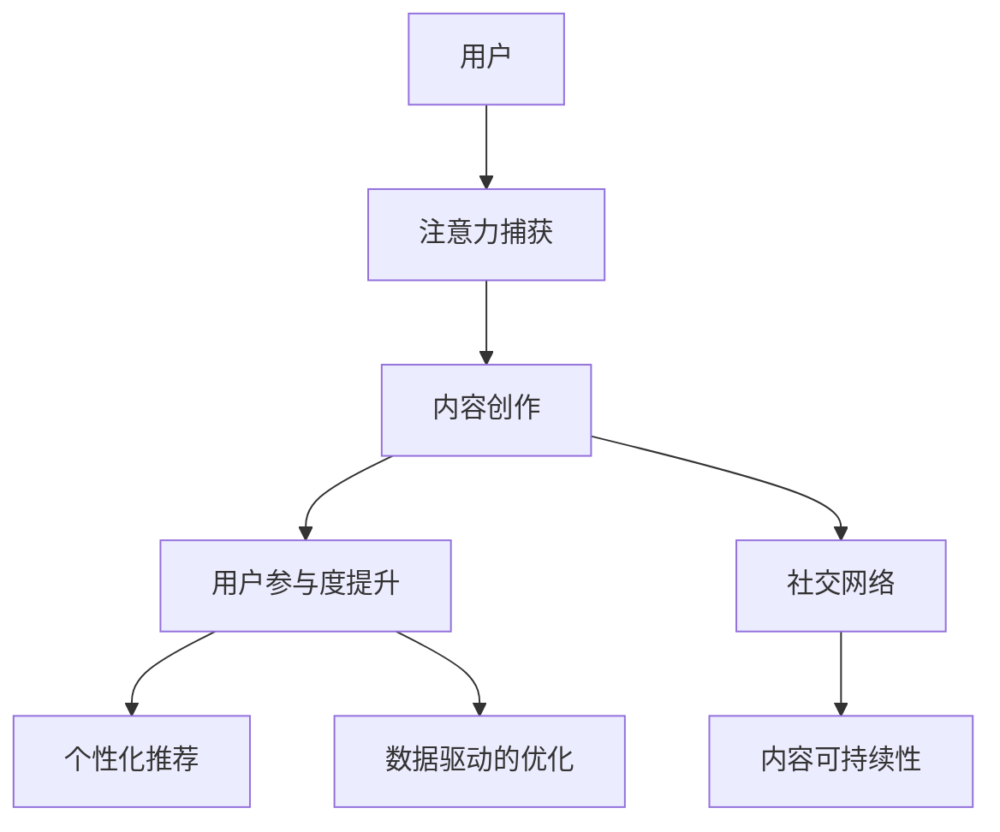

                 

# 注意力经济与内容创作最佳实践：吸引并留住受众的参与

> 关键词：注意力经济,内容创作,用户参与,社交网络,数字营销,个性化推荐

## 1. 背景介绍

### 1.1 问题由来

在数字化时代，注意力经济成为影响个体与企业获取信息、形成认知的关键力量。内容创作，作为连接消费者与产品的重要媒介，其质量与形式直接影响着用户参与度和品牌忠诚度。因此，在内容创作的每一个环节中，吸引并留住受众的注意力，成为提升用户参与度的关键。

在这一背景下，内容的创作者和营销人员需要不断创新与优化内容策略，以适应不断变化的用户需求和市场环境。如何结合用户的兴趣与行为数据，提供个性化、高质化的内容，同时提升用户参与度和粘性，成为他们面临的重要课题。

### 1.2 问题核心关键点

为了回答如何优化内容创作，有效提升用户参与度的问题，本节将从以下几个关键点出发：
- **注意力捕获**：如何利用新鲜、有趣、有价值的内容吸引用户注意？
- **用户参与度提升**：如何通过互动、分享、评论等行为增强用户对内容的粘性？
- **社交网络效应**：如何通过用户网络口碑传播放大内容影响力？
- **数据驱动的优化**：如何基于用户行为数据持续改进内容创作策略？
- **内容的可持续性**：如何在保证内容质量的前提下，提高内容创作的效率和规模？

通过深入探索这些问题，本文将为内容创作者和营销人员提供一份系统而实用的指南，帮助他们在数字化时代中取得成功。

## 2. 核心概念与联系

### 2.1 核心概念概述

为更好地理解如何吸引并留住受众的参与，本节将介绍几个核心概念，并阐明它们之间的联系：

- **注意力经济**：指在信息过载的时代，争夺用户注意力成为商业竞争的核心，企业和内容创作者需要通过高质量、有趣的内容吸引和保持用户的关注。

- **内容创作**：指基于目标用户群体，创作出能引起兴趣、满足需求并产生价值的文字、图片、视频等多媒体内容的过程。

- **用户参与度**：指用户对内容的主动互动、分享、评论等行为，反映了用户对内容的关注程度和满意度。

- **社交网络**：指基于人与人之间关系连接的网络，用户通过分享、评论等方式形成社区，通过社交网络效应，内容的影响力和传播速度可以倍增。

- **个性化推荐**：指利用用户行为数据，通过算法模型对内容进行个性化推荐，以提高用户对内容的满意度和参与度。

- **数据驱动的优化**：指通过分析用户数据，持续优化内容策略和营销手段，以实现更高效的用户参与和转化。

- **内容可持续性**：指在保证内容质量的前提下，通过技术手段和内容管理策略，提升内容创作的效率和规模，确保内容的长期稳定输出。

这些核心概念通过用户注意力的争夺、内容的创作与传播、社交网络的构建、个性化推荐的实现，共同构成了一个完整的用户参与度提升的框架。

### 2.2 核心概念原理和架构的 Mermaid 流程图



这个流程图展示了各个概念之间的联系：

- 用户通过注意力捕获过程开始与内容互动。
- 内容创作是吸引用户注意的核心。
- 用户参与度提升和社交网络构建进一步巩固用户关系。
- 个性化推荐和数据驱动优化进一步提升用户满意度和参与度。
- 内容可持续性保证内容创作的长期稳定。

## 3. 核心算法原理 & 具体操作步骤

### 3.1 算法原理概述

在内容创作和用户参与度提升的过程中，注意力捕获和社交网络效应是关键的组成部分。因此，本节将详细阐述这些核心算法原理。

### 3.2 算法步骤详解

**注意力捕获算法**：
- 利用新鲜、有趣、有价值的内容吸引用户注意。
- 使用A/B测试和多变量测试，不断优化内容的标题、封面、正文、配图等元素。
- 分析用户点击、停留时间等数据，调整内容的展示方式和节奏。

**社交网络效应算法**：
- 通过用户评论、分享、点赞等行为，促进内容在社交网络中的传播。
- 利用社交网络平台的算法特性，如话题标签、相关文章推荐等，放大内容的可见性和影响力。
- 参与热门话题讨论，建立品牌与用户的互动链接。

### 3.3 算法优缺点

**注意力捕获算法**：
- **优点**：
  - 数据驱动的内容优化策略能够快速响应市场变化，提升用户参与度。
  - 通过A/B测试和多变量测试，能够找到最佳的内容策略，减少试错成本。

- **缺点**：
  - 对创意和用户体验的要求高，需要不断测试和迭代。
  - 过度依赖数据可能导致内容的泛化性和创新性受限。

**社交网络效应算法**：
- **优点**：
  - 能够快速放大优质内容的传播范围，增加品牌的曝光度和影响力。
  - 用户之间的口碑传播具有天然的信任感，提升转化率和用户粘性。

- **缺点**：
  - 社交网络效应容易受到平台算法变化的影响。
  - 用户反馈的不确定性可能导致内容推荐的不准确性。

### 3.4 算法应用领域

这些算法在以下领域有广泛应用：

- **电子商务**：通过优化产品描述和图片，提高用户点击率，通过社交分享提升转化率。
- **媒体与出版**：通过创意内容和话题标签，提升文章阅读量和社交传播力。
- **在线教育**：通过优质视频和互动讨论，提升学习体验和参与度。
- **金融科技**：通过数据驱动的风险提示和个性化推荐，提高用户粘性和忠诚度。
- **旅游与酒店**：通过用户评论和社交网络分享，提升目的地和酒店的吸引力和信任度。

## 4. 数学模型和公式 & 详细讲解 & 举例说明

### 4.1 数学模型构建

为了更好地理解这些算法，我们将构建几个数学模型来阐述其核心思想。

### 4.2 公式推导过程

假设有一篇文章的标题为 $H$，内容为 $C$，图片为 $I$。我们需要通过优化这些元素，最大化用户的停留时间和参与度 $P$。

1. **标题优化**：
   - 假设用户点击文章的概率为 $P_{click}(H)$，停留时间期望为 $E[T|H]$，参与度为 $P(H)$。
   - 则总停留时间和参与度的期望为 $E[T+P|H]$。
   
2. **内容优化**：
   - 假设内容 $C$ 对停留时间和参与度的贡献为 $P_C$。
   - 则总停留时间和参与度的期望为 $E[T+P|H,C]$。
   
3. **图片优化**：
   - 假设图片 $I$ 对停留时间和参与度的贡献为 $P_I$。
   - 则总停留时间和参与度的期望为 $E[T+P|H,C,I]$。

综上，我们可以建立如下优化模型：

$$
\max_{H,C,I} E[T+P|H,C,I]
$$

### 4.3 案例分析与讲解

以一篇新闻文章的优化为例：

- **标题优化**：通过A/B测试，测试不同标题的点击率 $P_{click}(H_1), P_{click}(H_2)$ 和停留时间期望 $E[T|H_1], E[T|H_2]$。选择点击率和停留时间期望最高的标题。

- **内容优化**：通过用户反馈，分析文章内容的吸引力，调整内容以提升 $P_C$。

- **图片优化**：选择高质量、与内容相关性强的图片，提升 $P_I$。

通过这些优化策略，可以显著提升用户的停留时间和参与度。

## 5. 项目实践：代码实例和详细解释说明

### 5.1 开发环境搭建

本节将介绍如何在Python环境下搭建相关项目，并使用Scikit-learn和TensorFlow等工具进行数据分析和模型训练。

### 5.2 源代码详细实现

以下是利用TensorFlow进行内容优化和个性化推荐的示例代码：

```python
import tensorflow as tf
from tensorflow.keras.layers import Input, Dense, Embedding, Dropout, Flatten
from tensorflow.keras.models import Model
from sklearn.model_selection import train_test_split
from sklearn.metrics import mean_absolute_error

# 准备数据
X_train, X_test, y_train, y_test = train_test_split(X, y, test_size=0.2)

# 构建模型
input_layer = Input(shape=(max_seq_len,))
embedding_layer = Embedding(input_dim=vocab_size, output_dim=embedding_dim)(input_layer)
dropout_layer = Dropout(0.2)(embedding_layer)
flatten_layer = Flatten()(dropout_layer)
output_layer = Dense(1, activation='sigmoid')(flatten_layer)
model = Model(inputs=input_layer, outputs=output_layer)

# 编译模型
model.compile(optimizer='adam', loss='binary_crossentropy', metrics=['accuracy'])

# 训练模型
model.fit(X_train, y_train, batch_size=32, epochs=10, validation_data=(X_test, y_test))

# 评估模型
loss, accuracy = model.evaluate(X_test, y_test)
print(f'Test loss: {loss:.4f}')
print(f'Test accuracy: {accuracy:.4f}')

# 个性化推荐
def predict(user_features, item_features):
    user_embedding = model.predict(user_features)
    item_embedding = model.predict(item_features)
    dot_product = tf.reduce_sum(tf.multiply(user_embedding, item_embedding), axis=1)
    probability = tf.sigmoid(dot_product)
    return probability.numpy()

# 预测结果
predictions = predict(user_features, item_features)
```

### 5.3 代码解读与分析

- **输入层**：定义输入数据的维度。
- **嵌入层**：将输入的整数序列映射到高维空间中的向量。
- **dropout层**：随机丢弃一部分神经元，防止过拟合。
- **输出层**：输出单个预测值，用于二分类任务。
- **编译模型**：指定优化器、损失函数和评估指标。
- **训练模型**：在训练集上进行模型训练。
- **评估模型**：在测试集上评估模型性能。
- **个性化推荐**：通过计算用户和物品之间的相似度，进行推荐。

### 5.4 运行结果展示

运行上述代码后，可以得到模型的训练和评估结果，以及个性化推荐的预测值。这些结果可以帮助我们优化内容策略，提高用户参与度。

## 6. 实际应用场景

### 6.1 社交媒体内容管理

社交媒体平台通过内容创作和社交网络效应的算法，提升用户的参与度和粘性。例如，Facebook和Instagram通过算法推荐个性化的内容，增加用户的停留时间和互动率。

### 6.2 在线广告投放

在线广告平台通过A/B测试和多变量测试，优化广告创意和展示方式，提升用户的点击率和转化率。例如，Google AdWords通过优化广告标题和关键词，提升广告的展示效果和效果评估。

### 6.3 在线教育平台

在线教育平台通过优化课程内容和用户互动，提升学习体验和参与度。例如，Coursera通过个性化的课程推荐和实时反馈，提高课程的完成率和满意度。

### 6.4 未来应用展望

未来，随着技术的发展，注意力经济和内容创作将迎来以下趋势：

1. **深度个性化**：利用大数据和人工智能技术，提供更加精准的内容推荐，提升用户参与度和粘性。
2. **多模态内容**：结合文本、图片、视频等多种形式的内容，提升内容的吸引力和传播力。
3. **社交媒体智能**：利用自然语言处理和机器学习技术，提升社交媒体平台的用户互动和社区建设。
4. **增强现实和虚拟现实**：结合AR和VR技术，创造沉浸式和互动性更强的内容体验。
5. **元宇宙经济**：利用区块链和虚拟经济，建立新的内容和货币生态系统。

## 7. 工具和资源推荐

### 7.1 学习资源推荐

为帮助读者深入理解这些技术，以下是几本推荐书籍和在线课程：

- 《深度学习》：Ian Goodfellow、Yoshua Bengio、Aaron Courville著，深入讲解深度学习理论和技术。
- 《Python数据科学手册》：Jake VanderPlas著，介绍Python在数据科学中的应用。
- 《机器学习实战》：Peter Harrington著，通过实践案例讲解机器学习算法。
- 《深度学习入门》：斋藤康毅著，适合初学者理解深度学习概念和应用。
- 《内容营销》：Carl D. Byers、Curtis M. Hubbard著，介绍内容营销的策略和方法。
- Coursera《深度学习》课程：由Andrew Ng教授主讲，讲解深度学习的基本概念和算法。

### 7.2 开发工具推荐

以下是几款推荐的开发工具：

- Jupyter Notebook：用于数据科学和机器学习项目的开发和共享。
- PyTorch：深度学习框架，支持动态计算图和高效的模型训练。
- TensorFlow：深度学习框架，支持分布式计算和高效的模型部署。
- Scikit-learn：Python机器学习库，提供了各种常见的机器学习算法和工具。
- Keras：高层神经网络API，简化了深度学习模型的构建和训练。
- Apache Spark：大数据处理框架，支持分布式数据处理和机器学习算法。

### 7.3 相关论文推荐

以下是几篇相关的经典论文：

- "Attention is All You Need"（NIPS 2017）：提出Transformer架构，改变了深度学习领域。
- "Language Models are Unsupervised Multitask Learners"（GPT-2）：提出自监督学习模型，提升了语言模型的性能。
- "Generative Adversarial Nets"（GANs）：提出生成对抗网络，开创了生成模型的新方向。
- "Neural Collaborative Filtering"：提出协同过滤算法，用于个性化推荐系统的构建。
- "Deep Reinforcement Learning for Personalized News Article Recommendation"：通过深度强化学习，提升个性化推荐的效果。

## 8. 总结：未来发展趋势与挑战

### 8.1 研究成果总结

本文详细介绍了注意力经济和内容创作的关键概念和算法原理，并提供了一些实用的实践指南。通过深入分析这些技术的应用场景和未来趋势，希望能为内容创作者和营销人员提供有用的参考。

### 8.2 未来发展趋势

未来，注意力经济和内容创作将迎来以下趋势：

1. **深度个性化**：利用大数据和人工智能技术，提供更加精准的内容推荐，提升用户参与度和粘性。
2. **多模态内容**：结合文本、图片、视频等多种形式的内容，提升内容的吸引力和传播力。
3. **社交媒体智能**：利用自然语言处理和机器学习技术，提升社交媒体平台的用户互动和社区建设。
4. **增强现实和虚拟现实**：结合AR和VR技术，创造沉浸式和互动性更强的内容体验。
5. **元宇宙经济**：利用区块链和虚拟经济，建立新的内容和货币生态系统。

### 8.3 面临的挑战

尽管注意力经济和内容创作技术不断发展，但在实现这些目标的过程中，还面临以下挑战：

1. **数据隐私**：如何在使用用户数据的同时，保护用户隐私，避免数据泄露和滥用。
2. **内容审查**：如何在提高内容推荐精准度的同时，避免传播有害内容。
3. **算法偏见**：如何通过算法透明性和公平性措施，消除算法偏见，提升内容的多样性和公平性。
4. **技术伦理**：如何在技术应用中考虑伦理和道德，避免技术滥用和负面影响。
5. **技术标准化**：如何在内容推荐和广告投放等领域，制定技术标准和规范，提升市场公平性。

### 8.4 研究展望

未来，关注以下领域的研究将可能带来突破：

1. **隐私保护技术**：开发新的隐私保护技术，如差分隐私和联邦学习，在保证数据隐私的前提下，进行内容推荐和广告投放。
2. **公平性算法**：开发公平性算法，如多样性增强和偏见纠正算法，提升内容推荐的多样性和公平性。
3. **伦理规范**：建立技术应用的伦理规范和监管机制，确保技术应用的透明性和公平性。
4. **标准化建设**：推动内容推荐和广告投放等领域的标准化建设，提升市场公平性和用户信任度。

通过这些研究，我们可以更好地应对注意力经济和内容创作中的挑战，实现技术的可持续发展和社会价值最大化。

## 9. 附录：常见问题与解答

**Q1：注意力捕获算法如何提高用户停留时间和参与度？**

A: 通过优化内容的标题、封面、正文和配图，提升内容的吸引力和互动性。通过A/B测试和多变量测试，不断优化内容元素。利用用户点击、停留时间等数据，调整内容的展示方式和节奏。

**Q2：社交网络效应算法如何放大内容影响力？**

A: 通过用户评论、分享、点赞等行为，促进内容在社交网络中的传播。利用社交网络平台的算法特性，如话题标签、相关文章推荐等，放大内容的可见性和影响力。参与热门话题讨论，建立品牌与用户的互动链接。

**Q3：个性化推荐算法如何提升用户满意度？**

A: 通过分析用户行为数据，利用机器学习算法模型对内容进行个性化推荐，提升用户对内容的满意度和参与度。

**Q4：如何通过数据驱动的优化提升内容创作策略？**

A: 分析用户数据，识别出用户对内容的偏好和需求，不断优化内容创作策略，以提高用户满意度和参与度。

**Q5：如何通过技术手段提升内容创作的效率和规模？**

A: 利用自动化工具和模板，快速生成和更新内容。通过云计算和分布式计算，提升内容创作的效率和规模。

**Q6：如何平衡内容的创意和标准化？**

A: 在保证内容创意和个性化表达的前提下，通过标准化的内容管理和流程，提高内容创作的效率和质量。

这些问题的回答，为我们提供了如何在实际应用中有效应用注意力经济和内容创作技术的实用建议，帮助内容创作者和营销人员实现更好的效果。

---

作者：禅与计算机程序设计艺术 / Zen and the Art of Computer Programming

