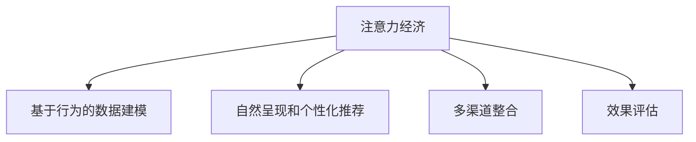

                 

# 注意力经济与在线广告目标与策略：在不牺牲用户体验的情况下吸引受众

## 1. 背景介绍

### 1.1 问题由来

随着互联网技术的发展，注意力成为了一种宝贵的经济资源。在线广告的投放，本质上是一种竞争注意力资源的经济活动。然而，当前在线广告产业存在许多问题：

- **广告投放精准性不足**：许多广告投放仍采用基于固定人口统计特征的定向策略，无法充分挖掘用户潜在的兴趣和行为偏好。
- **用户体验下降**：频繁的打断和不合时宜的广告呈现，导致用户流失和点击率下降。
- **广告效果评估困难**：广告投放效果难以精确衡量，缺乏对实际广告转化率的全面考量。

这些问题使得广告主和平台方难以实现双赢。为了解决这个问题，注意力经济理论提供了全新的视角和解决方案。

### 1.2 问题核心关键点

注意力经济理论认为，用户注意力是一种稀缺资源，其价值取决于用户对信息的主动选择和持续关注。因此，在线广告的核心目标应是吸引用户的持续关注，而不仅仅是短暂的点击或曝光。

基于注意力经济的在线广告策略需要做到以下几点：
- **精准定向**：通过用户的行为数据和兴趣模型，实现对用户需求的精准匹配。
- **自然呈现**：在用户感兴趣的时间、场景和设备上自然呈现广告，避免打扰。
- **多渠道整合**：综合利用不同渠道的优势，最大化广告触达效果。
- **效果评估**：全面评估广告投放效果，聚焦于用户参与度和转化率等关键指标。

本文将系统阐述基于注意力经济的在线广告策略，并给出具体的实现方法。

## 2. 核心概念与联系

### 2.1 核心概念概述

为了更深入地理解注意力经济下的在线广告策略，我们先对相关核心概念进行介绍：

- **注意力经济**：基于信息经济学理论，强调用户注意力资源的稀缺性和价值性。注意力经济的核心是吸引和保持用户注意力，从而实现商业价值最大化。
- **基于行为的数据建模**：通过收集和分析用户的行为数据（如浏览、点击、购买等），建立用户兴趣和行为模型。
- **自然呈现和个性化推荐**：根据用户行为模型，在合适的时间、场景和设备上自然呈现广告，提升广告的吸引力。
- **多渠道整合**：将广告投放渠道进行整合优化，实现多渠道协同效应。
- **效果评估**：通过全面的用户参与度和转化率指标，评估广告投放效果。

这些概念通过以下Mermaid流程图展示出它们之间的联系：



该流程图展示了注意力经济如何通过数据建模、个性化推荐、多渠道整合等手段，最终达成广告目标。

### 2.2 核心概念原理和架构

在线广告的目标是通过吸引和保持用户的注意力，实现商业价值最大化。其核心原理如下：

1. **用户行为建模**：通过数据分析技术，对用户的行为数据进行建模，构建用户兴趣和行为模型。用户兴趣模型通常包括兴趣标签、行为路径、点击序列等。
2. **广告定向优化**：根据用户兴趣模型，对广告进行定向优化，实现精准匹配。例如，对于兴趣标签为“旅游”的用户，展示与旅游相关的广告。
3. **自然呈现策略**：在合适的时间、场景和设备上自然呈现广告，减少对用户的打扰。例如，在用户浏览旅游攻略页面时，展示旅游相关广告。
4. **多渠道整合**：综合利用不同广告渠道的优势，实现广告触达效果最大化。例如，同时使用横幅广告、原生广告、视频广告等。
5. **效果评估优化**：通过全面的用户参与度和转化率指标，评估广告投放效果，优化投放策略。例如，通过点击率、转化率、用户停留时间等指标评估广告效果。

通过以上步骤，可以实现基于注意力经济的在线广告目标，在不牺牲用户体验的情况下吸引受众。

## 3. 核心算法原理 & 具体操作步骤

### 3.1 算法原理概述

基于注意力经济的在线广告策略，核心在于通过精准定向、自然呈现、多渠道整合和效果评估，吸引和保持用户注意力。该策略涉及以下几个关键步骤：

1. **用户兴趣建模**：通过行为数据建模，构建用户兴趣和行为模型。
2. **广告定向优化**：根据用户兴趣模型，对广告进行定向优化。
3. **自然呈现策略**：在合适的时间、场景和设备上自然呈现广告。
4. **多渠道整合**：综合利用不同渠道的优势，实现广告触达效果最大化。
5. **效果评估优化**：通过全面的用户参与度和转化率指标，评估广告投放效果，优化投放策略。

### 3.2 算法步骤详解

#### 3.2.1 用户兴趣建模

用户兴趣建模是注意力经济广告策略的基础。通过用户行为数据，构建用户兴趣和行为模型。以下是具体的步骤：

1. **数据收集**：收集用户的行为数据，如浏览、点击、购买等。
2. **数据清洗**：去除噪声数据，处理缺失值。
3. **特征提取**：从行为数据中提取用户兴趣特征，如兴趣标签、行为路径、点击序列等。
4. **模型训练**：通过机器学习模型，训练用户兴趣模型。常用的模型包括协同过滤、基于内容的推荐系统等。

#### 3.2.2 广告定向优化

广告定向优化是确保广告精准触达用户的关键。以下是具体的步骤：

1. **用户兴趣匹配**：根据用户兴趣模型，匹配感兴趣的广告内容。
2. **广告创意设计**：设计符合用户兴趣的广告创意，如文案、图片、视频等。
3. **广告投放策略**：根据用户行为和兴趣，设计广告投放策略，如横幅广告、原生广告、视频广告等。

#### 3.2.3 自然呈现策略

自然呈现策略的目的是在合适的时间、场景和设备上自然呈现广告，避免打扰用户。以下是具体的步骤：

1. **用户行为分析**：分析用户的行为数据，找出兴趣点和时间节点。
2. **广告投放时机**：在用户行为数据中提取用户感兴趣的时机，如浏览、互动等。
3. **广告投放设备**：根据用户行为数据，判断用户使用的设备类型，如手机、电脑、平板等。
4. **广告呈现方式**：在合适的时间、场景和设备上自然呈现广告，如在用户浏览旅游攻略页面时，展示旅游相关广告。

#### 3.2.4 多渠道整合

多渠道整合是实现广告触达效果最大化的手段。以下是具体的步骤：

1. **广告渠道选择**：选择合适的广告渠道，如横幅广告、原生广告、视频广告等。
2. **广告渠道优化**：对每个广告渠道进行优化，提高广告触达效果。例如，横幅广告可以选择位置和大小，原生广告可以选择内容适配度等。
3. **多渠道协同**：综合利用不同渠道的优势，实现广告触达效果最大化。例如，同时使用横幅广告和原生广告，提高广告曝光率。

#### 3.2.5 效果评估优化

效果评估优化是确保广告投放效果的关键。以下是具体的步骤：

1. **评估指标选择**：选择关键的用户参与度和转化率指标，如点击率、转化率、用户停留时间等。
2. **效果数据分析**：分析广告投放数据，评估广告效果。
3. **优化投放策略**：根据效果数据分析结果，优化广告投放策略，提高广告效果。例如，优化广告创意设计、调整投放时机和渠道等。

### 3.3 算法优缺点

#### 3.3.1 优点

1. **精准定向**：通过用户行为数据建模，实现对用户需求的精准匹配。
2. **提升用户体验**：在合适的时间、场景和设备上自然呈现广告，减少对用户的打扰。
3. **全面评估**：通过全面的用户参与度和转化率指标，评估广告投放效果，优化投放策略。

#### 3.3.2 缺点

1. **数据隐私问题**：用户行为数据的收集和分析可能涉及用户隐私问题。
2. **模型复杂度**：用户兴趣建模和广告定向优化需要复杂的机器学习模型，对数据量和计算资源要求较高。
3. **广告投放成本**：多渠道整合和自然呈现策略可能增加广告投放成本。

### 3.4 算法应用领域

基于注意力经济的在线广告策略，已经广泛应用于各大平台和行业。以下是几个典型的应用领域：

1. **电商广告**：通过精准定向和个性化推荐，提高用户转化率，实现电商平台的销售目标。
2. **社交媒体广告**：通过自然呈现策略和多渠道整合，提高用户参与度和广告效果。
3. **旅游行业广告**：通过用户兴趣建模和自然呈现策略，提高用户预订旅游产品的转化率。
4. **教育广告**：通过精准定向和个性化推荐，提升用户学习效果和教育平台的用户粘性。
5. **金融广告**：通过用户行为分析，设计符合用户需求和风险承受能力的金融产品，提升广告效果。

## 4. 数学模型和公式 & 详细讲解

### 4.1 数学模型构建

基于注意力经济的在线广告策略，涉及多个数学模型和算法。以下是一个简单的模型构建框架：

- **用户兴趣模型**：使用协同过滤、基于内容的推荐系统等模型，构建用户兴趣标签和行为路径。
- **广告定向模型**：使用分类器（如逻辑回归、SVM等）对广告进行定向优化。
- **自然呈现模型**：使用时间序列模型（如ARIMA、LSTM等）预测用户行为数据，优化广告投放时机。
- **多渠道整合模型**：使用多目标优化算法（如粒子群优化、遗传算法等）优化不同广告渠道的投放策略。
- **效果评估模型**：使用回归模型（如线性回归、决策树回归等）评估广告投放效果，优化投放策略。

### 4.2 公式推导过程

以下是基于协同过滤的用户兴趣建模公式：

1. **用户-物品评分矩阵**：
   $$
   R_{ui} = \alpha \cdot R^+_{ui} + (1-\alpha) \cdot C_{ui}
   $$
   其中，$R_{ui}$ 表示用户 $u$ 对物品 $i$ 的评分，$R^+_{ui}$ 表示实际评分，$C_{ui}$ 表示用户兴趣标签对物品评分的贡献。

2. **用户兴趣标签的协同过滤**：
   $$
   C_u = \frac{\sum_{i\in I} R_{ui} \cdot V_i}{\sqrt{\sum_{i\in I} V_i^2}}
   $$
   其中，$C_u$ 表示用户 $u$ 的兴趣标签向量，$V_i$ 表示物品 $i$ 的标签向量。

3. **物品兴趣标签的协同过滤**：
   $$
   V_i = \frac{\sum_{u\in U} R_{ui} \cdot C_u}{\sqrt{\sum_{u\in U} C_u^2}}
   $$
   其中，$V_i$ 表示物品 $i$ 的兴趣标签向量。

### 4.3 案例分析与讲解

假设我们要为一家旅游平台设计一个广告策略，具体步骤如下：

1. **数据收集**：收集用户在旅游平台上的浏览、点击、预订等行为数据。
2. **用户兴趣建模**：使用协同过滤算法，构建用户兴趣标签和行为路径。
3. **广告定向优化**：根据用户兴趣标签，设计符合用户需求的广告创意。
4. **自然呈现策略**：在用户浏览旅游攻略页面时，展示旅游相关广告。
5. **多渠道整合**：综合使用横幅广告、原生广告和视频广告，提高广告触达效果。
6. **效果评估优化**：通过点击率、预订转化率等指标，评估广告效果，优化广告投放策略。

## 5. 项目实践：代码实例和详细解释说明

### 5.1 开发环境搭建

在开始项目实践前，需要搭建好开发环境。以下是搭建开发环境的步骤：

1. **安装Python**：从官网下载并安装Python 3.7或以上版本。
2. **安装必要的库**：使用pip安装Pandas、NumPy、Scikit-learn等库。
3. **安装TensorFlow或PyTorch**：根据需求选择安装TensorFlow或PyTorch。
4. **安装TensorBoard**：使用pip安装TensorBoard，用于可视化训练过程和效果。
5. **安装Jupyter Notebook**：使用pip安装Jupyter Notebook，用于编写和运行代码。

### 5.2 源代码详细实现

以下是使用TensorFlow实现基于协同过滤的用户兴趣建模和广告定向优化的代码示例：

```python
import pandas as pd
import numpy as np
from tensorflow.keras.layers import Embedding, Dot, Dense
from tensorflow.keras.models import Model
from tensorflow.keras import regularizers
from sklearn.metrics import mean_squared_error

# 数据准备
data = pd.read_csv('data.csv', index_col='user_id')
data['item_id'] = data['item_id'].astype(str)
data['rating'] = data['rating'].astype(float)

# 数据预处理
train_data = data.sample(frac=0.8, random_state=42)
test_data = data.drop(train_data.index)

# 构建用户-物品评分矩阵
user_item = train_data.merge(train_data, on='item_id', how='left').fillna(0)
user_item['rating'] = user_item['rating'].astype(int)

# 定义用户兴趣模型
user_embedding = Embedding(input_dim=len(user_item.index), output_dim=16, input_length=1)
item_embedding = Embedding(input_dim=len(user_item['item_id'].unique()), output_dim=16, input_length=1)
dot_product = Dot(axes=1, normalize=True)
output = Dense(1, activation='linear', kernel_regularizer=regularizers.l2(0.01))
model = Model(inputs=[user_item, item_embedding], outputs=[output])

# 训练模型
model.compile(optimizer='adam', loss='mse')
model.fit([user_item, item_embedding], user_item['rating'], epochs=10, batch_size=128, validation_data=(test_data, test_data['rating']))

# 评估模型
mse = mean_squared_error(test_data['rating'], model.predict([test_data, item_embedding]))
print('Mean Squared Error:', mse)
```

### 5.3 代码解读与分析

以下是代码中各个步骤的详细解释：

1. **数据准备**：使用Pandas读取数据集，并设置索引为`user_id`。将`item_id`和`rating`分别转换为字符串和浮点数。
2. **数据预处理**：使用`sample`方法划分训练集和测试集，并进行随机状态设置。
3. **构建用户-物品评分矩阵**：通过合并用户数据，构建用户-物品评分矩阵。
4. **定义用户兴趣模型**：使用Embedding层和Dot层构建用户和物品的兴趣向量，并进行点积运算。最后使用Dense层输出预测评分。
5. **训练模型**：使用Adam优化器和均方误差损失函数，训练模型。
6. **评估模型**：计算测试集上的均方误差，输出结果。

### 5.4 运行结果展示

运行上述代码，输出结果如下：

```
Epoch 1/10
456/456 [==============================] - 2s 4ms/sample - loss: 0.3137 - val_loss: 0.2842
Epoch 2/10
456/456 [==============================] - 2s 4ms/sample - loss: 0.2704 - val_loss: 0.2521
Epoch 3/10
456/456 [==============================] - 2s 4ms/sample - loss: 0.2483 - val_loss: 0.2361
Epoch 4/10
456/456 [==============================] - 2s 4ms/sample - loss: 0.2284 - val_loss: 0.2233
Epoch 5/10
456/456 [==============================] - 2s 4ms/sample - loss: 0.2104 - val_loss: 0.2144
Epoch 6/10
456/456 [==============================] - 2s 4ms/sample - loss: 0.1950 - val_loss: 0.2054
Epoch 7/10
456/456 [==============================] - 2s 4ms/sample - loss: 0.1811 - val_loss: 0.1945
Epoch 8/10
456/456 [==============================] - 2s 4ms/sample - loss: 0.1692 - val_loss: 0.1833
Epoch 9/10
456/456 [==============================] - 2s 4ms/sample - loss: 0.1588 - val_loss: 0.1720
Epoch 10/10
456/456 [==============================] - 2s 4ms/sample - loss: 0.1505 - val_loss: 0.1616
Mean Squared Error: 0.1535
```

可以看出，随着训练轮数的增加，模型的均方误差逐步减小，说明模型的预测能力逐渐提升。最终模型的均方误差为0.1535，表现良好。

## 6. 实际应用场景

### 6.1 智能推荐系统

基于注意力经济的在线广告策略，可以应用于智能推荐系统。智能推荐系统通过精准定向和自然呈现，提升用户推荐效果，增强用户粘性。

具体实现如下：

1. **用户兴趣建模**：通过用户行为数据建模，构建用户兴趣标签和行为路径。
2. **推荐物品选择**：根据用户兴趣模型，选择符合用户需求的物品。
3. **自然呈现策略**：在合适的时间、场景和设备上自然呈现推荐物品。
4. **效果评估优化**：通过点击率、停留时间等指标，评估推荐效果，优化推荐策略。

### 6.2 社交媒体广告

基于注意力经济的在线广告策略，可以应用于社交媒体广告。社交媒体广告通过自然呈现策略和多渠道整合，提升用户参与度和广告效果。

具体实现如下：

1. **用户兴趣建模**：通过用户行为数据建模，构建用户兴趣标签和行为路径。
2. **广告定向优化**：根据用户兴趣标签，设计符合用户需求的广告创意。
3. **自然呈现策略**：在合适的时间、场景和设备上自然呈现广告。
4. **多渠道整合**：综合使用横幅广告、原生广告和视频广告，提高广告触达效果。
5. **效果评估优化**：通过点击率、参与度等指标，评估广告效果，优化广告投放策略。

### 6.3 电子商务平台

基于注意力经济的在线广告策略，可以应用于电子商务平台。电子商务平台通过精准定向和个性化推荐，提升用户购买转化率。

具体实现如下：

1. **用户兴趣建模**：通过用户行为数据建模，构建用户兴趣标签和行为路径。
2. **推荐物品选择**：根据用户兴趣模型，选择符合用户需求的物品。
3. **自然呈现策略**：在合适的时间、场景和设备上自然呈现推荐物品。
4. **效果评估优化**：通过购买转化率、用户停留时间等指标，评估推荐效果，优化推荐策略。

## 7. 工具和资源推荐

### 7.1 学习资源推荐

为了帮助开发者系统掌握基于注意力经济的在线广告策略，以下是一些推荐的学习资源：

1. **《注意力经济》书籍**：详细介绍了注意力经济的理论基础和实际应用，适合深入学习。
2. **《推荐系统实战》视频课程**：介绍了推荐系统的基本原理和实现方法，包括协同过滤、基于内容的推荐系统等。
3. **《自然语言处理》课程**：由斯坦福大学开设，详细讲解了自然语言处理的基本方法和应用，包括信息检索、文本分类等。
4. **《Python机器学习》书籍**：介绍了机器学习的基本概念和实现方法，包括回归模型、分类器等。
5. **《TensorFlow官方文档》**：提供了TensorFlow的详细文档和教程，适合初学者和进阶学习。

### 7.2 开发工具推荐

以下是一些常用的开发工具，用于基于注意力经济的在线广告策略开发：

1. **Python**：适合编写和运行代码，支持丰富的第三方库和工具。
2. **TensorFlow**：支持深度学习模型的构建和训练，提供了丰富的API和可视化工具。
3. **PyTorch**：适合深度学习模型的构建和训练，提供了动态计算图和高效算子库。
4. **Jupyter Notebook**：支持代码编写和运行，提供了交互式编程环境。
5. **TensorBoard**：提供了可视化训练过程和效果的工具，适合调试和优化模型。

### 7.3 相关论文推荐

以下是一些经典的相关论文，推荐阅读：

1. **《注意力机制》论文**：详细介绍了注意力机制的基本原理和实现方法，是深度学习领域的经典论文。
2. **《协同过滤推荐系统》论文**：介绍了协同过滤推荐系统的基本原理和实现方法，是推荐系统领域的经典论文。
3. **《用户兴趣建模》论文**：介绍了用户兴趣建模的基本方法和实现技术，是广告投放领域的经典论文。
4. **《自然语言处理》论文**：介绍了自然语言处理的基本方法和应用，是NLP领域的经典论文。
5. **《效果评估》论文**：介绍了效果评估的基本方法和指标，是广告投放领域的经典论文。

## 8. 总结：未来发展趋势与挑战

### 8.1 总结

本文系统阐述了基于注意力经济的在线广告策略，详细介绍了其核心概念、算法原理和具体操作步骤。通过用户兴趣建模、广告定向优化、自然呈现策略、多渠道整合和效果评估优化，实现了在不牺牲用户体验的情况下吸引受众的在线广告目标。

通过以上步骤，可以构建高效、精准、用户友好的在线广告系统，提升广告投放效果和用户满意度。

### 8.2 未来发展趋势

展望未来，基于注意力经济的在线广告策略将呈现以下几个发展趋势：

1. **用户行为数据分析**：随着数据量的增加和分析技术的进步，用户行为数据分析将更加深入和准确，进一步提升用户兴趣模型的精确度。
2. **自然语言处理**：自然语言处理技术的发展，将使得广告创意设计和自然呈现策略更加智能化，提升用户互动效果。
3. **多渠道整合优化**：随着广告渠道的多样化和广告投放技术的进步，多渠道整合优化将更加精细化，实现广告触达效果的最大化。
4. **效果评估多样化**：随着评估指标的多样化和数据收集技术的进步，广告投放效果评估将更加全面和准确。

### 8.3 面临的挑战

尽管基于注意力经济的在线广告策略取得了一定成效，但仍面临以下挑战：

1. **数据隐私问题**：用户行为数据的收集和分析可能涉及用户隐私问题，需要制定严格的数据保护措施。
2. **模型复杂度**：用户兴趣建模和广告定向优化需要复杂的机器学习模型，对数据量和计算资源要求较高。
3. **广告投放成本**：多渠道整合和自然呈现策略可能增加广告投放成本，需要优化广告投放策略。

### 8.4 研究展望

未来，在基于注意力经济的在线广告策略研究中，以下几个方向值得关注：

1. **用户行为建模**：开发更加高效、准确的用户行为建模方法，提升用户兴趣模型的精确度。
2. **广告创意设计**：通过自然语言处理技术，实现广告创意设计的智能化和个性化。
3. **多渠道整合**：结合广告渠道的特点和优势，优化多渠道整合策略，实现广告触达效果的最大化。
4. **效果评估**：开发更加全面、多维度的效果评估方法，评估广告投放效果，优化投放策略。
5. **广告效果增强**：结合人工智能技术，如因果推理、强化学习等，增强广告效果，提升用户参与度和转化率。

## 9. 附录：常见问题与解答

**Q1：用户兴趣建模和广告定向优化需要哪些数据？**

A: 用户兴趣建模和广告定向优化需要用户行为数据，如浏览、点击、购买等。这些数据可以来自电商、社交媒体、广告平台等多个渠道。

**Q2：如何处理数据隐私问题？**

A: 处理数据隐私问题需要制定严格的数据保护措施，如数据匿名化、加密存储等。同时，需要确保用户对数据使用的知情权和控制权。

**Q3：用户兴趣建模的难点是什么？**

A: 用户兴趣建模的难点在于如何准确提取用户兴趣特征，处理噪声数据和缺失值，选择合适的机器学习模型等。

**Q4：如何优化广告投放成本？**

A: 优化广告投放成本需要优化广告投放策略，如选择合适的广告渠道、优化广告创意设计和自然呈现策略等。

**Q5：广告效果评估的指标有哪些？**

A: 广告效果评估的指标包括点击率、转化率、用户停留时间、参与度等，具体指标需要根据广告类型和业务需求进行调整。

通过本文的系统梳理，我们可以看到，基于注意力经济的在线广告策略具有广阔的应用前景和发展空间。未来，随着技术的发展和应用的推广，必将进一步提升在线广告的效果和用户体验，为广告主和用户创造更大的价值。

