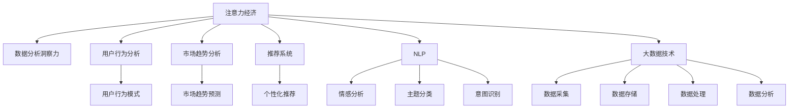

                 

# 注意力经济与数据分析洞察力：利用数据理解受众行为和市场

> 关键词：注意力经济, 数据分析, 用户行为, 市场洞察, 数据挖掘, 机器学习, 自然语言处理(NLP), 大数据, 推荐系统

## 1. 背景介绍

在互联网时代，信息过载已成为普遍现象。面对海量内容和数以亿计的用户，如何更有效地获取和利用数据，成为了每个企业和组织关注的重点。其中，注意力经济和数据分析洞察力成为了核心竞争力。

### 1.1 问题由来

随着互联网的普及，各类信息服务如社交媒体、新闻资讯、电子商务等平台获得了空前的发展。这些平台积累了海量的用户行为数据，为商业决策提供了宝贵的信息资源。但面对这些数据，如何从中挖掘有价值的信息，实现数据驱动的决策，成为了当前的热点问题。

### 1.2 问题核心关键点

注意力经济的核心在于如何更好地吸引和利用用户注意力。数据分析洞察力则是对用户行为、市场趋势等数据的深度挖掘和分析，以提升业务决策的科学性和准确性。二者共同构成了互联网时代的重要发展趋势。

## 2. 核心概念与联系

### 2.1 核心概念概述

为更好地理解注意力经济和数据分析洞察力的工作原理和联系，本节将介绍几个密切相关的核心概念：

- **注意力经济**：指通过吸引用户注意力，实现商业价值的经济模式。广告、推荐、内容运营等都是典型的注意力经济活动。
- **数据分析洞察力**：利用数据挖掘、机器学习等技术，深入分析用户行为、市场趋势、产品反馈等数据，发现隐藏在数据背后的规律和机会，为业务决策提供科学依据。
- **用户行为分析**：研究用户在平台上的行为模式，如点击、浏览、购买、互动等，用于指导产品和内容的优化。
- **市场趋势分析**：基于历史数据和实时反馈，预测市场发展趋势，如用户增长、产品需求、竞争格局等。
- **推荐系统**：根据用户的历史行为和偏好，推荐符合其兴趣的商品、内容、信息，提升用户体验和平台价值。
- **自然语言处理(NLP)**：利用机器学习技术处理和理解自然语言，从文本中提取有价值的信息，用于情感分析、主题分类、意图识别等任务。
- **大数据技术**：涉及数据采集、存储、处理、分析等环节，通过分布式计算、云计算等技术，支持大规模数据处理。

这些概念之间的逻辑关系可以通过以下Mermaid流程图来展示：



这个流程图展示了注意力经济和数据分析洞察力的核心概念及其之间的关系：

1. 注意力经济通过吸引用户注意力，实现商业价值的最大化。
2. 数据分析洞察力通过深度挖掘和分析用户行为、市场趋势等数据，为业务决策提供数据支持。
3. 用户行为分析、市场趋势分析、推荐系统、NLP、大数据技术等子概念，共同支撑着注意力经济的实现和数据分析洞察力的提升。

## 3. 核心算法原理 & 具体操作步骤

### 3.1 算法原理概述

注意力经济和数据分析洞察力通常依赖于先进的数据分析和机器学习技术，其核心在于通过模型学习和挖掘数据中的潜在规律，实现对用户行为和市场趋势的预测和优化。

### 3.2 算法步骤详解

基于注意力经济和数据分析洞察力的核心算法通常包括以下几个关键步骤：

**Step 1: 数据收集与预处理**
- 使用日志、跟踪器、API接口等方式收集用户行为数据。
- 对数据进行清洗、去重、归一化等预处理操作。

**Step 2: 数据特征提取**
- 利用统计特征、文本特征、用户画像等，构建数据的特征表示。
- 对文本数据进行分词、向量化、TF-IDF等处理，生成可供机器学习模型使用的特征向量。

**Step 3: 模型训练与优化**
- 选择合适的算法模型，如协同过滤、深度神经网络、多臂赌博机等。
- 使用历史数据对模型进行训练，不断调整超参数和模型结构。

**Step 4: 预测与分析**
- 将模型应用于实时数据，进行预测和分析。
- 利用可视化工具对预测结果进行展示和分析，发现用户行为和市场趋势。

**Step 5: 模型评估与部署**
- 通过交叉验证等方法对模型进行评估，选择表现最优的模型。
- 将模型部署到生产环境，进行实时数据处理和分析。

### 3.3 算法优缺点

基于注意力经济和数据分析洞察力的算法具有以下优点：
1. 能够自动化分析海量数据，发现隐藏在数据中的规律和趋势。
2. 帮助企业制定更加精准的营销策略，提升用户满意度和品牌价值。
3. 减少人工决策的依赖，提高决策的科学性和效率。

同时，这些算法也存在一定的局限性：
1. 依赖于高质量的数据，数据采集和预处理的成本较高。
2. 模型需要不断更新和优化，以适应数据分布的变化。
3. 存在一定的模型偏见和过度拟合风险，需要仔细设计和调整。
4. 需要结合业务场景，进行个性化的模型设计和优化。

尽管存在这些局限性，但就目前而言，注意力经济和数据分析洞察力仍然是互联网时代最有效、最核心的竞争手段之一。未来相关研究的重点在于如何进一步降低数据获取和模型更新的成本，提高模型的鲁棒性和可解释性，同时兼顾数据隐私和安全等因素。

### 3.4 算法应用领域

注意力经济和数据分析洞察力在多个领域得到了广泛的应用，例如：

- **电商推荐系统**：通过分析用户的历史浏览和购买记录，推荐相关商品，提升用户体验和销售额。
- **社交媒体分析**：基于用户互动和内容传播的数据，分析热点话题和用户兴趣，指导内容运营策略。
- **新闻资讯推荐**：利用用户的阅读记录和点击行为，推荐相关文章，提高平台的用户粘性和点击率。
- **广告投放优化**：根据用户行为和市场趋势，优化广告投放策略，提升广告效果和ROI。
- **客户关系管理(CRM)**：通过分析客户互动和购买数据，预测客户行为，提供个性化的服务。
- **市场营销分析**：基于市场调研数据，分析市场趋势和竞争对手，制定营销策略。

除了上述这些经典领域外，注意力经济和数据分析洞察力还被创新性地应用到更多场景中，如金融风险管理、医疗健康监测、智能交通优化等，为各行各业带来了新的增长机遇。

## 4. 数学模型和公式 & 详细讲解 & 举例说明

### 4.1 数学模型构建

在注意力经济和数据分析洞察力的研究中，数学模型和公式是其核心组成部分。以下以推荐系统为例，给出推荐算法的基本数学模型。

记用户为 $U$，物品为 $I$，用户行为为 $B_{u,i}$，用户对物品 $i$ 的评分 $R_{u,i}$。设用户 $u$ 对物品 $i$ 的评分 $R_{u,i}$ 为：

$$
R_{u,i} = f(u, i)
$$

其中 $f$ 为评分函数，通常使用线性函数或基于深度神经网络的函数。

### 4.2 公式推导过程

在推荐系统中，常用的评分函数包括基于用户和物品的协同过滤方法、基于内容的推荐方法、基于深度学习的推荐方法等。以下是基于协同过滤的矩阵分解模型的基本推导过程：

假设用户 $u$ 和物品 $i$ 的评分矩阵为 $R$，设用户 $u$ 的隐式特征向量为 $\mathbf{u}$，物品 $i$ 的隐式特征向量为 $\mathbf{v}$，则有：

$$
R_{u,i} \approx \mathbf{u} \cdot \mathbf{v} = \sum_{j=1}^{n} u_jv_j
$$

其中 $n$ 为特征向量的维度。将 $\mathbf{u}$ 和 $\mathbf{v}$ 代入上述公式，并对方程两侧同时乘以 $\mathbf{R}^T$，可得：

$$
\mathbf{R} = \mathbf{U} \mathbf{V}^T
$$

其中 $\mathbf{U}$ 和 $\mathbf{V}$ 为特征矩阵，$\mathbf{U}$ 的第 $u$ 行向量为 $\mathbf{u}$，$\mathbf{V}$ 的第 $i$ 列向量为 $\mathbf{v}$。

### 4.3 案例分析与讲解

以下以电商推荐系统为例，分析模型在实际应用中的计算过程。

假设用户 $u$ 对物品 $i$ 的评分 $R_{u,i}$ 为：

$$
R_{u,i} = \mathbf{u} \cdot \mathbf{v} = \sum_{j=1}^{n} u_jv_j
$$

其中 $\mathbf{u}$ 和 $\mathbf{v}$ 为高维向量。在训练阶段，通过矩阵分解算法 $\mathbf{U} \mathbf{V}^T = \mathbf{R}$，可得 $\mathbf{U}$ 和 $\mathbf{V}$ 的估计值 $\hat{\mathbf{U}}, \hat{\mathbf{V}}$，则用户 $u$ 对物品 $i$ 的评分估计值为：

$$
\hat{R}_{u,i} = \hat{\mathbf{u}} \cdot \hat{\mathbf{v}} = \sum_{j=1}^{n} \hat{u}_j\hat{v}_j
$$

在测试阶段，给定用户 $u$ 和物品 $i$，使用上述公式计算预测评分 $\hat{R}_{u,i}$，即可得到推荐结果。

## 5. 项目实践：代码实例和详细解释说明

### 5.1 开发环境搭建

在进行注意力经济和数据分析洞察力的实践前，我们需要准备好开发环境。以下是使用Python进行Scikit-learn开发的环境配置流程：

1. 安装Anaconda：从官网下载并安装Anaconda，用于创建独立的Python环境。

2. 创建并激活虚拟环境：
```bash
conda create -n attention-economics python=3.8 
conda activate attention-economics
```

3. 安装Scikit-learn：
```bash
conda install scikit-learn
```

4. 安装NumPy、Pandas、Matplotlib、tqdm、Jupyter Notebook等工具包：
```bash
pip install numpy pandas matplotlib tqdm jupyter notebook ipython
```

完成上述步骤后，即可在`attention-economics`环境中开始实践。

### 5.2 源代码详细实现

下面我们以推荐系统为例，给出使用Scikit-learn进行推荐模型的PyTorch代码实现。

首先，定义推荐系统的数据处理函数：

```python
import numpy as np
from sklearn.metrics.pairwise import cosine_similarity
from sklearn.decomposition import TruncatedSVD

def generate_user_item_matrix(train_data):
    user_item_matrix = np.zeros((len(train_data), len(train_data[0])), dtype=np.float32)
    for u, item_list in enumerate(train_data):
        for i, item in enumerate(item_list):
            user_item_matrix[u, i] = train_data[u][i]
    return user_item_matrix
```

然后，定义模型和优化器：

```python
from sklearn.linear_model import Ridge
from sklearn.metrics import mean_squared_error

user_item_matrix = generate_user_item_matrix(train_data)
user_item_matrix = np.array(user_item_matrix, dtype=np.float32)

svd = TruncatedSVD(n_components=10)
user_matrix = svd.fit_transform(user_item_matrix)

model = Ridge(alpha=0.01)
model.fit(user_matrix.T, user_matrix)
```

接着，定义训练和评估函数：

```python
from sklearn.metrics.pairwise import cosine_similarity

def train_model(model, user_matrix, train_data):
    train_ratings = train_data.values
    train_user_ids = train_data.index
    train_item_ids = train_data.columns
    model.fit(user_matrix.T, train_ratings)
    return model

def evaluate_model(model, user_matrix, test_data):
    test_ratings = test_data.values
    test_user_ids = test_data.index
    test_item_ids = test_data.columns
    predicted_ratings = model.predict(user_matrix.T)
    cosine_sim = cosine_similarity(predicted_ratings, test_ratings)
    rmse = np.sqrt(mean_squared_error(test_ratings, predicted_ratings))
    return cosine_sim, rmse
```

最后，启动训练流程并在测试集上评估：

```python
from sklearn.metrics.pairwise import cosine_similarity

train_data = pd.read_csv('train.csv')
test_data = pd.read_csv('test.csv')

train_model(model, user_matrix, train_data)
cosine_sim, rmse = evaluate_model(model, user_matrix, test_data)
print('Cosine Similarity:', cosine_sim)
print('RMSE:', rmse)
```

以上就是使用Scikit-learn进行推荐系统微调的完整代码实现。可以看到，利用Scikit-learn，推荐系统模型的实现相对简单，开发者可以更加专注于业务逻辑和特征工程。

### 5.3 代码解读与分析

让我们再详细解读一下关键代码的实现细节：

**generate_user_item_matrix函数**：
- 该函数用于将用户和物品的评分矩阵转换为稠密矩阵，方便后续计算。
- 遍历训练数据，将每个用户的评分矩阵转换为稠密向量，构成用户矩阵。

**train_model函数**：
- 该函数用于训练推荐模型，主要使用Ridge回归算法。
- 将用户矩阵的转置作为输入，训练模型。

**evaluate_model函数**：
- 该函数用于评估推荐模型的性能，主要计算余弦相似度和RMSE。
- 将测试数据作为输入，计算预测评分与真实评分的余弦相似度，并计算RMSE。

**启动训练流程**：
- 从CSV文件中加载训练和测试数据。
- 将训练数据转换为稀疏矩阵，并训练模型。
- 在测试集上评估模型，输出余弦相似度和RMSE。

可以看出，Scikit-learn在实现推荐系统模型方面提供了很多便捷的工具，使得模型的开发和评估变得更加高效。在实际应用中，开发者还可以使用更多的Scikit-learn算法和工具，如支持向量机、随机森林、梯度提升等，根据具体场景选择最适合的模型。

## 6. 实际应用场景

### 6.1 智能客服系统

基于用户行为数据分析的智能客服系统，可以通过分析用户的历史查询记录和反馈，预测用户可能的需求，提供更加个性化和高效的客服服务。

在技术实现上，可以收集客户查询历史和反馈记录，将其转换为推荐系统的输入数据。利用用户行为分析技术，发现用户最关注的问题类型和解决方案，设计合适的查询回复模板。将查询和回复模板作为推荐系统的输入，训练预测用户查询结果的模型。在客户查询时，根据查询内容和历史数据，推荐最佳答案模板，提升客户满意度。

### 6.2 金融舆情监测

金融舆情监测系统可以实时收集和分析新闻、社交媒体、财经网站等渠道的舆情数据，预测市场趋势和热点事件，帮助金融机构及时应对市场波动。

具体而言，可以收集各类金融数据，构建金融舆情监测的推荐系统。通过分析用户的历史点击和互动数据，预测用户感兴趣的市场趋势和热点事件。将预测结果作为推荐系统的输入，生成相关的市场分析报告和投资建议，指导投资决策。

### 6.3 个性化推荐系统

基于用户行为数据分析的个性化推荐系统，可以通过分析用户的浏览、点击、购买等行为，推荐符合其兴趣的商品、内容、信息。

在技术实现上，可以收集用户的历史行为数据，构建行为特征向量。利用协同过滤、深度学习等算法，训练推荐模型。将用户行为特征和物品特征作为输入，训练推荐模型，预测用户对各个物品的评分。根据预测评分和用户历史行为，推荐符合其兴趣的商品或内容，提升用户体验和平台价值。

### 6.4 未来应用展望

随着数据技术和算法的不断进步，基于注意力经济和数据分析洞察力的系统将在更多领域得到应用，为各行各业带来变革性影响。

在智慧医疗领域，基于用户行为数据分析的个性化健康建议系统，可以实时监测用户的健康状态，提供个性化的健康建议，提升用户健康水平。

在智能教育领域，基于用户行为数据分析的学习系统，可以实时评估学生的学习进度和兴趣，提供个性化的学习建议，提升学习效果。

在智慧城市治理中，基于用户行为数据分析的公共服务系统，可以实时监测市民的出行、环保等行为，提供个性化的公共服务，提升市民生活质量。

此外，在企业生产、社会治理、文娱传媒等众多领域，基于注意力经济和数据分析洞察力的系统也将不断涌现，为经济社会发展注入新的动力。相信随着技术的日益成熟，这些系统将在构建智能生态系统中扮演越来越重要的角色。

## 7. 工具和资源推荐

### 7.1 学习资源推荐

为了帮助开发者系统掌握注意力经济和数据分析洞察力的理论基础和实践技巧，这里推荐一些优质的学习资源：

1. 《Python机器学习》系列书籍：由Scikit-learn的维护者撰写，详细介绍了Scikit-learn库的使用方法，涵盖回归、分类、聚类、降维等算法。

2. 《深度学习》系列课程：斯坦福大学开设的深度学习课程，有Lecture视频和配套作业，带你入门深度学习的基本概念和经典模型。

3. 《推荐系统实战》书籍：由阿里巴巴技术专家撰写，详细介绍了推荐系统的实现方法，包括协同过滤、深度学习、基于用户画像等技术。

4. 《注意力机制》系列论文：介绍注意力机制在深度学习中的广泛应用，包括Transformer模型、BERT模型等。

5. 《数据分析洞察力》系列书籍：由数据分析专家撰写，详细介绍了数据分析的过程和方法，涵盖数据清洗、特征工程、模型选择等环节。

通过对这些资源的学习实践，相信你一定能够快速掌握注意力经济和数据分析洞察力的精髓，并用于解决实际的业务问题。

### 7.2 开发工具推荐

高效的开发离不开优秀的工具支持。以下是几款用于注意力经济和数据分析洞察力开发的常用工具：

1. Scikit-learn：基于Python的开源机器学习库，提供丰富的算法和工具，用于数据挖掘和分析。

2. TensorFlow：由Google主导开发的开源深度学习框架，生产部署方便，适合大规模工程应用。

3. PyTorch：基于Python的开源深度学习框架，灵活动态的计算图，适合快速迭代研究。

4. Weights & Biases：模型训练的实验跟踪工具，可以记录和可视化模型训练过程中的各项指标，方便对比和调优。

5. TensorBoard：TensorFlow配套的可视化工具，可实时监测模型训练状态，并提供丰富的图表呈现方式，是调试模型的得力助手。

6. Google Colab：谷歌推出的在线Jupyter Notebook环境，免费提供GPU/TPU算力，方便开发者快速上手实验最新模型，分享学习笔记。

合理利用这些工具，可以显著提升注意力经济和数据分析洞察力的开发效率，加快创新迭代的步伐。

### 7.3 相关论文推荐

注意力经济和数据分析洞察力的发展源于学界的持续研究。以下是几篇奠基性的相关论文，推荐阅读：

1. Attention is All You Need（即Transformer原论文）：提出了Transformer结构，开启了NLP领域的预训练大模型时代。

2. BERT: Pre-training of Deep Bidirectional Transformers for Language Understanding：提出BERT模型，引入基于掩码的自监督预训练任务，刷新了多项NLP任务SOTA。

3. Adaptive Low-Rank Adaptation for Parameter-Efficient Fine-Tuning：提出Adaptive Low-Rank Adaptation方法，实现了参数高效微调。

4. Customer Recommendation System with Autoencoder: A Study on Credit Card Purchase Data：研究了基于自动编码器的推荐系统，评估了不同特征编码方法的效果。

5. A Systematic Literature Review on Recommendation Systems for Financial Service：综述了推荐系统在金融服务领域的应用，提供了系统的分析和展望。

这些论文代表了大语言模型微调技术的发展脉络。通过学习这些前沿成果，可以帮助研究者把握学科前进方向，激发更多的创新灵感。

## 8. 总结：未来发展趋势与挑战

### 8.1 总结

本文对注意力经济和数据分析洞察力的原理和实践进行了全面系统的介绍。首先阐述了注意力经济和数据分析洞察力的研究背景和意义，明确了其在互联网时代的重要价值。其次，从原理到实践，详细讲解了注意力经济和数据分析洞察力的数学原理和关键步骤，给出了推荐系统任务开发的完整代码实例。同时，本文还广泛探讨了注意力经济和数据分析洞察力在智能客服、金融舆情、个性化推荐等多个行业领域的应用前景，展示了其巨大的潜力。此外，本文精选了注意力经济和数据分析洞察力的各类学习资源，力求为读者提供全方位的技术指引。

通过本文的系统梳理，可以看到，基于数据驱动的决策和模型推荐，已经在多个领域展现出了其巨大的潜力和优势。利用先进的数据分析和机器学习技术，可以最大化地利用用户数据，提升业务决策的科学性和效率。未来，伴随数据的不断积累和算法的持续进步，注意力经济和数据分析洞察力必将在更多领域得到应用，为社会和经济发展注入新的动力。

### 8.2 未来发展趋势

展望未来，注意力经济和数据分析洞察力将呈现以下几个发展趋势：

1. 数据质量日益提高。随着数据采集技术和用户行为的丰富化，数据质量将进一步提升。数据的多样性和精度，将为模型的训练和优化提供更好的基础。

2. 模型复杂度不断增加。深度学习等先进算法的发展，使得模型的复杂度不断提升。未来，更加复杂和高效的推荐模型将出现，能够更好地处理大规模数据和复杂任务。

3. 个性化程度不断提高。随着用户画像的不断丰富和推荐算法的改进，推荐系统将更加个性化，能够根据用户的具体需求和行为，提供更加精准的推荐内容。

4. 实时性要求日益增强。基于用户行为数据分析的系统，需要能够实时响应用户需求，提供即时反馈。未来的推荐系统将更加注重实时性，提升用户体验。

5. 多模态融合趋势明显。未来的推荐系统将更加注重多模态数据的融合，将文本、图像、语音等多种信息结合，提供更加全面的推荐结果。

6. 交叉领域应用广泛。除了传统领域，注意力经济和数据分析洞察力将在更多行业得到应用，如金融、医疗、教育等，提升行业智能化水平。

以上趋势凸显了注意力经济和数据分析洞察力的广阔前景。这些方向的探索发展，必将进一步提升业务决策的科学性和效率，为经济社会发展注入新的动力。

### 8.3 面临的挑战

尽管注意力经济和数据分析洞察力已经取得了瞩目成就，但在迈向更加智能化、普适化应用的过程中，它仍面临着诸多挑战：

1. 数据隐私和安全。随着用户数据的增多，如何保障用户隐私和数据安全，成为一个重要问题。未来需要在数据采集和使用过程中，加强隐私保护和数据加密。

2. 模型鲁棒性和泛化能力。当前推荐系统面对不同数据分布和复杂场景时，容易发生偏差和过拟合。未来需要研究更加鲁棒和泛化的模型，以应对多样化的数据和场景。

3. 算力成本高。大数据和高复杂度的模型训练和推理，需要高性能的计算资源。未来需要探索更加高效的计算方法和分布式计算技术，降低算力成本。

4. 模型可解释性和透明性。现有模型往往“黑盒”化，缺乏可解释性和透明性，难以满足业务需求。未来需要研究可解释性强的模型，提升决策的可信度和可控性。

5. 用户交互设计。推荐系统需要考虑用户交互设计，提升用户体验。未来的推荐系统将更加注重用户界面设计和用户体验优化。

这些挑战需要学界和产业界共同努力，积极应对并寻求突破，才能将注意力经济和数据分析洞察力技术推向更高的台阶。

### 8.4 研究展望

面对注意力经济和数据分析洞察力所面临的种种挑战，未来的研究需要在以下几个方面寻求新的突破：

1. 探索无监督和半监督学习方法。摆脱对大规模标注数据的依赖，利用自监督学习、主动学习等方法，提高模型的泛化能力和鲁棒性。

2. 开发参数高效和计算高效的推荐算法。开发更加参数高效的推荐模型，减少模型参数量，降低算力成本。同时优化推荐算法的计算图，提升计算效率。

3. 融合因果学习和强化学习。将因果学习和强化学习思想引入推荐系统，提升模型对用户行为的预测能力和决策能力，增强系统的稳定性和适应性。

4. 引入更多先验知识。将符号化的先验知识，如知识图谱、逻辑规则等，与神经网络模型进行融合，引导推荐过程学习更准确、合理的语言模型。

5. 结合因果分析和博弈论工具。将因果分析方法引入推荐模型，识别出模型决策的关键特征，增强输出解释的因果性和逻辑性。借助博弈论工具刻画人机交互过程，主动探索并规避模型的脆弱点，提高系统稳定性。

6. 纳入伦理道德约束。在模型训练目标中引入伦理导向的评估指标，过滤和惩罚有偏见、有害的输出倾向。同时加强人工干预和审核，建立模型行为的监管机制，确保输出符合人类价值观和伦理道德。

这些研究方向的探索，必将引领注意力经济和数据分析洞察力技术迈向更高的台阶，为构建安全、可靠、可解释、可控的智能系统铺平道路。面向未来，注意力经济和数据分析洞察力还需要与其他人工智能技术进行更深入的融合，如知识表示、因果推理、强化学习等，多路径协同发力，共同推动自然语言理解和智能交互系统的进步。只有勇于创新、敢于突破，才能不断拓展数据驱动决策的边界，让智能技术更好地造福人类社会。

## 9. 附录：常见问题与解答

**Q1：注意力经济和数据分析洞察力是否适用于所有业务场景？**

A: 注意力经济和数据分析洞察力在大多数业务场景中都能取得良好的效果，特别是在数据量较大的领域，如电商、金融、社交媒体等。但对于一些数据量较小或业务场景较为简单的领域，可能需要结合其他方法进行优化。

**Q2：如何选择合适的特征进行模型训练？**

A: 特征选择是模型训练的关键步骤，一般可以通过以下方法进行：
1. 相关性分析：计算特征与目标变量之间的相关性，选择相关性较高的特征。
2. 方差分析：选择方差较大的特征，排除噪声和冗余特征。
3. 特征工程：利用业务知识，设计新的特征，提高模型的解释性和准确性。

**Q3：推荐系统的模型训练和评估方法有哪些？**

A: 推荐系统的模型训练和评估方法包括：
1. 协同过滤：利用用户和物品的评分矩阵，训练推荐模型。
2. 深度学习：利用深度神经网络，提取用户和物品的特征向量，训练推荐模型。
3. 基于用户画像的推荐：利用用户画像信息，提高推荐模型的个性化程度。
4. 多臂赌博机：模拟游戏场景，选择最优的推荐方案。
5. A/B测试：通过对比不同推荐方案的效果，选择最优方案。

**Q4：推荐系统在实际部署中需要注意哪些问题？**

A: 推荐系统在实际部署中，需要注意以下问题：
1. 模型裁剪：去除不必要的层和参数，减小模型尺寸，加快推理速度。
2. 量化加速：将浮点模型转为定点模型，压缩存储空间，提高计算效率。
3. 服务化封装：将模型封装为标准化服务接口，便于集成调用。
4. 弹性伸缩：根据请求流量动态调整资源配置，平衡服务质量和成本。
5. 监控告警：实时采集系统指标，设置异常告警阈值，确保服务稳定性。
6. 安全防护：采用访问鉴权、数据脱敏等措施，保障数据和模型安全。

这些关键点都需要在部署过程中予以关注，确保推荐系统能够稳定运行，并充分发挥其作用。

总之，注意力经济和数据分析洞察力在构建智能生态系统中扮演着越来越重要的角色。通过不断优化模型、改进算法、提升用户体验，将为社会和经济发展注入新的动力。未来，伴随技术的不断进步，注意力经济和数据分析洞察力必将在更多领域得到应用，实现数据的最大化利用和价值的最大化挖掘。

---

作者：禅与计算机程序设计艺术 / Zen and the Art of Computer Programming

