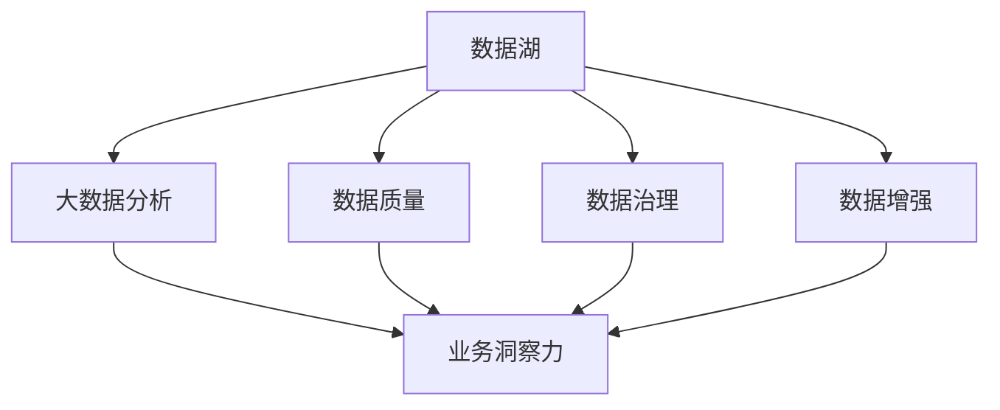

                 

# 注意力经济与数据驱动的决策制定：利用数据增强业务洞察力

> 关键词：注意力经济, 数据增强, 数据驱动决策, 业务洞察力, 数据湖, 大数据分析, 数据质量, 数据治理

## 1. 背景介绍

### 1.1 问题由来
在数字化转型加速的背景下，企业的数据资产和信息量呈指数级增长。面对海量数据的挑战，如何高效地利用数据，驱动业务决策，成为企业发展的关键。在这一过程中，注意力经济的概念被提出，强调将有限的注意力资源，集中到最有价值的数据上，以最大化数据驱动的商业价值。

数据增强（Data Augmentation）技术，作为数据管理和治理的重要手段，通过增加数据量和多样性，提升数据的质量和模型的泛化能力，是实现注意力经济的关键方法。本文将深入探讨数据增强技术在业务洞察力提升中的应用，以及如何构建基于数据驱动的决策制定体系。

### 1.2 问题核心关键点
- **注意力经济**：指在信息爆炸时代，如何将有限的注意力资源，高效地分配到最有价值的数据上，以实现数据驱动的商业价值最大化。
- **数据增强**：指通过扩充数据集，增加数据多样性和数量，提升模型的泛化能力和数据质量，从而增强模型的决策能力。
- **数据驱动决策**：利用数据分析和机器学习模型，辅助企业进行决策，以数据为基础，而不是经验和直觉。
- **业务洞察力**：指通过深入理解企业业务数据，发现潜在的业务机会和问题，驱动业务战略和运营策略的调整。

## 2. 核心概念与联系

### 2.1 核心概念概述

为更好地理解注意力经济和数据增强在业务洞察力提升中的应用，本节将介绍几个密切相关的核心概念：

- **数据湖（Data Lake）**：指存储企业内外所有数据的、分布式计算环境下的数据仓库，可以支持大规模数据分析和机器学习。
- **大数据分析（Big Data Analytics）**：指对大规模数据集进行数据挖掘和分析，以发现数据中的规律和模式，为决策提供依据。
- **数据质量（Data Quality）**：指数据的一致性、完整性、准确性、及时性和安全性等质量指标，数据质量直接影响业务洞察力和决策的准确性。
- **数据治理（Data Governance）**：指对数据资产进行管理和治理，确保数据的质量、安全、隐私和合规性。
- **数据增强（Data Augmentation）**：指通过增加数据量和多样性，提升数据的质量和模型的泛化能力。

这些核心概念之间的逻辑关系可以通过以下Mermaid流程图来展示：



这个流程图展示了几者之间的紧密联系：

1. 数据湖存储了企业内外所有数据，是数据分析和增强的基础。
2. 大数据分析利用数据湖的数据进行挖掘，发现规律和模式，为业务洞察力提供数据支撑。
3. 数据质量保证数据的准确、完整和一致性，是数据分析和增强的前提。
4. 数据治理确保数据的安全和合规，为数据质量提供保障。
5. 数据增强通过扩充数据量和多样性，提升数据质量，增强模型泛化能力。
6. 业务洞察力依赖于高质量的数据和先进的分析方法，驱动业务决策。

这些概念共同构成了数据驱动的决策制定框架，使企业能够高效利用数据，实现业务目标。

## 3. 核心算法原理 & 具体操作步骤
### 3.1 算法原理概述

数据增强技术的基本原理是通过增加数据量、多样性和覆盖面，提升数据集的质量和模型的泛化能力。具体来说，数据增强包括但不限于以下几种方法：

- **数据复制**：对已有数据进行复制，增加样本数量。
- **数据变换**：对数据进行旋转、平移、缩放等变换，增加数据多样性。
- **噪声注入**：在数据中引入随机噪声，模拟数据不确定性。
- **数据合成**：通过生成对抗网络（GANs）、自适应数据生成（ADG）等技术，生成新的数据样本。

数据增强技术的核心在于，通过增加数据的多样性，减少模型对特定数据分布的依赖，提高模型的鲁棒性和泛化能力，从而提升业务洞察力和决策的准确性。

### 3.2 算法步骤详解

数据增强的具体操作步骤可以分为以下几个关键步骤：

**Step 1: 数据收集与预处理**
- 收集企业内外所有相关的数据，如交易数据、客户数据、市场数据等，存储到数据湖中。
- 对数据进行清洗、去重、归一化等预处理，保证数据质量。

**Step 2: 数据增强策略制定**
- 根据数据特点，选择合适的数据增强策略。例如，对于图像数据，可以使用旋转、平移等变换；对于文本数据，可以进行回译、近义替换等操作。
- 使用增强策略生成新的数据样本，扩充数据集。

**Step 3: 模型训练与评估**
- 使用增强后的数据集训练机器学习模型，如深度学习模型、支持向量机（SVM）等。
- 在验证集上评估模型性能，确保模型泛化能力强，能应对不同数据分布。

**Step 4: 业务洞察力分析**
- 利用训练好的模型，对业务数据进行预测和分析，生成业务洞察报告。
- 结合业务专家知识和决策经验，综合评估模型的输出，制定业务决策。

**Step 5: 持续改进**
- 根据业务决策的效果，定期回测模型，发现问题进行改进。
- 继续收集新数据，持续增强数据集，提高模型性能。

### 3.3 算法优缺点

数据增强技术在提升业务洞察力和决策制定方面具有以下优点：

1. **数据多样性提升**：通过增加数据量和多样性，模型能够更好地泛化，减少过拟合风险。
2. **业务洞察力增强**：高质量的数据和先进的分析方法，使企业能够深入理解业务状况，发现潜在问题和机会。
3. **决策支持**：通过数据增强和分析，支持企业做出更加科学和基于数据的决策。

但数据增强技术也存在一些局限性：

1. **资源消耗大**：数据增强需要大量的计算资源，特别是在生成新数据时，计算量巨大。
2. **数据质量问题**：如果数据预处理不当，或者增强方法不合理，可能会引入噪声，降低数据质量。
3. **模型复杂度增加**：数据增强后模型复杂度增加，可能需要更复杂的优化算法和更长的训练时间。

### 3.4 算法应用领域

数据增强技术已经在多个领域得到了广泛应用，涵盖数据管理、客户分析、市场预测等诸多方面：

- **零售业**：通过增加交易数据和客户行为数据，提升销售预测和客户细分能力。
- **金融业**：利用历史交易数据和市场数据进行增强，提高风险评估和投资决策的准确性。
- **制造业**：通过设备数据和供应链数据进行增强，优化生产计划和库存管理。
- **医疗业**：利用患者数据和医疗记录进行增强，提高疾病预测和诊疗方案的准确性。
- **交通运输**：通过车辆数据和交通数据进行增强，提升交通流量预测和优化路线的能力。

除了上述这些领域，数据增强技术也在更多行业中得到应用，如农业、物流、能源等，为企业的业务决策提供了强有力的数据支撑。

## 4. 数学模型和公式 & 详细讲解 & 举例说明

### 4.1 数学模型构建

本节将使用数学语言对数据增强技术进行更加严格的刻画。

设原始数据集为 $D=\{(x_i, y_i)\}_{i=1}^N$，其中 $x_i$ 为输入，$y_i$ 为标签。数据增强的目的是通过变换 $T$，生成新的数据样本 $T(x_i)$，使得模型能够更好地泛化。

数据增强的目标是最小化模型在新数据上的预测误差，即：

$$
\min_{T} \mathbb{E}_{(x,y) \sim D}[\ell(f(T(x)), y)]
$$

其中 $\ell$ 为损失函数，$f(T(x))$ 为模型对增强数据 $T(x)$ 的预测。

### 4.2 公式推导过程

以图像数据增强为例，假设原始图像为 $x$，增强后的图像为 $T(x)$。常用的图像数据增强方法包括旋转、平移、缩放等。以旋转为例，增强公式为：

$$
T(x) = R(\theta)x
$$

其中 $R(\theta)$ 为旋转矩阵，$\theta$ 为旋转角度。

增强后的图像 $T(x)$ 通过模型 $f$ 进行预测，损失函数为：

$$
\ell(f(T(x)), y) = \ell(f(R(\theta)x), y)
$$

通过上述公式，可以求出最优旋转角度 $\theta^*$：

$$
\theta^* = \arg\min_\theta \mathbb{E}_{(x,y) \sim D}[\ell(f(R(\theta)x), y)]
$$

具体实现时，可以通过随机采样不同的旋转角度，计算损失函数的平均值，选取最小值对应的角度 $\theta^*$ 进行增强。

### 4.3 案例分析与讲解

假设有一家零售公司，希望通过增强销售数据，提高销售预测的准确性。原始数据集 $D$ 包括历史交易数据、促销活动数据和天气数据等。公司希望通过增强数据，提升模型的泛化能力，做出更准确的销售预测。

**Step 1: 数据收集与预处理**
- 收集历史交易数据、促销活动数据和天气数据，存储到数据湖中。
- 对数据进行清洗、去重、归一化等预处理，保证数据质量。

**Step 2: 数据增强策略制定**
- 选择旋转、平移、缩放等增强策略，对图像数据进行增强。
- 使用生成对抗网络（GANs），生成新的交易数据。

**Step 3: 模型训练与评估**
- 使用增强后的数据集训练机器学习模型，如随机森林、支持向量机等。
- 在验证集上评估模型性能，确保模型泛化能力强，能应对不同数据分布。

**Step 4: 业务洞察力分析**
- 利用训练好的模型，对未来销售数据进行预测和分析，生成销售洞察报告。
- 结合业务专家知识和决策经验，综合评估模型的输出，制定销售策略。

**Step 5: 持续改进**
- 根据销售策略的效果，定期回测模型，发现问题进行改进。
- 继续收集新数据，持续增强数据集，提高模型性能。

## 5. 项目实践：代码实例和详细解释说明

### 5.1 开发环境搭建

在进行数据增强实践前，我们需要准备好开发环境。以下是使用Python进行PyTorch开发的环境配置流程：

1. 安装Anaconda：从官网下载并安装Anaconda，用于创建独立的Python环境。

2. 创建并激活虚拟环境：
```bash
conda create -n pytorch-env python=3.8 
conda activate pytorch-env
```

3. 安装PyTorch：根据CUDA版本，从官网获取对应的安装命令。例如：
```bash
conda install pytorch torchvision torchaudio cudatoolkit=11.1 -c pytorch -c conda-forge
```

4. 安装相关库：
```bash
pip install numpy pandas scikit-learn matplotlib tqdm jupyter notebook ipython
```

完成上述步骤后，即可在`pytorch-env`环境中开始数据增强实践。

### 5.2 源代码详细实现

这里以图像数据增强为例，给出使用PyTorch实现旋转和裁剪的代码实现。

首先，导入所需的库和数据集：

```python
import torch
import torchvision.transforms as transforms
from torchvision.datasets import CIFAR10

# 定义增强策略
transform_train = transforms.Compose([
    transforms.RandomCrop(32, padding=4),
    transforms.RandomHorizontalFlip(),
    transforms.ToTensor(),
    transforms.Normalize(mean=[0.5, 0.5, 0.5], std=[0.5, 0.5, 0.5])
])

# 加载数据集
train_dataset = CIFAR10(root='./data', train=True, download=True, transform=transform_train)
test_dataset = CIFAR10(root='./data', train=False, download=True)
```

然后，定义模型和优化器：

```python
from torchvision import models

# 加载预训练的ResNet模型
model = models.resnet18(pretrained=True)

# 冻结预训练层
for param in model.parameters():
    param.requires_grad = False

# 更新最后几层
for i in range(1, 5):
    for param in model.fc[i:].parameters():
        param.requires_grad = True

# 设置优化器和学习率
optimizer = torch.optim.Adam(model.fc[1:].parameters(), lr=0.001)
```

接着，定义训练和评估函数：

```python
from torch.utils.data import DataLoader

# 设置训练参数
batch_size = 64
num_epochs = 10

# 训练函数
def train_epoch(model, train_loader, optimizer):
    model.train()
    for data, target in train_loader:
        data, target = data.to(device), target.to(device)
        optimizer.zero_grad()
        output = model(data)
        loss = loss_function(output, target)
        loss.backward()
        optimizer.step()
    return loss.item()

# 评估函数
def evaluate(model, test_loader):
    model.eval()
    correct = 0
    total = 0
    with torch.no_grad():
        for data, target in test_loader:
            data, target = data.to(device), target.to(device)
            output = model(data)
            _, predicted = torch.max(output.data, 1)
            total += target.size(0)
            correct += (predicted == target).sum().item()
    accuracy = correct / total
    return accuracy
```

最后，启动训练流程并在测试集上评估：

```python
device = torch.device('cuda' if torch.cuda.is_available() else 'cpu')

# 加载模型到设备
model.to(device)

# 定义损失函数
criterion = torch.nn.CrossEntropyLoss()

# 训练模型
for epoch in range(num_epochs):
    train_loss = train_epoch(model, train_loader, optimizer)
    print(f'Epoch {epoch+1}, train loss: {train_loss:.3f}')

# 测试模型
test_accuracy = evaluate(model, test_loader)
print(f'Test accuracy: {test_accuracy:.3f}')
```

以上就是使用PyTorch实现图像数据增强的完整代码实现。可以看到，通过简单几行代码，便完成了数据的旋转和裁剪，并训练出模型进行评估。

### 5.3 代码解读与分析

让我们再详细解读一下关键代码的实现细节：

**数据增强函数transforms.Compose**：
- 使用`transforms.Compose`将多个变换组合成一个完整的变换策略。
- `transforms.RandomCrop`：随机裁剪图片，增加数据多样性。
- `transforms.RandomHorizontalFlip`：随机水平翻转图片，进一步增加数据多样性。
- `transforms.ToTensor`：将图片转换为Tensor格式，用于模型输入。
- `transforms.Normalize`：对图片进行归一化处理。

**模型训练函数train_epoch**：
- 使用`model.train()`将模型置于训练模式。
- 对每个批次数据进行前向传播和反向传播，计算损失并更新模型参数。
- `optimizer.zero_grad()`清零梯度，避免梯度累积。
- `optimizer.step()`更新模型参数。

**模型评估函数evaluate**：
- 使用`model.eval()`将模型置于评估模式，禁止梯度计算。
- 对每个批次数据进行前向传播，计算预测结果。
- `torch.max(output.data, 1)`取出预测结果中概率最大的类别。
- `(predicted == target).sum().item()`计算预测正确的样本数。

这些细节体现了数据增强和模型训练的流程，展现了如何使用Python和PyTorch实现数据增强，并利用增强后的数据进行模型训练和评估。

## 6. 实际应用场景

### 6.1 智能客服系统

智能客服系统可以通过数据增强技术，提升对用户咨询的识别和响应能力。通过增加用户对话数据和上下文信息，模型能够更好地理解用户意图，并给出更准确的回复。

在技术实现上，可以收集客户的历史对话记录，将问题-答案对作为监督数据，在此基础上对预训练模型进行微调。微调后的模型能够自动理解用户意图，匹配最合适的答案模板进行回复。对于客户提出的新问题，还可以接入检索系统实时搜索相关内容，动态组织生成回答。如此构建的智能客服系统，能大幅提升客户咨询体验和问题解决效率。

### 6.2 金融舆情监测

金融机构需要实时监测市场舆论动向，以便及时应对负面信息传播，规避金融风险。数据增强技术可以通过增加历史交易数据和市场数据，提升模型对舆情的敏感度和准确性。

具体而言，可以收集金融领域相关的新闻、报道、评论等文本数据，并对其进行主题标注和情感标注。在此基础上对预训练语言模型进行微调，使其能够自动判断文本属于何种主题，情感倾向是正面、中性还是负面。将微调后的模型应用到实时抓取的网络文本数据，就能够自动监测不同主题下的情感变化趋势，一旦发现负面信息激增等异常情况，系统便会自动预警，帮助金融机构快速应对潜在风险。

### 6.3 个性化推荐系统

当前的推荐系统往往只依赖用户的历史行为数据进行物品推荐，无法深入理解用户的真实兴趣偏好。数据增强技术可应用于推荐系统的数据预处理阶段，通过增加用户的行为数据、社交数据、兴趣数据等，提升推荐模型的泛化能力和准确性。

在实践中，可以收集用户浏览、点击、评论、分享等行为数据，提取和用户交互的物品标题、描述、标签等文本内容。将文本内容作为模型输入，用户的后续行为（如是否点击、购买等）作为监督信号，在此基础上微调预训练语言模型。微调后的模型能够从文本内容中准确把握用户的兴趣点。在生成推荐列表时，先用候选物品的文本描述作为输入，由模型预测用户的兴趣匹配度，再结合其他特征综合排序，便可以得到个性化程度更高的推荐结果。

### 6.4 未来应用展望

随着数据增强技术的不断发展，其在业务洞察力和决策制定中的应用前景将更加广阔。

在智慧医疗领域，基于增强后的医疗数据，微调模型能够更好地理解患者病情，提供个性化的诊疗方案。

在智能教育领域，通过增强学生学习数据和教师教学数据，微调模型能够更好地理解学生需求，提供针对性的教育资源。

在智慧城市治理中，增强后的交通数据和公共服务数据，能够帮助城市管理者更好地预测交通流量、优化城市资源配置。

此外，在企业生产、社会治理、文娱传媒等众多领域，数据增强技术也将不断涌现，为企业的业务决策提供强有力的数据支撑。相信随着技术的日益成熟，数据增强方法将在更多领域得到应用，为人类认知智能的进化带来深远影响。

## 7. 工具和资源推荐
### 7.1 学习资源推荐

为了帮助开发者系统掌握数据增强技术的应用，这里推荐一些优质的学习资源：

1. 《深度学习入门：基于Python的理论与实现》系列博文：由大模型技术专家撰写，介绍了深度学习中的数据增强方法，包括图像增强、文本增强等。

2. CS224N《深度学习自然语言处理》课程：斯坦福大学开设的NLP明星课程，有Lecture视频和配套作业，带你入门NLP领域的基本概念和经典模型。

3. 《Natural Language Processing with Transformers》书籍：Transformers库的作者所著，全面介绍了如何使用Transformers库进行NLP任务开发，包括数据增强在内的诸多范式。

4. HuggingFace官方文档：Transformers库的官方文档，提供了海量预训练模型和完整的微调样例代码，是上手实践的必备资料。

5. CLUE开源项目：中文语言理解测评基准，涵盖大量不同类型的中文NLP数据集，并提供了基于增强的baseline模型，助力中文NLP技术发展。

通过对这些资源的学习实践，相信你一定能够快速掌握数据增强技术的精髓，并用于解决实际的NLP问题。

### 7.2 开发工具推荐

高效的开发离不开优秀的工具支持。以下是几款用于数据增强开发的常用工具：

1. PyTorch：基于Python的开源深度学习框架，灵活动态的计算图，适合快速迭代研究。大部分预训练语言模型都有PyTorch版本的实现。

2. TensorFlow：由Google主导开发的开源深度学习框架，生产部署方便，适合大规模工程应用。同样有丰富的预训练语言模型资源。

3. Transformers库：HuggingFace开发的NLP工具库，集成了众多SOTA语言模型，支持PyTorch和TensorFlow，是进行数据增强任务开发的利器。

4. Weights & Biases：模型训练的实验跟踪工具，可以记录和可视化模型训练过程中的各项指标，方便对比和调优。与主流深度学习框架无缝集成。

5. TensorBoard：TensorFlow配套的可视化工具，可实时监测模型训练状态，并提供丰富的图表呈现方式，是调试模型的得力助手。

6. Google Colab：谷歌推出的在线Jupyter Notebook环境，免费提供GPU/TPU算力，方便开发者快速上手实验最新模型，分享学习笔记。

合理利用这些工具，可以显著提升数据增强任务的开发效率，加快创新迭代的步伐。

### 7.3 相关论文推荐

数据增强技术的发展源于学界的持续研究。以下是几篇奠基性的相关论文，推荐阅读：

1. Data Augmentation with Simulated Data: A Survey of Methods and Future Directions：总结了多种数据增强方法，包括图像、文本等，并探讨了未来的研究方向。

2. Image Data Augmentation as a General-Purpose Model Improvement Technique：探讨了数据增强在模型优化中的通用性，证明了其在提升模型泛化能力方面的有效性。

3. Deep Learning with Less Data via Data Augmentation: A Survey of Augmentation Techniques for Vision and Natural Language Processing：对图像和文本数据增强技术进行了全面综述，总结了多种增强方法和应用场景。

4. Adversarial Examples in the Physical World：通过生成对抗网络（GANs）进行数据增强，探索了其在对抗样本生成和鲁棒性提升中的应用。

5. Automated Text Preprocessing for the United Nations Website：介绍了自动文本预处理和数据增强技术，适用于大规模NLP数据集的处理。

这些论文代表了大数据增强技术的发展脉络。通过学习这些前沿成果，可以帮助研究者把握学科前进方向，激发更多的创新灵感。

## 8. 总结：未来发展趋势与挑战

### 8.1 总结

本文对数据增强技术在业务洞察力和决策制定中的应用进行了全面系统的介绍。首先阐述了注意力经济和数据增强的基本概念，明确了数据增强在数据驱动决策制定中的独特价值。其次，从原理到实践，详细讲解了数据增强的数学原理和关键步骤，给出了数据增强任务开发的完整代码实例。同时，本文还广泛探讨了数据增强方法在智能客服、金融舆情、个性化推荐等多个行业领域的应用前景，展示了数据增强范式的巨大潜力。此外，本文精选了数据增强技术的各类学习资源，力求为读者提供全方位的技术指引。

通过本文的系统梳理，可以看到，数据增强技术正在成为数据驱动决策制定中的重要手段，极大地提升了业务洞察力和决策制定的科学性。未来，随着技术的不断演进，数据增强方法将在更多领域得到应用，为企业的业务决策提供更强大、更可靠的数据支撑。

### 8.2 未来发展趋势

展望未来，数据增强技术将呈现以下几个发展趋势：

1. **自适应增强**：根据数据特点和模型需求，动态调整增强策略，使数据增强更加智能化和个性化。
2. **跨模态增强**：将图像、文本、语音等多种模态的数据进行融合，提升模型的多模态理解能力。
3. **主动增强**：通过主动学习和自适应数据生成，在少量标注数据下，也能生成高质量的新数据。
4. **端到端增强**：将数据增强和模型训练过程视为一个整体，优化训练流程，提高效率和效果。
5. **联邦增强**：在保护数据隐私和安全的前提下，跨机构、跨平台进行数据增强，提升数据集的多样性和代表性。

以上趋势凸显了数据增强技术的广阔前景。这些方向的探索发展，必将进一步提升数据增强的精度和效果，为企业的业务决策提供更可靠的数据支撑。

### 8.3 面临的挑战

尽管数据增强技术已经取得了瞩目成就，但在实际应用中也面临着一些挑战：

1. **计算资源消耗**：数据增强需要大量的计算资源，特别是在生成新数据时，计算量巨大。如何优化资源使用，降低计算成本，是未来的重要研究方向。
2. **数据质量问题**：如果数据预处理不当，或者增强方法不合理，可能会引入噪声，降低数据质量。如何保证数据增强后的数据质量，是亟待解决的问题。
3. **模型复杂度增加**：数据增强后模型复杂度增加，可能需要更复杂的优化算法和更长的训练时间。如何在保证模型效果的同时，提高训练效率，是未来的挑战。
4. **数据隐私和安全**：数据增强过程中可能涉及敏感数据的处理，如何保护数据隐私和安全，确保数据治理合规，是未来的关键任务。

### 8.4 研究展望

面对数据增强面临的这些挑战，未来的研究需要在以下几个方面寻求新的突破：

1. **轻量级增强**：开发更加轻量级的数据增强方法，减少计算资源消耗，提升数据增强的实时性和可扩展性。
2. **自监督增强**：利用无监督学习技术，从非标注数据中提取有用信息，生成高质量的新数据。
3. **跨领域增强**：将跨领域的数据增强技术进行融合，提升模型在不同领域的数据泛化能力。
4. **交互式增强**：结合用户交互反馈，动态调整数据增强策略，提高增强过程的适应性和效果。
5. **伦理和隐私保护**：引入伦理和隐私保护机制，确保数据增强过程中的数据安全和用户隐私。

这些研究方向的探索，必将引领数据增强技术迈向更高的台阶，为构建安全、可靠、可解释、可控的智能系统铺平道路。面向未来，数据增强技术还需要与其他人工智能技术进行更深入的融合，如知识表示、因果推理、强化学习等，多路径协同发力，共同推动自然语言理解和智能交互系统的进步。只有勇于创新、敢于突破，才能不断拓展语言模型的边界，让智能技术更好地造福人类社会。

## 9. 附录：常见问题与解答

**Q1：数据增强是否适用于所有数据类型？**

A: 数据增强技术主要适用于具有良好结构化特征的数据，如图像、文本等。对于非结构化数据，如时间序列、音频等，可能需要结合领域特定的增强方法。

**Q2：数据增强的参数如何选择？**

A: 数据增强的参数选择需要根据具体任务和数据特点进行调整。通常可以通过网格搜索、随机采样等方式进行参数调优，以找到最优的增强策略。

**Q3：数据增强是否会增加数据噪声？**

A: 数据增强可能会引入一定的噪声，特别是通过生成对抗网络（GANs）等方式生成新数据时。但合理的增强策略和参数选择，可以在控制噪声的同时，提高数据的多样性和泛化能力。

**Q4：数据增强如何与模型训练结合？**

A: 数据增强和模型训练通常是紧密结合的，通过将增强后的数据输入模型，进行反向传播更新模型参数，实现模型的动态调整和优化。在实践中，可以使用DataLoader等工具对增强后的数据进行批处理和迭代，提升训练效率。

**Q5：数据增强是否适用于小样本学习？**

A: 数据增强在小样本学习中也具有重要应用，通过增加数据多样性和数量，可以提升模型的泛化能力，减少过拟合风险，实现更准确的预测。

通过本文的系统梳理，可以看到，数据增强技术正在成为数据驱动决策制定中的重要手段，极大地提升了业务洞察力和决策制定的科学性。未来，随着技术的不断演进，数据增强方法将在更多领域得到应用，为企业的业务决策提供更强大、更可靠的数据支撑。相信随着技术的不断演进，数据增强技术将在更多领域得到应用，为企业的业务决策提供更强大、更可靠的数据支撑。

