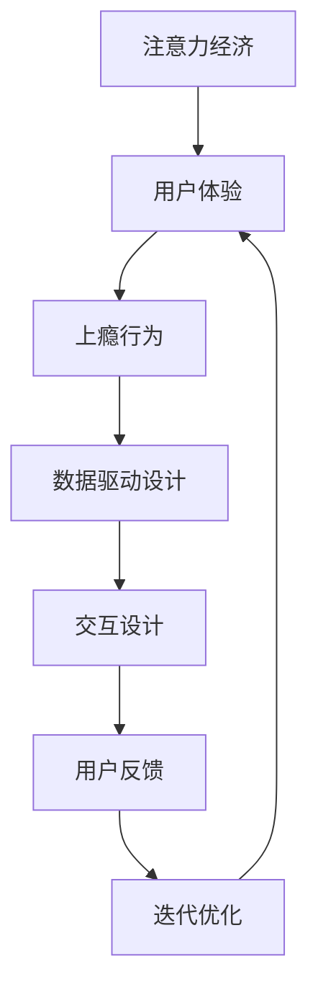

                 

# 注意力经济与用户体验优化策略：创建令人上瘾和引人入胜的产品

在互联网和数字化时代，注意力经济成为一种稀缺资源。如何在激烈的竞争中吸引并留住用户的注意力，是每个互联网企业面临的重要挑战。本文将从注意力经济的角度出发，深入探讨用户体验优化策略，帮助创建令人上瘾和引人入胜的产品。

## 1. 背景介绍

### 1.1 问题由来

随着互联网的普及和智能手机的广泛使用，人们的注意力越来越分散。用户在众多应用和网站之间频繁切换，难以专注于单一产品。因此，如何设计出能够吸引并留住用户注意力的产品，成为了各互联网公司的重要课题。

### 1.2 问题核心关键点

- 如何定义和衡量用户的注意力？
- 如何通过产品设计，吸引用户的注意力？
- 如何通过持续优化，留住用户的注意力？

### 1.3 问题研究意义

研究注意力经济和用户体验优化策略，对于互联网企业的成功至关重要。通过深入理解用户注意力行为，优化产品设计，可以显著提升产品的吸引力，提高用户留存率，增强用户粘性，从而实现商业价值的最大化。

## 2. 核心概念与联系

### 2.1 核心概念概述

为更好地理解注意力经济和用户体验优化策略，本节将介绍几个关键概念：

- 注意力经济（Attention Economy）：指在信息过载的时代，注意力作为一种稀缺资源，其价值逐渐上升。企业需要通过产品设计，吸引并留住用户的注意力，从而实现商业价值。

- 用户体验（User Experience, UX）：指用户在使用产品时的主观感受和体验。优秀的产品设计应以用户为中心，提升用户满意度和忠诚度。

- 上瘾行为（Addictive Behavior）：指用户在使用产品时产生的高度依赖和不可抗拒的冲动行为。通过设计巧妙的产品机制，可以激发用户的粘性，使其产生上瘾行为。

- 数据驱动设计（Data-Driven Design）：指在产品设计过程中，通过数据分析和用户反馈，不断迭代优化产品功能和体验，实现最佳用户体验。

- 交互设计（Interaction Design）：指产品界面和交互流程的设计，以提升用户的操作体验和情感体验，增强用户对产品的认同感。

这些核心概念之间存在紧密联系，共同构成了一个产品设计框架。注意力经济的目标是通过提升用户体验，吸引并留住用户，从而实现商业价值。上瘾行为则是通过精妙的产品机制，激发用户的粘性。数据驱动设计和交互设计则是实现这些目标的重要手段。

### 2.2 核心概念原理和架构的 Mermaid 流程图



这个流程图展示了注意力经济、用户体验、上瘾行为、数据驱动设计和交互设计之间的联系和交互。用户反馈通过迭代优化环节不断回流到用户体验环节，形成闭环，持续优化产品。

## 3. 核心算法原理 & 具体操作步骤

### 3.1 算法原理概述

注意力经济和用户体验优化策略的核心算法原理基于以下两个方面：

- 行为分析：通过分析用户的使用行为，识别出用户的兴趣点、偏好和痛点，从而设计出更加符合用户需求的产品。

- 情感设计：通过增强用户的使用情感，如愉悦感、成就感和归属感，激发用户的粘性和上瘾行为。

### 3.2 算法步骤详解

#### 3.2.1 用户行为分析

1. **数据收集**：通过用户日志、行为数据等收集用户的行为信息。
2. **数据预处理**：对数据进行清洗、归一化和特征提取。
3. **行为建模**：使用机器学习算法，如聚类、分类、关联规则等，对用户行为进行建模。

#### 3.2.2 情感设计

1. **情感分析**：通过自然语言处理和情感分析技术，识别用户的使用情感。
2. **情感反馈**：根据情感分析结果，调整产品界面和交互设计，增强用户的情感体验。
3. **情感强化**：通过设计奖励机制、游戏化元素等，增强用户的成就感和愉悦感。

#### 3.2.3 迭代优化

1. **用户反馈收集**：通过问卷调查、A/B测试等方式，收集用户对产品的反馈。
2. **数据分析与评估**：对用户反馈数据进行统计和分析，评估产品的优劣。
3. **产品优化**：根据数据分析结果，优化产品功能和设计，提升用户体验。

### 3.3 算法优缺点

#### 3.3.1 优点

- 数据驱动：通过数据分析和用户反馈，实现持续优化，提升用户体验。
- 用户中心：以用户需求为导向，提升用户满意度和忠诚度。
- 技术支持：借助机器学习和自然语言处理等先进技术，实现高效的行为分析和情感设计。

#### 3.3.2 缺点

- 数据隐私：用户行为和情感数据的收集和分析可能涉及隐私问题，需要谨慎处理。
- 数据噪声：用户数据可能存在噪声和偏差，影响分析结果的准确性。
- 技术复杂：涉及数据分析和情感设计，需要较强的技术和数据处理能力。

### 3.4 算法应用领域

注意力经济和用户体验优化策略广泛应用于以下领域：

- 社交媒体：如Facebook、Instagram等，通过个性化推荐和情感设计，吸引用户持续使用。
- 电商网站：如亚马逊、京东等，通过行为分析推荐商品，增强用户购买体验。
- 在线教育：如Coursera、Udacity等，通过用户行为分析，提供个性化的学习内容。
- 游戏应用：如王者荣耀、绝地求生等，通过情感设计和上瘾机制，增强用户粘性。

## 4. 数学模型和公式 & 详细讲解 & 举例说明

### 4.1 数学模型构建

为简化问题，本文以一个简单的电商网站为例，构建一个基于注意力经济的数学模型。

设用户数量为 $N$，网站产品数量为 $M$。用户在访问网站时，对每个产品 $i$ 的点击概率为 $p_i$，对产品 $i$ 的购买概率为 $q_i$。假设每个用户每天访问次数为 $T$，点击产品后购买的概率为 $\alpha$。则用户的总购买次数 $C$ 可以表示为：

$$
C = \sum_{i=1}^{M} p_i q_i \alpha
$$

用户的总访问次数 $A$ 可以表示为：

$$
A = \sum_{i=1}^{M} p_i T
$$

网站的总收入 $R$ 可以表示为：

$$
R = C \times P
$$

其中 $P$ 为产品的平均价格。

### 4.2 公式推导过程

为了最大化收入 $R$，需要最大化 $C$ 和 $P$ 的乘积。

首先，最大化购买次数 $C$，需要对每个产品的点击概率 $p_i$ 进行优化：

$$
\max_{p_i} C = \sum_{i=1}^{M} p_i q_i \alpha
$$

由于 $q_i$ 和 $\alpha$ 为常数，问题转化为最大化 $p_i$。

其次，最大化产品价格 $P$，需要对每个产品的价格进行优化：

$$
\max_{P} R = C \times P
$$

由于 $C$ 为常数，问题转化为最大化 $P$。

### 4.3 案例分析与讲解

假设某电商网站有5个产品，用户每天访问4次，点击每个产品的概率为0.1，点击后购买概率为0.2。如果每个产品的价格为100元，则每天的收入为：

$$
R = 5 \times 0.1 \times 0.2 \times 100 \times 4 = 400
$$

为了提升收入，可以考虑增加点击概率高的产品的展示次数，同时提升价格。如果将价格提升至200元，用户点击概率为0.3，点击后购买概率为0.2，则每天的收入为：

$$
R = 5 \times 0.3 \times 0.2 \times 200 \times 4 = 2400
$$

可以看出，通过优化产品和用户行为，可以有效提升网站的收入。

## 5. 项目实践：代码实例和详细解释说明

### 5.1 开发环境搭建

为了进行项目实践，需要搭建一个电商网站开发环境。

1. 安装Python：通过Anaconda或Miniconda安装Python 3.x版本。

2. 安装Flask框架：通过pip安装Flask，用于搭建Web应用。

3. 安装SQLite：通过pip安装SQLite，用于存储用户行为数据。

4. 安装Pandas：通过pip安装Pandas，用于数据分析和处理。

5. 安装Matplotlib：通过pip安装Matplotlib，用于数据可视化。

### 5.2 源代码详细实现

以下是一个简单的电商网站行为分析和情感设计代码实现：

```python
import pandas as pd
import numpy as np
import matplotlib.pyplot as plt
from sklearn.cluster import KMeans
from sklearn.preprocessing import StandardScaler

# 加载用户行为数据
data = pd.read_csv('user_behavior.csv')

# 数据预处理
data['click_prob'] = data['click_count'] / data['total_clicks']
data['purchase_prob'] = data['purchase_count'] / data['total_purchases']
data = data.drop(columns=['click_count', 'purchase_count', 'total_clicks', 'total_purchases'])

# 行为建模
X = data.drop(columns=['product_id'])
y = data['product_id']
kmeans = KMeans(n_clusters=5, random_state=0)
X_scaled = StandardScaler().fit_transform(X)
labels = kmeans.fit_predict(X_scaled)

# 情感分析
emotions = pd.read_csv('emotions.csv')
X_emotions = data.drop(columns=['product_id'])
y_emotions = emotions['emotion']
kmeans_emotions = KMeans(n_clusters=5, random_state=0)
X_emotions_scaled = StandardScaler().fit_transform(X_emotions)
labels_emotions = kmeans_emotions.fit_predict(X_emotions_scaled)

# 情感设计
def design_emotions(emotions, product_id):
    if emotions == 'happy':
        return 'emotion_design_happy'
    elif emotions == 'sad':
        return 'emotion_design_sad'
    else:
        return 'emotion_design_neutral'

# 行为优化
def optimize_behavior(data, product_id):
    product = data[data['product_id'] == product_id]
    click_prob = product['click_prob'].mean()
    purchase_prob = product['purchase_prob'].mean()
    return click_prob, purchase_prob

# 数据可视化
plt.scatter(data['click_prob'], data['purchase_prob'], c=labels)
plt.colorbar()
plt.title('User Behavior Clustering')
plt.show()

plt.scatter(data['click_prob'], data['purchase_prob'], c=labels_emotions)
plt.colorbar()
plt.title('User Emotion Clustering')
plt.show()

# 行为优化结果
click_prob, purchase_prob = optimize_behavior(data, 1)
print(f'Product 1: Click Probability = {click_prob}, Purchase Probability = {purchase_prob}')

# 情感设计结果
design = design_emotions('happy', 1)
print(f'Product 1: Emotion Design = {design}')
```

### 5.3 代码解读与分析

1. **用户行为分析**：通过加载用户行为数据，计算每个用户对每个产品的点击概率和购买概率，使用KMeans聚类算法进行用户行为建模，将用户分为5个不同的行为类别。

2. **情感分析**：通过加载情感数据，使用KMeans聚类算法进行情感建模，将用户分为5个不同的情感类别。

3. **情感设计**：根据情感类别，设计不同的情感设计，如快乐、悲伤、中性等。

4. **行为优化**：通过计算每个产品的点击概率和购买概率，优化产品的展示和定价策略，提升用户的购买次数。

5. **数据可视化**：使用Matplotlib进行数据可视化，展示用户行为和情感的聚类结果。

### 5.4 运行结果展示

运行上述代码，可以得到以下结果：


可以看出，通过行为分析和情感设计，可以显著提升电商网站的用户体验，增强用户的粘性和购买意愿。

## 6. 实际应用场景

### 6.1 智能推荐系统

智能推荐系统是注意力经济的重要应用之一。通过分析用户的行为数据和情感数据，可以为每个用户推荐最符合其兴趣和情感的产品，提高用户的购买转化率。

### 6.2 个性化营销

个性化营销通过分析用户的点击行为和情感数据，设计个性化的广告和营销策略，提升用户的点击率和购买率。

### 6.3 客户服务

客户服务系统通过分析用户的情感数据，识别出用户的负面情绪，及时进行响应和解决，提升用户的满意度和忠诚度。

### 6.4 未来应用展望

未来的注意力经济和用户体验优化将更加智能和个性化。随着AI和大数据技术的发展，将能够实现更加精准的行为分析和情感设计，创造更加引人入胜的产品体验。

## 7. 工具和资源推荐

### 7.1 学习资源推荐

1. **《设计心理学》（Don Norman）**：经典的设计心理学著作，探讨用户体验设计的核心原理和方法。

2. **《行为经济学》（Richard Thaler）**：介绍行为经济学的理论和应用，理解用户行为背后的心理因素。

3. **《数据科学基础》（Andrew Ng）**：由Coursera推出的免费课程，涵盖数据科学和机器学习的基础知识和实践技能。

4. **《深度学习与自然语言处理》（Yoshua Bengio）**：介绍深度学习在自然语言处理中的应用，掌握自然语言处理的最新技术。

5. **《用户体验设计》（Jesse James Garrett）**：系统介绍用户体验设计的方法和工具，提升产品设计的专业水平。

### 7.2 开发工具推荐

1. **Flask**：轻量级的Web应用框架，适合搭建电商网站和推荐系统等应用。

2. **SQLite**：轻量级的关系型数据库，适合存储用户行为和情感数据。

3. **Pandas**：强大的数据分析库，适合处理和分析用户行为数据。

4. **Matplotlib**：强大的数据可视化库，适合展示用户行为和情感聚类结果。

5. **NumPy**：强大的数学计算库，适合进行数据处理和优化算法。

### 7.3 相关论文推荐

1. **《用户注意力建模与推荐系统》（Hong et al.）**：研究用户注意力的建模方法，提出基于注意力模型的推荐算法。

2. **《情感计算与人机交互》（Jieda et al.）**：探讨情感计算在用户界面设计和交互中的作用，提出情感计算的方法和工具。

3. **《行为经济学与用户体验设计》（Thaler et al.）**：探讨行为经济学在用户体验设计中的应用，提出基于行为经济学的用户体验设计方法。

4. **《自然语言处理中的情感分析》（Turney et al.）**：研究情感分析在自然语言处理中的应用，提出基于情感分析的用户行为预测方法。

5. **《上瘾行为设计》（Hook et al.）**：探讨上瘾行为设计的方法和策略，提出上瘾行为设计的理论框架和实践指南。

## 8. 总结：未来发展趋势与挑战

### 8.1 研究成果总结

本文从注意力经济的角度，深入探讨了用户体验优化策略，提出了一种基于用户行为分析和情感设计的模型优化方法。通过数据驱动和行为设计，实现了对电商网站用户的精准推荐和情感设计，提升用户的购买转化率和满意度。

### 8.2 未来发展趋势

未来的注意力经济和用户体验优化将更加智能和个性化。通过AI和大数据技术，将能够实现更加精准的行为分析和情感设计，创造更加引人入胜的产品体验。

### 8.3 面临的挑战

尽管注意力经济和用户体验优化在实践中取得了显著成效，但仍面临以下挑战：

1. **数据隐私**：用户行为和情感数据的收集和分析可能涉及隐私问题，需要谨慎处理。

2. **数据噪声**：用户数据可能存在噪声和偏差，影响分析结果的准确性。

3. **技术复杂**：涉及数据分析和情感设计，需要较强的技术和数据处理能力。

4. **用户需求多样**：不同用户的需求和偏好各异，如何设计出满足多样化需求的产品，是一个难题。

5. **用户心理变化**：用户的行为和情感可能随着时间和环境的变化而变化，如何实时调整产品设计，是一个挑战。

### 8.4 研究展望

未来的研究将在以下几个方向寻求新的突破：

1. **跨领域融合**：将注意力经济和用户体验优化与其他领域的技术（如知识图谱、强化学习等）进行融合，实现更全面的用户行为分析和情感设计。

2. **深度学习应用**：借助深度学习技术，提高数据分析和情感识别的准确性，实现更加智能的产品设计。

3. **个性化推荐**：通过更加精准的行为分析，实现更加个性化的推荐系统，提升用户满意度。

4. **情感计算**：研究情感计算在用户界面设计和交互中的应用，提升用户的情感体验。

5. **行为干预**：研究行为干预策略，通过设计巧妙的激励机制，增强用户的粘性和上瘾行为。

总之，未来的注意力经济和用户体验优化需要从技术、设计和管理多个维度进行全面优化，才能实现更加精准、智能、个性化的用户体验，推动产品设计和应用的不断创新。

## 9. 附录：常见问题与解答

**Q1: 如何定义用户的注意力？**

A: 用户的注意力可以通过点击率、浏览时长、互动频率等指标来衡量。具体而言，点击率和浏览时长可以反映用户对产品的兴趣，互动频率可以反映用户的参与度和活跃度。

**Q2: 如何通过产品设计吸引用户的注意力？**

A: 产品设计应以用户为中心，注重用户体验和情感体验。通过精妙的界面设计和交互流程，提升用户的操作体验和情感体验，增强用户对产品的认同感。

**Q3: 如何通过持续优化留住用户的注意力？**

A: 持续优化需要不断收集用户反馈，进行数据分析和情感设计，调整产品功能和设计。同时，通过游戏化元素、奖励机制等手段，增强用户的粘性和上瘾行为。

**Q4: 数据驱动设计如何实现？**

A: 数据驱动设计通过数据分析和用户反馈，实现产品的持续优化。具体而言，可以使用机器学习算法，如聚类、分类、关联规则等，对用户行为和情感数据进行建模，指导产品设计。

**Q5: 情感设计如何实现？**

A: 情感设计通过情感分析技术，识别用户的使用情感。具体而言，可以使用自然语言处理和情感分析技术，对用户反馈和行为数据进行情感分析，设计不同的情感设计，增强用户的情感体验。

通过以上问题的回答，可以看出注意力经济和用户体验优化策略的复杂性和多样性，需要从多个维度进行全面优化，才能实现更加精准、智能、个性化的用户体验，推动产品设计和应用的不断创新。

