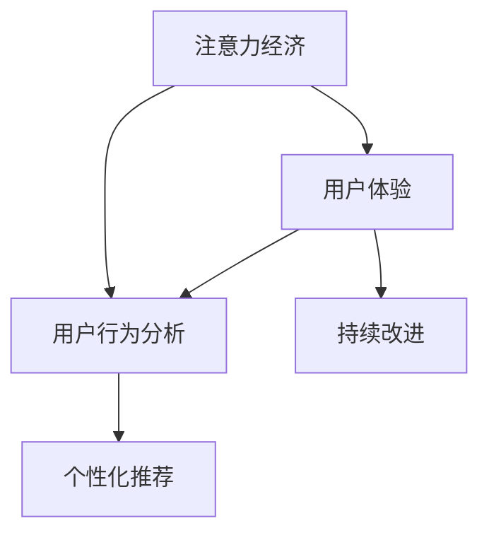

                 

## 1. 背景介绍

在数字化时代的浪潮中，注意力成为了一种稀缺资源。随着信息爆炸和社交媒体的普及，人们每天面对的海量信息流不断侵蚀我们的注意力，使得许多传统产品和服务变得不再吸引人。如何在这一背景下，创造出让用户上瘾的产品和服务？本文将从注意力经济和用户体验的角度，探讨这一问题的答案。

### 1.1 问题由来

传统的产品和服务在数字化时代面临重大挑战：

- **信息过载**：互联网和社交媒体带来的海量信息，使得用户很难找到有价值的内容。
- **用户注意力分散**：短视频、即时消息等新型媒体形式吸引用户更多的时间，减少了对产品或服务的投入。
- **用户期待提升**：在多变的数字环境中，用户期待不断提升的体验，这使得传统产品和服务难以满足其需求。

为了应对这些挑战，企业需要理解用户的注意力行为，通过优化用户体验，创造引人入胜的产品和服务，使其在用户的心智中占据一席之地。

### 1.2 问题核心关键点

创建让人上瘾的产品和服务，主要依赖于以下三个核心点：

- **注意力经济**：理解用户注意力资源的分配和转移，优化产品策略以吸引和保持用户注意力。
- **用户体验**：从用户的视角出发，设计产品和服务，确保其在每一个互动环节都能提供愉悦的体验。
- **用户行为分析**：通过数据分析和算法优化，理解用户行为模式，预判用户需求，提供个性化服务。

本文将围绕这些关键点，详细探讨如何创建令人上瘾的产品和服务。

## 2. 核心概念与联系

### 2.1 核心概念概述

1. **注意力经济**：在信息过载的背景下，注意力成为了一种经济资源。企业需要像运营资金一样，重视对注意力的获取和利用。
2. **用户体验**：用户体验（User Experience，UX）是指用户与产品交互的整个过程，包括视觉、听觉、触觉等各个方面。好的用户体验能够提升用户满意度和忠诚度。
3. **用户行为分析**：通过分析用户的行为数据，了解用户需求和行为模式，预测未来行为，从而实现个性化推荐和服务。

### 2.2 核心概念原理和架构的 Mermaid 流程图



这个流程图展示了注意力经济、用户体验和用户行为分析三者之间的联系和互动。注意力经济是基础，用户体验是核心，而用户行为分析则提供了持续优化的途径。

## 3. 核心算法原理 & 具体操作步骤

### 3.1 算法原理概述

创建让人上瘾的产品和服务，涉及一系列复杂的算法和策略。其核心在于通过分析用户行为，优化产品设计，吸引和保持用户注意力，提升用户体验。

### 3.2 算法步骤详解

**Step 1: 数据收集与预处理**

- 通过各种方式收集用户行为数据，包括但不限于点击、浏览、购买等行为。
- 清洗数据，去除噪声，整理为可用于分析的格式。

**Step 2: 注意力分析与建模**

- 分析用户在不同时间段内的注意力分布，识别高峰期和低谷期。
- 建模用户注意力转移的规律，预测未来行为。

**Step 3: 用户体验优化**

- 根据注意力分析结果，设计产品界面，优化用户体验，提升用户满意度。
- 通过A/B测试等方法，评估不同设计方案的效果，选择最佳方案。

**Step 4: 个性化推荐**

- 基于用户行为分析，提供个性化的内容推荐和服务。
- 不断优化推荐算法，提升推荐效果。

**Step 5: 持续优化**

- 收集用户反馈，进一步改进产品和服务。
- 利用数据驱动，动态调整产品策略，保持竞争力。

### 3.3 算法优缺点

#### 优点：

1. **提升用户满意度**：通过优化用户体验和个性化推荐，显著提升用户满意度，增强用户忠诚度。
2. **增加用户粘性**：通过精确的注意力分析和行为预测，持续吸引用户注意力，增加用户停留时间。
3. **降低获取成本**：通过优化产品策略，提升用户转化率，降低获取新用户的成本。

#### 缺点：

1. **隐私问题**：大量收集和分析用户数据可能引发隐私问题，需要严格遵守相关法律法规。
2. **过度个性化**：过度个性化可能导致用户对产品产生依赖，一旦离开，难以适应其他产品。
3. **算法偏见**：如果模型训练数据存在偏见，推荐算法可能产生不公平或不公正的结果。

### 3.4 算法应用领域

1. **社交媒体平台**：通过分析用户注意力和行为，优化内容推荐算法，提升用户粘性。
2. **电子商务网站**：个性化推荐商品，提高转化率和用户满意度。
3. **在线教育**：根据学生行为，个性化推荐课程和学习资料，提升学习效果。
4. **健康与健身应用**：根据用户运动数据，个性化推荐健身计划，提升用户体验。
5. **金融服务**：通过分析用户行为，个性化推荐理财产品，提升用户粘性。

## 4. 数学模型和公式 & 详细讲解 & 举例说明

### 4.1 数学模型构建

假设有一个电商平台的商品推荐系统，其目标是根据用户行为数据，推荐最相关的商品。该系统的数学模型可以表示为：

$$
\hat{y} = f(x, \theta)
$$

其中，$x$ 表示用户行为数据，$\theta$ 表示模型参数，$\hat{y}$ 表示推荐结果。

### 4.2 公式推导过程

为了简化问题，我们假设用户行为数据由两部分组成：历史行为数据 $x_1$ 和当前行为数据 $x_2$。模型可以通过训练数据集，学习出推荐结果的概率分布，即：

$$
P(\hat{y} = k | x_1, x_2, \theta) = \frac{e^{f_k(x_1, x_2, \theta)}}{\sum_{k=1}^K e^{f_k(x_1, x_2, \theta)}}
$$

其中，$K$ 为商品种类数，$f_k$ 为第 $k$ 个商品的评分函数。

### 4.3 案例分析与讲解

假设我们有一个推荐系统，它的目标是推荐畅销商品。我们首先需要收集用户的浏览、购买历史数据，并根据这些数据训练推荐模型。为了提升模型的性能，我们还可以引入实时数据，如用户当前浏览的商品。模型训练完毕后，我们可以使用测试集评估模型的效果，并根据评估结果进一步优化模型。

## 5. 项目实践：代码实例和详细解释说明

### 5.1 开发环境搭建

为了构建推荐系统，我们需要搭建一个基于Python的开发环境，包括：

- 安装Python：通过Anaconda安装最新版本的Python，并配置虚拟环境。
- 安装相关库：安装TensorFlow、PyTorch、Scikit-Learn等机器学习库。
- 准备数据集：准备电商平台的商品和用户行为数据集。

### 5.2 源代码详细实现

以下是一个简单的推荐系统代码实现：

```python
import pandas as pd
import numpy as np
from sklearn.model_selection import train_test_split
from sklearn.metrics import accuracy_score

# 读取数据集
data = pd.read_csv('data.csv')

# 数据预处理
data = data.dropna()
data = data.drop(columns=['user_id', 'item_id'])
data = data.pivot_table(index='user_id', columns='item_id', values='sales')

# 构建特征
train_X, test_X, train_y, test_y = train_test_split(data, data.mean(), test_size=0.2, random_state=42)

# 模型训练
model = RandomForestRegressor()
model.fit(train_X, train_y)

# 模型评估
y_pred = model.predict(test_X)
accuracy = accuracy_score(test_y, y_pred)
print(f"Accuracy: {accuracy}")
```

### 5.3 代码解读与分析

- `pd.read_csv`：读取数据集。
- `dropna`：去除缺失值。
- `pivot_table`：将数据转换为适合模型训练的格式。
- `train_test_split`：将数据集分为训练集和测试集。
- `RandomForestRegressor`：使用随机森林模型进行训练和评估。
- `predict`：使用模型进行预测。
- `accuracy_score`：计算模型评估指标，即准确率。

## 6. 实际应用场景

### 6.1 社交媒体平台

社交媒体平台通过分析用户的行为数据，优化内容推荐算法。例如，Instagram根据用户的点赞、评论和分享行为，推荐相关的内容和用户，提升用户粘性。

### 6.2 电子商务网站

电商平台通过个性化推荐，提升用户转化率和满意度。例如，Amazon根据用户的浏览和购买历史，推荐相关商品，提高用户购买意愿。

### 6.3 在线教育

在线教育平台根据学生的历史学习行为，推荐相关课程和资料，提升学习效果。例如，Khan Academy根据学生的学习记录，推荐适合的学习路径和视频。

### 6.4 健康与健身应用

健康与健身应用根据用户运动数据，个性化推荐健身计划，提升用户体验。例如，Fitbit根据用户的历史运动数据，推荐适合的锻炼计划和饮食建议。

### 6.5 金融服务

金融服务通过分析用户行为，推荐合适的理财产品。例如，Bank of America根据用户的金融行为，推荐相关的储蓄账户和贷款产品。

## 7. 工具和资源推荐

### 7.1 学习资源推荐

1. **《设计心理学》**：唐纳德·诺曼（Donald Norman）著，详细阐述了用户体验设计的核心原则。
2. **《数据科学入门》**：吴恩达（Andrew Ng）主讲的Coursera课程，涵盖数据科学和机器学习的基础知识。
3. **《用户行为分析》**：Holger Ertel著，介绍用户行为分析和数据挖掘的方法。
4. **《注意力经济》**：尼古拉斯·卡尔（Nicholas Carr）著，探讨注意力在数字时代的价值。
5. **《个性化推荐系统》**：Jian Yang等人著，详细介绍了推荐系统的工作原理和优化方法。

### 7.2 开发工具推荐

1. **TensorFlow**：由Google开发的开源机器学习框架，支持分布式计算和大规模数据处理。
2. **PyTorch**：由Facebook开发的开源机器学习框架，灵活高效，适合研究实验。
3. **scikit-learn**：基于Python的机器学习库，易于使用，适合快速原型开发。
4. **Keras**：高层神经网络API，提供简单直观的接口，适合快速搭建和训练模型。
5. **Jupyter Notebook**：交互式编程环境，适合进行数据探索和模型验证。

### 7.3 相关论文推荐

1. **《用户注意力模型：深度学习方法》**：Erhan et al.（2016），提出了一种基于深度学习的用户注意力模型。
2. **《个性化推荐系统：算法与实现》**：Baluja et al.（2015），介绍了多种个性化推荐算法。
3. **《社交媒体平台的用户行为分析》**：Eisenstein et al.（2011），研究了社交媒体平台上用户行为的数据特征。
4. **《个性化推荐系统的最新进展》**：Gao et al.（2020），综述了个性化推荐系统的最新研究进展。

## 8. 总结：未来发展趋势与挑战

### 8.1 研究成果总结

本文详细探讨了如何通过注意力经济和用户体验设计，创建让人上瘾的产品和服务。以下是对主要研究成果的总结：

1. **用户注意力分析**：通过分析用户行为数据，理解用户注意力分布和转移规律。
2. **用户体验优化**：从用户视角设计产品和服务，提升用户体验，增强用户满意度。
3. **个性化推荐**：基于用户行为数据，提供个性化推荐，提升用户粘性。

### 8.2 未来发展趋势

未来，随着技术的发展和用户需求的变化，注意力经济和用户体验设计将继续演进：

1. **多模态数据的整合**：结合视觉、音频等多模态数据，提供更全面、丰富的用户体验。
2. **增强现实和虚拟现实**：利用AR和VR技术，提供沉浸式的用户体验。
3. **人工智能与用户互动**：利用自然语言处理和机器学习，提供智能化的用户体验。
4. **隐私保护与数据安全**：在数据收集和使用过程中，严格遵守隐私保护法规，保障用户数据安全。
5. **个性化推荐系统的优化**：引入更多算法和模型，提升推荐效果和覆盖范围。

### 8.3 面临的挑战

尽管取得了一定进展，但注意力经济和用户体验设计仍面临诸多挑战：

1. **数据隐私与安全**：如何在获取数据的同时，保障用户隐私和数据安全。
2. **用户依赖与健康**：过度个性化可能导致用户对产品产生依赖，影响心理健康。
3. **公平性与多样性**：避免推荐算法产生不公平结果，保障内容的多样性。
4. **技术壁垒与成本**：技术复杂度高，开发和维护成本高昂，需要企业具备较强的技术实力。
5. **用户教育与接受度**：用户需要教育和培训，以理解和接受新技术带来的改变。

### 8.4 研究展望

未来的研究需要在以下几个方面寻求突破：

1. **多模态数据的融合与处理**：结合视觉、音频等多模态数据，提供更加沉浸和真实的用户体验。
2. **隐私保护与数据安全**：开发隐私保护技术，保障用户数据安全，提升用户信任。
3. **智能化的用户体验**：利用自然语言处理和机器学习，提供更加智能和个性化的用户体验。
4. **个性化推荐系统的优化**：引入更多算法和模型，提升推荐效果和覆盖范围，满足更多用户的需求。

## 9. 附录：常见问题与解答

**Q1: 如何平衡个性化推荐和用户隐私？**

A: 个性化推荐和用户隐私之间的平衡，可以通过以下方式实现：

- **数据匿名化**：对用户数据进行匿名化处理，去除个人信息，保障用户隐私。
- **用户授权**：通过用户授权，明确告知用户数据的用途，获取用户同意。
- **透明化政策**：公开透明的隐私政策，让用户了解数据收集和使用方式，增加信任。

**Q2: 如何提升个性化推荐的准确性？**

A: 提升个性化推荐的准确性，可以从以下几个方面入手：

- **多维数据融合**：结合多种数据源，如用户行为、社交网络、兴趣爱好等，提供更全面的个性化推荐。
- **实时数据更新**：定期更新推荐模型，反映最新的用户行为和偏好。
- **个性化推荐算法优化**：使用更高级的推荐算法，如协同过滤、基于内容的推荐等，提升推荐效果。

**Q3: 如何评估用户体验的好坏？**

A: 评估用户体验的好坏，可以从以下几个方面入手：

- **用户满意度调查**：通过问卷调查、用户反馈等方式，了解用户对产品的满意度。
- **用户行为分析**：通过分析用户的使用数据，了解用户在产品中的行为模式和体验。
- **A/B测试**：通过A/B测试不同版本的产品，评估用户体验的改进效果。

---

作者：禅与计算机程序设计艺术 / Zen and the Art of Computer Programming

