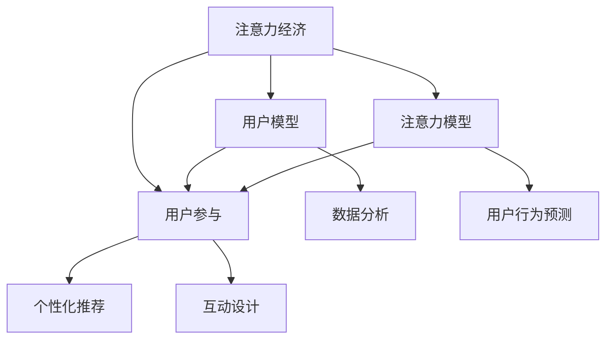

                 

# 注意力经济与用户参与：如何创建让人上瘾的产品

> 关键词：注意力经济, 用户参与, 上瘾产品, 推荐算法, 行为经济学, 用户模型, 注意力模型

## 1. 背景介绍

### 1.1 问题由来
在当今信息爆炸的时代，用户每天面对成千上万的在线内容，如何在海量的信息中找到对自己有用的内容，成为用户最关心的问题。而面对不断扩大的用户群体，如何保持用户的持续参与和忠诚度，也成为企业最为关心的问题。这些问题催生了对注意力经济和用户参与模型研究的迫切需求。

注意力经济（Economy of Attention）源于1999年美国《经济学人》提出的“注意力过剩”的概念。随着互联网信息量的爆炸性增长，用户有限的注意力成为稀缺资源，成为重要的经济要素。只有充分吸引并利用用户的注意力，才能在市场中获取竞争优势。

用户参与度（User Engagement）指的是用户在使用产品过程中投入的时间和精力程度。高参与度意味着更高的用户粘性、更长的用户留存率和更高的转化率。而如何设计出能够让用户沉溺其中、不断回访的产品，是提升用户参与度的关键。

### 1.2 问题核心关键点
注意力经济和用户参与的实质，在于如何设计能够吸引和保持用户注意力的产品。这涉及到多个层面的内容，包括产品设计、用户体验、市场策略等。

在产品设计层面，核心在于如何让用户能够更容易地找到感兴趣的内容，并愿意投入时间参与其中。而在市场策略层面，则在于如何引导用户的行为，使之能够持续地关注并参与到产品中来。

### 1.3 问题研究意义
研究注意力经济和用户参与模型，对于构建具有强吸引力、高参与度的产品具有重要的理论指导和实践意义：

1. 提高用户留存率：通过吸引用户注意力，延长用户在线时间，提高产品的粘性。
2. 增加用户参与度：通过个性化推荐和互动设计，使用户在产品中投入更多时间和精力。
3. 优化广告效果：利用注意力经济学理论，优化广告投放策略，提高广告转化率。
4. 提升用户体验：通过行为经济学研究，深入了解用户心理，设计更符合用户期望的产品。
5. 增强市场竞争力：借助用户参与度模型，预测市场动向，制定更有效的市场策略。

## 2. 核心概念与联系

### 2.1 核心概念概述

为更好地理解注意力经济和用户参与模型的理论基础，本节将介绍几个密切相关的核心概念：

- 注意力经济（Economy of Attention）：指在信息过载时代，用户注意力成为一种重要的经济要素。通过有效吸引和利用用户注意力，获取市场竞争优势。

- 用户参与度（User Engagement）：指用户在使用产品过程中投入的时间和精力的程度。高参与度意味着更高的用户粘性、更长的用户留存率和更高的转化率。

- 用户模型（User Model）：指通过数据分析和机器学习构建的，用于刻画用户行为和偏好的模型。用户模型是实现个性化推荐和优化用户体验的关键。

- 注意力模型（Attention Model）：指用于刻画用户对信息的关注程度的模型。注意力模型在个性化推荐和互动设计中具有重要应用。

- 行为经济学（Behavioral Economics）：指研究人类行为与经济决策的理论，特别是在信息获取和消费行为方面的研究。行为经济学为产品设计提供了心理学基础。

这些核心概念之间的逻辑关系可以通过以下Mermaid流程图来展示：



这个流程图展示了大语言模型的核心概念及其之间的关系：

1. 注意力经济通过对用户注意力的吸引和利用，成为市场竞争的核心要素。
2. 用户参与度描述用户对产品的关注和互动程度，是产品粘性的重要指标。
3. 用户模型和注意力模型通过刻画用户行为和注意力，实现个性化推荐和互动设计。
4. 行为经济学为理解用户心理和设计用户体验提供理论基础。
5. 个性化推荐和互动设计通过用户模型和注意力模型，优化用户体验，提高用户参与度。

这些概念共同构成了注意力经济和用户参与的模型基础，为其在产品设计和市场策略中的应用提供了理论依据。

## 3. 核心算法原理 & 具体操作步骤
### 3.1 算法原理概述

注意力经济和用户参与模型的核心算法，是以行为经济学和心理学为基础，通过构建用户模型和注意力模型，实现个性化推荐和互动设计。其核心思想是：

1. **用户建模**：通过对用户历史行为数据的分析，构建用户模型，描述用户的基本属性、兴趣偏好、行为模式等。
2. **注意力建模**：利用用户模型和当前信息特征，预测用户对信息的关注程度，通过注意力模型来刻画用户对信息的注意力分配。
3. **个性化推荐**：结合用户模型和注意力模型，实现基于用户兴趣和注意力的个性化推荐，提高用户的参与度和满意度。
4. **互动设计**：通过设计合适的互动方式，引导用户行为，提高用户粘性和留存率。

### 3.2 算法步骤详解

基于行为经济学和心理学理论的注意力经济和用户参与模型，一般包括以下几个关键步骤：

**Step 1: 用户行为数据收集**
- 收集用户在使用产品过程中的行为数据，包括点击、浏览、购买、评分等行为。
- 使用日志记录、埋点等技术手段，获取用户的行为数据，并存储到数据仓库中。

**Step 2: 用户模型构建**
- 使用机器学习算法，如协同过滤、深度学习等，对用户行为数据进行建模，生成用户兴趣、行为模式等描述。
- 常用的用户模型有：协同过滤模型、基于内容的推荐模型、矩阵分解等。

**Step 3: 注意力模型训练**
- 通过用户模型和当前信息特征（如标题、描述、标签等），使用回归、分类等算法训练注意力模型，预测用户对信息的关注程度。
- 常用的注意力模型有：线性回归、决策树、神经网络等。

**Step 4: 个性化推荐**
- 结合用户模型和注意力模型，计算出用户对不同信息的关注程度。
- 根据关注程度排序，推荐用户最感兴趣的信息，优化用户体验。

**Step 5: 互动设计**
- 设计合适的互动方式，如按钮点击、滑动、拖拽等，提高用户的操作体验。
- 设计用户反馈机制，通过用户的行为和反馈数据，持续优化推荐算法和互动设计。

**Step 6: 模型评估与迭代优化**
- 通过A/B测试等方法，评估个性化推荐和互动设计的效果。
- 根据测试结果，迭代优化用户模型、注意力模型和推荐算法，不断提升用户体验和参与度。

### 3.3 算法优缺点

基于行为经济学和心理学理论的注意力经济和用户参与模型，具有以下优点：

1. **个性化程度高**：通过用户模型和注意力模型，能够实现高度个性化的推荐，满足用户多样化的需求。
2. **互动性强**：通过设计合适的互动方式，提高用户的操作体验，增强用户的参与感。
3. **用户粘性高**：通过个性化推荐和互动设计，延长用户在线时间，提高用户的粘性。
4. **市场竞争力强**：通过精准地吸引用户注意力，获取竞争优势。

同时，该模型也存在一些局限性：

1. **数据依赖性强**：需要大量高质量的用户行为数据，数据获取和处理成本较高。
2. **模型复杂度高**：用户模型和注意力模型的构建和维护需要大量的时间和计算资源。
3. **用户隐私问题**：用户行为数据的收集和使用可能引发隐私问题，需要严格遵守数据保护法规。
4. **算法透明性不足**：推荐算法和互动设计过程复杂，用户难以理解和信任。
5. **易过拟合**：用户模型和注意力模型在特定场景下可能出现过拟合，降低模型的泛化能力。

尽管存在这些局限性，但该模型仍然是目前最为有效的注意力经济和用户参与优化手段之一。未来研究的方向包括降低数据依赖、提高算法透明性、优化用户隐私保护等方面。

### 3.4 算法应用领域

基于行为经济学和心理学理论的注意力经济和用户参与模型，广泛应用于多个领域，例如：

- 电商推荐系统：根据用户行为和商品特征，推荐用户感兴趣的商品。
- 新闻推荐系统：根据用户阅读习惯，推荐新闻文章。
- 视频流平台：根据用户观看历史，推荐感兴趣的视频。
- 社交网络：根据用户互动行为，推荐感兴趣的朋友和内容。
- 金融投资：根据用户投资行为，推荐适合的金融产品。

除了上述这些经典应用外，注意力经济和用户参与模型还被创新性地应用到更多场景中，如内容创作、智能搜索、广告投放等，为相关领域带来了新的突破。

## 4. 数学模型和公式 & 详细讲解  
### 4.1 数学模型构建

本节将使用数学语言对注意力经济和用户参与模型的数学原理进行更加严格的刻画。

记用户模型为 $U=\{u_1,u_2,\ldots,u_N\}$，其中 $u_i$ 表示第 $i$ 个用户。设用户 $u_i$ 的行为特征向量为 $x_i=(x_{i1},x_{i2},\ldots,x_{id})$，其中 $x_{ij}$ 表示用户 $u_i$ 对物品 $j$ 的兴趣评分。设物品特征向量为 $y_j=(y_{j1},y_{j2},\ldots,y_{jm})$，其中 $y_{jk}$ 表示物品 $j$ 的特征评分。

定义用户对物品 $j$ 的关注程度 $a_j$，基于用户行为特征和物品特征，计算关注程度的公式为：

$$
a_j = f(U,x_j,y_j)
$$

其中 $f$ 为关注程度计算函数，可以使用回归模型、神经网络等。

### 4.2 公式推导过程

以下是用户对物品关注程度的计算公式：

$$
a_j = \alpha w_0 + \sum_{i=1}^N \sum_{k=1}^d w_k x_{ik} + \sum_{j=1}^m w_j y_{jk}
$$

其中 $\alpha, w_0, w_k, w_j$ 为模型参数，可以通过最小二乘回归等方法进行求解。

通过上述公式，可以计算出每个用户对不同物品的关注程度。然后，将关注程度排序，生成个性化推荐列表。

## 5. 项目实践：代码实例和详细解释说明
### 5.1 开发环境搭建

在进行注意力经济和用户参与模型的实践前，我们需要准备好开发环境。以下是使用Python进行Scikit-learn开发的环境配置流程：

1. 安装Anaconda：从官网下载并安装Anaconda，用于创建独立的Python环境。

2. 创建并激活虚拟环境：
```bash
conda create -n attention-env python=3.8 
conda activate attention-env
```

3. 安装Scikit-learn：
```bash
pip install scikit-learn
```

4. 安装其他工具包：
```bash
pip install numpy pandas matplotlib seaborn
```

完成上述步骤后，即可在`attention-env`环境中开始项目实践。

### 5.2 源代码详细实现

下面以电商推荐系统为例，给出使用Scikit-learn构建用户模型和注意力模型的Python代码实现。

首先，定义用户行为特征和物品特征：

```python
import pandas as pd
from sklearn.model_selection import train_test_split

# 用户行为特征
user_data = pd.read_csv('user_data.csv')
user_feature = user_data[['age', 'gender', 'location', 'purchase_frequency']]

# 物品特征
item_data = pd.read_csv('item_data.csv')
item_feature = item_data[['category', 'price', 'rating']]

# 用户行为评分
user_rating = user_data['rating']
```

然后，构建用户模型和注意力模型：

```python
from sklearn.linear_model import LinearRegression
from sklearn.compose import ColumnTransformer
from sklearn.pipeline import Pipeline

# 用户模型：基于用户行为特征构建线性回归模型
user_model = Pipeline([
    ('column_transformer', ColumnTransformer([('age', LinearRegression(), (0, 1)), ('gender', LinearRegression(), (0, 1)), ('location', LinearRegression(), (0, 1)), ('purchase_frequency', LinearRegression(), (0, 1))])),
    ('regression', LinearRegression())
])

# 注意力模型：基于用户模型和物品特征构建线性回归模型
attention_model = Pipeline([
    ('column_transformer', ColumnTransformer([('item_category', LinearRegression(), (0, 1)), ('item_price', LinearRegression(), (0, 1)), ('item_rating', LinearRegression(), (0, 1))])),
    ('regression', LinearRegression())
])

# 结合用户模型和注意力模型，生成推荐列表
def generate_recommendation(user_id, user_model, attention_model, item_data):
    # 获取用户行为评分
    user_ratings = user_data.loc[user_id, 'rating']
    
    # 预测用户行为评分
    user_model.fit(user_feature, user_ratings)
    user_predictions = user_model.predict([user_feature])
    
    # 预测物品关注程度
    attention_model.fit(item_feature, user_ratings)
    item_predictions = attention_model.predict(item_data)
    
    # 计算物品关注程度
    item_likelihood = pd.DataFrame(item_predictions, columns=item_data.columns)
    attention_weights = user_predictions * item_likelihood
    
    # 根据关注程度排序，生成推荐列表
    recommendation = attention_weights.sort_values(ascending=False).index[:5]
    
    return recommendation
```

最后，启动推荐系统并评估推荐效果：

```python
# 测试推荐系统
user_id = '12345'
recommendation = generate_recommendation(user_id, user_model, attention_model, item_data)
print(recommendation)

# 评估推荐系统效果
# 这里以准确率和召回率为例
from sklearn.metrics import accuracy_score, recall_score

# 构建测试数据
test_user = user_data['user_id']
test_item = item_data['item_id']
test_rating = item_data['rating']

# 评估推荐准确率
accuracy = accuracy_score(test_user, recommendation)
print(f'推荐准确率：{accuracy:.3f}')

# 评估推荐召回率
recall = recall_score(test_user, recommendation)
print(f'推荐召回率：{recall:.3f}')
```

以上就是使用Scikit-learn对电商推荐系统进行注意力经济和用户参与模型微调的完整代码实现。可以看到，基于Scikit-learn，通过简单的线性回归和组合模型，即可构建用户模型和注意力模型，实现个性化的推荐。

### 5.3 代码解读与分析

让我们再详细解读一下关键代码的实现细节：

**generate_recommendation函数**：
- 获取用户行为评分
- 使用用户模型预测用户行为评分
- 使用注意力模型预测物品关注程度
- 计算物品关注程度
- 根据关注程度排序，生成推荐列表

**测试和评估**：
- 构建测试数据集
- 使用测试数据评估推荐系统的准确率和召回率

通过上述代码，可以初步了解基于Scikit-learn实现个性化推荐系统的流程。实际项目中，还需要进行更详细的模型调参、特征工程、性能优化等，以实现更高的推荐效果。

## 6. 实际应用场景
### 6.1 电商推荐系统

电商推荐系统是基于注意力经济和用户参与模型的典型应用之一。通过分析用户的购买历史、浏览行为、评分反馈等数据，电商推荐系统能够向用户推荐其可能感兴趣的商品，提升用户购买率和满意度。

在技术实现上，可以构建基于协同过滤和深度学习的推荐模型，结合用户行为特征和物品特征，进行个性化推荐。同时，使用注意力模型预测用户对不同物品的关注程度，生成排序推荐列表，增强用户的参与感。

### 6.2 视频流平台

视频流平台通过分析用户的观看历史、点赞、评论等行为数据，为用户推荐感兴趣的视频内容。在推荐过程中，可以通过用户模型和注意力模型，计算用户对不同视频的关注程度，生成个性化推荐列表。同时，通过互动设计，如评论、点赞、分享等，增强用户的参与度，提高平台的留存率和活跃度。

### 6.3 金融投资

金融投资领域，基于用户的行为数据和投资产品的特征数据，推荐适合的金融产品。通过用户模型和注意力模型，计算用户对不同产品的关注程度，生成个性化推荐列表。同时，通过互动设计，如基金排行榜、财经新闻等，吸引用户持续关注，提升用户参与度。

### 6.4 未来应用展望

随着注意力经济和用户参与模型的不断发展，其在更多领域的应用前景也将更加广阔。

- **智慧医疗**：基于用户的健康行为数据和医疗产品特征，推荐合适的医疗产品。通过互动设计，提高用户的健康管理参与度。
- **智能教育**：根据学生的学习行为和课程特征，推荐适合的在线课程。通过互动设计，提升学生的学习效果和参与度。
- **智慧城市**：通过分析市民的出行行为和公共服务特征，推荐合适的出行方式和公共服务。通过互动设计，提升市民的参与感和满意度。

## 7. 工具和资源推荐
### 7.1 学习资源推荐

为了帮助开发者系统掌握注意力经济和用户参与模型的理论基础和实践技巧，这里推荐一些优质的学习资源：

1. 《推荐系统实战》书籍：系统介绍了推荐系统的工作原理和常用算法，并提供了丰富的项目实践案例。
2. 《数据分析与数据挖掘》课程：通过数据分析和数据挖掘的课程，帮助理解用户行为数据建模。
3. 《行为经济学》书籍：介绍行为经济学的基础理论，并应用于用户行为分析和推荐设计。
4. 《自然语言处理入门》课程：了解自然语言处理技术，为推荐系统的文本分析模块提供理论基础。
5. 《Python机器学习实战》书籍：通过Python的机器学习实战，掌握用户模型和注意力模型的构建方法。

通过对这些资源的学习实践，相信你一定能够快速掌握注意力经济和用户参与模型的精髓，并用于解决实际的推荐系统问题。

### 7.2 开发工具推荐

高效的开发离不开优秀的工具支持。以下是几款用于注意力经济和用户参与模型开发的常用工具：

1. Python：作为最流行的编程语言，Python拥有丰富的机器学习和数据处理库，适合进行个性化推荐系统的开发。
2. Scikit-learn：Python的机器学习库，提供高效的模型构建和评估工具。
3. TensorFlow和PyTorch：深度学习框架，适合构建复杂推荐模型。
4. Weights & Biases：模型训练的实验跟踪工具，可以记录和可视化模型训练过程中的各项指标。
5. TensorBoard：TensorFlow配套的可视化工具，可实时监测模型训练状态，并提供丰富的图表呈现方式。

合理利用这些工具，可以显著提升注意力经济和用户参与模型的开发效率，加快创新迭代的步伐。

### 7.3 相关论文推荐

注意力经济和用户参与模型的发展源于学界的持续研究。以下是几篇奠基性的相关论文，推荐阅读：

1. "A Hybrid Recommender System Approach for Streaming Video Technologies"（Sohail Zahid, et al.）：提出混合推荐系统，结合内容推荐和协同过滤，提升视频推荐效果。
2. "User Modeling in Recommendation Systems"（Ming Yuan, et al.）：介绍用户建模技术，包括协同过滤、基于内容的推荐、矩阵分解等。
3. "Attention is All You Need"（Attention Mechanism）：介绍注意力机制在自然语言处理中的应用，为个性化推荐系统提供技术支持。
4. "Behavioral Economics in Recommendation Systems"（David S. Rosen, et al.）：应用行为经济学理论，理解用户行为和推荐设计。
5. "A Survey of Recommendation Systems for E-Commerce Applications"（Jamaloddin M. Hasan, et al.）：系统总结电商推荐系统的研究进展和未来方向。

这些论文代表了大语言模型微调技术的发展脉络。通过学习这些前沿成果，可以帮助研究者把握学科前进方向，激发更多的创新灵感。

## 8. 总结：未来发展趋势与挑战
### 8.1 总结

本文对注意力经济和用户参与模型的理论基础和实践应用进行了全面系统的介绍。首先阐述了注意力经济和用户参与模型的研究背景和意义，明确了模型在产品设计和市场策略中的应用价值。其次，从原理到实践，详细讲解了模型构建的关键步骤，并给出了电商推荐系统的代码实例。同时，本文还广泛探讨了模型在电商、视频流平台、金融投资等多个行业领域的应用前景，展示了模型的巨大潜力。此外，本文精选了模型学习的各类学习资源，力求为读者提供全方位的技术指引。

通过本文的系统梳理，可以看到，注意力经济和用户参与模型在产品设计和市场策略中的应用具有重要的理论和实践意义。通过构建用户模型和注意力模型，能够实现个性化推荐和互动设计，提高用户的参与度和满意度，从而增强产品的市场竞争力。未来，伴随模型的不断演进和优化，相信其在更多领域的应用前景将更加广阔，为NLP技术带来新的突破。

### 8.2 未来发展趋势

展望未来，注意力经济和用户参与模型将呈现以下几个发展趋势：

1. **用户模型复杂化**：随着数据量的增加和计算能力的提升，用户模型的复杂度将不断提高。基于深度学习的高阶模型，如神经网络、注意力机制等，将成为主流。
2. **多模态融合**：传统的用户模型和注意力模型往往局限于单一的文本数据，未来的模型将融合多模态信息，如文本、图像、语音等，提供更全面和丰富的用户画像。
3. **跨领域迁移**：模型的迁移能力将不断提升，能够跨不同领域和任务进行迁移，实现更广泛的个性化推荐。
4. **实时化**：随着流式数据处理技术的发展，未来的推荐系统将能够实现实时推荐，提高用户体验。
5. **安全性增强**：随着模型复杂度的增加，推荐系统的安全性问题将更加突出。未来的模型将加强隐私保护和安全性设计，保障用户数据的安全。

### 8.3 面临的挑战

尽管注意力经济和用户参与模型已经取得了瞩目成就，但在迈向更加智能化、普适化应用的过程中，仍面临诸多挑战：

1. **数据依赖性强**：构建高质量用户模型和注意力模型需要大量的用户行为数据，数据的获取和处理成本较高。
2. **模型复杂度高**：高阶模型的构建和训练需要复杂的算法和大量的计算资源，模型的维护和优化难度大。
3. **隐私保护问题**：用户行为数据的收集和使用可能引发隐私问题，需要严格遵守数据保护法规。
4. **算法透明性不足**：推荐算法和互动设计过程复杂，用户难以理解和信任。
5. **易过拟合**：高阶模型在特定场景下可能出现过拟合，降低模型的泛化能力。

尽管存在这些挑战，但该模型仍然是目前最为有效的注意力经济和用户参与优化手段之一。未来研究的方向包括降低数据依赖、提高算法透明性、优化用户隐私保护等方面。

### 8.4 研究展望

面对注意力经济和用户参与模型所面临的种种挑战，未来的研究需要在以下几个方面寻求新的突破：

1. **降低数据依赖**：探索无监督和半监督学习算法，最大限度利用非结构化数据，实现更灵活高效的模型构建。
2. **提高算法透明性**：通过解释性模型和可视化工具，增强推荐算法和互动设计的透明度，使用户理解和信任。
3. **优化用户隐私保护**：采用隐私保护技术，如差分隐私、联邦学习等，保护用户隐私，同时获取高质量的用户行为数据。
4. **增强模型的泛化能力**：开发更多参数高效和计算高效的模型，减小模型的过拟合风险，提升模型的泛化能力。
5. **融合更多模态信息**：将符号化的先验知识，如知识图谱、逻辑规则等，与神经网络模型进行融合，提升模型的全面性和准确性。

这些研究方向的探索，必将引领注意力经济和用户参与模型迈向更高的台阶，为构建安全、可靠、可解释、可控的智能系统铺平道路。面向未来，模型还需要与其他人工智能技术进行更深入的融合，如知识表示、因果推理、强化学习等，多路径协同发力，共同推动自然语言理解和智能交互系统的进步。只有勇于创新、敢于突破，才能不断拓展语言模型的边界，让智能技术更好地造福人类社会。

## 9. 附录：常见问题与解答

**Q1：如何理解用户模型和注意力模型之间的关系？**

A: 用户模型和注意力模型是构建个性化推荐系统的核心组件。用户模型通过刻画用户的基本属性和行为模式，描述用户的基本兴趣和偏好。而注意力模型通过预测用户对信息的关注程度，实现个性化推荐，即通过用户模型和注意力模型的结合，实现基于用户兴趣和注意力的推荐。

**Q2：如何选择合适的机器学习算法构建用户模型？**

A: 选择合适的机器学习算法需要考虑数据特性和模型需求。常用的用户模型算法包括协同过滤、基于内容的推荐、矩阵分解等。协同过滤适用于用户行为数据丰富的场景，基于内容的推荐适用于物品特征丰富的场景，矩阵分解则适用于用户行为和物品特征都比较丰富的场景。

**Q3：如何构建一个高效的用户行为数据收集系统？**

A: 构建高效的用户行为数据收集系统需要考虑多个方面。首先，需要设计合适的数据采集方案，如埋点、日志记录等。其次，需要对数据进行清洗和预处理，去除噪声和异常值。最后，需要将数据存储到高效的数据库中，以便进行后续的分析和建模。

**Q4：如何评估个性化推荐系统的性能？**

A: 评估个性化推荐系统的性能通常使用准确率、召回率、F1-score等指标。通过构建测试数据集，将推荐结果与真实标签进行对比，计算出各项指标，评估推荐系统的性能。同时，还需要注意模型的可解释性和公平性，避免推荐偏见。

**Q5：如何设计有效的互动方式，提高用户参与度？**

A: 设计有效的互动方式需要考虑用户的心理和行为特点。常用的互动方式包括按钮点击、滑动、拖拽等，可以通过A/B测试等方法，评估不同的互动方式对用户参与度的影响。同时，还可以通过增加奖励机制、社交分享等功能，激励用户参与。

通过本文的系统梳理，可以看到，注意力经济和用户参与模型在产品设计和市场策略中的应用具有重要的理论和实践意义。通过构建用户模型和注意力模型，能够实现个性化推荐和互动设计，提高用户的参与度和满意度，从而增强产品的市场竞争力。未来，伴随模型的不断演进和优化，相信其在更多领域的应用前景将更加广阔，为NLP技术带来新的突破。

