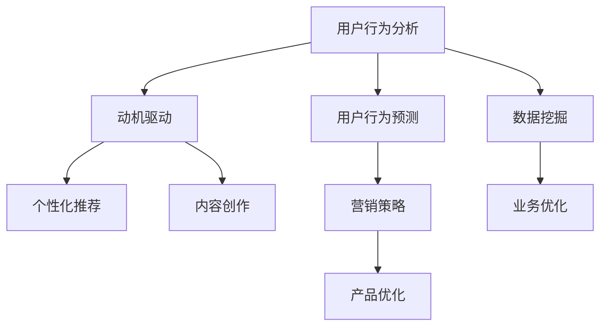
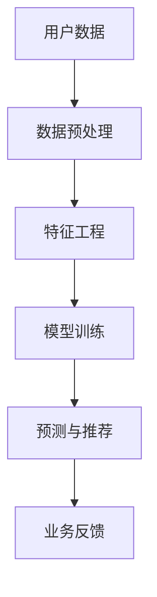

                 

# 注意力经济与用户行为分析：了解受众的动机和行为

> 关键词：注意力经济, 用户行为分析, 动机驱动, 用户行为预测, 营销策略, 数据挖掘, 推荐系统

## 1. 背景介绍

### 1.1 问题由来

在数字化时代，注意力经济（Economy of Attention）成为了一种新的经济形态。随着信息的爆炸性增长，用户面临着信息过载的挑战。企业希望通过吸引和保持用户的注意力，以实现更高的商业价值。为此，理解用户的动机和行为成为了营销和产品设计的核心任务。

近年来，人工智能和大数据技术的发展，使得用户行为分析成为了可能。通过数据挖掘和机器学习技术，可以从用户的历史行为中挖掘出背后的动机，预测未来的行为，进而指导营销和产品改进。这些技术应用广泛，涉及广告投放、个性化推荐、内容创作等多个领域。

### 1.2 问题核心关键点

本节将介绍几个核心概念，以及它们之间的联系，为后续的深入分析提供基础。

- **用户行为分析（User Behavior Analysis）**：通过数据挖掘和机器学习技术，从用户的历史行为中提取模式和规律，理解用户的动机和行为。
- **动机驱动（Motivation-Driven）**：基于用户的动机（如好奇心、社交需求、物质需求等）进行个性化推荐或内容创作，以提升用户满意度。
- **用户行为预测（User Behavior Prediction）**：利用历史数据和机器学习模型，预测用户未来的行为，从而指导企业决策和优化产品。
- **推荐系统（Recommendation Systems）**：通过分析用户的历史行为和兴趣，推荐相关的内容或产品，提升用户体验和转化率。
- **数据挖掘（Data Mining）**：从大量数据中挖掘出有价值的信息和模式，辅助决策制定和业务优化。

这些概念之间的联系可以通过以下Mermaid流程图来展示：



这个流程图展示了用户行为分析如何通过动机驱动，预测用户行为，从而优化推荐系统、营销策略和产品，并在数据挖掘的基础上进一步优化业务。

## 2. 核心概念与联系

### 2.1 核心概念概述

为了更好地理解注意力经济和用户行为分析的核心概念，本节将对几个关键概念进行概述。

- **用户动机（User Motivation）**：用户行为背后的驱动力，包括好奇心、社交需求、物质需求等。
- **用户行为（User Behavior）**：用户在特定情境下的行为表现，如浏览、点击、购买等。
- **用户画像（User Persona）**：描述用户特征和需求的模型，包括性别、年龄、兴趣等。
- **动机分析（Motivation Analysis）**：通过数据挖掘和机器学习，识别用户行为背后的动机。
- **行为预测（Behavior Prediction）**：利用历史数据和模型，预测用户未来的行为。
- **个性化推荐（Personalized Recommendation）**：根据用户的个性化需求，推荐相关的内容或产品。
- **推荐算法（Recommendation Algorithms）**：用于个性化推荐的算法，包括协同过滤、内容推荐等。

这些概念之间的联系可以总结如下：用户行为分析通过动机分析，预测用户行为，并利用个性化推荐和推荐算法，提供符合用户需求的推荐。

### 2.2 核心概念原理和架构的 Mermaid 流程图

以下是一个简单的Mermaid流程图，展示了用户行为分析的基本架构：



这个流程图展示了用户行为分析的基本流程：从用户数据开始，经过数据预处理和特征工程，训练模型进行预测与推荐，最终反馈业务优化。

## 3. 核心算法原理 & 具体操作步骤

### 3.1 算法原理概述

用户行为分析的核心算法包括协同过滤、内容推荐、情感分析等。这些算法通常基于用户的过去行为数据，预测其未来的行为。

协同过滤算法利用用户之间的相似性，推荐用户可能感兴趣的内容。内容推荐算法则基于内容的特征，如关键词、标签等，推荐相关的内容。情感分析算法通过自然语言处理技术，分析用户评论的情绪，辅助内容创作和推荐。

### 3.2 算法步骤详解

以下是几个核心算法的详细步骤：

#### 3.2.1 协同过滤算法（Collaborative Filtering）

**步骤1：构建用户-物品评分矩阵**

首先，收集用户对不同物品的评分数据，构建用户-物品评分矩阵 $R$。

**步骤2：计算用户相似度**

利用余弦相似度等方法，计算用户之间的相似度。

**步骤3：推荐物品**

根据用户相似度和评分矩阵，通过加权平均等方法，推荐用户可能感兴趣的新物品。

#### 3.2.2 内容推荐算法（Content-Based Recommendation）

**步骤1：提取特征**

从物品描述中提取关键词、标签等特征。

**步骤2：构建特征向量**

将物品的特征向量表示为一个向量。

**步骤3：计算相似度**

利用余弦相似度等方法，计算用户和物品之间的相似度。

**步骤4：推荐物品**

根据相似度排序，推荐相关物品。

#### 3.2.3 情感分析算法（Sentiment Analysis）

**步骤1：预处理文本**

对用户评论进行文本预处理，包括分词、去停用词等。

**步骤2：特征提取**

利用TF-IDF、词向量等方法，提取文本特征。

**步骤3：分类模型训练**

使用情感分类模型，如朴素贝叶斯、支持向量机等，对文本进行情感分类。

**步骤4：分析情感**

根据情感分类结果，分析用户对内容的情感倾向。

### 3.3 算法优缺点

#### 3.3.1 协同过滤算法的优缺点

**优点**：
- 无需物品特征信息。
- 适用于用户量大的系统。
- 推荐效果较好。

**缺点**：
- 数据稀疏性问题。
- 新物品推荐困难。
- 冷启动问题。

#### 3.3.2 内容推荐算法的优缺点

**优点**：
- 推荐物品的多样性。
- 推荐效果较好。
- 无需用户评分信息。

**缺点**：
- 物品特征提取困难。
- 物品特征表示的稀疏性问题。
- 用户兴趣多变。

#### 3.3.3 情感分析算法的优缺点

**优点**：
- 辅助内容创作和推荐。
- 提高用户满意度。
- 提供丰富的情感信息。

**缺点**：
- 文本预处理困难。
- 情感分类准确性问题。
- 用户评论多样性问题。

### 3.4 算法应用领域

这些算法在多个领域得到了广泛应用，包括：

- **电商推荐**：通过分析用户的历史购买记录，推荐相关商品。
- **内容推荐**：根据用户的历史阅读记录，推荐相关文章或视频。
- **社交网络**：推荐用户可能感兴趣的朋友或内容。
- **广告投放**：根据用户的行为和兴趣，推荐相关广告。
- **健康管理**：推荐适合用户健康状况的饮食和运动计划。

## 4. 数学模型和公式 & 详细讲解 & 举例说明

### 4.1 数学模型构建

用户行为分析通常涉及以下数学模型：

- **用户-物品评分矩阵**：$R_{ui}$，表示用户 $u$ 对物品 $i$ 的评分。
- **余弦相似度**：$\cos(\theta_{uv})$，表示用户 $u$ 和 $v$ 的相似度。
- **物品特征向量**：$x_i$，表示物品 $i$ 的特征向量。
- **用户兴趣表示**：$\vec{p}_u$，表示用户 $u$ 的兴趣向量。
- **情感分类模型**：$f(x)$，将用户评论 $x$ 分类为正面或负面。

### 4.2 公式推导过程

#### 4.2.1 协同过滤算法

**余弦相似度计算公式**：

$$
\cos(\theta_{uv}) = \frac{\sum_{i=1}^{n} R_{ui} \cdot R_{vi}}{\sqrt{\sum_{i=1}^{n} R_{ui}^2} \cdot \sqrt{\sum_{i=1}^{n} R_{vi}^2}}
$$

**推荐物品计算公式**：

$$
\hat{R}_{iu} = \sum_{v \in \mathcal{N}(u)} (\cos(\theta_{uv}) \cdot R_{vi}) / (\sum_{v \in \mathcal{N}(u)} \cos(\theta_{uv}))
$$

其中，$\mathcal{N}(u)$ 表示与用户 $u$ 相似的用户集合。

#### 4.2.2 内容推荐算法

**物品特征向量计算公式**：

$$
x_i = \{w_1, w_2, ..., w_m\}
$$

**用户兴趣表示计算公式**：

$$
\vec{p}_u = \sum_{i=1}^{m} \alpha_i x_i
$$

**相似度计算公式**：

$$
\cos(\theta_{ui}) = \vec{p}_u \cdot x_i / (\|\vec{p}_u\| \cdot \|x_i\|)
$$

**推荐物品计算公式**：

$$
\hat{R}_{iu} = \cos(\theta_{ui}) \cdot x_i
$$

#### 4.2.3 情感分析算法

**情感分类模型公式**：

$$
f(x) = \sum_{i=1}^{n} \alpha_i x_i
$$

**情感分析结果计算公式**：

$$
\hat{s}_u = \sum_{i=1}^{n} \alpha_i f(x_i)
$$

其中，$n$ 表示用户评论的总数，$x_i$ 表示第 $i$ 条评论的特征向量。

### 4.3 案例分析与讲解

假设我们要为一个电商网站进行用户推荐。

**数据准备**：收集用户的历史购买记录，构建用户-物品评分矩阵。

**协同过滤算法应用**：
1. 计算用户 $u$ 和物品 $i$ 的余弦相似度。
2. 根据相似度排序，推荐用户 $u$ 可能感兴趣的新物品。

**内容推荐算法应用**：
1. 从物品描述中提取关键词、标签等特征。
2. 构建物品特征向量 $x_i$。
3. 计算用户 $u$ 和物品 $i$ 的相似度。
4. 根据相似度排序，推荐相关物品。

**情感分析算法应用**：
1. 对用户评论进行文本预处理。
2. 利用TF-IDF等方法提取文本特征。
3. 使用朴素贝叶斯等情感分类模型，对用户评论进行分类。
4. 根据情感分类结果，分析用户对内容的情感倾向。

## 5. 项目实践：代码实例和详细解释说明

### 5.1 开发环境搭建

在进行用户行为分析实践前，我们需要准备好开发环境。以下是使用Python进行Pandas和Scikit-Learn开发的环境配置流程：

1. 安装Anaconda：从官网下载并安装Anaconda，用于创建独立的Python环境。

2. 创建并激活虚拟环境：
```bash
conda create -n user-behavior-analysis python=3.8 
conda activate user-behavior-analysis
```

3. 安装Pandas和Scikit-Learn：
```bash
conda install pandas scikit-learn
```

4. 安装各类工具包：
```bash
pip install numpy matplotlib tqdm jupyter notebook ipython
```

完成上述步骤后，即可在`user-behavior-analysis`环境中开始项目实践。

### 5.2 源代码详细实现

下面我们以协同过滤算法为例，给出使用Pandas和Scikit-Learn库进行用户推荐系统的PyTorch代码实现。

首先，定义用户-物品评分矩阵：

```python
import pandas as pd

# 加载评分数据
ratings = pd.read_csv('ratings.csv')

# 构建用户-物品评分矩阵
R = ratings.pivot(index='user', columns='item', values='rating').fillna(0)
```

然后，定义协同过滤算法：

```python
from sklearn.metrics.pairwise import cosine_similarity

# 计算用户相似度
similarity = cosine_similarity(R, R)

# 计算用户推荐物品
def recommend_items(user, top_n=10):
    # 获取用户相似度
    similar_users = similarity[user].argsort()[::-1]
    # 获取相似用户对物品的评分
    scores = R[(similar_users != user)].sum(axis=0)
    # 归一化
    scores = scores / ((scores > 0).sum() + 1e-10)
    # 推荐物品
    top_items = scores.argsort()[-top_n][::-1]
    return top_items
```

最后，使用协同过滤算法进行用户推荐：

```python
user = '1'
recommendations = recommend_items(user)
print(f"推荐物品: {recommendations}")
```

以上就是使用Pandas和Scikit-Learn进行协同过滤算法的完整代码实现。可以看到，利用Python的Pandas和Scikit-Learn库，可以快速构建用户行为分析系统，实现用户推荐功能。

### 5.3 代码解读与分析

让我们再详细解读一下关键代码的实现细节：

**用户-物品评分矩阵**：
- 使用Pandas库的`pivot`方法，将原始评分数据转换为用户-物品评分矩阵。

**协同过滤算法**：
- 利用Scikit-Learn库的`cosine_similarity`方法，计算用户之间的相似度。
- 根据相似度排序，选择最相似的用户，计算这些用户对物品的评分，归一化后推荐物品。

**用户推荐**：
- 调用`recommend_items`函数，传入用户ID和推荐数量，即可获取推荐物品列表。

## 6. 实际应用场景

### 6.1 电商推荐

电商推荐是用户行为分析的一个重要应用场景。通过分析用户的历史购买记录，推荐相关商品，可以提升用户体验和销售额。

**数据准备**：
- 收集用户的历史购买记录，包括用户ID、物品ID、评分等。
- 使用Pandas库将数据转换为用户-物品评分矩阵。

**协同过滤算法应用**：
- 计算用户之间的相似度，选择最相似的用户，推荐新物品。
- 使用Top-k推荐策略，推荐最相关的物品。

**内容推荐算法应用**：
- 从物品描述中提取关键词、标签等特征。
- 构建物品特征向量，计算用户和物品之间的相似度，推荐相关物品。

### 6.2 内容推荐

内容推荐系统广泛应用于视频、音乐、新闻等领域。通过分析用户的历史行为，推荐相关的内容，可以提高用户粘性和满意度。

**数据准备**：
- 收集用户的历史浏览记录，包括用户ID、内容ID、浏览时间等。
- 使用Pandas库将数据转换为用户-内容互动矩阵。

**协同过滤算法应用**：
- 计算用户之间的相似度，选择最相似的用户，推荐新内容。
- 使用Top-k推荐策略，推荐最相关的内容。

**内容推荐算法应用**：
- 从内容描述中提取关键词、标签等特征。
- 构建内容特征向量，计算用户和内容之间的相似度，推荐相关内容。

### 6.3 社交网络

社交网络推荐系统通过分析用户的互动记录，推荐可能感兴趣的朋友或内容，提升用户活跃度和满意度。

**数据准备**：
- 收集用户之间的互动记录，包括用户ID、朋友ID、互动时间等。
- 使用Pandas库将数据转换为用户-朋友互动矩阵。

**协同过滤算法应用**：
- 计算用户之间的相似度，选择最相似的用户，推荐新朋友。
- 使用Top-k推荐策略，推荐最相关的朋友。

**内容推荐算法应用**：
- 从内容描述中提取关键词、标签等特征。
- 构建内容特征向量，计算用户和内容之间的相似度，推荐相关内容。

### 6.4 未来应用展望

随着用户行为分析技术的不断发展，未来将在更多领域得到应用，为传统行业带来变革性影响。

在智慧医疗领域，用户行为分析可以帮助医院优化医疗资源配置，提升诊疗效率和服务质量。

在智能教育领域，用户行为分析可以分析学生的学习行为，提供个性化的学习建议，提高教学效果。

在智慧城市治理中，用户行为分析可以分析市民的出行行为，优化交通管理和城市规划。

此外，在企业生产、社会治理、文娱传媒等众多领域，用户行为分析技术也将不断涌现，为经济社会发展注入新的动力。

## 7. 工具和资源推荐

### 7.1 学习资源推荐

为了帮助开发者系统掌握用户行为分析的理论基础和实践技巧，这里推荐一些优质的学习资源：

1. 《数据科学导论》系列博文：由知名数据科学家撰写，深入浅出地介绍了数据科学的基本概念和前沿技术。

2. 《Python数据分析》课程：由Coursera提供的Python数据分析课程，涵盖Pandas、Numpy等数据处理工具的详细讲解。

3. 《机器学习基础》书籍：涵盖机器学习的基本理论和常用算法，适合初学者和进阶读者。

4. 《推荐系统》书籍：深入讲解推荐系统的基本原理和算法，适合研究和应用推荐系统的开发者。

5. 《用户行为分析》课程：由Udacity提供，涵盖用户行为分析的基本概念和常用技术。

通过对这些资源的学习实践，相信你一定能够快速掌握用户行为分析的精髓，并用于解决实际的业务问题。

### 7.2 开发工具推荐

高效的开发离不开优秀的工具支持。以下是几款用于用户行为分析开发的常用工具：

1. Pandas：Python的数据处理库，支持快速的数据加载、清洗和分析。
2. Scikit-Learn：Python的机器学习库，支持常用的分类、回归、聚类等算法。
3. TensorFlow：谷歌主导的深度学习框架，支持大规模的深度学习模型训练。
4. Jupyter Notebook：交互式的数据分析和编程工具，支持多种语言和库。
5. Apache Spark：分布式计算框架，支持大规模数据的处理和分析。

合理利用这些工具，可以显著提升用户行为分析的开发效率，加快创新迭代的步伐。

### 7.3 相关论文推荐

用户行为分析技术的发展源于学界的持续研究。以下是几篇奠基性的相关论文，推荐阅读：

1. Recommender Systems Handbook（推荐系统手册）：由Liu等撰写，涵盖推荐系统的理论和应用，适合研究和应用推荐系统的开发者。
2. Mining of Massive Datasets（大数据挖掘）：由Jarvelin等撰写，涵盖大数据挖掘的基本概念和常用技术。
3. Collaborative Filtering for Recommender Systems（协同过滤在推荐系统中的应用）：由Herlocker等撰写，详细讲解协同过滤算法的原理和应用。
4. Fast User Similarity Search in Collaborative Filtering（协同过滤中的用户相似度快速搜索）：由Ji等撰写，提出基于负采样的相似度搜索方法。
5. Mining and Analysis of Online User Behavior（在线用户行为的挖掘和分析）：由Xu等撰写，涵盖用户行为分析的基本方法和应用。

这些论文代表了大规模数据分析和推荐系统的最新进展，通过学习这些前沿成果，可以帮助研究者把握学科前进方向，激发更多的创新灵感。

## 8. 总结：未来发展趋势与挑战

### 8.1 总结

本文对用户行为分析方法进行了全面系统的介绍。首先阐述了用户行为分析在数字化时代的重要性和应用场景，明确了用户行为分析在提升用户体验和优化产品设计中的关键作用。其次，从原理到实践，详细讲解了协同过滤、内容推荐、情感分析等核心算法的步骤和实现，给出了用户行为分析任务的完整代码实例。同时，本文还广泛探讨了用户行为分析技术在电商、内容推荐、社交网络等多个领域的应用前景，展示了用户行为分析技术的广阔前景。

通过本文的系统梳理，可以看到，用户行为分析技术正在成为数字化时代的核心工具，极大地提升了企业在用户分析和个性化推荐方面的能力，为各行各业带来了新的业务价值。

### 8.2 未来发展趋势

展望未来，用户行为分析技术将呈现以下几个发展趋势：

1. 数据量的持续增长。随着物联网、智能设备的普及，用户行为数据将进一步增多，为数据挖掘和分析提供了更丰富的素材。

2. 多模态数据的融合。未来的用户行为数据将不仅限于文本，还包含语音、图像、视频等多模态数据。融合多模态数据将带来更加全面的用户画像和更精准的行为分析。

3. 实时化的分析。随着实时数据流处理技术的成熟，用户行为分析将能够实现实时化，及时响应用户需求，提升用户体验。

4. 自动化和智能化。自动化机器学习（AutoML）和智能化算法将帮助用户行为分析系统实现更高的自动化和智能化，减少人工干预。

5. 跨领域的应用。用户行为分析技术将突破传统的电商、社交等领域，应用于更多垂直行业，如医疗、教育、智能城市等，带来新的应用场景和业务价值。

这些趋势凸显了用户行为分析技术的广阔前景。这些方向的探索发展，必将进一步提升用户行为分析系统的性能和应用范围，为数字化时代的业务创新提供新的动力。

### 8.3 面临的挑战

尽管用户行为分析技术已经取得了瞩目成就，但在迈向更加智能化、普适化应用的过程中，它仍面临着诸多挑战：

1. 数据隐私和安全问题。用户行为数据涉及个人隐私，如何在保障隐私的同时进行数据分析，是一大难题。

2. 数据质量问题。用户行为数据存在噪音和缺失，如何清洗和处理数据，是用户行为分析的难点。

3. 算法复杂性问题。用户行为分析涉及复杂的机器学习算法，如何优化算法模型，提高预测准确性，是一大挑战。

4. 多领域的应用挑战。用户行为分析在垂直行业的应用具有复杂性和多样性，如何针对不同领域设计高效的算法，是一大挑战。

5. 算力成本问题。大规模数据挖掘和分析需要高性能计算资源，如何降低算力成本，是一大挑战。

正视用户行为分析面临的这些挑战，积极应对并寻求突破，将使这一技术不断成熟，为数字化时代的业务创新提供新的支持。

### 8.4 研究展望

面对用户行为分析所面临的挑战，未来的研究需要在以下几个方面寻求新的突破：

1. 隐私保护技术。开发隐私保护算法，确保用户行为数据的安全性和隐私性，如差分隐私、联邦学习等。

2. 数据质量提升。开发数据清洗和处理技术，提升数据质量，如缺失值填充、噪声过滤等。

3. 高效算法设计。设计高效的算法模型，提升预测准确性和处理速度，如深度学习、强化学习等。

4. 跨领域应用技术。开发适用于不同垂直行业的用户行为分析技术，如医疗、教育、智能城市等。

5. 算力优化技术。优化算法模型和计算资源，降低算力成本，如分布式计算、模型压缩等。

这些研究方向将引领用户行为分析技术迈向更高的台阶，为构建智能、普适的用户行为分析系统铺平道路。面向未来，用户行为分析技术需要与其他人工智能技术进行更深入的融合，如知识表示、因果推理、强化学习等，多路径协同发力，共同推动数字经济的进步。只有勇于创新、敢于突破，才能不断拓展用户行为分析技术的边界，让智能技术更好地服务于人类社会。

## 9. 附录：常见问题与解答

**Q1：如何选择合适的推荐算法？**

A: 选择推荐算法需要考虑多个因素，包括推荐系统的类型、数据特征、用户行为等。常见的推荐算法包括协同过滤、内容推荐、基于模型的推荐等。对于小型数据集，可以使用简单的协同过滤算法；对于大型数据集，可以使用基于模型的推荐算法。同时，还需要考虑算法的复杂度、可解释性和实时性。

**Q2：用户行为分析如何保护用户隐私？**

A: 保护用户隐私是用户行为分析的重要考虑因素。常见的隐私保护技术包括差分隐私、联邦学习等。差分隐私通过在数据中引入噪声，保护个体数据的隐私；联邦学习通过在本地设备上进行模型训练，避免将数据传输到云端，保护用户数据的安全性。

**Q3：如何提高用户行为预测的准确性？**

A: 提高用户行为预测的准确性需要考虑多个因素，包括数据质量、算法模型和特征工程等。需要采用高效的数据清洗和处理技术，提升数据质量；选择高效的算法模型，如深度学习、强化学习等；进行科学的特征工程，提取有效的特征。

**Q4：用户行为分析在实际应用中面临哪些挑战？**

A: 用户行为分析在实际应用中面临多个挑战，包括数据隐私、数据质量、算法复杂性、多领域的应用挑战和算力成本等。需要采用隐私保护技术、数据清洗和处理技术、高效的算法模型、适用于不同垂直行业的用户行为分析技术和算力优化技术，才能应对这些挑战。

**Q5：用户行为分析对企业的意义是什么？**

A: 用户行为分析对企业具有重要的意义。通过分析用户行为，企业可以了解用户的偏好和需求，优化产品和服务，提升用户体验和满意度。同时，还可以实现精准的个性化推荐，提升销售额和市场份额。

以上是用户行为分析在数字化时代的核心概念、关键算法和应用场景的全面介绍。通过本文的详细讲解，相信你一定能够快速掌握用户行为分析的精髓，并用于解决实际的业务问题。面向未来，用户行为分析技术将在更多的领域得到应用，为数字化时代的业务创新提供新的动力。

---

作者：禅与计算机程序设计艺术 / Zen and the Art of Computer Programming

