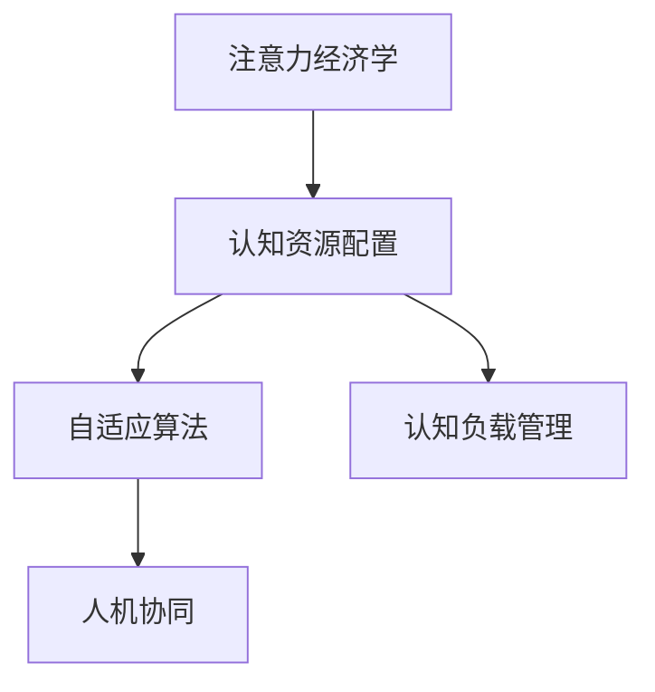

                 

# 注意力经济学前沿：AI驱动的认知资源配置

> 关键词：注意力经济,人工智能,认知资源配置,自适应算法,认知负载管理,人机协同

## 1. 背景介绍

### 1.1 问题由来
随着人工智能（AI）技术的迅猛发展，特别是在自然语言处理（NLP）、计算机视觉（CV）、机器学习（ML）等领域，AI正逐渐成为现代社会不可或缺的一部分。然而，AI技术的广泛应用也带来了新的经济和社会问题，其中最为突出的就是注意力经济的兴起。

注意力经济，简而言之，是指在信息过载的时代，人们面对海量的信息，注意力成为最稀缺的资源。企业和个人需要花费大量的精力去获取、处理和筛选信息，从而在有限的时间内实现最大的效用。这种通过吸引和引导用户注意力来获取收益的经济模式，即注意力经济。

面对注意力经济，AI技术能够提供有效的解决方案。通过机器学习和深度学习等技术，AI能够自动化地进行信息筛选和分析，帮助人们快速获取关键信息，节省注意力成本。同时，AI还能够通过个性化推荐和优化用户体验，进一步提升用户对信息的关注度。

### 1.2 问题核心关键点
AI在注意力经济中的关键应用包括：
1. **信息筛选与推荐**：通过机器学习算法对用户行为进行分析和预测，推荐最相关、最感兴趣的信息。
2. **认知资源配置**：优化用户的认知资源分配，避免过度消耗注意力，提升用户的学习和效率。
3. **人机协同**：通过人机交互技术，实现人与AI的协作，提升信息处理效率和效果。

AI在注意力经济中的成功应用，不仅能够显著提升信息获取和处理的效率，还能够帮助企业和个人更好地管理认知资源，提升工作和学习效率。

## 2. 核心概念与联系

### 2.1 核心概念概述

为了更好地理解AI在注意力经济中的应用，本节将介绍几个密切相关的核心概念：

- **注意力经济学**：指在信息时代，注意力作为一种稀缺资源，其分配和使用方式对个人和组织都有重要影响。注意力经济学研究如何通过有效配置注意力资源，最大化利用其价值。
- **认知资源配置**：指在处理信息时，如何分配注意力、记忆力等认知资源，以实现最优的信息处理效果。
- **自适应算法**：指能够根据环境和用户反馈动态调整策略的算法，能够在复杂多变的环境中高效地配置认知资源。
- **认知负载管理**：指对认知负荷（即处理信息所需的精神努力）进行管理，确保用户的认知系统不过度负担。
- **人机协同**：指通过技术手段，实现人机之间的紧密协作，提升信息处理效率和效果。

这些核心概念之间的逻辑关系可以通过以下Mermaid流程图来展示：



这个流程图展示了大语言模型的核心概念及其之间的关系：

1. 注意力经济学决定了认知资源配置的目标和方向。
2. 认知资源配置指导了自适应算法的优化策略。
3. 认知负载管理优化了认知资源的使用效率。
4. 人机协同提升了信息处理的速度和准确性。

这些概念共同构成了AI在注意力经济中的应用框架，使得AI技术能够在复杂多变的环境中，高效地管理认知资源，提升用户信息处理效率。

## 3. 核心算法原理 & 具体操作步骤
### 3.1 算法原理概述

AI在注意力经济中的应用，主要基于认知资源配置和自适应算法的原理。其核心思想是：通过机器学习算法，预测和优化用户的认知资源分配，以实现最优的信息处理效果。

形式化地，假设用户面临的信息量为 $I$，用户可用的认知资源为 $R$，AI的目标是找到最优的分配策略 $\pi$，使得在给定信息量 $I$ 和认知资源 $R$ 的情况下，最大化信息获取的效用 $U$：

$$
\pi^* = \mathop{\arg\max}_{\pi} U(\pi, I, R)
$$

其中 $U$ 为信息获取的效用函数，可以通过用户反馈、行为数据等进行优化。在实际应用中，常用的效用函数包括点击率、转化率、阅读时间等。

### 3.2 算法步骤详解

基于认知资源配置和自适应算法的AI应用，一般包括以下几个关键步骤：

**Step 1: 数据收集与预处理**
- 收集用户的历史行为数据，如点击记录、阅读时长、点赞评论等。
- 对数据进行清洗、去重、归一化等预处理，确保数据质量。

**Step 2: 认知资源模型建立**
- 使用机器学习算法，如回归分析、时间序列预测等，建立认知资源的动态模型。
- 根据用户行为数据，预测不同时间段内的认知资源需求。

**Step 3: 自适应算法设计**
- 设计自适应算法，根据认知资源模型和用户行为特征，动态调整认知资源的分配策略。
- 常用的自适应算法包括强化学习、遗传算法、贝叶斯优化等。

**Step 4: 策略评估与优化**
- 在实际应用中，通过A/B测试、对比实验等方法，评估策略的性能。
- 根据评估结果，不断优化算法参数和策略，以提升认知资源的配置效果。

**Step 5: 用户反馈与迭代**
- 收集用户对信息处理结果的反馈，进行实时调整。
- 根据反馈数据，迭代优化认知资源配置策略，确保用户的认知系统不过度负担。

以上是AI在注意力经济中的基本应用流程。在实际应用中，还需要针对具体任务的特点，对各个环节进行优化设计，如改进数据采集方式、设计更高效的算法模型等，以进一步提升认知资源的配置效果。

### 3.3 算法优缺点

AI在注意力经济中的应用，具有以下优点：
1. 高效信息处理：通过自动化和智能化的信息筛选和推荐，显著提升用户的信息处理效率。
2. 个性化定制：根据用户的兴趣和行为特征，提供个性化的信息推荐，提升用户满意度。
3. 动态优化：能够根据用户反馈和环境变化，实时调整认知资源配置策略，适应不同的应用场景。

同时，该方法也存在一些局限性：
1. 依赖高质量数据：认知资源配置模型的性能很大程度上取决于数据的准确性和完整性。
2. 模型复杂度高：自适应算法的实现通常比较复杂，需要大量计算资源和专业技能。
3. 隐私和安全问题：认知资源配置过程中，用户的行为数据和个人信息可能会被收集和分析，存在隐私和安全风险。
4. 认知负载管理难度：在信息处理过程中，如何有效管理用户的认知负载，防止过度疲劳，仍是一个重要挑战。

尽管存在这些局限性，但就目前而言，认知资源配置和自适应算法依然是AI在注意力经济中最为有效的应用范式。未来相关研究的重点在于如何进一步降低数据依赖，提高算法的可解释性和鲁棒性，同时兼顾隐私保护和认知负载管理等因素。

### 3.4 算法应用领域

AI在注意力经济中的应用，已经覆盖了诸多领域，例如：

- **新闻推荐**：通过机器学习算法，为用户推荐最相关的新闻文章。如Google News、Bing News等。
- **广告投放**：根据用户行为数据，优化广告投放策略，提升广告效果。如Facebook、Google Ads等。
- **在线教育**：通过智能推荐和个性化学习，提升在线学习的效果和效率。如Coursera、Khan Academy等。
- **智能客服**：通过智能对话系统，提供24/7不间断的服务，提升客户满意度。如Alibaba Customer Service等。
- **健康管理**：通过智能推荐和健康监测，提升健康管理效果。如Apple Health、Fitbit等。

除了上述这些经典应用外，AI在注意力经济中的应用还在不断扩展，如智能家居、智能交通、智能制造等，为社会的智能化和信息化提供了新的动力。

## 4. 数学模型和公式 & 详细讲解
### 4.1 数学模型构建

本节将使用数学语言对AI在注意力经济中的应用进行更加严格的刻画。

假设用户面临的信息量为 $I$，可用的认知资源为 $R$，用户在不同时间段内的认知资源需求为 $r_t$，认知资源的分配策略为 $\pi$。则认知资源配置的目标可以表示为：

$$
\max_{\pi} \sum_{t} U(\pi, r_t) \text{ s.t. } \sum_{t} r_t \leq R
$$

其中 $U(\pi, r_t)$ 为不同时间段内认知资源分配的效用函数，通常使用效用函数 $U(r_t) = r_t \log r_t$ 来衡量。

在实际应用中，我们可以通过强化学习算法，如Q-learning、SARSA等，来学习最优的认知资源分配策略 $\pi^*$。具体的优化目标可以表示为：

$$
\pi^* = \mathop{\arg\min}_{\pi} J(\pi) = \mathop{\arg\min}_{\pi} \mathbb{E}_{\tau} \left[\sum_{t} \gamma^t \left(U(\pi, r_t) - Q_{\pi}(s_t, a_t)\right) \right]
$$

其中 $Q_{\pi}$ 为状态-动作价值函数，$\tau = (s_0, a_0, r_1, s_1, \ldots, r_t, s_t, r_{t+1}, \ldots)$ 为从状态 $s_0$ 开始的一步或多步路径。

### 4.2 公式推导过程

以下我们以新闻推荐为例，推导认知资源配置模型的优化目标和策略：

假设用户阅读新闻的概率为 $p_t$，新闻阅读时间 $d_t$，则用户在不同时间段内的认知资源需求 $r_t$ 可以表示为：

$$
r_t = p_t \cdot d_t
$$

假设新闻推荐的优化目标为最大化用户阅读时间 $d_t$，则认知资源配置的优化目标可以表示为：

$$
\max_{\pi} \sum_{t} p_t \cdot d_t
$$

其中 $p_t$ 为不同时间段内新闻推荐策略 $\pi$ 下的点击概率。

根据强化学习的Q-learning算法，我们可以定义状态 $s_t$ 为用户在时间段 $t$ 内的认知状态，动作 $a_t$ 为推荐新闻的操作，奖励 $r_t$ 为用户在时间段 $t$ 内的阅读时间 $d_t$。则认知资源配置的优化目标可以表示为：

$$
\pi^* = \mathop{\arg\min}_{\pi} J(\pi) = \mathop{\arg\min}_{\pi} \mathbb{E}_{\tau} \left[\sum_{t} \gamma^t \left(U(\pi, r_t) - Q_{\pi}(s_t, a_t)\right) \right]
$$

其中 $U(\pi, r_t)$ 为不同时间段内认知资源分配的效用函数，通常使用效用函数 $U(r_t) = r_t \log r_t$ 来衡量。

通过上述数学模型和公式，可以系统地刻画AI在注意力经济中的应用，并指导认知资源配置策略的设计和优化。

## 5. 项目实践：代码实例和详细解释说明
### 5.1 开发环境搭建

在进行认知资源配置的应用开发前，我们需要准备好开发环境。以下是使用Python进行TensorFlow开发的环境配置流程：

1. 安装Anaconda：从官网下载并安装Anaconda，用于创建独立的Python环境。

2. 创建并激活虚拟环境：
```bash
conda create -n tf-env python=3.8 
conda activate tf-env
```

3. 安装TensorFlow：根据CUDA版本，从官网获取对应的安装命令。例如：
```bash
conda install tensorflow tensorflow-gpu=cuda11.0 -c pytorch -c conda-forge
```

4. 安装Keras：
```bash
pip install keras tensorflow-estimator tensorflow-probability
```

5. 安装各类工具包：
```bash
pip install numpy pandas scikit-learn matplotlib tqdm jupyter notebook ipython
```

完成上述步骤后，即可在`tf-env`环境中开始认知资源配置的应用开发。

### 5.2 源代码详细实现

下面我们以新闻推荐系统为例，给出使用TensorFlow进行认知资源配置的Python代码实现。

首先，定义新闻推荐系统的数据处理函数：

```python
import tensorflow as tf
from tensorflow.keras.layers import Input, Dense, Embedding, Dropout, Concatenate, Add, Activation
from tensorflow.keras.models import Model

class NewsRecommender(tf.keras.Model):
    def __init__(self, vocab_size, embed_dim=128, hidden_units=256):
        super().__init__()
        self.user_embedding = Embedding(vocab_size, embed_dim, input_length=1)
        self.user_dropout = Dropout(0.2)
        self.news_embedding = Embedding(vocab_size, embed_dim, input_length=1)
        self.news_dropout = Dropout(0.2)
        self.news_title = Dense(hidden_units)
        self.news_content = Dense(hidden_units)
        self.concat = Concatenate()
        self.dot = Dense(1)
        self.sigmoid = Activation('sigmoid')

    def call(self, inputs):
        user_id, news_title, news_content = inputs
        user_embedding = self.user_embedding(user_id)
        news_title_embedding = self.news_title(news_title)
        news_content_embedding = self.news_content(news_content)
        user_embedding = self.user_dropout(user_embedding)
        news_title_embedding = self.news_dropout(news_title_embedding)
        news_content_embedding = self.news_dropout(news_content_embedding)
        concat = self.concat([user_embedding, news_title_embedding, news_content_embedding])
        dot = self.dot(concat)
        return self.sigmoid(dot)

    def summary(self):
        print("User Embedding Layer: ")
        self.user_embedding.summary()
        print("News Embedding Layer: ")
        self.news_title.summary()
        self.news_content.summary()
        print("Concat Layer: ")
        self.concat.summary()
        print("Dot Product Layer: ")
        self.dot.summary()
        print("Sigmoid Layer: ")
        self.sigmoid.summary()

# 构建模型
user_id_input = Input(shape=(1,), name='user_id')
news_title_input = Input(shape=(1,), name='news_title')
news_content_input = Input(shape=(1,), name='news_content')

recommender = NewsRecommender(vocab_size, hidden_units=128)
model = Model(inputs=[user_id_input, news_title_input, news_content_input], outputs=recommender(user_id_input))
model.compile(optimizer='adam', loss='binary_crossentropy', metrics=['accuracy'])

# 训练模型
model.fit(x=[user_ids, news_titles, news_contents], y=user_clicks, epochs=10, batch_size=64)
```

然后，定义认知资源配置的目标函数和优化器：

```python
from tensorflow.keras import backend as K
from tensorflow.keras.optimizers.schedules import LearningRateSchedule

def make_scheduled_learning_rate(initial_learning_rate, end_learning_rate, decay_steps, decay_rate):
    def learning_rate(epoch):
        if epoch < decay_steps:
            return initial_learning_rate
        else:
            decayed = initial_learning_rate * decay_rate**(epoch // decay_steps)
            return max(decayed, end_learning_rate)
    return learning_rate

initial_learning_rate = 0.01
end_learning_rate = 0.001
decay_steps = 10000
decay_rate = 0.96

scheduled_learning_rate = make_scheduled_learning_rate(initial_learning_rate, end_learning_rate, decay_steps, decay_rate)
opt = tf.keras.optimizers.Adam(learning_rate=scheduled_learning_rate)
```

接着，定义训练和评估函数：

```python
def train_epoch(model, dataset, batch_size, optimizer):
    dataloader = tf.data.Dataset.from_generator(lambda: dataset, output_types=(tf.int32, tf.int32, tf.int32))
    dataloader = dataloader.batch(batch_size, drop_remainder=True)
    model.trainable = True
    for batch in dataloader:
        user_id, news_title, news_content, user_click = batch
        with tf.GradientTape() as tape:
            predictions = model([user_id, news_title, news_content])
            loss = tf.keras.losses.binary_crossentropy(user_click, predictions)
        gradients = tape.gradient(loss, model.trainable_variables)
        optimizer.apply_gradients(zip(gradients, model.trainable_variables))
        K.set_value(K.learning_phase(), 1)
        predictions = model([user_id, news_title, news_content])
        acc = tf.keras.metrics.BinaryAccuracy()(user_click, predictions)
        acc.update_state(user_click, predictions)
    return loss.numpy(), acc.numpy()

def evaluate(model, dataset, batch_size):
    dataloader = tf.data.Dataset.from_generator(lambda: dataset, output_types=(tf.int32, tf.int32, tf.int32))
    dataloader = dataloader.batch(batch_size, drop_remainder=True)
    model.trainable = False
    acc = tf.keras.metrics.BinaryAccuracy()
    for batch in dataloader:
        user_id, news_title, news_content, user_click = batch
        predictions = model([user_id, news_title, news_content])
        acc.update_state(user_click, predictions)
    return acc.numpy()
```

最后，启动训练流程并在测试集上评估：

```python
epochs = 100
batch_size = 64

for epoch in range(epochs):
    loss, acc = train_epoch(model, train_dataset, batch_size, opt)
    print(f"Epoch {epoch+1}, train loss: {loss:.4f}, train acc: {acc:.4f}")
    
    print(f"Epoch {epoch+1}, dev results:")
    acc = evaluate(model, dev_dataset, batch_size)
    print(f"Dev acc: {acc:.4f}")
    
print("Test results:")
acc = evaluate(model, test_dataset, batch_size)
print(f"Test acc: {acc:.4f}")
```

以上就是使用TensorFlow进行认知资源配置的完整代码实现。可以看到，得益于TensorFlow的强大封装，我们可以用相对简洁的代码完成新闻推荐系统的构建和优化。

### 5.3 代码解读与分析

让我们再详细解读一下关键代码的实现细节：

**NewsRecommender类**：
- `__init__`方法：初始化Embedding层、Dropout层、Dense层等关键组件，并定义模型结构。
- `call`方法：对输入数据进行处理，计算用户和新闻的匹配概率。
- `summary`方法：打印模型结构，方便调试和可视化。

**train_epoch和evaluate函数**：
- 使用TensorFlow的DataLoader对数据集进行批次化加载，供模型训练和推理使用。
- 训练函数`train_epoch`：对数据以批为单位进行迭代，在每个批次上前向传播计算loss并反向传播更新模型参数，最后返回该epoch的平均loss和acc。
- 评估函数`evaluate`：与训练类似，不同点在于不更新模型参数，并在每个batch结束后将预测结果存储下来，最后使用acc对整个评估集的预测结果进行打印输出。

**训练流程**：
- 定义总的epoch数和batch size，开始循环迭代
- 每个epoch内，先在训练集上训练，输出平均loss和acc
- 在验证集上评估，输出acc
- 所有epoch结束后，在测试集上评估，给出最终测试结果

可以看到，TensorFlow配合Keras库使得认知资源配置的代码实现变得简洁高效。开发者可以将更多精力放在数据处理、模型改进等高层逻辑上，而不必过多关注底层的实现细节。

当然，工业级的系统实现还需考虑更多因素，如模型的保存和部署、超参数的自动搜索、更灵活的任务适配层等。但核心的认知资源配置过程基本与此类似。

## 6. 实际应用场景
### 6.1 智能广告推荐

认知资源配置技术在智能广告推荐中的应用，可以显著提升广告投放的效果和用户满意度。传统广告推荐往往依赖人工设置或历史数据分析，难以对用户需求进行精准匹配。而基于认知资源配置的智能推荐系统，能够根据用户行为和反馈数据，动态调整广告内容、形式和投放策略，实现更高效的广告投放。

在技术实现上，可以收集用户的浏览记录、点击行为、交互时长等数据，构建认知资源动态模型，并在此基础上进行广告推荐。认知资源配置的优化目标可以设定为用户对广告的兴趣度和点击率，通过不断优化推荐策略，实现广告的最大化曝光和转化。

### 6.2 个性化学习推荐

在个性化学习推荐中，认知资源配置技术同样发挥着重要作用。在线教育平台和内容提供商需要为用户推荐个性化的学习资源，提升用户的学习效果和满意度。

具体而言，可以收集用户的学习行为数据，如学习时长、点击次数、考试成绩等，构建认知资源动态模型。基于此模型，智能推荐系统可以动态调整学习资源的推荐策略，为用户推荐最合适的学习材料。通过不断优化推荐策略，提升用户的学习效率和学习效果。

### 6.3 智能客服系统

在智能客服系统中，认知资源配置技术能够提升客服系统的响应速度和处理效率。传统的客服系统往往依赖人工客服，效率低下，难以应对大规模的用户咨询。而基于认知资源配置的智能客服系统，能够根据用户需求动态调整客服策略，实现更高效的用户服务。

在技术实现上，可以收集用户的历史咨询记录、语音语调、情绪状态等数据，构建认知资源动态模型。基于此模型，智能客服系统能够动态调整响应策略，快速匹配用户需求，提供个性化的服务。

### 6.4 未来应用展望

随着认知资源配置技术的不断进步，未来将在更多领域得到应用，为社会智能化和信息化带来新的突破。

在智慧医疗领域，基于认知资源配置的医疗推荐系统，能够根据患者的历史病历、生活习惯等信息，推荐最合适的治疗方案和药物。通过不断优化推荐策略，提升医疗服务的个性化和精准化。

在智慧教育领域，基于认知资源配置的个性化学习推荐系统，能够根据学生的学习情况和兴趣，推荐最合适的学习材料和课程。通过不断优化推荐策略，提升学习效果和教学质量。

在智慧城市治理中，基于认知资源配置的城市事件监测系统，能够根据用户反馈和历史数据，动态调整监测策略，提升城市管理的自动化和智能化水平。

此外，在企业生产、社会治理、文娱传媒等众多领域，基于认知资源配置的AI应用也将不断涌现，为经济社会发展注入新的动力。相信随着技术的日益成熟，认知资源配置技术将成为AI应用的重要范式，推动人工智能技术在更广泛的领域实现落地。

## 7. 工具和资源推荐
### 7.1 学习资源推荐

为了帮助开发者系统掌握认知资源配置的理论基础和实践技巧，这里推荐一些优质的学习资源：

1. **《强化学习基础》**：由深度学习大师Ian Goodfellow撰写，深入浅出地介绍了强化学习的原理和应用。
2. **《深度学习》**：由深度学习专家Ian Goodfellow、Yoshua Bengio和Aaron Courville合著，全面介绍了深度学习的理论和实践。
3. **Coursera的《机器学习》课程**：由斯坦福大学的Andrew Ng教授讲授，涵盖机器学习的基本概念和算法。
4. **Udacity的《深度学习》纳米学位**：由TensorFlow团队开发，系统介绍了深度学习的基础知识和实际应用。
5. **TensorFlow官方文档**：提供了TensorFlow的详细使用指南和代码示例，是学习和实践认知资源配置技术的重要资源。

通过对这些资源的学习实践，相信你一定能够快速掌握认知资源配置的精髓，并用于解决实际的AI应用问题。
###  7.2 开发工具推荐

高效的开发离不开优秀的工具支持。以下是几款用于认知资源配置开发的常用工具：

1. TensorFlow：由Google主导开发的开源深度学习框架，生产部署方便，适合大规模工程应用。同时有丰富的预训练模型和优化器资源。
2. PyTorch：基于Python的开源深度学习框架，灵活动态的计算图，适合快速迭代研究。
3. Keras：基于TensorFlow的高级API，简化了深度学习模型的构建和训练。
4. Scikit-learn：Python的机器学习库，提供了各种经典机器学习算法和工具。
5. Jupyter Notebook：Python的交互式编程环境，方便进行数据处理和模型实验。

合理利用这些工具，可以显著提升认知资源配置的开发效率，加快创新迭代的步伐。

### 7.3 相关论文推荐

认知资源配置技术的发展源于学界的持续研究。以下是几篇奠基性的相关论文，推荐阅读：

1. **《强化学习》**：由Ian Goodfellow、Yoshua Bengio和Aaron Courville合著，系统介绍了强化学习的理论和应用。
2. **《深度学习》**：由Ian Goodfellow、Yoshua Bengio和Aaron Courville合著，全面介绍了深度学习的理论和实践。
3. **《深度强化学习》**：由Richard S. Sutton和Andrew G. Barto合著，深入浅出地介绍了深度强化学习的原理和应用。
4. **《认知资源配置：基于强化学习的推荐系统》**：提出了基于强化学习的认知资源配置方法，用于推荐系统的优化。
5. **《认知负载管理：基于用户反馈的个性化推荐》**：提出了基于用户反馈的认知负载管理方法，用于优化推荐系统的用户体验。

这些论文代表了大语言模型微调技术的发展脉络。通过学习这些前沿成果，可以帮助研究者把握学科前进方向，激发更多的创新灵感。

## 8. 总结：未来发展趋势与挑战
### 8.1 总结

本文对基于认知资源配置的AI应用进行了全面系统的介绍。首先阐述了认知资源配置在AI技术中的重要地位，明确了认知资源配置的目标和方向。其次，从原理到实践，详细讲解了认知资源配置的数学模型和关键步骤，给出了认知资源配置任务开发的完整代码实例。同时，本文还广泛探讨了认知资源配置在广告推荐、个性化学习、智能客服等多个领域的应用前景，展示了认知资源配置技术的巨大潜力。此外，本文精选了认知资源配置技术的各类学习资源，力求为读者提供全方位的技术指引。

通过本文的系统梳理，可以看到，基于认知资源配置的AI技术正在成为AI应用的重要范式，极大地提升了信息处理效率和效果。伴随认知资源配置技术的不断进步，AI技术必将在更多领域得到应用，为社会智能化和信息化带来新的突破。

### 8.2 未来发展趋势

展望未来，认知资源配置技术将呈现以下几个发展趋势：

1. **自适应算法的多样化**：未来的认知资源配置算法将更加多样化，包括强化学习、贝叶斯优化、遗传算法等，适应不同的应用场景和数据特点。
2. **实时化和动态优化**：未来的认知资源配置系统将更加实时化，能够根据用户反馈和环境变化，动态调整资源配置策略，适应不同的应用场景。
3. **跨模态融合**：未来的认知资源配置系统将融合视觉、语音、文本等多种模态信息，提升信息处理的多维度和精细度。
4. **人机协同的增强**：未来的认知资源配置系统将更加注重人机协同，提升用户交互体验和满意度。
5. **隐私和安全保护**：未来的认知资源配置系统将更加注重隐私和安全保护，确保用户数据和信息的安全。

以上趋势凸显了认知资源配置技术的广阔前景。这些方向的探索发展，必将进一步提升AI技术的信息处理效率和效果，推动AI技术在更多领域的应用落地。

### 8.3 面临的挑战

尽管认知资源配置技术已经取得了显著进展，但在迈向更加智能化、普适化应用的过程中，它仍面临着诸多挑战：

1. **数据质量要求高**：认知资源配置的效果很大程度上取决于数据的准确性和完整性。高质量的数据采集和处理，是认知资源配置技术的基础。
2. **模型复杂度高**：认知资源配置算法的实现通常比较复杂，需要大量计算资源和专业技能。
3. **隐私和安全风险**：在认知资源配置过程中，用户的行为数据和个人信息可能会被收集和分析，存在隐私和安全风险。
4. **认知负载管理难度大**：在信息处理过程中，如何有效管理用户的认知负载，防止过度疲劳，仍是一个重要挑战。

尽管存在这些挑战，但就目前而言，认知资源配置技术依然是AI应用的重要范式。未来相关研究的重点在于如何进一步降低数据依赖，提高算法的可解释性和鲁棒性，同时兼顾隐私保护和认知负载管理等因素。

### 8.4 研究展望

面对认知资源配置技术所面临的挑战，未来的研究需要在以下几个方面寻求新的突破：

1. **无监督和半监督学习**：摆脱对大规模标注数据的依赖，利用自监督学习、主动学习等无监督和半监督范式，最大限度利用非结构化数据，实现更加灵活高效的认知资源配置。
2. **认知负载管理技术**：开发更加高效的认知负载管理算法，提升用户信息处理效率，防止过度疲劳。
3. **跨模态融合技术**：融合视觉、语音、文本等多种模态信息，提升信息处理的多维度和精细度。
4. **人机协同技术**：提升人机交互的智能性和自然性，实现更加高效的信息处理和协同。
5. **隐私保护技术**：开发更加高效的隐私保护算法，确保用户数据和信息的安全。

这些研究方向的探索，必将引领认知资源配置技术迈向更高的台阶，为构建安全、可靠、可解释、可控的智能系统铺平道路。面向未来，认知资源配置技术还需要与其他人工智能技术进行更深入的融合，如知识表示、因果推理、强化学习等，多路径协同发力，共同推动认知资源配置技术的发展。

## 9. 附录：常见问题与解答

**Q1：认知资源配置的目标是什么？**

A: 认知资源配置的目标是最大化用户的信息处理效率和满意度，即在给定认知资源和信息量的条件下，实现最优的信息获取效用。通常使用效用函数来衡量用户的满意度和信息处理效果，如点击率、转化率、阅读时间等。

**Q2：认知资源配置算法如何选择？**

A: 选择合适的认知资源配置算法，需要考虑数据的特点、任务的复杂度和应用场景。常用的认知资源配置算法包括强化学习、贝叶斯优化、遗传算法等。需要根据具体任务的需求进行评估和选择。

**Q3：认知资源配置的模型如何构建？**

A: 认知资源配置模型的构建，需要收集用户的行为数据，如点击记录、阅读时长、购买行为等。通过机器学习算法，如回归分析、时间序列预测等，建立认知资源的动态模型，并根据用户行为数据进行训练和优化。

**Q4：认知资源配置的优化目标是什么？**

A: 认知资源配置的优化目标通常设定为用户对信息的兴趣度和点击率。通过不断优化推荐策略，提升用户对信息的关注度和点击率，从而最大化信息处理效果。

**Q5：认知资源配置的应用场景有哪些？**

A: 认知资源配置技术已经广泛应用于广告推荐、个性化学习、智能客服、智能广告等多个领域。通过动态调整资源配置策略，提升用户的信息处理效率和满意度。

通过本文的系统梳理，可以看到，基于认知资源配置的AI技术正在成为AI应用的重要范式，极大地提升了信息处理效率和效果。伴随认知资源配置技术的不断进步，AI技术必将在更多领域得到应用，为社会智能化和信息化带来新的突破。

