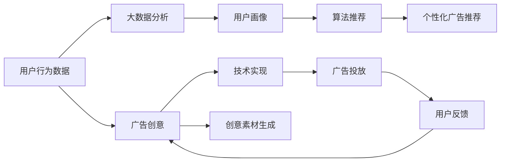

                 

# 注意力经济对传统广告创意的新要求

在数字时代的浪潮中，互联网带来了前所未有的注意力经济。基于大数据、算法推荐等技术的广告模式，正逐步颠覆传统广告创意与投放方式，催生了新的创意需求和表达方式。本文将从广告创意的演变、新需求、新表达三个方面，探讨注意力经济对传统广告创意的新要求。

## 1. 背景介绍

### 1.1 问题由来

在互联网发展的初期，以电视、广播、报纸等传统媒体为主要广告载体的模式占据主流。广告创意依赖于文案、图像、视频等，通过强烈的视觉冲击和情感渲染吸引观众注意。然而，随着移动互联网、大数据、算法推荐等技术的发展，用户获取信息的渠道日益多样化，内容产出和消费模式的转变，带来了广告市场的深刻变革。

### 1.2 问题核心关键点

广告创意的核心是抓住用户注意力，并促使行为转化。在注意力经济时代，广告不仅需要吸引用户的目光，更需要精准地触达有需求的用户，从而实现广告效果的最大化。

在传统广告模式中，创意的表达和传递往往依赖于强制的曝光与长时间内容的填充。而在注意力经济中，广告的创意要求更加精准、高效，能在有限的时间内吸引用户，并在用户心中留下深刻印象。同时，广告创意还需结合用户兴趣、行为习惯等因素，通过算法推荐实现精准投放。

## 2. 核心概念与联系

### 2.1 核心概念概述

1. **注意力经济（Attention Economy）**：在信息过载的时代，用户注意力成为稀缺资源。广告创意需通过精准的表达和有效的传达，吸引并保持用户的注意力，进而实现广告价值。

2. **算法推荐（Recommendation System）**：通过大数据分析与机器学习算法，根据用户行为和偏好，推荐相关内容与广告，提高广告的点击率和转化率。

3. **创意与技术融合（Creative & Technology Fusion）**：广告创意与技术手段的融合，使广告表达更加精准、高效，并在数字媒介中实现广告效果的最大化。

4. **用户体验（User Experience, UX）**：广告创意应以用户为中心，提升用户的广告接受度和品牌好感度，实现广告与用户的深度互动。

### 2.2 核心概念原理和架构的 Mermaid 流程图



在这个流程图中，用户行为数据经过大数据分析，生成用户画像。根据用户画像，算法推荐系统推荐个性化广告，并由创意与技术融合的模块，生成具体的广告创意和实现方式。广告投放后，根据用户反馈，持续优化广告创意与推荐系统。

## 3. 核心算法原理 & 具体操作步骤

### 3.1 算法原理概述

基于注意力经济，广告创意需通过数据驱动、算法优化的方式，精准触达用户，并最大化广告效果。核心算法包括：

1. **用户行为分析（User Behavior Analysis）**：通过数据挖掘和机器学习算法，分析用户的行为模式和兴趣偏好，生成用户画像。
2. **个性化推荐算法（Personalized Recommendation Algorithm）**：根据用户画像和广告内容，通过协同过滤、内容推荐等算法，实现广告的精准投放。
3. **创意优化算法（Creative Optimization Algorithm）**：结合用户行为数据，利用自然语言处理、图像处理等技术，生成符合用户兴趣和期望的广告创意。

### 3.2 算法步骤详解

#### 3.2.1 用户行为数据收集

收集用户在浏览、搜索、互动等行为中的数据，包括点击、停留时间、互动率等指标。通过这些数据，可以生成用户的兴趣画像和行为特征。

#### 3.2.2 用户画像生成

利用机器学习算法，如K-means聚类、协同过滤等，对用户行为数据进行分析，生成用户画像。用户画像包括兴趣偏好、行为模式、互动历史等属性。

#### 3.2.3 广告创意生成

基于用户画像和广告内容，通过深度学习模型（如BERT、GPT等）生成广告创意。具体步骤包括：

1. **数据预处理**：将用户画像和广告内容进行编码，生成向量表示。
2. **模型训练**：利用预训练模型（如Transformer），训练广告创意生成模型，优化广告表达的质量和多样性。
3. **创意生成**：输入用户画像和广告内容，通过模型生成具体的广告创意，包括文案、图像、视频等。

#### 3.2.4 个性化推荐

结合用户画像和广告创意，利用推荐算法（如协同过滤、内容推荐等），实现个性化广告的精准投放。具体步骤包括：

1. **相似度计算**：计算用户画像与广告创意的相似度。
2. **排序推荐**：根据相似度排序，推荐最符合用户兴趣的广告创意。
3. **投放优化**：根据广告投放效果，调整推荐算法，优化广告效果。

### 3.3 算法优缺点

#### 3.3.1 优点

1. **精准性高**：通过数据驱动的算法，广告创意能够精准触达用户，提高广告投放的点击率和转化率。
2. **效率高**：算法推荐能够实现广告的快速投放和优化，降低人工成本和时间成本。
3. **可扩展性强**：创意生成和推荐算法可以适应不同的广告场景和用户需求，具有较强的可扩展性。

#### 3.3.2 缺点

1. **隐私问题**：用户行为数据的收集和使用可能涉及隐私问题，需要严格的数据保护措施。
2. **公平性问题**：算法推荐可能导致“信息茧房”，限制用户的广告接触范围，影响广告效果的多样性和公平性。
3. **技术门槛高**：创意生成和推荐算法需要较强的技术背景和数据处理能力，对开发团队的要求较高。

### 3.4 算法应用领域

广告创意与技术融合的算法，广泛应用于以下几个领域：

1. **电商广告**：通过推荐算法，精准推荐商品广告，提高用户转化率和购物体验。
2. **品牌宣传**：利用创意生成模型，生成符合品牌形象的广告内容，增强品牌影响力和用户好感度。
3. **教育培训**：根据用户学习行为和兴趣，生成个性化广告，提高用户的学习兴趣和参与度。
4. **健康医疗**：通过分析用户健康数据，生成医疗广告创意，提高健康科普的效果和用户接受度。

## 4. 数学模型和公式 & 详细讲解 & 举例说明

### 4.1 数学模型构建

广告创意与技术融合的核心模型包括：

1. **用户行为分析模型**：通过机器学习算法，生成用户画像，包括兴趣偏好、行为模式等。
2. **创意生成模型**：利用自然语言处理（NLP）、图像处理等技术，生成符合用户兴趣的广告创意。
3. **推荐算法模型**：结合用户画像和广告创意，生成个性化广告推荐，提高广告投放的精准度。

### 4.2 公式推导过程

以用户画像生成为例，假设用户行为数据集为 $D=\{(x_i, y_i)\}_{i=1}^N$，其中 $x_i$ 表示用户行为数据， $y_i$ 表示用户兴趣标签。用户画像可以表示为向量 $p \in \mathbb{R}^k$，其中 $k$ 表示兴趣维度的数量。用户画像的生成过程可以表示为：

$$
p = \mathop{\arg\min}_{p} \sum_{i=1}^N \sum_{j=1}^k \lVert p_j - y_i \rVert^2
$$

其中 $\lVert \cdot \rVert$ 表示欧式距离，$p_j$ 表示用户画像在第 $j$ 个维度的值，$y_i$ 表示用户兴趣标签。

### 4.3 案例分析与讲解

#### 4.3.1 电商广告推荐

以电商平台为例，用户浏览商品后，生成用户画像。根据用户画像，利用协同过滤算法，推荐用户感兴趣的商品广告。具体公式如下：

$$
r_{ui} = \frac{\sum_{j=1}^N a_{uj}b_{ji}}{\sqrt{\sum_{j=1}^N a_{uj}^2} \sqrt{\sum_{j=1}^N b_{ji}^2}}
$$

其中 $r_{ui}$ 表示用户 $u$ 对商品 $i$ 的评分，$a_{uj}$ 表示用户 $u$ 对商品 $j$ 的评分，$b_{ji}$ 表示用户 $i$ 对商品 $j$ 的评分。

#### 4.3.2 创意生成

以生成一句广告语为例，假设用户画像为 $p=[0.2, 0.7, 0.1]$，表示用户对时尚、科技、娱乐感兴趣。生成广告语的公式如下：

$$
\hat{c} = \mathop{\arg\max}_{c} \sum_{j=1}^k p_j \log P(c_j | x)
$$

其中 $\hat{c}$ 表示生成的广告语，$c_j$ 表示广告语中第 $j$ 个词，$P(c_j | x)$ 表示在输入文本 $x$ 中，生成词 $c_j$ 的概率。

## 5. 项目实践：代码实例和详细解释说明

### 5.1 开发环境搭建

#### 5.1.1 数据准备

收集用户行为数据，包括点击、浏览、搜索等行为。将这些数据进行清洗和预处理，生成用户画像和广告创意的数据集。

#### 5.1.2 工具安装

安装Python及其依赖库，如TensorFlow、PyTorch、Keras等，用于模型的开发和训练。

#### 5.1.3 环境配置

配置Python虚拟环境，安装必要的依赖包。可以使用Anaconda或Miniconda创建虚拟环境，并配置必要的依赖。

### 5.2 源代码详细实现

#### 5.2.1 用户行为数据收集

```python
import pandas as pd

# 数据收集
data = pd.read_csv('user_based_data.csv')
```

#### 5.2.2 用户画像生成

```python
from sklearn.decomposition import PCA

# 用户画像生成
pca = PCA(n_components=3)
pca_result = pca.fit_transform(data)
```

#### 5.2.3 创意生成

```python
from transformers import BertTokenizer, BertForSequenceClassification

# 创建模型
tokenizer = BertTokenizer.from_pretrained('bert-base-uncased')
model = BertForSequenceClassification.from_pretrained('bert-base-uncased', num_labels=3)

# 数据预处理
def preprocess_text(text):
    return tokenizer.encode(text, add_special_tokens=True)

# 模型训练
for epoch in range(10):
    optimizer = Adam(model.parameters(), lr=1e-5)
    model.train()
    for batch in train_loader:
        inputs = preprocess_text(batch[0])
        labels = batch[1]
        outputs = model(inputs)
        loss = loss_function(outputs, labels)
        optimizer.zero_grad()
        loss.backward()
        optimizer.step()
```

#### 5.2.4 广告推荐

```python
from sklearn.metrics.pairwise import cosine_similarity

# 广告推荐
def recommend_ads(user_profile, ads):
    similarity_matrix = cosine_similarity(user_profile, ads)
    recommended_ads = np.argsort(similarity_matrix, axis=1)[:, -3:][0]
    return recommended_ads
```

### 5.3 代码解读与分析

#### 5.3.1 用户行为数据收集

数据收集是广告创意与技术融合的基础。通过爬虫、API接口等手段，收集用户在电商网站、社交平台等环境中的行为数据，包括浏览、点击、购买等行为。

#### 5.3.2 用户画像生成

用户画像通过PCA等降维算法，将高维行为数据压缩到三维空间中，生成用户兴趣偏好的向量表示。

#### 5.3.3 创意生成

利用预训练模型（如BERT），对用户画像和广告文本进行编码，生成广告创意。通过调整模型参数，优化创意生成的质量和多样性。

#### 5.3.4 广告推荐

通过计算用户画像与广告创意的相似度，利用推荐算法（如协同过滤）生成个性化广告推荐。根据推荐效果，调整推荐算法参数，优化广告投放效果。

### 5.4 运行结果展示

运行代码，生成用户画像和广告推荐结果。通过可视化工具展示用户画像的分布和广告推荐的效果。

## 6. 实际应用场景

### 6.1 电商广告

电商广告是注意力经济的重要应用场景。通过用户行为数据生成用户画像，利用协同过滤算法推荐个性化商品广告，提高用户点击率和转化率。

### 6.2 品牌宣传

品牌宣传需要精准触达目标用户，通过创意生成模型，生成符合品牌形象的广告创意，提高品牌影响力和用户好感度。

### 6.3 教育培训

教育培训中的广告创意需要符合用户的学习行为和兴趣偏好，通过个性化推荐，提高用户的学习兴趣和参与度。

### 6.4 健康医疗

健康医疗广告需要精准推荐，通过分析用户健康数据，生成医疗广告创意，提高健康科普的效果和用户接受度。

## 7. 工具和资源推荐

### 7.1 学习资源推荐

1. **《深度学习》课程**：斯坦福大学的在线课程，涵盖深度学习的基本概念和算法。
2. **《自然语言处理综论》书籍**：介绍自然语言处理的理论和实践，包括广告创意与技术融合的案例分析。
3. **《机器学习实战》书籍**：通过实际案例，介绍机器学习算法和实现方法。

### 7.2 开发工具推荐

1. **TensorFlow**：Google开发的深度学习框架，支持GPU加速和分布式训练。
2. **PyTorch**：Facebook开发的深度学习框架，易用性强，社区活跃。
3. **Hugging Face Transformers**：NLP领域的开源库，提供预训练模型和微调框架。

### 7.3 相关论文推荐

1. **《深度学习》论文**：DeepMind的深度学习论文集，涵盖深度学习的前沿研究。
2. **《广告推荐算法》论文**：广告推荐领域的经典论文，涵盖协同过滤、内容推荐等算法。
3. **《创意生成》论文**：自然语言处理领域的创意生成论文，介绍深度学习在广告创意中的应用。

## 8. 总结：未来发展趋势与挑战

### 8.1 研究成果总结

基于注意力经济，广告创意与技术融合的方法已经在电商、品牌宣传、教育培训等多个领域取得显著效果。通过数据驱动的算法，实现了广告的精准投放和创意生成，提高了广告的点击率和转化率。

### 8.2 未来发展趋势

未来的广告创意与技术融合将更加注重以下几个方面：

1. **个性化推荐**：利用深度学习和大数据技术，生成个性化广告推荐，提高广告的精准度和用户满意度。
2. **跨平台整合**：整合不同平台的用户行为数据，生成全面的用户画像，提高广告投放的广度和深度。
3. **创意生成多样化**：结合图像处理、自然语言处理等技术，生成多样化、高质量的广告创意，提升用户广告体验。

### 8.3 面临的挑战

尽管广告创意与技术融合在多领域取得了进展，但仍然面临以下挑战：

1. **数据隐私**：用户行为数据的收集和使用涉及隐私问题，需要严格的数据保护措施。
2. **算法公平性**：算法推荐可能导致信息茧房，限制用户的广告接触范围，影响广告效果的多样性和公平性。
3. **技术门槛**：创意生成和推荐算法需要较强的技术背景和数据处理能力，对开发团队的要求较高。

### 8.4 研究展望

未来的研究可以从以下几个方向寻求新的突破：

1. **隐私保护技术**：研究数据隐私保护技术，确保用户数据的合法使用和保护。
2. **公平性算法**：设计公平性算法，避免信息茧房问题，提升广告的多样性和公平性。
3. **创意生成模型优化**：优化创意生成模型，提高创意的质量和多样性，增强用户广告体验。

## 9. 附录：常见问题与解答

### 9.1 常见问题

**Q1: 如何处理用户行为数据，生成用户画像？**

A: 通过数据清洗、降维等技术，将高维的用户行为数据转化为低维的用户画像。常用的算法包括PCA、K-means聚类等。

**Q2: 广告创意生成的难点在哪里？**

A: 广告创意生成的难点在于如何生成高质量、多样化的创意内容。可以通过优化模型结构、增加训练数据等手段进行提升。

**Q3: 个性化推荐如何避免信息茧房问题？**

A: 个性化推荐算法可以通过引入多样性因素，避免过度推荐用户喜欢的内容，确保广告的多样性。同时，可以定期调整推荐算法，确保推荐结果的多样性和公平性。

**Q4: 如何提升广告创意与技术融合的效果？**

A: 结合多种技术手段，如图像处理、自然语言处理等，生成多样化的广告创意。同时，可以引入反馈机制，持续优化创意生成和推荐算法，提升广告效果。

**Q5: 如何应对广告投放中的隐私问题？**

A: 在广告投放中，需要严格遵守数据保护法规，确保用户数据的合法使用。可以采用数据匿名化、去标识化等手段，保护用户隐私。

---

作者：禅与计算机程序设计艺术 / Zen and the Art of Computer Programming

