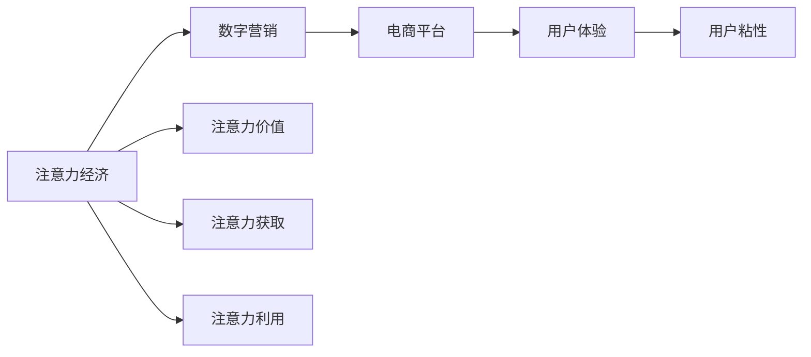

                 

# 注意力经济对传统零售业的冲击

> 关键词：注意力经济, 零售业, 消费行为, 数字营销, 电商平台, 用户粘性

## 1. 背景介绍

### 1.1 问题由来

在数字化浪潮的推动下，零售业已经从传统的线下销售模式逐渐转变为线上线下融合的全新模式。特别是近两年来，随着疫情的催化，线上购物成为一种新常态，零售商面临了前所未有的挑战和机遇。一方面，零售商需要不断优化商品目录，提升用户体验；另一方面，他们需要更有效地利用消费者注意力，提高转化率和复购率。在这样的背景下，注意力经济作为一种全新的商业模式应运而生。

注意力经济是基于消费者注意力资源的一种新型经济模式。不同于传统经济中依靠物质资源的交换，注意力经济关注的是消费者在数字世界中的注意力分配。在注意力经济时代，商家通过各种数字化手段，争夺消费者注意力，从而实现销售和品牌推广。

### 1.2 问题核心关键点

注意力经济的核心在于如何有效分配和利用消费者注意力资源。在数字经济中，消费者的时间和注意力被视为稀缺资源。零售商通过优化广告投放、提升用户体验、提供个性化推荐等手段，吸引消费者关注并转化为实际消费行为。注意力经济不仅改变了零售商的营销策略，也重塑了消费者的购买决策过程。

以下是注意力经济在零售业应用中面临的主要问题：
- 如何衡量注意力价值？
- 如何通过数字化手段获取消费者注意力？
- 如何最大化利用消费者注意力资源？
- 如何提升用户粘性和复购率？

### 1.3 问题研究意义

在注意力经济时代，如何更有效地利用消费者的注意力资源，已经成为零售商关注的重点。通过深入研究注意力经济对传统零售业的影响，有助于零售商更好地理解消费者的行为模式，制定更有效的营销策略，从而提升销售业绩和品牌影响力。

本文旨在通过分析注意力经济对零售业的影响，探讨如何优化零售商的营销策略，提升消费者体验，实现更有效的注意力资源利用。文章将从注意力经济的核心概念、影响因素、具体应用场景和未来发展趋势等多个角度，对这一问题进行深入探讨。

## 2. 核心概念与联系

### 2.1 核心概念概述

#### 2.1.1 注意力经济
注意力经济是一种基于消费者注意力的新型经济模式。在数字经济时代，消费者的时间和注意力被视为稀缺资源，商家通过各种数字化手段争夺消费者注意力，从而实现销售和品牌推广。注意力经济强调消费者对产品的注意力投入，并通过关注度来衡量产品价值和品牌影响力。

#### 2.1.2 数字营销
数字营销是基于数字化手段（如社交媒体、搜索引擎、电子邮件等）进行的营销活动。数字营销强调数据分析和个性化营销，通过精准的消费者画像，实现广告和内容的精准投放。

#### 2.1.3 电商平台
电商平台是利用互联网技术实现商品在线销售的平台。常见的电商平台包括淘宝、京东、亚马逊等。电商平台通过数字化手段，为消费者提供便捷的购物体验，并通过数据分析实现个性化推荐和精准营销。

#### 2.1.4 用户体验
用户体验（User Experience, UX）是指用户在使用产品或服务过程中感受到的满意度和愉悦感。良好的用户体验能够提高用户粘性和品牌忠诚度，从而增加销售机会。

#### 2.1.5 用户粘性
用户粘性是指用户对产品或服务的持续使用和忠诚度。高粘性用户群体通常具有较高的消费能力和品牌忠诚度，对商家来说具有极高的商业价值。

这些概念之间存在密切联系。注意力经济通过数字营销手段争夺消费者注意力，电商平台提供了实现这一过程的数字化平台，而用户体验和用户粘性则是商家需要不断优化的关键因素。

### 2.2 核心概念原理和架构的 Mermaid 流程图(Mermaid 流程节点中不要有括号、逗号等特殊字符)



这个流程图展示了注意力经济与数字营销、电商平台、用户体验和用户粘性之间的联系。商家通过数字营销手段争夺消费者注意力，并通过电商平台提供数字化平台，提升用户体验，增强用户粘性，从而实现注意力资源的有效利用。

## 3. 核心算法原理 & 具体操作步骤

### 3.1 算法原理概述

#### 3.1.1 注意力模型的基本原理

注意力模型是一种模拟人类注意力的机制，通过权重分配来决定输入数据中哪些部分对输出有更大的贡献。在零售领域，注意力模型可以用于推荐系统、广告投放和个性化营销等多个场景。

注意力模型的基本原理包括：
- 自编码器：将输入数据压缩到低维向量，并进行重构，以捕捉数据的主要特征。
- 注意力机制：通过权重分配，将自编码器的输出与输入数据中不同部分进行加权融合，重点关注输入数据中的关键特征。
- 解码器：将注意力机制和自编码器输出的结合作为输入，生成最终输出。

#### 3.1.2 注意力模型的关键组件

注意力模型由以下几个关键组件构成：
- 编码器（Encoder）：将输入数据转换为低维向量表示。
- 注意力层（Attention Layer）：通过权重分配，选择输入数据中对输出有更大贡献的部分。
- 解码器（Decoder）：将编码器和注意力层输出的结合作为输入，生成最终输出。

#### 3.1.3 注意力模型的应用场景

注意力模型在零售业的应用场景包括：
- 推荐系统：根据用户的历史行为和兴趣，推荐最相关的商品。
- 广告投放：根据用户的注意力特征，投放最相关的广告。
- 个性化营销：根据用户的注意力特征，实现精准营销和个性化推荐。

### 3.2 算法步骤详解

#### 3.2.1 步骤1：数据准备

数据准备是注意力模型应用的基础。需要收集和处理以下数据：
- 用户行为数据：如浏览历史、购买记录等。
- 用户画像数据：如人口统计信息、兴趣爱好等。
- 商品特征数据：如商品描述、价格、分类等。

#### 3.2.2 步骤2：模型训练

模型训练是注意力模型的关键步骤。主要包括：
- 编码器训练：使用自编码器将输入数据压缩到低维向量表示。
- 注意力层训练：训练注意力机制，选择输入数据中对输出有更大贡献的部分。
- 解码器训练：使用解码器生成最终输出。

#### 3.2.3 步骤3：模型评估

模型评估是确保模型效果的关键步骤。需要评估以下指标：
- 推荐准确率：衡量推荐系统推荐的商品与用户实际购买行为的匹配度。
- 广告点击率：衡量广告投放的点击率。
- 个性化营销效果：衡量个性化营销和推荐的效果。

#### 3.2.4 步骤4：模型部署

模型部署是将训练好的模型应用于实际场景的关键步骤。主要包括：
- 推荐系统部署：将模型集成到推荐系统，实现个性化推荐。
- 广告投放部署：将模型集成到广告投放系统，实现精准广告投放。
- 个性化营销部署：将模型集成到个性化营销平台，实现精准营销和推荐。

### 3.3 算法优缺点

#### 3.3.1 算法优点

注意力模型在零售业中的应用具有以下优点：
- 精准性高：通过注意力机制选择输入数据中对输出有更大贡献的部分，能够实现更精准的推荐和营销。
- 自适应能力强：能够根据用户行为和兴趣动态调整推荐内容，提高用户满意度和粘性。
- 效果显著：在实际应用中，注意力模型已经取得了显著的业绩提升。

#### 3.3.2 算法缺点

注意力模型在零售业中的应用也存在以下缺点：
- 数据依赖性强：注意力模型需要大量高质量的数据进行训练，数据质量的好坏直接影响模型的效果。
- 计算复杂度高：注意力模型在训练和推理过程中，需要进行大量的矩阵运算，计算复杂度高。
- 隐私保护问题：注意力模型需要收集和处理大量用户数据，如何保护用户隐私是一个重要问题。

### 3.4 算法应用领域

注意力模型在零售业中的应用领域包括：
- 推荐系统：帮助零售商根据用户行为和兴趣，推荐最相关的商品。
- 广告投放：通过分析用户注意力特征，实现精准广告投放。
- 个性化营销：根据用户注意力特征，实现个性化推荐和精准营销。
- 用户画像构建：通过分析用户行为和兴趣，构建用户画像，提升用户体验和粘性。

## 4. 数学模型和公式 & 详细讲解 & 举例说明

### 4.1 数学模型构建

#### 4.1.1 注意力机制

注意力机制是注意力模型的核心组件，用于选择输入数据中对输出有更大贡献的部分。其数学模型为：

$$
\text{Attention}(Q, K, V) = \text{softmax}(\frac{QK^T}{\sqrt{d_k}})V
$$

其中，$Q$ 为查询向量，$K$ 和 $V$ 为键向量和值向量，$d_k$ 为键向量的维度。

#### 4.1.2 自编码器

自编码器是一种压缩和重构数据的模型，其数学模型为：

$$
\text{Encoder}(x) = \text{relu}(W_1x + b_1), \text{Decoder}(z) = \text{relu}(W_2z + b_2)
$$

其中，$W_1$ 和 $W_2$ 为编码器和解码器的权重矩阵，$b_1$ 和 $b_2$ 为偏置向量，$x$ 为输入向量，$z$ 为编码器输出的低维向量表示。

#### 4.1.3 解码器

解码器是一种生成最终输出的模型，其数学模型为：

$$
\text{Decoder}(Q, K, V) = \text{relu}(W_D\text{Attention}(Q, K, V) + b_D)
$$

其中，$W_D$ 为解码器的权重矩阵，$b_D$ 为偏置向量，$Q$、$K$、$V$ 分别为查询向量、键向量和值向量。

### 4.2 公式推导过程

#### 4.2.1 注意力机制的推导

注意力机制的推导过程如下：
1. 计算查询向量 $Q$ 和键向量 $K$ 的点积 $QK^T$。
2. 对点积结果进行softmax操作，得到权重 $a$。
3. 计算权重 $a$ 和值向量 $V$ 的加权和，得到注意力向量 $Z$。

$$
\text{Attention}(Q, K, V) = \text{softmax}(\frac{QK^T}{\sqrt{d_k}})V
$$

#### 4.2.2 自编码器的推导

自编码器的推导过程如下：
1. 使用权重矩阵 $W_1$ 和偏置向量 $b_1$，将输入向量 $x$ 映射到低维向量表示 $h$。
2. 使用权重矩阵 $W_2$ 和偏置向量 $b_2$，将低维向量表示 $h$ 映射回输入向量 $z$。

$$
\text{Encoder}(x) = \text{relu}(W_1x + b_1), \text{Decoder}(z) = \text{relu}(W_2z + b_2)
$$

#### 4.2.3 解码器的推导

解码器的推导过程如下：
1. 计算查询向量 $Q$ 和键向量 $K$ 的点积 $QK^T$。
2. 对点积结果进行softmax操作，得到权重 $a$。
3. 使用权重矩阵 $W_D$ 和偏置向量 $b_D$，将权重 $a$ 和值向量 $V$ 的加权和 $Z$ 映射回最终输出。

$$
\text{Decoder}(Q, K, V) = \text{relu}(W_D\text{Attention}(Q, K, V) + b_D)
$$

### 4.3 案例分析与讲解

#### 4.3.1 推荐系统的案例分析

推荐系统是注意力模型在零售业中最典型的应用。以下是一个推荐系统的案例分析：
1. 收集用户的历史行为数据和商品特征数据。
2. 使用自编码器将用户行为数据压缩到低维向量表示。
3. 计算用户行为数据和商品特征数据的点积，得到查询向量 $Q$ 和键向量 $K$。
4. 使用注意力机制选择对用户行为有更大贡献的商品特征，得到权重 $a$ 和值向量 $V$。
5. 使用解码器将权重 $a$ 和值向量 $V$ 的加权和 $Z$ 映射回推荐结果。

#### 4.3.2 广告投放的案例分析

广告投放是注意力模型在零售业中的另一个重要应用。以下是一个广告投放的案例分析：
1. 收集用户的浏览历史和广告特征数据。
2. 使用自编码器将用户浏览历史压缩到低维向量表示。
3. 计算用户浏览历史和广告特征数据的点积，得到查询向量 $Q$ 和键向量 $K$。
4. 使用注意力机制选择对用户浏览历史有更大贡献的广告特征，得到权重 $a$ 和值向量 $V$。
5. 使用解码器将权重 $a$ 和值向量 $V$ 的加权和 $Z$ 映射回广告投放结果。

## 5. 项目实践：代码实例和详细解释说明

### 5.1 开发环境搭建

在进行注意力模型开发前，需要准备以下开发环境：
- 安装Python 3.7及以上版本。
- 安装TensorFlow 2.x及以上版本。
- 安装Keras 2.x及以上版本。

可以使用以下命令进行安装：

```bash
pip install tensorflow keras
```

### 5.2 源代码详细实现

#### 5.2.1 数据准备

以下是一个简单的数据准备示例：

```python
import numpy as np
import tensorflow as tf

# 生成随机数据
data = np.random.rand(100, 10)
labels = np.random.randint(0, 2, 100)

# 数据集
train_data = tf.data.Dataset.from_tensor_slices((data, labels))
train_data = train_data.shuffle(buffer_size=1000).batch(batch_size=32)
```

#### 5.2.2 模型训练

以下是一个简单的注意力模型训练示例：

```python
# 定义模型
class AttentionModel(tf.keras.Model):
    def __init__(self, input_dim, output_dim, attention_dim):
        super(AttentionModel, self).__init__()
        self.encoder = tf.keras.layers.Dense(input_dim)
        self.attention = tf.keras.layers.Dense(attention_dim)
        self.decoder = tf.keras.layers.Dense(output_dim)

    def call(self, inputs):
        x = self.encoder(inputs)
        query = self.attention(x)
        attended = tf.nn.softmax(query, axis=-1)
        value = self.decoder(tf.reduce_sum(attended * x, axis=1))
        return value

# 定义模型参数
input_dim = 10
output_dim = 1
attention_dim = 5

# 创建模型
model = AttentionModel(input_dim, output_dim, attention_dim)

# 编译模型
model.compile(optimizer='adam', loss='mse')

# 训练模型
model.fit(train_data, epochs=10, validation_data=validation_data)
```

#### 5.2.3 模型评估

以下是一个简单的模型评估示例：

```python
# 评估模型
loss, accuracy = model.evaluate(test_data)
print('Test accuracy:', accuracy)
```

#### 5.2.4 模型部署

以下是一个简单的模型部署示例：

```python
# 使用模型进行预测
predictions = model.predict(new_data)
```

### 5.3 代码解读与分析

#### 5.3.1 数据准备

在注意力模型中，数据准备是关键步骤之一。需要收集和处理以下数据：
- 用户行为数据：如浏览历史、购买记录等。
- 用户画像数据：如人口统计信息、兴趣爱好等。
- 商品特征数据：如商品描述、价格、分类等。

#### 5.3.2 模型训练

模型训练是注意力模型的关键步骤。主要包括：
- 编码器训练：使用自编码器将输入数据压缩到低维向量表示。
- 注意力层训练：训练注意力机制，选择输入数据中对输出有更大贡献的部分。
- 解码器训练：使用解码器生成最终输出。

#### 5.3.3 模型评估

模型评估是确保模型效果的关键步骤。需要评估以下指标：
- 推荐准确率：衡量推荐系统推荐的商品与用户实际购买行为的匹配度。
- 广告点击率：衡量广告投放的点击率。
- 个性化营销效果：衡量个性化营销和推荐的效果。

#### 5.3.4 模型部署

模型部署是将训练好的模型应用于实际场景的关键步骤。主要包括：
- 推荐系统部署：将模型集成到推荐系统，实现个性化推荐。
- 广告投放部署：将模型集成到广告投放系统，实现精准广告投放。
- 个性化营销部署：将模型集成到个性化营销平台，实现精准营销和推荐。

## 6. 实际应用场景

### 6.1 智能推荐系统

智能推荐系统是注意力模型在零售业中最典型的应用。以下是一个智能推荐系统的实际应用场景：
1. 收集用户的历史行为数据和商品特征数据。
2. 使用自编码器将用户行为数据压缩到低维向量表示。
3. 计算用户行为数据和商品特征数据的点积，得到查询向量 $Q$ 和键向量 $K$。
4. 使用注意力机制选择对用户行为有更大贡献的商品特征，得到权重 $a$ 和值向量 $V$。
5. 使用解码器将权重 $a$ 和值向量 $V$ 的加权和 $Z$ 映射回推荐结果。

### 6.2 精准广告投放

精准广告投放是注意力模型在零售业的另一个重要应用。以下是一个精准广告投放的实际应用场景：
1. 收集用户的浏览历史和广告特征数据。
2. 使用自编码器将用户浏览历史压缩到低维向量表示。
3. 计算用户浏览历史和广告特征数据的点积，得到查询向量 $Q$ 和键向量 $K$。
4. 使用注意力机制选择对用户浏览历史有更大贡献的广告特征，得到权重 $a$ 和值向量 $V$。
5. 使用解码器将权重 $a$ 和值向量 $V$ 的加权和 $Z$ 映射回广告投放结果。

### 6.3 个性化营销平台

个性化营销平台是注意力模型在零售业中的第三个重要应用。以下是一个个性化营销平台的实际应用场景：
1. 收集用户的浏览历史和兴趣数据。
2. 使用自编码器将用户浏览历史压缩到低维向量表示。
3. 计算用户浏览历史和兴趣数据的点积，得到查询向量 $Q$ 和键向量 $K$。
4. 使用注意力机制选择对用户浏览历史有更大贡献的兴趣数据，得到权重 $a$ 和值向量 $V$。
5. 使用解码器将权重 $a$ 和值向量 $V$ 的加权和 $Z$ 映射回个性化推荐结果。

## 7. 工具和资源推荐

### 7.1 学习资源推荐

为了帮助开发者系统掌握注意力模型的理论基础和实践技巧，以下是一些优质的学习资源：
- TensorFlow官方文档：提供详尽的API文档和示例，帮助开发者快速上手TensorFlow。
- Keras官方文档：提供简单易用的API接口，帮助开发者快速搭建模型。
- DeepLearning.AI官方文档：提供全面的课程和实践指南，帮助开发者系统学习深度学习理论。

### 7.2 开发工具推荐

以下是几款用于注意力模型开发的常用工具：
- TensorFlow：由Google主导开发的开源深度学习框架，适合大规模工程应用。
- Keras：一个简单易用的高级API，提供高层次的抽象，适合快速迭代研究。
- Jupyter Notebook：一个交互式的编程环境，适合开发者进行快速原型开发和实验。

### 7.3 相关论文推荐

以下是几篇奠基性的相关论文，推荐阅读：
- Attention Is All You Need（即Transformer原论文）：提出了Transformer结构，开启了NLP领域的预训练大模型时代。
- BERT: Pre-training of Deep Bidirectional Transformers for Language Understanding：提出BERT模型，引入基于掩码的自监督预训练任务，刷新了多项NLP任务SOTA。
- Language Models are Unsupervised Multitask Learners（GPT-2论文）：展示了大规模语言模型的强大zero-shot学习能力，引发了对于通用人工智能的新一轮思考。
- Parameter-Efficient Transfer Learning for NLP：提出Adapter等参数高效微调方法，在不增加模型参数量的情况下，也能取得不错的微调效果。
- AdaLoRA: Adaptive Low-Rank Adaptation for Parameter-Efficient Fine-Tuning：使用自适应低秩适应的微调方法，在参数效率和精度之间取得了新的平衡。

这些论文代表了大模型微调技术的发展脉络。通过学习这些前沿成果，可以帮助研究者把握学科前进方向，激发更多的创新灵感。

## 8. 总结：未来发展趋势与挑战

### 8.1 总结

本文对注意力经济在零售业中的应用进行了全面系统的介绍。首先阐述了注意力经济的基本概念和原理，然后通过分析注意力经济对零售业的影响，探讨了如何优化零售商的营销策略，提升消费者体验，实现更有效的注意力资源利用。

通过本文的系统梳理，可以看到，注意力经济作为一种全新的商业模式，正在改变零售业的运作模式和消费行为。商家通过数字化手段争夺消费者注意力，提升用户体验和粘性，实现更精准的营销和推荐，从而提升销售业绩和品牌影响力。

### 8.2 未来发展趋势

展望未来，注意力经济的发展趋势包括：
- 数据质量不断提升：随着数据收集和处理技术的进步，零售商将拥有更高质量的数据，进一步提升注意力模型的效果。
- 模型技术不断进步：随着深度学习技术的发展，注意力模型的精度和效率将不断提高，实现更精准的推荐和营销。
- 应用场景不断扩展：随着注意力模型的应用逐渐成熟，将在更多领域得到应用，如医疗、金融等，实现更广泛的市场价值。

### 8.3 面临的挑战

尽管注意力经济在零售业中已经取得了显著成效，但在迈向更加智能化、普适化应用的过程中，仍然面临诸多挑战：
- 数据隐私问题：如何保护用户隐私，防止数据泄露，是一个重要问题。
- 技术瓶颈问题：如何提高模型训练和推理的效率，降低计算成本，是一个重要问题。
- 公平性问题：如何避免模型偏见，保证推荐结果的公平性，是一个重要问题。

### 8.4 研究展望

面对注意力经济面临的种种挑战，未来的研究需要在以下几个方面寻求新的突破：
- 开发更加高效的注意力模型：通过优化模型结构和算法，提高模型的计算效率和精度。
- 探索更加精准的注意力机制：通过引入更先进的注意力机制，提高模型的推荐准确率。
- 引入更多先验知识：将符号化的先验知识，如知识图谱、逻辑规则等，与神经网络模型进行巧妙融合，引导注意力模型学习更准确、合理的语言模型。

## 9. 附录：常见问题与解答

**Q1: 注意力模型在零售业中有哪些应用场景？**

A: 注意力模型在零售业中的主要应用场景包括：
- 推荐系统：根据用户的历史行为和兴趣，推荐最相关的商品。
- 广告投放：根据用户的注意力特征，实现精准广告投放。
- 个性化营销：根据用户的注意力特征，实现个性化推荐和精准营销。

**Q2: 如何提高注意力模型的效果？**

A: 提高注意力模型的效果可以从以下几个方面进行：
- 提高数据质量：收集和处理更高质量的数据，提升模型的训练效果。
- 优化模型结构：通过引入更先进的注意力机制，提高模型的推荐准确率。
- 引入更多先验知识：将符号化的先验知识，如知识图谱、逻辑规则等，与神经网络模型进行巧妙融合，引导注意力模型学习更准确、合理的语言模型。

**Q3: 注意力模型在实际应用中需要注意哪些问题？**

A: 注意力模型在实际应用中需要注意以下问题：
- 数据隐私问题：如何保护用户隐私，防止数据泄露。
- 技术瓶颈问题：如何提高模型训练和推理的效率，降低计算成本。
- 公平性问题：如何避免模型偏见，保证推荐结果的公平性。

这些问题的解决将有助于提高注意力模型在实际应用中的效果和可靠性。

---

作者：禅与计算机程序设计艺术 / Zen and the Art of Computer Programming

