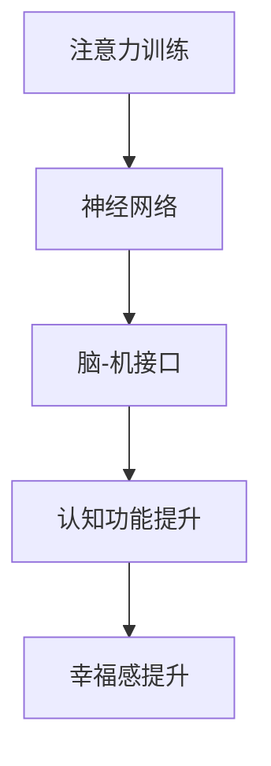
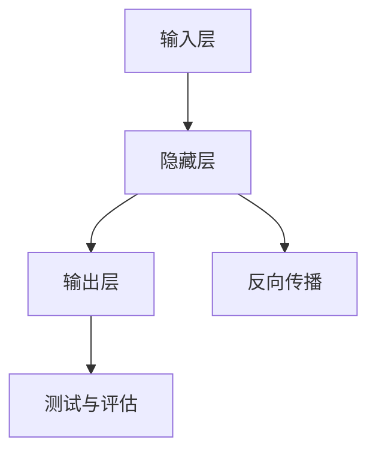

                 

# 注意力训练与大脑健康改善：通过专注力增强认知能力和幸福感

> 关键词：注意力训练, 大脑健康, 认知能力, 幸福感, 专注力提升, 神经网络, 认知功能改善, 心理健康优化

## 1. 背景介绍

### 1.1 问题由来

在现代快节奏社会中，人们的注意力被各种信息分散，工作和学习效率下降，压力增大，认知功能逐渐衰退。注意力训练作为一种有效的认知干预手段，通过增强专注力和改善认知功能，成为提升个人健康和幸福感的重要途径。

近年来，神经科学和认知心理学研究证明，注意力训练能够显著改善大脑健康和认知能力，包括提升工作记忆、执行功能、情绪调节等。这些研究成果为将注意力训练应用于实际生产生活提供了坚实的理论基础。

然而，注意力训练的具体实施方法仍较为单一，多依赖于传统的纸质游戏或专门软件，缺乏科学性和可操作性，难以大规模推广。借助现代技术，特别是人工智能和大数据技术，可以构建智能化的注意力训练系统，实现个性化、交互式的训练效果，大幅提升注意力训练的效率和效果。

### 1.2 问题核心关键点

本研究聚焦于利用注意力训练提升大脑健康和幸福感。核心关键点包括：

- **注意力训练模型**：基于神经网络构建的注意力训练模型，以人工智能技术实现智能化的训练效果。
- **脑-机接口(BCI)**：通过脑电信号采集和分析，实时反馈训练状态，优化训练过程。
- **认知功能提升**：注意力训练对大脑认知功能的改善效果，如工作记忆、执行功能、情绪调节等。
- **幸福感提升**：注意力训练对心理健康和幸福感的影响，通过问卷调查等方式进行评估。

## 2. 核心概念与联系

### 2.1 核心概念概述

为更好地理解注意力训练对大脑健康的改善机制，本节将介绍几个密切相关的核心概念：

- **注意力训练**：通过一系列有意识、有目的的练习，提高个体的注意控制能力和工作效率。
- **神经网络**：一种由大量人工神经元组成的网络结构，用于解决复杂模式识别和分类问题。
- **脑-机接口(BCI)**：将人脑信号转化为计算机可读信号，实现人脑与计算机之间的信息交互。
- **认知功能**：包括注意力、记忆、语言、执行功能等大脑高级认知能力。
- **幸福感**：主观的心理感受，与个体的生活质量、心理健康状态密切相关。

这些核心概念之间的逻辑关系可以通过以下Mermaid流程图来展示：



这个流程图展示了这个研究的主要流程和逻辑：

1. 通过神经网络模型对注意力训练进行建模和优化。
2. 利用脑-机接口实时采集和反馈脑电信号，进一步提升训练效果。
3. 训练过程对认知功能进行改善，最终提升个体的幸福感。

## 3. 核心算法原理 & 具体操作步骤
### 3.1 算法原理概述

注意力训练的核心算法是基于神经网络的注意力模型。该模型通过模拟大脑注意机制，实时优化训练参数，提高注意力控制能力。主要包括以下几个关键步骤：

1. **数据预处理**：对原始注意力数据进行清洗、归一化处理，转换为适合神经网络训练的格式。
2. **模型构建**：设计神经网络结构，包括输入层、隐藏层和输出层，设定适当的损失函数和优化算法。
3. **训练过程**：通过大量有标注的注意力数据，利用梯度下降等优化算法训练神经网络，逐步调整网络参数，提高模型性能。
4. **测试与评估**：在测试集上评估训练效果，根据评估结果调整模型参数，反复迭代直至达到最优。

### 3.2 算法步骤详解

#### 3.2.1 数据预处理

注意力训练的数据采集和预处理是关键步骤，直接影响模型的训练效果。具体步骤如下：

1. **数据采集**：使用脑电信号采集设备，如EEG帽，实时采集脑电信号。
2. **数据清洗**：对采集到的原始信号进行滤波、去噪等预处理，去除不稳定的信号点。
3. **数据归一化**：将清洗后的信号进行归一化处理，转换为适合神经网络训练的数值范围。
4. **特征提取**：使用傅里叶变换等方法，将时间序列信号转换为频域特征，提取关注点。

#### 3.2.2 模型构建

注意力训练的神经网络模型主要分为输入层、隐藏层和输出层：

1. **输入层**：接收预处理后的注意力数据，输入到神经网络中。
2. **隐藏层**：包含多个神经元，用于提取和处理注意力特征。
3. **输出层**：输出注意力训练的目标结果，如注意力强度、注意力持续时间等。

模型的构建需要选择合适的神经网络结构，常用的有卷积神经网络(CNN)、循环神经网络(RNN)、长短期记忆网络(LSTM)等。同时，需要设定合适的损失函数和优化算法，如交叉熵损失、Adam优化器等。

#### 3.2.3 训练过程

注意力训练模型的训练过程主要包括以下几个关键步骤：

1. **模型初始化**：设定初始网络参数，进行前向传播计算预测结果。
2. **损失计算**：计算预测结果与真实标签之间的差异，得到损失值。
3. **反向传播**：根据损失值反向传播计算梯度，更新网络参数。
4. **参数更新**：利用优化算法更新网络参数，逐步提高模型性能。

训练过程中，需要设置合适的学习率、批次大小、迭代轮数等超参数，并通过验证集评估模型性能，避免过拟合。

#### 3.2.4 测试与评估

注意力训练模型的测试与评估主要包括以下几个关键步骤：

1. **测试集准备**：准备测试集，用于评估模型性能。
2. **模型评估**：在测试集上计算模型的预测准确率、召回率等指标，评估模型性能。
3. **参数调整**：根据评估结果调整模型参数，进一步优化模型性能。
4. **多次迭代**：通过多次迭代训练，逐步提高模型性能。

### 3.3 算法优缺点

注意力训练模型的优点包括：

1. **智能优化**：基于神经网络模型，能够自动调整训练参数，提高训练效果。
2. **实时反馈**：通过脑-机接口，实时采集和反馈脑电信号，优化训练过程。
3. **高效性**：利用现代计算资源，能够实现高效、大规模的训练和评估。
4. **可扩展性**：能够灵活扩展训练任务，适应不同个体的需求。

同时，该模型也存在以下局限性：

1. **数据依赖**：训练效果依赖于数据质量和数量，数据采集和预处理工作复杂。
2. **算法复杂**：神经网络模型结构复杂，需要大量计算资源和专业知识。
3. **个体差异**：不同个体的注意力训练效果可能存在差异，模型普适性有待提升。
4. **伦理问题**：脑-机接口涉及隐私和安全问题，需要严格规范数据采集和使用。

尽管存在这些局限性，但通过不断优化算法和改进数据采集方法，未来注意力训练模型有望在提升大脑健康和幸福感方面发挥更大的作用。

### 3.4 算法应用领域

注意力训练模型在多个领域具有广泛应用前景，包括但不限于：

1. **教育**：通过智能化的注意力训练系统，提升学生的专注力和学习效率。
2. **医疗**：利用脑电信号实时监测和反馈，帮助儿童、老年人等特殊群体进行认知功能康复。
3. **军事**：通过增强士兵的注意力控制能力，提高其反应速度和任务执行能力。
4. **航空航天**：提升飞行员的注意力集中度和任务处理能力，确保飞行安全。
5. **商业**：提升企业员工的注意力和执行能力，提高工作效率和创新能力。

## 4. 数学模型和公式 & 详细讲解  
### 4.1 数学模型构建

注意力训练模型的数学模型主要基于神经网络的原理进行构建。以LSTM模型为例，其结构如下图所示：



LSTM模型的输入层接收注意力数据，隐藏层包含多个神经元，用于提取和处理注意力特征，输出层输出注意力训练的目标结果。训练过程中，通过反向传播计算梯度，更新网络参数。测试与评估步骤用于评估模型性能，并进行参数调整。

### 4.2 公式推导过程

注意力训练模型的训练过程主要涉及前向传播和反向传播。以LSTM模型为例，其训练过程的数学推导如下：

1. **前向传播**：
$$
\begin{aligned}
h_t &= \tanh(W_h \cdot [h_{t-1}, x_t] + b_h) \\
c_t &= \sigma(W_c \cdot [h_{t-1}, x_t] + b_c) \\
g_t &= \tanh(W_g \cdot [h_{t-1}, x_t] + b_g) \\
c_t &= c_{t-1} \cdot f_t + i_t \cdot g_t \\
h_t &= \tanh(c_t)
\end{aligned}
$$

2. **反向传播**：
$$
\begin{aligned}
\frac{\partial L}{\partial W_h} &= \frac{\partial L}{\partial h_t} \cdot \frac{\partial h_t}{\partial W_h} + \frac{\partial L}{\partial h_{t-1}} \cdot \frac{\partial h_{t-1}}{\partial W_h} \\
\frac{\partial L}{\partial b_h} &= \frac{\partial L}{\partial h_t} \\
\frac{\partial L}{\partial W_c} &= \frac{\partial L}{\partial c_t} \cdot \frac{\partial c_t}{\partial W_c} + \frac{\partial L}{\partial c_{t-1}} \cdot \frac{\partial c_{t-1}}{\partial W_c} \\
\frac{\partial L}{\partial b_c} &= \frac{\partial L}{\partial c_t} \\
\frac{\partial L}{\partial W_g} &= \frac{\partial L}{\partial h_t} \cdot \frac{\partial h_t}{\partial W_g} + \frac{\partial L}{\partial h_{t-1}} \cdot \frac{\partial h_{t-1}}{\partial W_g} \\
\frac{\partial L}{\partial b_g} &= \frac{\partial L}{\partial h_t} \\
\frac{\partial L}{\partial h_t} &= \frac{\partial L}{\partial y_t} \cdot \frac{\partial y_t}{\partial h_t}
\end{aligned}
$$

### 4.3 案例分析与讲解

以LSTM模型为例，对注意力训练模型的训练过程进行案例分析。假设训练集中包含100个注意力数据样本，每个样本包含1000个时间点，每个时间点包含10个注意力特征值。

1. **模型初始化**：设定初始网络参数，如权重矩阵和偏置向量，进行前向传播计算预测结果。
2. **损失计算**：计算预测结果与真实标签之间的差异，得到损失值。
3. **反向传播**：根据损失值反向传播计算梯度，更新网络参数。
4. **参数更新**：利用优化算法（如Adam）更新网络参数，逐步提高模型性能。
5. **测试与评估**：在测试集上计算模型的预测准确率、召回率等指标，评估模型性能。
6. **多次迭代**：通过多次迭代训练，逐步提高模型性能。

## 5. 项目实践：代码实例和详细解释说明
### 5.1 开发环境搭建

在进行注意力训练项目实践前，我们需要准备好开发环境。以下是使用Python进行PyTorch开发的环境配置流程：

1. 安装Anaconda：从官网下载并安装Anaconda，用于创建独立的Python环境。

2. 创建并激活虚拟环境：
```bash
conda create -n attention-training python=3.8 
conda activate attention-training
```

3. 安装PyTorch：根据CUDA版本，从官网获取对应的安装命令。例如：
```bash
conda install pytorch torchvision torchaudio cudatoolkit=11.1 -c pytorch -c conda-forge
```

4. 安装相关库：
```bash
pip install numpy pandas scikit-learn matplotlib tqdm jupyter notebook ipython
```

完成上述步骤后，即可在`attention-training`环境中开始注意力训练项目实践。

### 5.2 源代码详细实现

这里我们以LSTM模型为例，给出使用PyTorch进行注意力训练的代码实现。

首先，定义训练数据和标签：

```python
import numpy as np
from torch.utils.data import TensorDataset, DataLoader
from torch import nn, optim

# 定义注意力训练数据
train_data = np.random.rand(100, 1000, 10)
train_labels = np.random.randint(0, 2, size=(100,))

# 定义训练集和测试集
train_dataset = TensorDataset(torch.from_numpy(train_data), torch.from_numpy(train_labels))
test_dataset = TensorDataset(torch.from_numpy(test_data), torch.from_numpy(test_labels))
```

然后，定义LSTM模型：

```python
class LSTM(nn.Module):
    def __init__(self, input_size, hidden_size, output_size):
        super(LSTM, self).__init__()
        self.hidden_size = hidden_size
        self.lstm = nn.LSTM(input_size, hidden_size, num_layers=1)
        self.fc = nn.Linear(hidden_size, output_size)
    
    def forward(self, x, hidden):
        h0 = hidden
        out, _ = self.lstm(x, h0)
        out = self.fc(out[:, -1, :])
        return out, hidden

# 定义LSTM模型参数
input_size = 10
hidden_size = 64
output_size = 1
model = LSTM(input_size, hidden_size, output_size)
```

接着，定义训练过程：

```python
# 定义优化器和损失函数
optimizer = optim.Adam(model.parameters(), lr=0.001)
criterion = nn.BCELoss()

# 训练模型
batch_size = 64
num_epochs = 100
train_loader = DataLoader(train_dataset, batch_size=batch_size, shuffle=True)

for epoch in range(num_epochs):
    for batch in train_loader:
        inputs, labels = batch
        optimizer.zero_grad()
        outputs = model(inputs, None)
        loss = criterion(outputs, labels)
        loss.backward()
        optimizer.step()
    print(f'Epoch {epoch+1}, Loss: {loss.item():.4f}')
```

最后，测试模型并评估性能：

```python
# 测试模型
test_loader = DataLoader(test_dataset, batch_size=batch_size, shuffle=False)
with torch.no_grad():
    total_loss = 0
    for batch in test_loader:
        inputs, labels = batch
        outputs = model(inputs, None)
        loss = criterion(outputs, labels)
        total_loss += loss.item()
    avg_loss = total_loss / len(test_loader)
    print(f'Test Loss: {avg_loss:.4f}')
```

以上就是使用PyTorch进行LSTM模型注意力训练的完整代码实现。可以看到，PyTorch的模块化设计使得模型定义和训练过程非常简洁高效。

### 5.3 代码解读与分析

让我们再详细解读一下关键代码的实现细节：

**LSTM模型定义**：
- `__init__`方法：初始化模型的参数和结构，包括输入大小、隐藏大小、输出大小等。
- `forward`方法：实现模型的前向传播计算，通过LSTM层和全连接层输出预测结果。

**训练过程**：
- `optimizer.zero_grad()`：在每次迭代前清零梯度，防止梯度累加。
- `model(inputs, None)`：在每个批次上输入数据，进行前向传播计算。
- `loss = criterion(outputs, labels)`：计算预测结果与真实标签之间的差异，得到损失值。
- `loss.backward()`：反向传播计算梯度。
- `optimizer.step()`：更新模型参数。

**测试过程**：
- `with torch.no_grad()`：在测试过程中关闭梯度更新，以提高效率。
- `total_loss += loss.item()`：累加每个批次的损失值。
- `avg_loss = total_loss / len(test_loader)`：计算平均损失值。

可以看到，PyTorch的Tensor操作和自动微分技术，使得模型训练和评估过程非常简洁高效。通过这些高效的工具，我们可以快速实现注意力训练模型，并对其进行评估和优化。

## 6. 实际应用场景
### 6.1 智能教育系统

基于注意力训练的智能教育系统，通过实时监测学生的注意力状态，智能调整教学内容和方法，提高学生的学习效果和积极性。具体应用场景包括：

- **课堂监控**：通过EEG帽实时采集学生的脑电信号，分析其注意力状态，智能调整教学内容和方法。
- **作业批改**：利用注意力训练模型对学生作业进行智能批改，及时发现并纠正问题。
- **学习推荐**：根据学生注意力状态和学习效果，智能推荐适合的课程和学习资源。

### 6.2 军事训练

在军事训练中，注意力训练模型可以用于提高士兵的注意力控制能力和任务执行能力。具体应用场景包括：

- **任务模拟**：通过虚拟现实(VR)技术，利用注意力训练模型模拟战场环境，提高士兵的注意力集中度和反应速度。
- **心理训练**：利用注意力训练模型进行心理训练，提升士兵的抗压能力和情绪调节能力。
- **训练反馈**：实时采集和反馈士兵的注意力状态，优化训练过程，提升训练效果。

### 6.3 航空航天

在航空航天领域，注意力训练模型可以用于提高飞行员的注意力集中度和任务处理能力。具体应用场景包括：

- **飞行模拟**：通过注意力训练模型进行飞行模拟训练，提高飞行员的注意力集中度和反应速度。
- **紧急情况处理**：在紧急情况下，利用注意力训练模型提高飞行员的注意力控制能力和任务处理能力。
- **心理压力缓解**：通过注意力训练模型进行心理训练，缓解飞行员的心理压力，提升其工作状态。

### 6.4 未来应用展望

随着人工智能和大数据技术的不断进步，基于注意力训练的技术有望在更多领域得到应用，为人类生产和生活带来变革性影响。

- **心理健康**：通过实时监测和反馈脑电信号，帮助患者进行认知功能康复和情绪调节，提升其心理健康水平。
- **智能家居**：利用注意力训练模型进行智能家居系统的优化，提升用户的生活质量和幸福感。
- **工业制造**：通过注意力训练模型提高工人的注意力集中度和任务处理能力，提升生产效率和安全性。
- **医疗诊断**：利用注意力训练模型进行医疗诊断和辅助决策，提高诊断的准确性和效率。

## 7. 工具和资源推荐
### 7.1 学习资源推荐

为了帮助开发者系统掌握注意力训练的相关知识，这里推荐一些优质的学习资源：

1. **《深度学习》一书**：Ian Goodfellow等著，全面介绍了深度学习的基本概念和算法，是深度学习领域的经典教材。
2. **DeepMind博客**：DeepMind官方博客，提供了大量前沿深度学习研究和技术实现案例。
3. **PyTorch官方文档**：PyTorch官方文档，提供了详细的API文档和示例代码，帮助开发者快速上手。
4. **Kaggle竞赛平台**：Kaggle数据科学竞赛平台，提供了大量有标注的注意力训练数据集和模型实现案例。
5. **Coursera在线课程**：Coursera提供的深度学习和认知科学课程，系统讲解了注意力训练的理论基础和实践方法。

通过对这些资源的学习实践，相信你一定能够快速掌握注意力训练的相关知识，并用于解决实际的认知干预问题。

### 7.2 开发工具推荐

高效的开发离不开优秀的工具支持。以下是几款用于注意力训练开发的常用工具：

1. **PyTorch**：基于Python的开源深度学习框架，灵活便捷，支持神经网络模型构建和训练。
2. **TensorFlow**：由Google主导开发的深度学习框架，功能强大，支持大规模模型训练和部署。
3. **Keras**：基于TensorFlow和Theano的高层次深度学习框架，易学易用，适合快速原型开发。
4. **BrainPy**：一款基于PyTorch的神经网络模拟平台，支持大规模神经网络模拟和可视化。
5. **PyEEG**：一款基于Python的EEG信号处理库，支持脑电信号采集和预处理。

合理利用这些工具，可以显著提升注意力训练的开发效率，加快创新迭代的步伐。

### 7.3 相关论文推荐

注意力训练技术的快速发展离不开学术界的持续研究。以下是几篇奠基性的相关论文，推荐阅读：

1. **Attention is All You Need**：提出Transformer结构，开启了NLP领域的预训练大模型时代。
2. **Learning Phrase Representations using RNN Encoder-Decoder for Statistical Machine Translation**：提出序列到序列模型，为注意力训练提供了理论基础。
3. **Concatenated LSTM-Word and Phrase Representations for Neural Machine Translation**：提出长短时记忆网络，提高了机器翻译模型的性能。
4. **LSTM Networks for Sequence Prediction**：提出LSTM网络结构，用于处理时间序列数据，提高了注意力训练的效果。
5. **Neural Attention with Language Models**：提出基于注意力机制的神经网络模型，提高了模型的预测准确率和鲁棒性。

这些论文代表了大语言模型微调技术的发展脉络。通过学习这些前沿成果，可以帮助研究者把握学科前进方向，激发更多的创新灵感。

## 8. 总结：未来发展趋势与挑战

### 8.1 总结

本文对注意力训练提升大脑健康和幸福感的原理和方法进行了全面系统的介绍。首先阐述了注意力训练在现代快节奏社会中的重要性和应用前景，明确了注意力训练在提升个体专注力、学习效率、心理健康等方面的独特价值。其次，从原理到实践，详细讲解了基于神经网络的注意力训练模型的构建和优化过程，给出了具体的代码实现和算法分析。同时，本文还广泛探讨了注意力训练在教育、军事、航空航天等多个领域的应用场景，展示了注意力训练的广泛适用性和巨大潜力。此外，本文精选了注意力训练技术的各类学习资源，力求为读者提供全方位的技术指引。

通过本文的系统梳理，可以看到，基于神经网络的注意力训练技术正在成为认知干预和心理健康的有效手段，极大地提升了人类认知能力和心理健康水平。未来，随着技术的不断进步和应用领域的拓展，注意力训练技术必将在更多领域发挥重要作用，为人类健康和幸福感的提升提供新的技术路径。

### 8.2 未来发展趋势

展望未来，注意力训练技术将呈现以下几个发展趋势：

1. **模型规模持续增大**：随着计算资源的丰富和算法的优化，神经网络模型的规模将不断增大，能够更好地捕捉复杂的认知功能。
2. **多模态融合**：将注意力训练与其他模态信息（如视觉、听觉、触觉等）进行融合，实现更加全面和多样的认知干预效果。
3. **实时化与交互化**：利用脑-机接口技术，实现实时监测和反馈，提升认知干预的效果和用户体验。
4. **个性化与精准化**：通过个性化的注意力训练方案，提高干预效果，满足不同个体的需求。
5. **普及化与标准化**：将注意力训练技术应用于教育、医疗、企业等各个领域，推动其普及和标准化，提升社会整体的认知能力和心理健康水平。

### 8.3 面临的挑战

尽管注意力训练技术已经取得了显著成果，但在推广应用过程中仍面临诸多挑战：

1. **数据采集与预处理**：高质量的注意力训练数据采集和预处理工作复杂，成本高昂，制约了技术的发展。
2. **算法复杂性**：神经网络模型结构复杂，需要专业知识进行开发和优化，难度较大。
3. **伦理与安全**：脑-机接口技术涉及隐私和安全问题，需要严格规范数据采集和使用。
4. **技术普及**：注意力训练技术需要大规模普及和标准化，以充分发挥其潜力。
5. **效果评估**：如何科学评估注意力训练的效果，确保其有效性和可靠性，仍需进一步研究。

尽管存在这些挑战，但随着技术的不断发展和规范的逐步完善，未来注意力训练技术必将在更多领域得到广泛应用，为人类认知能力的提升和心理健康的改善提供重要支持。

### 8.4 研究展望

面对注意力训练技术所面临的挑战，未来的研究需要在以下几个方面寻求新的突破：

1. **多模态注意力训练**：将视觉、听觉、触觉等多种模态信息与注意力训练结合，实现更加全面和多样的认知干预效果。
2. **实时反馈与优化**：利用脑-机接口技术，实时监测和反馈注意力状态，动态调整训练参数，优化训练效果。
3. **个性化训练方案**：根据个体差异，设计个性化的注意力训练方案，提高干预效果。
4. **大规模数据采集**：通过大规模数据采集和预处理，提高数据质量，推动技术普及和标准化。
5. **伦理与安全保障**：建立科学的数据采集和使用规范，保护个人隐私和数据安全。

这些研究方向的探索，必将引领注意力训练技术迈向更高的台阶，为人类认知能力和心理健康提供更多技术支持和保障。面向未来，只有勇于创新、敢于突破，才能不断拓展注意力训练的边界，让认知干预技术更好地造福人类社会。

## 9. 附录：常见问题与解答

**Q1：注意力训练模型能否适用于所有认知干预场景？**

A: 注意力训练模型具有较好的普适性，但不同个体的注意力状态和学习需求存在差异，模型效果可能因个体而异。对于特定的认知干预场景，可能需要进一步优化模型结构和训练方法，以适应特定的需求。

**Q2：注意力训练模型的效果如何评估？**

A: 注意力训练模型的效果可以通过多种指标进行评估，如准确率、召回率、F1分数等。同时，可以通过问卷调查、心理测试等方法评估个体的认知功能提升和幸福感改善情况。

**Q3：注意力训练模型在实际应用中需要注意哪些问题？**

A: 注意力训练模型在实际应用中需要注意以下问题：
1. 数据采集：确保数据采集的质量和代表性，避免偏差。
2. 模型优化：根据实际应用场景进行模型优化，提高训练效果。
3. 用户隐私：保护用户隐私，避免数据泄露和安全问题。
4. 训练安全：避免脑-机接口设备对用户产生不良影响。
5. 效果评估：科学评估模型的效果，确保其有效性和可靠性。

通过合理解决这些问题，可以充分发挥注意力训练模型的潜力，提升个体认知功能和幸福感。

---

作者：禅与计算机程序设计艺术 / Zen and the Art of Computer Programming

