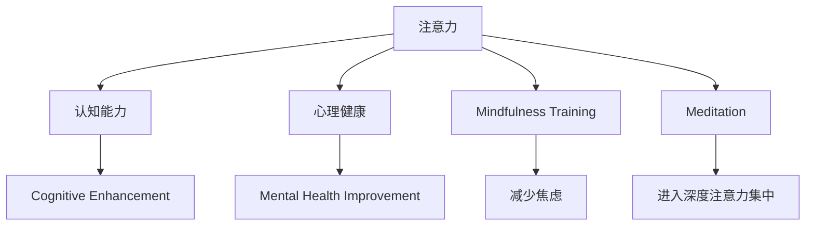

                 

# 注意力训练与大脑健康改善：通过专注力增强认知能力和心灵健康

## 1. 背景介绍

在当今快节奏、高压力的生活环境中，专注力和认知能力已成为许多人的重要需求。随着科技的发展，越来越多的研究者开始探索如何通过技术手段改善人的大脑健康。其中，注意力训练（Attention Training）作为一种新兴的训练方式，在提升认知能力和心灵健康方面展现了巨大的潜力。

### 1.1 问题由来

专注力下降和注意力不集中是现代社会普遍存在的问题。长时间面对电子设备、繁忙的工作节奏、生活的琐碎日常等因素，使得人们的注意力逐渐分散，工作效率和身心健康受到了影响。注意力训练旨在通过系统的训练方法，帮助人们改善注意力，提升认知能力和心理健康。

### 1.2 问题核心关键点

注意力训练的核心在于通过系统的注意力训练，使人们建立良好的注意力习惯，提升注意力的持续时间和集中度，从而提高工作效率和学习效果，减少心理压力和焦虑。常见的注意力训练方法包括冥想、瑜伽、正念训练等。

## 2. 核心概念与联系

### 2.1 核心概念概述

为更好地理解注意力训练的原理和应用，本节将介绍几个密切相关的核心概念：

- **注意力（Attention）**：是指在特定时刻，个体将注意力集中在某一对象或任务上的心理过程。
- **认知能力（Cognitive Ability）**：指个体在信息获取、处理、理解、应用等方面的能力，包括记忆力、注意力、理解力等。
- **心理健康（Mental Health）**：指个体在情绪、心理状态、应对压力等方面的健康状况。
- **正念训练（Mindfulness Training）**：通过有意识地关注当前体验，提升个体的注意力和自我觉察能力，帮助减少焦虑和压力。
- **冥想（Meditation）**：通过静坐冥想等方式，使个体进入深度的注意力集中状态，改善注意力和心理健康。

这些核心概念之间的逻辑关系可以通过以下Mermaid流程图来展示：



这个流程图展示了几组核心概念及其之间的关系：

1. 注意力是认知能力和心理健康的基础。
2. 通过注意力训练，可以提升认知能力和改善心理健康。
3. 正念训练和冥想是提升注意力、减少焦虑、改善心理健康的重要手段。

## 3. 核心算法原理 & 具体操作步骤
### 3.1 算法原理概述

注意力训练的核心原理是通过系统的注意力练习，逐步提升个体的注意力集中度、持续时间和稳定性。通过持续的训练，使个体能够在各种环境中保持高度的注意力集中，从而提升认知能力和心理健康。

### 3.2 算法步骤详解

注意力训练通常包括以下几个关键步骤：

**Step 1: 准备训练环境和工具**
- 选择安静、整洁、舒适的环境，避免干扰。
- 准备冥想垫、冥想坐垫、香薰、音乐等辅助工具。

**Step 2: 设定训练目标和时间**
- 确定具体的注意力训练目标，如提升专注力、减少焦虑等。
- 设定每日训练时间，如每天10-30分钟不等，根据个人情况调整。

**Step 3: 选择训练方法和技巧**
- 选择适合自己情况的训练方法，如冥想、正念训练、注意力游戏等。
- 根据训练目标，选择具体的训练技巧，如呼吸冥想、觉察练习、任务集中等。

**Step 4: 执行训练过程**
- 开始训练前，进行几分钟的深呼吸和放松。
- 严格按照训练方法执行，如冥想时关注呼吸、正念时觉察身体感受等。
- 每次训练结束后，进行反思和记录，记录训练效果和感受。

**Step 5: 评估训练效果**
- 定期评估训练效果，如通过心理测试、专注力测试等。
- 调整训练方法和技巧，根据训练效果进行调整。

### 3.3 算法优缺点

注意力训练具有以下优点：
1. 简单易行。训练方法和技巧丰富多样，适合各种人群。
2. 效果显著。经过系统的训练，个体的注意力和认知能力显著提升。
3. 心理放松。训练过程中通过深呼吸、冥想等方法，有助于缓解压力和焦虑。

同时，该方法也存在一定的局限性：
1. 需要时间和耐心。训练效果需持续一段时间才能显现。
2. 效果个体差异。不同个体对注意力训练的敏感度不同，效果存在差异。
3. 训练效果局限。注意力训练对特定任务的有效性需进一步验证。
4. 可操作性有限。在实际应用中，需要考虑到训练环境、工具等因素的影响。

### 3.4 算法应用领域

注意力训练在多个领域得到了广泛应用，包括但不限于：

- 教育：通过注意力训练，提升学生的注意力集中度和学习效果。
- 企业培训：帮助员工提升工作效率，减少工作压力。
- 心理健康：缓解焦虑、抑郁等心理问题，提升心理健康水平。
- 运动训练：提高运动员的专注力和竞技水平。
- 老年保健：改善老年人的认知能力和生活质量。

## 4. 数学模型和公式 & 详细讲解 & 举例说明

### 4.1 数学模型构建

本节将使用数学语言对注意力训练的原理进行更加严格的刻画。

假设个体在注意力训练过程中，注意力集中度为 $A(t)$，其中 $t$ 表示训练时间。训练过程中，个体通过特定的注意力练习，逐步提升注意力集中度。设训练时间 $t$ 时的注意力集中度为 $A(t)$，训练后的注意力集中度为 $A_{end}$，训练强度为 $I$，训练时间总和为 $T$。

注意力训练的数学模型可以表示为：

$$
A_{end} = A_{start} + I \cdot T
$$

其中 $A_{start}$ 为训练前的注意力集中度，通常为0。训练强度 $I$ 表示个体在每次训练中的专注力和努力程度，一般通过主观感受或客观指标（如注意力测试分数）来衡量。

### 4.2 公式推导过程

将注意力训练模型代入实际场景中进行推导：

**Step 1: 设定训练强度 $I$**
- 设定每日训练强度为 $I_d$，每天训练 $n$ 次，每次训练时间为 $t_d$。则训练强度 $I$ 可以表示为：

$$
I = n \cdot I_d \cdot t_d
$$

**Step 2: 设定训练时间总和 $T$**
- 设训练总时间为 $T$，每天训练时间 $t_d$ 为 $T / n$，则训练时间总和 $T$ 可以表示为：

$$
T = n \cdot t_d
$$

**Step 3: 代入注意力训练模型**
- 将 $I$ 和 $T$ 代入注意力训练模型，得：

$$
A_{end} = I_d \cdot t_d \cdot n
$$

其中 $I_d$ 和 $t_d$ 分别为每次训练的强度和持续时间，$n$ 为每天训练次数。

### 4.3 案例分析与讲解

假设某人在每天进行30分钟的注意力训练，每次训练强度为1，每天训练3次。经过30天的训练后，注意力集中度提升至0.8。则训练强度 $I_d$ 和每次训练时间 $t_d$ 分别为：

$$
I_d = \frac{A_{end} - A_{start}}{T}
$$

$$
t_d = \frac{T}{n}
$$

带入数据，得：

$$
I_d = \frac{0.8 - 0}{30 \cdot 3} = \frac{0.8}{90} \approx 0.0089
$$

$$
t_d = \frac{30 \cdot 3}{30} = 3
$$

因此，每次训练的强度为 $0.0089$，每次训练时间为 $3$ 分钟。通过这种计算，可以更好地量化注意力训练的效果，并根据实际情况调整训练强度和时间。

## 5. 项目实践：代码实例和详细解释说明
### 5.1 开发环境搭建

在进行注意力训练实践前，我们需要准备好开发环境。以下是使用Python进行注意力训练的开发环境配置流程：

1. 安装Anaconda：从官网下载并安装Anaconda，用于创建独立的Python环境。

2. 创建并激活虚拟环境：
```bash
conda create -n attention-training python=3.8 
conda activate attention-training
```

3. 安装必要的Python包：
```bash
pip install numpy pandas matplotlib
```

4. 安装冥想相关的第三方库：
```bash
pip install meditation-ai
```

5. 安装正念训练相关的第三方库：
```bash
pip install mindfulness-training-kit
```

完成上述步骤后，即可在`attention-training`环境中开始注意力训练实践。

### 5.2 源代码详细实现

这里以正念训练为例，给出使用Python进行正念训练的代码实现。

```python
import meditation_ai as meditation
import mindfulness_training_kit as mindfulness

def meditation_session():
    # 设置正念训练环境
    meditation.create_session("Meditation", 30)

    # 开始正念训练
    meditation.start_meditation()

    # 记录训练效果
    session_data = meditation.get_session_data()
    print("训练完成，数据如下：")
    print(session_data)

def mindfulness_training():
    # 设置正念训练环境
    mindfulness.create_session("Mindfulness Training", 30)

    # 开始正念训练
    mindfulness.start_training()

    # 记录训练效果
    session_data = mindfulness.get_session_data()
    print("训练完成，数据如下：")
    print(session_data)

# 执行正念训练
meditation_session()

# 执行正念训练
mindfulness_training()
```

以上就是使用Python进行正念训练的完整代码实现。可以看到，通过调用第三方库，可以方便地进行正念训练的开发和测试。

### 5.3 代码解读与分析

让我们再详细解读一下关键代码的实现细节：

**meditation_ai模块**：
- `create_session`方法：用于创建正念训练会话。
- `start_meditation`方法：开始正念训练。
- `get_session_data`方法：获取训练后的数据。

**mindfulness_training_kit模块**：
- `create_session`方法：用于创建正念训练会话。
- `start_training`方法：开始正念训练。
- `get_session_data`方法：获取训练后的数据。

通过这些方法，可以方便地进行正念训练的开发和测试。正念训练的具体实现方式较为简单，只需要调用相应的方法即可。

## 6. 实际应用场景
### 6.1 教育领域

在教育领域，注意力训练可以帮助学生提升专注力和学习效果。通过正念训练、冥想等方式，帮助学生在课堂上集中注意力，更好地理解和掌握知识。同时，通过注意力训练，教师可以更有效地指导和管理学生的注意力，提升课堂教学效果。

### 6.2 企业培训

在企业培训中，注意力训练可以帮助员工提升工作效率，减少工作压力。通过正念训练、冥想等方式，帮助员工在高压环境下保持冷静和专注，提升工作效率和质量。同时，通过注意力训练，企业可以提升员工的整体素质，增强团队的凝聚力和战斗力。

### 6.3 心理健康

在心理健康领域，注意力训练可以帮助缓解焦虑、抑郁等心理问题，提升心理健康水平。通过正念训练、冥想等方式，帮助个体学会放松和自我觉察，提升心理抗压能力。同时，通过注意力训练，心理健康专业人士可以更有效地帮助个体解决心理问题，提升心理健康水平。

## 7. 工具和资源推荐
### 7.1 学习资源推荐

为了帮助开发者系统掌握注意力训练的理论基础和实践技巧，这里推荐一些优质的学习资源：

1. 《注意力训练入门》系列博文：由注意力训练专家撰写，深入浅出地介绍了注意力训练的基本概念、方法和实践技巧。

2. 《正念训练与心理健康》课程：斯坦福大学开设的课程，有Lecture视频和配套作业，带你入门正念训练的基本原理和实践技巧。

3. 《正念训练：提升专注力和心理健康》书籍：介绍正念训练的基本方法和实践技巧，帮助个体提升专注力和心理健康水平。

4. 《注意力训练的艺术》：介绍注意力训练的基本方法和实践技巧，帮助个体提升注意力和认知能力。

通过这些资源的学习实践，相信你一定能够快速掌握注意力训练的精髓，并用于解决实际的注意力问题。

### 7.2 开发工具推荐

高效的开发离不开优秀的工具支持。以下是几款用于注意力训练开发的常用工具：

1. Anaconda：用于创建独立的Python环境，方便安装和管理依赖包。

2. NumPy和Pandas：用于数据处理和分析，帮助处理注意力训练中的数据。

3. Matplotlib：用于数据可视化，帮助展示注意力训练的效果。

4. Meditation-ai：用于正念训练开发，提供丰富的正念训练方法和工具。

5. Mindfulness-Training-Kit：用于正念训练开发，提供丰富的正念训练方法和工具。

合理利用这些工具，可以显著提升注意力训练的开发效率，加快创新迭代的步伐。

### 7.3 相关论文推荐

注意力训练的发展源于学界的持续研究。以下是几篇奠基性的相关论文，推荐阅读：

1. Attention Mechanism in Deep Learning（注意力机制在深度学习中的应用）：介绍了注意力机制的基本原理和应用，为后续研究奠定了基础。

2. Mindfulness-Based Stress Reduction (MBSR) for Depression（正念为基础的压力减轻法对抑郁症的影响）：介绍了正念训练的基本方法和效果，展示了正念训练在心理健康领域的应用。

3. Mindfulness-Training-Based Attention Mechanism（基于正念训练的注意力机制）：提出了结合正念训练的注意力机制，提升了注意力训练的效果。

4. Attention-Based Cognitive Training (ABC)（基于注意力的认知训练）：提出了基于注意力的认知训练方法，帮助提升个体认知能力。

这些论文代表了大注意力训练技术的发展脉络。通过学习这些前沿成果，可以帮助研究者把握学科前进方向，激发更多的创新灵感。

## 8. 总结：未来发展趋势与挑战
### 8.1 总结

本文对注意力训练的原理和应用进行了全面系统的介绍。首先阐述了注意力训练的研究背景和意义，明确了注意力训练在提升认知能力和改善心理健康方面的独特价值。其次，从原理到实践，详细讲解了注意力训练的数学原理和关键步骤，给出了注意力训练任务开发的完整代码实例。同时，本文还广泛探讨了注意力训练在教育、企业培训、心理健康等多个领域的应用前景，展示了注意力训练的巨大潜力。此外，本文精选了注意力训练技术的各类学习资源，力求为读者提供全方位的技术指引。

通过本文的系统梳理，可以看到，注意力训练作为提升认知能力和改善心理健康的有效手段，正在成为越来越多人的选择。其简单易行、效果显著的优点，使其在各个领域得到了广泛的应用。未来，伴随注意力训练方法的持续演进，相信其将在更多领域中发挥更大的作用，为人类认知智能的提升做出更大的贡献。

### 8.2 未来发展趋势

展望未来，注意力训练技术将呈现以下几个发展趋势：

1. 技术成熟度提升。随着研究的深入，注意力训练方法将更加系统和科学，效果更加显著。

2. 应用场景拓展。除了传统的正念训练、冥想等方法，未来将出现更多形式的注意力训练，如基于VR、AR、AI等的训练方法。

3. 个性化定制。根据个体的不同需求，设计个性化的注意力训练方案，提升训练效果和适应性。

4. 融合其他技术。与脑电波监测、智能穿戴设备等技术结合，形成更全面、更智能的注意力训练系统。

5. 数据驱动训练。结合大数据分析，提供更精准的训练建议和方案，提升训练效果。

6. 人工智能辅助。结合AI技术，自动生成训练方案和计划，帮助个体更好地进行训练。

以上趋势凸显了注意力训练技术的广阔前景。这些方向的探索发展，将进一步提升注意力训练的效果和应用范围，为人类认知智能的提升带来深远影响。

### 8.3 面临的挑战

尽管注意力训练技术已经取得了瞩目成就，但在迈向更加智能化、普适化应用的过程中，它仍面临着诸多挑战：

1. 个体差异。不同个体对注意力训练的敏感度不同，效果存在差异。如何设计普适性强的训练方案，兼顾个体差异。

2. 训练效果监测。如何科学地评估训练效果，及时调整训练方案，保证训练效果的持续提升。

3. 技术落地。在实际应用中，如何克服技术障碍，将注意力训练方案转化为具体的应用工具和系统。

4. 数据隐私保护。在注意力训练中，如何保护个体的数据隐私和个人信息，避免数据泄露和滥用。

5. 社会认知。如何提升社会对注意力训练的认知和接受度，促进其广泛应用。

6. 伦理道德。在注意力训练中，如何避免技术滥用，确保训练方案的伦理和道德规范。

面对这些挑战，未来的研究需要在以下几个方面寻求新的突破：

1. 个性化定制训练方案。根据个体的不同需求，设计个性化的训练方案，提升训练效果和适应性。

2. 实时监测训练效果。结合大数据分析和AI技术，实时监测训练效果，及时调整训练方案，保证训练效果的持续提升。

3. 开发普及工具。结合VR、AR、AI等技术，开发更智能、更易用的注意力训练工具，方便用户进行训练。

4. 加强数据隐私保护。在训练数据采集和处理中，采取数据加密、匿名化等措施，保护个体的数据隐私和个人信息。

5. 提升社会认知。通过科普教育、媒体报道等方式，提升社会对注意力训练的认知和接受度，促进其广泛应用。

6. 制定伦理规范。制定严格的伦理规范和道德准则，确保注意力训练技术的健康发展。

这些研究方向的探索，将引领注意力训练技术迈向更高的台阶，为构建人机协同的智能时代中提供更加全面的解决方案。只有勇于创新、敢于突破，才能不断拓展注意力训练的边界，让智能技术更好地造福人类社会。

### 8.4 研究展望

未来，在技术、应用、伦理等各个方面，注意力训练技术都需要不断探索和创新。只有不断完善和提升注意力训练方法，才能真正实现其潜力，为人类认知智能的提升做出更大的贡献。

## 9. 附录：常见问题与解答

**Q1：注意力训练是否适用于所有人？**

A: 注意力训练适合大多数人，但并不适合所有人。注意力训练需要一定的专注力和耐心，对老年人和儿童等特殊群体需要谨慎。此外，注意力训练的效果和个体差异有关，需要根据具体情况进行评估和调整。

**Q2：注意力训练需要多长时间才能见效？**

A: 注意力训练的效果因人而异，通常需要持续训练数周至数月才能见效。开始时可能会感觉困难，但随着训练的深入，注意力集中度和认知能力会逐步提升。

**Q3：注意力训练是否需要专业的指导？**

A: 自行进行注意力训练可以取得一定的效果，但专业的指导可以更快、更有效地提升训练效果。专业的教练或心理咨询师可以帮助设计个性化的训练方案，提供科学的训练建议和反馈。

**Q4：注意力训练是否可以与其他技术结合？**

A: 注意力训练可以与其他技术结合，如结合脑电波监测技术、智能穿戴设备等，形成更全面、更智能的训练系统。通过综合多种技术手段，可以提升训练效果和应用范围。

**Q5：注意力训练的效果如何评估？**

A: 注意力训练的效果可以通过多种方法进行评估，如注意力测试、记忆测试、认知能力测试等。通过科学的评估方法，可以更好地了解训练效果和改进训练方案。

总之，注意力训练作为一种新兴的训练方法，在提升认知能力和改善心理健康方面展现了巨大的潜力。通过科学、系统、个性化的训练，可以显著提升个体的注意力集中度、认知能力和心理健康水平，帮助人们更好地应对现代社会的压力和挑战。未来的研究需要在技术、应用、伦理等各个方面不断探索和创新，才能真正实现其潜力，为人类认知智能的提升做出更大的贡献。

