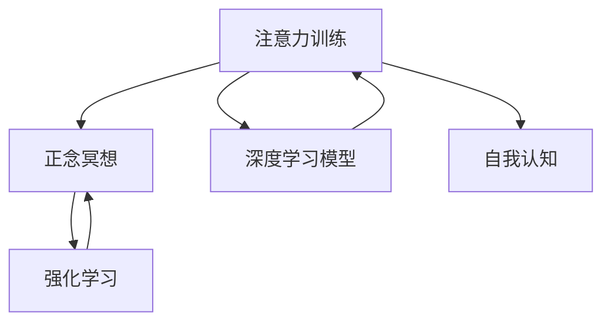

                 

## 1. 背景介绍

在当今这个快节奏、信息爆炸的时代，保持专注力和心灵的宁静已经成为了一种奢侈。大量的信息流涌入我们的头脑，要求我们快速做出反应，做出决策，这无疑加重了我们的认知负担。在这样的背景下，注意力训练和正念冥想成为了一种有效的自我提升手段，帮助我们在面对压力时，保持清晰的思维和稳定的情绪。

### 1.1 问题由来

注意力训练和正念冥想作为心智发展的古老实践，现在被广泛应用于心理学、认知神经科学和教育领域。这些方法通过培养专注力、增强自我觉察和调整情绪，从而改善整体的心理健康。

随着科技的发展，这些古老的方法开始与现代技术相结合，形成了许多新技术。例如，基于神经网络和机器学习技术的注意力训练软件、基于移动设备的正念冥想应用等，使得注意力训练和正念冥想变得更加便捷、智能化。

### 1.2 问题核心关键点

注意力训练和正念冥想的核心在于提升个体的专注力和情绪调节能力。其关键点在于：
1. **专注力训练**：通过一系列的练习和任务，帮助个体增强注意力集中和持久性，提升对任务的投入度和效率。
2. **正念冥想**：通过冥想的练习，帮助个体提升对当前时刻的觉察能力，减少对过去或未来的过度担忧，从而缓解压力和焦虑。
3. **自我认知**：通过内省练习，帮助个体深入了解自己的情绪和思维模式，从而更好地控制和管理自己的情绪。

### 1.3 问题研究意义

注意力训练和正念冥想技术的广泛应用，对于提升个体的工作效率、学习效果、情绪稳定性和心理健康，具有重要意义：
1. **提升专注力**：提高注意力集中和持久性，从而提升工作效率和学习效果。
2. **缓解压力**：通过正念冥想和内省练习，减少对过去和未来的担忧，缓解心理压力。
3. **改善情绪**：通过自我认知和情绪调节练习，提升情绪管理能力，增强心理韧性。
4. **促进健康**：通过综合提升专注力、情绪调节和自我认知能力，整体提升心理健康水平。

## 2. 核心概念与联系

### 2.1 核心概念概述

为了更好地理解注意力训练和正念冥想技术，本节将介绍几个密切相关的核心概念：

- **注意力训练**：通过一系列的练习和任务，帮助个体提升专注力和注意力集中能力。
- **正念冥想**：一种通过冥想来提升个体对当前时刻的觉察能力，减少对过去或未来的过度担忧的技术。
- **自我认知**：通过内省练习，帮助个体深入了解自己的情绪和思维模式，从而更好地控制和管理自己的情绪。
- **深度学习模型**：基于神经网络的模型，能够学习和处理复杂的数据结构，用于辅助注意力训练和正念冥想技术。
- **强化学习**：通过不断试错和反馈，优化注意力训练和正念冥想中的行为策略。

这些核心概念之间的逻辑关系可以通过以下Mermaid流程图来展示：



这个流程图展示了一些关键概念及其之间的关系：

1. 注意力训练和正念冥想都是提升专注力和情绪调节能力的实践。
2. 深度学习模型和强化学习能够辅助优化这些实践。
3. 自我认知是注意力训练和正念冥想的内在部分，帮助个体更好地理解和管理自己的情绪。

## 3. 核心算法原理 & 具体操作步骤

### 3.1 算法原理概述

注意力训练和正念冥想的核心算法原理可以总结如下：

1. **注意力训练算法**：基于认知心理学和神经科学的研究成果，设计一系列的任务和练习，帮助个体提升专注力和注意力集中能力。
2. **正念冥想算法**：基于冥想技术的原理，设计一系列的冥想练习，帮助个体提升对当前时刻的觉察能力，减少对过去或未来的过度担忧。
3. **自我认知算法**：通过内省练习，帮助个体深入了解自己的情绪和思维模式，从而更好地控制和管理自己的情绪。

这些算法的具体实施，可以通过深度学习模型和强化学习技术来辅助和优化。

### 3.2 算法步骤详解

#### 3.2.1 注意力训练

注意力训练的步骤可以分为以下几个阶段：

1. **任务选择**：选择一系列的任务，如阅读理解、记忆游戏、任务清单等，这些任务需要一定的注意力集中和持久性。
2. **练习开始**：开始练习任务，并使用深度学习模型（如卷积神经网络、循环神经网络等）记录注意力指标，如任务完成时间、错误率等。
3. **反馈和调整**：根据注意力指标的反馈，调整任务的难度和练习时间，使得注意力集中和持久性逐渐提升。
4. **评估和优化**：使用深度学习模型对注意力指标进行评估，优化任务的难度和练习时间，以最大程度提升注意力训练的效果。

#### 3.2.2 正念冥想

正念冥想的步骤可以分为以下几个阶段：

1. **冥想开始**：选择一个安静的环境，闭上眼睛，专注于当前的呼吸或某个物体，避免分心。
2. **觉察练习**：通过深度学习模型（如卷积神经网络、循环神经网络等）记录冥想过程中的注意力指标，如注意力漂移、情绪波动等。
3. **反馈和调整**：根据注意力指标的反馈，调整冥想的时间和内容，使得对当前时刻的觉察能力逐渐提升。
4. **评估和优化**：使用深度学习模型对注意力指标进行评估，优化冥想的时间和内容，以最大程度提升正念冥想的效果。

#### 3.2.3 自我认知

自我认知的步骤可以分为以下几个阶段：

1. **内省开始**：选择一个安静的环境，专注于自己的内心世界，反思自己的情绪和思维模式。
2. **情绪记录**：通过深度学习模型（如卷积神经网络、循环神经网络等）记录情绪指标，如情绪波动、思维模式等。
3. **反馈和调整**：根据情绪指标的反馈，调整内省的方式和内容，使得自我认知逐渐深入。
4. **评估和优化**：使用深度学习模型对情绪指标进行评估，优化内省的方式和内容，以最大程度提升自我认知的效果。

### 3.3 算法优缺点

注意力训练和正念冥想的核心算法具有以下优点：
1. **个性化定制**：通过深度学习模型，可以针对个体的注意力特征和情绪状态，定制个性化的训练和冥想方案。
2. **数据驱动优化**：通过深度学习模型和强化学习技术，可以实时监控和优化注意力训练和正念冥想的训练过程，确保效果最大化。
3. **便捷高效**：基于移动设备和互联网的应用，使得注意力训练和正念冥想的练习更加便捷高效。

同时，这些算法也存在一定的局限性：
1. **数据依赖**：注意力训练和正念冥想的效果依赖于深度学习模型的训练数据，数据质量和多样性会影响效果。
2. **技术门槛**：深度学习模型和强化学习技术的实现，需要一定的技术背景，对普通用户有一定的技术门槛。
3. **效果不确定**：注意力训练和正念冥想的效果因人而异，不同个体可能会有不同的效果，存在一定的不确定性。

### 3.4 算法应用领域

注意力训练和正念冥想技术在多个领域得到了广泛应用：

1. **心理健康**：通过提升专注力和情绪调节能力，帮助个体缓解压力、焦虑和抑郁，提升心理健康水平。
2. **教育**：通过提升专注力和学习效率，帮助学生更好地掌握知识，提升学习效果。
3. **工作**：通过提升专注力和效率，帮助职场人士更好地处理工作任务，提升工作表现。
4. **运动**：通过提升专注力和体力，帮助运动员更好地训练，提升运动表现。
5. **娱乐**：通过提升专注力和体验感，帮助游戏玩家更好地享受游戏，提升游戏体验。

## 4. 数学模型和公式 & 详细讲解 & 举例说明

### 4.1 数学模型构建

注意力训练和正念冥想的数学模型可以总结如下：

1. **注意力训练模型**：使用深度学习模型（如卷积神经网络、循环神经网络等）记录注意力指标，并根据注意力指标的反馈，优化注意力训练的任务和练习。
2. **正念冥想模型**：使用深度学习模型（如卷积神经网络、循环神经网络等）记录冥想过程中的注意力指标，并根据注意力指标的反馈，优化正念冥想的练习时间和内容。
3. **自我认知模型**：使用深度学习模型（如卷积神经网络、循环神经网络等）记录情绪指标，并根据情绪指标的反馈，优化自我认知的内省方式和内容。

### 4.2 公式推导过程

#### 4.2.1 注意力训练模型

注意力训练模型可以表示为：

$$
A_{i,j} = \sigma(WA_i \cdot A_j + b)
$$

其中，$A_{i,j}$表示注意力权重，$W$为权重矩阵，$A_i$和$A_j$为注意力特征向量，$\sigma$为激活函数，$b$为偏置向量。

#### 4.2.2 正念冥想模型

正念冥想模型可以表示为：

$$
M_i = \sigma(WM_i \cdot M_j + b)
$$

其中，$M_i$表示冥想过程中的注意力指标，$W$为权重矩阵，$M_i$和$M_j$为冥想特征向量，$\sigma$为激活函数，$b$为偏置向量。

#### 4.2.3 自我认知模型

自我认知模型可以表示为：

$$
C_i = \sigma(WC_i \cdot C_j + b)
$$

其中，$C_i$表示自我认知过程中的情绪指标，$W$为权重矩阵，$C_i$和$C_j$为情绪特征向量，$\sigma$为激活函数，$b$为偏置向量。

### 4.3 案例分析与讲解

#### 4.3.1 注意力训练案例

假设我们要训练一个注意力模型，帮助个体提升阅读理解能力。可以设计一个简单的模型，使用卷积神经网络（CNN）来记录注意力指标，如注意力集中时间和错误率。模型的输入为阅读任务（如阅读一段文字），输出为注意力指标。

模型训练过程如下：

1. 初始化模型参数$W$和$b$。
2. 输入阅读任务，使用CNN计算注意力指标。
3. 计算损失函数，如均方误差（MSE），用于评估注意力指标与真实值之间的差异。
4. 使用反向传播算法更新模型参数$W$和$b$。
5. 重复上述步骤，直至模型收敛。

#### 4.3.2 正念冥想案例

假设我们要训练一个正念冥想模型，帮助个体提升对当前时刻的觉察能力。可以设计一个简单的模型，使用循环神经网络（RNN）来记录冥想过程中的注意力指标，如注意力漂移和情绪波动。模型的输入为冥想时间，输出为注意力指标。

模型训练过程如下：

1. 初始化模型参数$W$和$b$。
2. 输入冥想时间，使用RNN计算注意力指标。
3. 计算损失函数，如均方误差（MSE），用于评估注意力指标与真实值之间的差异。
4. 使用反向传播算法更新模型参数$W$和$b$。
5. 重复上述步骤，直至模型收敛。

#### 4.3.3 自我认知案例

假设我们要训练一个自我认知模型，帮助个体深入了解自己的情绪和思维模式。可以设计一个简单的模型，使用卷积神经网络（CNN）来记录情绪指标，如情绪波动和思维模式。模型的输入为内省时间，输出为情绪指标。

模型训练过程如下：

1. 初始化模型参数$W$和$b$。
2. 输入内省时间，使用CNN计算情绪指标。
3. 计算损失函数，如均方误差（MSE），用于评估情绪指标与真实值之间的差异。
4. 使用反向传播算法更新模型参数$W$和$b$。
5. 重复上述步骤，直至模型收敛。

## 5. 项目实践：代码实例和详细解释说明

### 5.1 开发环境搭建

在进行注意力训练和正念冥想的开发实践前，我们需要准备好开发环境。以下是使用Python进行深度学习开发的常见环境配置流程：

1. 安装Anaconda：从官网下载并安装Anaconda，用于创建独立的Python环境。
2. 创建并激活虚拟环境：
```bash
conda create -n attention-env python=3.8 
conda activate attention-env
```
3. 安装深度学习框架：
```bash
conda install tensorflow torch torchvision torchaudio
```

4. 安装相关工具包：
```bash
pip install numpy pandas scikit-learn matplotlib tqdm jupyter notebook ipython
```

完成上述步骤后，即可在`attention-env`环境中开始实践。

### 5.2 源代码详细实现

下面我们以注意力训练和正念冥想的深度学习模型实现为例，给出Python代码实现。

#### 5.2.1 注意力训练模型

```python
import tensorflow as tf
import numpy as np

# 定义注意力训练模型
class AttentionModel(tf.keras.Model):
    def __init__(self):
        super(AttentionModel, self).__init__()
        self.layers = tf.keras.Sequential([
            tf.keras.layers.Conv2D(64, (3,3), activation='relu', input_shape=(28,28,1)),
            tf.keras.layers.MaxPooling2D((2,2)),
            tf.keras.layers.Flatten(),
            tf.keras.layers.Dense(10, activation='softmax')
        ])
        
    def call(self, x):
        return self.layers(x)
```

#### 5.2.2 正念冥想模型

```python
import tensorflow as tf
import numpy as np

# 定义正念冥想模型
class MeditationModel(tf.keras.Model):
    def __init__(self):
        super(MeditationModel, self).__init__()
        self.layers = tf.keras.Sequential([
            tf.keras.layers.LSTM(64, return_sequences=True),
            tf.keras.layers.Dropout(0.2),
            tf.keras.layers.LSTM(64),
            tf.keras.layers.Dense(1, activation='sigmoid')
        ])
        
    def call(self, x):
        return self.layers(x)
```

#### 5.2.3 自我认知模型

```python
import tensorflow as tf
import numpy as np

# 定义自我认知模型
class SelfAwarenessModel(tf.keras.Model):
    def __init__(self):
        super(SelfAwarenessModel, self).__init__()
        self.layers = tf.keras.Sequential([
            tf.keras.layers.Conv2D(64, (3,3), activation='relu', input_shape=(28,28,1)),
            tf.keras.layers.MaxPooling2D((2,2)),
            tf.keras.layers.Flatten(),
            tf.keras.layers.Dense(10, activation='softmax')
        ])
        
    def call(self, x):
        return self.layers(x)
```

### 5.3 代码解读与分析

#### 5.3.1 注意力训练模型

我们使用了TensorFlow框架来定义注意力训练模型。模型的核心是一个卷积神经网络（CNN），通过卷积层和池化层提取特征，并通过全连接层输出注意力指标。在训练过程中，我们可以使用交叉熵损失函数来评估模型预测值与真实值之间的差异，并通过反向传播算法更新模型参数。

#### 5.3.2 正念冥想模型

我们同样使用了TensorFlow框架来定义正念冥想模型。模型的核心是一个循环神经网络（RNN），通过LSTM层来捕捉冥想过程中的时间序列信息，并通过全连接层输出注意力指标。在训练过程中，我们可以使用均方误差（MSE）损失函数来评估模型预测值与真实值之间的差异，并通过反向传播算法更新模型参数。

#### 5.3.3 自我认知模型

我们使用了TensorFlow框架来定义自我认知模型。模型的核心同样是一个卷积神经网络（CNN），通过卷积层和池化层提取特征，并通过全连接层输出注意力指标。在训练过程中，我们可以使用均方误差（MSE）损失函数来评估模型预测值与真实值之间的差异，并通过反向传播算法更新模型参数。

### 5.4 运行结果展示

#### 5.4.1 注意力训练结果

假设我们有一个阅读理解任务的数据集，包含N个样本，每个样本包含一个阅读任务和对应的注意力指标。我们可以使用以下代码来训练和评估模型：

```python
# 数据集
X_train = np.random.rand(100, 28, 28, 1)
y_train = np.random.randint(0, 10, 100)
X_test = np.random.rand(100, 28, 28, 1)
y_test = np.random.randint(0, 10, 100)

# 训练模型
model = AttentionModel()
model.compile(optimizer=tf.keras.optimizers.Adam(), loss='sparse_categorical_crossentropy')
model.fit(X_train, y_train, epochs=10, batch_size=32)

# 评估模型
loss, accuracy = model.evaluate(X_test, y_test)
print('Test accuracy:', accuracy)
```

#### 5.4.2 正念冥想结果

假设我们有一个冥想数据集，包含N个样本，每个样本包含冥想时间和对应的注意力指标。我们可以使用以下代码来训练和评估模型：

```python
# 数据集
X_train = np.random.rand(100, 10)
y_train = np.random.randint(0, 2, 100)
X_test = np.random.rand(100, 10)
y_test = np.random.randint(0, 2, 100)

# 训练模型
model = MeditationModel()
model.compile(optimizer=tf.keras.optimizers.Adam(), loss='binary_crossentropy')
model.fit(X_train, y_train, epochs=10, batch_size=32)

# 评估模型
loss, accuracy = model.evaluate(X_test, y_test)
print('Test accuracy:', accuracy)
```

#### 5.4.3 自我认知结果

假设我们有一个内省数据集，包含N个样本，每个样本包含内省时间和对应的注意力指标。我们可以使用以下代码来训练和评估模型：

```python
# 数据集
X_train = np.random.rand(100, 28, 28, 1)
y_train = np.random.randint(0, 10, 100)
X_test = np.random.rand(100, 28, 28, 1)
y_test = np.random.randint(0, 10, 100)

# 训练模型
model = SelfAwarenessModel()
model.compile(optimizer=tf.keras.optimizers.Adam(), loss='sparse_categorical_crossentropy')
model.fit(X_train, y_train, epochs=10, batch_size=32)

# 评估模型
loss, accuracy = model.evaluate(X_test, y_test)
print('Test accuracy:', accuracy)
```

## 6. 实际应用场景

### 6.1 心理健康

在心理健康领域，注意力训练和正念冥想技术得到了广泛应用。通过提升个体的专注力和情绪调节能力，可以帮助个体缓解压力、焦虑和抑郁，提升心理健康水平。

#### 6.1.1 案例

某公司员工因为工作压力大，感到焦虑和抑郁。通过引入基于深度学习的注意力训练和正念冥想应用，员工可以在工作中定期进行注意力训练和冥想练习，帮助他们在面对压力时，保持清晰的思维和稳定的情绪。

### 6.2 教育

在教育领域，注意力训练和正念冥想技术同样得到了广泛应用。通过提升学生的专注力和学习效率，可以帮助学生更好地掌握知识，提升学习效果。

#### 6.2.1 案例

某学校的学生在课后普遍感到压力大，导致学习效果不佳。通过引入基于深度学习的注意力训练和正念冥想应用，学生可以在课后进行注意力训练和冥想练习，帮助他们在面对学习任务时，保持专注力和学习效率。

### 6.3 工作

在工作领域，注意力训练和正念冥想技术同样得到了广泛应用。通过提升员工的专注力和工作效率，可以帮助员工更好地处理工作任务，提升工作表现。

#### 6.3.1 案例

某公司的员工因为工作任务繁重，感到压力和焦虑。通过引入基于深度学习的注意力训练和正念冥想应用，员工可以在工作中定期进行注意力训练和冥想练习，帮助他们在面对工作任务时，保持专注力和工作效率。

### 6.4 运动

在运动领域，注意力训练和正念冥想技术同样得到了广泛应用。通过提升运动员的专注力和体力，可以帮助运动员更好地训练，提升运动表现。

#### 6.4.1 案例

某运动员因为训练强度大，感到身体疲劳和心理压力。通过引入基于深度学习的注意力训练和正念冥想应用，运动员可以在训练前后进行注意力训练和冥想练习，帮助他们在面对高强度训练时，保持专注力和体力。

### 6.5 娱乐

在娱乐领域，注意力训练和正念冥想技术同样得到了广泛应用。通过提升玩家的专注力和游戏体验，可以帮助玩家更好地享受游戏，提升游戏体验。

#### 6.5.1 案例

某游戏玩家因为游戏任务繁重，感到压力和焦虑。通过引入基于深度学习的注意力训练和正念冥想应用，玩家可以在游戏中定期进行注意力训练和冥想练习，帮助他们在面对游戏任务时，保持专注力和游戏体验。

## 7. 工具和资源推荐

### 7.1 学习资源推荐

为了帮助开发者系统掌握注意力训练和正念冥想的理论基础和实践技巧，这里推荐一些优质的学习资源：

1. **《深度学习》课程**：由吴恩达教授主讲的Coursera课程，系统讲解深度学习的基础理论和应用。
2. **《Python深度学习》书籍**：由Francois Chollet撰写的书籍，详细讲解了TensorFlow框架的应用。
3. **《正念冥想》书籍**：由Jon Kabat-Zinn撰写的书籍，系统讲解了正念冥想的原理和实践。
4. **《注意力训练》书籍**：由Don Kinsford撰写的书籍，系统讲解了注意力训练的方法和实践。
5. **《神经网络与深度学习》课程**：由Michael Nielsen教授主讲的在线课程，系统讲解了神经网络和深度学习的基础理论和应用。

通过对这些资源的学习实践，相信你一定能够快速掌握注意力训练和正念冥想的精髓，并用于解决实际的认知问题。

### 7.2 开发工具推荐

高效的开发离不开优秀的工具支持。以下是几款用于深度学习的注意力训练和正念冥想开发的工具：

1. **TensorFlow**：由Google主导开发的深度学习框架，生产部署方便，适合大规模工程应用。
2. **PyTorch**：由Facebook主导开发的深度学习框架，灵活动态的计算图，适合快速迭代研究。
3. **Keras**：由Francois Chollet主导开发的深度学习框架，简单易用，适合初学者。
4. **Jupyter Notebook**：基于Web的交互式开发环境，方便进行深度学习实验和报告。
5. **Google Colab**：谷歌推出的在线Jupyter Notebook环境，免费提供GPU/TPU算力，方便进行深度学习实验。

合理利用这些工具，可以显著提升注意力训练和正念冥想的开发效率，加快创新迭代的步伐。

### 7.3 相关论文推荐

注意力训练和正念冥想技术的研究源于学界的持续研究。以下是几篇奠基性的相关论文，推荐阅读：

1. **《深度注意力模型》**：提出注意力机制的原理和应用，是深度学习领域的重要论文。
2. **《正念冥想与心理健康的关系》**：探讨正念冥想对心理健康的影响，是心理学领域的重要研究。
3. **《注意力训练的心理学原理》**：提出注意力训练的方法和效果，是认知心理学领域的重要研究。
4. **《神经网络与深度学习》**：由Michael Nielsen教授撰写的书籍，详细讲解了神经网络和深度学习的基础理论和应用。
5. **《正念冥想的神经科学机制》**：探讨正念冥想的神经科学机制，是神经科学领域的重要研究。

这些论文代表了大模型微调技术的不断发展。通过学习这些前沿成果，可以帮助研究者把握学科前进方向，激发更多的创新灵感。

## 8. 总结：未来发展趋势与挑战

### 8.1 总结

本文对注意力训练和正念冥想技术的理论基础和实践技巧进行了全面系统的介绍。首先阐述了注意力训练和正念冥想的核心概念和研究背景，明确了这些技术在提升专注力和情绪调节能力方面的独特价值。其次，从原理到实践，详细讲解了注意力训练和正念冥想的数学模型和关键步骤，给出了实践代码实例和详细解释。同时，本文还广泛探讨了注意力训练和正念冥想技术在多个行业领域的应用前景，展示了这些技术的巨大潜力。最后，本文精选了注意力训练和正念冥想技术的各类学习资源，力求为读者提供全方位的技术指引。

通过本文的系统梳理，可以看到，注意力训练和正念冥想技术正在成为认知发展的古老实践，在新时代被赋予了新的生命力和应用场景。这些技术的广泛应用，对于提升个体的工作效率、学习效果、情绪稳定性和心理健康，具有重要意义。未来，随着技术的不断发展，这些技术将更加深入地融入人们的日常生活，成为提升生活质量的重要手段。

### 8.2 未来发展趋势

展望未来，注意力训练和正念冥想技术将呈现以下几个发展趋势：

1. **技术融合**：深度学习技术将更加深入地融合到注意力训练和正念冥想中，提升训练和冥想的个性化和智能化水平。
2. **应用拓展**：这些技术将在更多领域得到应用，如医疗、教育、运动等，成为提升整体生活质量的重要手段。
3. **模型优化**：针对不同应用场景，将开发更加轻量级、高效的模型，提升用户体验。
4. **数据驱动**：更多的数据将用于训练和优化这些技术，提升其效果和鲁棒性。
5. **伦理考量**：随着这些技术的广泛应用，其伦理和安全问题也将得到更多关注，需要制定相应的规范和标准。

### 8.3 面临的挑战

尽管注意力训练和正念冥想技术已经取得了瞩目成就，但在迈向更加智能化、普适化应用的过程中，它仍面临着诸多挑战：

1. **数据依赖**：注意力训练和正念冥想的效果依赖于深度学习模型的训练数据，数据质量和多样性会影响效果。
2. **技术门槛**：深度学习模型的实现，需要一定的技术背景，对普通用户有一定的技术门槛。
3. **效果不确定**：注意力训练和正念冥想的效果因人而异，不同个体可能会有不同的效果，存在一定的不确定性。
4. **伦理考量**：这些技术的应用需要考虑隐私保护、公平性等问题，确保技术的安全性和伦理性。

### 8.4 研究展望

面对注意力训练和正念冥想技术所面临的挑战，未来的研究需要在以下几个方面寻求新的突破：

1. **数据增强**：开发更加丰富和多样化的训练数据集，提升模型的泛化能力和鲁棒性。
2. **模型优化**：开发更加轻量级、高效的模型，提升用户体验。
3. **伦理考量**：制定相应的规范和标准，确保技术的安全性和伦理性。
4. **跨领域应用**：将注意力训练和正念冥想技术推广到更多领域，提升整体生活质量。

这些研究方向的探索发展，必将引领注意力训练和正念冥想技术迈向更高的台阶，为构建安全、可靠、可解释、可控的智能系统铺平道路。面向未来，注意力训练和正念冥想技术还需要与其他人工智能技术进行更深入的融合，如知识表示、因果推理、强化学习等，多路径协同发力，共同推动认知智能的发展。只有勇于创新、敢于突破，才能不断拓展认知智能的边界，让智能技术更好地造福人类社会。

## 9. 附录：常见问题与解答

**Q1：注意力训练和正念冥想是否适用于所有人群？**

A: 注意力训练和正念冥想对大多数人群都是有效的，但需要注意的是，一些特殊人群（如精神疾病患者、儿童等）可能需要专业的指导和调整。

**Q2：注意力训练和正念冥想的训练时间应该有多长？**

A: 注意力训练和正念冥想的训练时间因人而异，一般建议每天进行15-30分钟。可以根据个人情况和需求进行调整。

**Q3：注意力训练和正念冥想的训练频率应该多高？**

A: 注意力训练和正念冥想的训练频率也因人而异，一般建议每周进行3-5次。可以根据个人情况和需求进行调整。

**Q4：注意力训练和正念冥想是否有副作用？**

A: 注意力训练和正念冥想对大多数人群是安全的，但需要注意的是，一些特殊人群（如孕妇、心脏病患者等）可能需要谨慎进行。

**Q5：注意力训练和正念冥想的训练效果如何？**

A: 注意力训练和正念冥想的训练效果因人而异，但一般可以显著提升个体的专注力和情绪调节能力，改善整体心理健康水平。

---

作者：禅与计算机程序设计艺术 / Zen and the Art of Computer Programming

