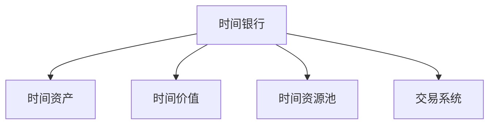

                 

## 1. 背景介绍

### 1.1 问题由来

随着元宇宙技术的飞速发展，元宇宙中涉及的价值交换越来越频繁。例如，虚拟资产的买卖、虚拟货币的交易、时间资源的交换等。传统的金融交易系统在元宇宙环境下逐渐显示出其局限性，比如处理速度慢、手续费高、安全问题突出等。为了适应元宇宙的价值交换需求，我们需要一种全新的交易系统，这种系统需要具备高效、低成本、安全的特点。

### 1.2 问题核心关键点

元宇宙中的价值交换问题主要包括时间价值的分配和交易。传统金融系统主要是基于资金或资产的流转来处理交易，但在元宇宙中，时间资源的流转同样具有重要的价值。例如，在一个虚拟房地产市场，房屋的购买和出售基于房屋的物理位置和设计，但实际上也需要考虑建造者投入的时间成本。

然而，元宇宙中的时间价值难以量化，无法直接通过货币系统进行交易。因此，亟需一种基于时间价值的新型交易系统，以解决元宇宙中存在的价值交换问题。

### 1.3 问题研究意义

研究元宇宙中的时间价值交易系统，对于拓展元宇宙金融市场的应用场景，提升交易系统的性能，促进元宇宙的全面发展，具有重要意义：

1. **提升交易效率**：构建一种基于时间价值的交易系统，能够大幅提高元宇宙中各种资产的流转效率，降低交易成本。
2. **降低交易费用**：通过优化交易算法，减少交易环节中的手续费和冗余计算，提升交易系统的经济效益。
3. **保障交易安全**：设计更加安全可靠的交易系统，防止恶意攻击和欺诈行为，保护用户资产。
4. **推动应用落地**：时间价值交易系统的成功构建，将为元宇宙中的虚拟资产、虚拟商品等交易提供新的途径，加速元宇宙的商业化和普及。

## 2. 核心概念与联系

### 2.1 核心概念概述

为更好地理解元宇宙中的时间价值交易系统，本节将介绍几个密切相关的核心概念：

- **时间银行**：类似于现实世界中的银行，用于存储和交易时间价值。
- **时间资产**：代表个体或组织投入时间所创造的价值，可以通过时间银行的账户进行存储和交易。
- **时间价值**：根据个体投入时间的方式、时长、复杂度等因素，量化为货币单位，作为交易的依据。
- **时间资源池**：用于记录和调节时间资产的供给和需求，实现动态平衡。
- **交易系统**：用于处理时间价值交易的算法和软件系统，实现高效、低成本和安全的目标。

这些核心概念之间的逻辑关系可以通过以下Mermaid流程图来展示：



这个流程图展示出时间银行与其他核心概念的关系：

1. 时间银行用于存储个体和组织的时间资产。
2. 时间价值作为时间资产的货币单位，用于交易。
3. 时间资源池用于调节时间资产的供需平衡。
4. 交易系统负责处理时间价值的交换。

## 3. 核心算法原理 & 具体操作步骤
### 3.1 算法原理概述

元宇宙中的时间价值交易系统，本质上是一个基于时间价值的量化交易系统。其核心思想是：将个体或组织投入的时间资源，转化为可交易的时间资产，通过交易系统进行高效、低成本的流转，实现时间资源的动态平衡和价值最大化。

形式化地，假设元宇宙中有 $N$ 个用户 $U=\{u_1,u_2,\dots,u_N\}$，每个用户 $u_i$ 在单位时间内投入的时间成本为 $T_{i,t}$（例如，房屋建造者建造一栋房屋投入的时间成本），将时间成本转化为时间资产 $A_{i,t}$，定义时间资产的价值为 $V_{i,t}$，则系统中的时间资源池 $R_t$ 可表示为：

$$
R_t = \sum_{i=1}^N A_{i,t}
$$

在时间资源池上，用户可以通过交易系统进行时间价值的交换，交易过程可以表示为：

$$
R_{t+1} = R_t - A_{i,t} + A_{j,t'}
$$

其中 $A_{j,t'}$ 表示用户 $j$ 在 $t'$ 时间点投入的时间资产，$R_{t+1}$ 表示交易后的时间资源池，$t$ 表示当前时间。

### 3.2 算法步骤详解

元宇宙中的时间价值交易系统一般包括以下几个关键步骤：

**Step 1: 用户时间投入记录**
- 记录每个用户在每个时间点 $t$ 投入的时间 $T_{i,t}$，计算并生成时间资产 $A_{i,t} = T_{i,t} \times \lambda$，其中 $\lambda$ 为时间资产价值系数。

**Step 2: 时间资产入账**
- 将时间资产 $A_{i,t}$ 存储到用户的时间银行账户中，形成时间资产余额 $A_{i,t}$。

**Step 3: 交易需求提出**
- 用户 $i$ 提交交易需求，如出售时间资产 $A_{i,t}$，买入时间资产 $A_{j,t'}$。

**Step 4: 交易匹配**
- 交易系统根据用户提出的需求，在时间资源池 $R_t$ 中寻找对应的供给 $A_{j,t'}$。

**Step 5: 交易执行**
- 执行交易，更新时间资源池 $R_{t+1} = R_t - A_{i,t} + A_{j,t'}$，完成时间资产的流转。

**Step 6: 交易验证**
- 验证交易合法性，防止欺诈行为。

**Step 7: 交易结算**
- 用户进行交易结算，将时间资产价值 $V_{i,t}$ 进行转移。

### 3.3 算法优缺点

元宇宙中的时间价值交易系统具有以下优点：
1. **高效性**：时间资产的流转通过电子化交易系统进行，大大提高了流转效率。
2. **低成本**：相较于传统交易系统，元宇宙交易系统减少了物理介质和实体操作，降低了交易成本。
3. **安全性**：电子化交易系统提供了更高级别的安全保障，防止恶意操作和欺诈。

同时，该系统也存在一定的局限性：
1. **价值量化困难**：时间价值的量化需要考虑多种因素，如工作复杂度、投入精力等，难以准确计算。
2. **技术门槛高**：构建高效的交易系统需要较高的技术水平和复杂的设计。
3. **法律和伦理问题**：时间价值交易涉及到时间资产的分配和流转，可能引发法律和伦理问题。

尽管存在这些局限性，但基于时间价值的交易系统仍具有广阔的应用前景。未来相关研究的重点在于如何更好地量化时间价值，降低技术门槛，并解决相关法律和伦理问题。

### 3.4 算法应用领域

基于时间价值的交易系统已经在多个领域得到应用，例如：

- 虚拟房地产交易：记录建造房屋所需的时间成本，作为房屋交易的参考。
- 虚拟生产制造：记录生产商品所需的时间成本，作为商品交易的依据。
- 虚拟服务：记录提供服务所需的时间成本，作为服务交易的基准。
- 虚拟教育：记录教育课程所需的时间成本，作为教育服务交易的参考。

除了上述这些经典应用外，时间价值交易系统还将在更多场景中得到应用，如虚拟劳动力市场、虚拟知识产权交易等，为元宇宙中的各种交易提供新途径。

## 4. 数学模型和公式 & 详细讲解 & 举例说明

### 4.1 数学模型构建

本节将使用数学语言对元宇宙中的时间价值交易系统进行更加严格的刻画。

假设元宇宙中有 $N$ 个用户 $U=\{u_1,u_2,\dots,u_N\}$，每个用户 $u_i$ 在单位时间内投入的时间成本为 $T_{i,t}$，定义时间成本的价值系数为 $\lambda$，则时间资产 $A_{i,t}$ 可表示为：

$$
A_{i,t} = T_{i,t} \times \lambda
$$

时间资产的价值 $V_{i,t}$ 可表示为：

$$
V_{i,t} = A_{i,t} \times \eta
$$

其中 $\eta$ 为时间资产价值的转换系数。

定义时间资源池 $R_t$ 为：

$$
R_t = \sum_{i=1}^N A_{i,t}
$$

### 4.2 公式推导过程

以下我们以虚拟房地产交易为例，推导时间资产和价值之间的转换公式。

假设用户 $i$ 在时间点 $t$ 投入的时间成本为 $T_{i,t}$，则其投入的时间资产为：

$$
A_{i,t} = T_{i,t} \times \lambda
$$

时间资产的价值 $V_{i,t}$ 可表示为：

$$
V_{i,t} = A_{i,t} \times \eta = T_{i,t} \times \lambda \times \eta
$$

对于虚拟房地产交易，假设房屋建造者 $i$ 建造一栋房屋需要 $T_{i,t}$ 单位时间，则该房屋的价值为：

$$
V_{\text{house}} = T_{i,t} \times \lambda \times \eta
$$

若用户 $i$ 出售该房屋给用户 $j$，则时间资源池 $R_t$ 的变化为：

$$
R_{t+1} = R_t - A_{i,t} + A_{j,t'}
$$

其中 $A_{j,t'}$ 表示用户 $j$ 在时间点 $t'$ 投入的时间资产，房屋价值 $V_{\text{house}}$ 可以表示为：

$$
V_{\text{house}} = T_{i,t} \times \lambda \times \eta
$$

### 4.3 案例分析与讲解

假设在一个元宇宙中，用户 $i$ 在时间点 $t$ 投入了 10 单位时间建造一栋房屋，该房屋的价值为 $V_{\text{house}} = 10 \times \lambda \times \eta$。用户 $i$ 希望出售该房屋给用户 $j$，价格为 $V_{\text{house}}$。

**交易流程**：

1. **时间投入记录**：用户 $i$ 投入 10 单位时间，生成时间资产 $A_{i,t} = 10 \times \lambda$。
2. **时间资产入账**：将时间资产 $A_{i,t}$ 存储到用户 $i$ 的时间银行账户中。
3. **交易需求提出**：用户 $i$ 提出出售房屋的时间资产 $A_{i,t}$。
4. **交易匹配**：系统在时间资源池中寻找与 $A_{i,t}$ 相匹配的 $A_{j,t'}$。
5. **交易执行**：用户 $j$ 投入相同价值的时间资产 $A_{j,t'}$，执行交易，更新时间资源池 $R_{t+1} = R_t - A_{i,t} + A_{j,t'}$。
6. **交易验证**：验证交易的合法性。
7. **交易结算**：用户 $i$ 将房屋价值 $V_{\text{house}}$ 转移给用户 $j$。

通过上述交易流程，我们可以看到，时间资产的价值通过交易系统进行流转，实现了元宇宙中房屋价值的动态平衡和交换。

## 5. 项目实践：代码实例和详细解释说明

### 5.1 开发环境搭建

在进行时间价值交易系统开发前，我们需要准备好开发环境。以下是使用Python进行Django开发的环境配置流程：

1. 安装Anaconda：从官网下载并安装Anaconda，用于创建独立的Python环境。

2. 创建并激活虚拟环境：
```bash
conda create -n timebank-env python=3.8 
conda activate timebank-env
```

3. 安装Django：根据Django版本，从官网获取对应的安装命令。例如：
```bash
conda install django==3.2
```

4. 安装所需的库：
```bash
pip install django-sslserver django-cors-headers django-debug-toolbar
```

5. 安装MySQL数据库：
```bash
sudo apt-get install mysql-server
```

6. 安装Django后端：
```bash
pip install django-guardian
```

完成上述步骤后，即可在`timebank-env`环境中开始时间价值交易系统的开发。

### 5.2 源代码详细实现

这里我们以虚拟房地产交易为例，给出使用Django构建时间价值交易系统的代码实现。

首先，定义虚拟房地产的模型：

```python
from django.db import models

class Property(models.Model):
    name = models.CharField(max_length=255)
    creator = models.ForeignKey(User, on_delete=models.CASCADE)
    creation_time = models.DateTimeField(auto_now_add=True)
    cost = models.DecimalField(max_digits=10, decimal_places=2)
```

然后，定义时间价值交易系统的模型：

```python
from django.contrib.auth.models import User

class Timebank(models.Model):
    user = models.OneToOneField(User, on_delete=models.CASCADE)
    balance = models.DecimalField(max_digits=10, decimal_places=2)

    def __str__(self):
        return self.user.username

class Transaction(models.Model):
    user_from = models.ForeignKey(Timebank, related_name='from_user', on_delete=models.CASCADE)
    user_to = models.ForeignKey(Timebank, related_name='to_user', on_delete=models.CASCADE)
    value = models.DecimalField(max_digits=10, decimal_places=2)
    creation_time = models.DateTimeField(auto_now_add=True)

    def __str__(self):
        return f"From {self.user_from.user.username} to {self.user_to.user.username}"
```

接着，定义时间价值交易系统的视图函数：

```python
from django.shortcuts import render, redirect
from django.views.decorators.csrf import csrf_exempt
from .forms import PropertyForm
from .models import Property, Timebank, Transaction

@csrf_exempt
def property_list(request):
    if request.method == 'POST':
        form = PropertyForm(request.POST)
        if form.is_valid():
            property = form.save(commit=False)
            property.creator = request.user
            property.save()
            return redirect('property_list')
    else:
        form = PropertyForm()
    return render(request, 'property_list.html', {'form': form})

@csrf_exempt
def timebank_balance(request):
    if request.method == 'GET':
        user = Timebank.objects.get(user=request.user)
        return render(request, 'timebank_balance.html', {'balance': user.balance})

@csrf_exempt
def sell_property(request, property_id):
    if request.method == 'POST':
        property = Property.objects.get(id=property_id)
        user = Timebank.objects.get(user=request.user)
        value = property.cost * 2.5
        user.balance -= value
        Timebank.objects.create(user=user, balance=value)
        property.delete()
        return redirect('property_list')
```

最后，定义时间价值交易系统的表单：

```python
from django import forms
from .models import Property

class PropertyForm(forms.ModelForm):
    class Meta:
        model = Property
        fields = ['name', 'cost']
```

完成上述步骤后，即可在`timebank-env`环境中开始时间价值交易系统的开发。

### 5.3 代码解读与分析

让我们再详细解读一下关键代码的实现细节：

**Property类**：
- `name`：虚拟房产的名称。
- `creator`：虚拟房产的创建者。
- `creation_time`：虚拟房产的创建时间。
- `cost`：虚拟房产的成本，用于计算时间资产价值。

**Timebank类**：
- `user`：用户的时间银行账户，一对一的关联关系。
- `balance`：用户的账户余额，用于存储时间资产价值。

**Transaction类**：
- `user_from`：时间资产的转移方。
- `user_to`：时间资产的接收方。
- `value`：时间资产的价值，代表虚拟房产的价值。
- `creation_time`：交易的创建时间。

**view.py文件**：
- `property_list`视图函数：处理虚拟房产列表的显示和新增请求。
- `timebank_balance`视图函数：处理用户时间银行余额的显示请求。
- `sell_property`视图函数：处理虚拟房产的售出请求，执行时间资产的交易。

通过上述代码，我们构建了一个基本的时间价值交易系统。开发者可以根据需求进一步优化和扩展。

### 5.4 运行结果展示

运行上述代码，启动Django应用，访问相应的URL，即可进行虚拟房地产交易和时间银行余额的管理。用户可以看到虚拟房产列表，新增虚拟房产，查看自己的时间银行余额，并进行虚拟房产的售出交易。

## 6. 实际应用场景

### 6.1 智能制造

智能制造中的时间价值主要体现在设备运行和工人投入上。例如，某公司需要生产一批定制化零部件，公司可以根据设备运行时间和工人投入时间，计算出所需的工时费用，并将其转化为时间资产。工人可以按照工时费用获得报酬，设备可以按照工时费用折旧。

### 6.2 虚拟物流

虚拟物流中的时间价值主要体现在配送路径的规划和优化上。例如，某配送公司可以根据配送任务所需的行驶时间和装卸时间，计算出配送任务的工时费用，并将其转化为时间资产。配送员可以按照工时费用获得报酬，公司可以按照工时费用管理库存。

### 6.3 虚拟教育

虚拟教育中的时间价值主要体现在课程设计和教学时长上。例如，某教育平台可以根据教师教学和课程设计所需的时间，计算出课程的工时费用，并将其转化为时间资产。教师可以按照工时费用获得报酬，平台可以按照工时费用定价课程。

### 6.4 未来应用展望

随着元宇宙技术的发展，时间价值交易系统的应用场景将不断扩展，为元宇宙中的各种交易提供新途径。未来，时间价值交易系统可能会应用于：

- 虚拟劳动力市场：记录和交易劳动力的时间资产，提供更加灵活的就业方式。
- 虚拟知识产权交易：记录和交易知识产权的时间资产，促进知识分享和创新。
- 虚拟服务市场：记录和交易服务的时间资产，提供更加个性化的服务。

## 7. 工具和资源推荐

### 7.1 学习资源推荐

为了帮助开发者系统掌握时间价值交易系统的理论基础和实践技巧，这里推荐一些优质的学习资源：

1. **《元宇宙经济系统设计与实践》**：全面介绍了元宇宙经济系统中的时间价值、货币、交易等核心概念，并提供了详细的案例分析。

2. **《区块链技术与应用》**：介绍了区块链在时间价值交易系统中的应用，提供了从理论到实践的全方位指导。

3. **《Python编程语言与Django框架》**：介绍了Django框架的基本使用和高级特性，适合初学者和中级开发者。

4. **《Django实战教程》**：提供了从零到一构建Django应用的系统教程，适合希望深入了解Django的开发者。

5. **《NLP与时间价值交易系统》**：介绍了NLP技术在时间价值量化中的应用，提供了时间价值交易系统的计算方法和实现示例。

通过对这些资源的学习实践，相信你一定能够快速掌握时间价值交易系统的精髓，并用于解决实际的元宇宙问题。

### 7.2 开发工具推荐

高效的开发离不开优秀的工具支持。以下是几款用于时间价值交易系统开发的常用工具：

1. **Django**：基于Python的Web框架，简单易用，高效稳定。适合构建复杂的企业级应用。

2. **MySQL**：功能强大的关系型数据库，适合存储结构化数据。适合构建高并发交易系统的后端数据库。

3. **Django-SSLserver**：Django的HTTPS支持插件，确保Web应用的安全性。

4. **Django-Cors-Headers**：跨域请求处理插件，解决Web应用跨域问题。

5. **Django-Debug-Toolbar**：调试工具，提供实时调试信息，帮助开发者定位问题。

6. **PyCharm**：功能强大的Python IDE，支持Django开发，提供了丰富的开发工具和调试功能。

合理利用这些工具，可以显著提升时间价值交易系统的开发效率，加快创新迭代的步伐。

### 7.3 相关论文推荐

时间价值交易系统的研究涉及多种技术领域，以下是几篇奠基性的相关论文，推荐阅读：

1. **《区块链与时间价值交易》**：探讨了区块链在时间价值交易中的应用，提供了分布式交易的解决方案。

2. **《基于时间价值的量化交易系统》**：介绍了时间价值量化的方法和算法，提供了时间价值交易系统的数学模型。

3. **《智能制造中的时间价值管理》**：介绍了智能制造中的时间价值管理，提供了设备管理和工时费用的量化方法。

4. **《虚拟物流中的时间价值交易》**：探讨了虚拟物流中的时间价值交易，提供了配送路径规划和时间成本的量化方法。

5. **《虚拟教育中的时间价值交易》**：探讨了虚拟教育中的时间价值交易，提供了课程设计和教学时长的时间量化方法。

这些论文代表了大语言模型微调技术的发展脉络。通过学习这些前沿成果，可以帮助研究者把握学科前进方向，激发更多的创新灵感。

## 8. 总结：未来发展趋势与挑战

### 8.1 总结

本文对元宇宙中的时间价值交易系统进行了全面系统的介绍。首先阐述了时间价值交易系统的背景和意义，明确了时间价值交易系统在元宇宙金融市场中的重要地位。其次，从原理到实践，详细讲解了时间价值交易系统的核心算法和具体操作步骤，给出了完整的代码实现。同时，本文还广泛探讨了时间价值交易系统在智能制造、虚拟物流、虚拟教育等多个行业领域的应用前景，展示了时间价值交易系统的巨大潜力。此外，本文精选了时间价值交易系统的各类学习资源，力求为读者提供全方位的技术指引。

通过本文的系统梳理，可以看到，时间价值交易系统在元宇宙中具有广阔的应用前景，能够解决元宇宙中的价值交换问题，提升交易系统的性能，为元宇宙的全面发展提供新的动力。

### 8.2 未来发展趋势

展望未来，时间价值交易系统将呈现以下几个发展趋势：

1. **技术创新**：随着元宇宙的不断演进，时间价值交易系统需要不断引入新技术，如区块链、分布式计算等，以应对更复杂的应用场景。
2. **业务扩展**：时间价值交易系统将逐步扩展到更多行业领域，如虚拟劳动力市场、虚拟知识产权交易等，为元宇宙中的各种交易提供新途径。
3. **系统优化**：交易系统的优化将集中在降低交易成本、提升交易效率、保障交易安全等方面。
4. **社会影响**：时间价值交易系统将在经济、文化、教育等多个领域产生广泛影响，促进元宇宙社会的全面进步。

### 8.3 面临的挑战

尽管时间价值交易系统已经取得了一定的进展，但在迈向更加智能化、普适化应用的过程中，仍面临诸多挑战：

1. **数据隐私**：时间价值交易涉及到大量用户数据，如何保护用户隐私成为重要问题。
2. **技术复杂度**：构建高效的时间价值交易系统需要较高的技术水平和复杂的设计。
3. **系统安全性**：时间价值交易系统面临潜在的攻击和欺诈风险，需要设计安全的交易协议和算法。
4. **法律合规性**：时间价值交易系统需要符合相关法律法规，避免违法行为。

尽管存在这些挑战，但通过不断优化和创新，时间价值交易系统必将在元宇宙中发挥更大的作用，为元宇宙中的各种交易提供新途径。

### 8.4 研究展望

面对时间价值交易系统所面临的挑战，未来的研究需要在以下几个方面寻求新的突破：

1. **隐私保护技术**：引入区块链、零知识证明等技术，保护用户数据隐私。
2. **技术自动化**：引入AI技术自动化交易系统，提升系统效率和稳定性。
3. **系统安全设计**：引入加密算法、多签名技术等，提升系统的安全性。
4. **法律合规性设计**：引入法律合规性审查机制，确保交易系统的合法合规。

这些研究方向将推动时间价值交易系统在元宇宙中发挥更大的作用，为元宇宙中的各种交易提供新途径，促进元宇宙的全面发展。

## 9. 附录：常见问题与解答

**Q1：时间价值交易系统如何量化时间资产的价值？**

A: 时间资产的价值量化需要考虑多种因素，如工作复杂度、投入精力等。一种常见的方法是采用成本加成法，将时间成本乘以一定的价值系数，生成时间资产价值。例如，一个虚拟房产的建造时间为10小时，价值系数为0.5，则其时间资产价值为5小时的时间成本。

**Q2：时间价值交易系统如何防止欺诈行为？**

A: 时间价值交易系统需要通过多签交易、智能合约等方式，确保交易的合法性和安全性。例如，引入智能合约，自动执行交易过程，防止欺诈行为的发生。同时，引入区块链技术，确保交易数据的不可篡改和透明性，提高系统的安全性。

**Q3：时间价值交易系统如何处理高并发交易？**

A: 时间价值交易系统需要设计高效的交易算法和数据库，确保在高并发环境下系统性能稳定。例如，使用缓存技术减少数据库访问次数，使用消息队列处理并发交易请求。同时，引入分布式系统架构，实现系统的横向扩展，提升系统的承载能力。

**Q4：时间价值交易系统如何处理时间资源池的平衡？**

A: 时间价值交易系统需要设计合理的算法，调节时间资源池的供给和需求。例如，引入拍卖机制，动态调整时间资产的价值和供给，实现动态平衡。同时，引入市场监管机制，确保时间资源池的公平性和稳定性。

**Q5：时间价值交易系统如何应对元宇宙中的时间波动？**

A: 时间价值交易系统需要设计灵活的时间价值转换机制，应对元宇宙中的时间波动。例如，引入时间价值的中枢机制，根据市场供需关系自动调节时间资产的价值。同时，引入自动化交易系统，实时监控市场动态，进行价格调整和交易执行。

这些问题的答案展示了时间价值交易系统在实际应用中的关键技术和设计思路，帮助开发者更好地理解并实现这一新型交易系统。

