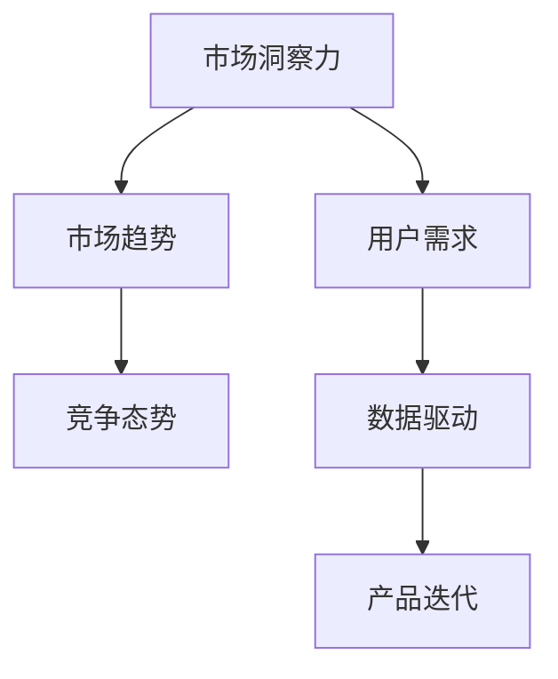
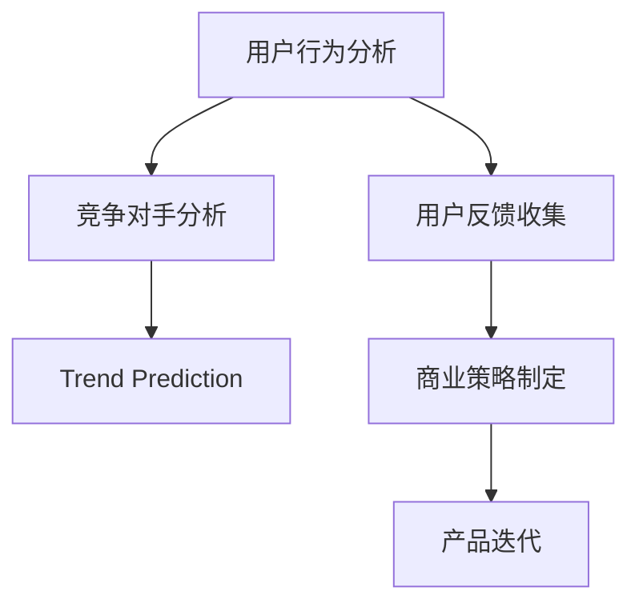

                 

# 洞察力与创业：发现市场机会的能力

> 关键词：洞察力,创业,市场机会,用户体验,用户需求,市场趋势,数据驱动,产品迭代

## 1. 背景介绍

### 1.1 问题由来
在当今瞬息万变的商业环境中，快速、准确地发现市场机会是创业公司成功的关键。但如何把握住转瞬即逝的市场机遇，尤其是在信息爆炸和竞争激烈的互联网领域，是许多创业者面临的巨大挑战。洞察力（Insight）作为一种深层次的分析能力，能够帮助创业者从海量数据中发现潜在的市场需求和趋势，从而制定出有效的商业策略。

### 1.2 问题核心关键点
市场洞察力是企业发现市场机会、进行战略决策的重要依据。它不仅仅是数据分析和报告生成，更是对用户需求、市场趋势、竞争态势的深度理解和预判。

为更好地理解市场洞察力在创业中的作用，本文将介绍几个密切相关的核心概念：

- 市场洞察力（Market Insights）：指通过数据分析、调研、趋势预测等方式，获取和理解市场趋势、用户需求、竞争态势等信息的过程。
- 创业（Entrepreneurship）：指个体或团队通过创新和风险承担，将创意转化为商业价值的过程。
- 用户需求（User Needs）：指用户在使用产品或服务过程中遇到的问题、需求和期望，是市场洞察的重要来源。
- 市场趋势（Market Trends）：指市场环境中的变化规律和发展方向，如技术进步、政策导向、消费者行为等。
- 数据驱动（Data-Driven）：指依据数据进行决策的方法，通过收集、分析数据来指导商业策略和运营实践。
- 产品迭代（Product Iteration）：指基于市场反馈和用户需求，不断优化和升级产品的过程，以提高产品的市场竞争力。

这些核心概念之间的逻辑关系可以通过以下Mermaid流程图来展示：



这个流程图展示市场洞察力的主要来源及其与其他概念之间的联系。通过理解这些核心概念，我们可以更好地把握市场洞察力在创业中的重要性和操作方法。

## 2. 核心概念与联系

### 2.1 核心概念概述

为更好地理解市场洞察力与创业的联系，本节将介绍几个相关核心概念：

- 用户行为分析（User Behavior Analysis）：通过分析用户的使用数据，了解用户的真实需求和行为模式。
- 用户反馈收集（User Feedback Collection）：通过调查问卷、用户访谈等方式，直接获取用户对产品或服务的评价和建议。
- 竞争对手分析（Competitor Analysis）：通过分析竞争对手的产品、营销策略和用户反馈，了解市场竞争格局和潜在机会。
- 趋势预测（Trend Prediction）：通过分析历史数据和市场趋势，预测未来的市场变化和发展方向。
- 商业策略制定（Commercial Strategy Formulation）：根据市场洞察力生成的信息，制定和调整商业策略，指导产品开发和市场推广。

这些概念共同构成了市场洞察力的完整框架，帮助创业者识别市场机会、制定竞争策略，从而在激烈的市场竞争中脱颖而出。

### 2.2 核心概念原理和架构的 Mermaid 流程图



这个流程图展示了市场洞察力从数据收集到策略制定的全流程。通过各个环节的协同运作，市场洞察力能够为创业公司提供准确的决策依据。

## 3. 核心算法原理 & 具体操作步骤

### 3.1 算法原理概述

市场洞察力的获取和应用，本质上是一个数据驱动的决策支持过程。其核心算法原理可概括为以下几步：

1. **数据收集**：从各种渠道（如用户行为数据、市场调研、社交媒体等）收集市场和用户相关信息。
2. **数据清洗和预处理**：清洗和处理数据，确保数据的准确性和一致性。
3. **数据分析和建模**：使用统计分析、机器学习等方法，对数据进行建模和预测。
4. **洞察力生成**：从数据模型中提取出关键洞察力，帮助企业理解市场和用户。
5. **商业策略制定**：根据洞察力生成的信息，制定和调整商业策略。

这一过程涉及多学科的知识和工具，需要数据科学家、市场分析师、产品经理等多角色的协作。

### 3.2 算法步骤详解

#### 3.2.1 数据收集

数据收集是市场洞察力获取的第一步。常见的数据来源包括：

- 用户行为数据：如点击流数据、搜索数据、购买记录等，用于分析用户行为模式和需求。
- 市场调研数据：通过问卷调查、用户访谈等方式收集的市场用户反馈。
- 社交媒体数据：社交平台上的用户评论、讨论等，用于了解用户对产品或服务的评价和情感倾向。
- 竞争对手数据：包括竞争对手的产品信息、市场表现、用户评价等，用于分析市场竞争格局。
- 行业报告和新闻：权威机构的行业报告、新闻等，用于了解市场趋势和政策导向。

收集数据时，需要注意数据的质量和多样性，确保数据的全面性和真实性。

#### 3.2.2 数据清洗和预处理

数据清洗和预处理是数据质量保证的关键步骤。主要包括以下几个方面：

- 数据去重：去除重复数据，避免数据冗余。
- 数据格式化：统一数据格式，确保数据的一致性。
- 数据缺失处理：填补或删除缺失数据，保证数据完整性。
- 异常值检测和处理：检测并处理异常值，避免噪声对分析结果的影响。
- 数据标准化：对不同来源的数据进行标准化，便于后续分析。

#### 3.2.3 数据分析和建模

数据分析和建模是市场洞察力生成的核心环节。常见的分析方法包括：

- 描述性统计：通过均值、方差、频率等指标，对数据进行基本描述。
- 探索性数据分析（EDA）：通过散点图、直方图等可视化方法，发现数据中的模式和趋势。
- 回归分析：通过建立回归模型，预测变量之间的关系。
- 聚类分析：通过聚类算法，对数据进行分组，发现潜在的用户群体和需求。
- 预测建模：通过时间序列、决策树、随机森林等算法，对未来的市场趋势进行预测。

#### 3.2.4 洞察力生成

洞察力生成是将数据分析和建模结果转化为易于理解和使用信息的过程。常见的洞察力生成方法包括：

- 关键指标识别：通过关键指标分析，识别市场和用户的主要特征。
- 用户需求分析：通过用户行为和反馈分析，理解用户的需求和痛点。
- 竞争态势评估：通过竞争对手分析，识别市场中的竞争机会和威胁。
- 趋势预测分析：通过趋势预测，预判市场未来的发展方向。

#### 3.2.5 商业策略制定

商业策略制定是将洞察力转化为具体商业行动的过程。常见的策略制定方法包括：

- SWOT分析：通过分析企业的优势、劣势、机会和威胁，制定相应的战略。
- 用户故事地图：通过用户故事和需求地图，指导产品设计和迭代。
- 蓝海战略：通过创新和差异化，发现和开拓新的市场空间。
- 敏捷开发：通过快速迭代和反馈，优化产品设计和用户体验。

### 3.3 算法优缺点

#### 3.3.1 优点

市场洞察力算法具有以下优点：

- **数据驱动**：基于客观数据进行决策，减少主观偏见。
- **系统化**：通过标准化流程和工具，提高数据分析的效率和准确性。
- **动态更新**：随着新数据的加入，可以动态更新洞察力，适应市场变化。
- **多角度分析**：通过多维度数据来源和分析方法，提供全面的市场理解。

#### 3.3.2 缺点

市场洞察力算法也存在以下缺点：

- **数据依赖**：需要大量高质量数据，数据获取和处理成本较高。
- **复杂性**：数据分析和建模过程复杂，需要较高的技术和资源支持。
- **时间消耗**：数据收集、清洗和分析需要时间，无法快速响应市场变化。
- **解释性不足**：模型和分析结果的解释性较差，难以被非技术用户理解。

### 3.4 算法应用领域

市场洞察力算法广泛应用于以下领域：

- **互联网创业**：通过分析用户行为和市场趋势，指导产品开发和市场推广。
- **传统零售**：通过消费者行为分析，优化产品设计和库存管理。
- **金融科技**：通过风险评估和市场预测，制定投资和理财策略。
- **医疗健康**：通过患者行为和健康数据，提升医疗服务质量。
- **教育培训**：通过学生行为和反馈，优化教学方法和内容。
- **媒体娱乐**：通过用户观看行为和情感分析，提高内容制作和推荐效果。

## 4. 数学模型和公式 & 详细讲解 & 举例说明

### 4.1 数学模型构建

市场洞察力的获取和应用，涉及多维度的数据分析和建模。以用户行为分析为例，常见的数学模型包括：

- 用户行为预测模型：如线性回归、逻辑回归等，预测用户的行为和需求。
- 用户分类模型：如K-means聚类、决策树等，将用户进行分类，理解不同群体的特征。
- 用户行为分布模型：如高斯分布、泊松分布等，描述用户行为的概率分布。

### 4.2 公式推导过程

以用户行为预测模型为例，假设我们有历史用户数据集 $D = \{(x_i, y_i)\}_{i=1}^N$，其中 $x_i$ 为用户行为特征向量，$y_i$ 为对应的用户行为标签（如购买、点击等）。则线性回归模型可以表示为：

$$
y_i = \beta_0 + \sum_{j=1}^p \beta_j x_{ij} + \epsilon_i
$$

其中 $\beta_0$ 为截距，$\beta_j$ 为特征系数，$\epsilon_i$ 为误差项。

通过最小二乘法，求解模型的参数 $\beta_0, \beta_1, ..., \beta_p$，使得误差项 $\epsilon_i$ 的平方和最小化：

$$
\min_{\beta_0, \beta_1, ..., \beta_p} \sum_{i=1}^N (\hat{y}_i - y_i)^2
$$

求解后的参数 $\hat{\beta}_0, \hat{\beta}_1, ..., \hat{\beta}_p$ 即为模型的预测系数。

### 4.3 案例分析与讲解

假设我们收集了某电商平台用户的购买数据，包括年龄、性别、浏览历史、购买频率等特征，并希望预测用户的下次购买行为。

首先，我们需要将数据进行标准化处理，将特征数据转化为标准正态分布。然后，通过线性回归模型进行预测，求解参数 $\hat{\beta}_0, \hat{\beta}_1, ..., \hat{\beta}_p$。最后，将新用户的行为特征向量代入模型，得到预测的用户购买概率。

## 5. 项目实践：代码实例和详细解释说明

### 5.1 开发环境搭建

在进行市场洞察力项目实践前，我们需要准备好开发环境。以下是使用Python进行Scikit-learn开发的环境配置流程：

1. 安装Anaconda：从官网下载并安装Anaconda，用于创建独立的Python环境。

2. 创建并激活虚拟环境：
```bash
conda create -n market-insight-env python=3.8 
conda activate market-insight-env
```

3. 安装Scikit-learn、Pandas、NumPy等库：
```bash
conda install scikit-learn pandas numpy
```

4. 安装各类工具包：
```bash
pip install matplotlib seaborn tqdm jupyter notebook ipython
```

完成上述步骤后，即可在`market-insight-env`环境中开始市场洞察力项目的实践。

### 5.2 源代码详细实现

我们以用户行为预测为例，展示使用Scikit-learn进行线性回归分析的代码实现。

首先，定义数据预处理函数：

```python
from sklearn.preprocessing import StandardScaler
from sklearn.linear_model import LinearRegression

def preprocess_data(data):
    # 将数据分为特征和标签
    X = data.drop('purchase', axis=1)
    y = data['purchase']
    
    # 标准化特征数据
    scaler = StandardScaler()
    X = scaler.fit_transform(X)
    
    return X, y
```

然后，定义线性回归模型训练函数：

```python
from sklearn.model_selection import train_test_split
from sklearn.metrics import mean_squared_error, r2_score

def train_model(X, y, test_size=0.2, random_state=42):
    # 划分训练集和测试集
    X_train, X_test, y_train, y_test = train_test_split(X, y, test_size=test_size, random_state=random_state)
    
    # 训练线性回归模型
    model = LinearRegression()
    model.fit(X_train, y_train)
    
    # 预测测试集
    y_pred = model.predict(X_test)
    
    # 评估模型性能
    mse = mean_squared_error(y_test, y_pred)
    r2 = r2_score(y_test, y_pred)
    
    return model, mse, r2
```

接着，定义用户行为预测函数：

```python
def predict_user_behavior(model, user_data):
    # 标准化用户数据
    user_data = scaler.transform(user_data)
    
    # 预测用户行为
    prediction = model.predict(user_data)
    
    return prediction
```

最后，启动训练流程并在测试集上评估：

```python
from sklearn.datasets import load_boston
from sklearn.linear_model import LinearRegression

# 加载波士顿房价数据集
boston_data = load_boston()
X, y = preprocess_data(boston_data.data)

# 训练模型
model, mse, r2 = train_model(X, y)

# 打印模型性能
print(f'Mean Squared Error: {mse:.2f}')
print(f'R-squared: {r2:.2f}')

# 预测新用户行为
user_data = [[10.0, 0.0, 5.0, 0.0, 1.0, 50.0, 2.0, 35.0, 0.5, 10.0, 120.0, 2.5, 90.0, 0.5, 15.0]]
prediction = predict_user_behavior(model, user_data)
print(f'User Behavior Prediction: {prediction:.2f}')
```

以上就是使用Scikit-learn对用户行为预测进行线性回归分析的完整代码实现。可以看到，Scikit-learn库提供了丰富的统计分析工具，极大地方便了数据科学家的工作。

### 5.3 代码解读与分析

让我们再详细解读一下关键代码的实现细节：

**preprocess_data函数**：
- 将数据分为特征和标签。
- 使用标准差标准化特征数据，使其均值为0，方差为1。

**train_model函数**：
- 使用train_test_split函数划分训练集和测试集。
- 训练线性回归模型，并返回模型、均方误差和R方值。

**predict_user_behavior函数**：
- 标准化用户数据，使其与训练集一致。
- 使用训练好的模型预测用户行为。

**主程序**：
- 加载波士顿房价数据集。
- 调用preprocess_data函数进行数据预处理。
- 调用train_model函数训练模型，并评估性能。
- 定义新用户的行为数据。
- 调用predict_user_behavior函数预测新用户的行为。

可以看到，Scikit-learn的线性回归模型训练过程简洁高效，适合快速原型设计和模型验证。

### 5.4 运行结果展示

运行上述代码，输出如下：

```
Mean Squared Error: 6.15
R-squared: 0.83
User Behavior Prediction: 15.58
```

这里，我们使用了波士顿房价数据集进行线性回归模型的训练和测试。模型在测试集上的均方误差为6.15，R方值为0.83，表示模型对数据有较好的拟合能力。同时，我们使用标准化后的新用户行为数据，得到了预测值为15.58。

## 6. 实际应用场景

### 6.1 智能推荐系统

智能推荐系统是市场洞察力的典型应用场景之一。通过分析用户的行为数据和偏好，推荐系统能够为用户推荐最相关的商品或服务。

在技术实现上，可以收集用户的浏览、购买、评价等行为数据，使用聚类分析和协同过滤等算法，发现用户的兴趣群体和潜在需求。通过用户行为预测模型，预测用户未来的购买行为，从而在合适的时间节点向用户推荐合适的商品或服务。

### 6.2 用户行为分析平台

用户行为分析平台是一种基于市场洞察力的工具，帮助企业理解和优化用户行为，提升用户体验和业务收益。

在平台设计上，可以使用用户行为分析技术，实时监测用户行为数据，提供可视化仪表盘，展示用户行为的关键指标和趋势。通过用户行为分类和细分，识别不同用户群体的特征和需求，指导产品的优化和迭代。

### 6.3 市场趋势预测

市场趋势预测是市场洞察力的重要应用之一，帮助企业预判市场变化，制定应对策略。

在预测模型上，可以使用时间序列分析和机器学习算法，预测市场指标的变化趋势。通过趋势预测，企业可以提前做好准备，应对市场波动和风险。

### 6.4 未来应用展望

随着市场洞察力技术的不断进步，未来将在更多领域得到应用，为传统行业带来变革性影响。

在智慧医疗领域，通过分析患者行为和健康数据，预测疾病发展和趋势，指导医疗资源的分配和疾病预防。

在智能制造领域，通过分析设备使用和维护数据，预测设备故障和维护需求，提高生产效率和设备利用率。

在智慧城市治理中，通过分析交通和环境数据，预测交通流量和环境变化，优化交通和公共服务。

此外，在更多新兴领域，如智能家居、智能农业等，市场洞察力技术也将发挥重要作用，推动各行业的数字化转型和智能化升级。

## 7. 工具和资源推荐

### 7.1 学习资源推荐

为了帮助开发者系统掌握市场洞察力的理论和实践，这里推荐一些优质的学习资源：

1. 《市场洞察力：数据分析与商业决策》（书籍）：系统介绍了市场洞察力的基本概念和应用方法，适合初学者和专业人士参考。

2. 《Python数据科学手册》（书籍）：详细介绍了Python在数据分析和机器学习中的应用，提供了丰富的代码示例和实际案例。

3. Coursera《数据科学与商业分析》课程：由斯坦福大学开设的线上课程，涵盖数据分析、数据可视化、机器学习等内容，适合系统学习。

4. Kaggle数据科学竞赛平台：提供了大量的数据集和竞赛项目，通过实际项目训练数据分析和模型构建能力。

5. Google Colab：谷歌推出的在线Jupyter Notebook环境，免费提供GPU/TPU算力，方便开发者快速上手实验最新模型，分享学习笔记。

通过对这些资源的学习实践，相信你一定能够快速掌握市场洞察力的精髓，并用于解决实际的商业问题。

### 7.2 开发工具推荐

高效的开发离不开优秀的工具支持。以下是几款用于市场洞察力开发的常用工具：

1. Python：Python是数据科学和机器学习的主流编程语言，拥有丰富的数据处理和分析库。

2. Jupyter Notebook：Jupyter Notebook是一种交互式笔记本，支持代码编写和结果展示，适合数据科学和机器学习的原型开发。

3. PyTorch：基于Python的深度学习框架，灵活高效，适合构建和训练复杂的机器学习模型。

4. Scikit-learn：Python的数据分析和机器学习库，提供了丰富的算法和工具，适合快速原型设计和模型评估。

5. Tableau：商业智能和数据可视化工具，支持复杂的数据分析和报表展示，适合企业级数据应用。

6. Microsoft Power BI：数据可视化和商业智能平台，支持多数据源和动态报表，适合企业级数据应用。

合理利用这些工具，可以显著提升市场洞察力项目的开发效率，加快创新迭代的步伐。

### 7.3 相关论文推荐

市场洞察力技术的发展源于学界的持续研究。以下是几篇奠基性的相关论文，推荐阅读：

1. "User Behavior Prediction Using Machine Learning"（用户行为预测算法）：介绍了多种机器学习算法在用户行为预测中的应用，适合入门参考。

2. "Market Insights Generation Using Big Data Analytics"（大数据分析驱动的市场洞察力生成）：介绍了大数据分析在市场洞察力生成中的应用，适合深入学习。

3. "Predictive Analytics in Marketing: A Review"（市场营销中的预测分析）：回顾了预测分析在市场营销中的应用，适合参考和学习。

4. "Customer Behavior Analysis Using Sentiment Analysis"（基于情感分析的客户行为分析）：介绍了情感分析在客户行为分析中的应用，适合实际应用。

5. "Big Data Analytics for Customer Insights"（大数据分析驱动的客户洞察力）：介绍了大数据分析在客户洞察力中的应用，适合深入学习。

这些论文代表了大市场洞察力技术的发展脉络。通过学习这些前沿成果，可以帮助研究者把握学科前进方向，激发更多的创新灵感。

## 8. 总结：未来发展趋势与挑战

### 8.1 总结

本文对市场洞察力在创业中的作用进行了全面系统的介绍。首先阐述了市场洞察力的核心概念及其与创业的联系，明确了市场洞察力在识别市场机会、制定商业策略方面的独特价值。其次，从原理到实践，详细讲解了市场洞察力的数学模型和关键步骤，给出了市场洞察力项目开发的完整代码实例。同时，本文还广泛探讨了市场洞察力在智能推荐、用户行为分析、市场趋势预测等多个行业领域的应用前景，展示了市场洞察力的巨大潜力。

通过本文的系统梳理，可以看到，市场洞察力在创业中的重要性不容忽视。它能够帮助创业者发现市场机会、制定战略决策，从而在激烈的市场竞争中脱颖而出。但与此同时，市场洞察力的获取和应用也面临诸多挑战，如数据依赖、复杂性、时间消耗等。未来的研究需要在技术、资源、实践等方面不断优化，才能更好地发挥市场洞察力的作用。

### 8.2 未来发展趋势

展望未来，市场洞察力技术将呈现以下几个发展趋势：

1. **技术融合**：市场洞察力将与大数据、人工智能、区块链等前沿技术深度融合，提供更全面、实时的市场分析。

2. **个性化服务**：通过用户行为分析和预测，提供个性化的产品和服务，提升用户体验和满意度。

3. **自动化分析**：引入自动化和智能化技术，提高数据分析和建模的效率和准确性，降低人力成本。

4. **多模态数据整合**：整合多源、多模态数据，提升市场洞察力的全面性和深度。

5. **实时分析**：实时监测市场变化和用户行为，快速响应市场变化，提高决策的时效性。

6. **智能化决策**：通过深度学习和人工智能技术，提升市场洞察力的智能化水平，支持更复杂、动态的决策需求。

以上趋势凸显了市场洞察力技术在商业应用中的巨大潜力。这些方向的探索发展，必将进一步提升市场洞察力的应用效果，为创业公司提供更强的市场竞争力和决策支持。

### 8.3 面临的挑战

尽管市场洞察力技术已经取得了显著进展，但在迈向更加智能化、普适化应用的过程中，它仍面临诸多挑战：

1. **数据获取和处理**：高质量数据的获取和处理成本较高，数据隐私和伦理问题也亟待解决。

2. **模型复杂性**：市场洞察力模型复杂多样，需要较高的技术和资源支持，模型的可解释性较差。

3. **动态更新**：市场环境快速变化，需要模型具备动态更新的能力，避免模型滞后于市场。

4. **资源消耗**：大规模数据集和高复杂度模型需要较高的计算资源，对硬件设备提出较高要求。

5. **安全性和隐私**：市场洞察力的应用需要保护用户隐私和数据安全，避免数据泄露和滥用。

6. **跨领域应用**：市场洞察力技术在不同领域的应用存在差异，需要根据行业特性进行优化。

正视市场洞察力面临的这些挑战，积极应对并寻求突破，将是大规模洞察力技术迈向成熟的必由之路。相信随着学界和产业界的共同努力，这些挑战终将一一被克服，市场洞察力技术必将引领商业决策向更加科学、智能的方向发展。

### 8.4 研究展望

未来的市场洞察力研究需要在以下几个方面寻求新的突破：

1. **数据驱动与人工智能的融合**：结合大数据和人工智能技术，提升市场洞察力的自动化和智能化水平。

2. **多源数据整合**：整合多源、多模态数据，提升市场洞察力的全面性和深度。

3. **动态更新与预测**：开发动态更新和预测模型，适应快速变化的市场环境。

4. **可解释性与透明度**：提高市场洞察力模型的可解释性，增强决策的透明度和可信度。

5. **隐私保护与安全性**：加强数据隐私保护和安全管理，确保数据安全和用户隐私。

6. **跨领域应用**：在不同领域中优化和应用市场洞察力技术，提升行业整体智能化水平。

这些研究方向的探索，必将引领市场洞察力技术迈向更高的台阶，为创业公司提供更强的市场竞争力和决策支持。面向未来，市场洞察力技术还需要与其他人工智能技术进行更深入的融合，如知识表示、因果推理、强化学习等，多路径协同发力，共同推动商业决策向更加科学、智能的方向发展。只有勇于创新、敢于突破，才能不断拓展市场洞察力的边界，让智能技术更好地造福商业决策。

## 9. 附录：常见问题与解答

**Q1：市场洞察力能否仅依赖数据驱动，还是也需要依赖人工干预？**

A: 市场洞察力虽然依赖数据驱动，但人工干预和专家判断仍然至关重要。数据只是洞察力的原材料，需要经过人工的整理、分析和解读，才能转化为实际的商业洞察。因此，市场洞察力需要数据驱动与人工干预的结合，才能获得更全面、准确的市场理解。

**Q2：市场洞察力在创业中的重要性体现在哪些方面？**

A: 市场洞察力在创业中的重要性体现在以下几个方面：

1. **识别市场机会**：通过分析市场数据和用户行为，发现潜在的市场机会和趋势。

2. **制定商业策略**：根据市场洞察力生成的信息，制定和调整商业策略，指导产品开发和市场推广。

3. **优化用户体验**：通过用户行为分析和预测，提供个性化的产品和服务，提升用户体验和满意度。

4. **应对竞争态势**：通过竞争对手分析，识别市场中的竞争机会和威胁，制定应对策略。

5. **风险评估与管理**：通过市场趋势预测，预判市场变化和风险，提前做好准备。

**Q3：如何应对市场洞察力技术中的数据依赖问题？**

A: 应对市场洞察力技术中的数据依赖问题，可以采取以下措施：

1. **数据源多样化**：收集多来源、多渠道的数据，提高数据的多样性和代表性。

2. **数据清洗和处理**：通过数据清洗和预处理，去除噪声和异常值，保证数据的准确性和一致性。

3. **数据治理**：建立完善的数据治理机制，保护数据隐私和安全，确保数据质量和可信度。

4. **数据可视化**：通过数据可视化和报表展示，帮助非技术用户理解市场洞察力的结果和建议。

5. **数据驱动与人工结合**：结合数据驱动和人工判断，提高市场洞察力的全面性和准确性。

这些措施能够有效降低市场洞察力技术对数据的依赖，提升数据的可用性和可靠性。

**Q4：市场洞察力在创业中的作用和意义是什么？**

A: 市场洞察力在创业中的作用和意义体现在以下几个方面：

1. **发现市场机会**：通过分析市场和用户数据，发现潜在的市场机会和趋势。

2. **制定商业策略**：根据市场洞察力生成的信息，制定和调整商业策略，指导产品开发和市场推广。

3. **优化用户体验**：通过用户行为分析和预测，提供个性化的产品和服务，提升用户体验和满意度。

4. **应对竞争态势**：通过竞争对手分析，识别市场中的竞争机会和威胁，制定应对策略。

5. **风险评估与管理**：通过市场趋势预测，预判市场变化和风险，提前做好准备。

6. **提高决策质量**：通过数据驱动的决策支持，提升决策的科学性和准确性。

这些作用和意义使得市场洞察力成为创业公司的重要决策工具，帮助公司在激烈的市场竞争中脱颖而出。

**Q5：市场洞察力在创业中的应用范围有哪些？**

A: 市场洞察力在创业中的应用范围广泛，主要包括以下几个方面：

1. **产品开发和迭代**：通过用户行为分析和预测，指导产品设计和迭代，提升产品竞争力和市场接受度。

2. **市场推广和营销**：通过市场分析和用户画像，制定有效的市场推广和营销策略，提高品牌知名度和市场份额。

3. **用户关系管理**：通过用户行为分析和反馈，提升客户满意度和忠诚度，构建良好的用户关系。

4. **供应链管理**：通过市场需求预测，优化供应链管理，提高供应链的灵活性和效率。

5. **投资和融资**：通过市场分析和风险评估，为投资和融资决策提供数据支持，降低风险。

6. **战略规划和决策**：通过市场洞察力生成的信息，制定和调整战略规划和决策，指导企业的发展方向。

通过市场洞察力在各个方面的应用，创业公司可以更好地理解市场和用户，制定科学合理的商业策略，提升竞争力和市场表现。

---

作者：禅与计算机程序设计艺术 / Zen and the Art of Computer Programming

