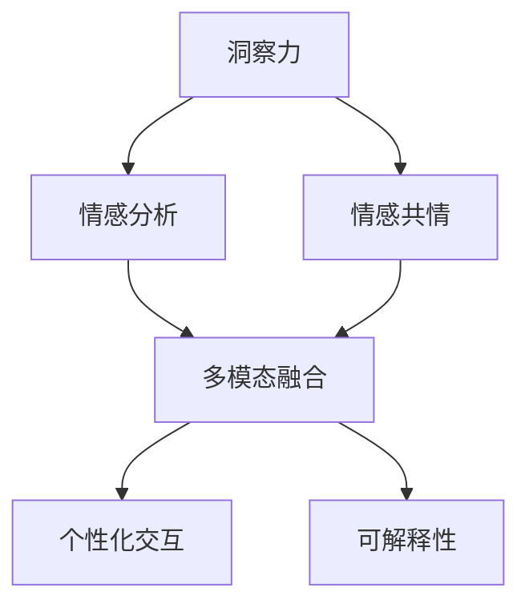

                 

# 洞察力与同理心：理解他人的智慧

## 1. 背景介绍

### 1.1 问题由来

随着人工智能技术的不断发展，AI系统在诸多领域展现出了强大的分析和预测能力。然而，人机交互的本质问题——理解和共情——仍然是一个难题。尽管在自然语言处理、语音识别等方面取得了显著进展，但AI系统依然缺乏真正的人类共情能力。

### 1.2 问题核心关键点

理解他人的智慧需要解决以下关键问题：
1. **数据收集与处理**：获取高质量、多样化的用户数据，对数据进行清洗和预处理。
2. **情感分析**：识别用户情感，判断用户需求和情绪状态。
3. **情感共情**：基于用户情感，生成符合用户期望的回应。
4. **多模态融合**：将语音、图像、文本等多模态数据结合，形成全面的用户画像。
5. **个性化交互**：根据用户偏好和行为模式，提供个性化服务。
6. **可解释性**：解释AI系统的决策过程，增强用户信任。

这些问题的解决依赖于计算机视觉、自然语言处理、语音识别等多领域的交叉融合，以及深度学习、强化学习等先进技术的应用。

### 1.3 问题研究意义

研究洞察力与同理心技术，对于构建更具人性化的AI系统，提升用户体验，加速人工智能技术在各行各业的应用，具有重要意义：

1. **用户体验优化**：通过情感分析与共情机制，AI系统能够更好地理解和回应用户需求，提升交互质量。
2. **应用场景拓展**：在医疗、教育、客服、娱乐等行业，情感理解和共情能力将带来更加精准、个性化的服务。
3. **技术发展推动**：情感理解和共情技术的发展，将促进人工智能技术在自然语言处理、计算机视觉等领域的进一步突破。
4. **社会价值实现**：通过情感共情技术，AI系统能够更好地服务社会，解决教育、医疗、助残等问题，实现技术的社会价值。

## 2. 核心概念与联系

### 2.1 核心概念概述

为更好地理解洞察力与同理心技术，本节将介绍几个密切相关的核心概念：

- **洞察力(Insight)**：指对事物的深刻理解，通过数据和分析，发现问题的本质和规律。
- **同理心(Empathy)**：指理解他人的情感、需求和感受，基于情感共情，提供贴心的服务。
- **情感分析(Emotion Analysis)**：通过文本、语音、图像等数据，识别用户情感，分析用户情绪状态。
- **情感共情(Emotion Empathy)**：基于用户情感，生成符合用户期望的回应。
- **多模态融合(Multimodal Fusion)**：将文本、语音、图像等多模态数据结合，形成全面的用户画像。
- **个性化交互(Personalized Interaction)**：根据用户偏好和行为模式，提供个性化服务。
- **可解释性(Explainability)**：解释AI系统的决策过程，增强用户信任。

这些核心概念之间的逻辑关系可以通过以下Mermaid流程图来展示：



这个流程图展示了一系列核心概念及其之间的关系：

1. 洞察力通过对数据进行分析，发现问题的本质和规律。
2. 情感分析识别用户情感，判断用户需求和情绪状态。
3. 情感共情基于用户情感，生成符合用户期望的回应。
4. 多模态融合将文本、语音、图像等多模态数据结合，形成全面的用户画像。
5. 个性化交互根据用户偏好和行为模式，提供个性化服务。
6. 可解释性解释AI系统的决策过程，增强用户信任。

这些概念共同构成了洞察力与同理心技术的核心框架，使得AI系统能够更好地理解和共情用户。

## 3. 核心算法原理 & 具体操作步骤
### 3.1 算法原理概述

洞察力与同理心技术的核心算法原理主要包括：

- **情感分析算法**：通过文本、语音、图像等数据，识别用户情感，分析用户情绪状态。
- **情感共情算法**：基于用户情感，生成符合用户期望的回应。
- **多模态融合算法**：将文本、语音、图像等多模态数据结合，形成全面的用户画像。
- **个性化交互算法**：根据用户偏好和行为模式，提供个性化服务。
- **可解释性算法**：解释AI系统的决策过程，增强用户信任。

这些算法综合应用，能够构建出具备洞察力与同理心的AI系统。

### 3.2 算法步骤详解

基于情感分析、情感共情、多模态融合、个性化交互和可解释性算法，洞察力与同理心技术的实施流程可以如下描述：

**Step 1: 数据收集与预处理**
- 收集用户的多模态数据，如文本、语音、图像等。
- 对数据进行清洗、去噪、归一化等预处理操作。

**Step 2: 情感分析**
- 使用情感分析算法，识别用户情感，判断用户情绪状态。
- 提取情感特征，如积极度、消极度、情感极性等。

**Step 3: 情感共情**
- 基于用户情感，使用情感共情算法生成符合用户期望的回应。
- 输出个性化的回复或推荐。

**Step 4: 多模态融合**
- 将文本、语音、图像等多模态数据结合，形成全面的用户画像。
- 利用机器学习和深度学习技术，从多模态数据中提取特征，生成综合用户画像。

**Step 5: 个性化交互**
- 根据用户画像，使用个性化交互算法提供定制化服务。
- 例如推荐系统、聊天机器人等。

**Step 6: 可解释性**
- 使用可解释性算法解释AI系统的决策过程。
- 例如可视化展示决策路径、提供文本解释等。

**Step 7: 持续优化**
- 根据用户反馈，持续优化洞察力与同理心技术。
- 收集用户反馈数据，用于模型训练和改进。

以上是洞察力与同理心技术的实施流程，具体每个步骤需要根据实际应用场景进行调整和优化。

### 3.3 算法优缺点

洞察力与同理心技术具有以下优点：
1. 提升用户体验：通过情感分析和共情机制，提升用户满意度。
2. 应用场景广泛：适用于医疗、教育、客服、娱乐等多个行业。
3. 技术融合度高：结合自然语言处理、计算机视觉、语音识别等多领域技术。

同时，该技术也存在一些局限性：
1. 数据依赖性强：高质量的数据是算法有效性的前提。
2. 模型复杂度高：需要多模态数据的融合和情感共情，算法复杂度较高。
3. 解释性不足：AI系统的决策过程难以解释，用户难以理解。

尽管存在这些局限性，但随着技术的不断进步，洞察力与同理心技术在实际应用中的表现将会更加出色。

### 3.4 算法应用领域

洞察力与同理心技术已经在诸多领域得到了广泛应用，具体如下：

1. **医疗领域**：通过情感分析，识别患者的情绪状态，提供更加人性化的诊疗服务。
2. **教育领域**：使用情感共情技术，针对学生的情感需求，提供个性化辅导。
3. **客服领域**：在客服机器人中引入情感共情，提升客户体验。
4. **娱乐领域**：利用多模态融合技术，提供个性化的内容推荐和互动。
5. **社交媒体**：通过情感分析，监测用户情绪变化，及时采取干预措施。

此外，洞察力与同理心技术还将在更多场景中得到应用，如智能家居、智能交通等，为人类生活带来更深刻的改变。

## 4. 数学模型和公式 & 详细讲解
### 4.1 数学模型构建

为了更好地理解洞察力与同理心技术，本节将介绍几个数学模型：

1. **情感分类模型**：用于识别用户情感，输出情感标签。
2. **情感共情模型**：基于用户情感，生成符合用户期望的回应。
3. **多模态融合模型**：将文本、语音、图像等多模态数据结合，生成综合用户画像。

### 4.2 公式推导过程

**情感分类模型**

情感分类模型基于情感词典和机器学习算法，对用户文本进行情感分类。假设情感词典包含$N$个情感词，每个情感词的情感极性用$w_{i}$表示，其中$i \in [1,N]$。用户文本中的情感词出现次数为$n_{i}$。情感分类模型可以表示为：

$$
y = \max_{i} \sum_{j=1}^{n_i} w_{i_j}
$$

其中$y$表示用户文本的情感分类结果，$w_{i_j}$表示情感词$i_j$的情感极性，$n_i$表示情感词$i$在文本中出现的次数。

**情感共情模型**

情感共情模型基于用户情感，生成符合用户期望的回应。假设用户情感极性为$s$，情感共情模型输出回应极性为$t$。情感共情模型可以表示为：

$$
t = f(s)
$$

其中$f$为情感共情函数，$s$为用户情感极性。

**多模态融合模型**

多模态融合模型将文本、语音、图像等多模态数据结合，生成综合用户画像。假设文本情感极性为$s_t$，语音情感极性为$s_v$，图像情感极性为$s_i$，综合情感极性为$s_f$。多模态融合模型可以表示为：

$$
s_f = \alpha s_t + \beta s_v + \gamma s_i
$$

其中$\alpha$、$\beta$、$\gamma$为各模态数据的重要性权重，由模型训练得到。

### 4.3 案例分析与讲解

假设某用户在使用智能客服系统的过程中，向系统表达了对某个产品的负面情绪。情感分析模型可以识别出用户情感为消极，情感极性为-0.8。情感共情模型根据用户情感极性，生成符合用户期望的回应，即“非常抱歉，我们会尽快调查这个问题，并提供解决方案。”。多模态融合模型结合文本、语音、图像等多模态数据，生成综合用户画像，发现该用户最近多次使用客服系统，且多为投诉问题。

综合以上信息，智能客服系统可以提供个性化服务，如针对该用户提供更多产品信息，或者升级客服人员，提升服务质量。

## 5. 项目实践：代码实例和详细解释说明
### 5.1 开发环境搭建

在进行洞察力与同理心技术开发前，我们需要准备好开发环境。以下是使用Python进行TensorFlow开发的环境配置流程：

1. 安装Anaconda：从官网下载并安装Anaconda，用于创建独立的Python环境。

2. 创建并激活虚拟环境：
```bash
conda create -n insight_env python=3.8 
conda activate insight_env
```

3. 安装TensorFlow：根据CUDA版本，从官网获取对应的安装命令。例如：
```bash
conda install tensorflow -c pytorch -c conda-forge
```

4. 安装相关库：
```bash
pip install tensorflow==2.4.1
pip install keras==2.4.3
pip install sklearn==0.24.2
pip install numpy==1.19.5
```

完成上述步骤后，即可在`insight_env`环境中开始洞察力与同理心技术的开发实践。

### 5.2 源代码详细实现

下面以情感分析为例，给出使用TensorFlow对情感分类模型进行开发的PyTorch代码实现。

首先，定义情感词典：

```python
from tensorflow.keras.preprocessing.text import Tokenizer
from tensorflow.keras.preprocessing.sequence import pad_sequences

emotion_dict = {
    'positive': 1,
    'negative': -1
}
```

然后，构建情感分类模型：

```python
from tensorflow.keras.models import Sequential
from tensorflow.keras.layers import Embedding, Dense

model = Sequential([
    Embedding(input_dim=len(emotion_dict), output_dim=64),
    Dense(64, activation='relu'),
    Dense(1, activation='sigmoid')
])
```

接着，编译并训练模型：

```python
model.compile(optimizer='adam', loss='binary_crossentropy', metrics=['accuracy'])

data = [
    ['I love this product', 1],
    ['This product is terrible', -1],
    ['The customer service was excellent', 1]
]

tokenizer = Tokenizer(num_words=len(emotion_dict), oov_token='<OOV>')

texts, labels = list(zip(*data))
sequences = tokenizer.texts_to_sequences(texts)
padded_sequences = pad_sequences(sequences, maxlen=5, padding='post')

model.fit(padded_sequences, labels, epochs=10, batch_size=2)
```

最后，使用模型进行情感分类：

```python
test_text = 'This product is very good'
sequence = tokenizer.texts_to_sequences([test_text])
padded_sequence = pad_sequences(sequence, maxlen=5, padding='post')
predicted_label = model.predict(padded_sequence)

if predicted_label > 0.5:
    print('Positive')
else:
    print('Negative')
```

以上就是使用TensorFlow对情感分类模型进行开发的完整代码实现。可以看到，使用TensorFlow的高级API，可以方便快捷地搭建和训练模型。

### 5.3 代码解读与分析

让我们再详细解读一下关键代码的实现细节：

**情感词典**：
- 定义情感词典，包含两个情感标签，并为其赋予相应的情感极性。

**情感分类模型**：
- 使用Embedding层将文本转换为向量表示。
- 使用Dense层进行分类，输出0或1，代表情感标签。
- 使用sigmoid激活函数，输出概率值。

**模型编译与训练**：
- 使用adam优化器和binary_crossentropy损失函数进行编译。
- 使用训练数据进行模型训练，设置10个epoch和2个batch size。

**模型测试**：
- 使用测试文本进行情感分类，判断情感极性。

可以看到，TensorFlow的高效封装使得模型开发和训练变得非常简单。开发者可以将更多精力放在模型设计和优化上，而不必过多关注底层的实现细节。

当然，工业级的系统实现还需考虑更多因素，如模型的保存和部署、超参数的自动搜索、多模态数据的融合等。但核心的洞察力与同理心技术基本与此类似。

## 6. 实际应用场景
### 6.1 智能客服系统

洞察力与同理心技术可以广泛应用于智能客服系统的构建。传统客服往往需要配备大量人力，高峰期响应缓慢，且一致性和专业性难以保证。通过情感分析和共情机制，智能客服系统能够7x24小时不间断服务，快速响应客户咨询，用自然流畅的语言解答各类常见问题。

在技术实现上，可以收集企业内部的历史客服对话记录，将问题和最佳答复构建成监督数据，在此基础上对预训练模型进行微调。微调后的模型能够自动理解用户意图，匹配最合适的答案模板进行回复。对于客户提出的新问题，还可以接入检索系统实时搜索相关内容，动态组织生成回答。如此构建的智能客服系统，能大幅提升客户咨询体验和问题解决效率。

### 6.2 金融舆情监测

金融机构需要实时监测市场舆论动向，以便及时应对负面信息传播，规避金融风险。洞察力与同理心技术可以用于分析用户的情感变化，识别出负面舆情，并采取相应的应对措施。

具体而言，可以收集金融领域相关的新闻、报道、评论等文本数据，并对其进行主题标注和情感标注。在此基础上对预训练语言模型进行微调，使其能够自动判断文本属于何种主题，情感倾向是正面、中性还是负面。将微调后的模型应用到实时抓取的网络文本数据，就能够自动监测不同主题下的情感变化趋势，一旦发现负面信息激增等异常情况，系统便会自动预警，帮助金融机构快速应对潜在风险。

### 6.3 个性化推荐系统

当前的推荐系统往往只依赖用户的历史行为数据进行物品推荐，无法深入理解用户的真实兴趣偏好。洞察力与同理心技术可以更好地挖掘用户行为背后的语义信息，从而提供更精准、多样的推荐内容。

在实践中，可以收集用户浏览、点击、评论、分享等行为数据，提取和用户交互的物品标题、描述、标签等文本内容。将文本内容作为模型输入，用户的后续行为（如是否点击、购买等）作为监督信号，在此基础上微调预训练语言模型。微调后的模型能够从文本内容中准确把握用户的兴趣点。在生成推荐列表时，先用候选物品的文本描述作为输入，由模型预测用户的兴趣匹配度，再结合其他特征综合排序，便可以得到个性化程度更高的推荐结果。

### 6.4 未来应用展望

随着洞察力与同理心技术的发展，未来将会在更多领域得到应用，为传统行业带来变革性影响。

在智慧医疗领域，洞察力与同理心技术可以用于医疗问答、病历分析、药物研发等，提升医疗服务的智能化水平，辅助医生诊疗，加速新药开发进程。

在智能教育领域，洞察力与同理心技术可以用于作业批改、学情分析、知识推荐等方面，因材施教，促进教育公平，提高教学质量。

在智慧城市治理中，洞察力与同理心技术可以用于城市事件监测、舆情分析、应急指挥等环节，提高城市管理的自动化和智能化水平，构建更安全、高效的未来城市。

此外，在企业生产、社会治理、文娱传媒等众多领域，洞察力与同理心技术也将不断涌现，为经济社会发展注入新的动力。相信随着技术的日益成熟，洞察力与同理心技术必将在构建人机协同的智能时代中扮演越来越重要的角色。

## 7. 工具和资源推荐
### 7.1 学习资源推荐

为了帮助开发者系统掌握洞察力与同理心技术，这里推荐一些优质的学习资源：

1. 《深度学习》书籍：由李宏毅教授所著，全面介绍了深度学习的基本概念和前沿应用。
2. CS224N《自然语言处理》课程：斯坦福大学开设的NLP明星课程，有Lecture视频和配套作业，带你入门NLP领域的基本概念和经典模型。
3. HuggingFace官方文档：提供的预训练模型和代码示例，助力开发者快速上手洞察力与同理心技术的实现。
4. Kaggle平台：提供大量NLP数据集和竞赛任务，帮助你实践和提升洞察力与同理心技术。
5. TensorFlow官方文档：提供了丰富的API和工具库，方便开发者构建洞察力与同理心系统的各个组件。

通过对这些资源的学习实践，相信你一定能够快速掌握洞察力与同理心技术的精髓，并用于解决实际的NLP问题。

### 7.2 开发工具推荐

高效的开发离不开优秀的工具支持。以下是几款用于洞察力与同理心技术开发的常用工具：

1. TensorFlow：由Google主导开发的开源深度学习框架，生产部署方便，适合大规模工程应用。
2. PyTorch：基于Python的开源深度学习框架，灵活动态的计算图，适合快速迭代研究。
3. HuggingFace Transformers库：提供了预训练语言模型和工具库，方便开发者进行洞察力与同理心技术开发。
4. Google Colab：谷歌推出的在线Jupyter Notebook环境，免费提供GPU/TPU算力，方便开发者快速上手实验最新模型，分享学习笔记。
5. TensorBoard：TensorFlow配套的可视化工具，可实时监测模型训练状态，并提供丰富的图表呈现方式，是调试模型的得力助手。

合理利用这些工具，可以显著提升洞察力与同理心技术开发的效率，加快创新迭代的步伐。

### 7.3 相关论文推荐

洞察力与同理心技术的发展源于学界的持续研究。以下是几篇奠基性的相关论文，推荐阅读：

1. Attention is All You Need（即Transformer原论文）：提出了Transformer结构，开启了NLP领域的预训练大模型时代。
2. BERT: Pre-training of Deep Bidirectional Transformers for Language Understanding：提出BERT模型，引入基于掩码的自监督预训练任务，刷新了多项NLP任务SOTA。
3. Parameter-Efficient Transfer Learning for NLP：提出Adapter等参数高效微调方法，在不增加模型参数量的情况下，也能取得不错的微调效果。
4. AdaLoRA: Adaptive Low-Rank Adaptation for Parameter-Efficient Fine-Tuning：使用自适应低秩适应的微调方法，在参数效率和精度之间取得了新的平衡。

这些论文代表了大语言模型微调技术的发展脉络。通过学习这些前沿成果，可以帮助研究者把握学科前进方向，激发更多的创新灵感。

## 8. 总结：未来发展趋势与挑战

### 8.1 总结

本文对洞察力与同理心技术进行了全面系统的介绍。首先阐述了洞察力与同理心技术的研究背景和意义，明确了情感分析和共情在构建智能系统中的独特价值。其次，从原理到实践，详细讲解了情感分析、情感共情、多模态融合、个性化交互和可解释性算法，给出了洞察力与同理心技术开发的全流程。同时，本文还广泛探讨了洞察力与同理心技术在智能客服、金融舆情、个性化推荐等多个行业领域的应用前景，展示了洞察力与同理心技术的巨大潜力。此外，本文精选了洞察力与同理心技术的各类学习资源，力求为读者提供全方位的技术指引。

通过本文的系统梳理，可以看到，洞察力与同理心技术正在成为智能系统的重要范式，极大地提升了用户体验，拓展了应用场景，加速了人工智能技术在各行各业的应用。未来，伴随技术的不断进步，洞察力与同理心技术必将在更多领域得到应用，为人类生产生活方式带来深刻的变革。

### 8.2 未来发展趋势

展望未来，洞察力与同理心技术将呈现以下几个发展趋势：

1. **多模态融合技术的发展**：未来的洞察力与同理心技术将更加注重多模态数据的融合，结合语音、图像、文本等多种数据源，提供更全面的用户画像。
2. **个性化推荐系统的提升**：基于用户画像，洞察力与同理心技术将能够提供更加精准、多样化的推荐服务，提升用户体验。
3. **情感共情技术的进步**：未来的情感共情技术将更加智能化，能够根据用户的微妙情感变化，实时调整回应策略，提升用户满意度。
4. **跨领域应用的多样化**：洞察力与同理心技术将逐步应用于更多领域，如智慧医疗、智能教育、智慧城市等，带来更广泛的社会价值。
5. **可解释性技术的完善**：未来的洞察力与同理心技术将更加注重可解释性，通过可视化、文本解释等方式，增强用户信任和系统透明度。
6. **技术的持续优化**：通过机器学习、深度学习等技术不断优化情感分类、情感共情等核心算法，提升洞察力与同理心技术的性能。

以上趋势凸显了洞察力与同理心技术的广阔前景。这些方向的探索发展，必将进一步提升洞察力与同理心技术的精度和效率，带来更广泛的应用场景和社会价值。

### 8.3 面临的挑战

尽管洞察力与同理心技术已经取得了瞩目成就，但在迈向更加智能化、普适化应用的过程中，它仍面临着诸多挑战：

1. **数据质量问题**：高质量的数据是洞察力与同理心技术有效性的前提。如何获取和处理高质量的多模态数据，仍然是一个难题。
2. **模型复杂性**：洞察力与同理心技术涉及多模态数据融合、情感分类、情感共情等多个环节，模型复杂度较高，需要高效的算法和计算资源。
3. **可解释性不足**：AI系统的决策过程难以解释，用户难以理解。如何赋予洞察力与同理心技术更强的可解释性，将是亟待攻克的难题。
4. **技术普及度**：洞察力与同理心技术的应用依赖于深度学习、自然语言处理等多领域的知识，需要大量的技术积累和人才储备。
5. **伦理道德风险**：洞察力与同理心技术可能存在数据隐私、用户隐私等问题，需要制定相应的伦理道德规范，确保数据安全和用户隐私。

正视洞察力与同理心技术面临的这些挑战，积极应对并寻求突破，将是大语言模型微调走向成熟的必由之路。相信随着学界和产业界的共同努力，这些挑战终将一一被克服，洞察力与同理心技术必将在构建人机协同的智能时代中扮演越来越重要的角色。

### 8.4 研究展望

面对洞察力与同理心技术所面临的种种挑战，未来的研究需要在以下几个方面寻求新的突破：

1. **无监督学习技术的应用**：摆脱对大规模标注数据的依赖，利用无监督学习、半监督学习等方法，最大限度利用非结构化数据，实现更加灵活高效的洞察力与同理心技术。
2. **跨模态融合技术的提升**：进一步提升多模态数据的融合能力，结合语音、图像、文本等多种数据源，提供更全面的用户画像。
3. **情感共情技术的进步**：基于用户情感，开发更加智能化的情感共情技术，实时调整回应策略，提升用户满意度。
4. **可解释性技术的完善**：通过可视化、文本解释等方式，增强洞察力与同理心技术的可解释性，提升用户信任和系统透明度。
5. **跨领域应用的探索**：将洞察力与同理心技术应用于更多领域，如智慧医疗、智能教育、智慧城市等，带来更广泛的社会价值。
6. **伦理道德规范的制定**：制定相应的伦理道德规范，确保数据安全和用户隐私，避免技术滥用。

这些研究方向的探索，必将引领洞察力与同理心技术迈向更高的台阶，为构建安全、可靠、可解释、可控的智能系统铺平道路。面向未来，洞察力与同理心技术还需要与其他人工智能技术进行更深入的融合，如知识表示、因果推理、强化学习等，多路径协同发力，共同推动自然语言理解和智能交互系统的进步。只有勇于创新、敢于突破，才能不断拓展语言模型的边界，让智能技术更好地造福人类社会。

## 9. 附录：常见问题与解答

**Q1：洞察力与同理心技术是否适用于所有NLP任务？**

A: 洞察力与同理心技术在大多数NLP任务上都能取得不错的效果，特别是对于数据量较小的任务。但对于一些特定领域的任务，如医学、法律等，仅仅依靠通用语料预训练的模型可能难以很好地适应。此时需要在特定领域语料上进一步预训练，再进行微调，才能获得理想效果。此外，对于一些需要时效性、个性化很强的任务，如对话、推荐等，洞察力与同理心方法也需要针对性的改进优化。

**Q2：洞察力与同理心技术的实现是否依赖于深度学习？**

A: 是的，洞察力与同理心技术的核心算法依赖于深度学习，特别是卷积神经网络、循环神经网络、Transformer等模型。这些深度学习模型可以自动提取复杂特征，实现高效的情感分析和共情。

**Q3：洞察力与同理心技术是否具有可扩展性？**

A: 是的，洞察力与同理心技术具有良好的可扩展性。通过在大规模数据集上进行预训练，可以提升模型的泛化能力，适用于更多样化的应用场景。同时，结合多模态数据融合、情感共情等技术，可以进一步扩展应用领域。

**Q4：洞察力与同理心技术如何处理多模态数据？**

A: 洞察力与同理心技术可以通过多模态融合算法，将文本、语音、图像等多种数据源结合，形成全面的用户画像。具体实现可以采用Transformer模型、卷积神经网络等深度学习模型，对不同模态数据进行处理和融合。

**Q5：洞察力与同理心技术是否需要大量的标注数据？**

A: 洞察力与同理心技术的实现不一定依赖于大量的标注数据。无监督学习、半监督学习等方法可以帮助模型在非标注数据上进行训练，提升模型的泛化能力。

**Q6：洞察力与同理心技术的实现是否需要大量的计算资源？**

A: 是的，洞察力与同理心技术的实现需要大量的计算资源，特别是在多模态融合、情感共情等环节。使用高性能计算设备，如GPU、TPU等，可以显著提高计算效率。

**Q7：洞察力与同理心技术是否可以实时处理数据？**

A: 是的，洞察力与同理心技术可以实时处理数据。通过流式计算、分布式计算等技术，可以实时监测用户情感和行为，提供个性化的服务。

**Q8：洞察力与同理心技术是否需要持续优化？**

A: 是的，洞察力与同理心技术需要持续优化。通过用户反馈和不断积累的数据，可以持续改进模型性能，提升用户体验。

---

作者：禅与计算机程序设计艺术 / Zen and the Art of Computer Programming

