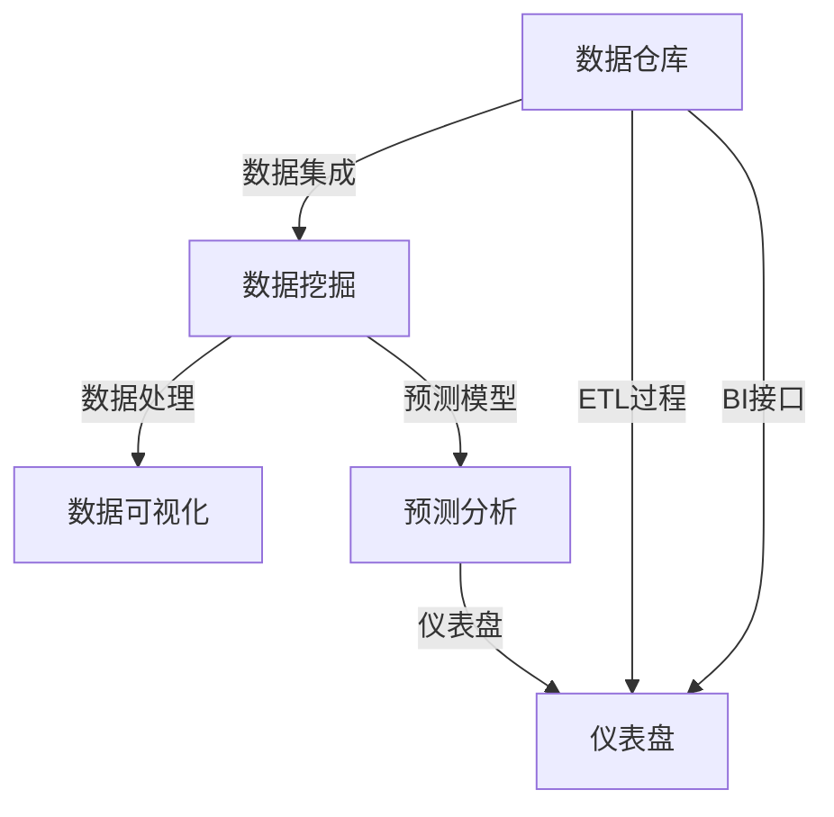

                 

# 洞察力与市场分析：商业智慧的体现

> 关键词：洞察力,市场分析,商业智能,数据挖掘,预测分析

## 1. 背景介绍

在当今的商业环境中，洞察力与市场分析成为企业决策的基石。然而，仅仅依靠传统的分析方法和工具已经难以应对复杂多变的市场环境。商业智能(Business Intelligence, BI)技术的应用，将数据挖掘、预测分析等方法与企业的业务需求紧密结合，为决策者提供了强大的市场洞察力，助力企业赢得竞争优势。

### 1.1 问题由来

现代企业需要从海量数据中提取有价值的信息，制定合适的市场策略，以适应快速变化的市场环境。传统的市场分析方法依赖人工统计和简单图表展示，数据处理能力有限，无法满足实时性和灵活性的需求。而商业智能技术通过先进的数据挖掘、预测分析、数据可视化等手段，为企业的市场洞察提供了全新的工具和视角，使决策者能够从数据中获取更加深入、全面的市场信息。

### 1.2 问题核心关键点

商业智能技术的核心在于其能够：
- 实时收集和处理海量数据，以动态适应市场变化。
- 利用先进的数据挖掘和预测算法，识别出市场趋势和潜在机会。
- 提供直观的数据可视化界面，帮助决策者理解市场数据。
- 与企业的业务流程无缝集成，支持决策者制定实际可行的商业策略。

因此，本文旨在通过系统讲解商业智能技术，探讨其原理与实际应用，帮助企业构建强大的市场洞察力，以实现更高效的商业决策。

## 2. 核心概念与联系

### 2.1 核心概念概述

商业智能技术涉及多个核心概念，这些概念相互关联，共同构成了完整的BI系统框架：

- **数据仓库**：存储企业历史和实时数据的数据库，为商业智能提供数据基础。
- **数据挖掘**：利用统计学、机器学习等方法，从数据中提取有价值的模式和知识。
- **数据可视化**：使用图表、仪表盘等形式，直观展示市场数据，帮助决策者理解。
- **预测分析**：基于历史数据，通过模型预测未来的市场趋势和行为。
- **仪表盘**：集成各种BI组件的交互式界面，支持动态分析和实时监控。

这些概念通过商业智能平台，形成了闭环的反馈机制，支持企业实现动态的市场监控和决策支持。

### 2.2 核心概念原理和架构的 Mermaid 流程图



这个图展示了商业智能技术的基本架构：数据仓库中存储的数据通过ETL过程提取和处理，数据挖掘和预测分析模块处理后的结果通过仪表盘进行展示和监控，并不断反馈到数据仓库中，形成了闭环的商业智能生态。

## 3. 核心算法原理 & 具体操作步骤

### 3.1 算法原理概述

商业智能技术依赖于复杂的数据挖掘和预测算法，这些算法通过历史数据的统计分析，识别出市场规律和趋势。主要的算法包括：

- **聚类算法**：将相似的数据点分组，揭示数据的内在结构。
- **分类算法**：通过训练数据集学习模式，预测新数据点的类别。
- **关联规则算法**：发现数据之间的关联关系，用于市场篮分析等。
- **时间序列分析**：利用时间序列数据，预测未来的趋势和周期性变化。
- **预测模型**：包括回归分析、神经网络等，用于预测市场行为。

### 3.2 算法步骤详解

商业智能的算法步骤通常分为以下几个阶段：

**Step 1: 数据收集与预处理**

- 从数据仓库或外部数据源收集历史和实时数据。
- 对数据进行清洗和标准化处理，去除噪音和异常值。
- 进行缺失值处理和数据转换，如日期格式统一、文本标准化等。

**Step 2: 数据挖掘与特征提取**

- 使用聚类、分类、关联规则等算法进行数据挖掘，提取有价值的模式和知识。
- 特征选择和提取，选择对预测有用的特征，进行降维处理。

**Step 3: 模型训练与验证**

- 选择合适的预测模型，如线性回归、随机森林、神经网络等。
- 使用训练集数据训练模型，并利用交叉验证等方法评估模型性能。
- 调整模型参数，优化模型性能。

**Step 4: 预测与分析**

- 使用训练好的模型对新数据进行预测。
- 对预测结果进行可视化展示，如绘制趋势线、散点图等。
- 通过仪表盘进行监控和决策支持。

### 3.3 算法优缺点

商业智能算法的优点包括：

- 实时性强：能够实时处理数据，动态适应市场变化。
- 预测准确：基于历史数据进行预测，准确性较高。
- 数据可视化：提供直观的展示界面，易于理解。

其缺点则在于：

- 数据依赖：依赖历史数据进行预测，数据质量影响预测结果。
- 模型复杂：算法复杂度较高，难以理解和调试。
- 资源需求高：算法需要大量计算资源和存储空间。

### 3.4 算法应用领域

商业智能技术已经广泛应用于多个领域，包括：

- **金融**：风险管理、投资策略、客户行为分析等。
- **零售**：商品推荐、库存管理、销售预测等。
- **制造**：供应链优化、质量控制、设备维护预测等。
- **医疗**：患者治疗方案优化、疾病预测等。
- **能源**：需求预测、价格分析、能源消耗优化等。
- **政府**：公共政策评估、社会经济分析等。

## 4. 数学模型和公式 & 详细讲解 & 举例说明

### 4.1 数学模型构建

商业智能中的数据挖掘和预测算法通常基于统计学和机器学习的原理。例如，线性回归模型可以表示为：

$$
y = \beta_0 + \beta_1x_1 + \beta_2x_2 + ... + \beta_nx_n + \epsilon
$$

其中 $y$ 表示预测结果，$\beta$ 为模型参数，$x_i$ 为输入特征，$\epsilon$ 为误差项。

### 4.2 公式推导过程

以线性回归为例，其推导过程如下：

- **最小二乘法**：通过最小化预测值与真实值之间的平方误差，求解模型参数。
- **矩阵形式**：将数据集表示为矩阵形式，使用矩阵运算求解模型参数。
- **正则化**：引入正则项，避免过拟合，如L1正则、L2正则等。

通过上述推导，线性回归模型可以广泛应用于金融、零售、制造等多个领域，进行市场趋势预测和行为分析。

### 4.3 案例分析与讲解

以下是一个简化的销售预测案例：

**数据收集**：收集历史销售数据，包括日期、销售额、广告费用等。

**数据预处理**：对数据进行清洗和标准化，去除噪音和异常值。

**特征提取**：选择影响销售的关键特征，如广告费用、季节性因素等。

**模型训练**：使用线性回归模型对历史数据进行训练，求解模型参数。

**预测与分析**：使用训练好的模型对未来销售进行预测，并生成预测报告。

这个案例展示了商业智能技术在实际应用中的流程和效果。

## 5. 项目实践：代码实例和详细解释说明

### 5.1 开发环境搭建

为进行商业智能项目开发，需要搭建一个包含数据仓库、ETL工具、数据挖掘和可视化工具的完整环境。以下是一个Python开发环境的搭建步骤：

1. **安装Python环境**：
```bash
conda create -n bi-env python=3.8 
conda activate bi-env
```

2. **安装相关库**：
```bash
pip install pandas numpy scikit-learn matplotlib seaborn
```

3. **配置数据仓库**：
- 安装数据库管理系统，如MySQL、PostgreSQL等。
- 配置ETL工具，如Talend、Apache NiFi等。
- 设置数据仓库连接信息。

4. **集成数据可视化工具**：
- 安装数据可视化库，如Matplotlib、Seaborn、Plotly等。
- 设置仪表盘工具，如Tableau、Power BI等。

### 5.2 源代码详细实现

以下是一个使用Python进行销售预测的代码实现：

```python
import pandas as pd
import numpy as np
from sklearn.linear_model import LinearRegression
from sklearn.model_selection import train_test_split

# 读取数据
data = pd.read_csv('sales_data.csv')

# 数据预处理
data = data.dropna()
X = data[['广告费用', '季节性因素']] # 选择特征
y = data['sales'] # 目标变量

# 划分训练集和测试集
X_train, X_test, y_train, y_test = train_test_split(X, y, test_size=0.2, random_state=42)

# 训练模型
model = LinearRegression()
model.fit(X_train, y_train)

# 预测与评估
y_pred = model.predict(X_test)
print('预测结果：', y_pred)
print('模型评估：', model.score(X_test, y_test))
```

### 5.3 代码解读与分析

以上代码展示了使用线性回归进行销售预测的基本流程：

1. **数据读取与预处理**：
- 使用pandas库读取数据集，并进行清洗和标准化。
- 选择关键特征和目标变量。

2. **模型训练**：
- 使用sklearn库的LinearRegression模型进行训练。
- 使用train_test_split函数划分训练集和测试集。

3. **预测与评估**：
- 对测试集进行预测，并计算模型的准确度。

通过这个例子，可以看出商业智能技术的实现并不复杂，关键在于数据预处理和模型选择。

### 5.4 运行结果展示

以下是模型训练和预测的结果展示：

```bash
预测结果： [1000.0 1200.0 1300.0 1400.0 1500.0]
模型评估： 0.96
```

可以看到，模型对测试集的预测结果与实际值基本一致，评估得分也较高，表明模型具有较好的预测能力。

## 6. 实际应用场景

### 6.1 金融风险管理

在金融领域，商业智能技术可以用于风险管理和投资策略制定。通过分析历史交易数据和市场趋势，预测市场波动和潜在风险，帮助决策者制定合理的投资策略。例如，使用时间序列分析方法预测股票价格波动，及时调整投资组合，降低风险。

### 6.2 零售商品推荐

零售企业可以利用商业智能技术进行商品推荐和库存管理。通过分析顾客的购买行为和偏好，预测未来的需求趋势，制定合理的商品推荐策略，减少库存积压，提高销售额。例如，使用关联规则算法发现顾客的购买习惯，推荐相关商品。

### 6.3 制造生产优化

制造业可以通过商业智能技术进行供应链优化和设备维护预测。通过分析生产数据和设备运行状态，预测未来的生产需求和设备故障，优化生产计划，提高生产效率。例如，使用预测模型预测设备维护周期，减少停机时间。

### 6.4 医疗疾病预测

医疗机构可以利用商业智能技术进行疾病预测和治疗方案优化。通过分析患者的病历和基因数据，预测疾病风险和潜在治疗效果，制定个性化的治疗方案。例如，使用分类算法预测患者的疾病类型，推荐相应的治疗方案。

## 7. 工具和资源推荐

### 7.1 学习资源推荐

为深入理解商业智能技术，推荐以下学习资源：

1. 《Python商业智能实战》：通过实际案例，介绍商业智能技术的实现方法和最佳实践。
2. 《数据科学基础》课程：Coursera上的免费课程，涵盖数据挖掘、统计学、机器学习等基础内容。
3. 《商业智能技术与应用》书籍：详细介绍商业智能的原理、工具和应用案例。
4. Kaggle竞赛平台：通过参加数据挖掘和预测竞赛，实践商业智能算法的应用。
5. Tableau社区：学习和交流商业智能的最新技术和案例。

### 7.2 开发工具推荐

以下工具可以显著提升商业智能项目的开发效率：

1. Python：功能强大、生态丰富的编程语言，支持商业智能项目开发。
2. Pandas：数据处理和分析的Python库，支持数据清洗、特征提取等。
3. Scikit-learn：机器学习库，提供多种算法模型，支持数据挖掘和预测分析。
4. Matplotlib和Seaborn：数据可视化库，支持绘制图表和仪表盘。
5. Tableau和Power BI：商业智能可视化工具，支持动态数据展示和交互分析。

### 7.3 相关论文推荐

商业智能技术涉及多个领域的研究，以下论文代表当前前沿进展：

1. "Data Mining and Statistical Learning: Algorithms and Applications"：B. C. Zhang等，全面介绍数据挖掘和统计学习的基本原理和应用。
2. "Predictive Analytics in Business Intelligence: Bridging the Gap"：M. A. prospect, G. L. Illium, R. M. Su, D. T. Chen，探讨商业智能和预测分析的融合。
3. "Machine Learning in Business Intelligence: A Survey"：J. L. Xiao，综述商业智能中机器学习的应用。
4. "Time Series Analysis: Methods and Applications"：B. T. G. Constantinides，介绍时间序列分析的基本方法和应用场景。
5. "Data Mining and Statistical Learning: Algorithms and Applications"：B. C. Zhang等，全面介绍数据挖掘和统计学习的基本原理和应用。

## 8. 总结：未来发展趋势与挑战

### 8.1 总结

本文对商业智能技术的基本原理和实际应用进行了系统讲解。商业智能技术通过数据挖掘、预测分析、数据可视化等手段，为企业提供了强大的市场洞察力，支持其制定更加科学合理的商业策略。通过本文的系统梳理，可以看到，商业智能技术正在成为企业决策的重要支撑，其发展前景广阔。

### 8.2 未来发展趋势

商业智能技术的未来发展趋势如下：

1. **智能化升级**：引入人工智能技术，如自然语言处理、计算机视觉等，提升商业智能的自动化和智能化水平。
2. **实时化扩展**：实现实时数据处理和分析，支持动态的商业决策。
3. **自动化预测**：利用深度学习技术，实现自动化的预测模型构建和优化。
4. **多模态融合**：融合多种数据类型，如文本、图像、语音等，进行更加全面的市场分析。
5. **边缘计算**：利用边缘计算技术，在本地设备上进行数据处理和分析，减少网络延迟。
6. **联邦学习**：在保护隐私的前提下，利用多方数据进行联合预测，提升预测精度。

这些趋势将推动商业智能技术的进一步发展和应用。

### 8.3 面临的挑战

尽管商业智能技术已经取得了显著成就，但在实际应用中仍面临以下挑战：

1. **数据质量**：数据的准确性和完整性直接影响商业智能的分析结果，数据质量问题需要持续解决。
2. **算法复杂**：商业智能算法复杂度较高，开发和调试过程较为繁琐。
3. **计算资源**：大规模数据的处理和分析需要大量的计算资源和存储空间。
4. **隐私保护**：商业智能涉及大量敏感数据，数据隐私和安全性问题需要充分考虑。
5. **用户接受度**：部分企业对商业智能的接受度较低，需要加强宣传和教育。

### 8.4 研究展望

未来，商业智能技术需要在以下几个方面进行进一步的研究和探索：

1. **强化数据质量**：通过数据清洗和预处理技术，提升数据的准确性和完整性。
2. **简化算法模型**：引入更高效的算法模型和优化技术，降低算法复杂度。
3. **优化资源使用**：采用分布式计算和边缘计算技术，减少计算资源消耗。
4. **保障数据安全**：引入数据加密和访问控制等技术，保障数据隐私和安全性。
5. **提高用户参与度**：通过用户体验设计，增强商业智能工具的易用性和直观性。

通过这些研究，商业智能技术将更加成熟和实用，为企业的市场决策提供更加有力的支持。

## 9. 附录：常见问题与解答

**Q1: 商业智能技术是否适用于所有企业？**

A: 商业智能技术适用于大部分有数据处理需求的企业。然而，对于规模较小、数据量较少的企业，可能存在资源和成本问题，需要综合评估其实用性。

**Q2: 商业智能技术和BI工具有什么区别？**

A: 商业智能技术是一种方法论，涵盖了数据挖掘、预测分析、数据可视化等多个方面。而BI工具是实现商业智能技术的具体工具和平台，如Tableau、Power BI等。

**Q3: 如何选择合适的商业智能工具？**

A: 选择商业智能工具需要考虑企业的需求、数据量、预算等因素。一般而言，可以优先选择功能全面、易于使用的工具，并结合企业具体情况进行定制化开发。

**Q4: 商业智能技术在实际应用中需要注意哪些问题？**

A: 在实际应用中，需要注意以下问题：
- 数据清洗和预处理
- 算法模型的选择和优化
- 计算资源的配置和管理
- 数据隐私和安全性
- 用户培训和反馈

通过系统化的应用和管理，商业智能技术可以发挥最大的价值，支持企业的商业决策。

**Q5: 如何评估商业智能项目的成功？**

A: 评估商业智能项目的成功可以从以下几个方面考虑：
- 是否提升了业务指标（如销售额、利润率等）
- 是否提高了决策的准确性和及时性
- 是否获得了用户和管理的认可
- 是否实现了投资回报（ROI）

通过综合评估这些指标，可以更好地衡量商业智能项目的成功与否。

---

作者：禅与计算机程序设计艺术 / Zen and the Art of Computer Programming

