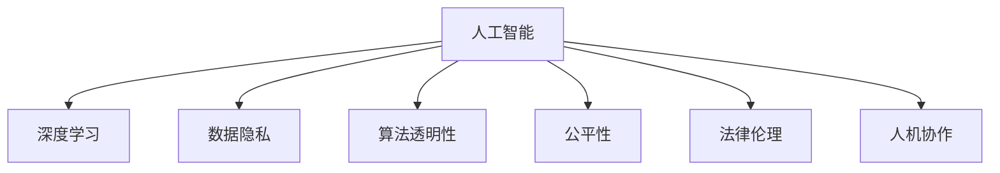

                 

## 1. 背景介绍

### 1.1 问题由来

在当今科技迅猛发展的时代，人工智能(AI)和深度学习(DL)技术已经深刻地改变了各行各业的面貌。它们在医疗诊断、金融分析、自动驾驶、智能推荐等多个领域展现出了强大的应用潜力。然而，这些技术的发展也伴随着诸多伦理道德的挑战，引发了关于技术应用边界、决策透明度、隐私保护等方面的深入思考。

如何在追求技术创新的同时，确保技术的道德合法性，保护用户隐私，维护社会公平正义，成为当前AI领域急需解决的重大问题。本文将围绕人工智能的伦理道德问题，深入探讨如何在创新与道德之间取得平衡，构建一个安全、可靠、透明和负责任的技术生态。

### 1.2 问题核心关键点

本文聚焦于AI技术的应用伦理，尤其关注以下几个核心关键点：

1. **数据隐私与安全**：如何在数据采集和使用过程中保护用户隐私，防止数据滥用。
2. **透明性与可解释性**：如何增强AI系统的透明性与可解释性，让用户理解AI的决策过程。
3. **公平性与偏见消除**：如何确保AI系统不产生偏见，维护社会公平正义。
4. **责任归属与法律框架**：如何在AI应用中明确责任归属，建立健全的法律框架。
5. **人机协作与伦理监管**：如何构建人机协作机制，实现技术的伦理监管。

## 2. 核心概念与联系

### 2.1 核心概念概述

为更好地理解AI伦理问题的解决方案，本节将介绍几个密切相关的核心概念：

- **人工智能与深度学习**：以自监督学习、强化学习为代表的机器学习技术，使得AI系统具备了强大的学习与决策能力。
- **数据隐私**：指个人信息的保护与处理，涉及数据的收集、存储、传输、使用等各个环节。
- **算法透明性与可解释性**：指AI系统决策过程的可理解性与解释能力，确保用户对AI的信任与接受。
- **公平性与偏见消除**：指AI系统在处理不同用户时能够保持无偏见、公正无私，避免因种族、性别、年龄等歧视。
- **法律与伦理框架**：涉及AI技术的法律监管与伦理规范，如数据保护法、隐私政策、伦理指南等。
- **人机协作与伦理监管**：指AI与人类的协同工作，以及如何通过伦理监管确保AI系统的安全、可靠和公正。

这些核心概念之间的逻辑关系可以通过以下Mermaid流程图来展示：



这个流程图展示了大语言模型和大数据之间的核心概念及其之间的关系：

1. 人工智能与深度学习技术是数据处理与决策的基础。
2. 数据隐私和安全是大规模数据处理的关键问题。
3. 算法透明性和可解释性是确保用户信任的技术要求。
4. 公平性是保障社会正义的核心原则。
5. 法律和伦理框架是技术应用的规范指南。
6. 人机协作和伦理监管是确保AI系统合规性和安全性的保障。

这些核心概念共同构成了AI技术的伦理体系，使其能够在技术创新与社会责任之间取得平衡。

## 3. 核心算法原理 & 具体操作步骤

### 3.1 算法原理概述

AI伦理问题的解决，通常需要结合多学科知识，包括计算机科学、法律、伦理学等。本文将从技术角度出发，重点讨论以下几个核心算法原理：

- **隐私保护算法**：通过差分隐私、联邦学习等技术，保护用户数据隐私。
- **透明性与可解释性算法**：如LIME、SHAP等技术，用于解释AI模型的决策过程。
- **公平性与偏见消除算法**：如调整模型权重、引入对抗性样本等方法，消除模型偏见。
- **责任归属与法律框架算法**：基于区块链、可解释性模型等技术，明确AI应用的责任归属。

### 3.2 算法步骤详解

**隐私保护算法**

隐私保护算法旨在通过技术手段，确保数据在处理过程中不被滥用。以下是其具体操作步骤：

1. **差分隐私技术**：通过在数据中添加噪声，确保单个数据点对统计结果的影响极小，从而保护数据隐私。
2. **联邦学习技术**：通过分布式训练，让多个参与者在不共享原始数据的情况下，协同训练模型，保障数据安全。
3. **同态加密技术**：对数据进行加密处理，使计算过程在加密状态下进行，保障数据隐私。

**透明性与可解释性算法**

透明性与可解释性算法主要用于增强AI系统的透明性和可解释性，确保用户理解其决策过程。具体操作步骤如下：

1. **LIME算法**：基于局部线性模型的解释方法，通过生成局部解释模型，解释AI决策的依据。
2. **SHAP算法**：通过分配权重的方式，量化每个特征对模型决策的贡献，解释AI模型的全局行为。
3. **可解释性模型**：使用决策树、规则集等易于解释的模型，代替复杂的深度学习模型，增强透明度。

**公平性与偏见消除算法**

公平性与偏见消除算法旨在确保AI系统在处理不同用户时不产生偏见，维护社会公平正义。具体操作步骤包括：

1. **调整模型权重**：通过优化模型参数，确保模型对所有群体的预测能力相当。
2. **引入对抗性样本**：通过增加对抗性样本，训练模型学习更全面的数据分布，减少偏见。
3. **公平性评估**：使用公平性指标，如Demographic Parity、Equal Opportunity等，评估和调整模型性能。

**责任归属与法律框架算法**

责任归属与法律框架算法主要用于明确AI应用的责任归属，建立健全的法律框架。具体操作步骤包括：

1. **区块链技术**：通过分布式账本，确保数据和模型的可追溯性和透明性，明确责任归属。
2. **可解释性模型**：通过使用易于解释的模型，增加模型决策的透明度，便于法律审核。
3. **法律合规性检查**：使用自动化工具，检查AI系统是否符合相关法律法规，确保合规性。

### 3.3 算法优缺点

隐私保护算法、透明性与可解释性算法、公平性与偏见消除算法、责任归属与法律框架算法各自具有以下优缺点：

**隐私保护算法的优缺点**

- 优点：
  - 有效保护数据隐私，防止数据滥用。
  - 通过技术手段，确保数据安全。
- 缺点：
  - 可能引入额外噪声，影响模型性能。
  - 技术复杂度较高，实现成本较高。

**透明性与可解释性算法的优缺点**

- 优点：
  - 增强用户对AI决策的信任与接受。
  - 提供决策依据，便于用户理解。
- 缺点：
  - 对复杂模型解释效果有限，可能存在黑盒问题。
  - 解释过程复杂，技术实现难度较大。

**公平性与偏见消除算法的优缺点**

- 优点：
  - 确保AI系统无偏见，维护社会公平正义。
  - 提高模型在多样化数据集上的泛化能力。
- 缺点：
  - 可能需要额外的训练数据，增加成本。
  - 效果受模型复杂度和数据质量影响较大。

**责任归属与法律框架算法的优缺点**

- 优点：
  - 明确责任归属，保障用户权益。
  - 增强数据和模型的透明度，便于法律审核。
- 缺点：
  - 技术实现复杂，需要多学科协同工作。
  - 法律框架不完善可能导致责任认定困难。

### 3.4 算法应用领域

这些算法在多个领域均有广泛应用，包括但不限于：

1. **医疗健康**：确保医疗数据的隐私与安全，防止数据泄露。
2. **金融服务**：保护用户隐私，确保交易安全，维护市场公平。
3. **智能交通**：保护个人隐私，确保交通系统的公平性与透明性。
4. **智能推荐**：确保推荐系统的公正性，维护用户权益。
5. **智能制造**：保护工业数据隐私，确保生产过程的公平性。
6. **公共安全**：确保数据隐私，防止滥用，保障公共安全。

## 4. 数学模型和公式 & 详细讲解 & 举例说明

### 4.1 数学模型构建

本节将使用数学语言对AI伦理问题的解决方案进行更加严格的刻画。

- **差分隐私模型**：假设原始数据集为 $D$，添加噪声后的隐私数据集为 $D'$。差分隐私的目标是确保单个数据点的变化对统计结果的影响极小，即对于任意数据点 $x_i$，有：

$$
\frac{P(D'=x_i)}{P(D=x_i)} \leq \exp(\epsilon)
$$

其中 $\epsilon$ 为隐私参数，控制噪声的强度。

- **LIME模型**：假设模型为 $M_{\theta}$，输入为 $x$，输出为 $y$。LIME模型的目标是通过生成局部解释模型 $M'$，解释模型决策的依据。LIME模型的数学表达式为：

$$
M'(x) = \sum_{i=1}^n \alpha_i g_i(x)
$$

其中 $\alpha_i$ 为权重，$g_i$ 为基函数。

- **公平性指标**：假设模型为 $M_{\theta}$，输入为 $x$，输出为 $y$。公平性指标 $\delta$ 用于评估模型的公平性，常见指标包括：

$$
\delta = \frac{1}{N} \sum_{i=1}^N |y_i - M_{\theta}(x_i)|
$$

其中 $N$ 为样本数量，$y_i$ 为真实标签。

### 4.2 公式推导过程

以下是差分隐私模型、LIME模型和公平性指标的详细推导过程：

**差分隐私模型的推导**

差分隐私模型通过在数据集 $D$ 中引入噪声 $\delta$，确保单个数据点的变化对统计结果的影响极小。具体推导如下：

1. 对于任意两个数据集 $D$ 和 $D'$，有：

$$
P(D'=x_i) = P(D=x_i) \exp(\frac{\delta}{2}) \leq \exp(\epsilon)
$$

2. 因此，隐私参数 $\epsilon$ 可以通过噪声强度 $\delta$ 控制：

$$
\epsilon = \ln \frac{P(D=x_i)}{P(D'=x_i)} = \ln \exp(-\delta)
$$

**LIME模型的推导**

LIME模型通过生成局部解释模型 $M'$，解释模型决策的依据。具体推导如下：

1. 假设模型 $M_{\theta}$ 在输入 $x$ 上的输出为 $\hat{y}$。
2. 假设基函数 $g_i$ 为线性函数 $g_i(x) = \beta_i \cdot x$。
3. 假设权重 $\alpha_i$ 通过求解以下优化问题得到：

$$
\min_{\alpha} ||\hat{y} - \sum_{i=1}^n \alpha_i g_i(x)||_2^2 + \lambda ||\alpha||_1
$$

其中 $\lambda$ 为正则化参数，$||.||_2$ 为欧几里得范数。

**公平性指标的推导**

公平性指标用于评估模型的公平性，常见指标包括Demographic Parity和Equal Opportunity。具体推导如下：

1. 假设模型为 $M_{\theta}$，输入为 $x$，输出为 $y$。
2. Demographic Parity指标定义为：

$$
\delta = \frac{1}{N} \sum_{i=1}^N |y_i - M_{\theta}(x_i)|
$$

3. Equal Opportunity指标定义为：

$$
\delta = \frac{1}{|y=1|} \sum_{i=1}^N \frac{I(y_i=1)}{P(x_i)} \cdot |M_{\theta}(x_i)| + \frac{1}{|y=0|} \sum_{i=1}^N \frac{I(y_i=0)}{P(x_i)} \cdot (1-|M_{\theta}(x_i)|)
$$

其中 $I(y_i=1)$ 为示性函数，$|y=1|$ 和 $|y=0|$ 分别为正负样本数量。

### 4.3 案例分析与讲解

以下通过几个具体案例，分析这些数学模型在实际应用中的表现：

**案例1：差分隐私在医疗数据中的应用**

某医院收集了大量的患者健康数据，用于研究某种疾病的发生率。这些数据包含大量个人隐私信息，如何保护患者隐私成为一个重要问题。差分隐私技术可以应用于该场景，通过对原始数据添加噪声，确保单个数据点的变化对统计结果的影响极小，从而保护患者隐私。

**案例2：LIME模型在金融风险评估中的应用**

某银行希望通过机器学习模型评估贷款申请者的信用风险。该模型是一个复杂的深度学习模型，难以解释其决策过程。LIME模型可以通过生成局部解释模型，解释模型的决策依据，帮助银行理解模型的决策逻辑。

**案例3：公平性指标在招聘系统中的应用**

某公司希望通过机器学习模型筛选求职者简历，确保招聘过程的公平性。该模型可能会因为数据集中的偏见而产生歧视性输出。公平性指标可以帮助公司评估模型的公平性，发现并修正模型中的偏见，确保招聘过程的公正性。

## 5. 项目实践：代码实例和详细解释说明

### 5.1 开发环境搭建

在进行AI伦理问题解决方案的开发实践前，我们需要准备好开发环境。以下是使用Python进行差分隐私、LIME模型和公平性评估的开发环境配置流程：

1. 安装Anaconda：从官网下载并安装Anaconda，用于创建独立的Python环境。

2. 创建并激活虚拟环境：
```bash
conda create -n py38 python=3.8 
conda activate py38
```

3. 安装Python依赖库：
```bash
conda install numpy pandas scikit-learn matplotlib seaborn tqdm
```

4. 安装差分隐私库：
```bash
pip install differential_privacy
```

5. 安装LIME模型库：
```bash
pip install lime
```

6. 安装公平性评估库：
```bash
pip install fairlearn
```

完成上述步骤后，即可在`py38`环境中开始AI伦理问题解决方案的开发实践。

### 5.2 源代码详细实现

下面我们以差分隐私技术为例，给出使用Python进行差分隐私开发的代码实现。

```python
import differential_privacy as dp
from differential_privacy.boundaries import add_gaussian_noise

# 定义差分隐私参数
epsilon = 0.1
delta = 0.1

# 原始数据集
original_data = [1, 2, 3, 4, 5]

# 添加噪声进行差分隐私处理
noisy_data = add_gaussian_noise(original_data, epsilon, delta)

# 输出差分隐私后的数据
print(noisy_data)
```

### 5.3 代码解读与分析

让我们再详细解读一下关键代码的实现细节：

**差分隐私函数实现**

1. 导入差分隐私库中的`add_gaussian_noise`函数，用于在数据集上添加高斯噪声。
2. 定义差分隐私参数 $\epsilon$ 和 $\delta$，分别控制隐私保护的强度。
3. 假设原始数据集为 `original_data`，将其作为差分隐私的输入。
4. 调用 `add_gaussian_noise` 函数，添加高斯噪声，得到差分隐私处理后的数据集 `noisy_data`。
5. 输出差分隐私处理后的数据集。

### 5.4 运行结果展示

通过上述代码，我们可以看到差分隐私技术的应用效果。例如，对于原始数据集 `[1, 2, 3, 4, 5]`，通过添加噪声，可以生成差分隐私处理后的数据集，确保单个数据点的变化对统计结果的影响极小，从而保护数据隐私。

## 6. 实际应用场景

### 6.1 医疗健康

在医疗健康领域，差分隐私技术可以应用于保护患者隐私，防止数据泄露。例如，医院可以使用差分隐私技术，对患者的健康数据进行脱敏处理，确保数据在处理过程中不被滥用。

### 6.2 金融服务

在金融服务领域，差分隐私技术可以应用于保护用户隐私，确保交易安全。例如，银行可以使用差分隐私技术，对用户的财务数据进行脱敏处理，防止数据泄露。

### 6.3 智能推荐

在智能推荐领域，差分隐私技术可以应用于保护用户隐私，确保推荐系统的公平性和透明性。例如，电商平台可以使用差分隐私技术，对用户的购买行为数据进行脱敏处理，防止数据滥用。

## 7. 工具和资源推荐

### 7.1 学习资源推荐

为了帮助开发者系统掌握AI伦理问题的解决方案的理论基础和实践技巧，这里推荐一些优质的学习资源：

1. **《机器学习：原理、算法与应用》**：斯坦福大学李飞飞教授的经典课程，详细介绍了机器学习的基本原理和实际应用。
2. **《人工智能伦理》**：麻省理工学院出版的伦理指南，涵盖AI伦理问题的各个方面。
3. **《数据隐私保护》**：清华大学郑航教授的著作，深入讲解了数据隐私保护技术。
4. **《可解释人工智能》**：KDD 2020 大会上发布的论文集，介绍了可解释AI的最新研究进展。
5. **《公平学习》**：IEEE Xplore上的学术论文集，详细介绍了公平学习算法的研究进展。

通过对这些资源的学习实践，相信你一定能够快速掌握AI伦理问题的解决方案，并用于解决实际的AI应用问题。

### 7.2 开发工具推荐

高效的开发离不开优秀的工具支持。以下是几款用于AI伦理问题解决方案开发的常用工具：

1. **PyTorch**：基于Python的开源深度学习框架，灵活动态的计算图，适合快速迭代研究。
2. **TensorFlow**：由Google主导开发的开源深度学习框架，生产部署方便，适合大规模工程应用。
3. **differential_privacy**：差分隐私库，提供了丰富的差分隐私技术，易于使用。
4. **lime**：LIME库，提供了LIME模型的实现，用于生成局部解释模型。
5. **fairlearn**：公平学习库，提供了公平性评估和公平性调整的算法。

合理利用这些工具，可以显著提升AI伦理问题解决方案的开发效率，加快创新迭代的步伐。

### 7.3 相关论文推荐

AI伦理问题的研究源于学界的持续研究。以下是几篇奠基性的相关论文，推荐阅读：

1. **《保护隐私的数据发布方法》**：提出差分隐私的概念，通过在数据上添加噪声，保护数据隐私。
2. **《可解释人工智能》**：提出LIME算法，用于生成局部解释模型，增强AI系统的透明性和可解释性。
3. **《公平学习》**：提出公平学习算法，确保AI系统的公平性和公正性。
4. **《责任归属与法律框架》**：提出区块链技术，确保数据和模型的透明性和可追溯性，明确责任归属。
5. **《伦理指南》**：麻省理工学院出版的伦理指南，涵盖AI伦理问题的各个方面。

这些论文代表了大语言模型伦理问题的研究进展，通过学习这些前沿成果，可以帮助研究者把握学科前进方向，激发更多的创新灵感。

## 8. 总结：未来发展趋势与挑战

### 8.1 总结

本文对AI伦理问题的解决方案进行了全面系统的介绍。首先阐述了AI技术在应用过程中面临的伦理挑战，明确了差分隐私、透明性与可解释性、公平性与偏见消除、责任归属与法律框架等核心概念及其相互关系。其次，从技术角度出发，详细讲解了差分隐私、LIME模型、公平性指标等核心算法的原理和操作步骤，并给出了相应的代码实例和解释。最后，本文还探讨了AI伦理问题在医疗健康、金融服务、智能推荐等多个领域的应用前景，展示了AI伦理问题的广阔前景。

通过本文的系统梳理，可以看到，AI伦理问题解决方案已经在多个领域得到了广泛应用，并且在不断进步中。未来，伴随AI技术的持续演进和伦理问题的深入探讨，AI系统的透明度、公平性和可解释性将不断提升，实现技术创新与道德伦理的有机结合。

### 8.2 未来发展趋势

展望未来，AI伦理问题解决方案将呈现以下几个发展趋势：

1. **多学科融合**：AI伦理问题解决方案将与其他学科深度融合，如法学、社会学、伦理学等，形成更加全面、系统的解决方案。
2. **透明性与可解释性增强**：AI系统的透明性和可解释性将进一步提升，增强用户对AI系统的信任与接受。
3. **公平性与偏见消除技术改进**：公平性评估和消除偏见的算法将更加成熟，确保AI系统在不同用户群体中的公平性。
4. **隐私保护技术进步**：差分隐私、联邦学习等隐私保护技术将不断进步，确保数据隐私和安全。
5. **责任归属与法律框架完善**：AI应用的法律框架将不断完善，明确责任归属，保障用户权益。
6. **人机协作机制完善**：人机协作机制将更加完善，实现技术的伦理监管。

### 8.3 面临的挑战

尽管AI伦理问题解决方案已经取得了瞩目成就，但在迈向更加智能化、普适化应用的过程中，它仍面临着诸多挑战：

1. **技术复杂度高**：差分隐私、公平性评估等技术复杂度高，实现成本较高。
2. **效果受数据质量影响**：差分隐私、公平性评估等算法效果受数据质量影响较大，需要高质量的数据支持。
3. **责任归属不明确**：AI应用的责任归属问题复杂，需要建立健全的法律和伦理框架。
4. **隐私保护技术普及率低**：差分隐私等隐私保护技术普及率较低，难以在实际应用中广泛应用。
5. **数据标注成本高**：公平性评估、透明性模型等需要大量标注数据，成本较高。

### 8.4 研究展望

面对AI伦理问题解决方案所面临的挑战，未来的研究需要在以下几个方面寻求新的突破：

1. **优化算法性能**：提高差分隐私、公平性评估等算法的性能，降低实现成本。
2. **加强数据质量控制**：通过数据清洗、数据增强等技术，提高数据质量，增强算法效果。
3. **完善法律和伦理框架**：建立健全的法律和伦理框架，明确责任归属，保障用户权益。
4. **推动隐私保护技术普及**：通过技术普及和应用推广，增强差分隐私等隐私保护技术的应用。
5. **降低数据标注成本**：开发自动化标注工具，降低数据标注成本，提高算法可用性。

这些研究方向的探索，必将引领AI伦理问题解决方案迈向更高的台阶，为构建安全、可靠、透明和负责任的技术生态提供新的思路和方案。

## 9. 附录：常见问题与解答

**Q1：差分隐私和公平性评估的区别是什么？**

A: 差分隐私和公平性评估是两个不同的概念，虽然都与数据保护有关，但侧重点不同。差分隐私主要用于保护数据隐私，防止数据泄露，通过在数据上添加噪声实现隐私保护。公平性评估主要用于评估AI系统在不同用户群体中的公平性，发现并消除模型中的偏见。

**Q2：如何选择合适的差分隐私参数？**

A: 差分隐私参数的选择需要考虑数据集的大小、隐私要求等。一般来说，隐私参数 $\epsilon$ 和 $\delta$ 越小，隐私保护越强，但也会引入更多的噪声，影响数据处理结果。在实际应用中，需要根据具体情况选择合适的参数，权衡隐私保护与数据处理效果。

**Q3：LIME模型和SHAP模型的区别是什么？**

A: LIME模型和SHAP模型都是用于解释AI模型决策的工具，但实现方式和解释效果略有不同。LIME模型通过生成局部解释模型，解释单个数据点的预测结果。SHAP模型通过分配权重的方式，量化每个特征对模型决策的贡献，解释模型的全局行为。

**Q4：如何确保AI系统的公平性？**

A: 确保AI系统的公平性需要多方面的努力。首先，需要选择合适的公平性指标，如Demographic Parity、Equal Opportunity等。其次，需要评估模型在各个用户群体中的表现，发现并消除模型中的偏见。最后，需要调整模型参数，优化模型性能，确保模型对所有群体的预测能力相当。

**Q5：AI伦理问题如何解决？**

A: AI伦理问题的解决需要结合多学科知识，如计算机科学、法律、伦理学等。具体解决方案包括差分隐私技术、透明性与可解释性算法、公平性与偏见消除算法、责任归属与法律框架算法等。在实际应用中，需要根据具体情况选择合适的解决方案，确保AI系统的透明度、公平性、隐私保护和责任归属。

---

作者：禅与计算机程序设计艺术 / Zen and the Art of Computer Programming

