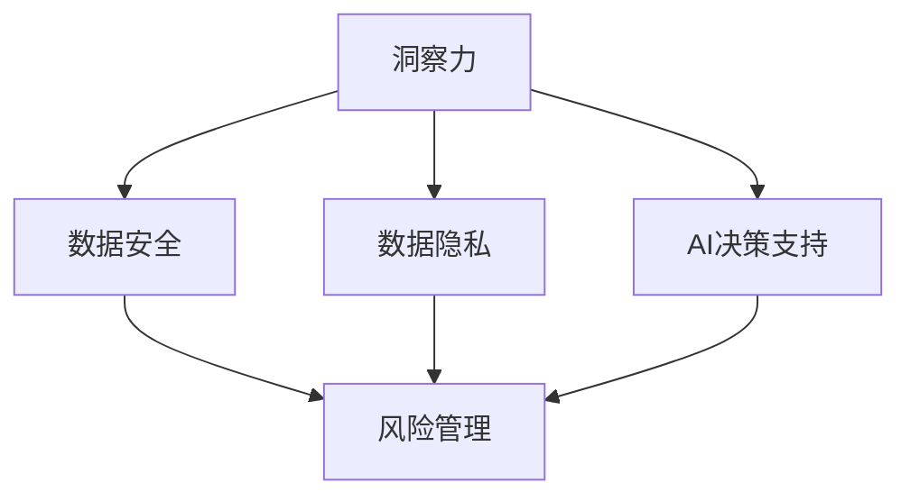

                 

# 洞察力与风险管理：预见与防范的能力

> 关键词：洞察力,风险管理,预见,防范,人工智能,决策支持系统,数据安全,数据隐私

## 1. 背景介绍

### 1.1 问题由来
在当今瞬息万变的世界中，洞察力与风险管理变得比以往任何时候都更加重要。无论是企业决策、金融投资、公共卫生还是网络安全，任何决策的失败都可能带来不可逆转的后果。人工智能(AI)技术，特别是决策支持系统，正在被广泛应用来增强决策过程的智能化水平。然而，随着AI在各个领域的深入应用，潜在的风险和挑战也随之增加，如算法偏见、数据隐私泄露、系统鲁棒性不足等。

### 1.2 问题核心关键点
本文聚焦于如何利用人工智能技术增强决策的洞察力，并探讨如何通过有效管理风险，确保AI系统的稳定性和可靠性。通过详细剖析AI在决策过程中的作用，我们探讨了AI在增强洞察力和降低风险方面的潜力和挑战。

## 2. 核心概念与联系

### 2.1 核心概念概述

为了更好地理解AI在决策中的作用和风险管理的重要性，我们先概述几个核心概念：

- **人工智能(AI)**：通过模拟人类智能，使计算机系统能够执行复杂的任务，如图像识别、自然语言处理、预测分析等。
- **决策支持系统(DSS)**：利用AI技术辅助人类做出更好的决策，特别是在不确定性高、复杂性大的场景中。
- **洞察力**：指通过数据和分析得出的深层次理解，帮助人们发现潜在的机会和问题。
- **风险管理**：识别、评估和控制风险的过程，以减少不利事件的发生概率和影响。
- **数据安全**：保护数据不被未授权访问、使用、泄露或破坏的过程。
- **数据隐私**：保护个人或组织数据不受未授权收集、使用或泄露的过程。

这些概念之间具有紧密的联系，AI技术通过提供洞察力来辅助决策，而风险管理则是为了降低决策失败的风险。数据安全和隐私保护是确保AI系统可靠性的基础，为洞察力和风险管理提供了数据保障。

### 2.2 核心概念原理和架构的 Mermaid 流程图



这个流程图展示了核心概念之间的联系。洞察力通过AI技术得到，而数据安全和隐私保护则是AI系统可靠性的基础。风险管理贯穿于整个系统，确保洞察力和AI决策支持的安全性。

## 3. 核心算法原理 & 具体操作步骤

### 3.1 算法原理概述

AI在决策支持中的作用，主要体现在以下几个方面：

- **数据处理**：AI可以处理大量数据，从中提取出有价值的信息，用于支持决策。
- **模式识别**：通过机器学习算法，AI可以识别数据中的模式，预测未来趋势，帮助决策者做出更有信息量的决策。
- **情景模拟**：AI可以模拟不同的决策情景，评估其潜在影响，从而帮助决策者选择最优方案。
- **优化算法**：AI可以优化决策过程中的资源配置、成本控制等，提升决策效率。

然而，AI系统也面临诸多风险，如算法偏见、模型过拟合、数据泄露等。有效的风险管理策略，可以帮助减少这些风险，确保AI系统能够稳定、可靠地运行。

### 3.2 算法步骤详解

AI决策支持系统的设计与运行可以分为以下几个关键步骤：

1. **需求分析**：明确决策目标和所需数据，分析决策场景的特点和需求。
2. **数据收集**：从多个来源收集数据，并进行清洗、标注和预处理。
3. **模型选择**：根据决策需求，选择合适的AI模型，如决策树、神经网络、深度学习等。
4. **模型训练**：在标注数据上训练AI模型，调整模型参数以优化性能。
5. **模型评估**：通过验证集和测试集对模型进行评估，确保其在新数据上的泛化能力。
6. **部署与监控**：将模型部署到实际应用中，并持续监控其运行情况，及时发现和解决问题。

### 3.3 算法优缺点

**优点**：

- **自动化决策**：AI可以自动化处理大量数据，生成洞察力，辅助决策。
- **高效率**：AI能够快速分析和处理数据，提升决策效率。
- **预测准确**：AI模型通过训练，可以提供高精度的预测和建议。

**缺点**：

- **数据依赖**：AI系统的性能高度依赖于数据的质量和数量。
- **算法偏见**：如果训练数据存在偏见，AI模型也可能反映这些偏见，导致不公平的决策。
- **模型过拟合**：在训练数据有限的情况下，AI模型可能过拟合，降低泛化能力。
- **透明度不足**：黑箱模型（如深度学习）往往缺乏可解释性，难以理解其内部工作机制。
- **依赖技术**：AI系统需要持续的技术支持和维护，可能增加运营成本。

### 3.4 算法应用领域

AI决策支持系统已经在多个领域得到了广泛应用，例如：

- **金融行业**：用于风险评估、投资策略、信用评分等。
- **医疗健康**：用于疾病诊断、治疗方案、临床试验优化等。
- **制造业**：用于质量控制、设备维护、供应链优化等。
- **物流运输**：用于路线规划、货物追踪、配送优化等。
- **公共安全**：用于犯罪预测、应急响应、情报分析等。

## 4. 数学模型和公式 & 详细讲解 & 举例说明

### 4.1 数学模型构建

在AI决策支持系统中，常见的数学模型包括：

- **回归模型**：用于预测连续型数值，如股票价格、销售量等。
- **分类模型**：用于预测离散型类别，如信用风险、疾病类型等。
- **聚类模型**：用于分组相似数据，如市场细分、客户分类等。
- **神经网络模型**：用于处理复杂的多层次数据关系，如图像识别、自然语言处理等。

以回归模型为例，常见的线性回归模型可以表示为：

$$y = \beta_0 + \beta_1x_1 + \beta_2x_2 + \cdots + \beta_nx_n + \epsilon$$

其中，$y$为预测值，$x_1, x_2, \cdots, x_n$为特征变量，$\beta_0, \beta_1, \cdots, \beta_n$为模型参数，$\epsilon$为误差项。

### 4.2 公式推导过程

线性回归模型的最小二乘估计公式为：

$$\hat{\beta} = (X^TX)^{-1}X^Ty$$

其中，$\hat{\beta}$为模型参数估计值，$X$为特征矩阵，$y$为实际观测值。

### 4.3 案例分析与讲解

以金融风险评估为例，我们可以使用线性回归模型预测客户的违约概率。首先需要收集客户的各类财务和行为数据，如信用评分、债务总额、还款记录等。通过最小二乘估计得到模型参数后，即可对新客户进行违约概率预测。

## 5. 项目实践：代码实例和详细解释说明

### 5.1 开发环境搭建

为了进行AI决策支持系统的开发和测试，需要准备以下开发环境：

1. **Python**：选择Python作为编程语言，因其强大的数据分析和机器学习库支持。
2. **Jupyter Notebook**：选择一个开源的Jupyter Notebook环境，便于进行数据处理、模型训练和结果展示。
3. **PyTorch或TensorFlow**：选择一种深度学习框架，进行神经网络模型的训练和推理。
4. **Pandas**：用于数据处理和清洗。
5. **Scikit-learn**：用于机器学习模型的选择和评估。

### 5.2 源代码详细实现

以下是一个简单的线性回归模型的Python代码实现，用于预测客户的违约概率：

```python
import pandas as pd
from sklearn.linear_model import LinearRegression
from sklearn.metrics import mean_squared_error

# 加载数据
data = pd.read_csv('client_data.csv')

# 准备特征和目标变量
X = data[['income', 'debt', 'credit_score']]
y = data['default']

# 训练模型
model = LinearRegression()
model.fit(X, y)

# 预测新客户的违约概率
new_customer = pd.DataFrame({'income': [50000, 60000], 'debt': [30000, 40000], 'credit_score': [700, 680]})
predictions = model.predict(new_customer)

# 评估模型性能
mse = mean_squared_error(y, predictions)
print(f'Mean Squared Error: {mse:.2f}')
```

### 5.3 代码解读与分析

**数据加载**：使用Pandas加载客户数据，将其存储为DataFrame对象。

**模型训练**：使用Scikit-learn的LinearRegression模型训练线性回归模型，将特征和目标变量作为输入。

**模型预测**：使用训练好的模型对新客户的数据进行预测。

**性能评估**：使用均方误差评估模型的预测性能，了解其在新数据上的表现。

### 5.4 运行结果展示

运行上述代码后，可以得到新客户的违约概率预测值，并输出均方误差，用于评估模型的准确性。

## 6. 实际应用场景

### 6.1 金融风险管理

在金融行业，AI决策支持系统广泛应用于风险评估和投资决策中。通过收集客户的财务和行为数据，训练模型对客户的违约概率进行预测，金融机构可以更准确地评估风险，降低不良贷款率。

**案例分析**：某银行使用线性回归模型预测客户的违约概率，通过分析历史数据，模型能够在新的客户数据上实现良好的预测效果。此外，银行还可以使用AI技术对市场趋势进行预测，调整投资组合，实现更好的收益和风险控制。

### 6.2 医疗健康决策

在医疗健康领域，AI决策支持系统用于辅助医生进行诊断和治疗决策。通过分析患者的病历、实验室检查结果和临床数据，AI可以提供诊断建议和治疗方案。

**案例分析**：某医院使用深度学习模型对癌症患者进行病理图像分析，模型能够识别病变细胞，辅助医生做出准确诊断。此外，AI还可以对治疗效果进行预测，推荐个性化的治疗方案，提升患者治愈率。

### 6.3 制造业生产优化

在制造业中，AI决策支持系统用于优化生产过程，提高生产效率和质量。通过分析生产数据，AI可以预测设备故障、优化生产计划、减少停机时间。

**案例分析**：某汽车制造公司使用AI模型对生产线进行预测性维护，模型通过分析设备传感器数据，预测设备故障，提前进行维护，避免生产中断。此外，AI还可以优化生产计划，减少生产时间和成本。

### 6.4 未来应用展望

随着AI技术的不断进步，未来的决策支持系统将更加智能化和全面化。预计未来会有以下趋势：

- **多模态数据融合**：AI系统将能够整合不同类型的数据（如文本、图像、视频等），提升决策的全面性和准确性。
- **自适应学习**：AI系统能够根据数据和反馈进行自适应学习，优化模型参数和决策策略。
- **交互式决策**：AI系统将能够与用户进行交互，提供个性化的决策建议和解释，提升用户满意度。
- **联邦学习**：AI系统能够在保护数据隐私的前提下，通过分布式计算，提升模型的泛化能力和性能。

## 7. 工具和资源推荐

### 7.1 学习资源推荐

为了帮助开发者掌握AI决策支持系统的开发和应用，以下是一些推荐的学习资源：

1. **《Python数据科学手册》**：一本详细介绍Python数据处理、机器学习等技能的书籍，适合初学者和中级开发者。
2. **Coursera上的机器学习课程**：由斯坦福大学教授Andrew Ng开设，讲解机器学习基础和常用算法。
3. **Kaggle**：一个数据科学竞赛平台，提供大量数据集和模型，适合实践和竞赛。
4. **Scikit-learn官方文档**：详细介绍了Scikit-learn库的用法和功能，适合深入学习。
5. **GitHub上的AI项目**：浏览和参考开源AI项目的代码实现，学习最佳实践。

### 7.2 开发工具推荐

为了提高AI决策支持系统的开发效率，以下是一些推荐的开发工具：

1. **Jupyter Notebook**：一个开源的交互式开发环境，适合快速原型设计和数据可视化。
2. **PyTorch和TensorFlow**：两个流行的深度学习框架，提供强大的计算能力和丰富的模型选择。
3. **Anaconda**：一个集成了Python、数据科学库等工具的发行版，便于环境搭建和管理。
4. **Google Colab**：一个基于Jupyter Notebook的云环境，免费提供GPU资源，适合大规模计算。
5. **Docker**：一个容器化平台，便于在不同环境中运行和部署AI系统。

### 7.3 相关论文推荐

以下是几篇重要的AI决策支持系统相关论文，值得深入阅读：

1. **《Gated Neural Computation》**：提出了一种使用门控神经网络进行时间序列预测的模型，应用于金融风险评估。
2. **《Deep Learning for Healthcare: A Review》**：综述了深度学习在医疗健康中的应用，包括图像识别、语音识别等。
3. **《Predictive Maintenance Using IoT Data》**：使用机器学习模型对物联网设备进行预测性维护，优化生产过程。
4. **《Federated Learning: Concepts and Findings》**：介绍了联邦学习的基本概念和应用，提升数据安全和模型泛化能力。

## 8. 总结：未来发展趋势与挑战

### 8.1 研究成果总结

本文从多个角度探讨了AI在决策支持系统中的应用和风险管理的重要性。通过理论分析和实践案例，展示了AI在增强洞察力和降低风险方面的潜力和挑战。

### 8.2 未来发展趋势

未来，AI决策支持系统将在更多领域得到广泛应用，带来深远的变革。预计会有以下发展趋势：

- **智能化决策**：AI系统将更加智能化，能够自主学习、自适应优化，提供更好的决策支持。
- **跨领域应用**：AI系统将广泛应用于不同领域，提升决策过程的全面性和准确性。
- **伦理和法律规范**：AI系统的发展将受到更多的伦理和法律约束，确保其公正、透明和安全。
- **多学科融合**：AI系统将与其他学科的知识和技术进行融合，形成更加综合的决策支持平台。

### 8.3 面临的挑战

尽管AI决策支持系统带来了诸多便利，但也面临诸多挑战：

- **数据质量和隐私**：AI系统高度依赖数据质量，数据隐私和安全问题需要重视。
- **模型复杂性**：大规模和复杂模型需要更高的计算资源和更长的训练时间。
- **技术依赖**：AI系统的开发和维护需要持续的技术支持和投入。
- **伦理和公平性**：AI系统的决策过程需要透明和可解释，避免算法偏见和歧视。
- **风险管理**：需要建立有效的风险管理机制，确保系统稳定性和可靠性。

### 8.4 研究展望

未来，AI决策支持系统需要在以下方面进行更多的研究和探索：

- **数据治理**：建立数据质量管理机制，确保数据安全和隐私保护。
- **模型透明性**：提高AI系统的可解释性和透明度，增强决策的可信度。
- **自动化优化**：开发自动化的模型优化技术，提升AI系统的效率和效果。
- **伦理和公平性**：研究如何构建公平、公正、透明的AI系统，确保其符合伦理和法律要求。
- **跨领域融合**：探索AI系统与其他学科知识的融合，提升决策支持的全面性和准确性。

## 9. 附录：常见问题与解答

**Q1: 什么是AI决策支持系统？**

A: AI决策支持系统是一种利用AI技术辅助人类做出更好决策的系统。它通过分析大量数据，提供洞察力和预测结果，帮助决策者更好地理解和应对复杂的问题。

**Q2: 如何提高AI系统的可解释性？**

A: 提高AI系统的可解释性可以从以下几个方面入手：
1. 使用简单的模型，如决策树、线性回归等，这些模型更容易解释。
2. 采用模型可视化工具，如Shapley值、LIME等，帮助理解模型的决策过程。
3. 设计透明的输入格式，如使用自然语言描述决策情境，提升模型的可解释性。

**Q3: 如何降低AI系统的风险？**

A: 降低AI系统的风险需要从以下几个方面入手：
1. 数据质量管理：确保数据完整、准确、及时，避免数据偏见。
2. 模型验证和测试：在模型训练和部署前，进行充分的验证和测试，确保模型的泛化能力。
3. 风险监控和预警：实时监控AI系统的运行状态，及时发现和处理异常情况。
4. 透明和可解释：提高AI系统的可解释性，增强决策的透明度和可信度。
5. 持续优化和更新：根据实际应用情况，不断优化和更新模型，提升系统的稳定性和可靠性。

**Q4: 如何保护数据隐私和安全？**

A: 保护数据隐私和安全需要从以下几个方面入手：
1. 数据匿名化：对敏感数据进行匿名化处理，避免泄露个人身份信息。
2. 访问控制：限制数据访问权限，确保只有授权人员才能访问数据。
3. 加密技术：对数据进行加密处理，防止未授权访问和数据泄露。
4. 监控和审计：实时监控数据访问和使用情况，记录日志，进行审计和溯源。
5. 法律法规遵循：确保数据处理和存储符合相关法律法规的要求，如GDPR、CCPA等。

---

作者：禅与计算机程序设计艺术 / Zen and the Art of Computer Programming

