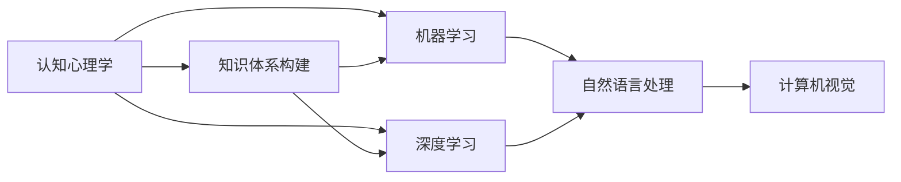

                 

# 洞察力的培养：从知识到智慧的跨越

> 关键词：洞察力,知识体系,智慧,人工智能,机器学习,深度学习,计算机视觉,自然语言处理,认知心理学,应用实践

## 1. 背景介绍

### 1.1 问题由来

在当今信息爆炸的时代，人们每天都会接触到海量的数据和知识。如何在众多信息中快速提取出有价值的洞察，成为了一个亟待解决的难题。过去，我们依赖于经验、直觉和有限的数据，但这些方法在数据规模和复杂度不断增长的今天，已经显得力不从心。

因此，如何培养和提升个人的洞察力，使其在面对复杂多变的世界时能够快速、准确地提取关键信息，做出合理决策，成为了当前技术界和应用领域的研究热点。本文将从多个角度探讨这一问题，并提出一些实用的策略和方法。

### 1.2 问题核心关键点

洞察力的培养，本质上是一个从知识到智慧的转化过程。具体而言，包括以下几个关键点：

- **知识体系构建**：掌握系统的知识体系，是培养洞察力的基础。
- **认知心理学**：理解认知过程，尤其是注意力、记忆、推理等关键能力。
- **机器学习与深度学习**：利用机器学习和深度学习技术，处理和分析大数据。
- **自然语言处理与计算机视觉**：在语言和视觉领域中，从数据中提取特征和模式。
- **智慧应用**：将知识转化为智慧，应用于实际问题解决和决策中。

这些关键点之间存在密切联系，共同构成了洞察力培养的完整框架。通过理解这些核心概念，我们可以更好地把握洞察力培养的精髓。

### 1.3 问题研究意义

培养和提升个人洞察力，不仅对个体成长具有重要意义，对于技术领域的发展也具有深远的影响：

1. **提升决策质量**：洞察力强的个人能够更快速、准确地从大量信息中提取关键点，从而做出更优的决策。
2. **促进创新**：洞察力强的团队能够从不同角度理解问题，创新解决方案，推动技术进步。
3. **增强竞争力**：在快速变化的市场环境中，洞察力强的企业能够更灵活应对变化，保持竞争优势。
4. **普及智慧应用**：洞察力培养的普及，将使得更多人能够运用技术解决实际问题，推动智慧社会的建设。
5. **提高生活质量**：洞察力的提升，能够帮助人们更好地理解世界，提高生活质量。

## 2. 核心概念与联系

### 2.1 核心概念概述

洞察力的培养涉及多个学科的交叉知识，包括认知心理学、机器学习、深度学习、自然语言处理、计算机视觉等。以下是几个关键概念的概述：

- **认知心理学**：研究人类认知过程，包括注意力、记忆、推理等。
- **知识体系**：系统化的知识结构，包括事实、理论、方法论等。
- **机器学习与深度学习**：从数据中学习规律和模式的技术，广泛应用于图像、文本等领域的分析。
- **自然语言处理(NLP)**：使计算机能够理解、处理和生成人类语言的技术。
- **计算机视觉**：使计算机能够理解和解释图像、视频等视觉数据的技术。

这些核心概念之间的关系可以通过以下Mermaid流程图来展示：



这个流程图展示了各概念之间的逻辑关系：

1. 认知心理学是理解人类认知过程的基础，有助于构建系统的知识体系。
2. 机器学习和深度学习提供了处理大数据和复杂问题的方法，是知识体系中重要的一部分。
3. NLP和计算机视觉是知识体系中关于理解和处理语言、视觉数据的具体技术。

## 3. 核心算法原理 & 具体操作步骤

### 3.1 算法原理概述

洞察力的培养，本质上是一个数据驱动的决策过程。具体来说，包括以下几个步骤：

1. **数据收集**：从不同的数据源中收集信息，形成数据集。
2. **数据处理**：对数据进行清洗、预处理、特征提取等，准备模型训练。
3. **模型训练**：利用机器学习和深度学习模型，从数据中学习规律和模式。
4. **知识提取**：从模型中提取关键特征和模式，构建知识体系。
5. **应用实践**：将知识体系应用于实际问题解决和决策中，检验和优化。

### 3.2 算法步骤详解

#### 3.2.1 数据收集

数据收集是洞察力培养的基础。需要从不同的数据源中获取信息，包括但不限于：

- **公开数据集**：如IMDB电影评论数据集、Yelp餐厅评论数据集等。
- **Web爬虫**：从互联网中抓取相关信息，如新闻、社交媒体内容等。
- **API接口**：从第三方服务中获取数据，如Google Maps API、Twitter API等。
- **传感器数据**：从物联网设备中获取实时数据，如温度、湿度、位置等。

#### 3.2.2 数据处理

数据处理包括数据清洗、预处理、特征提取等步骤，具体如下：

- **数据清洗**：去除重复、噪声、缺失值等，确保数据质量。
- **数据预处理**：对数据进行标准化、归一化、分词、分句等处理，准备模型训练。
- **特征提取**：利用NLP、深度学习等技术，从文本、图像中提取关键特征。

#### 3.2.3 模型训练

模型训练是洞察力培养的核心步骤。需要选择合适的模型，并在数据集上训练：

- **NLP模型**：如BERT、GPT、LSTM等，用于处理文本数据。
- **计算机视觉模型**：如CNN、ResNet、Transformer等，用于处理图像数据。
- **深度学习模型**：如Autoencoder、GAN等，用于处理复杂问题。
- **监督学习与无监督学习**：选择合适的学习方式，充分利用标注数据和非标注数据。

#### 3.2.4 知识提取

知识提取是将模型输出的特征和模式转化为可理解的知识体系。具体方法包括：

- **主题建模**：如LDA、LSA等，从文本中提取主题。
- **概念抽取**：利用规则或算法，从数据中提取关键概念。
- **模式识别**：识别数据中的规律和模式，形成规则和模型。
- **知识图谱**：构建知识图谱，将数据中的实体、关系、属性等结构化。

#### 3.2.5 应用实践

应用实践是将知识体系应用于实际问题解决和决策中，具体步骤包括：

- **问题定义**：明确需要解决的问题，如客户满意度分析、市场趋势预测等。
- **模型选择**：根据问题特性，选择最合适的模型。
- **数据应用**：将知识体系应用于实际数据，进行推理和决策。
- **效果评估**：评估模型效果，反馈优化。

### 3.3 算法优缺点

洞察力培养的算法具有以下优点：

1. **数据驱动**：通过大数据分析，发现数据中的规律和模式，避免主观偏见。
2. **系统化**：利用知识体系构建，提高决策的系统和准确性。
3. **可解释性**：通过模型输出和特征提取，提高决策的可解释性。
4. **泛化能力**：利用机器学习和深度学习技术，模型能够泛化到新数据。

但同时也存在一些缺点：

1. **计算资源要求高**：处理大数据和复杂模型需要高计算资源。
2. **数据隐私问题**：处理敏感数据时需要考虑隐私保护。
3. **模型复杂性**：模型复杂度高，难以解释和维护。
4. **算法局限性**：某些数据和问题可能超出现有算法的处理能力。

### 3.4 算法应用领域

洞察力培养的算法广泛应用于多个领域，具体包括：

- **自然语言处理**：如情感分析、文本分类、机器翻译等。
- **计算机视觉**：如图像识别、视频分析、场景理解等。
- **金融分析**：如市场预测、风险评估、欺诈检测等。
- **医疗健康**：如疾病预测、诊断、治疗方案推荐等。
- **市场营销**：如客户行为分析、广告推荐、市场趋势预测等。

## 4. 数学模型和公式 & 详细讲解 & 举例说明

### 4.1 数学模型构建

洞察力的培养，可以通过数学模型来建模和分析。以下是一个简单的数学模型示例：

假设有一组数据集 $D=\{(x_i,y_i)\}_{i=1}^N$，其中 $x_i$ 为输入特征，$y_i$ 为输出标签。目标是找到一个函数 $f(x)$，使得 $f(x_i)=y_i$。

一个简单的线性回归模型为：

$$
f(x)=w_0+w_1x_1+w_2x_2+\cdots+w_nx_n
$$

其中 $w_i$ 为权重，$x_i$ 为特征。

### 4.2 公式推导过程

#### 4.2.1 线性回归模型

假设有一组数据集 $D=\{(x_i,y_i)\}_{i=1}^N$，其中 $x_i$ 为输入特征，$y_i$ 为输出标签。目标是找到一个函数 $f(x)$，使得 $f(x_i)=y_i$。

一个简单的线性回归模型为：

$$
f(x)=w_0+w_1x_1+w_2x_2+\cdots+w_nx_n
$$

其中 $w_i$ 为权重，$x_i$ 为特征。

目标是最小化损失函数：

$$
\mathcal{L}(w)=\frac{1}{2N}\sum_{i=1}^N (y_i-f(x_i))^2
$$

利用梯度下降等优化算法，求解最优权重 $w_i$：

$$
w_i=\mathop{\arg\min}_{w_i} \mathcal{L}(w)
$$

通过求导和迭代优化，可以得到最终的权重值。

#### 4.2.2 深度学习模型

深度学习模型如卷积神经网络（CNN）和循环神经网络（RNN），可以用于处理复杂的非线性关系。

以CNN为例，其基本结构为：

$$
f(x)=h(Wx+b)
$$

其中 $W$ 为权重矩阵，$b$ 为偏置向量，$h$ 为激活函数（如ReLU）。

### 4.3 案例分析与讲解

#### 4.3.1 情感分析

情感分析是NLP中的一个经典任务，利用模型分析文本的情感倾向。

以情感分析为例，假设有一组电影评论数据集，目标是预测每条评论的情感倾向（正向、负向或中性）。

可以构建一个简单的RNN模型，对每个词进行编码，然后将编码结果输入到RNN中，得到最终的情感得分。

具体步骤如下：

1. **数据预处理**：对文本进行分词、向量化等处理。
2. **模型构建**：利用RNN模型，将每个词的编码输入到RNN中。
3. **输出预测**：利用softmax函数，预测每个评论的情感得分。

## 5. 项目实践：代码实例和详细解释说明

### 5.1 开发环境搭建

在进行洞察力培养的实践时，需要搭建相应的开发环境。以下是Python环境中的一些基本配置步骤：

1. **安装Python**：从官网下载并安装Python 3.x版本。
2. **安装Pandas**：利用pip安装Pandas库，用于数据处理和分析。
3. **安装Numpy**：利用pip安装Numpy库，用于数值计算。
4. **安装Scikit-Learn**：利用pip安装Scikit-Learn库，用于机器学习和深度学习模型的训练。
5. **安装TensorFlow**：利用pip安装TensorFlow库，用于深度学习模型的实现。
6. **安装Keras**：利用pip安装Keras库，用于快速构建深度学习模型。

### 5.2 源代码详细实现

#### 5.2.1 线性回归模型

首先，导入必要的库：

```python
import numpy as np
from sklearn.linear_model import LinearRegression
from sklearn.metrics import mean_squared_error
```

然后，构建线性回归模型：

```python
# 构建线性回归模型
X = np.array([[1], [2], [3], [4], [5]])
y = np.array([2, 4, 6, 8, 10])
model = LinearRegression()

# 训练模型
model.fit(X, y)
```

最后，预测和评估模型：

```python
# 预测结果
X_test = np.array([[6], [7], [8]])
y_pred = model.predict(X_test)
print("预测结果：", y_pred)

# 评估模型
y_test = np.array([12, 14, 16])
mse = mean_squared_error(y_test, y_pred)
print("均方误差：", mse)
```

#### 5.2.2 卷积神经网络模型

接下来，构建一个简单的卷积神经网络模型，用于图像分类任务。

首先，导入必要的库：

```python
import tensorflow as tf
from tensorflow import keras
```

然后，构建CNN模型：

```python
# 构建CNN模型
model = keras.Sequential([
    keras.layers.Conv2D(32, (3, 3), activation='relu', input_shape=(28, 28, 1)),
    keras.layers.MaxPooling2D((2, 2)),
    keras.layers.Flatten(),
    keras.layers.Dense(10, activation='softmax')
])

# 编译模型
model.compile(optimizer='adam', loss='sparse_categorical_crossentropy', metrics=['accuracy'])

# 加载数据集
mnist = keras.datasets.mnist
(x_train, y_train), (x_test, y_test) = mnist.load_data()
x_train, x_test = x_train / 255.0, x_test / 255.0

# 训练模型
model.fit(x_train, y_train, epochs=5, batch_size=64)
```

最后，评估模型：

```python
# 评估模型
test_loss, test_acc = model.evaluate(x_test, y_test)
print('Test accuracy:', test_acc)
```

### 5.3 代码解读与分析

#### 5.3.1 线性回归模型

在线性回归模型的代码中，我们使用了Scikit-Learn库中的LinearRegression模型。首先，导入必要的库和数据。然后，构建模型并进行训练。最后，利用测试数据集进行预测和评估。

#### 5.3.2 卷积神经网络模型

在CNN模型的代码中，我们使用了TensorFlow和Keras库。首先，导入必要的库和数据集。然后，构建CNN模型并进行编译。最后，加载数据集并进行训练和评估。

## 6. 实际应用场景

### 6.1 金融风险管理

金融风险管理是洞察力培养的一个典型应用场景。金融机构需要实时监控市场动态，预测和评估各种风险。

具体而言，可以利用NLP技术处理新闻、社交媒体等非结构化数据，利用计算机视觉技术处理交易数据、市场数据等结构化数据，构建综合模型进行风险预测和评估。

#### 6.1.1 数据收集

- **新闻数据**：通过Web爬虫收集新闻数据，如金融新闻、经济新闻等。
- **社交媒体数据**：通过API接口收集社交媒体数据，如Twitter、Facebook等。
- **交易数据**：从交易所获取交易数据，如股票、期货、外汇等。
- **市场数据**：从第三方服务获取市场数据，如GDP、通货膨胀率等。

#### 6.1.2 数据处理

- **数据清洗**：去除噪声、重复、缺失值等，确保数据质量。
- **数据预处理**：对数据进行标准化、归一化、分词、分句等处理，准备模型训练。
- **特征提取**：利用NLP、深度学习等技术，从文本、图像中提取关键特征。

#### 6.1.3 模型训练

- **NLP模型**：如BERT、GPT、LSTM等，用于处理文本数据。
- **计算机视觉模型**：如CNN、ResNet、Transformer等，用于处理图像数据。
- **深度学习模型**：如Autoencoder、GAN等，用于处理复杂问题。
- **监督学习与无监督学习**：选择合适的学习方式，充分利用标注数据和非标注数据。

#### 6.1.4 知识提取

- **主题建模**：如LDA、LSA等，从文本中提取主题。
- **概念抽取**：利用规则或算法，从数据中提取关键概念。
- **模式识别**：识别数据中的规律和模式，形成规则和模型。
- **知识图谱**：构建知识图谱，将数据中的实体、关系、属性等结构化。

#### 6.1.5 应用实践

- **问题定义**：明确需要解决的问题，如市场预测、风险评估、欺诈检测等。
- **模型选择**：根据问题特性，选择最合适的模型。
- **数据应用**：将知识体系应用于实际数据，进行推理和决策。
- **效果评估**：评估模型效果，反馈优化。

### 6.2 医疗健康

医疗健康领域是洞察力培养的另一个重要应用场景。医疗健康数据具有高维度、高噪声的特点，难以直接应用。

具体而言，可以利用NLP技术处理电子病历、临床报告等文本数据，利用计算机视觉技术处理影像数据，构建综合模型进行疾病预测、诊断和治疗方案推荐。

#### 6.2.1 数据收集

- **电子病历数据**：从医院获取电子病历数据，如患者的病史、体检记录等。
- **临床报告数据**：从医院获取临床报告数据，如X光片、CT扫描等。
- **患者数据**：从医院获取患者数据，如年龄、性别、病史等。

#### 6.2.2 数据处理

- **数据清洗**：去除噪声、重复、缺失值等，确保数据质量。
- **数据预处理**：对数据进行标准化、归一化、分词、分句等处理，准备模型训练。
- **特征提取**：利用NLP、深度学习等技术，从文本、图像中提取关键特征。

#### 6.2.3 模型训练

- **NLP模型**：如BERT、GPT、LSTM等，用于处理文本数据。
- **计算机视觉模型**：如CNN、ResNet、Transformer等，用于处理图像数据。
- **深度学习模型**：如Autoencoder、GAN等，用于处理复杂问题。
- **监督学习与无监督学习**：选择合适的学习方式，充分利用标注数据和非标注数据。

#### 6.2.4 知识提取

- **主题建模**：如LDA、LSA等，从文本中提取主题。
- **概念抽取**：利用规则或算法，从数据中提取关键概念。
- **模式识别**：识别数据中的规律和模式，形成规则和模型。
- **知识图谱**：构建知识图谱，将数据中的实体、关系、属性等结构化。

#### 6.2.5 应用实践

- **问题定义**：明确需要解决的问题，如疾病预测、诊断、治疗方案推荐等。
- **模型选择**：根据问题特性，选择最合适的模型。
- **数据应用**：将知识体系应用于实际数据，进行推理和决策。
- **效果评估**：评估模型效果，反馈优化。

## 7. 工具和资源推荐

### 7.1 学习资源推荐

为了帮助开发者系统掌握洞察力培养的理论基础和实践技巧，这里推荐一些优质的学习资源：

1. **《深入浅出机器学习》**：李航著，介绍了机器学习的基本概念和算法。
2. **《深度学习》**：Ian Goodfellow、Yoshua Bengio和Aaron Courville著，介绍了深度学习的基本理论和应用。
3. **《Python机器学习》**：Sebastian Raschka著，介绍了Python在机器学习中的应用。
4. **《自然语言处理综论》**：Denny Britz著，介绍了NLP的基本概念和应用。
5. **《计算机视觉：算法与应用》**：Richard Szeliski著，介绍了计算机视觉的基本概念和算法。

通过对这些资源的学习实践，相信你一定能够快速掌握洞察力培养的精髓，并用于解决实际的NLP问题。

### 7.2 开发工具推荐

高效的开发离不开优秀的工具支持。以下是几款用于洞察力培养开发的常用工具：

1. **Jupyter Notebook**：用于编写、执行和分享Python代码。
2. **TensorBoard**：用于可视化模型训练过程中的各种指标，如损失、准确率、参数更新等。
3. **PyTorch**：用于深度学习和机器学习任务的开发。
4. **Keras**：用于快速构建深度学习模型。
5. **Scikit-Learn**：用于机器学习任务的开发。
6. **Pandas**：用于数据处理和分析。

合理利用这些工具，可以显著提升洞察力培养的开发效率，加快创新迭代的步伐。

### 7.3 相关论文推荐

洞察力培养的研究源于学界的持续研究。以下是几篇奠基性的相关论文，推荐阅读：

1. **《深度学习》**：Ian Goodfellow、Yoshua Bengio和Aaron Courville著，介绍了深度学习的基本理论和应用。
2. **《自然语言处理综论》**：Denny Britz著，介绍了NLP的基本概念和应用。
3. **《计算机视觉：算法与应用》**：Richard Szeliski著，介绍了计算机视觉的基本概念和算法。
4. **《统计学习方法》**：李航著，介绍了统计学习的基本概念和算法。
5. **《机器学习：原理、算法与应用》**：周志华著，介绍了机器学习的基本概念和算法。

这些论文代表了大数据处理和人工智能领域的最新进展，通过学习这些前沿成果，可以帮助研究者把握学科前进方向，激发更多的创新灵感。

## 8. 总结：未来发展趋势与挑战

### 8.1 总结

本文对洞察力培养的过程进行了全面系统的介绍。首先，阐述了洞察力培养的重要性，明确了其作为从知识到智慧转化过程的核心地位。其次，从多个角度探讨了洞察力培养的实现方法，包括数据收集、数据处理、模型训练、知识提取和应用实践等关键步骤。

通过本文的系统梳理，可以看到，洞察力培养是一个多学科交叉、多技术融合的过程，需要系统化的知识体系、高效的计算资源和先进的技术手段。利用这些工具和技术，我们能够将复杂的知识转化为智慧，应用于实际问题解决和决策中，从而提高决策的效率和准确性。

### 8.2 未来发展趋势

展望未来，洞察力培养将呈现以下几个发展趋势：

1. **大数据驱动**：随着数据量的不断增长，大数据驱动的洞察力培养将进一步发展。利用更先进的数据处理和分析技术，从海量数据中提取有价值的洞察。
2. **跨学科融合**：洞察力培养将更加注重跨学科融合，利用认知心理学、计算机科学、统计学等领域的最新进展，提升洞察力的培养效果。
3. **个性化定制**：洞察力培养将更加注重个性化定制，根据不同用户的需求，提供定制化的洞察。
4. **智慧应用**：洞察力培养将更加注重智慧应用，利用先进的AI技术，解决实际问题，提升决策的智能化水平。
5. **可解释性**：洞察力培养将更加注重可解释性，提高模型的透明度和可理解性，增强用户信任和接受度。
6. **持续学习**：洞察力培养将更加注重持续学习，利用新数据和新知识，不断优化和提升洞察力的培养效果。

### 8.3 面临的挑战

尽管洞察力培养已经取得了一定的进展，但在迈向更加智能化、普适化应用的过程中，仍面临诸多挑战：

1. **数据质量问题**：高质量的数据是洞察力培养的基础，但数据获取、处理和清洗的难度仍然很大。如何高效、可靠地获取和处理数据，是当前面临的主要挑战。
2. **算法复杂性**：洞察力培养的算法复杂度较高，难以解释和维护。如何简化算法，提高模型的可解释性，是当前面临的重要问题。
3. **计算资源限制**：洞察力培养需要高性能的计算资源，但现有资源往往难以满足大规模数据处理和复杂模型训练的需求。如何优化资源配置，提高计算效率，是当前面临的关键挑战。
4. **隐私和安全问题**：洞察力培养中涉及大量敏感数据，数据隐私和安全问题尤为突出。如何保护数据隐私，防止数据泄露，是当前面临的重大挑战。
5. **跨领域应用**：洞察力培养的跨领域应用难度较大，不同领域的知识体系和应用场景差异较大。如何在不同领域中推广和应用洞察力培养技术，是当前面临的重要问题。

### 8.4 研究展望

面对洞察力培养面临的种种挑战，未来的研究需要在以下几个方面寻求新的突破：

1. **数据处理技术**：开发高效、可靠的数据处理技术，提高数据质量和获取效率。
2. **算法简化**：简化洞察力培养的算法，提高模型的可解释性和易用性。
3. **资源优化**：优化计算资源配置，提高计算效率和资源利用率。
4. **隐私保护技术**：开发先进的隐私保护技术，确保数据隐私和安全。
5. **跨领域应用**：推动洞察力培养技术的跨领域应用，在不同领域中推广和应用。
6. **智慧应用**：将洞察力培养技术与实际问题结合，推动智慧应用的落地和普及。

这些研究方向的探索，将引领洞察力培养技术的进一步发展，为构建更加智能化、普适化的系统提供新的思路和工具。面向未来，洞察力培养技术将与更多前沿技术结合，如自然语言处理、计算机视觉、认知心理学等，共同推动人工智能技术的发展。

## 9. 附录：常见问题与解答

**Q1：如何培养洞察力？**

A: 培养洞察力需要系统化的知识体系和高效的计算资源。以下是一些具体的建议：

1. **数据驱动**：通过大数据分析，发现数据中的规律和模式。
2. **系统学习**：掌握系统化的知识体系，包括事实、理论、方法论等。
3. **跨学科融合**：利用认知心理学、计算机科学、统计学等领域的最新进展，提升洞察力的培养效果。
4. **持续学习**：利用新数据和新知识，不断优化和提升洞察力的培养效果。

**Q2：洞察力培养的算法有哪些？**

A: 洞察力培养的算法包括但不限于：

1. **线性回归模型**：用于处理简单线性关系的数据。
2. **卷积神经网络模型**：用于处理图像和序列数据。
3. **循环神经网络模型**：用于处理序列数据。
4. **深度学习模型**：如Autoencoder、GAN等，用于处理复杂问题。
5. **知识图谱**：用于构建知识体系，提供结构化信息。

**Q3：洞察力培养的计算资源要求高吗？**

A: 是的，洞察力培养需要高性能的计算资源，处理大数据和复杂模型需要高计算资源。通常需要GPU或TPU等高性能设备。

**Q4：洞察力培养的数据隐私问题如何处理？**

A: 处理敏感数据时需要考虑隐私保护，可以采用数据匿名化、差分隐私等技术，确保数据隐私和安全。

**Q5：洞察力培养的跨领域应用难度大吗？**

A: 是的，洞察力培养的跨领域应用难度较大，不同领域的知识体系和应用场景差异较大。需要在不同领域中推广和应用洞察力培养技术。

---

作者：禅与计算机程序设计艺术 / Zen and the Art of Computer Programming

