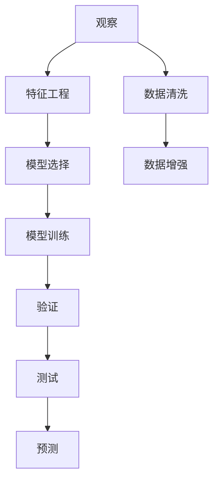

                 

# 洞察力的培养：从观察到预测的飞跃

> 关键词：洞察力,观察,预测,机器学习,深度学习,模型训练,特征工程

## 1. 背景介绍

### 1.1 问题由来
在当今这个信息爆炸的时代，数据无处不在，如何从海量数据中提取有价值的洞察，是各行各业都在面临的重要挑战。洞察力（Insight），是指通过数据分析和建模，从观察到的数据中揭示出潜在的规律和趋势，从而进行预测和决策。这种能力在大数据、人工智能（AI）和机器学习（ML）领域尤为关键。

### 1.2 问题核心关键点
洞察力培养的核心关键点在于：
- **数据质量**：高质量的数据是洞察力培养的基础，包括数据的完整性、一致性、准确性和及时性。
- **模型选择**：选择适合的模型，通过训练学习到数据中的规律，并进行预测。
- **特征工程**：设计有效的特征，提高模型的泛化能力和预测精度。
- **结果解释**：解释模型的输出，使洞察力具备可解释性和可信度。
- **迭代优化**：通过持续迭代，不断优化模型和数据，提升洞察力的准确性和及时性。

### 1.3 问题研究意义
洞察力培养对于提升决策的科学性和准确性、优化运营效率、增强竞争力等方面具有重要意义：
- **决策支持**：通过数据分析，提供客观、可验证的决策支持，减少主观偏差。
- **运营优化**：通过洞察力分析，优化流程、资源配置，提升效率和效益。
- **市场预测**：通过洞察力分析，预测市场趋势和需求变化，指导战略制定和资源配置。
- **风险管理**：通过洞察力分析，识别和管理潜在的风险，保障业务稳健运行。

## 2. 核心概念与联系

### 2.1 核心概念概述

为了更好地理解洞察力的培养过程，本节将介绍几个关键概念：

- **观察（Observation）**：从环境中收集到的原始数据，是洞察力的起点。
- **特征（Feature）**：从原始数据中提取的、对模型预测有贡献的元素。
- **模型（Model）**：通过训练得到的数学函数，用于预测新数据。
- **预测（Prediction）**：利用模型对未来事件进行的估计。
- **训练（Training）**：通过历史数据，优化模型参数，提高预测精度。
- **验证（Validation）**：评估模型在新数据上的泛化能力，防止过拟合。
- **测试（Testing）**：对模型进行最终评估，确保其可靠性和实用性。

这些概念之间的逻辑关系可以通过以下Mermaid流程图来展示：



这个流程图展示了我从观察到预测的基本流程：

1. 收集观察数据。
2. 进行特征工程，提取有意义的特征。
3. 选择适合模型的算法。
4. 通过训练数据训练模型。
5. 在验证数据上评估模型性能。
6. 在测试数据上最终评估模型效果。
7. 利用训练好的模型进行预测。

## 3. 核心算法原理 & 具体操作步骤
### 3.1 算法原理概述

洞察力培养的算法原理主要基于机器学习和深度学习，通过模型对数据的拟合，实现从观察到预测的飞跃。

假设我们有一组训练数据 $D=\{(x_i,y_i)\}_{i=1}^N$，其中 $x_i$ 是观察到的特征向量，$y_i$ 是目标变量。我们的目标是通过训练一个模型 $M$，使得模型能够对新的输入数据 $x$ 进行预测 $\hat{y}=M(x)$。

常用的机器学习模型包括线性回归、决策树、随机森林、支持向量机（SVM）等。深度学习模型包括神经网络、卷积神经网络（CNN）、循环神经网络（RNN）等。这些模型通过历史数据进行训练，学习数据的规律，从而进行预测。

### 3.2 算法步骤详解

洞察力培养的算法步骤主要包括：

**Step 1: 数据收集与预处理**
- 收集与问题相关的原始数据，包括结构化数据、非结构化数据、时间序列数据等。
- 进行数据清洗，处理缺失值、异常值、重复值等。
- 进行数据增强，如数据合成、数据扩充等。

**Step 2: 特征工程**
- 特征选择：选择对预测有贡献的特征。
- 特征提取：将原始数据转换为模型可接受的格式，如数值化、编码化等。
- 特征变换：对特征进行归一化、标准化、对数变换等，提高模型性能。

**Step 3: 模型选择与训练**
- 选择适合问题的模型，如线性回归、决策树、神经网络等。
- 通过历史数据训练模型，调整模型参数，最小化预测误差。

**Step 4: 模型验证与优化**
- 在验证数据集上评估模型性能，如准确率、召回率、F1分数等。
- 调整模型参数，优化模型结构，防止过拟合。

**Step 5: 模型测试与部署**
- 在测试数据集上最终评估模型性能，确保其稳定性和可靠性。
- 将模型部署到实际应用中，进行预测和决策。

### 3.3 算法优缺点

洞察力培养的算法具有以下优点：
1. 自动化程度高：通过机器学习和深度学习算法，能够自动提取数据中的规律和趋势。
2. 泛化能力强：利用历史数据训练模型，能够在新数据上进行泛化预测。
3. 可解释性强：模型的输出结果可以通过特征重要性分析、模型解释等方法进行解释。
4. 可复用性强：训练好的模型可以多次使用，应用于不同的预测任务。

同时，该算法也存在一定的局限性：
1. 数据依赖性强：模型的性能依赖于高质量、完整的训练数据。
2. 模型复杂度高：深度学习模型参数量较大，训练和预测速度较慢。
3. 结果解释性差：部分深度学习模型，如神经网络，其预测结果较难解释。
4. 模型鲁棒性差：对数据中的噪声和异常值较为敏感，易产生误判。

### 3.4 算法应用领域

洞察力培养的算法在多个领域得到了广泛应用，包括但不限于：

- **金融预测**：利用历史数据进行股票价格预测、信用风险评估等。
- **医疗诊断**：通过患者的历史数据进行疾病诊断、治疗方案推荐等。
- **电商推荐**：基于用户的历史行为数据进行商品推荐、用户画像构建等。
- **交通预测**：通过历史交通数据进行交通流量预测、事故预警等。
- **社交网络分析**：通过用户互动数据进行关系推荐、趋势预测等。

## 4. 数学模型和公式 & 详细讲解
### 4.1 数学模型构建

以线性回归模型为例，其数学模型构建如下：

假设数据集 $D=\{(x_i,y_i)\}_{i=1}^N$，其中 $x_i \in \mathbb{R}^n$ 为特征向量，$y_i \in \mathbb{R}$ 为目标变量。线性回归模型的目标是最小化预测误差：

$$
\min_{\theta} \sum_{i=1}^N (y_i - \theta^T x_i)^2
$$

其中 $\theta$ 为模型参数，$y_i = \theta^T x_i$ 为模型预测结果。

### 4.2 公式推导过程

线性回归模型的最小二乘法求解公式为：

$$
\theta = (X^T X)^{-1} X^T Y
$$

其中 $X = [x_1, x_2, ..., x_n]$ 为特征矩阵，$Y = [y_1, y_2, ..., y_n]^T$ 为目标向量。

推导过程如下：

1. 构建目标函数：
$$
\mathcal{L}(\theta) = \frac{1}{2N} \sum_{i=1}^N (y_i - \theta^T x_i)^2
$$

2. 对 $\theta$ 求导，得到梯度：
$$
\nabla_{\theta} \mathcal{L}(\theta) = \frac{1}{N} X^T (X \theta - Y)
$$

3. 设置梯度为0，求解 $\theta$：
$$
X^T X \theta = X^T Y
$$
$$
\theta = (X^T X)^{-1} X^T Y
$$

### 4.3 案例分析与讲解

以房价预测为例，假设我们有一组历史房价数据，特征包括房间数量、面积、地理位置等，目标变量为房价。通过线性回归模型，我们可以训练一个预测房价的模型。具体步骤如下：

1. 数据收集与预处理：收集历史房价数据，并进行数据清洗和特征工程。
2. 模型选择与训练：选择线性回归模型，通过训练数据训练模型。
3. 模型验证与优化：在验证数据集上评估模型性能，调整模型参数。
4. 模型测试与部署：在测试数据集上最终评估模型性能，部署模型进行房价预测。

通过模型预测，我们可以对新的房屋价格进行预测，从而指导购房决策。

## 5. 项目实践：代码实例和详细解释说明
### 5.1 开发环境搭建

在进行洞察力培养的项目实践前，我们需要准备好开发环境。以下是使用Python进行Scikit-learn开发的环境配置流程：

1. 安装Anaconda：从官网下载并安装Anaconda，用于创建独立的Python环境。

2. 创建并激活虚拟环境：
```bash
conda create -n sklearn-env python=3.8 
conda activate sklearn-env
```

3. 安装Scikit-learn：
```bash
pip install scikit-learn
```

4. 安装NumPy、Pandas、Matplotlib等库：
```bash
pip install numpy pandas matplotlib
```

5. 安装Jupyter Notebook：
```bash
pip install jupyter notebook
```

完成上述步骤后，即可在`sklearn-env`环境中开始洞察力培养的项目实践。

### 5.2 源代码详细实现

下面我们以房价预测为例，给出使用Scikit-learn进行线性回归的Python代码实现。

```python
from sklearn.linear_model import LinearRegression
from sklearn.model_selection import train_test_split
from sklearn.metrics import mean_squared_error
import pandas as pd

# 读取数据
data = pd.read_csv('house_prices.csv')

# 数据预处理
X = data[['rooms', 'area', 'location']]
y = data['price']

# 划分训练集和测试集
X_train, X_test, y_train, y_test = train_test_split(X, y, test_size=0.2, random_state=42)

# 训练模型
model = LinearRegression()
model.fit(X_train, y_train)

# 预测测试集
y_pred = model.predict(X_test)

# 评估模型
mse = mean_squared_error(y_test, y_pred)
print('Mean Squared Error:', mse)
```

以上就是使用Scikit-learn进行线性回归的完整代码实现。可以看到，Scikit-learn库封装了机器学习模型的训练和评估过程，使得代码实现变得简洁高效。

### 5.3 代码解读与分析

让我们再详细解读一下关键代码的实现细节：

**数据预处理**
- 使用Pandas库读取数据文件。
- 选择特征和目标变量，X为特征矩阵，y为目标向量。

**模型训练**
- 使用Scikit-learn库中的LinearRegression类创建线性回归模型。
- 使用训练数据训练模型，调用fit方法。

**模型预测**
- 在测试集上进行预测，使用predict方法。

**模型评估**
- 计算预测值与真实值之间的均方误差，评估模型性能。

以上步骤展示了机器学习模型的基本流程，包括数据预处理、模型训练、预测和评估。

## 6. 实际应用场景
### 6.1 金融预测

洞察力培养的算法在金融领域得到了广泛应用，主要用于股票价格预测、信用风险评估等。通过历史数据进行模型训练，预测未来的市场趋势，指导投资决策。

### 6.2 医疗诊断

医疗领域通过洞察力培养的算法，可以基于患者的历史数据进行疾病诊断、治疗方案推荐等。利用医疗大数据，提高医疗服务的精准度和效率。

### 6.3 电商推荐

电商推荐系统利用用户的历史行为数据，通过洞察力培养的算法，进行商品推荐、用户画像构建等。提升用户体验，增加销售额。

### 6.4 交通预测

交通领域利用历史交通数据，进行交通流量预测、事故预警等。通过洞察力培养的算法，优化交通管理，提升城市运营效率。

### 6.5 社交网络分析

社交网络分析利用用户互动数据，进行关系推荐、趋势预测等。通过洞察力培养的算法，挖掘社交网络中的潜在价值，提升用户粘性和平台活跃度。

## 7. 工具和资源推荐
### 7.1 学习资源推荐

为了帮助开发者系统掌握洞察力培养的理论基础和实践技巧，这里推荐一些优质的学习资源：

1. 《机器学习》书籍：西瓜书，全面介绍了机器学习的理论和算法，适合入门学习。
2. 《深度学习》书籍：花书，深入浅出地介绍了深度学习的原理和实践，适合进阶学习。
3. Coursera《机器学习》课程：斯坦福大学开设的课程，提供丰富的视频和作业，帮助理解机器学习的核心概念。
4. Kaggle数据科学竞赛：通过参与竞赛，实战练兵，提升数据处理和建模能力。
5. Scikit-learn官方文档：Scikit-learn库的官方文档，提供了详尽的API文档和案例示例。

通过对这些资源的学习实践，相信你一定能够快速掌握洞察力培养的精髓，并用于解决实际的数据分析问题。

### 7.2 开发工具推荐

高效的开发离不开优秀的工具支持。以下是几款用于洞察力培养开发的常用工具：

1. Jupyter Notebook：免费的交互式开发环境，支持Python、R等编程语言。
2. Scikit-learn：Python机器学习库，封装了多种常用算法，便于快速实现机器学习项目。
3. TensorFlow：由Google主导开发的深度学习框架，支持GPU加速，适合大规模模型训练。
4. PyTorch：Facebook开发的深度学习框架，支持动态计算图，适合研究和原型开发。
5. Keras：高层次的深度学习框架，易于上手，适合快速原型开发。

合理利用这些工具，可以显著提升洞察力培养任务的开发效率，加快创新迭代的步伐。

### 7.3 相关论文推荐

洞察力培养的研究源于学界的持续探索。以下是几篇奠基性的相关论文，推荐阅读：

1. "Linear Regression"：统计学中的经典回归模型，奠定了机器学习基础。
2. "Support Vector Machines"：支持向量机，一种常用的分类和回归算法。
3. "Deep Learning"：深度学习框架的介绍，帮助理解深度学习的实现和应用。
4. "Neural Networks and Deep Learning"：深度学习领域的经典教材，适合深入学习。
5. "An Introduction to Statistical Learning"：统计学习基础，适合理解机器学习算法的原理和实现。

这些论文代表了大数据和机器学习领域的核心思想，通过学习这些前沿成果，可以帮助研究者把握学科前进方向，激发更多的创新灵感。

## 8. 总结：未来发展趋势与挑战

### 8.1 总结

本文对洞察力培养的算法进行了全面系统的介绍。首先阐述了洞察力培养的背景和意义，明确了数据、模型、特征、预测等核心概念。其次，从原理到实践，详细讲解了机器学习和深度学习模型，给出了洞察力培养的完整代码实例。同时，本文还探讨了洞察力培养在金融、医疗、电商等多个领域的应用场景，展示了其广泛的应用前景。最后，本文精选了洞察力培养的学习资源和开发工具，力求为读者提供全方位的技术指引。

通过本文的系统梳理，可以看到，洞察力培养作为大数据和机器学习领域的重要技术，能够帮助从大量数据中提取有价值的洞察，进行科学的预测和决策，从而提升运营效率和竞争力。

### 8.2 未来发展趋势

展望未来，洞察力培养将呈现以下几个发展趋势：

1. 数据量持续增大：随着数据采集和存储技术的进步，数据量将持续增长，为洞察力培养提供更多的数据源。
2. 模型复杂度提升：深度学习模型将成为主流，进一步提升模型的预测能力和泛化能力。
3. 算法多样化：更多先进的算法将被引入，如强化学习、生成对抗网络（GAN）等，提升模型性能。
4. 数据处理自动化：数据清洗、特征工程等过程将通过自动化工具进行，提升效率和准确性。
5. 模型部署云化：将模型部署到云端，通过API进行调用，提升模型可访问性和可扩展性。

### 8.3 面临的挑战

尽管洞察力培养已经取得了显著进展，但在迈向更加智能化、普适化应用的过程中，仍面临诸多挑战：

1. 数据质量问题：数据质量不高、数据缺失等问题，导致模型性能不稳定。
2. 模型鲁棒性不足：模型对异常数据和噪声敏感，易产生误判。
3. 模型可解释性差：深度学习模型的预测结果较难解释，缺乏透明性。
4. 模型训练成本高：大规模模型训练需要大量计算资源和时间。
5. 模型隐私风险：大规模数据集的使用可能带来隐私泄露风险。

### 8.4 研究展望

面对洞察力培养所面临的挑战，未来的研究需要在以下几个方面寻求新的突破：

1. 改进数据采集和处理技术：提升数据质量和数据量的同时，减少噪声和缺失。
2. 设计鲁棒性更强的模型：通过引入对抗训练、正则化等技术，提高模型的鲁棒性。
3. 提升模型的可解释性：引入模型解释技术，如LIME、SHAP等，增强模型的透明性和可信度。
4. 降低模型训练成本：引入分布式训练、模型压缩等技术，减少计算资源和时间消耗。
5. 保障数据隐私安全：通过数据加密、隐私保护等技术，保障数据隐私安全。

这些研究方向的探索，必将引领洞察力培养技术迈向更高的台阶，为大数据和机器学习技术的发展贡献力量。面向未来，洞察力培养技术还需要与其他人工智能技术进行更深入的融合，如知识图谱、因果推理、强化学习等，共同推动数据驱动决策的进步。

## 9. 附录：常见问题与解答

**Q1：如何选择合适的特征？**

A: 选择合适的特征是洞察力培养的关键。一般选择与目标变量高度相关的特征，可以使用相关性分析、特征重要性排序等方法进行选择。同时，需要考虑特征的可解释性和可获得性。

**Q2：模型训练过程中如何设置学习率？**

A: 学习率是模型训练的重要超参数，通常通过交叉验证等方法进行调整。一般建议从较小的值开始，逐步增大，观察模型性能，选择最优值。也可以使用学习率调度策略，如学习率衰减、循环学习率等。

**Q3：如何缓解模型过拟合问题？**

A: 缓解模型过拟合的方法包括正则化、数据增强、早停等。通过L2正则、Dropout等技术，减少模型复杂度，避免过拟合。同时，通过数据增强，增加数据多样性，提高模型泛化能力。

**Q4：模型部署后如何进行监控和优化？**

A: 模型部署后，需要进行持续监控和优化。通过A/B测试、性能指标监控等方法，评估模型效果，及时发现和解决问题。同时，可以通过模型重训练、特征工程优化等方法，持续提升模型性能。

**Q5：如何确保模型训练和预测的效率？**

A: 确保模型训练和预测效率的方法包括模型裁剪、量化、模型并行等。通过裁剪和量化，减小模型尺寸和计算量，提高计算效率。同时，通过分布式训练和模型并行，充分利用多核、多机资源，提升训练和预测速度。

总之，洞察力培养技术在大数据和机器学习领域具有广阔的应用前景，但也面临着诸多挑战。通过不断改进和创新，相信洞察力培养技术将持续推动各行业的发展和进步。

