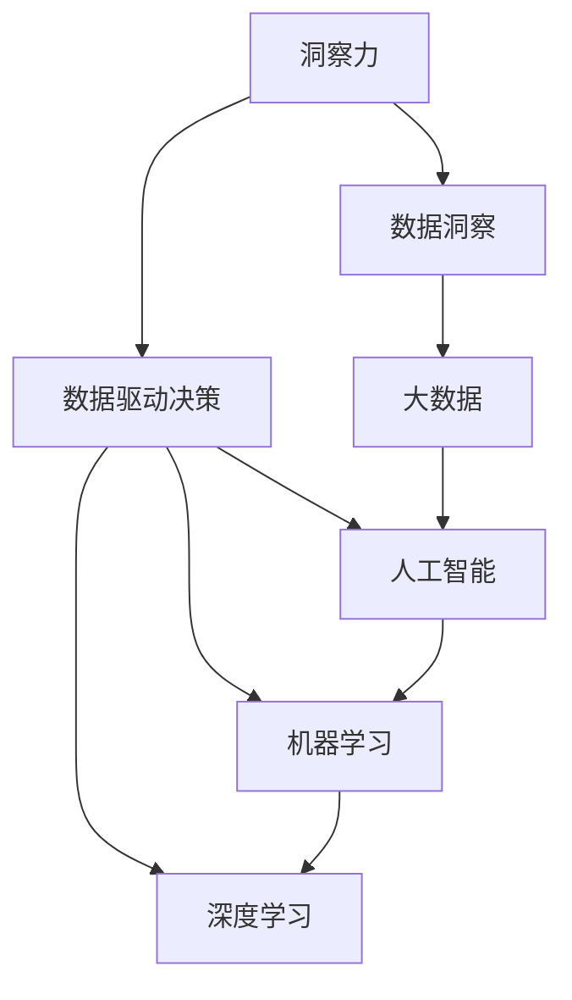

                 

# 洞察力：人类智慧的结晶

> 关键词：洞察力,智慧,人工智能,大数据,模型,算法,决策,风险管理

## 1. 背景介绍

### 1.1 问题由来

人类社会正处于一个加速变化的时期，从工业革命到信息时代，再到移动互联网的浪潮，技术的进步和社会的变革不断改变着人们的生活方式和思维方式。在这个过程中，数据的产生与积累从未如此迅速，计算技术的进步也使得海量数据的处理变得更加高效。然而，数据和计算能力的飞速提升，并没有同步带来信息获取和理解能力的显著提高。这一现象，导致了“数据爆炸而知识贫瘠”的窘境。

### 1.2 问题核心关键点

洞察力（Insight）是人类智慧的结晶，指对复杂现象背后原因、趋势和关联的深刻理解和认知。在现代信息技术领域，尤其是人工智能和数据科学中，洞察力的获取不仅关乎决策的正确性，更关乎企业的竞争力、国家的战略规划、甚至全球经济的稳定。然而，随着数据量的指数级增长和计算能力的迅速提升，简单的数据统计与描述性分析已无法满足对洞察力需求的深度和广度。传统的技术手段难以从海量数据中挖掘出深层次、高价值的洞察力。

因此，如何利用先进的技术手段，尤其是人工智能和大数据技术，更高效、更全面地获取和理解洞察力，已成为现代信息技术领域的核心挑战之一。本文将围绕洞察力的获取与理解，探讨其在大数据时代的实现路径，分析现有技术的优劣，展望未来的发展方向。

## 2. 核心概念与联系

### 2.1 核心概念概述

- **洞察力**：指通过对大量数据和复杂现象的分析，发现其背后的规律、关联和趋势，并进行深入理解和解释的能力。
- **数据洞察**：指从大规模数据中挖掘出对决策有价值的信息和洞见，用于指导和优化决策过程。
- **数据驱动决策**：指基于数据分析和洞察，通过算法和模型辅助决策，提升决策的科学性和效率。
- **大数据**：指规模庞大、复杂多样、快速变化的数据集合，其特征包括4V（Volume, Velocity, Variety, Value），即体量大、速度快、多样化和价值高。
- **人工智能**：利用算法和计算能力，让机器具备学习、推理和决策能力，以模拟人类智慧的技术领域。
- **机器学习（ML）**：一种通过数据训练模型，让机器具备学习新知识和优化性能能力的算法。
- **深度学习（DL）**：一种基于多层神经网络的机器学习算法，能够处理复杂非线性问题，广泛用于图像识别、语音识别和自然语言处理等领域。

这些概念之间的逻辑关系可以通过以下Mermaid流程图来展示：



这个流程图展示了一系列核心概念及其之间的关系：

1. 洞察力是最终目标，通过数据洞察和数据驱动决策实现。
2. 大数据是洞察力的基础，包含结构化与非结构化数据，为洞察力获取提供了数据源。
3. 人工智能是实现数据洞察和驱动决策的技术手段，通过机器学习、深度学习等方法实现。
4. 机器学习是人工智能的核心组成部分，通过学习模型从数据中提取规律和特征。
5. 深度学习是机器学习的一种，能够处理更复杂的数据和任务。

这些概念共同构成了洞察力获取和应用的技术框架，为理解和管理复杂数据提供了全面的技术支持。

## 3. 核心算法原理 & 具体操作步骤

### 3.1 算法原理概述

洞察力的获取，本质上是将数据转化为知识的过程，涉及对数据的挖掘、分析和解释。这一过程通常分为以下三个步骤：

1. **数据预处理**：包括数据清洗、数据整合、数据归一化等，确保数据的质量和一致性。
2. **模型训练**：通过机器学习或深度学习算法，构建数据模型，提取数据中的规律和特征。
3. **结果解释**：对模型输出进行解释和分析，形成洞察力，用于指导决策。

在大数据时代，洞察力的获取变得更加复杂和多样化，涉及从数据采集、存储、处理到分析和展示的全流程技术。

### 3.2 算法步骤详解

以下是基于人工智能技术获取洞察力的详细步骤：

**Step 1: 数据预处理**
- 收集与数据洞察相关的多源数据，包括结构化数据（如数据库记录、电子表格）和非结构化数据（如文本、图像、视频）。
- 进行数据清洗，去除噪声、重复和异常值，确保数据质量。
- 进行数据整合，将不同来源的数据进行拼接和融合，形成统一的数据视图。
- 进行数据归一化，确保不同数据特征的尺度一致，便于模型处理。

**Step 2: 模型训练**
- 选择合适的机器学习或深度学习算法，如线性回归、随机森林、卷积神经网络、循环神经网络等，根据任务需求构建模型。
- 使用历史数据对模型进行训练，调整模型参数，优化模型性能。
- 使用交叉验证等技术，评估模型的泛化能力，避免过拟合。

**Step 3: 结果解释**
- 对模型输出进行解释，如特征权重、置信度、预测区间等，形成直观的洞察力报告。
- 将洞察力转化为可操作性的建议，用于指导实际决策。
- 对模型的预测结果进行跟踪和评估，根据反馈进行调整和优化。

### 3.3 算法优缺点

人工智能技术在获取洞察力方面具有以下优点：
1. 高效性：能够处理海量数据，快速提取有价值的信息。
2. 深度性：能够发现数据中的复杂模式和关联，揭示深层次的洞察力。
3. 可扩展性：随着数据量的增加和算法的进步，洞察力获取能力不断提升。

同时，也存在以下缺点：
1. 数据依赖：模型的性能依赖于数据的质量和完整性，缺乏高质量的数据会导致洞察力获取的偏差。
2. 复杂性：算法复杂度高，对计算资源和专业技能要求高。
3. 可解释性：部分深度学习模型输出缺乏可解释性，难以理解和调试。
4. 偏差风险：模型可能继承训练数据的偏差，导致洞察力获取的误导性。

### 3.4 算法应用领域

人工智能技术在洞察力获取和应用方面已经广泛应用于多个领域，例如：

- **金融风控**：利用数据分析和模型预测，评估贷款和投资风险，优化资产配置。
- **医疗健康**：通过病历分析和影像识别，辅助疾病诊断和治疗方案选择。
- **零售电商**：根据用户行为和市场趋势，制定精准营销策略和库存管理方案。
- **物流运输**：通过实时数据分析，优化路线和调度，提升物流效率和成本效益。
- **智能制造**：通过设备监控和数据分析，预测维护需求，优化生产流程。

除了上述这些经典应用外，人工智能技术还拓展到智能客服、智慧城市、自动驾驶等多个新兴领域，为各行各业带来了深刻变革。

## 4. 数学模型和公式 & 详细讲解 & 举例说明

### 4.1 数学模型构建

本节将使用数学语言对人工智能技术获取洞察力的过程进行更加严格的刻画。

设数据集为 $D=\{(x_i, y_i)\}_{i=1}^N$，其中 $x_i \in \mathcal{X}$，$y_i \in \mathcal{Y}$，$\mathcal{X}$ 为输入空间，$\mathcal{Y}$ 为输出空间。假设模型为 $M_{\theta}$，其中 $\theta$ 为模型参数。

定义模型在数据集 $D$ 上的平均损失函数为：

$$
\mathcal{L}(\theta) = \frac{1}{N}\sum_{i=1}^N \ell(M_{\theta}(x_i),y_i)
$$

其中 $\ell$ 为损失函数，常见包括均方误差（MSE）、交叉熵（CE）等。

在构建模型后，通过对数据集进行训练，最小化损失函数 $\mathcal{L}(\theta)$，即可得到最优模型参数 $\theta^*$。

### 4.2 公式推导过程

以下我们以线性回归模型为例，推导其参数求解过程。

线性回归模型定义为：

$$
y = M_{\theta}(x) = \theta_0 + \theta_1 x_1 + \theta_2 x_2 + \cdots + \theta_n x_n
$$

其中 $\theta_0, \theta_1, \theta_2, \cdots, \theta_n$ 为模型参数，$x_1, x_2, \cdots, x_n$ 为输入特征，$y$ 为目标变量。

假设目标变量 $y_i$ 服从正态分布 $y_i \sim \mathcal{N}(M_{\theta}(x_i), \sigma^2)$，则损失函数定义为：

$$
\ell(y_i, M_{\theta}(x_i)) = \frac{1}{2}(y_i - M_{\theta}(x_i))^2
$$

目标是最小化损失函数：

$$
\mathcal{L}(\theta) = \frac{1}{2N}\sum_{i=1}^N (y_i - M_{\theta}(x_i))^2
$$

对损失函数对 $\theta$ 求导，得：

$$
\frac{\partial \mathcal{L}(\theta)}{\partial \theta_j} = -\frac{1}{N}\sum_{i=1}^N (y_i - M_{\theta}(x_i))x_{ij}
$$

通过求解上述导数等于零的方程组，即可得到模型参数：

$$
\theta_j = \frac{1}{N}\sum_{i=1}^N (y_i - \overline{y})x_{ij}
$$

其中 $\overline{y} = \frac{1}{N}\sum_{i=1}^N y_i$。

### 4.3 案例分析与讲解

以电商推荐系统为例，展示如何利用线性回归模型获取用户行为洞察力。

电商推荐系统需要根据用户的历史浏览和购买行为，预测其可能感兴趣的商品，提升用户体验和销售额。具体实现步骤如下：

**Step 1: 数据预处理**
- 收集用户的历史浏览记录、购买记录和商品属性数据。
- 进行数据清洗，去除重复和异常数据。
- 进行数据整合，将用户信息、商品信息和行为数据拼接在一起。
- 进行数据归一化，将不同特征的尺度统一到[0,1]区间。

**Step 2: 模型训练**
- 选择线性回归模型，将用户特征和行为数据作为输入，将用户是否购买商品作为目标变量。
- 使用历史数据对模型进行训练，调整模型参数。
- 使用交叉验证技术，评估模型的泛化能力，避免过拟合。

**Step 3: 结果解释**
- 对模型输出进行解释，如特征权重、预测置信度等，形成洞察力报告。
- 根据用户的行为预测，推荐可能感兴趣的商品，提升用户体验和销售额。
- 对推荐结果进行跟踪和评估，根据反馈调整模型参数。

通过以上步骤，电商推荐系统可以更准确地预测用户需求，提升推荐效果，实现商业价值最大化。

## 5. 项目实践：代码实例和详细解释说明

### 5.1 开发环境搭建

在进行洞察力获取项目的开发过程中，需要准备Python环境。以下是搭建开发环境的具体步骤：

1. 安装Anaconda：从官网下载并安装Anaconda，用于创建独立的Python环境。
```bash
conda create -n py35 python=3.5 
conda activate py35
```

2. 安装必要的Python库：
```bash
pip install pandas numpy matplotlib scikit-learn
```

3. 安装机器学习框架：
```bash
conda install scikit-learn
```

4. 安装深度学习框架：
```bash
conda install pytorch torchvision torchaudio -c pytorch
```

5. 安装TensorBoard：
```bash
pip install tensorboard
```

完成以上步骤后，即可在Python环境中进行洞察力获取项目的开发。

### 5.2 源代码详细实现

以下是使用Scikit-Learn和PyTorch实现线性回归模型的代码实现：

```python
import pandas as pd
import numpy as np
from sklearn.linear_model import LinearRegression
import torch
from torch import nn, optim

# 读取数据
data = pd.read_csv('data.csv')

# 数据预处理
X = data[['x1', 'x2', 'x3']]
y = data['y']
X_train, X_test, y_train, y_test = train_test_split(X, y, test_size=0.2, random_state=42)

# 模型训练
model = nn.Linear(X.shape[1], 1)
criterion = nn.MSELoss()
optimizer = optim.SGD(model.parameters(), lr=0.01)
for epoch in range(100):
    optimizer.zero_grad()
    outputs = model(X_train)
    loss = criterion(outputs, y_train)
    loss.backward()
    optimizer.step()
    if epoch % 10 == 0:
        print(f'Epoch {epoch}, Loss: {loss.item()}')

# 模型评估
y_pred = model(X_test)
print(f'Test Loss: {criterion(y_pred, y_test).item()}')
```

### 5.3 代码解读与分析

以上代码展示了如何使用Scikit-Learn和PyTorch实现线性回归模型的训练和评估过程。

**数据预处理**
- 使用Pandas库读取CSV文件，将数据加载到DataFrame中。
- 通过train_test_split方法，将数据集分为训练集和测试集。
- 将特征和目标变量分别赋值给X和y。

**模型训练**
- 定义线性回归模型，使用PyTorch的nn.Linear模块。
- 定义损失函数和优化器，使用nn.MSELoss和optim.SGD模块。
- 在训练过程中，使用梯度下降算法更新模型参数，最小化损失函数。
- 每十个epoch输出一次训练损失。

**模型评估**
- 使用训练好的模型对测试集进行预测。
- 计算预测结果与真实标签之间的均方误差损失。
- 输出测试损失。

代码展示了从数据预处理到模型训练和评估的完整流程，具有较高的参考价值。

## 6. 实际应用场景

### 6.1 金融风控

在大数据时代，金融行业面临着复杂多变的市场环境和高风险的交易需求。通过数据分析和洞察力获取，金融行业能够更有效地进行风险评估和资产管理。

具体而言，金融机构可以收集客户的信用记录、交易历史、社会网络等数据，构建风险评估模型。通过分析客户的历史行为和市场趋势，预测客户的违约概率和风险等级，制定合理的贷款和投资策略。此外，金融机构还可以通过实时数据分析，监测市场波动和交易异常，及时调整投资组合，规避金融风险。

### 6.2 医疗健康

医疗行业需要处理大量结构化和非结构化的数据，包括病历记录、影像数据、基因数据等。通过人工智能技术，医疗行业能够更高效地进行疾病诊断和治疗方案选择。

具体而言，医疗机构可以收集患者的历史病历、检查结果、基因信息等数据，构建疾病诊断模型。通过分析患者的历史病历和基因信息，预测其患病的概率和病情严重程度，制定精准的诊疗方案。此外，医疗机构还可以通过实时数据分析，监测患者的健康状况和药物反应，及时调整治疗策略，提高治疗效果。

### 6.3 零售电商

零售电商行业面临着高竞争、低利润的困境，需要通过数据分析和洞察力获取，提升用户体验和销售额。

具体而言，电商公司可以收集用户的浏览记录、购买记录、评价反馈等数据，构建用户行为分析模型。通过分析用户的历史行为和市场趋势，预测其可能感兴趣的商品，制定精准的推荐策略。此外，电商公司还可以通过实时数据分析，监测用户行为变化和市场趋势，及时调整商品策略，提高销售额和用户体验。

### 6.4 物流运输

物流运输行业面临着高成本、低效率的挑战，需要通过数据分析和洞察力获取，提升物流效率和成本效益。

具体而言，物流公司可以收集车辆的行驶数据、货物信息、路况信息等数据，构建运输路线优化模型。通过分析历史数据和实时数据，预测最优的运输路线和运输时间，提高物流效率和成本效益。此外，物流公司还可以通过实时数据分析，监测运输过程中的异常情况，及时调整运输策略，提高运输安全性和可靠性。

## 7. 工具和资源推荐

### 7.1 学习资源推荐

为了帮助开发者系统掌握人工智能技术获取洞察力的理论基础和实践技巧，这里推荐一些优质的学习资源：

1. Coursera的《机器学习》课程：由斯坦福大学教授Andrew Ng主讲，系统介绍了机器学习和深度学习的基本概念和算法。
2. 《深度学习》书籍：Ian Goodfellow等著，全面介绍了深度学习的基础理论和应用实践。
3. Kaggle数据科学竞赛平台：提供了丰富的数据集和模型竞赛，是学习人工智能和数据科学的实战平台。
4. GitHub开源项目：提供了大量的开源代码和模型，可供学习和借鉴。
5. TensorFlow官方文档：提供了丰富的教程和API文档，是学习和使用TensorFlow的必备资源。

通过对这些资源的学习实践，相信你一定能够快速掌握人工智能技术获取洞察力的精髓，并用于解决实际的业务问题。

### 7.2 开发工具推荐

高效的开发离不开优秀的工具支持。以下是几款用于人工智能技术获取洞察力开发的常用工具：

1. Jupyter Notebook：开源的交互式编程环境，支持Python、R等语言，适合数据探索和模型训练。
2. Anaconda：集成化的Python环境管理工具，支持多种Python版本和库，方便环境管理。
3. PyTorch：开源的深度学习框架，支持动态计算图，适合研究和开发深度学习模型。
4. TensorFlow：谷歌开发的深度学习框架，支持分布式训练和生产部署，适合大规模模型训练和部署。
5. Scikit-Learn：开源的机器学习库，提供多种算法和工具，适合快速构建和评估机器学习模型。

合理利用这些工具，可以显著提升人工智能技术获取洞察力的开发效率，加快创新迭代的步伐。

### 7.3 相关论文推荐

人工智能技术获取洞察力领域的研究活跃，以下是几篇奠基性的相关论文，推荐阅读：

1. 《Deep Learning》书籍：Ian Goodfellow等著，全面介绍了深度学习的基础理论和应用实践。
2. 《Pattern Recognition and Machine Learning》书籍：Christopher M. Bishop著，介绍了机器学习的理论基础和应用实践。
3. 《Practical Deep Learning for Coders》书籍：Francois Chollet著，介绍了使用Keras进行深度学习模型的构建和优化。
4. 《Natural Language Processing with Transformers》书籍：Thomas Wolf著，介绍了使用Transformers进行自然语言处理的理论和实践。
5. 《Human-in-the-loop Machine Learning》论文：Jielou Zhang等著，介绍了人机协同学习的方法和应用。

这些论文代表了大数据时代人工智能技术获取洞察力的发展脉络。通过学习这些前沿成果，可以帮助研究者把握学科前进方向，激发更多的创新灵感。

## 8. 总结：未来发展趋势与挑战

### 8.1 研究成果总结

本文对人工智能技术获取洞察力的过程进行了全面系统的介绍，从原理到实践，详细讲解了数据预处理、模型训练和结果解释的详细步骤。通过分析现有技术优劣，展望了未来发展方向。

通过本文的系统梳理，可以看到，人工智能技术获取洞察力已经成为现代信息技术领域的重要范式，极大地提升了数据理解和应用的深度和广度。得益于算法和计算能力的不断进步，洞察力的获取将更加高效、全面和智能化。

### 8.2 未来发展趋势

展望未来，人工智能技术获取洞察力将呈现以下几个发展趋势：

1. 自动化程度提高：随着自动化机器学习（AutoML）技术的发展，洞察力获取过程将更加自动化和智能化，适合更多非专业人士使用。
2. 多模态融合：通过融合视觉、语音、文本等多种数据模态，洞察力获取将更加全面和立体。
3. 跨领域应用拓展：洞察力获取技术将从单一领域向多领域拓展，广泛应用于金融、医疗、零售、物流等多个行业。
4. 数据驱动决策优化：洞察力获取将更加注重决策模型的优化，提高决策的科学性和精准性。
5. 伦理和安全保障：在洞察力获取过程中，将更加注重数据隐私和安全保障，避免算法偏见和误导性信息。

### 8.3 面临的挑战

尽管人工智能技术获取洞察力已经取得了显著成果，但在迈向更加智能化、普适化应用的过程中，仍面临诸多挑战：

1. 数据质量问题：洞察力获取依赖于高质量的数据，数据缺失、噪声和不一致性等问题将影响模型性能。
2. 模型复杂性：现有模型复杂度高，难以理解和调试，需要更简单的模型架构和更易解释的算法。
3. 计算资源限制：大规模模型训练和推理需要高性能计算资源，如GPU和TPU，计算成本高昂。
4. 伦理和安全问题：洞察力获取过程中可能涉及数据隐私和安全问题，需要建立完善的伦理和安全保障机制。

### 8.4 研究展望

面对人工智能技术获取洞察力所面临的种种挑战，未来的研究需要在以下几个方面寻求新的突破：

1. 自动化机器学习：探索自动化机器学习技术，简化洞察力获取过程，降低对专业技能的依赖。
2. 多模态数据融合：研究多模态数据融合技术，提高洞察力获取的全面性和准确性。
3. 简化模型架构：开发更简单、易解释的模型架构，提高模型的可解释性和易用性。
4. 优化计算资源：研究高效的模型压缩和优化技术，降低计算成本，提升计算效率。
5. 加强伦理和安全保障：建立完善的伦理和安全保障机制，确保数据隐私和安全。

这些研究方向将推动人工智能技术获取洞察力向更加智能化、普适化和安全的方向发展，为构建更加智慧的人类社会提供坚实的技术基础。

## 9. 附录：常见问题与解答

**Q1: 什么是洞察力？**

A: 洞察力是人类智慧的结晶，指对复杂现象背后原因、趋势和关联的深刻理解和认知。在现代信息技术领域，洞察力是数据挖掘、分析和应用的重要目标。

**Q2: 人工智能技术获取洞察力的优势是什么？**

A: 人工智能技术获取洞察力的优势在于其高效性、深度性和可扩展性。通过自动化和智能化手段，能够高效处理海量数据，发现数据中的复杂模式和关联，揭示深层次的洞察力。

**Q3: 人工智能技术获取洞察力的缺点是什么？**

A: 人工智能技术获取洞察力的缺点在于其数据依赖性和复杂性。模型的性能依赖于数据的质量和完整性，缺乏高质量的数据会导致洞察力获取的偏差。同时，现有模型复杂度高，对计算资源和专业技能要求高。

**Q4: 人工智能技术获取洞察力的应用领域有哪些？**

A: 人工智能技术获取洞察力的应用领域非常广泛，包括金融风控、医疗健康、零售电商、物流运输等。通过数据分析和模型预测，能够提升各行业的决策效率和质量。

**Q5: 人工智能技术获取洞察力的未来发展方向是什么？**

A: 人工智能技术获取洞察力的未来发展方向包括自动化机器学习、多模态数据融合、简化模型架构、优化计算资源和加强伦理和安全保障。这些研究方向将推动洞察力获取技术向更加智能化、普适化和安全的方向发展。

作者：禅与计算机程序设计艺术 / Zen and the Art of Computer Programming

