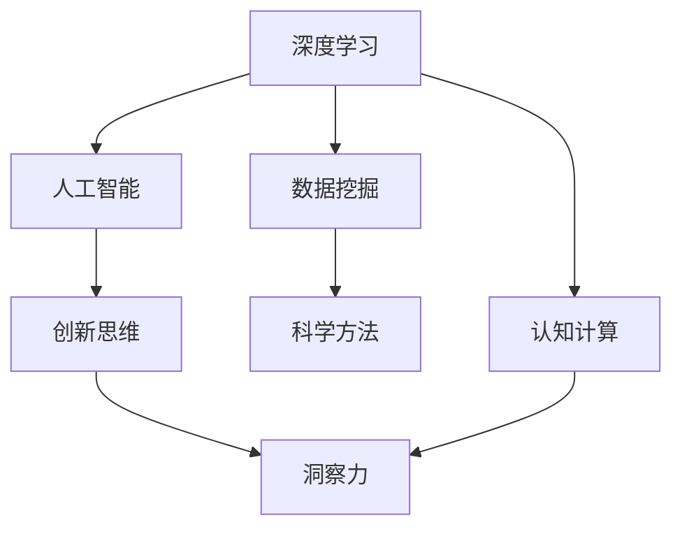

                 

# 洞察力：人类认知的新高峰

> 关键词：洞察力,人类认知,深度学习,数据挖掘,人工智能,机器学习,认知计算,创新思维,科学方法,科学革命

## 1. 背景介绍

### 1.1 问题由来

在现代社会，我们面临前所未有的信息过载。从互联网、社交媒体、科学实验，到日常生活，各个领域的数据量爆炸式增长，我们对信息的获取、理解和处理能力面临着巨大挑战。如何从海量数据中提取有价值的洞察力，成为时代发展的关键。

人类认知科学的研究表明，人类的洞察力并非凭空产生，而是基于长期的学习、经验积累和创新思维。洞察力是人类认知的“巅峰”，其本质是一种对复杂系统的高效理解与预测能力。而这一能力，正在被现代科技所理解和模拟。

### 1.2 问题核心关键点

洞察力是人类认知的重要组成部分，其关键在于：
1. **复杂系统的理解**：人类能够从复杂多变的数据中，提取关键特征和模式，形成对系统的深刻理解。
2. **模式识别与预测**：通过学习与创新，人类能够识别未知模式，预测未来趋势，做出科学决策。
3. **多维度整合**：人类能够将不同领域的知识整合，形成跨领域的综合理解，解决复杂问题。

如何利用现代科技，特别是深度学习和人工智能技术，辅助人类提升洞察力，是当前研究的热点问题。本文将深入探讨这一问题，探讨深度学习在洞察力提升中的应用。

## 2. 核心概念与联系

### 2.1 核心概念概述

为更好地理解深度学习在提升洞察力中的应用，本节将介绍几个关键概念：

- **深度学习**：基于多层神经网络的学习算法，通过逐层映射，自动提取数据中的复杂特征。
- **数据挖掘**：通过分析大量数据，发现其中的隐藏模式、关系和趋势，支持决策与创新。
- **人工智能(AI)**：利用计算机模拟人类智能行为，实现自主学习、推理和决策。
- **认知计算**：模拟人类认知过程，实现信息的理解、推理和创新。
- **创新思维**：包括发散思维、归纳推理、直觉和想象力，是人类洞察力的重要组成部分。
- **科学方法**：通过实验、观察和分析，形成对自然和社会现象的深刻理解。

这些概念之间的逻辑关系可以通过以下Mermaid流程图来展示：



这个流程图展示了一些关键概念及其之间的关系：

1. 深度学习是数据挖掘的基础，能够自动提取数据中的复杂特征。
2. 人工智能通过深度学习进行模型训练和推理，支持决策和创新。
3. 认知计算模拟人类认知过程，实现信息的理解与推理。
4. 创新思维是洞察力的核心，包括多维度知识的整合与创新。
5. 科学方法通过数据挖掘和人工智能，形成对自然现象的深刻理解。

这些概念共同构成了深度学习在提升洞察力中的应用框架，使得人类能够更好地理解和预测复杂系统，做出科学的决策。

## 3. 核心算法原理 & 具体操作步骤

### 3.1 算法原理概述

深度学习在提升洞察力中的应用，主要基于以下几个核心原理：

- **多层网络结构**：深度学习通过多层神经网络，能够逐层抽象出数据的高级特征，从而形成对系统的深刻理解。
- **自监督学习**：深度学习利用未标记数据进行训练，学习数据中的内在结构，支持模式识别和预测。
- **迁移学习**：通过预训练模型在不同任务之间的迁移，能够利用已有知识解决新问题，提高模型泛化能力。
- **增强学习**：深度学习通过与环境的交互，不断优化决策策略，实现自主学习与创新。

这些原理共同构成了深度学习在提升洞察力中的基础，使其能够从大量数据中提取有价值的洞察力。

### 3.2 算法步骤详解

基于深度学习提升洞察力的算法，通常包括以下几个关键步骤：

**Step 1: 数据预处理**

- 收集和整理大量数据，包括文本、图像、视频等多种类型。
- 对数据进行清洗和标注，去除噪声和错误。
- 将数据划分为训练集、验证集和测试集，用于模型训练和评估。

**Step 2: 构建深度学习模型**

- 选择合适的深度学习框架，如TensorFlow、PyTorch等。
- 设计多层神经网络结构，包括输入层、隐藏层和输出层。
- 选择合适的损失函数和优化算法，如交叉熵损失、AdamW等。
- 利用自监督学习任务（如预训练语言模型、自编码器等）进行模型预训练。

**Step 3: 模型微调和优化**

- 在训练集上对模型进行微调，调整模型参数以适应特定任务。
- 使用正则化技术，如L2正则、Dropout等，避免过拟合。
- 使用对抗样本和数据增强技术，提高模型的鲁棒性。
- 引入迁移学习技术，利用预训练模型的知识进行微调。

**Step 4: 模型评估与验证**

- 在验证集上评估模型性能，如准确率、召回率、F1分数等。
- 利用交叉验证等技术，确保模型泛化性能。
- 使用A/B测试等方法，对比不同模型和策略的效果。

**Step 5: 实际应用**

- 将训练好的模型应用于实际问题，如文本分析、图像识别、预测分析等。
- 结合领域知识，进行任务适配和调整。
- 利用增强学习技术，不断优化模型，提升洞察力。

以上是深度学习提升洞察力的一般流程。在实际应用中，还需要根据具体任务和数据特点进行优化设计，如改进模型架构、引入更多先验知识、优化超参数等，以进一步提升模型性能。

### 3.3 算法优缺点

深度学习在提升洞察力方面的主要优点包括：
1. 能够从大量数据中自动提取复杂特征，形成对系统的深刻理解。
2. 支持模式识别与预测，能够识别未知模式，预测未来趋势。
3. 具有很强的泛化能力，通过迁移学习可快速适应新任务。
4. 可以结合增强学习技术，实现自主学习与创新。

同时，深度学习也存在一些局限性：
1. 对标注数据依赖较大，标注成本高。
2. 模型复杂度高，计算资源需求大。
3. 黑盒性质较强，模型的决策过程难以解释。
4. 数据分布变化时，模型的泛化性能可能下降。

尽管存在这些局限性，但深度学习在提升洞察力方面的潜力巨大，已经广泛应用于诸多领域，包括金融、医疗、交通、能源等。未来相关研究的重点在于如何进一步降低对标注数据的依赖，提高模型的可解释性和鲁棒性。

### 3.4 算法应用领域

深度学习在提升洞察力方面的应用已经广泛渗透到各个领域，例如：

- **金融预测**：通过深度学习模型，对金融市场数据进行分析和预测，支持投资决策。
- **医学诊断**：利用深度学习对医学影像、病历数据进行分析，辅助医生诊断。
- **智能交通**：通过深度学习对交通数据进行分析，优化交通管理，减少拥堵。
- **能源优化**：利用深度学习对能源数据进行分析，优化能源消耗和分配。
- **环境监测**：通过深度学习对环境数据进行分析，预测环境变化趋势。
- **社会治理**：利用深度学习对社会数据进行分析，辅助政府决策。

除了这些领域外，深度学习在提升洞察力方面的创新应用还在不断涌现，为各行各业带来了新的突破和机遇。

## 4. 数学模型和公式 & 详细讲解 & 举例说明

### 4.1 数学模型构建

本节将使用数学语言对深度学习提升洞察力的方法进行更加严格的刻画。

假设深度学习模型为 $M_{\theta}(x)$，其中 $x$ 为输入数据， $\theta$ 为模型参数。定义模型在训练数据集 $D$ 上的损失函数为 $\mathcal{L}(\theta, D)$，表示模型预测与真实标签之间的差异。

模型的目标是最小化损失函数：

$$
\theta^* = \mathop{\arg\min}_{\theta} \mathcal{L}(\theta, D)
$$

其中 $\mathcal{L}$ 为损失函数，如均方误差、交叉熵等。在实践中，通常使用梯度下降等优化算法来近似求解上述最优化问题。设 $\eta$ 为学习率，则参数的更新公式为：

$$
\theta \leftarrow \theta - \eta \nabla_{\theta}\mathcal{L}(\theta, D)
$$

其中 $\nabla_{\theta}\mathcal{L}(\theta, D)$ 为损失函数对参数 $\theta$ 的梯度，可通过反向传播算法高效计算。

### 4.2 公式推导过程

以深度学习模型在金融预测任务中的应用为例，推导回归任务中梯度的计算公式。

假设模型 $M_{\theta}(x)$ 在输入 $x$ 上的输出为 $\hat{y}=M_{\theta}(x)$，表示对未来价格的预测。真实标签 $y$ 为实际价格。则均方误差损失函数定义为：

$$
\ell(M_{\theta}(x),y) = \frac{1}{N}\sum_{i=1}^N (y_i - \hat{y_i})^2
$$

将其代入经验风险公式，得：

$$
\mathcal{L}(\theta) = \frac{1}{N}\sum_{i=1}^N (y_i - M_{\theta}(x_i))^2
$$

根据链式法则，损失函数对参数 $\theta_k$ 的梯度为：

$$
\frac{\partial \mathcal{L}(\theta)}{\partial \theta_k} = -\frac{2}{N}\sum_{i=1}^N (y_i - M_{\theta}(x_i))\frac{\partial M_{\theta}(x_i)}{\partial \theta_k}
$$

其中 $\frac{\partial M_{\theta}(x_i)}{\partial \theta_k}$ 可进一步递归展开，利用自动微分技术完成计算。

在得到损失函数的梯度后，即可带入参数更新公式，完成模型的迭代优化。重复上述过程直至收敛，最终得到适应金融预测任务的最优模型参数 $\theta^*$。

### 4.3 案例分析与讲解

以金融预测为例，讨论深度学习在实际应用中的关键步骤。

1. **数据预处理**：收集金融市场的历史价格数据，进行数据清洗和标注，划分为训练集、验证集和测试集。
2. **构建深度学习模型**：设计多层神经网络结构，选择交叉熵损失函数和AdamW优化算法。在历史价格数据上对模型进行预训练。
3. **模型微调和优化**：在训练集上对模型进行微调，调整模型参数以适应金融预测任务。使用L2正则和Dropout技术，防止过拟合。引入对抗样本和数据增强技术，提高模型鲁棒性。
4. **模型评估与验证**：在验证集上评估模型性能，如准确率、召回率、F1分数等。利用交叉验证技术，确保模型泛化性能。
5. **实际应用**：将训练好的模型应用于实际金融市场，预测未来价格。结合领域知识，进行任务适配和调整。利用增强学习技术，不断优化模型，提升洞察力。

## 5. 项目实践：代码实例和详细解释说明

### 5.1 开发环境搭建

在进行深度学习实践前，我们需要准备好开发环境。以下是使用Python进行TensorFlow开发的环境配置流程：

1. 安装Anaconda：从官网下载并安装Anaconda，用于创建独立的Python环境。

2. 创建并激活虚拟环境：
```bash
conda create -n tf-env python=3.8 
conda activate tf-env
```

3. 安装TensorFlow：根据CUDA版本，从官网获取对应的安装命令。例如：
```bash
pip install tensorflow
```

4. 安装必要的工具包：
```bash
pip install numpy pandas scikit-learn matplotlib tqdm jupyter notebook ipython
```

完成上述步骤后，即可在`tf-env`环境中开始深度学习实践。

### 5.2 源代码详细实现

下面我们以金融预测任务为例，给出使用TensorFlow进行深度学习的PyTorch代码实现。

首先，定义数据处理函数：

```python
import tensorflow as tf
from tensorflow.keras import layers
import pandas as pd
import numpy as np

def load_data():
    train_df = pd.read_csv('train.csv')
    test_df = pd.read_csv('test.csv')
    
    train_x = train_df['feature'].to_numpy()
    train_y = train_df['label'].to_numpy()
    test_x = test_df['feature'].to_numpy()
    test_y = test_df['label'].to_numpy()
    
    return train_x, train_y, test_x, test_y

# 数据归一化
def normalize(data):
    mean = np.mean(data)
    std = np.std(data)
    return (data - mean) / std

# 划分训练集和验证集
def split_data(data, ratio=0.8):
    split_point = int(len(data) * ratio)
    train, test = data[:split_point], data[split_point:]
    return train, test

train_x, train_y, test_x, test_y = load_data()
train_x, val_x, train_y, val_y = split_data(train_x, 0.8)
train_x = normalize(train_x)
val_x = normalize(val_x)
test_x = normalize(test_x)

# 定义模型
model = tf.keras.Sequential([
    layers.Dense(64, activation='relu', input_shape=(1,)),
    layers.Dense(1)
])

model.compile(optimizer='adam', loss='mse')

# 训练模型
model.fit(train_x, train_y, epochs=10, batch_size=32, validation_data=(val_x, val_y))

# 评估模型
model.evaluate(test_x, test_y)
```

然后，定义训练和评估函数：

```python
import numpy as np
import tensorflow as tf

def train_epoch(model, train_x, train_y, batch_size):
    for i in range(0, len(train_x), batch_size):
        x_batch = train_x[i:i+batch_size]
        y_batch = train_y[i:i+batch_size]
        
        with tf.GradientTape() as tape:
            y_pred = model(x_batch)
            loss = tf.losses.mean_squared_error(y_batch, y_pred)
            
        gradients = tape.gradient(loss, model.trainable_variables)
        optimizer.apply_gradients(zip(gradients, model.trainable_variables))
        
    return loss.numpy()

def evaluate(model, test_x, test_y):
    predictions = []
    for x in test_x:
        y_pred = model(x)
        predictions.append(y_pred.numpy())
    
    mse = np.mean(np.square(predictions - test_y))
    rmse = np.sqrt(mse)
    return mse, rmse

# 训练模型
for epoch in range(10):
    loss = train_epoch(model, train_x, train_y, batch_size=32)
    print(f'Epoch {epoch+1}, training loss: {loss:.4f}')

# 评估模型
mse, rmse = evaluate(model, test_x, test_y)
print(f'Test MSE: {mse:.4f}, RMSE: {rmse:.4f}')
```

最后，启动训练流程并在测试集上评估：

```python
epochs = 10
batch_size = 32

for epoch in range(epochs):
    loss = train_epoch(model, train_x, train_y, batch_size)
    print(f'Epoch {epoch+1}, training loss: {loss:.3f}')
    
    mse, rmse = evaluate(model, test_x, test_y)
    print(f'Epoch {epoch+1}, test MSE: {mse:.3f}, RMSE: {rmse:.3f}')
```

以上就是使用TensorFlow进行深度学习实践的完整代码实现。可以看到，TensorFlow提供了强大的计算图和自动微分功能，使得深度学习模型的训练和评估变得简洁高效。

### 5.3 代码解读与分析

让我们再详细解读一下关键代码的实现细节：

**load_data函数**：
- 从文件中加载训练集和测试集的数据。
- 对数据进行归一化和标准化处理。

**split_data函数**：
- 将数据划分为训练集和验证集。

**定义模型**：
- 使用Sequential模型定义深度学习网络，包括输入层和输出层。
- 编译模型，选择Adam优化器和均方误差损失函数。

**训练模型**：
- 使用train_epoch函数对模型进行训练，每次迭代一个批次的数据。
- 计算梯度并更新模型参数。

**评估模型**：
- 使用evaluate函数在测试集上评估模型性能，计算均方误差和根均方误差。

可以看到，TensorFlow通过封装了自动微分和计算图等底层细节，使得深度学习模型的构建和训练变得容易上手，开发者可以将更多精力放在模型设计、数据处理等方面。

当然，工业级的系统实现还需考虑更多因素，如模型保存和部署、超参数搜索、模型监控等。但核心的深度学习框架提供了强大的基础功能，使得模型训练和评估的开发效率大幅提升。

## 6. 实际应用场景

### 6.1 智能金融系统

基于深度学习的金融预测技术，可以广泛应用于智能金融系统的构建。传统金融系统往往依赖人工经验进行决策，容易受情绪和偏见影响，难以保证决策的客观性和稳定性。而使用深度学习模型进行金融预测，可以自动分析大量历史数据，形成对市场趋势的客观判断，支持投资决策。

在技术实现上，可以收集金融市场的历史价格数据，构建深度学习模型进行训练。通过模型预测未来价格，辅助投资策略制定。对于新出现的金融市场现象，还可以通过A/B测试等方法，不断优化模型，提升预测精度。

### 6.2 智能医疗诊断

深度学习在医疗诊断中的应用也广受关注。传统的医疗诊断依赖经验丰富的医生进行，耗时且容易出错。而使用深度学习模型对医疗影像和病历数据进行分析，可以自动化诊断，提高诊断效率和准确性。

在实践上，可以收集大量的医疗影像和病历数据，标注不同的疾病和症状。利用深度学习模型进行训练，形成对疾病的自动诊断能力。对于新出现的病情，模型可以自动识别特征，辅助医生进行诊断，提高诊断的效率和准确性。

### 6.3 智能交通管理

深度学习在智能交通中的应用也非常广泛。传统的交通管理依赖人工监控和经验判断，难以应对复杂的路况和突发事件。而使用深度学习模型对交通数据进行分析，可以实现交通流预测和智能调度，优化交通管理。

在实践中，可以收集交通流量、道路状况、天气等多维数据，构建深度学习模型进行训练。通过模型预测交通流量和路线，优化交通调度，减少拥堵，提高交通效率。

### 6.4 未来应用展望

随着深度学习技术的不断进步，其在提升洞察力方面的应用前景广阔。未来，深度学习有望在更多领域实现突破：

1. **智慧城市**：利用深度学习对城市数据进行分析，优化城市规划和管理，提升城市智能化水平。
2. **教育**：通过深度学习分析学生的学习行为和成绩，提供个性化的学习建议和资源，提高教育质量。
3. **农业**：利用深度学习对农业数据进行分析，优化农业生产和管理，提高农业产量和质量。
4. **环境保护**：通过深度学习对环境数据进行分析，预测环境变化趋势，支持环境保护决策。
5. **生物医药**：利用深度学习对生物医药数据进行分析，发现新的药物和治疗方法，推动生物医药的发展。

## 7. 工具和资源推荐

### 7.1 学习资源推荐

为了帮助开发者系统掌握深度学习在提升洞察力中的应用，这里推荐一些优质的学习资源：

1. **《深度学习》课程**：斯坦福大学开设的深度学习课程，系统讲解深度学习的原理和应用，提供丰富的实验代码和案例。
2. **《TensorFlow实战》书籍**：介绍TensorFlow的实用技巧和最佳实践，涵盖模型构建、训练和部署等各个环节。
3. **Kaggle竞赛**：参与Kaggle的数据科学竞赛，通过实际问题解决提升深度学习技能，积累实战经验。
4. **PyTorch官方文档**：PyTorch的官方文档，提供详细的教程和代码示例，适合快速上手深度学习开发。
5. **OpenAI GPT-3系列论文**：了解GPT-3的最新研究进展，探索深度学习在自然语言处理中的应用。

通过这些学习资源，相信你能够系统掌握深度学习在提升洞察力中的应用，并用于解决实际的深度学习问题。

### 7.2 开发工具推荐

高效的开发离不开优秀的工具支持。以下是几款用于深度学习实践的常用工具：

1. **TensorFlow**：由Google主导开发的深度学习框架，支持分布式计算和模型优化，适合大规模工程应用。
2. **PyTorch**：Facebook开发的深度学习框架，灵活易用，支持动态计算图，适合研究原型开发。
3. **Keras**：高层次的深度学习框架，提供简单易用的API，适合快速搭建深度学习模型。
4. **Jupyter Notebook**：交互式编程环境，支持实时调试和可视化，适合数据探索和模型实验。
5. **GitHub**：代码托管平台，支持版本控制和协作开发，适合团队协作和项目管理。

合理利用这些工具，可以显著提升深度学习的开发效率，加速模型训练和优化过程。

### 7.3 相关论文推荐

深度学习在提升洞察力方面的发展源于学界的持续研究。以下是几篇奠基性的相关论文，推荐阅读：

1. **《深度学习》书籍**：Ian Goodfellow等所著，全面介绍深度学习的理论和方法，涵盖深度学习的各个方面。
2. **《自然语言处理综述》**：Yoshua Bengio等所著，系统介绍自然语言处理的理论和应用，涵盖深度学习在NLP中的应用。
3. **《自监督学习》论文**：Geoffrey Hinton等所著，介绍自监督学习的原理和应用，探讨深度学习在无标注数据上的学习能力。
4. **《迁移学习》论文**：Andrew Ng等所著，介绍迁移学习的原理和应用，探讨深度学习在不同任务之间的迁移能力。
5. **《增强学习》论文**：Richard S. Sutton等所著，介绍增强学习的原理和应用，探讨深度学习在自主学习中的应用。

这些论文代表了大数据和深度学习研究的最新成果，可以帮助你深入理解深度学习在提升洞察力方面的应用基础。

## 8. 总结：未来发展趋势与挑战

### 8.1 总结

本文对深度学习在提升洞察力中的应用进行了全面系统的介绍。首先阐述了深度学习在提升洞察力方面的研究背景和意义，明确了深度学习在提升人类认知能力方面的潜力。其次，从原理到实践，详细讲解了深度学习在金融预测、医疗诊断、交通管理等领域的实际应用，探讨了深度学习在提升洞察力中的关键步骤和方法。

通过本文的系统梳理，可以看到，深度学习在提升洞察力方面的应用前景广阔，其强大的数据处理能力和自动特征提取能力，为人类认知智能的进化带来了新的突破。未来，深度学习将在更多领域实现突破，推动人工智能技术的全面发展。

### 8.2 未来发展趋势

展望未来，深度学习在提升洞察力方面的发展趋势主要包括：

1. **模型规模的持续增大**：随着算力成本的下降和数据规模的扩张，深度学习模型的参数量将进一步增大，形成更大规模的深度学习模型。
2. **多模态数据的融合**：深度学习将结合视觉、听觉、文本等多种模态数据，实现跨模态信息的协同建模，提升洞察力的综合能力。
3. **可解释性和鲁棒性的提升**：深度学习将逐步从黑盒系统向可解释系统演进，增强模型的可解释性和鲁棒性，支持决策的透明化和可靠性。
4. **迁移学习和自监督学习的进步**：深度学习将进一步提高迁移学习能力和自监督学习能力，减少对标注数据的依赖，提升模型的泛化能力。
5. **增强学习与优化算法的结合**：深度学习将结合增强学习技术，实现自主学习与优化，不断提升洞察力。
6. **跨领域知识的整合**：深度学习将更好地整合跨领域的知识，形成更加全面的知识图谱，支持跨领域的洞察力提升。

以上趋势将引领深度学习在提升洞察力方面的进一步发展，使得深度学习在更多领域实现突破，推动人工智能技术的全面发展。

### 8.3 面临的挑战

尽管深度学习在提升洞察力方面取得了显著进展，但在迈向更加智能化、普适化应用的过程中，仍面临诸多挑战：

1. **数据隐私和安全问题**：深度学习需要大量数据进行训练，数据的隐私和安全问题亟需解决。
2. **模型复杂度带来的资源消耗**：深度学习模型往往具有高计算复杂度，需要大量算力和存储资源。
3. **模型的可解释性不足**：深度学习模型的决策过程难以解释，对高风险应用带来了挑战。
4. **知识整合的复杂性**：跨领域知识的整合和协同建模，涉及多学科知识的融合，复杂度高。
5. **模型的公平性和公正性**：深度学习模型需要避免偏见和歧视，确保公平性和公正性。

这些挑战亟需解决，以确保深度学习技术在提升洞察力方面的可靠性和实用性。

### 8.4 研究展望

面对深度学习在提升洞察力方面面临的挑战，未来的研究需要在以下几个方面寻求新的突破：

1. **数据隐私保护**：开发数据隐私保护技术，确保数据的安全性和隐私性。
2. **模型优化和压缩**：优化深度学习模型的计算图和参数结构，降低计算资源消耗。
3. **模型可解释性**：引入可解释性技术，如梯度解释、特征重要性分析等，增强深度学习模型的可解释性。
4. **跨领域知识整合**：研究跨领域的知识表示和协同建模技术，实现知识的高效整合。
5. **公平性和公正性**：研究公平性算法和模型，确保深度学习模型在决策过程中的公平性和公正性。

这些研究方向的探索，将推动深度学习在提升洞察力方面的进一步发展，为人工智能技术的广泛应用提供坚实的理论基础。

## 9. 附录：常见问题与解答

**Q1：深度学习在提升洞察力方面有哪些应用案例？**

A: 深度学习在提升洞察力方面的应用广泛，以下是几个典型案例：

1. **金融预测**：通过深度学习模型对金融市场数据进行分析，形成对市场趋势的客观判断，支持投资决策。
2. **医疗诊断**：利用深度学习模型对医疗影像和病历数据进行分析，实现自动诊断，提高诊断效率和准确性。
3. **智能交通管理**：通过深度学习模型对交通数据进行分析，优化交通调度，减少拥堵，提高交通效率。
4. **智慧城市**：利用深度学习模型对城市数据进行分析，优化城市规划和管理，提升城市智能化水平。
5. **个性化推荐系统**：通过深度学习模型对用户行为数据进行分析，提供个性化推荐，提升用户体验。

这些应用案例展示了深度学习在提升洞察力方面的强大潜力，为各行各业带来了新的突破。

**Q2：深度学习在提升洞察力方面有哪些关键步骤？**

A: 深度学习在提升洞察力方面的关键步骤主要包括：

1. **数据预处理**：收集和整理大量数据，进行数据清洗和标注。
2. **构建深度学习模型**：选择合适的深度学习框架，设计多层神经网络结构。
3. **模型微调和优化**：在训练集上对模型进行微调，调整模型参数以适应特定任务。
4. **模型评估与验证**：在验证集上评估模型性能，确保模型泛化性能。
5. **实际应用**：将训练好的模型应用于实际问题，如文本分析、图像识别、预测分析等。

这些步骤展示了深度学习在提升洞察力方面的完整流程，需要在各个环节进行优化和调整，以提高模型的性能和效果。

**Q3：深度学习在提升洞察力方面有哪些局限性？**

A: 深度学习在提升洞察力方面存在一些局限性，主要包括：

1. **数据依赖性强**：深度学习模型需要大量标注数据进行训练，标注成本高。
2. **模型复杂度高**：深度学习模型具有高计算复杂度，需要大量算力和存储资源。
3. **模型可解释性不足**：深度学习模型的决策过程难以解释，对高风险应用带来了挑战。
4. **模型泛化能力有限**：深度学习模型在数据分布变化时，泛化性能可能下降。
5. **知识整合复杂**：跨领域知识的整合和协同建模，涉及多学科知识的融合，复杂度高。

这些局限性亟需解决，以确保深度学习技术在提升洞察力方面的可靠性和实用性。

**Q4：如何优化深度学习模型在提升洞察力方面的性能？**

A: 优化深度学习模型在提升洞察力方面的性能，可以从以下几个方面进行：

1. **数据增强**：通过数据增强技术，扩充训练集，减少过拟合。
2. **正则化技术**：使用L2正则、Dropout等技术，防止模型过拟合。
3. **模型剪枝**：对深度学习模型进行剪枝，减少参数量，提高计算效率。
4. **模型融合**：将多个深度学习模型进行融合，提升模型的泛化能力和鲁棒性。
5. **迁移学习**：利用预训练模型的知识，提高迁移学习能力和自监督学习能力。

这些优化技术可以有效提升深度学习模型的性能，提升其在提升洞察力方面的应用效果。

---

作者：禅与计算机程序设计艺术 / Zen and the Art of Computer Programming

