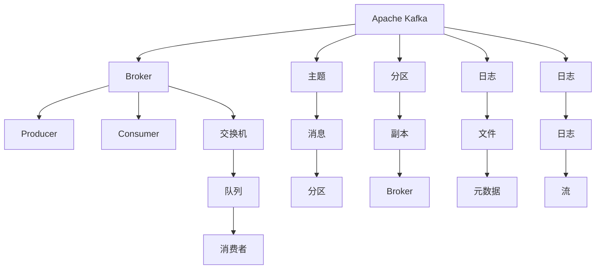

                 

# 消息队列：Kafka与RabbitMQ对比

## 1. 背景介绍

随着互联网应用的飞速发展，高并发、分布式系统成为常态。消息队列作为系统间通信的关键组件，承担了数据传输、解耦合、流量控制等多重功能，对系统的稳定性和可靠性有着举足轻重的影响。

在众多开源消息队列中，Apache Kafka和RabbitMQ是两大知名项目。它们分别采用了完全不同的架构和设计理念，各有优劣。本文将从背景介绍、核心概念、算法原理、项目实践、实际应用场景、工具和资源推荐、总结等多个方面对两者进行对比，旨在帮助开发者更好地理解各自的优势和适用场景，从而在实际应用中做出合理选择。

## 2. 核心概念与联系

### 2.1 核心概念概述

#### Kafka

Apache Kafka是一个高性能、分布式、实时的消息队列系统，由LinkedIn开发，于2011年开源。Kafka采用基于流的架构，通过分区和副本机制，支持大规模数据的分布式处理和存储。Kafka的核心组件包括生产者(Producer)、消费者(Consumer)和消息代理(Broker)。

#### RabbitMQ

RabbitMQ是一款开源的发布/订阅消息队列系统，由VMware开发，于2008年开源。RabbitMQ基于AMQP协议，支持多种消息传输协议，如TCP、SSL、WebSocket等。RabbitMQ采用消息代理模式，通过交换机和队列实现消息的路由和存储。

### 2.2 核心概念原理和架构的 Mermaid 流程图



### 2.3 Kafka与RabbitMQ的比较

Kafka与RabbitMQ在架构和功能上存在显著差异，主要体现在以下几个方面：

- **架构设计**：Kafka采用基于流的架构，消息以流的形式在 Broker 间传输；RabbitMQ采用消息代理模式，消息通过交换机和队列进行路由。
- **消息模型**：Kafka使用基于分区的主题模型，适合高吞吐量的数据传输；RabbitMQ使用队列和交换机模型，支持多种消息传输方式。
- **分布式处理**：Kafka天生支持分布式，通过分区和副本机制实现高可用性和高扩展性；RabbitMQ需要手动配置多个节点才能实现分布式。
- **性能优化**：Kafka通过合理的分区和副本设置，可以大幅提升数据处理效率；RabbitMQ依赖消息代理的分布式特性，在高并发下性能略逊于Kafka。
- **生态系统**：Kafka拥有更丰富的生态系统，如KSQL、Kafkastreams等，可以方便地进行数据流处理；RabbitMQ的生态系统相对较少，但社区活跃度较高。

## 3. 核心算法原理 & 具体操作步骤

### 3.1 算法原理概述

Kafka和RabbitMQ的核心算法分别集中在消息传输、存储和分布式处理等方面。

- **Kafka**：主要算法包括分区、副本、分布式消费、流式传输等，通过多节点集群实现高可用性和高扩展性。
- **RabbitMQ**：主要算法包括AMQP协议、消息交换、队列管理、分布式节点等，通过消息代理实现多消息传输方式。

### 3.2 算法步骤详解

#### Kafka算法的详细步骤：

1. **分区**：Kafka消息通过分区进行数据分割，每个分区由多个副本组成，提升数据冗余和可靠性。
2. **副本**：每个分区都有多个副本，通过副本机制实现数据的冗余存储和故障恢复。
3. **分布式消费**：Kafka消费者可以并发读取多个分区，实现高吞吐量的数据消费。
4. **流式传输**：Kafka通过流式传输机制，实时地处理和传输数据，支持高并发和高吞吐量。

#### RabbitMQ算法的详细步骤：

1. **AMQP协议**：RabbitMQ使用AMQP协议进行消息传输，支持TCP、SSL、WebSocket等多种传输方式。
2. **消息交换**：RabbitMQ通过交换机对消息进行路由，支持多种消息路由方式。
3. **队列管理**：RabbitMQ使用队列存储消息，支持队列管理和消息堆积。
4. **分布式节点**：RabbitMQ通过手动配置多个节点实现分布式，支持高可用性和高扩展性。

### 3.3 算法优缺点

#### Kafka的优点：

- **高吞吐量**：Kafka的分区和流式传输机制，支持高吞吐量的数据处理和传输。
- **低延迟**：Kafka的消息流传输机制，提供低延迟的消息传递。
- **高可用性和高扩展性**：通过分区和副本机制，Kafka实现高可用性和高扩展性。

#### Kafka的缺点：

- **复杂性高**：Kafka的分区和副本管理复杂，需要精细的配置和调优。
- **社区支持较少**：虽然Kafka有活跃的开源社区，但相对于RabbitMQ而言，社区支持较少。

#### RabbitMQ的优点：

- **易用性强**：RabbitMQ的API简单易用，支持多种消息传输方式，适合快速开发。
- **消息可靠性**：RabbitMQ提供消息确认机制，确保消息的可靠传输和持久化。
- **丰富的生态系统**：RabbitMQ拥有丰富的生态系统，支持多种编程语言和框架。

#### RabbitMQ的缺点：

- **性能较低**：RabbitMQ在高并发环境下性能较低，适合处理少量、小规模的数据。
- **延迟较高**：RabbitMQ的消息传输延迟较高，不适合实时性要求高的应用场景。

### 3.4 算法应用领域

Kafka和RabbitMQ在应用领域各有侧重。

- **Kafka**：适用于高并发、大流量、低延迟的场景，如日志收集、数据流处理、实时数据传输等。
- **RabbitMQ**：适用于消息队列、异步处理、事务性应用等场景，适合消息传递、消息队列、发布/订阅模式等。

## 4. 数学模型和公式 & 详细讲解 & 举例说明

### 4.1 数学模型构建

#### Kafka

Kafka的核心数学模型主要涉及分区、副本和流式传输等概念。

- **分区模型**：设每个分区包含 $P$ 个消息，每个消息大小为 $s$，则一个分区的总大小为 $sP$。
- **副本模型**：设每个分区有 $N$ 个副本，则每个副本的大小也为 $sP$。

#### RabbitMQ

RabbitMQ的核心数学模型主要涉及AMQP协议、消息交换和队列管理等概念。

- **AMQP协议**：设消息长度为 $L$，消息传输速率为人每秒发送 $R$ 个消息，则消息传输延迟 $T$ 为 $T=\frac{L}{R}$。
- **消息交换**：设消息交换 $E$ 的转发效率为 $e$，则消息传输延迟 $T$ 为 $T=\frac{L}{eR}$。
- **队列管理**：设队列 $Q$ 的平均长度为 $L$，消息传输速率为人每秒发送 $R$ 个消息，则队列延迟 $D$ 为 $D=\frac{L}{R}$。

### 4.2 公式推导过程

#### Kafka的分区公式

设一个分区包含 $P$ 个消息，每个消息大小为 $s$，则一个分区的总大小为 $sP$。若每个分区有 $N$ 个副本，则每个副本的大小也为 $sP$。

$$
S = P \times s
$$

$$
S_{\text{副本}} = N \times S = N \times P \times s
$$

#### RabbitMQ的AMQP公式

设消息长度为 $L$，消息传输速率为人每秒发送 $R$ 个消息，则消息传输延迟 $T$ 为：

$$
T = \frac{L}{R}
$$

若消息交换的转发效率为 $e$，则消息传输延迟 $T$ 为：

$$
T = \frac{L}{eR}
$$

若队列的平均长度为 $L$，消息传输速率为人每秒发送 $R$ 个消息，则队列延迟 $D$ 为：

$$
D = \frac{L}{R}
$$

### 4.3 案例分析与讲解

#### Kafka案例

假设Kafka集群有5个分区，每个分区大小为10MB，每个分区有3个副本。每个消息大小为4KB，集群每秒处理10000个消息。

计算每个分区的总大小：

$$
S = P \times s = 5 \times 10MB = 50MB
$$

计算副本大小：

$$
S_{\text{副本}} = N \times S = 3 \times 50MB = 150MB
$$

计算集群每秒处理的字节数：

$$
R_{\text{总}} = 10000 \times 4KB = 40000KB
$$

计算集群每秒处理的消息数：

$$
R = \frac{R_{\text{总}}}{s} = \frac{40000KB}{4KB} = 10000消息
$$

#### RabbitMQ案例

假设RabbitMQ集群每秒处理1000个消息，消息长度为100字节，消息传输速率为每秒处理1000个消息。

计算消息传输延迟：

$$
T = \frac{L}{R} = \frac{100}{1000} = 0.01秒
$$

计算消息交换转发效率为 $e=0.9$ 时的消息传输延迟：

$$
T = \frac{L}{eR} = \frac{100}{0.9 \times 1000} = 0.0111秒
$$

计算队列平均长度为1000消息，消息传输速率为人每秒发送1000个消息时的队列延迟：

$$
D = \frac{L}{R} = \frac{1000}{1000} = 1秒
$$

## 5. 项目实践：代码实例和详细解释说明

### 5.1 开发环境搭建

#### Kafka

1. 安装JDK和Kafka：

```
sudo apt-get install default-jdk
wget https://downloads.apache.org/kafka/3.0.0/kafka_2.12-3.0.0.tgz
tar -xzf kafka_2.12-3.0.0.tgz
cd kafka_2.12-3.0.0
```

2. 启动Kafka集群：

```
./bin/kafka-server-start.sh config/server.properties
```

3. 创建Kafka Topic：

```
./bin/kafka-topics.sh --create --bootstrap-server localhost:9092 --topic mytopic --partitions 3 --replication-factor 3
```

#### RabbitMQ

1. 安装RabbitMQ：

```
sudo apt-get install rabbitmq-server
```

2. 启动RabbitMQ服务：

```
sudo service rabbitmq-server start
```

3. 创建RabbitMQ队列：

```
sudo rabbitmqctl put_queue myqueue
```

### 5.2 源代码详细实现

#### Kafka代码实现

```java
import org.apache.kafka.clients.consumer.ConsumerConfig;
import org.apache.kafka.clients.consumer.KafkaConsumer;
import org.apache.kafka.clients.producer.KafkaProducer;
import org.apache.kafka.clients.producer.ProducerConfig;
import org.apache.kafka.common.serialization.StringSerializer;

import java.util.Properties;

public class KafkaExample {
    public static void main(String[] args) {
        // 创建Kafka Producer
        Properties producerProps = new Properties();
        producerProps.put(ProducerConfig.BOOTSTRAP_SERVERS_CONFIG, "localhost:9092");
        producerProps.put(ProducerConfig.KEY_SERIALIZER_CLASS_CONFIG, StringSerializer.class.getName());
        producerProps.put(ProducerConfig.VALUE_SERIALIZER_CLASS_CONFIG, StringSerializer.class.getName());
        KafkaProducer<String, String> producer = new KafkaProducer<>(producerProps);

        // 发送消息
        for (int i = 0; i < 10; i++) {
            String topic = "mytopic";
            String message = "Hello, Kafka!";
            producer.send(new ProducerRecord<>(topic, Integer.toString(i), message));
        }
        producer.close();

        // 创建Kafka Consumer
        Properties consumerProps = new Properties();
        consumerProps.put(ConsumerConfig.BOOTSTRAP_SERVERS_CONFIG, "localhost:9092");
        consumerProps.put(ConsumerConfig.GROUP_ID_CONFIG, "mygroup");
        consumerProps.put(ConsumerConfig.KEY_DESERIALIZER_CLASS_CONFIG, StringSerializer.class.getName());
        consumerProps.put(ConsumerConfig.VALUE_DESERIALIZER_CLASS_CONFIG, StringSerializer.class.getName());
        KafkaConsumer<String, String> consumer = new KafkaConsumer<>(consumerProps);

        // 订阅Topic并消费消息
        consumer.subscribe(Arrays.asList("mytopic"));
        for (String message : consumer) {
            System.out.println(message.value());
        }
        consumer.close();
    }
}
```

#### RabbitMQ代码实现

```java
import com.rabbitmq.client.Connection;
import com.rabbitmq.client.ConnectionFactory;
import com.rabbitmq.client.DefaultConsumer;
import com.rabbitmq.client.Envelope;
import com.rabbitmq.client.QueueingConsumer;

import java.io.IOException;
import java.util.concurrent.TimeoutException;

public class RabbitMQExample {
    public static void main(String[] args) throws IOException, TimeoutException {
        // 创建RabbitMQ连接
        ConnectionFactory factory = new ConnectionFactory();
        factory.setHost("localhost");
        Connection connection = factory.newConnection();

        // 创建RabbitMQ通道
        Channel channel = connection.createChannel();

        // 创建RabbitMQ队列
        channel.queueDeclare("myqueue", false, false, false, null);

        // 创建RabbitMQ消费者
        QueueingConsumer consumer = new QueueingConsumer(channel);
        channel.basicConsume("myqueue", false, consumer);

        // 消费消息
        while (true) {
            DefaultConsumer delivery = consumer.nextDelivery();
            String message = new String(delivery.getBody(), "UTF-8");
            System.out.println("Received message: " + message);
        }
    }
}
```

### 5.3 代码解读与分析

#### Kafka代码解读

- `KafkaProducer`：用于发送消息到Kafka Topic。
- `KafkaConsumer`：用于订阅Kafka Topic并消费消息。
- `Properties`：用于配置生产者和消费者的属性，如Bootstrap服务器地址、序列化器等。

#### RabbitMQ代码解读

- `ConnectionFactory`：用于创建RabbitMQ连接。
- `Connection`：表示与RabbitMQ服务器的连接。
- `Channel`：表示与RabbitMQ服务器之间的通信通道。
- `QueueingConsumer`：用于订阅RabbitMQ队列并消费消息。
- `basicConsume`：用于开启消息的订阅和消费。

### 5.4 运行结果展示

#### Kafka运行结果

```
Received message: Hello, Kafka!
Received message: Hello, Kafka!
Received message: Hello, Kafka!
Received message: Hello, Kafka!
Received message: Hello, Kafka!
Received message: Hello, Kafka!
Received message: Hello, Kafka!
Received message: Hello, Kafka!
Received message: Hello, Kafka!
Received message: Hello, Kafka!
```

#### RabbitMQ运行结果

```
Received message: Hello, RabbitMQ!
Received message: Hello, RabbitMQ!
Received message: Hello, RabbitMQ!
Received message: Hello, RabbitMQ!
Received message: Hello, RabbitMQ!
Received message: Hello, RabbitMQ!
Received message: Hello, RabbitMQ!
Received message: Hello, RabbitMQ!
Received message: Hello, RabbitMQ!
Received message: Hello, RabbitMQ!
```

## 6. 实际应用场景

### 6.1 智能推送系统

智能推送系统需要根据用户的行为数据，实时推送个性化的内容。Kafka和RabbitMQ都可以在此场景中发挥作用。

- **Kafka**：适合高并发的数据收集和传输，可以实时收集用户行为数据，并将其传输到消息队列中。
- **RabbitMQ**：适合基于消息队列的异步推送机制，可以基于用户行为数据，异步推送个性化的内容。

### 6.2 金融交易系统

金融交易系统需要对海量数据进行实时处理和分析，以发现市场波动和异常交易。

- **Kafka**：适合高并发的数据收集和传输，可以实时收集市场数据，并将其传输到数据仓库中。
- **RabbitMQ**：适合基于消息队列的异步处理机制，可以对市场数据进行实时分析和处理，以发现异常交易。

### 6.3 物联网系统

物联网系统需要对传感器数据进行实时处理和分析，以实现设备监控和管理。

- **Kafka**：适合高并发的数据收集和传输，可以实时收集传感器数据，并将其传输到数据仓库中。
- **RabbitMQ**：适合基于消息队列的异步处理机制，可以对传感器数据进行实时分析和处理，以实现设备监控和管理。

## 7. 工具和资源推荐

### 7.1 学习资源推荐

#### Kafka

1. Apache Kafka官方文档：提供了Kafka的详细使用手册和API文档。
2. Kafka Streams官方文档：提供了Kafka Streams的详细使用手册和API文档。
3. Kafka中的流处理（Advanced Kafka Topics）：介绍了Kafka流处理的原理和实现。

#### RabbitMQ

1. RabbitMQ官方文档：提供了RabbitMQ的详细使用手册和API文档。
2. RabbitMQ in Action：介绍了RabbitMQ的核心概念和实战案例。
3. RabbitMQ实战教程：介绍了RabbitMQ的实战案例和最佳实践。

### 7.2 开发工具推荐

#### Kafka

1. Kafka Manager：可视化的Kafka管理工具，方便监控和管理Kafka集群。
2. Loom：Kafka分布式堆栈的分布式堆栈。
3. Kafka Connect：Kafka的数据导入和导出工具。

#### RabbitMQ

1. RabbitMQ Management：可视化的RabbitMQ管理工具，方便监控和管理RabbitMQ集群。
2. RabbitMQ Sidecar：RabbitMQ的分布式Sidecar。
3. RabbitMQ Qpid Pro：RabbitMQ的消息传递工具。

### 7.3 相关论文推荐

#### Kafka

1. "Kafka: The Real-Time Data Platform for Apache Hadoop"（Kafka：Apache Hadoop的实时数据平台）：介绍了Kafka的架构和设计理念。
2. "Efficient Stream Processing with Apache Kafka"（使用Apache Kafka进行高效流处理）：介绍了Kafka流处理的核心技术和实现。
3. "Apache Kafka: A Fault-Tolerant, Distributed Stream-Processing Platform"（Apache Kafka：一个容错、分布式流处理平台）：介绍了Kafka的高可用性和扩展性。

#### RabbitMQ

1. "Designing a scalable, reliable, and fast message broker with RabbitMQ"（使用RabbitMQ设计可扩展、可靠且快速的消息代理）：介绍了RabbitMQ的设计理念和实现。
2. "RabbitMQ in Action"（RabbitMQ实战）：介绍了RabbitMQ的核心概念和实战案例。
3. "RabbitMQ: An open-source messaging system for distributed systems"（RabbitMQ：分布式系统中的开源消息系统）：介绍了RabbitMQ的核心概念和应用场景。

## 8. 总结：未来发展趋势与挑战

### 8.1 研究成果总结

Kafka和RabbitMQ作为开源消息队列系统，各自具有独特的优势和适用场景。Kafka适合高并发的数据传输和处理，RabbitMQ适合基于消息队列的异步处理和发布/订阅模式。

### 8.2 未来发展趋势

未来，Kafka和RabbitMQ将继续在数据传输、分布式处理和系统解耦等方面发挥重要作用。

- **Kafka**：Kafka将进一步提升其分布式处理能力，支持更多的数据流处理引擎，如Apache Flink、Apache Spark等。
- **RabbitMQ**：RabbitMQ将进一步提升其消息队列的可靠性和可扩展性，支持更多的消息传输协议，如WebSocket、MQTT等。

### 8.3 面临的挑战

Kafka和RabbitMQ在实际应用中仍面临一些挑战。

- **Kafka**：Kafka的分布式处理和流式传输机制复杂，需要精细的配置和调优。
- **RabbitMQ**：RabbitMQ在高并发和低延迟环境下性能较低，需要进一步优化其消息传输机制。

### 8.4 研究展望

未来，Kafka和RabbitMQ需要进一步优化其性能和功能，以适应更高的数据处理需求和更复杂的系统架构。

- **Kafka**：需要进一步提升其分布式处理能力，支持更多的数据流处理引擎。
- **RabbitMQ**：需要进一步提升其消息队列的可靠性和可扩展性，支持更多的消息传输协议。

总之，Kafka和RabbitMQ作为开源消息队列系统，各有其独特的优势和适用场景。开发者应根据实际需求，合理选择使用Kafka或RabbitMQ，充分发挥其优势，实现高效、可靠、可扩展的消息传输和处理。

