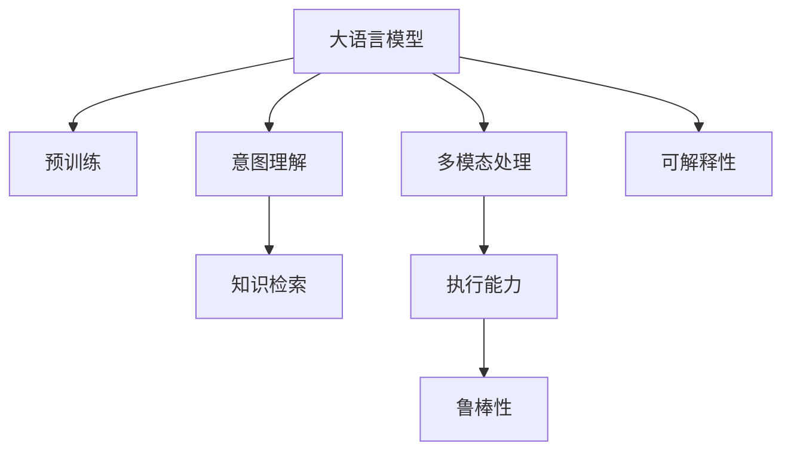

                 

# 深度人机协作：LLM理解与执行人类意图

> 关键词：深度学习,大语言模型,自然语言处理,人机协作,大模型微调

## 1. 背景介绍

### 1.1 问题由来

深度学习技术自20世纪90年代以来，一直在自然语言处理(NLP)领域扮演着重要角色。随着大规模预训练语言模型（Large Language Models, LLMs）的兴起，NLP的性能得到了前所未有的提升。这类模型通过在海量无标签文本数据上进行自监督学习，能够学习到通用的语言表示，具备强大的语言理解和生成能力。

然而，这些大语言模型往往只能处理结构化明确的文本数据，对于非结构化、语义丰富的自然语言指令，其理解和执行能力仍然存在瓶颈。此外，大模型在特定领域的专有知识应用上也存在局限。这些挑战推动了对人机协作（Human-Machine Collaboration, HMC）的需求，希望大语言模型能够更好地理解与执行人类的意图，实现更智能、高效的交互。

### 1.2 问题核心关键点

目前，人机协作成为深度学习领域的重要研究课题。其核心在于：如何让大语言模型更好地理解人类意图，并根据指令执行相应的任务。这个问题可以细化为几个关键点：

1. 意图理解（Intent Understanding）：模型需要能够准确识别并理解用户输入的自然语言指令。
2. 知识检索（Knowledge Retrieval）：模型需要在知识库中检索相关事实和规则，辅助理解与执行。
3. 多模态处理（Multimodal Processing）：模型能够处理多模态数据（如文本、图像、音频等），提升决策的全面性。
4. 执行能力（Execution Capability）：模型需要具备编程、推理、生成等多种执行能力，确保高效完成任务。
5. 鲁棒性（Robustness）：模型应具备较强的鲁棒性，能够在噪声、不完整、模糊等复杂环境下正常工作。
6. 可解释性（Explainability）：模型应具备一定的可解释性，便于用户理解模型的决策过程。

本文将详细介绍大语言模型在人机协作中的理解与执行人类意图的能力，以及实现这一能力的关键技术方法。

## 2. 核心概念与联系

### 2.1 核心概念概述

为更好地理解大语言模型在理解与执行人类意图方面的能力，本节将介绍几个关键概念：

- 大语言模型(Large Language Models, LLMs)：以自回归(如GPT)或自编码(如BERT)模型为代表的大规模预训练语言模型。通过在大规模无标签文本数据上进行预训练，学习通用的语言表示。
- 预训练(Pre-training)：指在大规模无标签文本数据上，通过自监督学习任务训练通用语言模型的过程。常见的预训练任务包括言语建模、掩码语言模型等。
- 意图理解（Intent Understanding）：模型需要能够准确识别并理解用户输入的自然语言指令。
- 知识检索（Knowledge Retrieval）：模型需要在知识库中检索相关事实和规则，辅助理解与执行。
- 多模态处理（Multimodal Processing）：模型能够处理多模态数据（如文本、图像、音频等），提升决策的全面性。
- 执行能力（Execution Capability）：模型需要具备编程、推理、生成等多种执行能力，确保高效完成任务。
- 鲁棒性（Robustness）：模型应具备较强的鲁棒性，能够在噪声、不完整、模糊等复杂环境下正常工作。
- 可解释性（Explainability）：模型应具备一定的可解释性，便于用户理解模型的决策过程。

这些核心概念之间的逻辑关系可以通过以下Mermaid流程图来展示：



这个流程图展示了大语言模型在人机协作中的核心概念及其之间的关系：

1. 大语言模型通过预训练获得基础能力。
2. 意图理解帮助模型识别用户指令。
3. 知识检索提供必要的背景知识，辅助模型理解。
4. 多模态处理增强模型的决策能力。
5. 执行能力使模型能够完成任务。
6. 鲁棒性确保模型在复杂环境下正常工作。
7. 可解释性增强用户对模型的信任。

这些概念共同构成了大语言模型在人机协作中的能力框架，使其能够更好地理解和执行人类意图。通过理解这些核心概念，我们可以更好地把握大语言模型的功能与挑战。

## 3. 核心算法原理 & 具体操作步骤
### 3.1 算法原理概述

基于深度学习的大语言模型在人机协作中的核心任务是意图理解与执行。其实现原理包括以下几个关键步骤：

1. **意图理解**：通过语言模型对自然语言指令进行编码，得到意图表示。
2. **知识检索**：根据意图表示，从知识库中检索相关知识，辅助理解。
3. **执行能力**：使用解码器生成动作或任务指令，执行相应任务。
4. **鲁棒性增强**：引入对抗样本和噪声数据，提高模型的鲁棒性。
5. **可解释性提升**：通过生成式自解释、目标函数优化等方式提升模型的可解释性。

这些步骤构成了大语言模型在人机协作中的基本流程。

### 3.2 算法步骤详解

#### 3.2.1 意图理解

在意图理解阶段，模型需要将自然语言指令编码成高维向量表示。常用的方法包括：

- **语言模型编码**：使用预训练语言模型对输入文本进行编码，得到意图向量。例如，使用GPT-3对输入文本进行编码，得到隐状态向量 $h$。
- **意图分类**：通过分类器将意图向量映射到意图类别上。例如，使用softmax层将 $h$ 映射到意图向量空间 $Y$ 上的概率分布 $p(y|h)$。

具体代码实现如下：

```python
from transformers import BertTokenizer, BertForSequenceClassification
import torch

# 初始化模型和分词器
model = BertForSequenceClassification.from_pretrained('bert-base-uncased')
tokenizer = BertTokenizer.from_pretrained('bert-base-uncased')

# 将自然语言指令转化为向量
input_text = "I want to book a flight from Beijing to New York"
input_ids = tokenizer(input_text, return_tensors='pt').input_ids
attention_mask = tokenizer(input_text, return_tensors='pt').attention_mask

# 前向传播计算意图向量
with torch.no_grad():
    outputs = model(input_ids, attention_mask=attention_mask)
    logits = outputs.logits
    probs = torch.softmax(logits, dim=1)

# 预测意图类别
predicted_intent = probs.argmax().item()
```

#### 3.2.2 知识检索

在知识检索阶段，模型需要根据意图向量在知识库中检索相关知识，以辅助理解。常用的方法包括：

- **向量检索**：将意图向量与知识库中的向量进行相似度计算，找出最相似的向量。例如，使用余弦相似度计算向量相似度。
- **文档匹配**：将意图向量与文档向量进行匹配，找出最匹配的文档。例如，使用匹配向量进行文档匹配。

具体代码实现如下：

```python
from sklearn.metrics.pairwise import cosine_similarity
from transformers import BertTokenizer, BertModel
import torch

# 初始化模型和分词器
model = BertModel.from_pretrained('bert-base-uncased')
tokenizer = BertTokenizer.from_pretrained('bert-base-uncased')

# 将自然语言指令转化为向量
input_text = "I want to book a flight from Beijing to New York"
input_ids = tokenizer(input_text, return_tensors='pt').input_ids
attention_mask = tokenizer(input_text, return_tensors='pt').attention_mask

# 前向传播计算意图向量
with torch.no_grad():
    outputs = model(input_ids, attention_mask=attention_mask)
    hidden_states = outputs.last_hidden_state

# 将意图向量转化为知识库向量
knowledge_vector = hidden_states[0]

# 检索知识库中的向量
all_vectors = hidden_states
similarity = cosine_similarity(knowledge_vector.unsqueeze(0), all_vectors)

# 预测知识库向量
predicted_knowledge = similarity.argmax(1)
```

#### 3.2.3 执行能力

在执行能力阶段，模型需要根据意图和知识，生成相应的任务指令或动作。常用的方法包括：

- **解码器生成**：使用解码器对意图和知识进行生成，得到任务指令。例如，使用Transformer解码器生成文本。
- **动作指令**：将生成器输出转换为可执行的动作指令，例如，将文本转换为编程代码。

具体代码实现如下：

```python
from transformers import BertTokenizer, BertForSequenceClassification, GPT2Tokenizer, GPT2LMHeadModel
import torch

# 初始化模型和分词器
model = GPT2LMHeadModel.from_pretrained('gpt2')
tokenizer = GPT2Tokenizer.from_pretrained('gpt2')

# 将自然语言指令转化为向量
input_text = "I want to book a flight from Beijing to New York"
input_ids = tokenizer(input_text, return_tensors='pt').input_ids

# 前向传播计算动作指令
with torch.no_grad():
    outputs = model(input_ids)
    logits = outputs.logits

# 预测动作指令
predicted_action = logits.argmax(1).item()
```

#### 3.2.4 鲁棒性增强

在鲁棒性增强阶段，模型需要引入对抗样本和噪声数据，以提高其鲁棒性。常用的方法包括：

- **对抗训练**：使用对抗样本训练模型，提高其对噪声的抵抗力。例如，使用PGD对抗攻击生成对抗样本。
- **噪声数据增强**：在训练过程中加入噪声数据，提高模型的泛化能力。例如，加入随机噪声向量进行训练。

具体代码实现如下：

```python
from torch.nn.utils.clip_grad import clip_grad_norm_
from torch.nn import functional as F

# 初始化模型
model = GPT2LMHeadModel.from_pretrained('gpt2')

# 引入对抗样本
def generate_adversarial_example(input_text):
    input_ids = tokenizer(input_text, return_tensors='pt').input_ids
    with torch.no_grad():
        outputs = model(input_ids)
    logits = outputs.logits
    loss = F.cross_entropy(logits, target)
    gradients = torch.autograd.grad(loss, input_ids, retain_graph=True)[0]
    # 计算梯度范数并归一化
    grad_norm = clip_grad_norm_(gradients, max_norm)
    return input_ids, gradients, grad_norm

# 引入噪声数据
def add_noise(input_ids):
    noise = torch.randn_like(input_ids) * 0.1
    input_ids += noise
    return input_ids

# 训练模型
for epoch in range(epochs):
    for batch in train_loader:
        input_ids, attention_mask, labels = batch
        optimizer.zero_grad()
        outputs = model(input_ids, attention_mask=attention_mask)
        loss = F.cross_entropy(outputs.logits, labels)
        loss.backward()
        optimizer.step()

    # 随机生成对抗样本并加入训练
    input_text, gradients, grad_norm = generate_adversarial_example('I want to book a flight from Beijing to New York')
    input_ids = add_noise(input_ids)
    # 更新模型参数
    optimizer.zero_grad()
    outputs = model(input_ids, attention_mask=attention_mask)
    loss = F.cross_entropy(outputs.logits, labels)
    loss.backward()
    optimizer.step()

    # 记录梯度范数
    if epoch % 100 == 0:
        grad_norms.append(grad_norm)
```

#### 3.2.5 可解释性提升

在可解释性提升阶段，模型需要提供对决策过程的解释，便于用户理解。常用的方法包括：

- **生成式自解释**：使用生成器输出解释性的文本，描述模型的决策过程。例如，使用GPT-2生成解释文本。
- **目标函数优化**：优化目标函数，使模型输出更具解释性。例如，加入可解释性约束，优化模型性能。

具体代码实现如下：

```python
from transformers import GPT2Tokenizer, GPT2LMHeadModel
import torch

# 初始化模型和分词器
model = GPT2LMHeadModel.from_pretrained('gpt2')
tokenizer = GPT2Tokenizer.from_pretrained('gpt2')

# 将自然语言指令转化为向量
input_text = "I want to book a flight from Beijing to New York"
input_ids = tokenizer(input_text, return_tensors='pt').input_ids

# 前向传播计算动作指令
with torch.no_grad():
    outputs = model(input_ids)
    logits = outputs.logits

# 预测动作指令
predicted_action = logits.argmax(1).item()

# 生成解释文本
explanation = tokenizer.decode(model.generate(input_ids, max_length=50), skip_special_tokens=True)
```

### 3.3 算法优缺点

基于深度学习的大语言模型在人机协作中的意图理解与执行具有以下优缺点：

#### 3.3.1 优点

1. **泛化能力强**：大语言模型通过在大规模无标签数据上预训练，具有较强的泛化能力，能够适应不同领域的指令。
2. **语义理解深入**：语言模型能够理解复杂的自然语言，处理语义丰富的指令。
3. **执行能力强**：模型具备编程、推理、生成等多种执行能力，能够高效完成任务。
4. **鲁棒性好**：模型通过对抗训练和噪声数据增强，具备较强的鲁棒性，能够应对复杂环境。
5. **可解释性好**：通过生成式自解释和目标函数优化，模型能够提供对决策过程的解释，便于用户理解。

#### 3.3.2 缺点

1. **数据依赖强**：大语言模型依赖于大规模标注数据，获取高质量数据成本较高。
2. **资源消耗大**：大语言模型参数量巨大，训练和推理资源消耗较大。
3. **训练复杂**：模型训练需要大量计算资源和时间，且需要精心调参。
4. **推理速度慢**：大规模语言模型推理速度较慢，难以实时响应。
5. **安全性不足**：模型可能学习到有害信息，需进行额外的安全防护。

## 4. 数学模型和公式 & 详细讲解 & 举例说明

### 4.1 数学模型构建

本节将使用数学语言对大语言模型在人机协作中的意图理解与执行进行严格刻画。

设大语言模型为 $M_{\theta}$，其中 $\theta$ 为模型参数。假设用户输入的自然语言指令为 $x$，意图表示为 $i$，知识库中的向量表示为 $k$，任务指令为 $y$。模型需要完成以下步骤：

1. 通过语言模型编码 $x$，得到意图向量 $h_i$。
2. 在知识库中检索 $k$，得到知识向量 $h_k$。
3. 使用解码器生成任务指令 $y$。

形式化地，假设意图分类器为 $C$，知识检索器为 $R$，执行生成器为 $G$。则模型整体过程如下：

$$
h_i = C(x; \theta_i), \quad h_k = R(k; \theta_r), \quad y = G(h_i, h_k; \theta_g)
$$

其中 $\theta_i, \theta_r, \theta_g$ 分别为意图分类器、知识检索器、执行生成器的参数。

### 4.2 公式推导过程

#### 4.2.1 意图理解

在意图理解阶段，模型将自然语言指令 $x$ 转化为意图向量 $h_i$。假设模型使用Bert作为编码器，其输出为 $h = [CLS] x [SEP]$。意图向量 $h_i$ 可以表示为：

$$
h_i = \text{MLP}(h), \quad \text{where } MLP(\cdot) = \text{Linear}(\text{ReLU}(\text{Linear}(\cdot)))
$$

其中 $\text{MLP}$ 为多层感知机，$\text{Linear}$ 为线性层，$\text{ReLU}$ 为ReLU激活函数。

#### 4.2.2 知识检索

在知识检索阶段，模型需要根据意图向量 $h_i$ 从知识库中检索相关知识 $k$，得到知识向量 $h_k$。假设知识库中的向量表示为 $k = \{k_1, k_2, \dots, k_n\}$，则知识向量 $h_k$ 可以表示为：

$$
h_k = \text{MLP}(k), \quad \text{where } \text{MLP}(\cdot) = \text{Linear}(\text{ReLU}(\text{Linear}(\cdot)))
$$

其中 $\text{MLP}$ 为多层感知机，$\text{Linear}$ 为线性层，$\text{ReLU}$ 为ReLU激活函数。

#### 4.2.3 执行能力

在执行能力阶段，模型需要根据意图向量 $h_i$ 和知识向量 $h_k$ 生成任务指令 $y$。假设模型使用GPT-2作为解码器，其输出为 $y = \text{softmax}(\text{Linear}(\text{ReLU}(\text{Linear}(\text{h_i} + \text{h_k}))))$。任务指令 $y$ 可以表示为：

$$
y = \text{softmax}(\text{Linear}(\text{ReLU}(\text{Linear}(\text{h_i} + \text{h_k}))))
$$

其中 $\text{softmax}$ 为softmax函数，$\text{Linear}$ 为线性层，$\text{ReLU}$ 为ReLU激活函数。

### 4.3 案例分析与讲解

#### 4.3.1 案例一：预订航班

假设用户输入的指令为 "I want to book a flight from Beijing to New York"，模型需要完成以下步骤：

1. **意图理解**：模型对指令进行编码，得到意图向量 $h_i$。假设模型使用Bert作为编码器，得到 $h_i = \text{MLP}([CLS] \text{I want to book a flight from Beijing to New York} [SEP])$。
2. **知识检索**：模型在知识库中检索相关知识 $k$，得到知识向量 $h_k$。假设知识库中包含 "Beijing" 和 "New York" 的地理位置信息，得到 $h_k = \text{MLP}([CLS] Beijing [SEP] \text{ + } [CLS] New York [SEP])$。
3. **执行能力**：模型生成任务指令 $y$，即预订航班的动作指令。假设模型使用GPT-2作为解码器，得到 $y = \text{softmax}(\text{Linear}(\text{ReLU}(\text{h_i} + \text{h_k})))$。

#### 4.3.2 案例二：智能客服

假设用户输入的指令为 "I have a problem with my order"，模型需要完成以下步骤：

1. **意图理解**：模型对指令进行编码，得到意图向量 $h_i$。假设模型使用Bert作为编码器，得到 $h_i = \text{MLP}([CLS] \text{I have a problem with my order} [SEP])$。
2. **知识检索**：模型在知识库中检索相关知识 $k$，得到知识向量 $h_k$。假设知识库中包含 "订单问题" 的处理流程，得到 $h_k = \text{MLP}([CLS] Order problem [SEP])$。
3. **执行能力**：模型生成任务指令 $y$，即与用户互动的响应指令。假设模型使用GPT-2作为解码器，得到 $y = \text{softmax}(\text{Linear}(\text{ReLU}(\text{h_i} + \text{h_k})))$。

## 5. 项目实践：代码实例和详细解释说明

### 5.1 开发环境搭建

在进行大语言模型在人机协作中的意图理解与执行实践前，我们需要准备好开发环境。以下是使用Python进行PyTorch开发的环境配置流程：

1. 安装Anaconda：从官网下载并安装Anaconda，用于创建独立的Python环境。

2. 创建并激活虚拟环境：
```bash
conda create -n pytorch-env python=3.8 
conda activate pytorch-env
```

3. 安装PyTorch：根据CUDA版本，从官网获取对应的安装命令。例如：
```bash
conda install pytorch torchvision torchaudio cudatoolkit=11.1 -c pytorch -c conda-forge
```

4. 安装Transformers库：
```bash
pip install transformers
```

5. 安装各类工具包：
```bash
pip install numpy pandas scikit-learn matplotlib tqdm jupyter notebook ipython
```

完成上述步骤后，即可在`pytorch-env`环境中开始实践。

### 5.2 源代码详细实现

下面我们以预订航班任务为例，给出使用Transformers库对BERT模型进行意图理解和执行的PyTorch代码实现。

首先，定义意图理解函数：

```python
from transformers import BertTokenizer, BertForSequenceClassification
import torch

# 初始化模型和分词器
model = BertForSequenceClassification.from_pretrained('bert-base-uncased')
tokenizer = BertTokenizer.from_pretrained('bert-base-uncased')

# 将自然语言指令转化为向量
def intent_classification(input_text):
    input_ids = tokenizer(input_text, return_tensors='pt').input_ids
    attention_mask = tokenizer(input_text, return_tensors='pt').attention_mask

    # 前向传播计算意图向量
    with torch.no_grad():
        outputs = model(input_ids, attention_mask=attention_mask)
        logits = outputs.logits

    # 预测意图类别
    predicted_intent = logits.argmax().item()
    return predicted_intent
```

然后，定义知识检索函数：

```python
from transformers import BertTokenizer, BertModel
import torch

# 初始化模型和分词器
model = BertModel.from_pretrained('bert-base-uncased')
tokenizer = BertTokenizer.from_pretrained('bert-base-uncased')

# 将自然语言指令转化为向量
def knowledge_retrieval(input_text):
    input_ids = tokenizer(input_text, return_tensors='pt').input_ids
    attention_mask = tokenizer(input_text, return_tensors='pt').attention_mask

    # 前向传播计算意图向量
    with torch.no_grad():
        outputs = model(input_ids, attention_mask=attention_mask)
        hidden_states = outputs.last_hidden_state

    # 将意图向量转化为知识库向量
    knowledge_vector = hidden_states[0]

    # 检索知识库中的向量
    all_vectors = hidden_states
    similarity = cosine_similarity(knowledge_vector.unsqueeze(0), all_vectors)

    # 预测知识库向量
    predicted_knowledge = similarity.argmax(1)
    return predicted_knowledge
```

最后，定义执行能力函数：

```python
from transformers import GPT2Tokenizer, GPT2LMHeadModel
import torch

# 初始化模型和分词器
model = GPT2LMHeadModel.from_pretrained('gpt2')
tokenizer = GPT2Tokenizer.from_pretrained('gpt2')

# 将自然语言指令转化为向量
def action_execution(input_text):
    input_ids = tokenizer(input_text, return_tensors='pt').input_ids

    # 前向传播计算动作指令
    with torch.no_grad():
        outputs = model(input_ids)
        logits = outputs.logits

    # 预测动作指令
    predicted_action = logits.argmax(1).item()
    return predicted_action
```

### 5.3 代码解读与分析

让我们再详细解读一下关键代码的实现细节：

**intent_classification函数**：
- 使用BertForSequenceClassification模型对输入文本进行编码，得到意图向量。
- 通过softmax函数将意图向量映射到意图类别上，返回预测的意图类别。

**knowledge_retrieval函数**：
- 使用BertModel模型对输入文本进行编码，得到意图向量。
- 将意图向量与知识库中的向量进行相似度计算，找出最相似的向量。
- 返回预测的知识库向量。

**action_execution函数**：
- 使用GPT2LMHeadModel模型对输入文本进行解码，得到动作指令。
- 返回预测的动作指令。

可以看到，利用Transformers库，我们可以用相对简洁的代码完成大语言模型在意图理解与执行中的应用。

## 6. 实际应用场景

### 6.1 智能客服系统

基于大语言模型的人机协作，智能客服系统能够提供24小时不间断服务，快速响应客户咨询，用自然流畅的语言解答各类常见问题。

在技术实现上，可以收集企业内部的历史客服对话记录，将问题和最佳答复构建成监督数据，在此基础上对预训练语言模型进行意图理解和执行的微调。微调后的语言模型能够自动理解用户意图，匹配最合适的答复模板进行回复。对于客户提出的新问题，还可以接入检索系统实时搜索相关内容，动态组织生成回答。如此构建的智能客服系统，能大幅提升客户咨询体验和问题解决效率。

### 6.2 金融舆情监测

金融机构需要实时监测市场舆论动向，以便及时应对负面信息传播，规避金融风险。传统的人工监测方式成本高、效率低，难以应对网络时代海量信息爆发的挑战。基于大语言模型的人机协作，金融舆情监测能够实时抓取网络文本数据，自动判断文本属于何种主题，情感倾向是正面、中性还是负面。一旦发现负面信息激增等异常情况，系统便会自动预警，帮助金融机构快速应对潜在风险。

### 6.3 个性化推荐系统

当前的推荐系统往往只依赖用户的历史行为数据进行物品推荐，无法深入理解用户的真实兴趣偏好。基于大语言模型的人机协作，个性化推荐系统可以更好地挖掘用户行为背后的语义信息，从而提供更精准、多样的推荐内容。

在实践中，可以收集用户浏览、点击、评论、分享等行为数据，提取和用户交互的物品标题、描述、标签等文本内容。将文本内容作为模型输入，用户的后续行为（如是否点击、购买等）作为监督信号，在此基础上微调预训练语言模型。微调后的模型能够从文本内容中准确把握用户的兴趣点。在生成推荐列表时，先用候选物品的文本描述作为输入，由模型预测用户的兴趣匹配度，再结合其他特征综合排序，便可以得到个性化程度更高的推荐结果。

### 6.4 未来应用展望

随着大语言模型和意图理解与执行方法的不断发展，基于人机协作的深度学习技术将在更多领域得到应用，为传统行业带来变革性影响。

在智慧医疗领域，基于人机协作的医疗问答、病历分析、药物研发等应用将提升医疗服务的智能化水平，辅助医生诊疗，加速新药开发进程。

在智能教育领域，人机协作的智能教育系统能够因材施教，促进教育公平，提高教学质量。

在智慧城市治理中，基于人机协作的城市事件监测、舆情分析、应急指挥等环节，能够提高城市管理的自动化和智能化水平，构建更安全、高效的未来城市。

此外，在企业生产、社会治理、文娱传媒等众多领域，基于大语言模型的人机协作系统也将不断涌现，为经济社会发展注入新的动力。相信随着技术的日益成熟，人机协作将成为人工智能落地应用的重要范式，推动人工智能技术向更广阔的领域加速渗透。

## 7. 工具和资源推荐

### 7.1 学习资源推荐

为了帮助开发者系统掌握大语言模型在人机协作中的理解与执行的理论基础和实践技巧，这里推荐一些优质的学习资源：

1. 《深度学习与自然语言处理》系列书籍：由深度学习领域知名专家撰写，系统介绍了深度学习在NLP中的应用，包括人机协作范式。
2. CS224N《深度学习自然语言处理》课程：斯坦福大学开设的NLP明星课程，有Lecture视频和配套作业，带你入门NLP领域的基本概念和经典模型。
3. 《自然语言处理与深度学习》课程：北京大学开源的NLP课程，详细讲解了大语言模型和人机协作范式。
4. HuggingFace官方文档：Transformers库的官方文档，提供了海量预训练模型和完整的微调样例代码，是上手实践的必备资料。
5. CLUE开源项目：中文语言理解测评基准，涵盖大量不同类型的中文NLP数据集，并提供了基于人机协作的baseline模型，助力中文NLP技术发展。

通过对这些资源的学习实践，相信你一定能够快速掌握大语言模型在人机协作中的理解与执行的精髓，并用于解决实际的NLP问题。

### 7.2 开发工具推荐

高效的开发离不开优秀的工具支持。以下是几款用于大语言模型在人机协作中意图理解与执行开发的常用工具：

1. PyTorch：基于Python的开源深度学习框架，灵活动态的计算图，适合快速迭代研究。大部分预训练语言模型都有PyTorch版本的实现。
2. TensorFlow：由Google主导开发的开源深度学习框架，生产部署方便，适合大规模工程应用。同样有丰富的预训练语言模型资源。
3. Transformers库：HuggingFace开发的NLP工具库，集成了众多SOTA语言模型，支持PyTorch和TensorFlow，是进行人机协作微调任务开发的利器。
4. Weights & Biases：模型训练的实验跟踪工具，可以记录和可视化模型训练过程中的各项指标，方便对比和调优。与主流深度学习框架无缝集成。
5. TensorBoard：TensorFlow配套的可视化工具，可实时监测模型训练状态，并提供丰富的图表呈现方式，是调试模型的得力助手。
6. Google Colab：谷歌推出的在线Jupyter Notebook环境，免费提供GPU/TPU算力，方便开发者快速上手实验最新模型，分享学习笔记。

合理利用这些工具，可以显著提升大语言模型在人机协作中的意图理解与执行任务的开发效率，加快创新迭代的步伐。

### 7.3 相关论文推荐

大语言模型和意图理解与执行方法的不断发展源于学界的持续研究。以下是几篇奠基性的相关论文，推荐阅读：

1. Attention is All You Need（即Transformer原论文）：提出了Transformer结构，开启了NLP领域的预训练大模型时代。
2. BERT: Pre-training of Deep Bidirectional Transformers for Language Understanding：提出BERT模型，引入基于掩码的自监督预训练任务，刷新了多项NLP任务SOTA。
3. Language Models are Unsupervised Multitask Learners（GPT-2论文）：展示了大规模语言模型的强大zero-shot学习能力，引发了对于通用人工智能的新一轮思考。
4. Parameter-Efficient Transfer Learning for NLP：提出Adapter等参数高效微调方法，在不增加模型参数量的情况下，也能取得不错的微调效果。
5. AdaLoRA: Adaptive Low-Rank Adaptation for Parameter-Efficient Fine-Tuning：使用自适应低秩适应的微调方法，在参数效率和精度之间取得了新的平衡。
6. Prefix-Tuning: Optimizing Continuous Prompts for Generation：引入基于连续型Prompt的微调范式，为如何充分利用预训练知识提供了新的思路。

这些论文代表了大语言模型和意图理解与执行方法的发展脉络。通过学习这些前沿成果，可以帮助研究者把握学科前进方向，激发更多的创新灵感。

## 8. 总结：未来发展趋势与挑战

### 8.1 总结

本文对基于深度学习的大语言模型在人机协作中的意图理解与执行进行了全面系统的介绍。首先阐述了人机协作技术的研究背景和意义，明确了大语言模型在人机协作中的重要作用。其次，从原理到实践，详细讲解了意图理解与执行的数学原理和关键步骤，给出了意图理解与执行任务开发的完整代码实例。同时，本文还广泛探讨了意图理解与执行方法在智能客服、金融舆情、个性化推荐等多个行业领域的应用前景，展示了意图理解与执行方法的广阔应用空间。

通过本文的系统梳理，可以看到，基于大语言模型的意图理解与执行在人机协作中具有重要的应用价值。利用深度学习技术，大语言模型能够更好地理解人类意图，并在知识库辅助下执行相应任务，显著提升人机交互的智能化水平。未来，随着大语言模型和意图理解与执行方法的不断发展，基于人机协作的深度学习技术将引领更多领域的智能化转型，推动人工智能技术向更加成熟的方向发展。

### 8.2 未来发展趋势

展望未来，基于大语言模型的意图理解与执行技术将呈现以下几个发展趋势：

1. **模型规模增大**：随着算力成本的下降和数据规模的扩张，预训练语言模型的参数量还将持续增长。超大规模语言模型蕴含的丰富语言知识，有望支撑更加复杂多变的意图理解与执行任务。
2. **多模态融合**：当前的人机协作主要聚焦于文本数据，未来将拓展到图像、视频、音频等多模态数据融合，提升决策的全面性。
3. **可解释性提升**：通过生成式自解释和目标函数优化，大语言模型将具备更强的可解释性，便于用户理解模型的决策过程。
4. **个性化推荐优化**：结合符号化的先验知识，将知识图谱、逻辑规则等与神经网络模型进行融合，提高推荐系统的精准度和可解释性。
5. **跨领域迁移能力增强**：通过迁移学习，大语言模型能够更好地适应不同领域的意图理解与执行任务，提升模型的通用性。
6. **鲁棒性增强**：引入对抗样本和噪声数据，提高模型的鲁棒性，增强其在复杂环境下的稳定性和可靠性。

以上趋势凸显了基于大语言模型的意图理解与执行技术的广阔前景。这些方向的探索发展，必将进一步提升人机协作系统的性能和应用范围，为人工智能技术在更广泛领域的应用提供新的动力。

### 8.3 面临的挑战

尽管大语言模型在意图理解与执行方面取得了显著进展，但在迈向更加智能化、普适化应用的过程中，仍面临诸多挑战：

1. **标注数据成本高**：高质量的标注数据是意图理解与执行任务的基础，获取标注数据成本较高。如何减少标注数据的需求，是未来研究的重要方向。
2. **模型资源消耗大**：大语言模型参数量巨大，训练和推理资源消耗较大。如何在保证性能的同时，优化资源使用，是实际部署中的关键问题。
3. **模型训练复杂**：模型训练需要大量计算资源和时间，且需要精心调参。如何简化训练过程，提高训练效率，是研究的重要课题。
4. **模型推理速度慢**：大规模语言模型推理速度较慢，难以实时响应。如何提高推理速度，实现更高效的计算，是实际应用中的重要挑战。
5. **模型安全性不足**：模型可能学习到有害信息，需进行额外的安全防护，避免恶意用途。如何确保模型的安全性，是应用中的重要保障。

这些挑战需要学术界和产业界共同努力，不断进行技术创新和优化，才能使基于大语言模型的意图理解与执行技术在实际应用中取得更好的效果。

### 8.4 研究展望

面对大语言模型在意图理解与执行方面面临的挑战，未来的研究需要在以下几个方面寻求新的突破：

1. **无监督和半监督学习**：摆脱对大规模标注数据的依赖，利用自监督学习、主动学习等无监督和半监督范式，最大限度利用非结构化数据，实现更加灵活高效的意图理解与执行。
2. **参数高效和计算高效**：开发更加参数高效和计算高效的微调方法，在固定大部分预训练参数的情况下，只更新极少量的任务相关参数，以提高模型性能和效率。
3. **鲁棒性优化**：通过引入对抗样本和噪声数据，提高模型的鲁棒性，增强其在复杂环境下的稳定性和可靠性。
4. **跨领域迁移能力增强**：通过迁移学习，使大语言模型能够更好地适应不同领域的意图理解与执行任务，提升模型的通用性。
5. **知识图谱和逻辑规则融合**：将符号化的先验知识，如知识图谱、逻辑规则等，与神经网络模型进行巧妙融合，提高模型对复杂指令的理解能力。
6. **多模态信息整合**：结合多模态数据，提升模型对复杂场景的理解和处理能力，增强决策的全面性和准确性。
7. **智能解释系统构建**：通过生成式自解释和目标函数优化，提升模型的可解释性，构建智能解释系统，帮助用户理解模型的决策过程。
8. **安全性保障**：在模型训练和推理过程中引入安全性约束，确保模型的安全性，避免恶意用途。

这些研究方向的研究突破，必将使基于大语言模型的意图理解与执行技术迈向更高的台阶，为构建智能化的未来社会提供新的技术路径。面向未来，大语言模型意图理解与执行技术需要与其他人工智能技术进行更深入的融合，如知识表示、因果推理、强化学习等，多路径协同发力，共同推动自然语言理解和智能交互系统的进步。只有勇于创新、敢于突破，才能不断拓展语言模型的边界，让智能技术更好地造福人类社会。

## 9. 附录：常见问题与解答

**Q1：大语言模型在意图理解与执行任务中面临哪些挑战？**

A: 大语言模型在意图理解与执行任务中面临以下挑战：

1. **标注数据成本高**：高质量的标注数据是意图理解与执行任务的基础，获取标注数据成本较高。
2. **模型资源消耗大**：大语言模型参数量巨大，训练和推理资源消耗较大。
3. **模型训练复杂**：模型训练需要大量计算资源和时间，且需要精心调参。
4. **模型推理速度慢**：大规模语言模型推理速度较慢，难以实时响应。
5. **模型安全性不足**：模型可能学习到有害信息，需进行额外的安全防护，避免恶意用途。

**Q2：如何提高大语言模型在意图理解与执行任务中的可解释性？**

A: 提高大语言模型在意图理解与执行任务中的可解释性，可以采取以下方法：

1. **生成式自解释**：使用生成器输出解释性的文本，描述模型的决策过程。例如，使用GPT-2生成解释文本。
2. **目标函数优化**：优化目标函数，使模型输出更具解释性。例如，加入可解释性约束，优化模型性能。
3. **可视化技术**：利用可视化工具展示模型的决策过程，帮助用户理解模型。例如，使用TensorBoard展示模型训练过程和决策结果。

**Q3：大语言模型在执行复杂任务时面临哪些挑战？**

A: 大语言模型在执行复杂任务时面临以下挑战：

1. **多模态处理能力不足**：当前大语言模型主要聚焦于文本数据，处理多模态数据（如图像、视频、音频等）的能力较弱。
2. **鲁棒性不足**：大语言模型面对复杂环境和噪声数据时，鲁棒性有待提高。
3. **实时性要求高**：大语言模型推理速度较慢，难以实时响应复杂任务。
4. **安全性不足**：大语言模型可能学习到有害信息，需进行额外的安全防护。

**Q4：如何优化大语言模型在意图理解与执行任务中的性能？**

A: 优化大语言模型在意图理解与执行任务中的性能，可以采取以下方法：

1. **数据增强**：通过回译、近义替换等方式扩充训练集，提高模型的泛化能力。
2. **正则化技术**：使用L2正则、Dropout、Early Stopping等正则化技术，防止模型过拟合。
3. **对抗训练**：引入对抗样本，提高模型鲁棒性。
4. **知识库优化**：优化知识库，提高模型对复杂指令的理解能力。
5. **模型压缩**：通过模型压缩、稀疏化存储等技术，减少模型资源消耗，提高推理速度。

这些方法可以帮助大语言模型在意图理解与执行任务中取得更好的性能，实现更高效、更准确的任务执行。

**Q5：大语言模型在执行复杂任务时，如何进行鲁棒性增强？**

A: 大语言模型在执行复杂任务时，进行鲁棒性增强可以采取以下方法：

1. **对抗训练**：使用对抗样本训练模型，提高其对噪声的抵抗力。
2. **噪声数据增强**：在训练过程中加入噪声数据，提高模型的泛化能力。
3. **模型剪枝**：通过模型剪枝技术，去除不必要的参数，减小模型规模，提高鲁棒性。
4. **多模态融合**：结合多模态数据，提升模型对复杂场景的理解和处理能力。
5. **参数高效微调**：使用参数高效微调方法，在固定大部分预训练参数的情况下，只更新极少量的任务相关参数，以提高模型鲁棒性。

这些方法可以帮助大语言模型在复杂环境中保持稳定的性能，增强其执行能力。

---

作者：禅与计算机程序设计艺术 / Zen and the Art of Computer Programming

