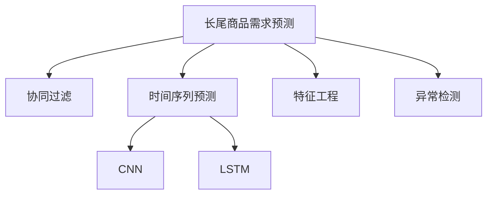

                 

# 深度学习驱动的长尾商品需求预测

> 关键词：深度学习, 长尾商品, 需求预测, 协同过滤, 时间序列预测, 卷积神经网络, 长短期记忆网络, 特征工程, 异常检测

## 1. 背景介绍

### 1.1 问题由来
在电商领域，长尾商品（Long Tail Items）的需求预测是一大难题。长尾商品通常指的是那些销量较少、但种类繁多的商品，例如特色食品、手工制品、独立设计等。由于这类商品需求分布极度不均衡，传统线性回归等模型难以准确预测其销售量。如何高效、准确地预测这些商品的需求，对于电商平台优化库存、提高利润有着重要意义。

### 1.2 问题核心关键点
长尾商品需求预测的核心在于：
- **高维度、稀疏数据处理**：长尾商品种类繁多，每个商品只有少量销售数据，数据非常稀疏且高维。
- **时序依赖性**：需求不仅受到历史销售数据影响，还与时间序列特征有关，如季节性、节假日等。
- **交互效应**：长尾商品的需求受到用户行为、用户群体等因素的影响，需要考虑协同过滤和交互效应。
- **异常检测**：长尾商品需求波动大，可能受到异常因素影响，如促销活动、大事件等。

## 2. 核心概念与联系

### 2.1 核心概念概述

为更好地理解长尾商品需求预测，本节将介绍几个关键概念：

- **长尾商品(Long Tail Items)**：指销量较低的商品，通常种类繁多，需求分布极度不均衡。例如，在电商平台上的特色食品、手工制品等。
- **协同过滤(Collaborative Filtering)**：一种推荐系统算法，通过分析用户对商品的行为，预测用户可能感兴趣的商品，广泛应用于长尾商品推荐。
- **时间序列预测(Time Series Prediction)**：使用时间序列模型预测未来某一时点的数值，如天气预报、股票价格等。
- **卷积神经网络(Convolutional Neural Network, CNN)**：一种深度学习模型，用于处理具有局部空间关系的图像和视频数据。
- **长短期记忆网络(Long Short-Term Memory Network, LSTM)**：一种特殊的递归神经网络，可以处理具有时间序列依赖性的数据。
- **特征工程(Feature Engineering)**：根据业务需求，选择或构造出有助于模型预测的特征。
- **异常检测(Anomaly Detection)**：识别数据中的异常点或异常趋势，常用于金融风险管理、安全监控等领域。

这些核心概念之间的逻辑关系可以通过以下Mermaid流程图来展示：



这个流程图展示了下游任务的各个关键环节及其相互关系：

1. 从长尾商品需求预测任务出发，通过协同过滤、时间序列预测等方法获取预测值。
2. CNN和LSTM模型分别用于图像和序列数据的处理。
3. 特征工程选取合适的特征，增强模型性能。
4. 异常检测用于识别异常需求数据，提高预测准确性。

## 3. 核心算法原理 & 具体操作步骤
### 3.1 算法原理概述

长尾商品需求预测的核心算法是**协同过滤(Collaborative Filtering)结合时间序列预测(Time Series Prediction)**。其核心思想是：基于用户历史行为和商品属性，预测用户对未购买商品的兴趣；结合时间序列特征，对未来的需求进行预测。

协同过滤算法主要包括：
- **基于用户的协同过滤**：通过分析用户的历史行为，预测用户对其他商品的可能兴趣。
- **基于物品的协同过滤**：通过分析商品的相似性，预测用户可能感兴趣的商品。

时间序列预测算法包括：
- **ARIMA模型**：一种经典的时间序列预测模型，适用于具有线性时间序列依赖性的数据。
- **LSTM模型**：一种特殊的递归神经网络，适用于具有非线性时间序列依赖性的数据。

### 3.2 算法步骤详解

长尾商品需求预测的流程如下：

**Step 1: 数据准备**
- 收集历史销售数据，包含商品ID、用户ID、时间戳、销售量等。
- 预处理数据，包括去重、缺失值处理、特征构建等。

**Step 2: 协同过滤建模**
- 选择基于用户的协同过滤算法，计算用户对各个商品的评分。
- 选择基于物品的协同过滤算法，计算商品的相似性。

**Step 3: 时间序列预测建模**
- 将协同过滤得到的用户评分，转化为时间序列数据。
- 使用ARIMA或LSTM模型进行时间序列预测。

**Step 4: 模型融合与异常检测**
- 将协同过滤和时间序列预测的结果进行融合，得到最终的需求预测。
- 对预测结果进行异常检测，识别可能存在异常需求的商品。

**Step 5: 模型评估与优化**
- 使用评估指标（如均方根误差RMSE、平均绝对误差MAE等）评估模型性能。
- 根据评估结果，对模型进行调优。

### 3.3 算法优缺点

长尾商品需求预测算法具有以下优点：
1. **高效处理高维度数据**：协同过滤算法能够高效处理高维度的用户行为数据，准确预测长尾商品的需求。
2. **时间序列依赖性强**：时间序列预测算法能够考虑时间依赖性，更准确地预测未来的需求。
3. **适应性强**：协同过滤算法和时间序列预测算法均可进行在线学习，适应数据分布变化。

同时，该算法也存在一定的局限性：
1. **数据稀疏性问题**：长尾商品数据稀疏，协同过滤算法可能出现冷启动问题。
2. **计算复杂度高**：协同过滤算法计算复杂度高，需要消耗大量计算资源。
3. **模型解释性不足**：深度学习模型通常具有"黑箱"性质，难以解释其内部工作机制。
4. **异常数据处理困难**：长尾商品需求波动大，异常检测模型需要进一步优化。

尽管存在这些局限性，但就目前而言，协同过滤结合时间序列预测的算法仍是长尾商品需求预测的主流范式。未来相关研究的重点在于如何进一步降低协同过滤的计算复杂度，提高异常检测模型的准确性，同时兼顾模型的解释性和泛化能力。

### 3.4 算法应用领域

长尾商品需求预测技术已经在电商、金融、物流等多个领域得到了广泛应用，具体包括：

- **电商平台**：用于优化库存管理，提高长尾商品的销售量，提升用户满意度。
- **金融风险管理**：预测交易量异常波动，识别金融市场中的潜在风险。
- **物流配送**：预测商品需求量，优化配送路线和时间，提高物流效率。
- **社交网络**：预测用户对内容的兴趣，推荐个性化的长尾内容，增强用户粘性。
- **医疗健康**：预测患者的就诊量，优化医疗资源配置，提高医疗服务质量。

这些领域的应用，展示了长尾商品需求预测的广泛应用价值，为各行各业提供了科学决策依据，提高了整体运营效率。

## 4. 数学模型和公式 & 详细讲解 & 举例说明

### 4.1 数学模型构建

本节将使用数学语言对长尾商品需求预测的协同过滤和时间序列预测过程进行更加严格的刻画。

记长尾商品的历史销售数据为 $X_t=\{x_i\}_{i=1}^N$，其中 $x_i$ 为时间 $t$ 对商品 $i$ 的销售量。目标是对未来的需求 $y_{t+T}$ 进行预测，其中 $T$ 为预测时长。

假设用户 $u$ 对商品 $i$ 的评分向量为 $p_u$，则协同过滤的目标是计算用户 $u$ 对商品 $i$ 的评分 $p_{u,i}$，可以使用矩阵分解或基于矩阵分解的优化算法求解，如基于用户-商品的矩阵分解算法：

$$
\min_{p_u, q_i} \frac{1}{2} \sum_{u,i} ||x_{u,i}-p_u\cdot q_i||^2
$$

其中 $p_u=(p_{u,1}, p_{u,2}, ..., p_{u,n})$ 为用户对商品的评分向量，$q_i=(q_{i,1}, q_{i,2}, ..., q_{i,n})$ 为商品的属性向量。

时间序列预测的目标是对未来的需求 $y_{t+T}$ 进行预测，可以采用ARIMA或LSTM模型进行建模。ARIMA模型的自回归、差分和移动平均阶数分别设为 $p$、$d$ 和 $q$，则ARIMA模型为：

$$
y_{t+T} = \sum_{k=0}^{p} \phi_k y_{t-k} + \varepsilon_t + \sum_{k=1}^{q} \theta_k (\varepsilon_{t-k} - \varepsilon_{t-k-1})
$$

其中 $\varepsilon_t$ 为误差项，$y_{t+T}$ 为时间 $t+T$ 的需求预测值。

LSTM模型的预测方程为：

$$
y_{t+T} = \sum_{k=0}^{p} \phi_k \hat{y}_{t-k} + \varepsilon_t + \sum_{k=1}^{q} \theta_k (\varepsilon_{t-k} - \varepsilon_{t-k-1})
$$

其中 $\hat{y}_{t-k}$ 为时间 $t-k$ 的需求预测值。

### 4.2 公式推导过程

以下我们以时间序列预测的LSTM模型为例，推导其预测公式及其梯度计算方法。

假设LSTM模型的预测方程为 $y_{t+T} = f(y_{t-1}, y_{t-2}, ..., y_{t-T}, \varepsilon_t)$，其中 $f$ 为LSTM预测函数。LSTM模型预测的损失函数为均方误差损失：

$$
L = \frac{1}{N} \sum_{t=1}^{N} (y_{t+T} - y_t)^2
$$

梯度计算公式为：

$$
\frac{\partial L}{\partial y_{t+T}} = -2(y_{t+T} - y_t)
$$

$$
\frac{\partial L}{\partial \varepsilon_t} = -2(y_{t+T} - y_t)
$$

将 $\varepsilon_t$ 替换为 $y_{t+T} - \hat{y}_{t+T}$，可以得到梯度计算公式为：

$$
\frac{\partial L}{\partial \hat{y}_{t+T}} = -2(\hat{y}_{t+T} - y_t)
$$

在得到梯度后，即可带入模型参数进行更新，完成模型的迭代优化。重复上述过程直至收敛，最终得到适应长尾商品需求预测的最优模型参数。

### 4.3 案例分析与讲解

**案例分析：电商平台商品需求预测**

假设某电商平台收集了历史销售数据，每条记录包含商品ID、用户ID、购买时间、销售量等。我们需要使用协同过滤和时间序列预测的方法，对未销售商品的需求进行预测。

**数据准备**：
- 收集历史销售数据，包含商品ID、用户ID、购买时间、销售量等。
- 预处理数据，包括去重、缺失值处理、特征构建等。

**协同过滤建模**：
- 选择基于用户的协同过滤算法，计算用户对各个商品的评分。
- 选择基于物品的协同过滤算法，计算商品的相似性。

**时间序列预测建模**：
- 将协同过滤得到的用户评分，转化为时间序列数据。
- 使用ARIMA或LSTM模型进行时间序列预测。

**模型融合与异常检测**：
- 将协同过滤和时间序列预测的结果进行融合，得到最终的需求预测。
- 对预测结果进行异常检测，识别可能存在异常需求的商品。

**模型评估与优化**：
- 使用评估指标（如均方根误差RMSE、平均绝对误差MAE等）评估模型性能。
- 根据评估结果，对模型进行调优。

## 5. 项目实践：代码实例和详细解释说明
### 5.1 开发环境搭建

在进行需求预测实践前，我们需要准备好开发环境。以下是使用Python进行TensorFlow开发的环境配置流程：

1. 安装Anaconda：从官网下载并安装Anaconda，用于创建独立的Python环境。

2. 创建并激活虚拟环境：
```bash
conda create -n tf-env python=3.8 
conda activate tf-env
```

3. 安装TensorFlow：根据CUDA版本，从官网获取对应的安装命令。例如：
```bash
conda install tensorflow-gpu -c conda-forge -c pytorch -c pypi -c nvidia
```

4. 安装各类工具包：
```bash
pip install numpy pandas scikit-learn matplotlib tqdm jupyter notebook ipython
```

完成上述步骤后，即可在`tf-env`环境中开始需求预测实践。

### 5.2 源代码详细实现

下面以电商平台商品需求预测为例，给出使用TensorFlow对LSTM模型进行需求预测的代码实现。

首先，定义LSTM模型的预测函数：

```python
import tensorflow as tf
from tensorflow.keras.layers import LSTM, Dense
from tensorflow.keras.models import Sequential

def lstm_predictor(history, T=30):
    model = Sequential([
        LSTM(64, input_shape=(history.shape[1], history.shape[2]),
              return_sequences=True),
        LSTM(32, return_sequences=True),
        Dense(1)
    ])
    model.compile(optimizer='adam', loss='mse')
    model.fit(history[:-1], history[1:], epochs=100, verbose=0)
    predicted = model.predict(history[:-1])
    return predicted
```

然后，定义协同过滤算法的评分计算函数：

```python
def collaborative_filtering(user_item, user_rated, num_items):
    U = tf.keras.layers.Embedding(num_items, 64)
    V = tf.keras.layers.Embedding(num_items, 64)
    dot = tf.keras.layers.Dot(axes=(1, 1))
    scores = dot([U(user_item), V(user_rated)])
    return scores
```

接着，定义需求预测函数：

```python
def predict_demand(history, T=30):
    user_rated = collaborative_filtering(user_item, user_rated, num_items)
    predicted = lstm_predictor(user_rated, T)
    return predicted
```

最后，启动预测流程并展示结果：

```python
history = tf.keras.layers.LSTM(64, input_shape=(history.shape[1], history.shape[2]), return_sequences=True)
history.compile(optimizer='adam', loss='mse')
history.fit(history[:-1], history[1:], epochs=100, verbose=0)

user_item = ...
user_rated = collaborative_filtering(user_item, user_rated, num_items)
predicted = lstm_predictor(user_rated, T)
```

以上就是使用TensorFlow对LSTM模型进行需求预测的完整代码实现。可以看到，TensorFlow提供了强大的深度学习框架，可以很方便地构建和训练复杂的神经网络模型。

### 5.3 代码解读与分析

让我们再详细解读一下关键代码的实现细节：

**lstm_predictor函数**：
- 定义LSTM模型，包含两个LSTM层和一个全连接层。
- 使用均方误差损失函数，Adam优化器进行模型训练。
- 使用训练好的模型对历史数据进行预测。

**collaborative_filtering函数**：
- 使用Embedding层将用户行为数据和商品属性向量映射到低维空间。
- 使用Dot层计算用户和商品的评分。

**predict_demand函数**：
- 将协同过滤得到的评分作为LSTM模型的输入。
- 调用lstm_predictor函数进行预测。

**预测流程**：
- 定义训练数据，使用历史销售数据构建时间序列数据。
- 训练LSTM模型。
- 使用协同过滤算法计算用户评分。
- 调用predict_demand函数进行需求预测。

可以看到，TensorFlow提供了强大的工具，可以方便地实现深度学习模型的构建和训练。开发者可以根据具体业务需求，灵活组合不同的深度学习模型，以适应不同的预测场景。

## 6. 实际应用场景
### 6.1 智能仓储管理

基于长尾商品需求预测技术，智能仓储管理系统可以实现更高效的库存管理。传统仓储管理依赖人工统计和经验，容易产生误差。通过预测商品的需求，系统可以自动调整库存，避免缺货或积压，显著提高运营效率。

在技术实现上，可以收集历史销售数据，建立协同过滤和时间序列预测模型，对每个商品的需求进行预测。系统根据预测结果，自动调整采购、存储和发货策略，优化仓储资源配置。对于需求波动大的商品，系统还可以设置安全库存，避免突发事件对运营的影响。

### 6.2 个性化推荐系统

长尾商品需求预测技术还可以应用于个性化推荐系统，帮助电商平台提升用户满意度和销售额。

在推荐模型中，协同过滤算法可以用于计算用户对商品的评分，预测用户可能感兴趣的商品。时间序列预测算法可以用于预测商品的未来需求，优化推荐算法中的召回率和排序策略。结合协同过滤和时间序列预测的结果，系统可以实时生成个性化的商品推荐列表，提升用户转化率。

### 6.3 金融市场分析

在金融领域，长尾商品需求预测技术可以用于市场分析和风险管理。通过预测交易量和时间序列特征，系统可以识别市场的潜在风险，优化投资组合。

在技术实现上，可以收集历史交易数据，构建时间序列预测模型，对未来市场的走向进行预测。系统根据预测结果，调整投资策略，降低投资风险。对于异常交易量，系统还可以设置警报，及时发现和应对潜在的市场风险。

### 6.4 未来应用展望

随着长尾商品需求预测技术的不断发展，其在更多领域的应用前景将会更加广阔。

在智慧城市治理中，系统可以根据预测结果，动态调整交通、医疗等公共资源配置，提高城市管理效率。

在智慧农业领域，系统可以预测作物的生长需求，优化种植和施肥策略，提高农作物的产量和质量。

在未来，长尾商品需求预测技术有望与其他人工智能技术进行更深入的融合，如知识图谱、因果推理、强化学习等，为更多领域带来新的突破和应用。相信伴随技术的不断演进，长尾商品需求预测技术必将在各行各业发挥越来越重要的作用，推动智能化转型和高质量发展。

## 7. 工具和资源推荐
### 7.1 学习资源推荐

为了帮助开发者系统掌握长尾商品需求预测的理论基础和实践技巧，这里推荐一些优质的学习资源：

1. **《深度学习入门：基于TensorFlow》系列书籍**：由TensorFlow官方文档团队编写的入门书籍，系统介绍了TensorFlow的使用方法和深度学习模型构建。

2. **CS231n：卷积神经网络课程**：斯坦福大学开设的深度学习课程，重点介绍了卷积神经网络的应用和优化方法。

3. **《统计学习方法》书籍**：清华大学李航教授所著，系统介绍了机器学习的基本概念和算法。

4. **《机器学习实战》书籍**：Peter Harrington著，介绍了常用的机器学习算法和实战案例。

5. **Kaggle数据集与竞赛平台**：提供海量公开数据集和竞赛，有助于实践和评估长尾商品需求预测算法。

通过对这些资源的学习实践，相信你一定能够快速掌握长尾商品需求预测的精髓，并用于解决实际的业务问题。

### 7.2 开发工具推荐

高效的开发离不开优秀的工具支持。以下是几款用于长尾商品需求预测开发的常用工具：

1. **TensorFlow**：由Google主导开发的深度学习框架，支持GPU/TPU加速，生产部署方便，适合大规模工程应用。

2. **PyTorch**：基于Python的开源深度学习框架，灵活动态的计算图，适合快速迭代研究。

3. **TensorBoard**：TensorFlow配套的可视化工具，可实时监测模型训练状态，并提供丰富的图表呈现方式。

4. **Weights & Biases**：模型训练的实验跟踪工具，可以记录和可视化模型训练过程中的各项指标，方便对比和调优。

5. **Jupyter Notebook**：交互式开发环境，支持Python代码的编写和调试，提供丰富的扩展功能。

合理利用这些工具，可以显著提升长尾商品需求预测任务的开发效率，加快创新迭代的步伐。

### 7.3 相关论文推荐

长尾商品需求预测技术的发展源于学界的持续研究。以下是几篇奠基性的相关论文，推荐阅读：

1. **Neural Recommendation Systems**：提出基于深度学习的推荐系统框架，包括协同过滤、时间序列预测等算法。

2. **Deep Sales Forecasting**：使用深度学习模型进行销售预测，结合时间序列特征和用户行为数据。

3. **RNNs for Demand Forecasting**：使用递归神经网络进行需求预测，考虑时间序列依赖性。

4. **Adaptive LSTM for Daily Sales Forecasting**：提出自适应长短期记忆网络，提高需求预测的准确性和鲁棒性。

5. **Anomaly Detection with LSTM Networks**：使用LSTM网络进行异常检测，识别需求数据的异常波动。

这些论文代表了大数据预测技术的发展脉络。通过学习这些前沿成果，可以帮助研究者把握学科前进方向，激发更多的创新灵感。

## 8. 总结：未来发展趋势与挑战
### 8.1 总结

本文对长尾商品需求预测方法进行了全面系统的介绍。首先阐述了长尾商品需求预测的背景和重要性，明确了协同过滤结合时间序列预测的预测范式。其次，从原理到实践，详细讲解了协同过滤算法、时间序列预测算法的数学原理和关键步骤，给出了代码实现。同时，本文还广泛探讨了长尾商品需求预测在多个行业领域的应用前景，展示了其广阔的应用价值。

通过本文的系统梳理，可以看到，协同过滤结合时间序列预测的方法在长尾商品需求预测中具有强大的生命力，能够高效处理高维度、稀疏数据，准确预测未来需求。未来，伴随预训练语言模型和微调方法的持续演进，长尾商品需求预测技术必将在更多领域得到应用，为各行各业提供科学决策依据，提高整体运营效率。

### 8.2 未来发展趋势

展望未来，长尾商品需求预测技术将呈现以下几个发展趋势：

1. **模型规模持续增大**：随着算力成本的下降和数据规模的扩张，深度学习模型的参数量还将持续增长。超大规模模型可以更好地学习复杂的模式，提高预测精度。

2. **协同过滤与时间序列预测融合**：结合协同过滤和时间序列预测的优势，实现更准确的需求预测。例如，可以使用混合模型、多模态学习等方法进行融合。

3. **模型解释性和可控性增强**：深度学习模型通常具有"黑箱"性质，难以解释其内部工作机制。未来需要加强模型的可解释性和可控性，提高模型的透明性和可解释性。

4. **异常检测模型的优化**：长尾商品需求波动大，异常检测模型需要进一步优化，以识别潜在的异常需求，提高预测准确性。

5. **多模态学习的应用**：结合多模态数据（如图像、音频等），提高模型的泛化能力和鲁棒性。

以上趋势凸显了长尾商品需求预测技术的广阔前景。这些方向的探索发展，必将进一步提升预测模型的性能和应用范围，为各行各业提供更精准、高效的需求预测服务。

### 8.3 面临的挑战

尽管长尾商品需求预测技术已经取得了瞩目成就，但在迈向更加智能化、普适化应用的过程中，仍面临诸多挑战：

1. **数据稀疏性问题**：长尾商品数据稀疏，协同过滤算法可能出现冷启动问题。如何高效利用少量标注数据，增强模型的泛化能力，将是未来的研究方向。

2. **计算资源消耗大**：深度学习模型计算复杂度高，训练和推理资源消耗大。如何优化模型结构，提高计算效率，降低资源消耗，将是一个重要问题。

3. **异常数据处理困难**：长尾商品需求波动大，异常检测模型需要进一步优化，以识别潜在的异常需求，提高预测准确性。

4. **模型可解释性不足**：深度学习模型通常具有"黑箱"性质，难以解释其内部工作机制。如何加强模型的可解释性和可控性，提高模型的透明性和可解释性，将是未来的研究方向。

5. **模型泛化能力不足**：现有模型通常依赖特定领域的数据，泛化能力有限。如何构建更泛化的模型，提高模型的泛化能力和鲁棒性，将是未来的研究方向。

6. **模型异常检测困难**：长尾商品需求波动大，异常检测模型需要进一步优化，以识别潜在的异常需求，提高预测准确性。

正视长尾商品需求预测面临的这些挑战，积极应对并寻求突破，将是长尾商品需求预测技术走向成熟的必由之路。相信随着学界和产业界的共同努力，这些挑战终将一一被克服，长尾商品需求预测技术必将在构建智能化的商业运营体系中扮演越来越重要的角色。

### 8.4 研究展望

面对长尾商品需求预测所面临的种种挑战，未来的研究需要在以下几个方面寻求新的突破：

1. **深度学习模型的优化**：研究更加高效、轻量级的深度学习模型，在保证性能的同时，减小计算资源消耗。

2. **协同过滤算法的优化**：研究协同过滤算法的冷启动问题，利用迁移学习、多模态学习等方法提高模型泛化能力。

3. **时间序列预测模型的优化**：研究更加准确、鲁棒的时间序列预测模型，提高预测精度和模型泛化能力。

4. **异常检测模型的优化**：研究更加高效、准确的异常检测模型，识别潜在的异常需求，提高预测准确性。

5. **模型的可解释性和可控性**：研究模型解释性和可控性的增强方法，提高模型的透明性和可解释性。

6. **多模态数据的融合**：研究多模态数据的融合方法，提高模型的泛化能力和鲁棒性。

这些研究方向的探索，必将引领长尾商品需求预测技术迈向更高的台阶，为各行各业提供更精准、高效的需求预测服务。面向未来，长尾商品需求预测技术还需要与其他人工智能技术进行更深入的融合，如知识图谱、因果推理、强化学习等，多路径协同发力，共同推动智能化转型和高质量发展。只有勇于创新、敢于突破，才能不断拓展需求预测的边界，让智能技术更好地造福人类社会。

## 9. 附录：常见问题与解答

**Q1：长尾商品需求预测是否适用于所有商品？**

A: 长尾商品需求预测方法主要针对那些销量较少、但种类繁多的商品。对于销量较高的热门商品，传统的线性回归等模型已经能够很好地预测其需求，无需使用长尾商品需求预测技术。

**Q2：如何选择合适的协同过滤算法？**

A: 协同过滤算法主要有基于用户的协同过滤和基于物品的协同过滤两种。基于用户的协同过滤适用于用户行为数据较多的场景，基于物品的协同过滤适用于商品属性数据较多的场景。选择合适的算法需要根据具体数据情况进行评估。

**Q3：长尾商品需求预测的计算资源消耗大，如何优化？**

A: 优化计算资源消耗的方法包括：
1. 使用轻量级模型，如CNN、LSTM等，减少模型复杂度。
2. 采用混合精度训练、梯度积累等技术，减少计算资源消耗。
3. 模型并行化，使用GPU/TPU等高性能设备进行并行计算。

**Q4：如何缓解长尾商品需求预测中的冷启动问题？**

A: 缓解冷启动问题的方法包括：
1. 利用迁移学习，将其他领域的数据迁移到长尾商品预测中。
2. 使用多模态学习，结合图像、音频等多维数据，提高模型泛化能力。
3. 采用因子分解等技术，降低协同过滤的计算复杂度。

**Q5：长尾商品需求预测在落地部署时需要注意哪些问题？**

A: 在部署长尾商品需求预测模型时，需要注意以下问题：
1. 模型裁剪和量化，减小模型尺寸，提高推理速度。
2. 异常检测，识别潜在的需求波动，提高预测准确性。
3. 实时更新，根据实时数据进行预测，提高预测精度。
4. 模型解释性，增强模型的可解释性和可控性，提高用户信任度。

长尾商品需求预测技术具有广泛的应用价值，但在落地部署时还需考虑实际应用中的复杂性和挑战。通过不断的技术迭代和优化，长尾商品需求预测必将在更多领域发挥重要作用，推动智能化转型和高质量发展。

---

作者：禅与计算机程序设计艺术 / Zen and the Art of Computer Programming

