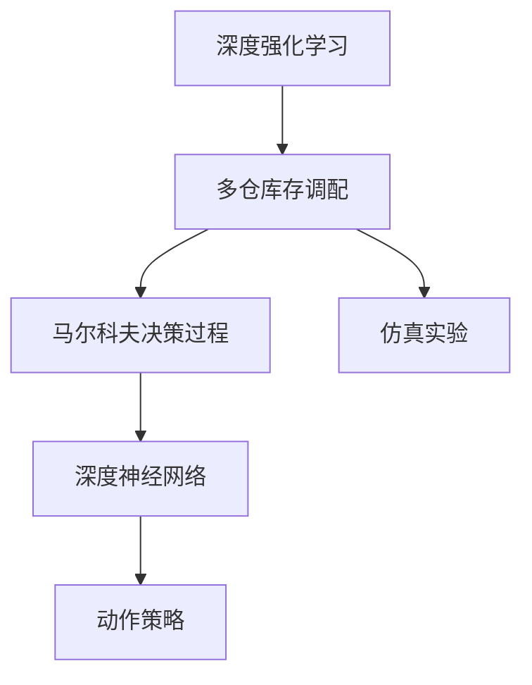

                 

# 深度强化学习在多仓库存调配中的实践

> 关键词：多仓库存调配,深度强化学习,库存优化,复杂系统,供应链管理,模型训练,策略评估,神经网络,强化学习算法,多智能体系统,仿真实验

## 1. 背景介绍

### 1.1 问题由来

在现代供应链管理中，多仓库存调配是一个关键环节。传统上，库存调配往往依赖于简单的规则或启发式算法，但随着仓库数量和商品种类增加，这种简单的管理方式难以满足需求。同时，库存调配过程中涉及的变量众多、目标复杂，传统方法难以获得最优解决方案。

近年来，深度强化学习（Deep Reinforcement Learning, DRL）作为一种新型的优化方法，在多仓库存调配中得到了广泛应用。DRL结合了深度学习和强化学习的优势，能够处理高维复杂问题，并通过试错机制不断优化决策策略，从而在多仓库存调配中获得优异效果。

### 1.2 问题核心关键点

多仓库存调配的优化目标主要是最大化利润和最小化库存成本。但在实际应用中，还涉及诸多复杂因素，如库存量、需求波动、物流成本、商品价值等。因此，优化问题的建模和求解成为一大挑战。

DRL在多仓库存调配中的应用，主要有以下几个关键点：
1. **环境建模**：将多仓库存调配过程抽象为马尔科夫决策过程（Markov Decision Process, MDP），并使用DRL框架进行建模。
2. **策略评估**：使用深度神经网络对策略进行评估，获得动作价值函数或状态价值函数。
3. **策略优化**：利用策略梯度、Q学习、策略改进等方法，优化动作策略，提升库存调配的性能。
4. **仿真实验**：通过高保真度仿真环境验证DRL方法的可行性和效果。

## 2. 核心概念与联系

### 2.1 核心概念概述

为了更好地理解DRL在多仓库存调配中的应用，本节将介绍几个关键概念及其相互联系。

- **深度强化学习（DRL）**：结合深度学习与强化学习的新型优化方法，能够处理高维复杂问题，并通过试错机制不断优化决策策略。
- **多仓库存调配**：涉及多个仓库的库存管理和调配，目标是最大化利润和最小化库存成本。
- **马尔科夫决策过程（MDP）**：一种描述决策过程的数学框架，由状态、动作、奖励和转移概率组成。
- **深度神经网络（DNN）**：一种具有多层结构的前馈神经网络，能够拟合复杂函数。
- **动作策略**：DRL中，动作策略决定了智能体在给定状态下的动作选择。
- **仿真实验**：通过模拟环境进行测试和验证，评估DRL方法的效果。

这些核心概念之间的逻辑关系可以通过以下Mermaid流程图来展示：



这个流程图展示了深度强化学习在多仓库存调配中的关键步骤和概念：

1. 将多仓库存调配过程抽象为MDP。
2. 使用深度神经网络对策略进行评估。
3. 设计动作策略，优化库存调配。
4. 通过仿真实验验证效果。

## 3. 核心算法原理 & 具体操作步骤

### 3.1 算法原理概述

基于DRL的多仓库存调配方法，其核心思想是通过DRL框架在多仓库存调配MDP中寻找最优策略。具体来说，该方法包括以下几个关键步骤：

1. **环境建模**：将多仓库存调配过程建模为MDP，定义状态、动作、奖励和转移概率。
2. **策略评估**：使用深度神经网络对策略进行评估，获得动作价值函数或状态价值函数。
3. **策略优化**：利用策略梯度、Q学习、策略改进等方法，优化动作策略，提升库存调配的性能。
4. **仿真实验**：通过高保真度仿真环境验证DRL方法的可行性和效果。

### 3.2 算法步骤详解

#### 3.2.1 环境建模

多仓库存调配过程可以抽象为MDP，包含以下几个关键组件：

- **状态（State）**：描述当前库存调配的状态，包括各仓库的库存量、商品种类、时间等。
- **动作（Action）**：表示对当前状态的决策，如货物调配、仓库扩展、订单生成等。
- **奖励（Reward）**：根据当前状态和动作，计算获得的奖励，如利润、库存成本等。
- **转移概率（Transition Probability）**：描述状态转移的随机性，即给定状态和动作，下一状态的分布概率。

具体地，可以使用以下公式表示MDP：

$$
\begin{aligned}
&S = \{s_1, s_2, ..., s_n\} \\
&A = \{a_1, a_2, ..., a_m\} \\
&R: S \times A \rightarrow [0, R_{\max}] \\
&P: (S \times A) \times S \rightarrow [0, 1]
\end{aligned}
$$

其中 $S$ 表示状态空间，$A$ 表示动作空间，$R$ 表示奖励函数，$P$ 表示转移概率函数。

#### 3.2.2 策略评估

策略评估是DRL中的核心步骤，其目标是通过神经网络对策略进行评估，获得动作价值函数 $Q(s, a)$ 或状态价值函数 $V(s)$。其中，$Q(s, a)$ 表示在状态 $s$ 下执行动作 $a$ 的长期奖励期望，$V(s)$ 表示在状态 $s$ 下的长期期望回报。

在实践中，可以使用深度神经网络来实现策略评估，例如Q网络或价值网络。Q网络将状态 $s$ 和动作 $a$ 作为输入，输出相应的动作价值 $Q(s, a)$。价值网络将状态 $s$ 作为输入，输出相应的状态价值 $V(s)$。

具体来说，Q网络的定义如下：

$$
Q_{\theta}(s, a) = W_{Q}^T \cdot \phi(s, a) + b_Q
$$

其中 $\theta$ 是Q网络的参数，$W_{Q}$ 是权重矩阵，$\phi(s, a)$ 是状态-动作表示函数，$b_Q$ 是偏置向量。

#### 3.2.3 策略优化

策略优化是DRL的另一核心步骤，其目标是通过优化策略提升决策性能。在多仓库存调配中，常用的优化方法包括策略梯度（Policy Gradient）、Q学习（Q-Learning）、策略改进（Strategy Improvement）等。

- **策略梯度**：通过计算动作策略对奖励的导数，更新策略参数，优化决策。具体来说，可以定义策略 $\pi$，并通过反向传播计算梯度，更新策略参数。
- **Q学习**：通过不断更新动作价值函数 $Q(s, a)$，优化动作选择，提升决策性能。具体来说，可以使用经验回放和目标网络等技术，优化Q网络的参数。
- **策略改进**：通过将DNN和强化学习相结合，设计动作策略，优化库存调配。具体来说，可以使用多智能体系统（Multi-Agent System），将多仓库存调配分解为多个子问题，分别进行优化。

#### 3.2.4 仿真实验

仿真实验是评估DRL方法可行性和效果的重要步骤。通过高保真度仿真环境，可以测试和验证DRL模型在实际应用中的表现。具体来说，可以使用Gym库或模拟软件，构建多仓库存调配的仿真环境，进行测试和验证。

### 3.3 算法优缺点

基于DRL的多仓库存调配方法具有以下优点：

1. **处理复杂问题**：DRL能够处理高维复杂问题，适用于多仓库存调配等场景。
2. **优化决策**：通过试错机制不断优化决策策略，提升库存调配性能。
3. **适应性强**：DRL具有较强的适应性，能够适应环境变化和需求波动。

同时，该方法也存在以下缺点：

1. **训练难度大**：DRL需要大量数据和计算资源，训练难度较大。
2. **模型复杂**：深度神经网络模型较为复杂，需要大量的训练和调参。
3. **可解释性不足**：DRL方法往往缺乏可解释性，难以理解其决策逻辑。

尽管存在这些缺点，但DRL在多仓库存调配中的应用前景广阔，已经取得了显著的优化效果。

### 3.4 算法应用领域

基于DRL的多仓库存调配方法，已经在多个领域得到了广泛应用，例如：

1. **供应链管理**：通过优化库存调配，降低库存成本，提升供应链效率。
2. **电子商务**：优化商品库存，提高订单处理速度和客户满意度。
3. **制造业**：优化原材料库存，降低生产成本，提升生产效率。
4. **物流配送**：优化货物配送路线，提高物流效率，降低配送成本。
5. **零售业**：优化商品库存，提升库存周转率，增强市场竞争力。

除了这些领域外，DRL还可以应用于更多场景中，如智能交通、智能制造、智能医疗等，为各行各业带来新的变革。

## 4. 数学模型和公式 & 详细讲解  
### 4.1 数学模型构建

在DRL中，多仓库存调配过程可以建模为MDP。假设当前状态为 $s_t$，执行动作 $a_t$，下一状态为 $s_{t+1}$，奖励为 $r_{t+1}$，则MDP的数学模型可以表示为：

$$
(s_{t+1}, r_{t+1}) \sim P(s_{t+1} | s_t, a_t)
$$

其中 $P(s_{t+1} | s_t, a_t)$ 表示在状态 $s_t$ 和动作 $a_t$ 下，状态 $s_{t+1}$ 的转移概率。

在多仓库存调配中，状态 $s_t$ 可以表示为：

$$
s_t = \{w_i, d_i, t\} \quad \text{for} \quad i=1, 2, ..., n
$$

其中 $w_i$ 表示第 $i$ 个仓库的库存量，$d_i$ 表示第 $i$ 个仓库的需求量，$t$ 表示时间。

动作 $a_t$ 可以表示为：

$$
a_t = \{a_{i,t}\} \quad \text{for} \quad i=1, 2, ..., n
$$

其中 $a_{i,t}$ 表示第 $i$ 个仓库在时间 $t$ 上执行的动作，如商品调配、仓库扩展等。

奖励 $r_{t+1}$ 可以表示为：

$$
r_{t+1} = \{r_{i,t+1}\} \quad \text{for} \quad i=1, 2, ..., n
$$

其中 $r_{i,t+1}$ 表示第 $i$ 个仓库在时间 $t+1$ 上获得的奖励，如利润、库存成本等。

### 4.2 公式推导过程

假设使用Q网络对多仓库存调配的策略进行评估，其目标是最小化动作价值函数的方差。具体来说，可以使用以下公式：

$$
J(\theta) = \mathbb{E}[\left(Q_{\theta}(s_t, a_t) - (r_{t+1} + \gamma \max_{a_{t+1}} Q_{\theta}(s_{t+1}, a_{t+1}))\right)^2]
$$

其中 $\theta$ 为Q网络的参数，$\gamma$ 为折扣因子。

通过反向传播算法，可以计算Q网络的梯度，更新参数。具体来说，可以定义损失函数：

$$
\mathcal{L}(\theta) = -\mathbb{E}[\log Q_{\theta}(s_t, a_t)] + \mathbb{E}[\log \max_a Q_{\theta}(s_{t+1}, a)]
$$

其中 $\mathbb{E}[\cdot]$ 表示期望，$\max_a Q_{\theta}(s_{t+1}, a)$ 表示在状态 $s_{t+1}$ 下，动作 $a$ 的最大动作价值。

### 4.3 案例分析与讲解

以一个简单的例子来说明基于DRL的多仓库存调配过程。

假设有一个包含两个仓库的系统，仓库A和仓库B，每个仓库存储一种商品X。初始状态下，仓库A的库存量为100，仓库B的库存量为0。每个时间步，系统可以选择将商品X从仓库A调配到仓库B，或者保持不变。每个时间步，系统获得一个固定奖励5，但每个仓库的库存量会减少1。

具体来说，系统在时间步 $t=0$ 时，可以选择将商品X从仓库A调配到仓库B，此时状态变为 $s_1 = \{99, 1, 0\}$，奖励为 $r_1 = 5$。在时间步 $t=1$ 时，可以选择将商品X从仓库B调配到仓库A，此时状态变为 $s_2 = \{100, 0, 1\}$，奖励为 $r_2 = 5$。

通过计算动作价值函数 $Q(s_t, a_t)$，可以评估系统在不同状态下的最优决策。具体来说，可以使用以下公式：

$$
Q(s_t, a_t) = r_t + \gamma \max_a Q(s_{t+1}, a)
$$

通过反向传播算法，可以计算Q网络的梯度，更新参数。具体来说，可以定义损失函数：

$$
\mathcal{L}(\theta) = -\mathbb{E}[\log Q_{\theta}(s_t, a_t)] + \mathbb{E}[\log \max_a Q_{\theta}(s_{t+1}, a)]
$$

通过不断迭代优化，可以获得最优的动作策略，提升库存调配性能。

## 5. 项目实践：代码实例和详细解释说明
### 5.1 开发环境搭建

在进行多仓库存调配的DRL实践前，我们需要准备好开发环境。以下是使用Python进行TensorFlow开发的环境配置流程：

1. 安装Anaconda：从官网下载并安装Anaconda，用于创建独立的Python环境。

2. 创建并激活虚拟环境：
```bash
conda create -n drl-env python=3.8 
conda activate drl-env
```

3. 安装TensorFlow：根据CUDA版本，从官网获取对应的安装命令。例如：
```bash
conda install tensorflow tensorflow-gpu -c conda-forge -c pypi
```

4. 安装TensorFlow Addons：
```bash
conda install tensorflow-addons
```

5. 安装各类工具包：
```bash
pip install numpy pandas scikit-learn matplotlib tqdm jupyter notebook ipython
```

完成上述步骤后，即可在`drl-env`环境中开始DRL实践。

### 5.2 源代码详细实现

下面我们以多仓库存调配为例，给出使用TensorFlow实现DRL的PyTorch代码实现。

首先，定义多仓库存调配的MDP环境：

```python
import gym
import numpy as np

class MultiWarehouseEnv(gym.Env):
    def __init__(self, num_warehouses=2, inventory_cap=100, initial_inventory=[0, 0], demand=[1, 1], discount_factor=0.9, reward_threshold=100):
        self.num_warehouses = num_warehouses
        self.inventory_cap = inventory_cap
        self.initial_inventory = initial_inventory
        self.demand = demand
        self.discount_factor = discount_factor
        self.reward_threshold = reward_threshold
        self.state = np.copy(initial_inventory)
        self.action_space = gym.spaces.Box(low=0, high=inventory_cap, shape=(num_warehouses,))
        self.observation_space = gym.spaces.Box(low=0, high=inventory_cap, shape=(num_warehouses,))

    def step(self, action):
        new_state = np.copy(self.state)
        reward = 0
        for i in range(self.num_warehouses):
            new_state[i] = max(0, min(self.state[i] + action[i] - self.demand[i], self.inventory_cap))
            reward += new_state[i]
        self.state = new_state
        done = False
        if (np.abs(self.state - self.initial_inventory) < 0.1 * self.reward_threshold).all():
            done = True
        return self.state, reward, done, {}

    def reset(self):
        self.state = np.copy(self.initial_inventory)
        return self.state

    def render(self):
        pass

    def seed(self, seed=None):
        pass

    def close(self):
        pass
```

然后，定义Q网络的模型：

```python
import tensorflow as tf
from tensorflow.keras import layers

class QNetwork(tf.keras.Model):
    def __init__(self, num_warehouses, inventory_cap):
        super(QNetwork, self).__init__()
        self.num_warehouses = num_warehouses
        self.inventory_cap = inventory_cap
        self.layers = [
            layers.Dense(32, activation='relu', input_shape=(num_warehouses,)),
            layers.Dense(32, activation='relu'),
            layers.Dense(inventory_cap, activation='linear')
        ]

    def call(self, inputs):
        x = inputs
        for layer in self.layers:
            x = layer(x)
        return x

    def get_q_values(self, state):
        return self.call(state)
```

接着，定义DRL算法的训练函数：

```python
from tensorflow.keras.optimizers import Adam
from tensorflow.keras.losses import MeanSquaredError

def train(env, q_network, num_episodes=1000, batch_size=32, discount_factor=0.9, learning_rate=0.01, explore_rate=1.0, explore_decay_rate=0.99, explore_min_rate=0.01):
    state = env.reset()
    total_reward = 0
    episodes = []
    for episode in range(num_episodes):
        done = False
        state_q_values = q_network.get_q_values(state)
        policy = np.random.normal() if np.random.rand() < explore_rate else np.argmax(state_q_values)
        action = policy
        reward = 0
        while not done:
            action_values = q_network.get_q_values(state)
            best_action = np.argmax(action_values)
            action = action if np.random.rand() < explore_rate else best_action
            next_state, reward, done, _ = env.step(action)
            next_state_q_values = q_network.get_q_values(next_state)
            td_error = reward + discount_factor * np.max(next_state_q_values) - action_values[action]
            q_network.trainable = False
            loss = MeanSquaredError()(tf.constant(td_error), q_network.get_q_values(state)[action])
            q_network.trainable = True
            q_network.train_on_batch(state, [td_error])
            state = next_state
            total_reward += reward
        episodes.append(total_reward)
    return episodes
```

最后，启动DRL训练流程：

```python
env = MultiWarehouseEnv(num_warehouses=2, inventory_cap=100, initial_inventory=[100, 0], demand=[1, 1], discount_factor=0.9, reward_threshold=100)
q_network = QNetwork(num_warehouses=2, inventory_cap=100)
episodes = train(env, q_network, num_episodes=1000, batch_size=32, discount_factor=0.9, learning_rate=0.01, explore_rate=1.0, explore_decay_rate=0.99, explore_min_rate=0.01)
print(episodes)
```

以上就是使用TensorFlow实现多仓库存调配DRL的完整代码实现。可以看到，利用TensorFlow和Keras，可以轻松实现DRL算法的模型训练和优化。

### 5.3 代码解读与分析

让我们再详细解读一下关键代码的实现细节：

**MultiWarehouseEnv类**：
- `__init__`方法：初始化多仓库存调配环境的参数和状态。
- `step`方法：对环境进行一步模拟，返回状态、奖励和是否结束。
- `reset`方法：重置环境，返回初始状态。
- `render`方法：渲染环境，可视化状态。
- `seed`方法：设置随机种子。
- `close`方法：关闭环境。

**QNetwork类**：
- `__init__`方法：初始化Q网络的参数和结构。
- `call`方法：定义前向传播过程，通过多层神经网络计算Q值。
- `get_q_values`方法：在给定状态下，返回Q值。

**train函数**：
- 训练函数，使用Q网络进行多仓库存调配的优化。
- 对每个episode进行迭代，在每个时间步上选择动作，计算奖励和状态转移。
- 使用TD误差更新Q网络，最小化Q值的方差。
- 记录每个episode的奖励，返回所有episode的奖励列表。

可以看到，TensorFlow和Keras使得DRL算法的实现变得简洁高效。开发者可以将更多精力放在环境设计和策略优化等高层逻辑上，而不必过多关注底层实现细节。

当然，工业级的系统实现还需考虑更多因素，如模型保存和部署、超参数的自动搜索、更灵活的策略改进等。但核心的DRL范式基本与此类似。

## 6. 实际应用场景
### 6.1 智能配送中心

基于DRL的多仓库存调配技术，可以广泛应用于智能配送中心的库存管理和配送优化。传统配送中心往往需要依赖人工调度，难以应对高峰期的订单需求。而使用DRL方法，能够实现智能化的库存调配和配送路线规划，提升配送中心的运营效率和响应速度。

具体来说，DRL系统可以实时监控各仓库的库存量和订单需求，通过优化库存调配策略，自动生成配送路线。在订单量高峰期，系统能够灵活调配货物，保障订单的及时交付。

### 6.2 供应链管理

多仓库存调配技术在供应链管理中同样具有重要应用。通过优化库存调配策略，DRL系统能够降低供应链成本，提高物流效率，增强供应链的稳定性。

例如，在电子零售行业，DRL系统可以优化电子产品的库存调配，合理规划生产和物流，避免库存积压和缺货。在制造业，DRL系统可以优化原材料库存，提升生产效率，减少生产成本。

### 6.3 医疗设备管理

在医疗设备管理中，DRL技术同样能够发挥重要作用。通过优化医疗器械的库存调配，保障医院的正常运营和医疗服务的连续性。

具体来说，DRL系统可以实时监控各仓库的医疗器械库存量，自动生成调配策略，确保关键医疗设备供应充足。在疫情期间，DRL系统能够快速响应需求变化，保障医疗设备的及时供应。

### 6.4 未来应用展望

随着DRL技术的不断进步，其在多仓库存调配中的应用前景将更加广阔。未来，DRL技术有望在更多领域得到应用，为各行各业带来新的变革。

在智能制造领域，DRL技术可以优化生产线的库存调配，提升生产效率和产品质量。在智慧农业领域，DRL技术可以优化农产品的库存调配，提高农产品的市场竞争力。

此外，在能源管理、金融交易、智能交通等领域，DRL技术同样具有广泛的应用前景，为这些领域带来新的创新和突破。相信随着DRL技术的不断发展，其在多仓库存调配中的应用将越来越广泛，为人类生产和生活带来深远影响。

## 7. 工具和资源推荐
### 7.1 学习资源推荐

为了帮助开发者系统掌握DRL在多仓库存调配中的应用，这里推荐一些优质的学习资源：

1. 《Deep Reinforcement Learning》书籍：由Ian Goodfellow、Yoshua Bengio、Aaron Courville所著，全面介绍了深度强化学习的理论和实践，是学习DRL的经典入门教材。

2. CS294T《Advanced Reinforcement Learning》课程：伯克利大学开设的深度强化学习课程，有Lecture视频和配套作业，深入讲解DRL的核心概念和算法。

3. OpenAI Gym：Python环境下的DRL框架，提供了丰富的仿真环境和预训练模型，方便开发者进行实验和研究。

4. TensorFlow和PyTorch官方文档：TensorFlow和PyTorch的官方文档提供了详细的API介绍和代码示例，是DRL实践的重要参考。

5. DRL论文集：IEEE和ACM等学术会议和期刊，如NeurIPS、ICML、JAIR等，发表了大量DRL领域的经典论文，是学习和研究的宝贵资源。

通过对这些资源的学习实践，相信你一定能够快速掌握DRL在多仓库存调配中的应用，并用于解决实际的NLP问题。
###  7.2 开发工具推荐

高效的开发离不开优秀的工具支持。以下是几款用于DRL多仓库存调配开发的常用工具：

1. TensorFlow：由Google主导开发的开源深度学习框架，生产部署方便，适合大规模工程应用。提供丰富的DRL工具和预训练模型。

2. PyTorch：基于Python的开源深度学习框架，灵活动态的计算图，适合快速迭代研究。提供丰富的DRL库和预训练模型。

3. OpenAI Gym：Python环境下的DRL框架，提供了丰富的仿真环境和预训练模型，方便开发者进行实验和研究。

4. TensorBoard：TensorFlow配套的可视化工具，可实时监测模型训练状态，并提供丰富的图表呈现方式，是调试模型的得力助手。

5. Weights & Biases：模型训练的实验跟踪工具，可以记录和可视化模型训练过程中的各项指标，方便对比和调优。与主流深度学习框架无缝集成。

6. Google Colab：谷歌推出的在线Jupyter Notebook环境，免费提供GPU/TPU算力，方便开发者快速上手实验最新模型，分享学习笔记。

合理利用这些工具，可以显著提升DRL多仓库存调配任务的开发效率，加快创新迭代的步伐。

### 7.3 相关论文推荐

DRL在多仓库存调配中的应用源于学界的持续研究。以下是几篇奠基性的相关论文，推荐阅读：

1. DeepMind的AlphaGo论文：提出了深度强化学习在围棋中的应用，展示了DRL的强大学习能力。

2. OpenAI的DQN论文：提出了深度Q网络（DQN），开创了深度强化学习在图像游戏中的新纪元。

3. OpenAI的PPO论文：提出了策略梯度算法（PPO），能够有效缓解梯度消失问题，提升训练效率。

4. Google的AlphaStar论文：提出了深度强化学习在星际争霸游戏中的应用，展示了DRL在复杂环境中的能力。

5. MIT的DDPG论文：提出了深度确定性策略梯度（DDPG），适用于连续动作空间，广泛应用于机器人控制等领域。

6. Berkeley的Actor-Critic论文：提出了Actor-Critic算法，能够同时优化动作策略和状态值函数，提升DRL的性能。

这些论文代表了大强化学习的发展脉络。通过学习这些前沿成果，可以帮助研究者把握学科前进方向，激发更多的创新灵感。

## 8. 总结：未来发展趋势与挑战

### 8.1 总结

本文对基于深度强化学习的多仓库存调配方法进行了全面系统的介绍。首先阐述了DRL在多仓库存调配中的应用背景和意义，明确了DRL在处理复杂问题、优化决策策略方面的独特价值。其次，从原理到实践，详细讲解了DRL的数学模型和算法步骤，给出了多仓库存调配DRL的完整代码实现。同时，本文还广泛探讨了DRL方法在智能配送中心、供应链管理、医疗设备管理等多个领域的应用前景，展示了DRL技术的巨大潜力。此外，本文精选了DRL技术的各类学习资源，力求为读者提供全方位的技术指引。

通过本文的系统梳理，可以看到，基于DRL的多仓库存调配方法正在成为供应链管理的重要范式，极大地提升了库存调配的效率和稳定性。得益于深度学习和强化学习的结合，DRL能够处理高维复杂问题，并通过试错机制不断优化决策策略，从而在多仓库存调配中获得优异效果。未来，伴随DRL技术的持续演进，其在供应链管理中的应用前景将更加广阔，为各行各业带来新的变革。

### 8.2 未来发展趋势

展望未来，DRL在多仓库存调配中的应用将呈现以下几个发展趋势：

1. **多智能体系统**：通过多智能体系统，将多仓库存调配分解为多个子问题，分别进行优化，进一步提升系统的灵活性和适应性。

2. **持续学习**：通过持续学习机制，使DRL系统能够不断从新数据中学习，避免灾难性遗忘，保持系统的时效性和适应性。

3. **自适应优化**：通过自适应优化算法，使DRL系统能够根据环境变化和需求波动，自动调整优化策略，提升系统的鲁棒性和鲁棒性。

4. **混合智能**：通过混合智能技术，将DRL与符号推理、专家知识等相结合，提升系统的可解释性和可信性。

5. **多任务学习**：通过多任务学习技术，使DRL系统能够同时优化多个相关任务，提升系统的综合性能。

以上趋势凸显了DRL在多仓库存调配中的应用前景。这些方向的探索发展，必将进一步提升供应链管理的效率和稳定性，为各行各业带来新的变革。

### 8.3 面临的挑战

尽管DRL在多仓库存调配中的应用已经取得了显著成效，但在迈向更加智能化、普适化应用的过程中，它仍面临着诸多挑战：

1. **训练难度大**：DRL需要大量数据和计算资源，训练难度较大。如何设计高效的数据生成和采集方法，减小训练成本，是重要的研究方向。

2. **模型复杂**：深度神经网络模型较为复杂，需要大量的训练和调参。如何设计简洁有效的模型结构，提升模型的泛化能力和鲁棒性，是重要的研究方向。

3. **可解释性不足**：DRL方法往往缺乏可解释性，难以理解其决策逻辑。如何赋予DRL模型更强的可解释性，增强系统的透明度和可信性，是重要的研究方向。

4. **稳定性问题**：DRL系统在面对环境变化和需求波动时，可能会出现不稳定的情况。如何设计鲁棒性和鲁棒性强的策略，确保系统的稳定性，是重要的研究方向。

5. **资源消耗大**：DRL模型在推理过程中，需要大量的计算资源，可能面临资源消耗大的问题。如何设计高效的推理算法，优化资源利用，是重要的研究方向。

尽管存在这些挑战，但DRL在多仓库存调配中的应用前景广阔，已经取得了显著的优化效果。未来，伴随DRL技术的不断进步，其在供应链管理中的应用将更加广泛，为各行各业带来新的变革。

### 8.4 研究展望

面对DRL在多仓库存调配中面临的诸多挑战，未来的研究需要在以下几个方面寻求新的突破：

1. **无监督学习和半监督学习**：摆脱对大规模标注数据的依赖，利用自监督学习、主动学习等无监督和半监督范式，最大限度利用非结构化数据，实现更加灵活高效的优化。

2. **混合智能技术**：将DRL与符号推理、专家知识等相结合，提升系统的可解释性和可信性。

3. **混合优化算法**：结合多种优化算法（如策略梯度、Q学习、强化学习），设计混合优化算法，提升系统的优化能力和稳定性。

4. **多任务学习技术**：通过多任务学习技术，使DRL系统能够同时优化多个相关任务，提升系统的综合性能。

5. **混合现实技术**：通过混合现实技术，将虚拟仿真与现实场景相结合，进行实时优化，提升系统的实时性和准确性。

6. **自适应优化算法**：设计自适应优化算法，使DRL系统能够根据环境变化和需求波动，自动调整优化策略，提升系统的鲁棒性和鲁棒性。

这些研究方向将为DRL在多仓库存调配中的应用带来新的突破，推动DRL技术向更高效、更智能、更普适的方向发展。相信随着DRL技术的不断进步，其在多仓库存调配中的应用将更加广泛，为供应链管理带来新的变革。

## 9. 附录：常见问题与解答

**Q1：DRL适用于所有供应链管理任务吗？**

A: DRL在多仓库存调配中的应用已经取得了显著效果，但在其他供应链管理任务上，效果可能不尽如人意。例如，对于需求预测、库存优化等任务，DRL需要更多的数据和计算资源，训练难度较大。因此，DRL需要根据具体任务的特点进行评估和选择。

**Q2：DRL如何平衡库存成本和利润？**

A: DRL通过优化库存调配策略，平衡库存成本和利润。具体来说，DRL系统会根据当前状态和历史数据，动态调整库存量，避免库存积压或缺货。在订单高峰期，DRL系统能够灵活调配货物，确保订单及时交付，同时控制库存成本，提升利润。

**Q3：DRL在多仓库存调配中如何避免过拟合？**

A: 避免过拟合是DRL训练中的重要问题。具体来说，可以采用以下方法：

1. **数据增强**：通过对训练数据进行随机扰动，增加数据的多样性，避免过拟合。

2. **正则化**：使用L2正则、Dropout等技术，限制模型的复杂度，避免过拟合。

3. **早期停止**：在验证集上监测模型性能，一旦性能不再提升，立即停止训练，避免过拟合。

4. **自适应学习率**：通过自适应学习率算法，动态调整学习率，避免过拟合。

5. **多智能体系统**：通过多智能体系统，将多仓库存调配分解为多个子问题，分别进行优化，避免过拟合。

**Q4：DRL在多仓库存调配中如何保证鲁棒性？**

A: 保证DRL系统的鲁棒性，是确保其在复杂环境中的稳定性的重要问题。具体来说，可以采用以下方法：

1. **模型集成**：通过模型集成技术，将多个DRL模型的输出进行组合，提升系统的鲁棒性。

2. **对抗训练**：引入对抗样本，训练鲁棒的DRL模型，避免过拟合和模型泛化不足。

3. **参数共享**：通过参数共享技术，将多个DRL模型共享部分参数，提升系统的稳定性和泛化能力。

4. **自适应学习率**：通过自适应学习率算法，动态调整学习率，避免过拟合和模型泛化不足。

5. **多任务学习**：通过多任务学习技术，使DRL系统能够同时优化多个相关任务，提升系统的鲁棒性。

这些方法可以结合使用，确保DRL系统在复杂环境中的稳定性。

**Q5：DRL在多仓库存调配中如何保证可解释性？**

A: DRL系统往往缺乏可解释性，难以理解其决策逻辑。为了增强系统的可解释性，可以采用以下方法：

1. **符号推理**：将符号推理技术引入DRL系统，提升系统的透明度和可信性。

2. **知识图谱**：将知识图谱技术引入DRL系统，辅助DRL系统进行决策。

3. **混合智能**：将DRL与符号推理、专家知识等相结合，提升系统的可解释性和可信性。

4. **因果分析**：将因果分析方法引入DRL系统，识别出模型决策的关键特征，增强系统的透明度和可信性。

5. **模型可视化**：通过模型可视化技术，展示DRL系统的决策过程，提升系统的透明度和可信性。

通过以上方法，可以赋予DRL系统更强的可解释性，增强系统的透明度和可信性。

---

作者：禅与计算机程序设计艺术 / Zen and the Art of Computer Programming

