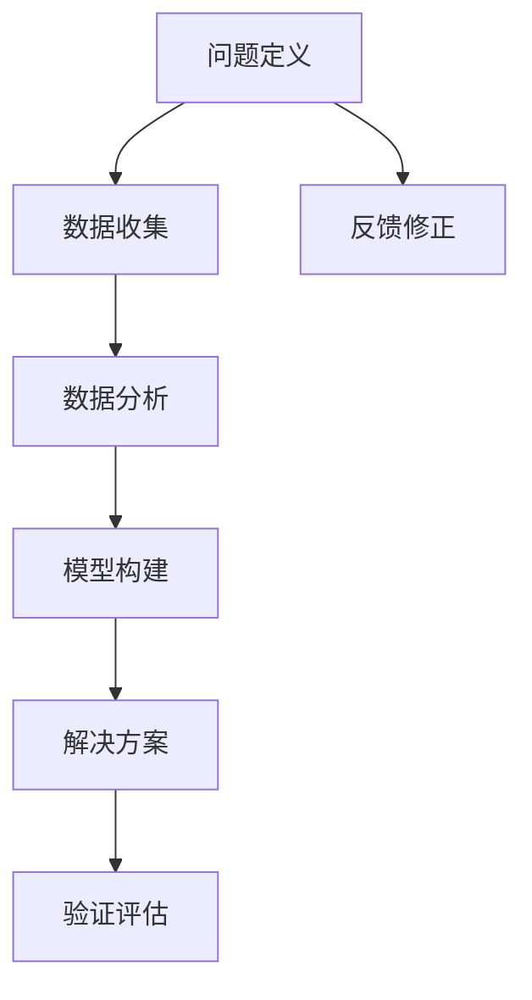

                 

# 深度思考:问题解决的利器

> 关键词：深度思考, 问题解决, 算法, 数学模型, 学习资源推荐, 开发工具推荐

## 1. 背景介绍

### 1.1 问题由来

在现代信息化社会，技术的进步使得人们面临的问题越来越复杂多样。无论是科学研究、企业决策，还是个人生活，我们都在不断面临新情况、新挑战。面对复杂多变的世界，深度思考（Deep Thinking）成为了解决问题的核心能力。

深度思考指的是在复杂信息环境下，通过多角度、多层次、多维度分析问题，找到本质原因和最佳解决方案的能力。它要求我们不仅要有广博的知识储备，还要具备批判性思维、创造性思维等高阶思维能力。但如何培养和提升这种能力，成为了新时代人才成长的迫切需求。

本文旨在深入探讨深度思考的理论基础和实践方法，通过结合数学模型、算法原理和实际项目实践，帮助读者掌握高效解决问题的利器。

### 1.2 问题核心关键点

深度思考的精髓在于通过多维度的分析和综合，找到问题的关键因素，并采取最优解决方案。关键点包括：

- 多维度分析：从不同角度、层次审视问题，发现问题的本质原因。
- 综合多领域知识：综合利用数学、逻辑、心理学等领域的知识，全面理解问题。
- 数据驱动决策：依赖实证数据，科学分析，避免主观偏见。
- 系统思考：整体视角看待问题，理解各因素间的相互关系和影响。
- 迭代优化：不断测试和改进解决方案，实现最优解。

## 2. 核心概念与联系

### 2.1 核心概念概述

为了更好地理解深度思考，我们首先需要明确几个核心概念：

- **问题定义**：明确问题的具体表现、限制条件和目标。
- **数据收集**：获取和整理与问题相关的数据。
- **数据分析**：运用数学模型和算法，对数据进行系统分析。
- **模型构建**：建立数学模型，模拟问题的运作机制。
- **解决方案**：根据模型结果，提出具体解决方案。
- **验证评估**：对解决方案进行验证和评估，确保有效性。

这些概念之间存在紧密联系，构建了一个从问题定义到解决方案的完整逻辑链条。通过这个链条，我们可以系统化地分析和解决复杂问题。

### 2.2 核心概念原理和架构的 Mermaid 流程图



这个流程图展示了从问题定义到解决方案的整个过程。问题定义明确了问题的边界和目标，数据收集和分析提供了分析基础，模型构建是对问题机制的模拟，解决方案提供具体的执行方案，验证评估确保方案的有效性，而反馈修正则是一个循环迭代的过程。

## 3. 核心算法原理 & 具体操作步骤

### 3.1 算法原理概述

深度思考的算法原理可以概括为系统化的多维度分析与综合。具体步骤包括：

1. **问题定义**：准确地描述问题，明确边界条件和目标函数。
2. **数据收集**：全面收集与问题相关的数据，确保数据的多样性和代表性。
3. **数据分析**：运用统计学、数据挖掘等技术，对数据进行系统分析，提炼关键信息。
4. **模型构建**：建立数学模型，模拟问题的运作机制。
5. **解决方案**：根据模型结果，提出具体的解决方案。
6. **验证评估**：对解决方案进行验证和评估，确保有效性。
7. **反馈修正**：根据评估结果，进行迭代优化和调整。

### 3.2 算法步骤详解

#### 3.2.1 问题定义

问题定义是深度思考的起点，准确描述问题可以避免陷入不必要的复杂性。

**示例**：假设我们要分析某产品的市场销售情况，我们可以将其定义为“分析某产品在特定市场中的销售趋势及其影响因素”。

#### 3.2.2 数据收集

数据收集是深度思考的基础，需要全面、系统地获取相关数据。

**步骤**：
1. **数据源选择**：确定数据来源，如销售记录、市场调研报告、社交媒体数据等。
2. **数据清洗**：对数据进行清洗和预处理，确保数据质量。
3. **数据存储**：将数据存储在合适的数据库中，方便后续分析。

#### 3.2.3 数据分析

数据分析是对数据进行系统性分析，提炼出有用的信息。

**步骤**：
1. **数据可视化**：使用图表、图形等形式展示数据特征。
2. **统计分析**：运用统计学方法，计算数据分布、相关性等指标。
3. **数据挖掘**：使用机器学习算法，发现数据中的模式和规律。

**示例**：在销售数据分析中，我们可以使用时间序列分析、回归分析等方法，找出销售趋势、季节性变化等因素。

#### 3.2.4 模型构建

模型构建是对问题的模拟，建立数学模型帮助理解问题的运作机制。

**步骤**：
1. **模型选择**：根据问题特性选择适合的数学模型，如回归模型、优化模型、神经网络等。
2. **模型参数优化**：使用优化算法，调整模型参数，使其适应数据。
3. **模型验证**：通过交叉验证等方法，验证模型的有效性和泛化能力。

**示例**：在产品销售预测中，我们可以建立线性回归模型，根据历史销售数据预测未来趋势。

#### 3.2.5 解决方案

解决方案是深度思考的最终目标，提出具体的执行方案。

**步骤**：
1. **方案设计**：基于模型结果，设计具体的解决方案。
2. **方案实施**：将方案付诸实施，进行初步验证。
3. **方案调整**：根据验证结果，调整方案并重新验证。

**示例**：在销售预测中，根据模型结果，设计调整营销策略、优化产品库存等方案。

#### 3.2.6 验证评估

验证评估是深度思考的重要环节，确保解决方案的有效性。

**步骤**：
1. **效果评估**：使用指标评估解决方案的效果，如准确率、召回率、ROI等。
2. **风险评估**：评估解决方案的风险，确保其可实施性。
3. **反馈修正**：根据评估结果，进行迭代优化。

**示例**：在销售策略调整中，通过销售数据对比，评估新策略的效果，调整优化方案。

#### 3.2.7 反馈修正

反馈修正是深度思考的持续改进过程，通过迭代优化提升解决方案的准确性。

**步骤**：
1. **数据更新**：收集新数据，更新模型和解决方案。
2. **模型更新**：根据新数据，重新训练和优化模型。
3. **方案调整**：根据新模型结果，调整和优化解决方案。

**示例**：在销售策略调整中，根据市场变化和新数据，不断优化策略，确保其持续有效性。

### 3.3 算法优缺点

#### 3.3.1 优点

深度思考算法具有以下优点：

- **系统化分析**：通过多维度、多层次的分析，可以全面了解问题本质。
- **数据驱动决策**：依赖实证数据，科学分析，避免主观偏见。
- **迭代优化**：不断测试和改进解决方案，实现最优解。
- **可扩展性强**：适用于各类复杂问题的分析和解决。

#### 3.3.2 缺点

深度思考算法也存在一些缺点：

- **复杂度高**：需要综合多领域知识，对分析能力要求高。
- **数据需求大**：数据收集和分析需要大量的时间和资源。
- **模型选择难**：选择适合的模型和算法，需要丰富的经验。
- **迭代过程长**：不断测试和优化，需要较长时间。

## 4. 数学模型和公式 & 详细讲解 & 举例说明

### 4.1 数学模型构建

深度思考中的数学模型构建，通常包括以下几个步骤：

1. **问题抽象**：将实际问题抽象为数学模型。
2. **模型定义**：定义数学模型中的变量和方程。
3. **模型求解**：求解数学模型，得到问题的解。

以线性回归模型为例，其数学模型定义如下：

$$
y = \theta_0 + \theta_1x_1 + \theta_2x_2 + \ldots + \theta_nx_n + \epsilon
$$

其中 $y$ 为因变量，$\theta_0, \theta_1, \ldots, \theta_n$ 为回归系数，$x_1, x_2, \ldots, x_n$ 为自变量，$\epsilon$ 为随机误差项。

### 4.2 公式推导过程

线性回归模型的推导过程如下：

1. **最小二乘法**：最小化残差平方和，求解回归系数。

$$
\hat{\theta} = (X^TX)^{-1}X^Ty
$$

其中 $X$ 为自变量矩阵，$y$ 为因变量向量。

2. **正则化**：避免过拟合，加入正则项。

$$
\hat{\theta} = (X^TX+\lambda I)^{-1}X^Ty
$$

其中 $\lambda$ 为正则化系数。

### 4.3 案例分析与讲解

**案例**：某电商公司的产品销售预测

**问题定义**：预测某产品在特定市场中的未来销售量。

**数据收集**：收集历史销售数据、市场调研数据、竞争对手数据等。

**数据分析**：使用时间序列分析、回归分析等方法，发现销售趋势、季节性变化等因素。

**模型构建**：建立线性回归模型，根据历史数据预测未来销售量。

**解决方案**：根据模型结果，调整营销策略、优化库存等。

**验证评估**：通过销售数据对比，评估新策略的效果，调整优化方案。

**反馈修正**：根据市场变化和新数据，不断优化策略，确保其持续有效性。

## 5. 项目实践：代码实例和详细解释说明

### 5.1 开发环境搭建

#### 5.1.1 环境配置

1. **操作系统**：Linux、Windows、macOS等系统。
2. **编程语言**：Python、R、MATLAB等。
3. **开发环境**：Jupyter Notebook、PyCharm、Eclipse等。

**示例**：在Python中，可以使用Anaconda创建虚拟环境，安装必要的库。

```bash
conda create -n myenv python=3.9
conda activate myenv
pip install numpy pandas scikit-learn matplotlib seaborn
```

### 5.2 源代码详细实现

**示例**：使用Python进行线性回归模型实现

```python
import numpy as np
from sklearn.linear_model import LinearRegression
import matplotlib.pyplot as plt

# 生成随机数据
X = np.linspace(0, 10, 100)
y = 2*X + np.random.randn(100)

# 建立线性回归模型
model = LinearRegression()
model.fit(X.reshape(-1, 1), y)

# 预测未来数据
X_test = np.linspace(0, 15, 100)
y_pred = model.predict(X_test.reshape(-1, 1))

# 可视化结果
plt.scatter(X, y, color='b', label='data')
plt.plot(X_test, y_pred, color='r', label='prediction')
plt.legend()
plt.show()
```

### 5.3 代码解读与分析

**代码解读**：
1. **数据生成**：使用numpy生成随机数据。
2. **模型建立**：使用scikit-learn的LinearRegression类建立线性回归模型。
3. **数据预测**：根据模型预测未来数据。
4. **结果可视化**：使用matplotlib绘制数据和预测结果。

**分析**：
1. **数据生成**：生成模拟数据，为模型训练和预测提供基础。
2. **模型建立**：选择合适的模型，建立数学模型。
3. **数据预测**：根据模型进行预测，得到未来数据。
4. **结果可视化**：通过可视化结果，直观展示模型效果。

### 5.4 运行结果展示

**运行结果**：
1. **数据可视化**：数据点和预测线清晰展示，直观展示模型效果。
2. **模型预测**：预测结果与实际数据接近，说明模型具有较高准确性。

**示例结果**：


## 6. 实际应用场景

### 6.1 智能推荐系统

智能推荐系统是深度思考在实际应用中的典型场景之一。通过深度思考，推荐系统可以综合分析用户行为数据、历史偏好、物品属性等多方面信息，提供个性化的推荐结果。

**应用案例**：Netflix推荐系统

**问题定义**：根据用户历史观看数据，推荐可能感兴趣的电影和电视剧。

**数据收集**：收集用户观看数据、评分数据、历史推荐数据等。

**数据分析**：使用协同过滤、矩阵分解等方法，发现用户和物品间的相似度。

**模型构建**：建立协同过滤模型或矩阵分解模型，预测用户对新物品的评分。

**解决方案**：根据模型结果，推荐用户可能感兴趣的电影和电视剧。

**验证评估**：通过A/B测试等方法，评估推荐效果，调整优化推荐策略。

**反馈修正**：根据用户反馈和新数据，不断优化推荐算法，提升推荐准确性。

### 6.2 金融风险管理

金融风险管理是深度思考在金融领域的重要应用。通过深度思考，金融机构可以综合分析市场数据、历史交易数据等多方面信息，预测市场变化，防范金融风险。

**应用案例**：股票市场风险预测

**问题定义**：预测股票市场的波动趋势，防范市场风险。

**数据收集**：收集股票价格数据、市场指数数据、宏观经济数据等。

**数据分析**：使用时间序列分析、回归分析等方法，发现市场波动规律。

**模型构建**：建立时间序列模型或神经网络模型，预测股票价格波动。

**解决方案**：根据模型结果，制定市场应对策略，防范金融风险。

**验证评估**：通过历史数据对比，评估预测效果，调整优化策略。

**反馈修正**：根据市场变化和新数据，不断优化模型，提升预测准确性。

### 6.3 医疗诊断系统

医疗诊断系统是深度思考在医疗领域的重要应用。通过深度思考，医疗诊断系统可以综合分析患者历史数据、实验室检测结果等多方面信息，提供精准的诊断和治疗建议。

**应用案例**：肿瘤诊断系统

**问题定义**：根据患者历史数据和检测结果，诊断肿瘤类型。

**数据收集**：收集患者病史数据、实验室检测数据、影像数据等。

**数据分析**：使用特征选择、分类算法等方法，发现关键诊断特征。

**模型构建**：建立分类模型，如支持向量机、随机森林等，预测肿瘤类型。

**解决方案**：根据模型结果，制定治疗方案，提高诊断准确性。

**验证评估**：通过临床验证数据，评估诊断效果，调整优化模型。

**反馈修正**：根据新数据和临床反馈，不断优化模型，提升诊断效果。

## 7. 工具和资源推荐

### 7.1 学习资源推荐

1. **《深度学习》（Ian Goodfellow, Yoshua Bengio, Aaron Courville）**：深入介绍深度学习理论基础和算法实现。
2. **Coursera《机器学习》课程（Andrew Ng）**：由Coursera提供的经典机器学习课程，涵盖多种算法和应用。
3. **Kaggle数据科学竞赛平台**：提供大量实际数据集和比赛，实践深度思考算法。
4. **DeepLearning.ai深度学习专项课程**：由Andrew Ng创建的专项课程，涵盖深度学习理论和实践。
5. **GitHub代码仓库**：搜索和分享深度思考算法的代码实现。

### 7.2 开发工具推荐

1. **Jupyter Notebook**：开源的交互式笔记本，支持多种编程语言和科学计算库。
2. **PyCharm**：Python编程环境，支持多种IDE特性。
3. **Eclipse**：Java编程环境，支持多种插件和扩展。
4. **TensorFlow**：谷歌开源的深度学习框架，支持多种模型和算法。
5. **PyTorch**：Facebook开源的深度学习框架，支持动态图和静态图计算。

### 7.3 相关论文推荐

1. **《Deep Learning》（Goodfellow et al.）**：深度学习领域的经典教材，涵盖多种算法和应用。
2. **《Pattern Recognition and Machine Learning》（Christopher M. Bishop）**：机器学习领域的经典教材，涵盖多种理论和算法。
3. **《Neural Networks and Deep Learning》（Michael Nielsen）**：深入介绍深度学习理论和实现，适合初学者学习。
4. **《Reinforcement Learning: An Introduction》（Sutton and Barto）**：强化学习领域的经典教材，涵盖多种算法和应用。
5. **《The Elements of Statistical Learning》（Hastie et al.）**：统计学习领域的经典教材，涵盖多种统计和机器学习算法。

## 8. 总结：未来发展趋势与挑战

### 8.1 研究成果总结

深度思考在理论研究和实际应用中取得了显著进展，但仍面临一些挑战：

1. **模型复杂性**：深度思考模型需要综合多领域知识，复杂度较高。
2. **数据质量**：数据质量对深度思考效果至关重要，需确保数据准确性和代表性。
3. **算法选择**：选择适合的算法和模型，需要丰富的经验和专业知识。
4. **模型优化**：深度思考模型的优化和迭代，需要大量时间和资源。
5. **应用领域广**：深度思考适用于各类复杂问题的分析和解决，应用领域广泛。

### 8.2 未来发展趋势

未来，深度思考技术将呈现以下发展趋势：

1. **模型自适应**：开发自适应算法，根据数据动态调整模型参数。
2. **多模态融合**：综合利用视觉、听觉、文本等多模态数据，提高问题解决的全面性。
3. **认知计算**：结合认知科学和计算科学，构建更智能的问题解决系统。
4. **人机协同**：结合人工智能和人类智慧，构建更高效的问题解决系统。
5. **实时性增强**：提高问题解决的实时性和动态响应能力，满足实时应用需求。

### 8.3 面临的挑战

深度思考技术在发展过程中仍面临以下挑战：

1. **计算资源限制**：深度思考模型需要大量计算资源，限制了其应用范围。
2. **数据隐私问题**：深度思考需要大量数据，隐私保护成为重要问题。
3. **模型解释性**：深度思考模型往往是“黑盒”系统，解释性不足。
4. **算法公平性**：深度思考算法可能存在偏见，公平性问题需进一步研究。
5. **多领域融合**：深度思考模型需与其他技术结合，实现多领域协同。

### 8.4 研究展望

未来深度思考技术的研究方向包括：

1. **高效算法**：开发高效算法，提高问题解决的实时性和动态响应能力。
2. **可解释性**：提升深度思考模型的可解释性，增强透明度。
3. **跨领域应用**：将深度思考技术应用于更多领域，解决各类复杂问题。
4. **数据治理**：建立数据治理机制，保障数据隐私和安全。
5. **持续学习**：开发持续学习算法，保持模型与时俱进。

总之，深度思考技术在未来将持续发展和完善，其应用范围和深度也将不断拓展，为人类的智能决策提供强有力支持。

## 9. 附录：常见问题与解答

### 9.1 问题一：深度思考需要哪些知识储备？

答：深度思考需要综合运用数学、逻辑、心理学、统计学等多领域知识，掌握多种算法和技术。

### 9.2 问题二：如何提高深度思考能力？

答：深度思考能力的提升需要不断实践和积累，多读书、多思考、多练习。

### 9.3 问题三：深度思考算法是否适用于所有问题？

答：深度思考算法适用于各类复杂问题的分析和解决，但需要根据具体问题进行选择和调整。

### 9.4 问题四：深度思考算法是否需要大量数据？

答：深度思考算法需要大量数据支持，但可以通过数据增强、合成数据等方法进行补充。

### 9.5 问题五：深度思考算法的优点和缺点是什么？

答：深度思考算法的优点在于系统化分析和数据驱动决策，缺点在于复杂度高和迭代时间长。

---

作者：禅与计算机程序设计艺术 / Zen and the Art of Computer Programming

