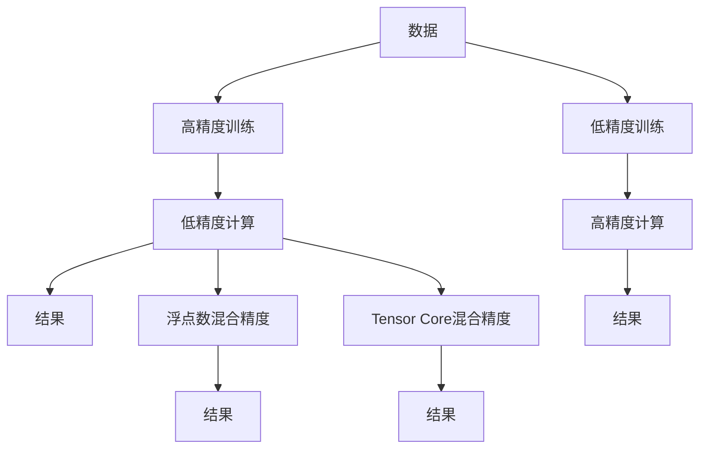

                 

## 1. 背景介绍

随着人工智能技术的发展，深度学习模型，尤其是深度神经网络，已经成为处理各种复杂问题的强大工具。在训练深度神经网络时，数据处理和模型计算往往需要消耗大量的计算资源。在过去，数据以8位有符号整数（int8）进行表示和存储，导致大量的存储空间和计算资源浪费。混合精度（Mixed Precision）技术应运而生，将数据以不同的精度进行表示和计算，从而提高计算效率和模型性能。

在工业界，混合精度技术已经被广泛应用于深度学习模型的训练和推理过程中，显著提升了训练速度和模型性能。本文将深入探讨混合精度的核心概念、算法原理、具体操作步骤及其在实际应用场景中的广泛应用。

## 2. 核心概念与联系

### 2.1 核心概念概述

混合精度（Mixed Precision）技术是一种将数据在计算过程中以不同精度进行表示和计算的技术。这种技术可以大幅度提高深度学习模型的训练速度和推理性能，同时保持较高的模型精度。

常见的混合精度技术包括两种模式：

1. **Tensor Core混合精度**：这种模式主要应用于NVIDIA的GPU硬件上，可以将数据在计算过程中分别以半精度（FP16）和整数精度（int8）进行表示和计算，从而大幅提高计算效率和模型性能。

2. **浮点数混合精度**：这种模式主要应用于CPU和XPU硬件上，通过使用不同的浮点数精度（如32位浮点数和16位浮点数），从而在保证模型精度的同时，降低计算资源消耗。

### 2.2 核心概念原理和架构的 Mermaid 流程图



该图展示了混合精度技术的基本流程。数据首先被高精度训练（B），然后在低精度计算（C）中得到结果。另一种模式是将数据低精度训练（E），再在高精度计算（F）中得到结果。此外，还有将数据在计算过程中同时使用不同的精度（H、J）的情况。

## 3. 核心算法原理 & 具体操作步骤

### 3.1 算法原理概述

混合精度技术的核心原理在于将数据在计算过程中以不同的精度进行表示和计算。这种技术可以显著提高计算效率和模型性能，同时保持较高的模型精度。常见的混合精度技术包括Tensor Core混合精度和浮点数混合精度两种模式。

Tensor Core混合精度主要应用于NVIDIA的GPU硬件上，通过将数据在计算过程中分别以半精度（FP16）和整数精度（int8）进行表示和计算，从而大幅提高计算效率和模型性能。而浮点数混合精度则主要应用于CPU和XPU硬件上，通过使用不同的浮点数精度（如32位浮点数和16位浮点数），从而在保证模型精度的同时，降低计算资源消耗。

### 3.2 算法步骤详解

Tensor Core混合精度的具体步骤如下：

1. **数据加载和预处理**：将数据加载到GPU内存中，并进行预处理，包括数据分块、数据批量等。

2. **Tensor Core计算**：将数据以半精度（FP16）和整数精度（int8）分别输入到GPU的Tensor Core中进行计算。

3. **结果后处理**：将计算结果进行后处理，包括数据裁剪、数据归一化等操作，最终得到模型结果。

浮点数混合精度的具体步骤如下：

1. **数据加载和预处理**：将数据加载到CPU内存中，并进行预处理，包括数据分块、数据批量等。

2. **浮点数计算**：将数据以32位浮点数和16位浮点数分别输入到CPU中进行计算。

3. **结果后处理**：将计算结果进行后处理，包括数据裁剪、数据归一化等操作，最终得到模型结果。

### 3.3 算法优缺点

混合精度技术的优点在于：

1. **计算效率高**：通过将数据以不同的精度进行表示和计算，可以显著提高计算效率和模型性能。

2. **模型精度高**：混合精度技术可以在保证模型精度的同时，降低计算资源消耗。

3. **硬件兼容性广**：混合精度技术不仅适用于NVIDIA的GPU，还适用于CPU和XPU等硬件设备。

混合精度技术的缺点在于：

1. **精度损失**：使用混合精度技术可能会导致一定的精度损失，尤其是在使用较低的精度（如int8）时。

2. **硬件依赖**：混合精度技术需要特定的硬件设备支持，如NVIDIA的GPU等，这在一定程度上限制了其应用范围。

3. **复杂度高**：混合精度技术需要对模型进行特殊的调整和优化，以适应不同的精度模式，增加了实现难度。

### 3.4 算法应用领域

混合精度技术已经在深度学习模型的训练和推理过程中得到了广泛应用，尤其是在大规模深度学习模型和高效计算场景中表现出色。以下是混合精度技术的主要应用领域：

1. **计算机视觉**：在图像分类、目标检测、人脸识别等计算机视觉任务中，混合精度技术可以显著提高模型的计算效率和性能。

2. **自然语言处理**：在文本分类、情感分析、机器翻译等自然语言处理任务中，混合精度技术可以提高模型的训练速度和推理性能。

3. **语音识别**：在语音识别和语音合成任务中，混合精度技术可以降低计算资源消耗，提高模型的实时性。

4. **推荐系统**：在推荐系统和个性化推荐任务中，混合精度技术可以提高模型的训练速度和推荐效率。

5. **视频处理**：在视频处理和视频分析任务中，混合精度技术可以提高模型的计算效率和性能。

## 4. 数学模型和公式 & 详细讲解 & 举例说明

### 4.1 数学模型构建

混合精度技术的数学模型构建主要涉及浮点数表示和计算。在Tensor Core混合精度中，数据分别以半精度（FP16）和整数精度（int8）进行表示和计算。而在浮点数混合精度中，数据分别以32位浮点数和16位浮点数进行表示和计算。

### 4.2 公式推导过程

以Tensor Core混合精度为例，设数据表示为X，计算结果为Y，则公式推导过程如下：

$$
Y = \frac{1}{2} \times (X_{FP16} + X_{int8})
$$

其中，X_{FP16}表示半精度数据，X_{int8}表示整数精度数据。该公式将数据分别以半精度和整数精度进行计算，然后将结果进行加权平均，得到最终的计算结果Y。

### 4.3 案例分析与讲解

假设有一个深度学习模型，需要在GPU上训练一个大型图像分类任务。使用Tensor Core混合精度技术，将数据分别以半精度和整数精度进行计算，可以显著提高计算效率和模型性能。

具体来说，将图像数据加载到GPU内存中，并进行预处理。然后，将数据以半精度（FP16）和整数精度（int8）分别输入到GPU的Tensor Core中进行计算。最后，将计算结果进行后处理，得到最终的模型结果。

## 5. 项目实践：代码实例和详细解释说明

### 5.1 开发环境搭建

在进行混合精度项目实践前，我们需要准备好开发环境。以下是使用Python进行TensorFlow开发的环境配置流程：

1. 安装Anaconda：从官网下载并安装Anaconda，用于创建独立的Python环境。

2. 创建并激活虚拟环境：
```bash
conda create -n tf-env python=3.8 
conda activate tf-env
```

3. 安装TensorFlow：
```bash
pip install tensorflow
```

4. 安装Tensor Core库：
```bash
pip install tensorrt-gpu
```

5. 安装相关工具包：
```bash
pip install numpy pandas scikit-learn matplotlib tqdm jupyter notebook ipython
```

完成上述步骤后，即可在`tf-env`环境中开始混合精度项目实践。

### 5.2 源代码详细实现

以下是使用TensorFlow实现Tensor Core混合精度的代码示例：

```python
import tensorflow as tf
from tensorflow.python.framework import dtypes

# 定义Tensor Core混合精度的计算函数
def tensor_core_mixed_precision(data):
    fp16_data = tf.cast(data, dtypes.half)
    int8_data = tf.cast(data, tf.int8)
    result = tf.add(fp16_data, int8_data) / 2
    return result

# 加载数据
data = tf.constant([1, 2, 3, 4], dtype=tf.int8)

# 计算结果
result = tensor_core_mixed_precision(data)

# 打印结果
print(result.numpy())
```

### 5.3 代码解读与分析

让我们再详细解读一下关键代码的实现细节：

**tensor_core_mixed_precision函数**：
- 将数据分别以半精度和整数精度进行计算，并将结果进行加权平均，得到最终的计算结果。

**data**：
- 定义一个整数数据，作为计算的输入。

**result**：
- 调用tensor_core_mixed_precision函数，对数据进行混合精度计算，得到最终结果。

**print(result.numpy())**：
- 将结果转换为NumPy数组，并打印输出。

可以看到，Tensor Core混合精度技术的实现非常简洁高效。开发者只需使用TensorFlow提供的相关API，即可轻松实现混合精度计算。

## 6. 实际应用场景

### 6.1 计算机视觉

在计算机视觉领域，混合精度技术可以显著提高图像分类、目标检测、人脸识别等任务的计算效率和性能。例如，在使用TensorFlow训练一个大型图像分类模型时，可以使用Tensor Core混合精度技术，将数据分别以半精度和整数精度进行计算，从而大幅度提高训练速度和模型精度。

### 6.2 自然语言处理

在自然语言处理领域，混合精度技术可以提高文本分类、情感分析、机器翻译等任务的计算效率和性能。例如，在训练一个大型文本分类模型时，可以使用浮点数混合精度技术，将数据分别以32位浮点数和16位浮点数进行计算，从而提高模型的训练速度和推理性能。

### 6.3 语音识别

在语音识别和语音合成任务中，混合精度技术可以降低计算资源消耗，提高模型的实时性。例如，在训练一个大型语音识别模型时，可以使用Tensor Core混合精度技术，将数据分别以半精度和整数精度进行计算，从而大幅度提高模型的计算效率和精度。

### 6.4 推荐系统

在推荐系统和个性化推荐任务中，混合精度技术可以提高模型的训练速度和推荐效率。例如，在训练一个大型推荐系统模型时，可以使用浮点数混合精度技术，将数据分别以32位浮点数和16位浮点数进行计算，从而提高模型的训练速度和推理性能。

## 7. 工具和资源推荐

### 7.1 学习资源推荐

为了帮助开发者系统掌握混合精度技术的理论基础和实践技巧，这里推荐一些优质的学习资源：

1. 《深度学习基础教程》系列博文：由深度学习专家撰写，深入浅出地介绍了深度学习模型的基本概念和计算原理。

2. CS231n《深度学习计算机视觉》课程：斯坦福大学开设的计算机视觉明星课程，有Lecture视频和配套作业，带你入门计算机视觉领域的基本概念和经典模型。

3. 《TensorFlow实战深度学习》书籍：TensorFlow官方文档，全面介绍了TensorFlow框架的使用方法，包括混合精度在内的诸多范式。

4. NVIDIA官方文档：NVIDIA的Tensor Core混合精度技术文档，提供了详细的混合精度技术使用教程和样例代码。

5. 《Tensor Core混合精度编程指南》：NVIDIA官方指南，详细介绍了Tensor Core混合精度技术的实现方法。

通过对这些资源的学习实践，相信你一定能够快速掌握混合精度技术的精髓，并用于解决实际的深度学习问题。

### 7.2 开发工具推荐

高效的开发离不开优秀的工具支持。以下是几款用于混合精度开发的常用工具：

1. TensorFlow：基于Python的开源深度学习框架，灵活动态的计算图，适合快速迭代研究。TensorFlow提供了丰富的混合精度API，支持Tensor Core混合精度和浮点数混合精度。

2. PyTorch：基于Python的开源深度学习框架，灵活性高，支持多种硬件设备。PyTorch提供了混合精度API，支持Tensor Core混合精度和浮点数混合精度。

3. TensorCore：NVIDIA开发的Tensor Core库，支持混合精度计算，可以在NVIDIA的GPU上高效实现混合精度计算。

4. Weights & Biases：模型训练的实验跟踪工具，可以记录和可视化模型训练过程中的各项指标，方便对比和调优。与主流深度学习框架无缝集成。

5. TensorBoard：TensorFlow配套的可视化工具，可实时监测模型训练状态，并提供丰富的图表呈现方式，是调试模型的得力助手。

6. Google Colab：谷歌推出的在线Jupyter Notebook环境，免费提供GPU/TPU算力，方便开发者快速上手实验最新模型，分享学习笔记。

合理利用这些工具，可以显著提升混合精度项目开发的效率，加快创新迭代的步伐。

### 7.3 相关论文推荐

混合精度技术的发展源于学界的持续研究。以下是几篇奠基性的相关论文，推荐阅读：

1. "Training With Mixed-Precision: Accelerating Deep and Convolutional Neural Networks"：NVIDIA论文，介绍了Tensor Core混合精度的基本原理和应用场景。

2. "Faster Deep Learning with Mixed Precision Training"：NVIDIA论文，介绍了如何在CPU和GPU上高效实现混合精度计算。

3. "Mixed-Precision Training with Tensor Cores"：NVIDIA论文，介绍了Tensor Core混合精度的实现方法和性能提升效果。

4. "A Survey of Mixed Precision Techniques in Deep Learning"：综述论文，总结了混合精度技术在深度学习中的多种实现方法和应用效果。

5. "Deterministic Mixed-Precision Training for Deep Neural Networks"：论文，介绍了如何在深度神经网络中实现混合精度计算，并保证模型的精度。

这些论文代表了大规模混合精度技术的发展脉络。通过学习这些前沿成果，可以帮助研究者把握学科前进方向，激发更多的创新灵感。

## 8. 总结：未来发展趋势与挑战

### 8.1 总结

本文对混合精度技术进行了全面系统的介绍。首先阐述了混合精度技术的基本概念和计算原理，明确了混合精度技术在深度学习模型训练和推理过程中的重要作用。其次，从原理到实践，详细讲解了混合精度技术的核心步骤，给出了混合精度任务开发的完整代码实例。同时，本文还广泛探讨了混合精度技术在计算机视觉、自然语言处理、语音识别、推荐系统等多个行业领域的应用前景，展示了混合精度技术的广阔应用场景。此外，本文精选了混合精度技术的各类学习资源，力求为读者提供全方位的技术指引。

通过本文的系统梳理，可以看到，混合精度技术在深度学习模型训练和推理过程中，已经取得了显著的计算效率和性能提升，大大降低了计算资源消耗。未来，随着硬件设备的进一步升级和软件工具的不断完善，混合精度技术将更加成熟和高效，成为深度学习领域的重要技术手段。

### 8.2 未来发展趋势

展望未来，混合精度技术将呈现以下几个发展趋势：

1. **硬件升级**：随着硬件设备的进一步升级，混合精度技术的计算效率和性能将进一步提升。未来，更多的高性能硬件设备（如下一代NVIDIA GPU、TPU等）将支持混合精度计算，大幅提高深度学习模型的训练和推理速度。

2. **软件优化**：未来的混合精度技术将更加注重软件优化，提供更加灵活和高效的API接口，支持多种硬件设备和深度学习框架，满足不同场景的需求。

3. **模型压缩**：未来的混合精度技术将进一步优化模型结构，降低模型大小，提高计算效率。例如，通过剪枝、量化等技术，可以将模型压缩到更小的尺寸，从而适应不同的硬件设备。

4. **自动混合精度**：未来的混合精度技术将更加智能，自动选择最优的精度模式进行计算，从而在保证模型精度的同时，最大化计算效率。

5. **跨平台支持**：未来的混合精度技术将实现跨平台支持，不仅支持NVIDIA GPU，还支持CPU、XPU等多种硬件设备，从而实现更广泛的适用范围。

6. **混合精度训练**：未来的混合精度技术将更加注重混合精度训练，结合自动混合精度、自动混合精度训练等技术，提高深度学习模型的训练速度和性能。

以上趋势凸显了混合精度技术的广阔前景。这些方向的探索发展，必将进一步提升深度学习模型的计算效率和性能，为人类认知智能的进化带来深远影响。

### 8.3 面临的挑战

尽管混合精度技术已经取得了瞩目成就，但在迈向更加智能化、普适化应用的过程中，它仍面临着诸多挑战：

1. **精度损失**：使用混合精度技术可能会导致一定的精度损失，尤其是在使用较低的精度（如int8）时。如何保持模型精度，同时提高计算效率，是一个重要的研究方向。

2. **硬件依赖**：混合精度技术需要特定的硬件设备支持，如NVIDIA GPU等，这在一定程度上限制了其应用范围。如何实现跨平台支持，是混合精度技术发展的重要方向。

3. **软件复杂性**：混合精度技术需要对模型进行特殊的调整和优化，以适应不同的精度模式，增加了实现难度。如何简化混合精度技术的使用，降低软件复杂性，是未来的研究重点。

4. **模型压缩**：虽然混合精度技术可以提高计算效率，但模型的大小仍然是一个重要问题。如何进一步优化模型结构，降低模型大小，提高计算效率，是混合精度技术发展的重要方向。

5. **性能平衡**：如何在计算效率和模型精度之间找到平衡点，是一个重要的研究方向。如何在保证模型精度的同时，最大化计算效率，是未来的研究方向。

6. **模型稳定性**：混合精度技术在实际应用中，如何保证模型稳定性和可靠性，是一个重要的研究方向。如何在不同场景下保证模型输出的一致性和可靠性，是未来的研究方向。

### 8.4 研究展望

面对混合精度技术所面临的种种挑战，未来的研究需要在以下几个方面寻求新的突破：

1. **探索新的混合精度模式**：除了Tensor Core混合精度和浮点数混合精度，还需要探索新的混合精度模式，如混合精度张量核（Mixed-Precision Tensor Core, MT）等，以进一步提升计算效率和模型性能。

2. **研究模型压缩技术**：需要进一步研究模型压缩技术，如剪枝、量化等，以降低模型大小，提高计算效率。同时需要探索新的模型压缩技术，如位宽压缩、混合精度量化等，以进一步优化模型结构。

3. **引入自动化混合精度技术**：需要引入自动化混合精度技术，自动选择最优的精度模式进行计算，从而在保证模型精度的同时，最大化计算效率。

4. **研究跨平台混合精度技术**：需要研究跨平台混合精度技术，支持多种硬件设备和深度学习框架，实现更广泛的适用范围。

5. **引入新的硬件支持**：需要引入新的硬件支持，如下一代NVIDIA GPU、TPU等，以进一步提升计算效率和模型性能。

6. **探索新的模型架构**：需要探索新的模型架构，如深度可分离卷积、神经网络剪枝等，以进一步优化模型结构，提高计算效率。

这些研究方向的探索，必将引领混合精度技术迈向更高的台阶，为深度学习模型的训练和推理提供更加高效、灵活、智能的技术手段。只有勇于创新、敢于突破，才能不断拓展混合精度技术的边界，让深度学习模型更好地服务于人类的认知智能。

## 9. 附录：常见问题与解答

**Q1：什么是混合精度技术？**

A: 混合精度技术是一种将数据在计算过程中以不同精度进行表示和计算的技术。这种技术可以显著提高深度学习模型的计算效率和性能，同时保持较高的模型精度。常见的混合精度技术包括Tensor Core混合精度和浮点数混合精度两种模式。

**Q2：混合精度技术在实际应用中需要注意哪些问题？**

A: 混合精度技术在实际应用中需要注意以下问题：

1. 精度损失：使用混合精度技术可能会导致一定的精度损失，尤其是在使用较低的精度（如int8）时。需要平衡计算效率和模型精度，找到最优的精度模式。

2. 硬件依赖：混合精度技术需要特定的硬件设备支持，如NVIDIA GPU等，这在一定程度上限制了其应用范围。需要实现跨平台支持，支持多种硬件设备和深度学习框架。

3. 软件复杂性：混合精度技术需要对模型进行特殊的调整和优化，以适应不同的精度模式，增加了实现难度。需要简化混合精度技术的使用，降低软件复杂性。

4. 模型压缩：虽然混合精度技术可以提高计算效率，但模型的大小仍然是一个重要问题。需要进一步优化模型结构，降低模型大小，提高计算效率。

5. 性能平衡：如何在计算效率和模型精度之间找到平衡点，是一个重要的研究方向。需要研究新的混合精度模式、模型压缩技术、自动化混合精度技术等，以提高混合精度技术的灵活性和智能性。

6. 模型稳定性：混合精度技术在实际应用中，如何保证模型稳定性和可靠性，是一个重要的研究方向。需要研究新的模型架构、硬件支持等，以提高混合精度技术的稳定性和可靠性。

**Q3：混合精度技术在计算机视觉中的应用场景有哪些？**

A: 混合精度技术在计算机视觉领域有广泛的应用场景，主要包括以下几个方面：

1. 图像分类：使用混合精度技术可以提高图像分类模型的计算效率和性能。例如，在使用TensorFlow训练一个大型图像分类模型时，可以使用Tensor Core混合精度技术，将数据分别以半精度和整数精度进行计算，从而大幅度提高训练速度和模型精度。

2. 目标检测：使用混合精度技术可以提高目标检测模型的计算效率和性能。例如，在使用TensorFlow训练一个大型目标检测模型时，可以使用Tensor Core混合精度技术，将数据分别以半精度和整数精度进行计算，从而提高模型的训练速度和推理性能。

3. 人脸识别：使用混合精度技术可以提高人脸识别模型的计算效率和性能。例如，在使用TensorFlow训练一个大型人脸识别模型时，可以使用Tensor Core混合精度技术，将数据分别以半精度和整数精度进行计算，从而提高模型的训练速度和识别精度。

**Q4：如何实现混合精度技术？**

A: 实现混合精度技术需要以下步骤：

1. 安装相应的深度学习框架和硬件设备，如TensorFlow、PyTorch、NVIDIA GPU等。

2. 加载数据，并进行预处理，包括数据分块、数据批量等。

3. 使用相应的API实现混合精度计算，如TensorFlow的tf.keras.mixed_precision.MixedPrecision上下文管理器、PyTorch的amp等。

4. 进行混合精度计算，使用半精度（FP16）和整数精度（int8）进行计算，并保存结果。

5. 对计算结果进行后处理，包括数据裁剪、数据归一化等操作，得到最终的模型结果。

通过这些步骤，可以实现混合精度计算，提高深度学习模型的计算效率和性能。

