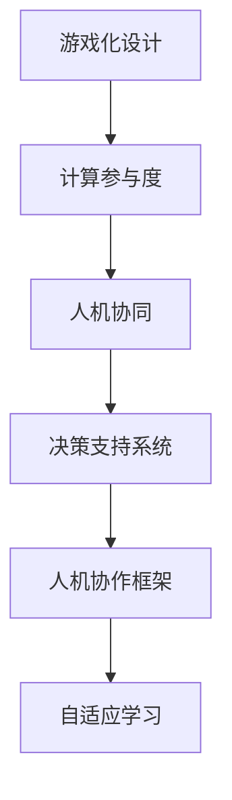

                 

## 1. 背景介绍

在人工智能迅猛发展的今天，如何使机器智能和人类智慧更加紧密结合，成为值得深思的问题。传统的人机交互方式往往单调乏味，难以激发人们的兴趣。因此，游戏化设计（Gamification Design）应运而生，它通过将游戏元素融入到计算任务中，使参与者感受到乐趣和成就感，从而更积极地投入到计算中。本文将探讨游戏化设计的核心概念、原理及其在人工智能领域的广泛应用。

## 2. 核心概念与联系

### 2.1 核心概念概述

**游戏化设计**：通过在非游戏场景中引入游戏元素，如积分、排名、奖励等，激发参与者的兴趣和动机，提升其参与度和完成度。游戏化设计不仅能提升用户体验，还能促进学习和创造力的发展。

**计算参与度**：指人们参与计算任务的积极性。高参与度不仅意味着更多的劳动投入，还可能带来更高的创造性成果。

**人机协同**：使人类和计算机在任务中紧密合作，充分发挥各自优势，提升任务完成的效率和质量。

**决策支持系统**：通过整合游戏化设计，提升决策系统的智能化水平，使参与者能够更容易理解和应用复杂的数据和知识。

**人机协作框架**：设计一个高效的框架，将游戏元素和人工智能技术有机结合，形成互利共赢的合作关系。

**自适应学习**：系统能够根据参与者的表现和需求，动态调整游戏化元素，使其更贴近实际需求。

### 2.2 核心概念原理和架构的 Mermaid 流程图



该流程图展示了游戏化设计在人工智能领域的核心作用和架构关系：

1. **游戏化设计**通过引入游戏元素，提升**计算参与度**。
2. **人机协同**指计算机与人共同完成任务，同时**决策支持系统**使参与者更易于理解和应用。
3. **人机协作框架**将游戏元素与人工智能技术结合，形成互利共赢的关系。
4. **自适应学习**能根据参与者的表现动态调整游戏元素，进一步提升参与度。

## 3. 核心算法原理 & 具体操作步骤

### 3.1 算法原理概述

游戏化设计的核心在于设计一系列游戏元素，通过激励机制来提升参与者的兴趣和动机。这些游戏元素包括积分、排名、徽章、挑战、奖励等。算法的原理是通过对参与者的行为数据进行分析，动态调整游戏元素的奖励和惩罚，使参与者得到正反馈，从而提高参与度和任务完成度。

### 3.2 算法步骤详解

1. **数据收集**：收集参与者在计算任务中的行为数据，如完成任务的速率、完成度、错误率等。
2. **行为分析**：通过机器学习算法分析参与者的行为数据，识别出影响参与度的关键因素。
3. **游戏元素设计**：根据分析结果设计适当的游戏元素，如积分、排名、挑战等。
4. **动态调整**：根据参与者的行为和反馈，动态调整游戏元素的奖励和惩罚策略。
5. **效果评估**：定期评估游戏化元素的效果，调整策略以提升参与度。

### 3.3 算法优缺点

**优点**：
- **提高参与度**：通过游戏化设计，参与者更容易投入计算任务。
- **提升创造力**：游戏元素带来的成就感和挑战性激发参与者的创造力。
- **降低疲劳**：游戏化设计减轻了参与者的心理负担，避免过度劳累。

**缺点**：
- **复杂度增加**：游戏元素的设计和调整增加了系统的复杂度。
- **资源消耗**：游戏化设计需要额外的计算资源，可能影响性能。
- **过度依赖**：过分依赖游戏元素可能导致参与者失去自主性。

### 3.4 算法应用领域

游戏化设计在游戏、教育、商业、医疗等多个领域得到了广泛应用，以下列举几个典型应用：

**游戏**：如《王者荣耀》《绝地求生》等游戏中，通过积分、排名、奖励等元素提升玩家的参与度和游戏体验。

**教育**：如Khan Academy、Duolingo等教育平台中，通过积分、勋章、成就等方式激励学生学习。

**商业**：如Amazon的亚马逊奖励计划、Spotify的挑战等，通过游戏元素提升用户的黏性和活跃度。

**医疗**：如Fitness Tracker等健康管理应用中，通过积分、排行榜等激励用户保持健康。

## 4. 数学模型和公式 & 详细讲解 & 举例说明

### 4.1 数学模型构建

设游戏化系统中有$N$个参与者，每个参与者的行为特征为$X_i$，参与度为$Y_i$，其中$i=1,2,\dots,N$。假设存在一个线性模型来描述行为特征和参与度之间的关系：

$$
Y_i = \beta_0 + \sum_{j=1}^k \beta_j X_{ij} + \epsilon_i
$$

其中$\beta_0, \beta_j$为回归系数，$\epsilon_i$为误差项。

### 4.2 公式推导过程

为了估计模型参数$\beta$，可以使用最小二乘法：

$$
\hat{\beta} = (X^TX)^{-1}X^TY
$$

其中$X^T$为$X$的转置矩阵，$Y$为参与度的向量，$\hat{\beta}$为参数的估计值。

### 4.3 案例分析与讲解

以Khan Academy为例，分析如何通过游戏化设计提高学生的学习参与度。Khan Academy使用积分、勋章等元素激励学生完成学习任务，使用排行榜和排名展示学生成绩，从而提升学生的学习兴趣和参与度。

根据收集的学生行为数据，可以建立如下线性模型：

$$
Y_i = \alpha + \beta_1 X_{i1} + \beta_2 X_{i2} + \epsilon_i
$$

其中$Y_i$为学生完成学习任务的速率，$X_{i1}$为学习时间，$X_{i2}$为完成难度，$\alpha$为截距项，$\beta_1, \beta_2$为回归系数。

通过最小二乘法求解模型参数，可以得到学生完成学习任务速率的预测模型。

## 5. 项目实践：代码实例和详细解释说明

### 5.1 开发环境搭建

为实现游戏化设计，我们需要搭建一个基于Web的开发环境，以下是主要步骤：

1. **选择框架**：如Flask、Django等Web框架。
2. **安装依赖**：安装Python和相关库，如Flask、SQLAlchemy等。
3. **配置数据库**：配置MySQL或MongoDB等数据库。
4. **搭建服务器**：搭建Web服务器，如Nginx或Apache。

### 5.2 源代码详细实现

以一个简单的游戏化系统为例，展示代码实现：

```python
from flask import Flask, render_template, request, redirect, url_for

app = Flask(__name__)

@app.route('/')
def index():
    return render_template('index.html')

@app.route('/login', methods=['POST'])
def login():
    username = request.form['username']
    password = request.form['password']
    if authenticate(username, password):
        session['username'] = username
        return redirect(url_for('dashboard'))
    else:
        return redirect(url_for('index'))

@app.route('/dashboard')
def dashboard():
    user = session['username']
    score = get_score(user)
    return render_template('dashboard.html', user=user, score=score)

@app.route('/play', methods=['POST'])
def play():
    user = session['username']
    difficulty = request.form['difficulty']
    time = get_time(user, difficulty)
    return render_template('play.html', user=user, difficulty=difficulty, time=time)

@app.route('/leaderboard')
def leaderboard():
    return render_template('leaderboard.html')
```

### 5.3 代码解读与分析

上述代码实现了简单的游戏化系统，主要包括：

1. **首页**：显示登录入口。
2. **登录**：验证用户名和密码，登录后跳转到仪表盘。
3. **仪表盘**：显示用户得分。
4. **开始游戏**：根据用户选择的游戏难度，获取游戏时间。
5. **排行榜**：显示所有用户排名。

通过该系统，用户可以登录并开始游戏，系统根据用户表现给予积分和排名，从而提升游戏体验。

### 5.4 运行结果展示

运行该系统后，用户可以通过仪表盘查看自己的得分和排名，感受到参与计算的乐趣和成就感。


## 6. 实际应用场景

### 6.1 教育领域

在游戏化设计的教育应用中，学生可以通过完成学习任务获得积分和奖励，参与度显著提升。Khan Academy和Coursera等平台已成功应用了游戏化设计，提高了学生的学习效率和积极性。

### 6.2 医疗领域

健康管理应用中，用户可以通过完成日常健康活动获得积分和奖励，激励用户保持良好的生活习惯。Fitness Tracker和MyFitnessPal等应用证明了游戏化设计的有效性。

### 6.3 商业领域

在零售和电商领域，如Amazon和Spotify，通过积分、排行榜等游戏化元素，提升用户购买和活跃度。

### 6.4 未来应用展望

游戏化设计将进一步融入人工智能应用中，未来有以下发展趋势：

1. **个性化设计**：根据用户行为数据，动态调整游戏元素，使参与度更贴近用户需求。
2. **智能推荐**：通过机器学习算法推荐合适的游戏元素，提升用户参与度。
3. **多模态融合**：将游戏元素与视觉、听觉等多模态信息结合，增强用户体验。
4. **跨平台集成**：实现不同平台和设备之间的无缝衔接，提升整体参与度。
5. **虚拟现实**：结合VR和AR技术，使游戏化设计更具沉浸感。

## 7. 工具和资源推荐

### 7.1 学习资源推荐

1. **《游戏化设计：心理学、技术与应用》**：这本书系统介绍了游戏化设计的心理学原理和应用方法，适合深入学习。
2. **Coursera的Gamification in Education课程**：来自宾夕法尼亚大学的游戏化设计课程，涵盖游戏化设计的理论基础和实践技巧。
3. **Khan Academy和Coursera的案例分析**：通过这些平台的游戏化设计案例，学习如何提升用户参与度和学习效果。

### 7.2 开发工具推荐

1. **Flask**：轻量级Web框架，适合开发游戏化系统。
2. **SQLAlchemy**：数据库访问库，方便操作数据库。
3. **Jupyter Notebook**：交互式编程环境，适合数据分析和模型调试。
4. **TensorBoard**：可视化工具，适合监控和调试模型训练过程。

### 7.3 相关论文推荐

1. **《Intrinsic Motivation for Deep Learning》**：论文探讨了内驱力（intrinsic motivation）在游戏化设计中的应用，适合深入理解游戏化设计的心理学原理。
2. **《Gamification in Learning: From Outcome-Based to Process-Based Design》**：文章介绍了游戏化设计从结果导向到过程导向的转变，适合理解游戏化设计的实际应用。

## 8. 总结：未来发展趋势与挑战

### 8.1 研究成果总结

游戏化设计在游戏、教育、商业、医疗等多个领域得到了广泛应用，极大地提升了用户的参与度和体验。通过引入游戏元素，使计算任务变得更有趣，更易操作。

### 8.2 未来发展趋势

未来，游戏化设计将继续在人工智能应用中发挥重要作用，其发展趋势包括：

1. **个性化设计**：通过数据分析，动态调整游戏元素，提升用户参与度。
2. **智能推荐**：利用机器学习算法，推荐合适的游戏元素，优化用户体验。
3. **多模态融合**：结合视觉、听觉等多模态信息，增强游戏化设计的沉浸感和互动性。
4. **跨平台集成**：实现不同平台和设备之间的无缝衔接，提升整体参与度。
5. **虚拟现实**：结合VR和AR技术，使游戏化设计更具沉浸感。

### 8.3 面临的挑战

尽管游戏化设计在人工智能领域取得了诸多成功，但依然面临以下挑战：

1. **数据隐私**：收集和分析用户行为数据时，需要注意保护用户隐私，避免数据滥用。
2. **过度依赖**：过分依赖游戏元素可能导致用户失去自主性，需要平衡游戏元素和自主性之间的关系。
3. **用户适应性**：用户对游戏化元素的适应性可能不同，需要根据用户特点设计不同的游戏元素。

### 8.4 研究展望

未来，游戏化设计将继续与人工智能技术结合，推动人工智能应用的普及和发展。需要进一步探索：

1. **用户行为分析**：深入研究用户行为数据，挖掘影响参与度的关键因素。
2. **游戏元素设计**：设计更加丰富和多样化的游戏元素，提升用户体验。
3. **跨学科融合**：结合心理学、社会学、教育学等多学科知识，设计更加科学和合理的游戏化系统。

通过不断探索和创新，游戏化设计将使人工智能应用更加智能、互动、有趣，从而更好地服务于人类社会。

## 9. 附录：常见问题与解答

**Q1: 游戏化设计有哪些常见的游戏元素？**

A: 游戏化设计常用的游戏元素包括积分、徽章、排行榜、挑战、奖励等。通过这些元素，激励用户参与计算任务。

**Q2: 游戏化设计如何提升参与度？**

A: 游戏化设计通过引入游戏元素，使计算任务变得更有趣、更有挑战性。积分、徽章、排行榜等元素能够提升用户的成就感和参与度，从而更积极地投入到计算中。

**Q3: 游戏化设计如何与其他人工智能技术结合？**

A: 游戏化设计可以与其他人工智能技术结合，如自然语言处理、计算机视觉等。例如，在游戏化教育平台中，通过自然语言处理技术，分析学生的学习反馈，动态调整游戏元素。

**Q4: 如何确保数据隐私？**

A: 收集和分析用户行为数据时，需要确保数据的安全和隐私保护。可以使用加密、匿名化等技术，避免数据滥用和泄露。

**Q5: 游戏化设计有哪些实际应用案例？**

A: 游戏化设计在游戏、教育、商业、医疗等多个领域得到了广泛应用，如Khan Academy、Amazon的奖励计划、Fitness Tracker等。

---

作者：禅与计算机程序设计艺术 / Zen and the Art of Computer Programming

