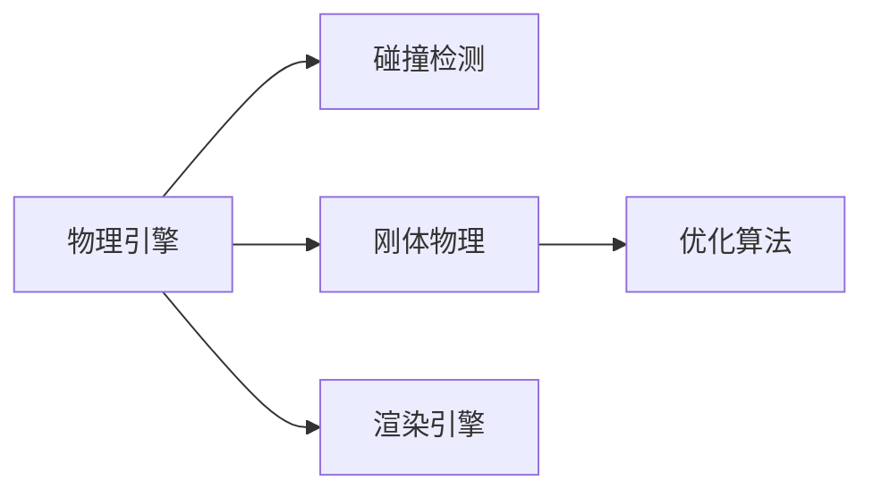

                 

# 游戏物理引擎：实现真实世界模拟

## 1. 背景介绍

在现代游戏开发中，物理引擎是构建逼真模拟环境的核心组件。它不仅用于游戏角色的物理交互，如碰撞检测、运动仿真，还应用于场景渲染、自然环境模拟等多个方面，极大地提升了游戏的沉浸感和真实感。然而，物理引擎的开发和实现并不是一件易事，它需要深厚的数学和物理知识基础，以及高效的计算算法和实现技巧。本文旨在系统介绍游戏物理引擎的核心概念、关键技术和实现流程，希望为广大游戏开发者提供全面的技术指导。

## 2. 核心概念与联系

### 2.1 核心概念概述

在探讨游戏物理引擎的实现前，我们先介绍几个关键的概念：

- **物理引擎(Physics Engine)**：用于模拟物理世界交互的计算软件，能够处理如碰撞检测、运动仿真、刚体物理等复杂问题。
- **碰撞检测(Collision Detection)**：用于检测物体间是否有接触，常用的方法包括包围盒、八叉树、k-d树等。
- **刚体物理(Rigid Body Dynamics)**：描述刚体在力作用下的运动，包括位形空间、速度空间、力空间等概念。
- **优化算法(Optimization Algorithms)**：用于求解物理系统的最优解，常用的方法包括牛顿法、拉格朗日乘子法、梯度下降等。
- **渲染引擎(Rendering Engine)**：将物理引擎的计算结果呈现为可视化的3D场景，包括光线追踪、着色器、纹理贴图等技术。

这些概念之间的联系可以通过以下Mermaid流程图来展示：



这个流程图展示了物理引擎的核心组成部分及其相互关系：

1. 物理引擎包含碰撞检测和刚体物理两个子系统。
2. 刚体物理系统通过优化算法解决复杂的运动方程。
3. 物理引擎的计算结果最终通过渲染引擎呈现为3D场景。

### 2.2 核心概念原理和架构

物理引擎的核心架构包括以下几个关键模块：

- **场景图(Scene Graph)**：用于组织和管理场景中的物体，每个物体都有一个或多个父节点，便于上下文关系的管理。
- **碰撞检测器(Collision Detector)**：根据物体的位置和大小，构建一个或多个包围结构（如包围盒、包围球等），用于检测物体的碰撞。
- **刚体物理系统(Rigid Body System)**：负责物体的运动仿真，包括位置、速度、加速度等状态变量的更新。
- **优化器(Optimizer)**：解决刚体物理系统的运动方程，采用迭代算法或解析方法进行求解。
- **渲染器(Renderer)**：将物理引擎的计算结果转换为可视化的3D场景，包括光照、阴影、反射等视觉效果。

这些模块共同构成了物理引擎的核心功能，每个模块的设计和实现都需要深厚的数学和物理知识基础。

## 3. 核心算法原理 & 具体操作步骤

### 3.1 算法原理概述

物理引擎的实现基于经典力学和运动学原理，采用数值方法求解复杂的运动方程。核心算法包括：

- **牛顿运动定律**：描述物体在力的作用下，速度和位置的变化规律。
- **拉格朗日方程**：从能量的角度描述物体的运动方程，用于计算力场和保守力。
- **刚体物理动力学**：包括刚体旋转、刚体碰撞等复杂问题的处理。
- **碰撞响应**：根据碰撞检测结果，计算物体的受力情况，进行响应。

这些算法原理共同构成了物理引擎的数学基础，用于实现逼真的物理仿真。

### 3.2 算法步骤详解

物理引擎的实现一般包括以下几个关键步骤：

**Step 1: 场景图构建**
- 对场景中的所有物体进行分类，确定其位置、形状和大小。
- 构建场景图的层次关系，为每个物体指定父节点和子节点。
- 根据物体的类型和特性，选择合适的碰撞检测器和刚体物理模型。

**Step 2: 碰撞检测**
- 对场景图进行遍历，构建每个物体的包围结构。
- 判断物体间的碰撞，记录碰撞信息。
- 根据碰撞检测结果，计算物体的受力情况。

**Step 3: 刚体物理仿真**
- 对每个物体应用牛顿运动定律，更新其位置和速度。
- 使用拉格朗日方程或牛顿迭代法求解刚体物理系统的运动方程。
- 根据受力情况，进行碰撞响应和能量转换。

**Step 4: 渲染**
- 根据物理引擎的计算结果，生成场景的3D模型。
- 应用光照、阴影、反射等渲染技术，增强场景的真实感。

**Step 5: 优化**
- 根据渲染结果和用户反馈，调整物理引擎的参数。
- 优化碰撞检测算法和刚体物理算法，提高仿真效率。
- 采用并行计算和分布式计算技术，加速物理引擎的运行。

### 3.3 算法优缺点

物理引擎具有以下优点：
- 逼真的物理模拟。基于经典力学和运动学原理，能够模拟真实的物理世界。
- 高性能的计算。采用优化算法和并行计算技术，大幅提高仿真效率。
- 广泛的应用场景。可用于游戏、影视、虚拟现实等多个领域。

同时，物理引擎也存在一些缺点：
- 计算复杂度较高。复杂的运动方程和高精度计算，对计算机性能有较高要求。
- 调试难度较大。物理仿真中的细微参数调整，可能对结果产生显著影响，调试复杂。
- 参数设置困难。需要深入理解物理学的各个细节，才能设置合适的参数。

尽管如此，物理引擎依然是实现逼真模拟环境的关键技术，广泛应用于游戏开发和虚拟现实等领域。

### 3.4 算法应用领域

物理引擎在多个领域中得到广泛应用，例如：

- 游戏开发：实现角色运动、碰撞检测、物理环境模拟等功能。
- 虚拟现实：模拟复杂的物理环境，提供沉浸式体验。
- 自动驾驶：模拟车辆和道路的交互，进行仿真测试。
- 工程模拟：进行结构力学、流体动力学等仿真，优化设计方案。
- 医学仿真：模拟人体器官和组织的运动，辅助医学研究和训练。

随着技术的不断发展，物理引擎的应用领域将进一步拓展，带来更多的创新和突破。

## 4. 数学模型和公式 & 详细讲解 & 举例说明

### 4.1 数学模型构建

物理引擎的数学模型通常包括以下三个部分：

- **位形空间(Position Space)**：描述物体的位置和姿态。
- **速度空间(Velocity Space)**：描述物体的速度和加速度。
- **力空间(Force Space)**：描述物体所受的力和力矩。

这里以刚体物理系统为例，推导其运动方程。

### 4.2 公式推导过程

设刚体的位置向量为 $ \mathbf{r} $，速度向量为 $ \mathbf{v} $，角速度向量为 $ \mathbf{\omega} $，角加速度向量为 $ \mathbf{\alpha} $。刚体受到的力矩为 $ \mathbf{M} $，所受的力为 $ \mathbf{F} $。

**牛顿定律**：
$$ \mathbf{F} = m \mathbf{a} = m(\mathbf{g} - \mathbf{a}) $$
其中，$ m $ 为刚体质量，$ \mathbf{g} $ 为重力加速度。

**运动学方程**：
$$ \mathbf{v} = \dot{\mathbf{r}} $$
$$ \mathbf{\omega} = \dot{\mathbf{a}} $$
$$ \mathbf{\alpha} = \dot{\mathbf{\omega}} $$

**动力学方程**：
$$ \mathbf{M} = \mathbf{J} \mathbf{\alpha} $$
$$ \mathbf{F} = \mathbf{m} \mathbf{a} $$

其中，$ \mathbf{J} $ 为刚体的惯性矩阵。

通过这些方程，可以求解刚体的运动状态和受力情况。

### 4.3 案例分析与讲解

以球体的滚动为例，分析其在水平地面上的运动方程。

设球体半径为 $ r $，速度为 $ \mathbf{v} $，角速度为 $ \mathbf{\omega} $，受到的力矩为 $ \mathbf{M} $。

**位形空间**：
$$ \mathbf{r} = [x, y, z] $$

**速度空间**：
$$ \mathbf{v} = [\dot{x}, \dot{y}, \dot{z}] $$

**力空间**：
$$ \mathbf{F} = [0, -mg, 0] $$
$$ \mathbf{M} = I \dot{\mathbf{\omega}} $$

其中，$ I $ 为球体的惯性矩，$ g $ 为重力加速度。

通过这些方程，可以求解球体在水平地面上的滚动运动。例如，假设球体在初始时刻静止，受恒定向下的力矩 $ M_0 $，求其滚动的速度和位移。

首先，根据运动学方程，求解角速度和角加速度：
$$ \mathbf{\omega} = \mathbf{M} / I $$
$$ \mathbf{\alpha} = \mathbf{\omega} / \tau $$

其中，$ \tau $ 为时间步长。

然后，根据动力学方程，求解线速度和加速度：
$$ \mathbf{a} = \mathbf{F} / m $$
$$ \mathbf{v} = \int \mathbf{a} dt $$

通过这些计算，可以得到球体的滚动速度和位移，用于进行仿真。

## 5. 项目实践：代码实例和详细解释说明

### 5.1 开发环境搭建

在进行物理引擎的开发前，需要先搭建好开发环境。以下是使用C++进行物理引擎开发的典型环境配置流程：

1. 安装C++编译器：例如GCC或Clang，用于编译C++代码。
2. 安装CUDA和NVIDIA SDK：用于支持高性能计算。
3. 安装CMake：用于构建和管理项目。
4. 安装Python：用于开发和调试工具。

### 5.2 源代码详细实现

这里我们以球体滚动为例，给出使用C++实现物理引擎的代码实现。

首先，定义刚体类RigidBody：

```cpp
class RigidBody {
public:
    RigidBody(float mass, float radius);
    void setGravity(float g);
    void setForce(float x, float y, float z);
    void setTorque(float x, float y, float z);
    void update(float dt);
    float3 getPosition() const;
    float3 getVelocity() const;
    float3 getAngularVelocity() const;
    float3 getAngularAcceleration() const;

private:
    float mass;
    float3 position;
    float3 velocity;
    float3 angularVelocity;
    float3 angularAcceleration;
};
```

然后，实现刚体的初始化和物理更新：

```cpp
RigidBody::RigidBody(float mass, float radius) {
    this->mass = mass;
    this->position = float3(0, 0, 0);
    this->velocity = float3(0, 0, 0);
    this->angularVelocity = float3(0, 0, 0);
    this->angularAcceleration = float3(0, 0, 0);
}

void RigidBody::setGravity(float g) {
    this->gravity = float3(0, -g, 0);
}

void RigidBody::setForce(float x, float y, float z) {
    this->force = float3(x, y, z);
}

void RigidBody::setTorque(float x, float y, float z) {
    this->torque = float3(x, y, z);
}

void RigidBody::update(float dt) {
    // 计算加速度
    float3 acceleration = force / mass;

    // 计算角加速度
    float3 torque = this->torque;
    this->angularAcceleration = torque / I;

    // 计算位置和速度
    velocity += acceleration * dt;
    position += velocity * dt;
    angularVelocity += angularAcceleration * dt;
    position += angularVelocity * dt * dt;

    // 更新受力情况
    this->force = float3(0, -mass * acceleration.y, 0);
    this->torque = I * angularAcceleration;
}
```

最后，使用物理引擎进行球体滚动的模拟：

```cpp
int main() {
    RigidBody ball(1.0, 0.5);
    ball.setGravity(9.8);
    ball.setForce(0, 0, 0);
    ball.setTorque(0, 0, 1.0);

    for (int i = 0; i < 100; i++) {
        ball.update(0.01);
        std::cout << ball.getPosition().x << " " << ball.getPosition().y << " " << ball.getPosition().z << std::endl;
    }

    return 0;
}
```

以上代码实现了球体的滚动运动，通过不断更新位置和速度，可以得到球体的滚动轨迹。

### 5.3 代码解读与分析

这段代码实现了刚体物理引擎的核心部分，包括刚体的初始化、力的设置、物理更新和输出。具体解读如下：

- 刚体类RigidBody包含位置、速度、角速度和角加速度等状态变量，以及重力加速度、力和力矩等物理参数。
- 初始化函数中，设定了刚体的质量、初始位置、初始速度、初始角速度和初始角加速度。
- 重力加速度和力的设置函数，用于调整模拟环境。
- 物理更新函数，通过牛顿定律和拉格朗日方程求解物体的运动状态和受力情况。
- 输出函数，用于打印球体的滚动轨迹，方便调试和可视化。

## 6. 实际应用场景

### 6.1 游戏开发

物理引擎在游戏开发中有着广泛的应用，例如：

- 角色碰撞检测：实现角色之间的碰撞检测，避免穿墙等不合理情况。
- 物理环境模拟：实现游戏场景中的地形、水体等动态效果。
- 物理交互：实现游戏中的物理交互，如子弹打中物体、爆炸等效果。

以《守望先锋》为例，游戏中的角色、武器和环境均通过物理引擎进行仿真，实现了逼真的物理效果和流畅的互动体验。

### 6.2 虚拟现实

虚拟现实需要高度逼真的物理模拟，以提供沉浸式体验。物理引擎在虚拟现实中的应用包括：

- 实时物理仿真：模拟复杂的物理环境，如动态场景、交互对象等。
- 环境渲染：通过光照、阴影、反射等技术，增强场景的真实感。
- 用户体验优化：通过物理引擎的模拟，优化用户的交互体验，提供更真实的感受。

以《虚拟现实头盔》为例，通过物理引擎的仿真，模拟了逼真的地形、水体和天气变化，为用户提供了一个真实的虚拟世界。

### 6.3 自动驾驶

自动驾驶需要高度精确的物理模拟，以模拟车辆和道路的交互。物理引擎在自动驾驶中的应用包括：

- 车辆运动仿真：模拟车辆的行驶、加速、刹车等动态行为。
- 环境感知：通过传感器数据，模拟环境中的障碍物、路标等。
- 决策优化：通过物理引擎的模拟，优化决策算法，提高自动驾驶的安全性和效率。

以特斯拉的自动驾驶系统为例，物理引擎被广泛应用于车辆动态仿真、环境感知和决策优化中，提升了自动驾驶的安全性和准确性。

### 6.4 未来应用展望

随着技术的不断进步，物理引擎的应用场景将进一步拓展，带来更多的创新和突破。

- 量子物理模拟：通过物理引擎，实现量子物理的模拟，推动量子计算的发展。
- 生物物理模拟：模拟生物体的运动和交互，应用于医学、生物学等领域。
- 工业物理模拟：模拟工业设备的运动和动态行为，优化设计方案，提高生产效率。
- 天文物理模拟：模拟宇宙中的天体运动和相互作用，研究天文现象，推动天文学的发展。

物理引擎的不断进化，将带来更多的创新应用，推动各个领域的发展。

## 7. 工具和资源推荐

### 7.1 学习资源推荐

为了帮助开发者系统掌握物理引擎的开发和实现，这里推荐一些优质的学习资源：

1. 《计算机图形学：原理与实践》：经典的计算机图形学教材，详细介绍了物理引擎的基本概念和实现方法。
2. 《PhysX SDK》：NVIDIA提供的物理引擎库，包含丰富的物理仿真功能，适用于游戏和工业应用。
3. 《Unity Physics》：Unity游戏引擎的物理引擎模块，提供了详细的文档和教程，适合游戏开发者学习。
4. 《Bullet Physics》：开源的物理引擎库，支持多种编程语言和平台，广泛应用于游戏和工程模拟。
5. 《SSE3 Optimization》：学习并行计算和优化算法，提高物理引擎的计算效率。

通过对这些资源的学习实践，相信你一定能够快速掌握物理引擎的精髓，并用于解决实际的物理仿真问题。

### 7.2 开发工具推荐

高效的开发离不开优秀的工具支持。以下是几款用于物理引擎开发的常用工具：

1. CMake：用于构建和管理项目，支持跨平台编译。
2. Visual Studio：Microsoft提供的集成开发环境，支持C++编译和调试。
3. NVIDIA SDK：提供GPU加速计算和图形渲染支持，适用于高性能计算和游戏开发。
4. Unity：跨平台的游戏开发引擎，包含丰富的物理引擎模块和可视化工具。
5. Blender：开源的3D建模和渲染软件，支持物理模拟和实时渲染。

合理利用这些工具，可以显著提升物理引擎的开发效率，加快创新迭代的步伐。

### 7.3 相关论文推荐

物理引擎的发展源于学界的持续研究。以下是几篇奠基性的相关论文，推荐阅读：

1. "Real-Time Collision Detection and Response" by Tom H. Cormack and Nathan H. Russell：经典论文，详细介绍了碰撞检测和响应的算法原理。
2. "A Survey of Contact and Friction Models" by Jacob Helman and Patrick Quinn：综述论文，总结了多种碰撞检测和响应模型，适合初学者学习。
3. "A Rigid Body Dynamics and Animation System" by Eric D. Hazel and Timothy O. Del Toro：经典论文，介绍了刚体物理系统的实现方法。
4. "Spatial Partitioning for Real-Time Physics Simulation" by Steven M. LaValle：综述论文，总结了多种空间划分技术，提高了物理引擎的计算效率。
5. "Physics-Based Animation" by Charles P. Lin and Ed A. Lippmann：综述论文，介绍了多种物理仿真技术，适合动画和游戏开发者学习。

这些论文代表了大物理引擎的发展脉络。通过学习这些前沿成果，可以帮助研究者把握学科前进方向，激发更多的创新灵感。

## 8. 总结：未来发展趋势与挑战

### 8.1 总结

本文对游戏物理引擎的核心概念、关键技术和实现流程进行了全面系统的介绍。首先阐述了物理引擎的重要性和应用场景，明确了其在实现逼真模拟环境中的关键作用。其次，从原理到实践，详细讲解了物理引擎的数学模型和实现步骤，给出了物理引擎开发的完整代码实例。同时，本文还广泛探讨了物理引擎在多个行业领域的应用前景，展示了物理引擎的巨大潜力。

通过本文的系统梳理，可以看到，物理引擎在实现逼真模拟环境中的重要作用，极大地提升了游戏、虚拟现实等领域的沉浸感和真实感。未来，伴随物理引擎技术的持续演进，相信其将在更多领域得到应用，带来更多的创新和突破。

### 8.2 未来发展趋势

展望未来，物理引擎将呈现以下几个发展趋势：

1. 高性能计算：随着GPU和TPU等高性能计算设备的普及，物理引擎的计算效率将进一步提升，支持更复杂的物理模拟。
2. 实时渲染：结合物理引擎和渲染引擎，实现实时动态的物理渲染，提供更真实的效果。
3. 跨平台应用：物理引擎的实现将更加跨平台，支持Windows、Linux、MacOS等多种操作系统。
4. 多物理场耦合：将流体物理、热力学等多物理场耦合，模拟更加复杂的物理现象。
5. 机器学习融合：将机器学习技术引入物理引擎，优化参数设置和仿真效果。

这些趋势凸显了物理引擎的广阔前景，必将进一步提升模拟环境的真实性和应用范围，为各个领域带来更多的创新和突破。

### 8.3 面临的挑战

尽管物理引擎已经取得了显著进展，但在迈向更加智能化、普适化应用的过程中，仍面临诸多挑战：

1. 计算资源瓶颈：复杂的物理模拟需要大量的计算资源，如何高效利用GPU和分布式计算，是一个重要课题。
2. 调试难度大：物理引擎的调试过程复杂，微小的参数调整可能导致显著的结果变化，调试成本高。
3. 跨领域应用难度大：物理引擎的实现和优化需要跨学科的知识，如何在不同领域应用物理引擎，是一个重要难题。
4. 数据和环境建模难度大：物理引擎的性能依赖于环境建模的准确性，如何在不同环境下实现高性能仿真，是一个重要挑战。
5. 机器学习融合难度大：将机器学习技术引入物理引擎，需要深入理解物理和机器学习的交叉点，是一个重要挑战。

尽管如此，物理引擎依然是实现逼真模拟环境的关键技术，未来的研究需要不断攻克这些挑战，才能推动物理引擎技术的发展。

### 8.4 研究展望

面对物理引擎面临的挑战，未来的研究需要在以下几个方面寻求新的突破：

1. 高效计算技术：开发更加高效的计算技术，如GPU并行计算、分布式计算等，提高物理引擎的计算效率。
2. 跨学科融合：将物理引擎与其他学科的模型和方法融合，推动跨学科的研究与应用。
3. 多物理场耦合：将多物理场耦合，模拟更加复杂的物理现象，提升仿真效果。
4. 自动化优化：开发自动优化算法，优化物理引擎的参数设置和仿真效果。
5. 数据驱动优化：利用机器学习技术，优化物理引擎的环境建模和参数设置。

这些研究方向的探索，必将引领物理引擎技术迈向更高的台阶，为各个领域带来更多的创新和突破。相信随着技术的不断进步，物理引擎将在构建逼真模拟环境中发挥更大的作用，推动各个领域的发展。

## 9. 附录：常见问题与解答

**Q1: 物理引擎中的碰撞检测算法有哪些？**

A: 物理引擎中的碰撞检测算法主要包括：

- 包围盒检测：利用包围盒检测物体间的碰撞。
- 八叉树检测：利用八叉树加速包围盒检测。
- k-d树检测：利用k-d树加速包围盒检测。
- 基于网格的检测：将空间划分为网格，检测网格之间的碰撞。
- 基于层次包围盒的检测：利用层次包围盒加速碰撞检测。

这些算法各有优缺点，根据具体场景选择合适的碰撞检测算法。

**Q2: 物理引擎中的刚体物理模型有哪些？**

A: 物理引擎中的刚体物理模型主要包括：

- 牛顿定律：用于描述刚体在力的作用下的运动。
- 拉格朗日方程：用于描述刚体在力场下的运动。
- Euler角：用于描述刚体的旋转。
- 欧拉角：用于描述刚体的旋转。
- 旋转矩阵：用于描述刚体的旋转。

这些模型各有优缺点，根据具体场景选择合适的刚体物理模型。

**Q3: 物理引擎中的优化算法有哪些？**

A: 物理引擎中的优化算法主要包括：

- 牛顿法：用于求解刚体物理系统的运动方程。
- 拉格朗日乘子法：用于求解带约束的刚体物理系统。
- 梯度下降法：用于优化物理引擎的参数设置。
- 粒子群优化：用于优化物理引擎的参数设置。

这些算法各有优缺点，根据具体场景选择合适的优化算法。

**Q4: 物理引擎中的渲染技术有哪些？**

A: 物理引擎中的渲染技术主要包括：

- 光照模型：用于模拟物体表面的光照效果。
- 阴影算法：用于模拟物体的阴影效果。
- 反射算法：用于模拟物体的反射效果。
- 环境光遮蔽：用于模拟环境光对物体的影响。
- 雾渲染：用于模拟大气对光的散射效果。

这些技术各有优缺点，根据具体场景选择合适的渲染技术。

**Q5: 物理引擎中的数据驱动优化有哪些方法？**

A: 物理引擎中的数据驱动优化方法主要包括：

- 机器学习：利用机器学习技术优化物理引擎的参数设置。
- 数据增强：利用数据增强技术提高物理引擎的鲁棒性。
- 迁移学习：利用迁移学习技术优化物理引擎的性能。
- 集成学习：利用集成学习技术提高物理引擎的准确性。

这些方法各有优缺点，根据具体场景选择合适的数据驱动优化方法。

综上所述，物理引擎的开发和实现需要深厚的数学和物理知识基础，以及高效的计算算法和实现技巧。通过不断探索和实践，相信物理引擎将在各个领域发挥更大的作用，推动逼真模拟环境的发展。

