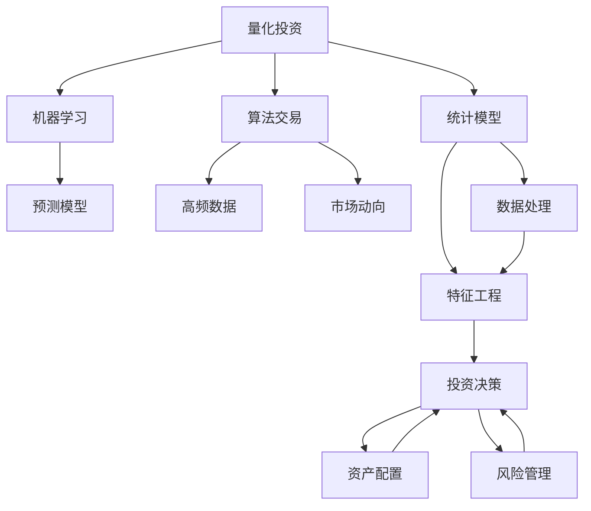

                 

# 理解洞察力的应用：在投资领域的策略运用

> 关键词：洞察力, 投资策略, 资产配置, 风险管理, 量化投资, 算法交易, 深度学习, 决策优化

## 1. 背景介绍

### 1.1 问题由来
投资是人们生活中重要的一部分，对金融市场的洞察力和分析能力是投资成功的关键。然而，金融市场充满了不确定性和复杂性，传统的人工分析方法已经难以应对海量数据和高频交易的需求。近年来，随着人工智能和大数据技术的发展，许多投资者和机构开始利用先进技术进行投资决策，以期获得更优的投资回报。

### 1.2 问题核心关键点
当前，人工智能在投资领域的应用主要有两种策略：一是基于模型的量化投资，二是基于数据驱动的算法交易。其中，量化投资通常利用历史数据构建统计模型，预测市场走势；而算法交易则是通过构建高频交易模型，自动执行交易策略。无论是哪种策略，核心问题都集中在如何提取、分析和利用数据洞察力。

## 2. 核心概念与联系

### 2.1 核心概念概述

为更好地理解人工智能在投资领域的洞察力应用，我们首先需要了解几个核心概念：

- **量化投资**：利用数学模型、统计分析和机器学习等技术，结合历史数据和市场预测，进行自动化的投资决策。

- **算法交易**：通过编程自动化地执行交易策略，利用高频数据、市场动向和预测模型，快速买卖资产以获取利润。

- **资产配置**：根据投资目标、风险偏好和时间跨度，将资金分配到不同类型的资产（如股票、债券、期货等），以达到最优的风险和收益平衡。

- **风险管理**：通过量化模型评估资产风险，设置合理的风险控制策略，防止投资亏损。

- **深度学习**：一种基于神经网络的机器学习方法，具有强大的模式识别和预测能力，可以应用于复杂的非线性金融模型。

- **决策优化**：通过优化算法，在满足约束条件的前提下，寻求最优决策方案，以最大化投资回报或最小化风险。

这些概念之间的逻辑关系可以通过以下Mermaid流程图来展示：



这个流程图展示了量化投资和算法交易的基本流程：

1. 从量化投资模型中获取预测数据。
2. 利用机器学习进行模型训练，优化预测结果。
3. 通过高频数据和市场动向，更新模型参数，实时调整策略。
4. 进行资产配置，优化投资组合。
5. 实施风险管理，避免损失。
6. 最终实现投资决策，进行交易操作。

## 3. 核心算法原理 & 具体操作步骤
### 3.1 算法原理概述

人工智能在投资领域的应用，核心在于利用数据洞察力进行策略优化和决策制定。具体步骤如下：

1. **数据收集**：收集历史市场数据、公司财务数据、新闻舆情等多种数据源，构成完整的数据集。
2. **特征工程**：提取与投资相关的特征，包括技术指标、情绪指数、行业趋势等。
3. **模型构建**：构建预测模型，如回归模型、神经网络、时间序列模型等。
4. **策略优化**：利用决策优化算法，寻找最优的投资组合和交易策略。
5. **风险评估**：通过量化模型评估风险，设置合理的风险控制参数。
6. **实时调整**：根据市场变化实时调整模型参数，优化交易策略。

### 3.2 算法步骤详解

**Step 1: 数据收集**

1. **市场数据**：收集历史股票价格、交易量、波动率等数据，使用API接口获取实时市场数据。
2. **财务数据**：通过公司官网或第三方服务，获取上市公司的财报、资产负债表等数据。
3. **新闻舆情**：使用NLP技术分析新闻、公告、社交媒体等文本数据，提取情绪指数和事件驱动因素。

**Step 2: 特征工程**

1. **技术指标**：提取常用的技术指标，如MACD、RSI、MA等，计算历史数据的相关统计量。
2. **情绪指数**：使用NLP技术分析新闻、公告、社交媒体等文本数据，提取情绪指数和事件驱动因素。
3. **行业趋势**：收集行业宏观经济数据，如GDP、失业率等，提取行业趋势和季节性因素。

**Step 3: 模型构建**

1. **回归模型**：利用历史数据训练线性回归模型，预测资产价格。
2. **神经网络**：构建深度神经网络，如LSTM、GRU等，进行非线性预测。
3. **时间序列模型**：使用ARIMA、VAR等模型，预测市场走势。

**Step 4: 策略优化**

1. **决策树**：构建决策树模型，根据历史数据优化投资策略。
2. **优化算法**：使用遗传算法、粒子群算法等优化算法，寻找最优策略。
3. **风险评估**：使用VaR、CVaR等风险评估指标，评估策略风险。

**Step 5: 实时调整**

1. **高频数据**：实时获取高频交易数据，更新模型参数。
2. **市场动向**：分析市场新闻、公告、舆情数据，动态调整策略。

### 3.3 算法优缺点

人工智能在投资领域的算法具有以下优点：

- **自动化**：利用算法自动执行交易，提高交易效率和决策速度。
- **高效性**：处理海量数据和高频交易，减少人为决策偏差。
- **可解释性**：通过模型训练和特征提取，可以明确决策的逻辑依据。

但同时，这些算法也存在一些缺点：

- **复杂性**：模型构建和参数调优需要深厚的数学和统计知识。
- **过拟合**：在大规模数据集上训练模型，容易出现过拟合现象。
- **数据依赖**：模型的效果依赖于历史数据的准确性和代表性。
- **风险控制**：复杂的模型增加了风险管理的难度。

### 3.4 算法应用领域

人工智能在投资领域的应用，主要涵盖以下几个方面：

- **量化投资**：通过构建统计模型，进行自动化的投资决策。
- **算法交易**：通过高频交易模型，快速执行交易策略。
- **资产配置**：利用量化模型优化投资组合配置。
- **风险管理**：通过量化评估和控制投资风险。
- **股票分析**：使用NLP技术分析公司报告、新闻舆情等，提取投资价值。
- **情绪分析**：利用NLP技术分析市场情绪，预测市场走势。

## 4. 数学模型和公式 & 详细讲解  
### 4.1 数学模型构建

在投资领域，主要使用回归模型、神经网络和时间序列模型等。这里以回归模型为例，介绍数学模型的构建过程。

假设我们有历史数据集 $(x_i,y_i)$，其中 $x$ 是输入特征，$y$ 是目标变量。我们的目标是构建一个回归模型 $f(x;\theta)$，使 $y=f(x;\theta)+\epsilon$，其中 $\epsilon$ 为误差项，假设服从正态分布 $N(0,\sigma^2)$。

回归模型通常采用最小二乘法进行训练，目标是最小化损失函数：

$$
L(\theta) = \frac{1}{N} \sum_{i=1}^N (y_i - f(x_i;\theta))^2
$$

使用梯度下降算法进行参数更新：

$$
\theta_{k+1} = \theta_k - \alpha \nabla_{\theta}L(\theta_k)
$$

其中 $\alpha$ 为学习率。

### 4.2 公式推导过程

以线性回归为例，公式推导如下：

1. **损失函数推导**：假设模型 $f(x;\theta)=\theta_0+\sum_{i=1}^p\theta_ix_i$，目标最小化损失函数 $L(\theta)=\frac{1}{N}\sum_{i=1}^N(y_i-f(x_i;\theta))^2$。

2. **梯度推导**：根据链式法则，$\nabla_{\theta}L(\theta)=\frac{1}{N}\sum_{i=1}^N[2(y_i-f(x_i;\theta))x_i]$。

3. **参数更新**：代入 $\nabla_{\theta}L(\theta)$ 到梯度下降算法，得：

$$
\theta_{k+1} = \theta_k - \alpha\frac{1}{N}\sum_{i=1}^N[2(y_i-f(x_i;\theta_k))x_i]
$$

通过不断迭代，逐步更新模型参数，最终得到最优回归模型。

### 4.3 案例分析与讲解

以AlphaGo的改进算法为例，分析如何在投资策略中应用。AlphaGo的核心是蒙特卡罗树搜索（MCTS）算法，通过构建搜索树，优化决策路径。

假设在投资决策中，我们有以下几个备选股票 $A$ 和 $B$：

- **特征**：$x_A=[0.5, 0.2, 0.8]$，$x_B=[0.7, 0.1, 0.6]$
- **收益**：$y_A=0.1$，$y_B=0.05$

使用蒙特卡罗树搜索，构建搜索树，遍历所有可能的路径，计算每个节点的价值：

- **节点1**：$x=[0.5, 0.2, 0.8]$，$y_A=0.1$，价值为0.1。
- **节点2**：$x=[0.7, 0.1, 0.6]$，$y_B=0.05$，价值为0.05。
- **节点3**：$x=[0.7, 0.1, 0.6]$，$y_B=0.05$，$x_A=[0.5, 0.2, 0.8]$，价值为 $y_B=0.05$。

通过优化树搜索策略，得到最优投资决策 $x=[0.7, 0.1, 0.6]$，收益为 $y_B=0.05$。

## 5. 项目实践：代码实例和详细解释说明
### 5.1 开发环境搭建

在进行投资策略开发前，我们需要准备好开发环境。以下是使用Python进行Pandas、NumPy、Scikit-learn等库的环境配置流程：

1. 安装Anaconda：从官网下载并安装Anaconda，用于创建独立的Python环境。

2. 创建并激活虚拟环境：
```bash
conda create -n invest-env python=3.8 
conda activate invest-env
```

3. 安装依赖包：
```bash
conda install pandas numpy scikit-learn matplotlib statsmodels requests
```

4. 安装TensorFlow和Keras：
```bash
conda install tensorflow==2.5.0
conda install keras
```

5. 安装Jupyter Notebook：
```bash
conda install jupyter notebook
```

完成上述步骤后，即可在`invest-env`环境中开始投资策略开发。

### 5.2 源代码详细实现

下面我们以线性回归模型为例，给出使用Scikit-learn进行投资策略开发的PyTorch代码实现。

首先，定义数据集：

```python
import pandas as pd
import numpy as np

# 加载数据集
data = pd.read_csv('data.csv')
X = data.iloc[:, :-1].values
y = data.iloc[:, -1].values

# 数据标准化
from sklearn.preprocessing import StandardScaler
scaler = StandardScaler()
X = scaler.fit_transform(X)

# 拆分数据集
from sklearn.model_selection import train_test_split
X_train, X_test, y_train, y_test = train_test_split(X, y, test_size=0.2, random_state=0)
```

然后，定义模型和优化器：

```python
from sklearn.linear_model import LinearRegression

# 初始化模型
model = LinearRegression()

# 训练模型
model.fit(X_train, y_train)

# 预测数据
y_pred = model.predict(X_test)
```

最后，评估模型性能：

```python
from sklearn.metrics import mean_squared_error

# 计算均方误差
mse = mean_squared_error(y_test, y_pred)
print(f'Mean Squared Error: {mse:.4f}')
```

以上就是使用Scikit-learn进行线性回归模型投资的完整代码实现。可以看到，利用Scikit-learn库可以轻松实现投资策略的模型构建和评估。

### 5.3 代码解读与分析

让我们再详细解读一下关键代码的实现细节：

**数据集定义**：
- 使用Pandas库加载数据集，并使用`iloc`方法提取特征和目标变量。
- 使用StandardScaler标准化数据，消除数据量级差异。
- 使用train_test_split方法划分训练集和测试集，保持数据分布的一致性。

**模型定义**：
- 利用Scikit-learn库的LinearRegression模型，定义线性回归模型。
- 使用`fit`方法进行模型训练，通过`predict`方法预测新样本。

**模型评估**：
- 使用Scikit-learn库的mean_squared_error方法，计算模型在测试集上的均方误差。

## 6. 实际应用场景

### 6.1 智能投顾系统

智能投顾系统通过大数据分析和人工智能技术，为个人投资者提供个性化的投资建议和策略。系统首先需要收集用户的投资目标、风险偏好、财务状况等数据，然后利用机器学习模型进行量化分析，生成推荐策略。系统会根据市场变化，动态调整策略，帮助用户实现投资目标。

### 6.2 高频交易平台

高频交易平台利用算法交易模型，对市场数据进行实时分析和预测，自动执行交易操作。系统通过收集高频交易数据和市场动向，不断优化模型参数，快速响应市场变化，获取微小利润。平台还具备实时监控和风险控制功能，避免因交易过度而导致的损失。

### 6.3 基金管理公司

基金管理公司通过量化投资策略，构建投资组合，优化资产配置。系统利用历史数据和市场分析模型，预测市场走势和资产表现，自动化执行投资决策。同时，系统具备风险评估和控制功能，防止投资组合风险过高。

### 6.4 未来应用展望

随着人工智能技术的不断进步，投资策略的应用将更加广泛和深入。

- **自然语言处理**：利用NLP技术，分析公司报告、新闻舆情，提取投资价值和市场情绪。
- **深度学习**：通过神经网络模型，捕捉市场非线性关系，提高预测精度。
- **大数据分析**：利用大数据技术，分析海量市场数据，发现潜在投资机会。
- **自动化交易**：结合算法交易和机器学习，实现自动化的高频交易。
- **模型优化**：利用优化算法，动态调整模型参数，提升策略效果。

## 7. 工具和资源推荐
### 7.1 学习资源推荐

为了帮助开发者掌握投资领域的洞察力应用，这里推荐一些优质的学习资源：

1. 《机器学习与金融工程》系列博文：涵盖金融市场分析、量化投资、算法交易等内容，由知名专家撰写。

2. 《金融市场大数据分析》课程：斯坦福大学提供的金融大数据分析课程，涵盖数据处理、金融工程、风险管理等。

3. 《Python金融量化分析》书籍：讲解如何使用Python进行金融数据处理和量化分析，包括金融建模、机器学习等内容。

4. 量化交易平台：提供实时市场数据和交易系统，如Alpha Vantage、Quandl等，助力量化交易研究。

5. 量化投资社区：聚集量化投资者和研究者，提供交流和协作平台，如Quantopian、QuantConnect等。

通过对这些资源的学习实践，相信你一定能够快速掌握投资领域的洞察力应用，并用于解决实际的投资问题。

### 7.2 开发工具推荐

高效的开发离不开优秀的工具支持。以下是几款用于投资策略开发的常用工具：

1. Python：作为主流的编程语言，支持Pandas、NumPy、Scikit-learn等多种库，适合复杂的数据分析和机器学习任务。

2. Jupyter Notebook：基于Web的交互式开发环境，支持代码编写、数据可视化和模型评估，适合快速迭代和共享研究。

3. TensorFlow：由Google主导开发的深度学习框架，支持GPU加速，适合大规模模型训练和预测。

4. Keras：基于TensorFlow的高级API，简化模型构建过程，提高开发效率。

5. Weights & Biases：模型训练的实验跟踪工具，记录和可视化模型训练过程中的各项指标，方便对比和调优。

6. QuantConnect：量化交易平台，提供Python API和实时市场数据，方便量化策略研究。

合理利用这些工具，可以显著提升投资策略的开发效率，加快创新迭代的步伐。

### 7.3 相关论文推荐

投资策略的研究源于学界的持续研究。以下是几篇奠基性的相关论文，推荐阅读：

1. The Cross-Section of Expected Stock Returns（Fama-French三因子模型）：构建了基于市场回报率、账面市值比、动量因子的投资模型。

2. High-Frequency Trading: Costs, Practices, and Performance（高频交易）：研究了高频交易的收益和成本，提供了高频交易策略的实证分析。

3. Black-Litterman模型：通过贝叶斯方法结合资产定价模型，优化投资组合配置。

4. AlphaGo Zero：利用蒙特卡罗树搜索算法，实现无需人类干预的AlphaGo策略。

这些论文代表了大投资策略的发展脉络。通过学习这些前沿成果，可以帮助研究者把握学科前进方向，激发更多的创新灵感。

## 8. 总结：未来发展趋势与挑战

### 8.1 总结

本文对人工智能在投资领域的洞察力应用进行了全面系统的介绍。首先阐述了量化投资和算法交易的基本原理，明确了投资策略在数据洞察和决策制定方面的独特价值。其次，从原理到实践，详细讲解了投资策略的数学模型和代码实现，给出了投资策略开发的完整代码实例。同时，本文还探讨了投资策略在智能投顾、高频交易、基金管理等多个领域的实际应用，展示了投资策略的广泛前景。此外，本文精选了投资策略的各类学习资源，力求为读者提供全方位的技术指引。

通过本文的系统梳理，可以看到，人工智能在投资策略的应用，正在成为金融领域的重要范式，极大地提升了投资决策的自动化和智能化水平，提升了投资回报和风险管理的效果。未来，伴随量化投资和算法交易的进一步发展，投资策略的应用将更加广泛和深入，推动金融市场向更高效、更透明的方向发展。

### 8.2 未来发展趋势

展望未来，投资策略的应用将呈现以下几个发展趋势：

1. **大数据与云计算**：随着大数据和云计算技术的发展，处理海量市场数据的能力将大幅提升，投资策略将更加依赖于数据驱动。

2. **深度学习和强化学习**：深度学习和强化学习技术的应用，将进一步提升模型的复杂性和准确性，解决传统方法难以处理的问题。

3. **高频交易与算法优化**：高频交易和算法优化将成为投资策略的重要方向，通过高频数据和实时调整策略，获取更高的利润。

4. **跨市场和跨国界**：投资策略的应用将拓展到国际市场，利用全球数据和资产，优化资产配置。

5. **道德与合规**：随着算法的普及，投资策略的伦理和合规问题将受到更多关注，如何保证策略的公平性和透明度，将是未来研究的重要方向。

6. **算法安全与风险控制**：随着算法的复杂化，保障算法的安全性和稳定性，防止策略失效和崩溃，将是投资策略的重要挑战。

以上趋势凸显了投资策略的应用前景，为金融市场的智能化、自动化提供了新的可能。这些方向的探索发展，必将进一步提升投资策略的性能和应用范围，为金融市场带来新的变革。

### 8.3 面临的挑战

尽管投资策略在金融领域的应用已经取得了显著进展，但在迈向更加智能化、普适化应用的过程中，它仍面临着诸多挑战：

1. **数据获取与处理**：获取高质量的金融数据和市场信息，需要进行复杂的清洗和预处理，数据成本较高。

2. **模型复杂性**：投资策略的模型复杂性较高，参数调整和优化较为困难，容易过拟合。

3. **市场波动**：金融市场波动性大，策略需要具备较强的鲁棒性和风险管理能力，以应对突发情况。

4. **法规与合规**：金融市场法规复杂，策略需要符合合规要求，防止策略的滥用。

5. **技术瓶颈**：高频交易和深度学习等技术的应用，需要高性能计算资源，资源消耗较大。

6. **伦理与安全**：投资策略的伦理和安全问题需要引起重视，避免策略的偏见和滥用。

这些挑战需要研究者和实践者不断探索和解决，才能推动投资策略技术的成熟和应用。

### 8.4 研究展望

面对投资策略面临的挑战，未来的研究需要在以下几个方面寻求新的突破：

1. **多模态数据融合**：将股票价格、财务数据、新闻舆情等多种数据源进行融合，提取更全面的市场洞察力。

2. **自适应学习**：通过强化学习和迁移学习，使策略具备动态学习和自适应能力，适应市场变化。

3. **分布式计算**：利用分布式计算技术，优化投资策略的计算效率，提升策略的实时性和稳定性。

4. **模型解释性**：通过可解释的模型架构，提高投资策略的透明性和可理解性，帮助投资者做出更明智的决策。

5. **跨领域应用**：将投资策略应用于更广泛的领域，如医疗、教育等，发挥其普适性和通用性。

这些研究方向的探索，必将引领投资策略技术迈向更高的台阶，为金融市场带来更多的创新和应用价值。

## 9. 附录：常见问题与解答

**Q1：投资策略中的深度学习模型如何构建？**

A: 深度学习模型通常通过多层神经网络来构建，每层包含多个神经元，通过反向传播算法进行参数更新。以回归模型为例，可以使用神经网络模型，如LSTM、GRU等，构建非线性预测模型。模型训练时，需要选择合适的损失函数和优化器，如均方误差损失和AdamW优化器。

**Q2：投资策略中的特征工程有哪些关键步骤？**

A: 特征工程是投资策略构建的重要步骤，包括以下几个关键步骤：

1. **数据清洗**：去除数据中的噪声和缺失值，保持数据的一致性和完整性。
2. **特征提取**：从原始数据中提取与投资相关的特征，如技术指标、情绪指数、行业趋势等。
3. **特征选择**：选择与目标变量高度相关的特征，去除冗余和无关的特征，提高模型效率。
4. **特征变换**：通过标准化、归一化等方法，调整特征的分布，便于模型训练。

**Q3：投资策略中的风险评估有哪些方法？**

A: 风险评估是投资策略中的重要环节，包括以下几种常见方法：

1. **VaR（Value at Risk）**：通过统计方法评估资产在一定置信度下的最大损失。
2. **CVaR（Conditional Value at Risk）**：在VaR的基础上，评估超出置信区间的最大平均损失。
3. **蒙特卡罗模拟**：通过随机抽样模拟市场动态，评估策略风险。
4. **压力测试**：通过极端市场情景模拟，评估策略在极端情况下的表现。

**Q4：投资策略中的高频交易有哪些注意事项？**

A: 高频交易是一种快速交易策略，需要注意以下几个方面：

1. **数据实时性**：高频交易依赖于实时市场数据，需要确保数据源的稳定性和实时性。
2. **算法效率**：高频交易需要高效的算法实现，避免因算法延迟导致机会损失。
3. **风险控制**：高频交易容易过拟合和造成频繁交易，需要设置合理的风险控制参数。
4. **监管合规**：高频交易需要遵守市场监管要求，避免因交易过度被限制。

**Q5：投资策略中的算法交易有哪些常见算法？**

A: 常见的算法交易算法包括：

1. **移动平均线策略**：通过移动平均线计算市场趋势，执行买卖操作。
2. **套利策略**：利用市场套利机会，通过低买高卖获取利润。
3. **基于规则的策略**：根据预设规则执行交易，如止损、止盈等。
4. **自适应学习策略**：通过机器学习不断优化交易规则，提高交易效果。

这些算法可以结合使用，构建更复杂和稳健的交易策略。

---

作者：禅与计算机程序设计艺术 / Zen and the Art of Computer Programming

