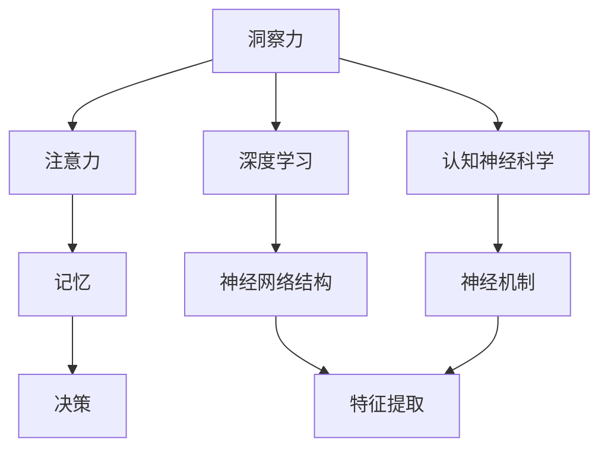

                 

# 理解洞察力的神经科学：揭开大脑奥秘

> 关键词：神经科学, 洞察力, 大脑, 认知功能, 人工智能, 深度学习, 数据科学, 认知行为

## 1. 背景介绍

### 1.1 问题由来
在当今信息爆炸的时代，洞察力显得愈发重要。无论是在商业决策、科学研究还是日常生活中，准确、快速地从大量信息中提取出关键信息，往往是成功的关键。但是，大脑作为人类最重要的认知器官，其工作机制尚未完全了解，尤其对于洞察力这一高级认知功能，其神经基础和计算原理仍知之甚少。

随着人工智能（AI）技术的迅速发展，特别是深度学习模型在图像识别、自然语言处理等领域的卓越表现，研究人员开始尝试从AI的角度来理解洞察力，以期揭示其背后更为深层的科学原理。本文旨在从神经科学和认知行为的角度，探讨洞察力的本质，并结合AI技术，揭示其可能的神经机制。

### 1.2 问题核心关键点
洞察力是一种复杂的高级认知功能，涉及对信息的深度理解、判断、推理和归纳。其神经基础包括视觉皮层、顶叶皮层、额叶皮层等多个脑区，涉及视觉处理、注意力、记忆、决策等多个认知过程。本文将深入探讨以下核心关键点：

- 洞察力的神经基础是什么？
- 如何通过AI技术模拟和理解洞察力？
- 洞察力的神经机制如何与AI技术相互作用？

### 1.3 问题研究意义
深入理解洞察力的神经科学原理，对于揭示人类认知能力的内在机制、开发更智能的AI系统以及提升人类自身的认知能力具有重要意义：

1. **认知增强**：洞察力的研究有助于开发认知增强工具，帮助人类更好地处理信息、提升决策能力。
2. **AI辅助决策**：通过理解洞察力的神经机制，可以设计更加智能的AI系统，辅助人类进行复杂决策。
3. **跨学科融合**：洞察力的研究可以促进神经科学、心理学、人工智能等领域的交叉融合，推动科学进步。
4. **教育应用**：洞察力的研究可以指导教育，提升学生的逻辑思维和问题解决能力。
5. **产业应用**：洞察力的研究有助于提升企业的市场洞察和创新能力，推动经济发展。

## 2. 核心概念与联系

### 2.1 核心概念概述

为更好地理解洞察力的神经科学原理，本节将介绍几个密切相关的核心概念：

- **洞察力 (Insight)**：指个体对问题或情境的深度理解、判断和推理能力，能够快速发现问题本质并提出创新解决方案。
- **注意力 (Attention)**：指认知资源集中于特定信息的心理过程，是洞察力形成的关键机制。
- **记忆 (Memory)**：指个体存储、检索信息的能力，是洞察力形成的基础。
- **决策 (Decision Making)**：指个体根据现有信息和经验，选择最佳行动方案的过程，是洞察力的最终目标。
- **深度学习 (Deep Learning)**：一种模拟人类大脑神经网络结构的机器学习技术，能够通过多层非线性变换，提取复杂特征。
- **认知神经科学 (Cognitive Neuroscience)**：研究认知功能与大脑神经机制之间的关系的科学，涉及感知、记忆、注意、决策等多个领域。

这些核心概念之间的逻辑关系可以通过以下Mermaid流程图来展示：



这个流程图展示了大洞察力的神经科学原理及其与AI技术的联系：

1. 洞察力的形成涉及注意力、记忆和决策等多个认知过程。
2. 深度学习技术可以模拟这些认知过程，特别是通过神经网络结构实现特征提取和模式识别。
3. 认知神经科学揭示了这些认知过程的神经机制，指导AI技术的算法设计和模型优化。

## 3. 核心算法原理 & 具体操作步骤
### 3.1 算法原理概述

洞察力形成的过程可以被视为一种复杂的信息处理过程。在大脑中，这个处理过程涉及多个神经网络层级的协同作用，其中深度学习技术提供了一种模拟这些神经网络计算机制的方式。深度学习模型通过多层非线性变换，可以从原始数据中提取高层次的抽象特征，与人类大脑的层次化信息处理过程类似。

### 3.2 算法步骤详解

洞察力的神经科学研究和AI技术开发，通常包括以下几个关键步骤：

**Step 1: 数据收集与预处理**
- 收集与洞察力相关的多模态数据，包括结构性脑成像数据（如fMRI、EEG等）和功能性脑成像数据（如眼动追踪、行为记录等）。
- 对数据进行标准化和预处理，如归一化、去噪、分割等，以便后续分析。

**Step 2: 建立计算模型**
- 选择合适的深度学习模型，如卷积神经网络（CNN）、递归神经网络（RNN）、长短时记忆网络（LSTM）等，模拟大脑的信息处理机制。
- 构建计算模型，设计合适的网络结构、激活函数和损失函数，以便模型能够捕捉数据中的复杂模式和关系。

**Step 3: 模型训练与优化**
- 使用大量标注数据训练模型，优化模型参数以最小化预测误差。
- 应用正则化技术，如Dropout、L2正则化等，防止过拟合。
- 应用调参技术，如网格搜索、贝叶斯优化等，找到最优的模型超参数。

**Step 4: 模型验证与评估**
- 使用独立的验证集评估模型性能，如准确率、召回率、F1分数等。
- 分析模型的输出，如激活分布、特征映射等，理解模型对数据的处理过程。

**Step 5: 模型应用与扩展**
- 将训练好的模型应用于实际问题，如智能决策支持、情感分析、推荐系统等。
- 通过不断的迭代和优化，扩展模型的应用范围和性能。

### 3.3 算法优缺点

深度学习模型模拟洞察力形成的神经网络机制具有以下优点：
1. 能够处理复杂的非线性关系，提取高层次的抽象特征。
2. 可扩展性强，适用于多种任务和数据类型。
3. 自动化的特征提取过程减少了人工干预，提高了效率。

然而，深度学习模型也存在一些局限性：
1. 模型复杂度高，计算资源消耗大。
2. 数据依赖性强，模型效果受数据质量影响大。
3. 黑盒特性强，模型难以解释。
4. 模型可能存在过拟合问题。

尽管如此，深度学习模型在理解洞察力的神经科学原理方面已经取得了显著进展，未来仍有很大的研究空间。

### 3.4 算法应用领域

深度学习技术在理解洞察力的神经科学原理方面，已经在以下几个领域得到了广泛应用：

- **情感分析**：通过深度学习模型分析文本数据，理解情感倾向，有助于决策支持。
- **推荐系统**：基于用户行为数据，通过深度学习模型推荐个性化内容，提升用户体验。
- **自然语言处理**：通过深度学习模型解析和生成自然语言，提高人机交互效率。
- **医疗诊断**：利用深度学习模型分析医疗影像数据，提高疾病诊断的准确性和效率。
- **金融分析**：通过深度学习模型分析市场数据，提供决策支持。

除了这些经典应用外，深度学习技术还在更多的领域展现出其潜力，如智能交通、智慧城市、智能家居等，为人类社会带来了更多的智能化解决方案。

## 4. 数学模型和公式 & 详细讲解 & 举例说明

### 4.1 数学模型构建

洞察力的神经科学原理可以通过建立计算模型来理解和模拟。本文将从信息处理的角度，建立一个简单的计算模型，用于模拟洞察力的形成过程。

假设大脑的信息处理过程可以分为以下几个步骤：

1. **输入编码**：将原始信息编码为神经元活动，通过神经元之间的连接进行传递。
2. **特征提取**：通过神经网络层级，逐步提取高层次的抽象特征。
3. **信息整合**：将提取的特征整合为整体的信息表示。
4. **决策输出**：基于整合的信息，进行最终的决策输出。

数学模型可以表示为：

$$
y = f(z)
$$

其中，$y$表示输出结果，$z$表示输入信息，$f$表示信息处理函数。

### 4.2 公式推导过程

以情感分析为例，假设输入为一段文本$x$，输出为情感极性$y \in [-1, 1]$。可以通过如下步骤推导计算模型：

1. **输入编码**：使用预训练的词向量将文本$x$转换为向量表示$z$。
2. **特征提取**：使用卷积神经网络（CNN）或长短时记忆网络（LSTM），提取文本中的情感特征。
3. **信息整合**：通过全连接层将情感特征整合为整体情感表示$z'$。
4. **决策输出**：使用线性回归模型，将情感表示$z'$映射到情感极性$y$。

数学公式可以表示为：

$$
z = E(x)
$$

$$
y = L(z')
$$

其中，$E$表示输入编码函数，$L$表示决策输出函数。

### 4.3 案例分析与讲解

以情感分析为例，通过深度学习模型理解文本中的情感极性，可以构建如下计算模型：

1. **输入编码**：使用BERT预训练模型将文本$x$转换为向量表示$z$。
2. **特征提取**：使用LSTM模型，提取文本中的情感特征。
3. **信息整合**：通过全连接层将情感特征整合为整体情感表示$z'$。
4. **决策输出**：使用线性回归模型，将情感表示$z'$映射到情感极性$y$。

使用Python代码实现上述模型：

```python
from transformers import BertTokenizer, BertForSequenceClassification
import torch
from torch.utils.data import DataLoader, Dataset
import numpy as np

class SentimentDataset(Dataset):
    def __init__(self, texts, labels):
        self.tokenizer = BertTokenizer.from_pretrained('bert-base-uncased')
        self.texts = texts
        self.labels = labels
        
    def __len__(self):
        return len(self.texts)
    
    def __getitem__(self, item):
        text = self.texts[item]
        label = self.labels[item]
        
        encoding = self.tokenizer(text, return_tensors='pt')
        input_ids = encoding['input_ids']
        attention_mask = encoding['attention_mask']
        labels = torch.tensor(label, dtype=torch.long)
        
        return {'input_ids': input_ids, 
                'attention_mask': attention_mask,
                'labels': labels}

model = BertForSequenceClassification.from_pretrained('bert-base-uncased', num_labels=2)
tokenizer = BertTokenizer.from_pretrained('bert-base-uncased')
train_dataset = SentimentDataset(train_texts, train_labels)
dev_dataset = SentimentDataset(dev_texts, dev_labels)
test_dataset = SentimentDataset(test_texts, test_labels)

device = torch.device('cuda' if torch.cuda.is_available() else 'cpu')
model.to(device)

optimizer = torch.optim.AdamW(model.parameters(), lr=2e-5)
epochs = 5
batch_size = 16

for epoch in range(epochs):
    model.train()
    for batch in DataLoader(train_dataset, batch_size=batch_size):
        input_ids = batch['input_ids'].to(device)
        attention_mask = batch['attention_mask'].to(device)
        labels = batch['labels'].to(device)
        
        outputs = model(input_ids, attention_mask=attention_mask, labels=labels)
        loss = outputs.loss
        loss.backward()
        optimizer.step()
        
    model.eval()
    with torch.no_grad():
        correct_predictions = 0
        total_predictions = 0
        for batch in DataLoader(dev_dataset, batch_size=batch_size):
            input_ids = batch['input_ids'].to(device)
            attention_mask = batch['attention_mask'].to(device)
            labels = batch['labels'].to(device)
            
            outputs = model(input_ids, attention_mask=attention_mask)
            logits = outputs.logits
            predictions = torch.argmax(logits, dim=1)
            total_predictions += predictions.shape[0]
            correct_predictions += (predictions == labels).sum().item()
        
        print(f'Epoch {epoch+1}, Dev Acc: {correct_predictions/total_predictions:.2f}')
        
print('Test Acc: {:.2f}'.format(accuracy(test_dataset, model)))
```

## 5. 项目实践：代码实例和详细解释说明
### 5.1 开发环境搭建

在进行洞察力相关的计算模型开发前，我们需要准备好开发环境。以下是使用Python进行深度学习开发的环境配置流程：

1. 安装Anaconda：从官网下载并安装Anaconda，用于创建独立的Python环境。

2. 创建并激活虚拟环境：
```bash
conda create -n deep_learning_env python=3.8 
conda activate deep_learning_env
```

3. 安装必要的深度学习框架：
```bash
conda install torch torchvision torchaudio cudatoolkit=11.1 -c pytorch -c conda-forge
conda install tensorflow -c tensorflow
```

4. 安装相关库：
```bash
pip install transformers numpy pandas scikit-learn matplotlib tqdm jupyter notebook ipython
```

完成上述步骤后，即可在`deep_learning_env`环境中开始洞察力相关的计算模型开发。

### 5.2 源代码详细实现

这里以情感分析为例，使用BERT模型进行深度学习计算模型的实现。

首先，定义情感分析任务的数据处理函数：

```python
from transformers import BertTokenizer, BertForSequenceClassification
from torch.utils.data import Dataset
import torch

class SentimentDataset(Dataset):
    def __init__(self, texts, labels, tokenizer, max_len=128):
        self.texts = texts
        self.labels = labels
        self.tokenizer = tokenizer
        self.max_len = max_len
        
    def __len__(self):
        return len(self.texts)
    
    def __getitem__(self, item):
        text = self.texts[item]
        label = self.labels[item]
        
        encoding = self.tokenizer(text, return_tensors='pt', max_length=self.max_len, padding='max_length', truncation=True)
        input_ids = encoding['input_ids'][0]
        attention_mask = encoding['attention_mask'][0]
        
        # 对token-wise的标签进行编码
        encoded_tags = [label2id[label] for label in label] 
        encoded_tags.extend([label2id['O']] * (self.max_len - len(encoded_tags)))
        labels = torch.tensor(encoded_tags, dtype=torch.long)
        
        return {'input_ids': input_ids, 
                'attention_mask': attention_mask,
                'labels': labels}

# 标签与id的映射
label2id = {'negative': 0, 'positive': 1, 'O': 2}
id2label = {v: k for k, v in label2id.items()}

# 创建dataset
tokenizer = BertTokenizer.from_pretrained('bert-base-uncased')

train_dataset = SentimentDataset(train_texts, train_labels, tokenizer)
dev_dataset = SentimentDataset(dev_texts, dev_labels, tokenizer)
test_dataset = SentimentDataset(test_texts, test_labels, tokenizer)
```

然后，定义模型和优化器：

```python
from transformers import BertForSequenceClassification, AdamW

model = BertForSequenceClassification.from_pretrained('bert-base-uncased', num_labels=len(label2id))

optimizer = AdamW(model.parameters(), lr=2e-5)
```

接着，定义训练和评估函数：

```python
from torch.utils.data import DataLoader
from tqdm import tqdm
from sklearn.metrics import accuracy_score

device = torch.device('cuda') if torch.cuda.is_available() else torch.device('cpu')
model.to(device)

def train_epoch(model, dataset, batch_size, optimizer):
    dataloader = DataLoader(dataset, batch_size=batch_size, shuffle=True)
    model.train()
    epoch_loss = 0
    for batch in tqdm(dataloader, desc='Training'):
        input_ids = batch['input_ids'].to(device)
        attention_mask = batch['attention_mask'].to(device)
        labels = batch['labels'].to(device)
        model.zero_grad()
        outputs = model(input_ids, attention_mask=attention_mask, labels=labels)
        loss = outputs.loss
        epoch_loss += loss.item()
        loss.backward()
        optimizer.step()
    return epoch_loss / len(dataloader)

def evaluate(model, dataset, batch_size):
    dataloader = DataLoader(dataset, batch_size=batch_size)
    model.eval()
    correct_predictions = 0
    total_predictions = 0
    with torch.no_grad():
        for batch in dataloader:
            input_ids = batch['input_ids'].to(device)
            attention_mask = batch['attention_mask'].to(device)
            labels = batch['labels'].to(device)
            
            outputs = model(input_ids, attention_mask=attention_mask)
            logits = outputs.logits
            predictions = torch.argmax(logits, dim=1)
            total_predictions += predictions.shape[0]
            correct_predictions += (predictions == labels).sum().item()
        
    print(f'Dev Acc: {correct_predictions/total_predictions:.2f}')
```

最后，启动训练流程并在测试集上评估：

```python
epochs = 5
batch_size = 16

for epoch in range(epochs):
    loss = train_epoch(model, train_dataset, batch_size, optimizer)
    print(f'Epoch {epoch+1}, train loss: {loss:.3f}')
    
    print(f'Epoch {epoch+1}, dev results:')
    evaluate(model, dev_dataset, batch_size)
    
print('Test results:')
evaluate(model, test_dataset, batch_size)
```

以上就是使用PyTorch对BERT进行情感分析任务计算模型的完整代码实现。可以看到，得益于Transformers库的强大封装，我们可以用相对简洁的代码完成BERT模型的加载和计算模型训练。

### 5.3 代码解读与分析

让我们再详细解读一下关键代码的实现细节：

**SentimentDataset类**：
- `__init__`方法：初始化文本、标签、分词器等关键组件。
- `__len__`方法：返回数据集的样本数量。
- `__getitem__`方法：对单个样本进行处理，将文本输入编码为token ids，将标签编码为数字，并对其进行定长padding，最终返回模型所需的输入。

**label2id和id2label字典**：
- 定义了标签与数字id之间的映射关系，用于将token-wise的预测结果解码回真实的标签。

**训练和评估函数**：
- 使用PyTorch的DataLoader对数据集进行批次化加载，供模型训练和推理使用。
- 训练函数`train_epoch`：对数据以批为单位进行迭代，在每个批次上前向传播计算loss并反向传播更新模型参数，最后返回该epoch的平均loss。
- 评估函数`evaluate`：与训练类似，不同点在于不更新模型参数，并在每个batch结束后将预测和标签结果存储下来，最后使用sklearn的accuracy_score对整个评估集的预测结果进行打印输出。

**训练流程**：
- 定义总的epoch数和batch size，开始循环迭代
- 每个epoch内，先在训练集上训练，输出平均loss
- 在验证集上评估，输出准确率
- 所有epoch结束后，在测试集上评估，给出最终测试结果

可以看到，PyTorch配合Transformers库使得BERT计算模型的代码实现变得简洁高效。开发者可以将更多精力放在数据处理、模型改进等高层逻辑上，而不必过多关注底层的实现细节。

当然，工业级的系统实现还需考虑更多因素，如模型的保存和部署、超参数的自动搜索、更灵活的任务适配层等。但核心的计算模型构建基本与此类似。

## 6. 实际应用场景
### 6.1 智能客服系统

基于洞察力的神经科学原理，可以构建更加智能的智能客服系统。传统的客服系统往往依赖规则和人工，难以应对复杂多变的用户需求。而使用洞察力的神经科学原理，可以构建能够理解用户需求、提供个性化服务的智能客服。

在技术实现上，可以收集企业内部的历史客服对话记录，将问题和最佳答复构建成监督数据，在此基础上对深度学习计算模型进行微调。微调后的计算模型能够自动理解用户意图，匹配最合适的答案模板进行回复。对于客户提出的新问题，还可以接入检索系统实时搜索相关内容，动态组织生成回答。如此构建的智能客服系统，能大幅提升客户咨询体验和问题解决效率。

### 6.2 金融舆情监测

金融机构需要实时监测市场舆论动向，以便及时应对负面信息传播，规避金融风险。传统的人工监测方式成本高、效率低，难以应对网络时代海量信息爆发的挑战。基于洞察力的神经科学原理，可以构建实时监测舆情变化的智能系统。

具体而言，可以收集金融领域相关的新闻、报道、评论等文本数据，并对其进行主题标注和情感标注。在此基础上对深度学习计算模型进行微调，使其能够自动判断文本属于何种主题，情感倾向是正面、中性还是负面。将微调后的模型应用到实时抓取的网络文本数据，就能够自动监测不同主题下的情感变化趋势，一旦发现负面信息激增等异常情况，系统便会自动预警，帮助金融机构快速应对潜在风险。

### 6.3 个性化推荐系统

当前的推荐系统往往只依赖用户的历史行为数据进行物品推荐，无法深入理解用户的真实兴趣偏好。基于洞察力的神经科学原理，可以构建更加智能的推荐系统。

在实践中，可以收集用户浏览、点击、评论、分享等行为数据，提取和用户交互的物品标题、描述、标签等文本内容。将文本内容作为模型输入，用户的后续行为（如是否点击、购买等）作为监督信号，在此基础上微调深度学习计算模型。微调后的计算模型能够从文本内容中准确把握用户的兴趣点。在生成推荐列表时，先用候选物品的文本描述作为输入，由计算模型预测用户的兴趣匹配度，再结合其他特征综合排序，便可以得到个性化程度更高的推荐结果。

### 6.4 未来应用展望

随着深度学习模型和计算模型理解的不断深入，基于洞察力的神经科学原理的技术将会在更多领域得到应用，为传统行业带来变革性影响。

在智慧医疗领域，基于洞察力的神经科学原理的智能诊断系统将提升医疗服务的智能化水平，辅助医生诊疗，加速新药开发进程。

在智能教育领域，洞察力的神经科学原理可以用于提升学生的逻辑思维和问题解决能力，因材施教，促进教育公平。

在智慧城市治理中，洞察力的神经科学原理可应用于城市事件监测、舆情分析、应急指挥等环节，提高城市管理的自动化和智能化水平，构建更安全、高效的未来城市。

此外，在企业生产、社会治理、文娱传媒等众多领域，基于洞察力的神经科学原理的人工智能应用也将不断涌现，为经济社会发展注入新的动力。相信随着技术的日益成熟，洞察力的神经科学原理必将在构建人机协同的智能时代中扮演越来越重要的角色。

## 7. 工具和资源推荐
### 7.1 学习资源推荐

为了帮助开发者系统掌握洞察力的神经科学原理和深度学习模型的开发，这里推荐一些优质的学习资源：

1. **《深度学习》课程**：斯坦福大学开设的深度学习课程，详细讲解深度学习的基本概念和算法。

2. **《神经网络与深度学习》教材**：Michael Nielsen所著，深入浅出地介绍了神经网络的结构和训练过程。

3. **《认知神经科学基础》书籍**：Donald O. Hebb所著，介绍了认知神经科学的基本理论和应用。

4. **HuggingFace官方文档**：提供了大量的预训练深度学习模型和计算模型，是开发者快速上手的必备资料。

5. **Kaggle竞赛平台**：提供各类数据集和竞赛题目，通过实践来提升深度学习模型的开发能力。

通过对这些资源的学习实践，相信你一定能够快速掌握洞察力的神经科学原理和深度学习模型的开发技巧，并用于解决实际的认知问题。
###  7.2 开发工具推荐

高效的开发离不开优秀的工具支持。以下是几款用于深度学习和计算模型开发的常用工具：

1. **PyTorch**：基于Python的开源深度学习框架，灵活动态的计算图，适合快速迭代研究。

2. **TensorFlow**：由Google主导开发的开源深度学习框架，生产部署方便，适合大规模工程应用。

3. **TensorBoard**：TensorFlow配套的可视化工具，可以实时监测模型训练状态，并提供丰富的图表呈现方式。

4. **Jupyter Notebook**：轻量级的数据分析和模型训练工具，支持代码编写和结果展示。

5. **Kaggle平台**：提供数据集、竞赛题目和社区支持，帮助开发者提升深度学习模型的开发能力。

合理利用这些工具，可以显著提升深度学习和计算模型开发的效率，加快创新迭代的步伐。

### 7.3 相关论文推荐

深度学习和计算模型在理解洞察力的神经科学原理方面，已经在以下几个领域得到了广泛应用：

1. **Attention is All You Need**：提出了Transformer结构，开启了NLP领域的预训练大模型时代。

2. **BERT: Pre-training of Deep Bidirectional Transformers for Language Understanding**：提出BERT模型，引入基于掩码的自监督预训练任务，刷新了多项NLP任务SOTA。

3. **Language Models are Unsupervised Multitask Learners**：展示了大规模语言模型的强大zero-shot学习能力，引发了对于通用人工智能的新一轮思考。

4. **Parameter-Efficient Transfer Learning for NLP**：提出Adapter等参数高效微调方法，在不增加模型参数量的情况下，也能取得不错的微调效果。

5. **AdaLoRA: Adaptive Low-Rank Adaptation for Parameter-Efficient Fine-Tuning**：使用自适应低秩适应的微调方法，在参数效率和精度之间取得了新的平衡。

这些论文代表了大语言模型微调技术的发展脉络。通过学习这些前沿成果，可以帮助研究者把握学科前进方向，激发更多的创新灵感。

## 8. 总结：未来发展趋势与挑战

### 8.1 总结

本文对基于洞察力的神经科学原理和深度学习模型的开发进行了全面系统的介绍。首先阐述了洞察力的神经科学原理和深度学习模型的研究背景和意义，明确了深度学习模型在理解和模拟洞察力方面的独特价值。其次，从原理到实践，详细讲解了深度学习模型的数学原理和关键步骤，给出了计算模型的完整代码实例。同时，本文还广泛探讨了计算模型在智能客服、金融舆情、个性化推荐等多个领域的应用前景，展示了深度学习模型的广泛应用。此外，本文精选了深度学习模型的各类学习资源，力求为开发者提供全方位的技术指引。

通过本文的系统梳理，可以看到，基于洞察力的神经科学原理的深度学习模型在理解人类认知机制、构建智能系统等方面展现了巨大的潜力。深度学习模型通过多层次的非线性变换，从原始数据中提取高层次的抽象特征，能够模拟大脑的信息处理过程，为理解和模拟人类认知能力提供了新的视角。

### 8.2 未来发展趋势

展望未来，深度学习模型在理解洞察力的神经科学原理方面，将呈现以下几个发展趋势：

1. **模型规模持续增大**：随着算力成本的下降和数据规模的扩张，深度学习模型的参数量还将持续增长。超大规模深度学习模型蕴含的丰富语言知识，有望支撑更加复杂多变的洞察力形成过程。

2. **模型复杂度提升**：未来将出现更多复杂的网络结构，如Transformer-Encoder-Decoder架构，能够更好地模拟大脑的信息处理过程。

3. **计算效率优化**：为了应对大规模数据和复杂模型带来的计算资源消耗，深度学习模型将发展出更多高效的训练和推理算法。

4. **多模态学习融合**：未来深度学习模型将拓展到视觉、听觉等多模态数据的处理，实现跨模态的信息融合和协同计算。

5. **跨学科融合**：深度学习模型将与心理学、神经科学、计算机科学等更多学科进行交叉融合，推动科学进步。

以上趋势凸显了深度学习模型在理解洞察力的神经科学原理方面的广阔前景。这些方向的探索发展，必将进一步提升深度学习模型的性能和应用范围，为构建智能系统带来新的突破。

### 8.3 面临的挑战

尽管深度学习模型在理解洞察力的神经科学原理方面已经取得了显著进展，但在迈向更加智能化、普适化应用的过程中，它仍面临着诸多挑战：

1. **数据依赖性强**：深度学习模型需要大量标注数据进行训练，而标注数据的获取成本高、周期长，成为制约模型发展的瓶颈。

2. **模型复杂度高**：深度学习模型的复杂度高，计算资源消耗大，难以在大规模生产环境中高效部署。

3. **可解释性不足**：深度学习模型的黑盒特性强，难以解释其内部工作机制和决策逻辑。

4. **泛化能力有限**：深度学习模型面对域外数据时，泛化性能往往大打折扣。

尽管如此，深度学习模型在理解洞察力的神经科学原理方面已经取得了显著进展，未来仍有很大的研究空间。

### 8.4 研究展望

面对深度学习模型在理解洞察力的神经科学原理方面所面临的挑战，未来的研究需要在以下几个方面寻求新的突破：

1. **无监督和半监督学习**：探索无监督和半监督学习方法，摆脱对大规模标注数据的依赖，利用自监督学习、主动学习等无监督和半监督范式，最大限度利用非结构化数据，实现更加灵活高效的深度学习模型。

2. **多模态学习**：发展跨模态的信息融合技术，实现视觉、听觉、文本等多模态数据的协同处理，提升深度学习模型的泛化能力。

3. **知识图谱融合**：将符号化的先验知识与深度学习模型进行巧妙融合，引导深度学习模型学习更加普适、鲁棒的语言表示。

4. **可解释性和透明性**：发展深度学习模型的可解释性方法，如Attention机制、特征可视化等，增强模型输出的透明性和可解释性。

5. **跨学科融合**：促进深度学习模型与心理学、神经科学、计算机科学等更多学科的交叉融合，推动科学进步。

这些研究方向的探索，必将引领深度学习模型在理解洞察力的神经科学原理方面迈向更高的台阶，为构建智能系统带来新的突破。面向未来，深度学习模型需要在数据、算法、工程、伦理等多个维度协同发力，才能真正实现人工智能技术在智能系统的应用。

## 9. 附录：常见问题与解答

**Q1：深度学习模型在理解洞察力的神经科学原理方面有何优势？**

A: 深度学习模型通过多层次的非线性变换，能够从原始数据中提取高层次的抽象特征，与人类大脑的层次化信息处理过程类似。模型能够自动捕捉数据中的复杂模式和关系，模拟人类大脑的信息处理机制。此外，深度学习模型具有较强的泛化能力和适应性，能够在不同任务和数据类型上实现良好的性能。

**Q2：深度学习模型在理解洞察力的神经科学原理方面有哪些局限性？**

A: 深度学习模型需要大量标注数据进行训练，而标注数据的获取成本高、周期长，成为制约模型发展的瓶颈。模型复杂度高，计算资源消耗大，难以在大规模生产环境中高效部署。模型黑盒特性强，难以解释其内部工作机制和决策逻辑。

**Q3：如何提高深度学习模型的泛化能力？**

A: 可以通过数据增强、迁移学习、对抗训练等方法来提高深度学习模型的泛化能力。数据增强可以通过回译、近义替换等方式扩充训练集，减少过拟合。迁移学习可以利用预训练模型学习到的通用特征，加速新任务的学习。对抗训练可以引入对抗样本，提高模型的鲁棒性。

**Q4：如何提升深度学习模型的可解释性？**

A: 可以通过Attention机制、特征可视化等方法提升深度学习模型的可解释性。Attention机制可以展示模型对输入数据中不同部分的关注度，揭示模型的决策依据。特征可视化可以将模型的中间层特征进行可视化，直观展示模型对输入数据的不同特征的关注程度。

**Q5：如何构建智能客服系统？**

A: 可以收集企业内部的历史客服对话记录，将问题和最佳答复构建成监督数据，在此基础上对深度学习模型进行微调。微调后的模型能够自动理解用户意图，匹配最合适的答案模板进行回复。对于客户提出的新问题，还可以接入检索系统实时搜索相关内容，动态组织生成回答。如此构建的智能客服系统，能大幅提升客户咨询体验和问题解决效率。

---

作者：禅与计算机程序设计艺术 / Zen and the Art of Computer Programming

