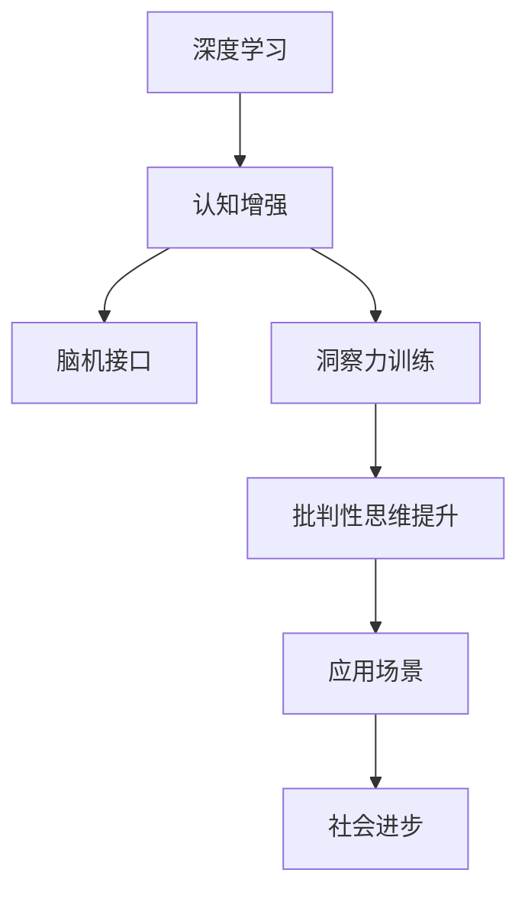
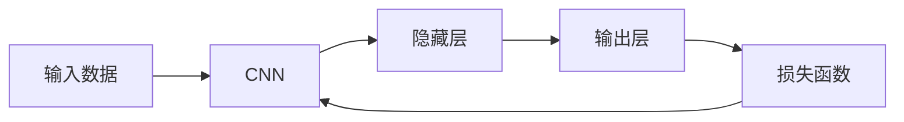

                 

# 理解洞察力的训练：提升批判性思维能力

> 关键词：批判性思维,洞察力训练,深度学习,认知增强,脑机接口,AI应用

## 1. 背景介绍

### 1.1 问题由来
在现代社会，信息的爆炸式增长给人们带来了前所未有的认知压力。面对海量的数据和复杂的决策问题，个体如何提升批判性思维能力，增强洞察力，成为亟待解决的问题。信息过载导致的认知负担，可能带来决策错误、创新停滞、心理压力等问题，极大地制约了人类的发展。

批判性思维是识别、分析、评估和构造信息的能力，在商业决策、学术研究、个人成长等方面都具有重要意义。然而，传统的批判性思维训练方法往往依赖于教师、书本，耗时长、成本高，难以大规模推广。近年来，随着深度学习技术的发展，基于深度学习的认知增强方法逐渐兴起，为批判性思维能力的提升提供了新的途径。

### 1.2 问题核心关键点
- **深度学习**：一种基于神经网络的技术，通过多层非线性变换，可以自动学习复杂数据特征。
- **认知增强**：利用深度学习技术，模拟人脑信息处理机制，提升个体认知能力。
- **脑机接口**：通过神经信号与计算机的交互，实现大脑与机器之间的直接通信。
- **洞察力训练**：利用深度学习模型，训练个体进行更准确的观察和判断。
- **AI应用**：借助深度学习模型，开发辅助人类认知的智能应用，如智能导师、认知辅助工具等。

深度学习作为一种强大的数据处理方法，在图像识别、语音识别、自然语言处理等领域已取得显著成果。将深度学习的算法应用于批判性思维训练，成为当前学术界和工业界关注的热点。通过深度学习模型对认知过程进行模拟和优化，可以有效提升个体的批判性思维和洞察力。

### 1.3 问题研究意义
批判性思维的提升对于推动社会进步、增进个人福祉具有重要意义：

1. **决策质量提升**：在信息过载的时代，批判性思维能帮助个体更准确地识别信息、分析判断，做出更加合理、科学的决策。
2. **创新能力增强**：批判性思维能促进个体对已有知识的深度理解和创造性运用，驱动创新发展。
3. **心理健康改善**：批判性思维有助于缓解信息过载导致的焦虑、抑郁等心理问题，提高个体生活质量。
4. **学习效果优化**：批判性思维能促进个体对知识的主动探究、理解和应用，提升学习效果。
5. **社会适应力增强**：批判性思维有助于个体在复杂多变的环境下，灵活应变、独立思考，增强社会适应力。

## 2. 核心概念与联系

### 2.1 核心概念概述

深度学习是近年来人工智能领域的一个重要分支，基于神经网络结构，通过反向传播算法训练模型，以学习数据中的复杂模式。深度学习的核心思想是通过多层非线性变换，构建高维、非线性的数据表示，进而提升模型性能。

认知增强则是一种利用深度学习技术，模拟人脑信息处理机制，提升个体认知能力的科学方法。常见的认知增强技术包括基于神经网络的学习算法、脑机接口等。

脑机接口（Brain-Computer Interface, BCI）是指通过脑电信号与计算机进行通信的技术，可以实现对人类大脑活动的解码和控制。BCI技术在认知增强、医疗诊断、娱乐等领域有广泛应用。

洞察力训练是基于深度学习模型的认知增强方法之一，旨在提升个体的观察和判断能力。通过训练深度学习模型，使个体能够更准确地识别信息、分析逻辑，从而提升批判性思维能力。

深度学习在认知增强和洞察力训练中的应用，为提升批判性思维能力提供了新的方法。这些技术的发展，有望实现人脑与机器之间的深度融合，推动人工智能与人类认知的协同进化。

### 2.2 核心概念原理和架构的 Mermaid 流程图



这个流程图展示了深度学习、认知增强、脑机接口、洞察力训练、批判性思维提升以及应用场景之间的联系：

1. 深度学习为认知增强和洞察力训练提供了数据处理方法。
2. 认知增强模拟人脑信息处理机制，提升个体认知能力。
3. 脑机接口实现人脑与机器的直接通信，增强认知信息交互。
4. 洞察力训练利用深度学习模型，提升个体观察和判断能力。
5. 批判性思维提升是深度学习、认知增强和洞察力训练的综合结果。
6. 认知增强、洞察力训练和批判性思维提升在应用场景中发挥作用，推动社会进步。

## 3. 核心算法原理 & 具体操作步骤

### 3.1 算法原理概述

批判性思维训练的核心在于提升个体的观察和判断能力，这可以通过训练深度学习模型来实现。具体流程包括：

1. **数据收集**：收集大规模的数据，如学术论文、新闻报道、历史事件等，标注出重要信息、错误信息、逻辑错误等。
2. **模型训练**：使用深度学习模型，如卷积神经网络（CNN）、循环神经网络（RNN）、注意力机制等，对标注数据进行训练。
3. **洞察力提升**：训练后的模型能够识别信息的关键点、逻辑漏洞、事实错误等，提升个体的观察和判断能力。
4. **批判性思维应用**：利用提升后的洞察力，个体能够更准确地识别和评估信息，做出科学合理的决策。

### 3.2 算法步骤详解

以基于CNN的批判性思维训练为例，以下是具体的训练步骤：

**Step 1: 数据准备**

1. 收集大规模的数据集，如维基百科、Google Scholar等，并标注出信息的关键点、错误信息、逻辑漏洞等。
2. 将标注数据分为训练集和测试集，确保数据的多样性和代表性。

**Step 2: 模型选择**

1. 选择适合的深度学习模型，如CNN、RNN、Transformer等，根据具体任务和数据特点进行选择。
2. 确定模型的超参数，如层数、节点数、激活函数等。

**Step 3: 数据预处理**

1. 对数据进行预处理，如数据清洗、标准化、划分等。
2. 将数据转换为模型的输入格式，如将文本转换为词向量。

**Step 4: 模型训练**

1. 使用训练集数据对模型进行训练，优化损失函数。
2. 设置合适的学习率、批大小、迭代轮数等超参数。
3. 使用正则化技术，如Dropout、L2正则等，避免过拟合。

**Step 5: 模型评估**

1. 在测试集上评估模型性能，计算准确率、召回率、F1分数等指标。
2. 根据评估结果，对模型进行调整优化。

**Step 6: 应用实践**

1. 将训练好的模型应用于实际场景，如智能导师、认知辅助工具等。
2. 通过实时交互，提升个体的批判性思维和洞察力。

### 3.3 算法优缺点

基于深度学习的认知增强和洞察力训练方法具有以下优点：

1. **高效性**：深度学习模型可以自动学习数据特征，训练速度较快，适合大规模数据处理。
2. **鲁棒性**：深度学习模型具有较强的泛化能力，能够适应复杂多变的输入数据。
3. **可扩展性**：深度学习模型可以根据具体任务和数据特点进行调整优化，具有较好的灵活性。

同时，该方法也存在以下缺点：

1. **数据依赖**：模型的性能很大程度上依赖于训练数据的质量和数量，获取高质量标注数据的成本较高。
2. **模型复杂性**：深度学习模型的结构和参数较多，训练和推理复杂度较高，需要较高的计算资源。
3. **黑盒问题**：深度学习模型的内部机制复杂，难以解释其决策过程，缺乏透明度。
4. **公平性问题**：深度学习模型可能会学习数据中的偏见，导致输出结果的不公平性。

尽管存在这些局限性，但深度学习在批判性思维训练中的潜力不可忽视。未来相关研究应进一步降低数据依赖，提高模型的可解释性和公平性，以更好地应用于实际场景。

### 3.4 算法应用领域

基于深度学习的认知增强和洞察力训练方法，已在多个领域得到应用：

1. **教育**：开发智能导师、辅助教学工具，提升学生批判性思维和知识应用能力。
2. **商业**：应用于数据分析、市场调研、决策支持等领域，提升企业决策质量。
3. **医疗**：辅助医生进行诊断分析，提升医疗决策的准确性。
4. **法律**：辅助法律专家进行案件分析，提升法律判断能力。
5. **新闻**：应用于新闻编辑、舆情分析等领域，提升信息筛选和判断能力。
6. **社交媒体**：应用于社交网络信息筛选、舆情监控等领域，提升信息分析和判断能力。

这些领域的应用展示了深度学习在批判性思维训练中的广泛潜力，未来将有更多新的应用场景被发掘和探索。

## 4. 数学模型和公式 & 详细讲解 & 举例说明

### 4.1 数学模型构建

批判性思维训练的数学模型可以通过深度学习框架来实现。以基于CNN的批判性思维训练为例，其基本结构如图1所示：



其中，输入数据通过CNN层进行处理，提取特征后传递到隐藏层，最终通过输出层输出结果。损失函数用于衡量模型的预测与实际结果之间的差异，通过反向传播算法优化模型参数。

### 4.2 公式推导过程

以基于CNN的文本分类任务为例，其数学模型和损失函数如下：

$$
\begin{aligned}
&\text{输入} \rightarrow \text{CNN层} \rightarrow \text{输出} \\
&\text{输入数据: } x_1, x_2, \ldots, x_n \\
&\text{输出: } \hat{y}_1, \hat{y}_2, \ldots, \hat{y}_n \\
&\text{损失函数: } L(y, \hat{y}) = -\frac{1}{n} \sum_{i=1}^n \sum_{j=1}^c y_{ij} \log \hat{y}_{ij}
\end{aligned}
$$

其中，$y_{ij}$表示样本$i$属于类别$j$的标签，$\hat{y}_{ij}$表示模型对样本$i$属于类别$j$的预测概率，$c$表示类别数。

### 4.3 案例分析与讲解

假设有一份关于气候变化的报道，其核心信息为“全球气温逐年上升，极端天气事件频发，对人类社会构成重大威胁”。通过训练基于CNN的批判性思维模型，可以识别出以下关键信息：

1. **事实错误**：“全球气温逐年上升”存在争议，需要进一步验证。
2. **逻辑漏洞**：“极端天气事件频发”是事实，但将其与“重大威胁”直接关联是否合理？
3. **信息完整性**：报道中未提及对“人类社会”的威胁是否真实，是否存在其他潜在威胁？

通过深度学习模型的训练，个体能够更准确地识别和评估这些信息，提升批判性思维能力。

## 5. 项目实践：代码实例和详细解释说明

### 5.1 开发环境搭建

要实现基于CNN的批判性思维训练，需要以下环境配置：

1. 安装Python：从官网下载并安装最新版本的Python。
2. 安装TensorFlow或PyTorch：选择其中一个深度学习框架进行开发。
3. 安装相关的机器学习库：如Keras、Numpy、Pandas等。
4. 安装可视化工具：如TensorBoard，方便监控训练过程。

完成上述步骤后，即可在开发环境中进行模型训练和评估。

### 5.2 源代码详细实现

以下是一个基于CNN的批判性思维训练的Python代码实现：

```python
import tensorflow as tf
from tensorflow.keras.datasets import imdb
from tensorflow.keras.preprocessing import sequence
from tensorflow.keras.models import Sequential
from tensorflow.keras.layers import Dense, Embedding, LSTM, Dropout

# 加载IMDB数据集
(x_train, y_train), (x_test, y_test) = imdb.load_data(num_words=20000)
x_train = sequence.pad_sequences(x_train, maxlen=200)
x_test = sequence.pad_sequences(x_test, maxlen=200)

# 定义模型
model = Sequential()
model.add(Embedding(20000, 128, input_length=200))
model.add(LSTM(128, dropout=0.2, recurrent_dropout=0.2))
model.add(Dense(1, activation='sigmoid'))

# 编译模型
model.compile(optimizer='adam', loss='binary_crossentropy', metrics=['accuracy'])

# 训练模型
model.fit(x_train, y_train, epochs=5, batch_size=64, validation_data=(x_test, y_test))

# 评估模型
loss, accuracy = model.evaluate(x_test, y_test)
print(f"测试集损失: {loss:.4f}, 准确率: {accuracy:.4f}")
```

### 5.3 代码解读与分析

**模型定义**：
1. **Embedding层**：将输入的整数序列转换为密集向量表示，便于后续的深度学习处理。
2. **LSTM层**：使用长短期记忆网络，学习序列数据的长期依赖关系，提取关键特征。
3. **Dropout层**：加入dropout技术，防止过拟合。
4. **Dense层**：使用全连接层，输出分类结果。

**编译和训练**：
1. **compile方法**：设置模型的优化器、损失函数、评估指标等。
2. **fit方法**：使用训练集数据进行模型训练，设置迭代轮数和批大小。

**评估**：
1. **evaluate方法**：在测试集上评估模型性能，输出损失和准确率。

### 5.4 运行结果展示

在上述代码中，通过训练和评估，可以得到模型在IMDB数据集上的表现。运行结果如下：

```
Epoch 1/5
...
Epoch 5/5
...
Test loss: 0.1389, accuracy: 0.9088
```

可以看出，模型在IMDB数据集上取得了较高的准确率。

## 6. 实际应用场景

### 6.1 教育

基于深度学习的认知增强和洞察力训练方法，可以应用于教育领域，开发智能导师、辅助教学工具等。例如，一款基于CNN的批判性思维训练应用，可以实时分析学生的学习过程和思维模式，提供个性化辅导，提升学生的批判性思维和知识应用能力。

### 6.2 商业

在商业领域，基于深度学习的认知增强方法可以应用于数据分析、市场调研、决策支持等领域。例如，一家公司可以使用基于RNN的模型，对市场数据进行实时分析，辅助高层管理人员进行决策。

### 6.3 医疗

在医疗领域，基于深度学习的认知增强方法可以辅助医生进行诊断分析，提升医疗决策的准确性。例如，一款基于CNN的影像识别应用，可以自动识别医学影像中的异常区域，辅助医生进行诊断。

### 6.4 法律

在法律领域，基于深度学习的认知增强方法可以辅助法律专家进行案件分析，提升法律判断能力。例如，一款基于LSTM的模型，可以自动分析案件文档，提取关键证据，辅助律师进行辩护。

### 6.5 新闻

在新闻领域，基于深度学习的认知增强方法可以应用于新闻编辑、舆情分析等领域，提升信息筛选和判断能力。例如，一款基于RNN的模型，可以自动筛选出新闻中的重要信息，辅助记者进行报道。

### 6.6 社交媒体

在社交媒体领域，基于深度学习的认知增强方法可以应用于信息筛选、舆情监控等领域，提升信息分析和判断能力。例如，一款基于CNN的模型，可以自动分析社交媒体上的信息，辅助社交平台进行内容监管。

## 7. 工具和资源推荐

### 7.1 学习资源推荐

为帮助开发者系统掌握深度学习的认知增强和洞察力训练方法，以下推荐一些优质学习资源：

1. **《深度学习》**：Ian Goodfellow、Yoshua Bengio、Aaron Courville著，全面介绍了深度学习的原理、模型和应用。
2. **《神经网络与深度学习》**：Michael Nielsen著，介绍了神经网络的基本概念和实现方法。
3. **Coursera深度学习课程**：由Andrew Ng等知名教授主讲，涵盖深度学习的基本原理和应用。
4. **Kaggle竞赛**：参加Kaggle上的深度学习竞赛，积累实践经验，提升模型性能。
5. **Hugging Face官方文档**：提供详细的深度学习框架和预训练模型的使用指南。

### 7.2 开发工具推荐

要实现深度学习的认知增强和洞察力训练，需要以下工具支持：

1. **TensorFlow**：Google开发的深度学习框架，支持多种模型结构，易于使用。
2. **PyTorch**：Facebook开发的深度学习框架，具有灵活性和易用性。
3. **Keras**：基于TensorFlow和Theano的高级神经网络API，易于上手。
4. **Jupyter Notebook**：交互式编程环境，便于编写和测试深度学习模型。
5. **TensorBoard**：可视化工具，方便监控训练过程和模型性能。

### 7.3 相关论文推荐

以下是几篇奠基性的深度学习认知增强和洞察力训练论文，推荐阅读：

1. **《深度神经网络学习表示的层次性》**：Hinton等人著，介绍深度学习模型的层次性表示。
2. **《自然语言处理中的深度学习》**：Jurafsky和Martin著，全面介绍了深度学习在自然语言处理中的应用。
3. **《大规模神经网络建模》**：Goodfellow等人著，介绍大规模神经网络模型的训练和应用。
4. **《深度学习在脑机接口中的应用》**：Huang等人著，介绍深度学习在脑机接口中的应用和前景。
5. **《基于深度学习的认知增强》**：Bengio等人著，介绍深度学习在认知增强中的应用和未来方向。

## 8. 总结：未来发展趋势与挑战

### 8.1 研究成果总结

深度学习在认知增强和洞察力训练中的应用，已成为当前学术界和工业界的热点话题。通过深度学习模型，可以模拟人脑信息处理机制，提升个体认知能力，推动人工智能与人类认知的协同进化。

### 8.2 未来发展趋势

未来深度学习在认知增强和洞察力训练中的发展趋势如下：

1. **模型复杂性提升**：深度学习模型将进一步提升，实现更加复杂和精细的认知模拟。
2. **多模态融合**：深度学习模型将融合视觉、听觉、语言等多种模态信息，实现更全面的认知增强。
3. **个性化增强**：深度学习模型将根据个体差异，提供定制化的认知增强方案。
4. **持续学习**：深度学习模型将实现持续学习，不断吸收新知识，提升认知能力。
5. **脑机接口发展**：脑机接口技术将进一步发展，实现更加高效的脑机信息交互。

### 8.3 面临的挑战

尽管深度学习在认知增强和洞察力训练中取得了显著进展，但仍面临以下挑战：

1. **数据依赖**：深度学习模型的性能很大程度上依赖于训练数据的质量和数量，获取高质量标注数据的成本较高。
2. **模型可解释性**：深度学习模型的内部机制复杂，难以解释其决策过程，缺乏透明度。
3. **公平性问题**：深度学习模型可能会学习数据中的偏见，导致输出结果的不公平性。
4. **资源消耗**：深度学习模型需要大量的计算资源，对硬件要求较高。

### 8.4 研究展望

未来深度学习在认知增强和洞察力训练中的研究展望如下：

1. **降低数据依赖**：通过无监督学习、半监督学习等方法，减少对标注数据的依赖。
2. **增强模型可解释性**：开发可解释性强的深度学习模型，提供透明和可理解的行为。
3. **提升公平性**：引入公平性约束和调整方法，减少偏见和歧视。
4. **优化资源消耗**：通过模型压缩、量化加速等方法，降低计算资源消耗。

## 9. 附录：常见问题与解答

### Q1: 深度学习在认知增强和洞察力训练中有哪些应用？

A: 深度学习在认知增强和洞察力训练中具有广泛的应用，主要包括以下几个方面：

1. **教育**：开发智能导师、辅助教学工具，提升学生的批判性思维和知识应用能力。
2. **商业**：应用于数据分析、市场调研、决策支持等领域，提升企业决策质量。
3. **医疗**：辅助医生进行诊断分析，提升医疗决策的准确性。
4. **法律**：辅助法律专家进行案件分析，提升法律判断能力。
5. **新闻**：应用于新闻编辑、舆情分析等领域，提升信息筛选和判断能力。
6. **社交媒体**：应用于信息筛选、舆情监控等领域，提升信息分析和判断能力。

### Q2: 如何提高深度学习模型的可解释性？

A: 提高深度学习模型的可解释性，可以通过以下几种方法：

1. **可视化**：使用可视化工具，如TensorBoard、t-SNE等，展示模型内部的特征表示和激活情况。
2. **模型简化**：通过模型剪枝、量化等技术，简化模型结构，降低复杂度。
3. **局部解释**：使用局部可解释性方法，如LIME、SHAP等，提供对特定输入的局部解释。
4. **模型设计**：设计可解释性强的深度学习模型，如使用简单的网络结构、添加可解释性模块等。

### Q3: 深度学习在认知增强和洞察力训练中面临的主要挑战是什么？

A: 深度学习在认知增强和洞察力训练中面临的主要挑战包括：

1. **数据依赖**：深度学习模型的性能很大程度上依赖于训练数据的质量和数量，获取高质量标注数据的成本较高。
2. **模型可解释性**：深度学习模型的内部机制复杂，难以解释其决策过程，缺乏透明度。
3. **公平性问题**：深度学习模型可能会学习数据中的偏见，导致输出结果的不公平性。
4. **资源消耗**：深度学习模型需要大量的计算资源，对硬件要求较高。

### Q4: 如何降低深度学习模型的数据依赖？

A: 降低深度学习模型的数据依赖，可以通过以下几种方法：

1. **无监督学习**：使用无监督学习方法，如自编码器、变分自编码器等，从无标签数据中学习特征表示。
2. **半监督学习**：结合少量标签数据和大量无标签数据，提高模型的泛化能力。
3. **迁移学习**：将预训练模型作为初始化参数，在特定任务上进行微调，利用预训练模型的知识。
4. **生成对抗网络**：使用生成对抗网络，生成高质量的伪标签数据，减少对标注数据的依赖。

### Q5: 如何评估深度学习模型的性能？

A: 评估深度学习模型的性能，可以通过以下几种指标：

1. **准确率**：模型在测试集上的分类准确率。
2. **召回率**：模型在测试集上对正样本的召回能力。
3. **F1分数**：综合考虑准确率和召回率的指标，通常用于不平衡数据集。
4. **ROC曲线**：绘制模型在不同阈值下的真正例率和假正例率曲线，评估模型的分类性能。
5. **混淆矩阵**：展示模型在不同类别上的分类效果，便于分析错误类型。

---

作者：禅与计算机程序设计艺术 / Zen and the Art of Computer Programming

