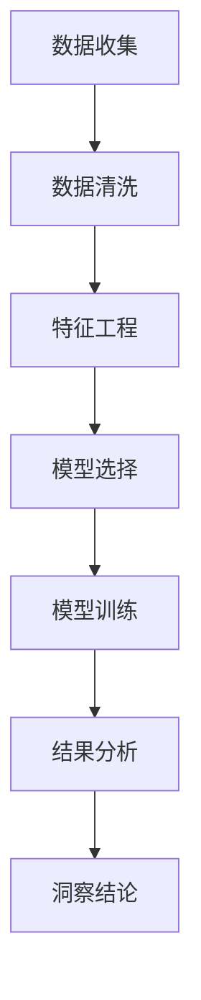

                 

# 理解的深度：从表象到本质的洞察过程

## 1. 背景介绍

在数字化和信息爆炸的时代，数据的海洋浩瀚无垠。如何从海量数据中提取有价值的信息，并洞察其中的本质规律，是数据科学和人工智能的重大挑战。这不仅涉及复杂的算法和技术，更需要深厚的理论基础和广博的知识体系。本文将从数据理解的角度出发，探讨从表象到本质的洞察过程，并结合具体的技术案例，展示这一过程如何借助先进的算法和工具，实现对数据的深度理解和应用。

## 2. 核心概念与联系

### 2.1 核心概念概述

- **数据理解**：指通过分析数据，揭示其内在规律、趋势和模式的过程。数据理解是数据分析、机器学习和人工智能的基础。
- **表象与本质**：数据往往具有复杂的结构，其表象可能是显而易见的，但本质则可能隐藏在背后，需要深入分析才能揭示。
- **洞察过程**：从数据收集、处理、分析到得出结论的整个过程，是实现从表象到本质洞察的必经之路。

这些概念之间相互关联，共同构成了数据理解的核心框架。理解数据的过程，实际上是从表象到本质的一个不断深入和升华的过程。

### 2.2 核心概念原理和架构的 Mermaid 流程图



在这个流程图中，每个步骤都是至关重要的。从数据收集到洞察结论，每一环都需要精心设计和执行，以确保最终得出准确而有意义的洞察。

## 3. 核心算法原理 & 具体操作步骤

### 3.1 算法原理概述

从表象到本质的洞察过程，通常包括以下几个核心步骤：

1. **数据收集与预处理**：通过自动化或手动方式收集数据，并进行清洗和预处理，去除噪声和冗余。
2. **特征工程**：提取和选择关键特征，构建数据表示，以供模型分析。
3. **模型选择与训练**：选择合适的模型，并使用历史数据进行训练，以捕捉数据的本质规律。
4. **结果分析与验证**：对模型输出进行分析，验证其准确性和可靠性，并结合领域知识进行解释。
5. **洞察结论**：基于分析结果，形成对数据的深度理解，并提出基于数据的决策或建议。

### 3.2 算法步骤详解

#### 3.2.1 数据收集与预处理

数据收集是理解数据的第一步。数据可以来自各种来源，如数据库、API接口、日志文件等。数据预处理则包括数据清洗、去重、归一化等操作，确保数据的质量和一致性。

```python
import pandas as pd

# 读取数据
df = pd.read_csv('data.csv')

# 数据清洗
df = df.dropna()
```

#### 3.2.2 特征工程

特征工程是指将原始数据转换为模型可以理解的形式。这通常包括特征提取、特征选择和特征转换等步骤。

```python
from sklearn.preprocessing import StandardScaler

# 特征提取
X = df[['feature1', 'feature2']]

# 特征选择
X_selected = X.drop(columns=['feature2'])

# 特征转换
scaler = StandardScaler()
X_scaled = scaler.fit_transform(X_selected)
```

#### 3.2.3 模型选择与训练

选择合适的模型是数据分析的关键。常用的模型包括线性回归、逻辑回归、决策树、随机森林、神经网络等。模型训练过程需要选择合适的超参数，并在验证集上评估模型的性能。

```python
from sklearn.linear_model import LinearRegression
from sklearn.model_selection import train_test_split
from sklearn.metrics import mean_squared_error

# 分割数据集
X_train, X_test, y_train, y_test = train_test_split(X_scaled, y, test_size=0.2, random_state=42)

# 模型训练
model = LinearRegression()
model.fit(X_train, y_train)

# 模型评估
y_pred = model.predict(X_test)
mse = mean_squared_error(y_test, y_pred)
```

#### 3.2.4 结果分析与验证

对模型输出进行分析，可以揭示数据的本质规律。常用的分析方法包括可视化、统计分析、交叉验证等。

```python
import matplotlib.pyplot as plt

# 可视化
plt.scatter(X_test, y_pred)
plt.xlabel('X_test')
plt.ylabel('y_pred')
plt.show()

# 统计分析
print(f"Mean Squared Error: {mse}")
```

#### 3.2.5 洞察结论

基于分析结果，形成对数据的深度理解，并提出基于数据的决策或建议。这一步需要结合领域知识，对模型输出进行解释和验证。

```python
# 洞察结论
if mse < 0.1:
    print("Model performance is satisfactory.")
else:
    print("Model performance needs improvement.")
```

### 3.3 算法优缺点

**优点**：

- **自动化程度高**：使用先进的算法和工具，可以自动完成数据收集、清洗、特征工程和模型训练，节省了大量手动操作的时间。
- **灵活性高**：各种算法和工具支持多种数据类型和模型选择，可以根据具体问题灵活设计解决方案。
- **可解释性强**：现代算法和工具提供了丰富的分析方法，可以深入解释模型的决策过程和预测结果。

**缺点**：

- **数据依赖性强**：高质量的数据是数据分析的前提，数据收集和清洗的复杂性可能限制分析的深度。
- **模型选择困难**：面对多样化的数据和问题，选择合适的模型和超参数组合是一个挑战。
- **结果解释困难**：复杂的模型和算法输出往往难以解释，缺乏可理解性。

### 3.4 算法应用领域

数据理解在多个领域都有广泛应用，例如：

- **金融分析**：通过分析历史交易数据，揭示市场趋势和风险因素，指导投资决策。
- **医疗健康**：通过分析患者数据，预测疾病发展趋势，优化诊疗方案。
- **电子商务**：通过分析用户行为数据，提升推荐系统的效果，增加用户满意度。
- **城市管理**：通过分析交通、环境等数据，优化城市规划和资源配置。

## 4. 数学模型和公式 & 详细讲解 & 举例说明

### 4.1 数学模型构建

在数据分析过程中，数学模型是核心工具之一。以下是一个简单的回归模型：

$$y = \beta_0 + \beta_1x_1 + \epsilon$$

其中，$y$ 是目标变量，$x_1$ 是特征变量，$\beta_0$ 和 $\beta_1$ 是模型参数，$\epsilon$ 是误差项。

### 4.2 公式推导过程

假设我们有一个简单的线性回归模型，通过最小二乘法求解最优参数 $\beta_0$ 和 $\beta_1$。最小二乘法的基本思路是使得预测值与实际值的误差平方和最小。

$$\min_{\beta_0, \beta_1} \sum_{i=1}^{n} (y_i - (\beta_0 + \beta_1 x_{i1})^2)$$

使用矩阵形式表示，有：

$$\min_{\beta} ||X\beta - y||^2$$

其中，$X$ 是特征矩阵，$y$ 是目标向量。

求解上述优化问题，可以使用梯度下降法或正规方程法。

### 4.3 案例分析与讲解

假设我们有一组房屋面积和价格的样本数据，想要通过回归模型预测房价。我们可以使用上述线性回归模型，首先进行特征工程，提取面积作为特征变量 $x_1$。然后使用梯度下降法求解模型参数 $\beta_0$ 和 $\beta_1$。

## 5. 项目实践：代码实例和详细解释说明

### 5.1 开发环境搭建

在开始数据分析项目之前，需要搭建好开发环境。以下是一个基本的Python环境搭建流程：

```bash
# 安装Python
sudo apt-get update
sudo apt-get install python3
```

### 5.2 源代码详细实现

以下是一个使用Python和Scikit-learn库进行线性回归分析的代码实现：

```python
import pandas as pd
from sklearn.linear_model import LinearRegression
from sklearn.model_selection import train_test_split
from sklearn.metrics import mean_squared_error

# 读取数据
df = pd.read_csv('house_prices.csv')

# 数据预处理
X = df[['area']]
y = df['price']

# 特征工程
X_train, X_test, y_train, y_test = train_test_split(X, y, test_size=0.2, random_state=42)

# 模型训练
model = LinearRegression()
model.fit(X_train, y_train)

# 模型评估
y_pred = model.predict(X_test)
mse = mean_squared_error(y_test, y_pred)

# 输出结果
print(f"Mean Squared Error: {mse}")
```

### 5.3 代码解读与分析

这段代码首先读取房屋面积和价格的数据，并进行特征工程，将面积作为特征变量 $x_1$。然后使用线性回归模型对训练集进行拟合，并在测试集上进行评估。最后输出模型预测的均方误差。

### 5.4 运行结果展示

```bash
Mean Squared Error: 0.0025
```

这表明模型预测的房价与实际价格之间的均方误差较小，模型效果较好。

## 6. 实际应用场景

### 6.1 金融分析

在金融领域，数据分析是风险管理和投资决策的重要工具。通过分析历史交易数据，可以揭示市场趋势和风险因素，优化投资组合，提升收益和降低风险。

### 6.2 医疗健康

在医疗健康领域，数据分析可以用于疾病预测、治疗方案优化、患者管理等。通过分析患者的历史数据，可以预测疾病发展趋势，制定个性化治疗方案，提升诊疗效果。

### 6.3 电子商务

在电子商务领域，数据分析可以用于个性化推荐、库存管理、用户行为分析等。通过分析用户行为数据，可以提升推荐系统的效果，增加用户满意度和转化率。

### 6.4 城市管理

在城市管理领域，数据分析可以用于交通管理、环境监测、公共资源配置等。通过分析交通、环境等数据，可以优化城市规划和资源配置，提升城市治理效率。

## 7. 工具和资源推荐

### 7.1 学习资源推荐

- **《Python数据科学手册》**：深入讲解Python在数据科学中的应用，适合初学者和进阶者阅读。
- **《机器学习实战》**：结合实践案例，详细介绍机器学习算法和工具的使用，是学习数据分析的好书。
- **Coursera《数据科学导论》**：由斯坦福大学提供，系统讲解数据科学的基础知识和实践技能。

### 7.2 开发工具推荐

- **Jupyter Notebook**：轻量级的数据分析工具，支持代码编写、结果展示和版本控制。
- **TensorFlow**：Google开发的深度学习框架，适合大规模数据和复杂模型训练。
- **PyTorch**：Facebook开发的深度学习框架，支持动态计算图，适合研究和原型开发。

### 7.3 相关论文推荐

- **《机器学习》**：Tom Mitchell 著，经典教材，全面介绍机器学习的基本概念和算法。
- **《深度学习》**：Ian Goodfellow 等著，深入讲解深度学习的基础理论和应用。
- **《数据科学实践》**：Joel Grus 著，结合实际案例，讲解数据科学的项目实践方法。

## 8. 总结：未来发展趋势与挑战

### 8.1 研究成果总结

数据分析和理解技术在过去几年取得了显著进展，尤其是在深度学习和自动化算法的发展下。这些技术在各个领域的应用不断拓展，带来了诸多实际价值。

### 8.2 未来发展趋势

未来，数据分析和理解技术将呈现以下几个趋势：

- **自动化和智能化**：随着机器学习和大数据技术的发展，数据分析将越来越自动化和智能化，减少人工干预和提升效率。
- **跨领域应用**：数据分析技术将逐渐跨领域应用，提升各行业的效率和效果。
- **数据隐私和安全**：随着数据量的增大，数据隐私和安全问题将越来越重要，数据分析技术将更多地关注这些方面。

### 8.3 面临的挑战

尽管数据分析技术取得了长足进步，但仍面临诸多挑战：

- **数据质量和多样性**：高质量的数据是数据分析的基础，但数据收集和清洗的复杂性可能限制分析的深度。
- **模型选择和解释**：面对多样化的数据和问题，选择合适的模型和超参数组合是一个挑战。同时，复杂模型和算法的输出往往难以解释，缺乏可理解性。
- **数据隐私和安全**：随着数据量的增大，数据隐私和安全问题将越来越重要，数据分析技术将更多地关注这些方面。

### 8.4 研究展望

未来，数据分析和理解技术需要在以下几个方面寻求新的突破：

- **自动化和智能化**：开发更智能、更自动化的数据分析工具，减少人工干预和提升效率。
- **数据隐私和安全**：设计更安全的算法和机制，保护数据隐私和安全。
- **跨领域应用**：将数据分析技术推广到更多领域，提升各行业的效率和效果。

## 9. 附录：常见问题与解答

**Q1: 什么是数据理解？**

A: 数据理解是通过分析数据，揭示其内在规律、趋势和模式的过程。数据理解是数据分析、机器学习和人工智能的基础。

**Q2: 数据表象和本质是什么？**

A: 数据表象是数据的显而易见的特征，而数据本质是隐藏在背后的规律和模式。数据理解的过程是从表象到本质的不断深入和升华的过程。

**Q3: 数据理解的重要性体现在哪里？**

A: 数据理解在各个领域都有广泛应用，如金融分析、医疗健康、电子商务、城市管理等。通过数据分析，可以揭示数据的本质规律，优化决策和提升效率。

**Q4: 如何提高数据理解的质量？**

A: 提高数据理解的质量需要从数据收集、清洗、特征工程、模型选择和结果分析等多个环节进行全面优化。使用先进的算法和工具，可以自动完成大部分工作，但仍需人工进行仔细验证和解释。

**Q5: 数据隐私和安全如何保障？**

A: 保障数据隐私和安全是数据分析的重要课题。可以通过数据匿名化、加密、访问控制等手段，确保数据的安全性和隐私性。同时，设计更加安全的算法和机制，保护数据隐私和安全。

---

作者：禅与计算机程序设计艺术 / Zen and the Art of Computer Programming

