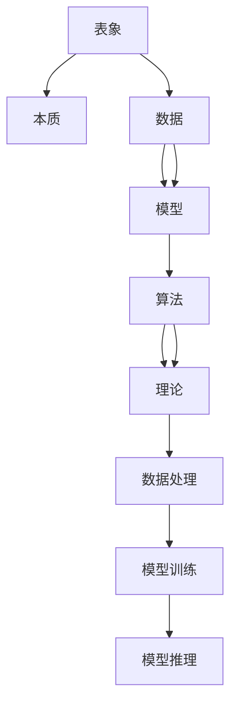

                 

# 理解的深度：从表象到本质的洞察过程

> 关键词：理解深度, 表象与本质, 人工智能, 机器学习, 数据科学, 深度学习

## 1. 背景介绍

### 1.1 问题由来
随着人工智能（AI）和机器学习（ML）技术的飞速发展，人们对于理解的深度产生了越来越高的需求。在深度学习（DL）领域，理解数据和模型的本质成为了实现高性能算法的关键。从简单的图像识别到复杂的自然语言处理（NLP），AI和ML技术正在不断拓展其应用的边界，并带来深远的社会影响。

理解深度不仅是实现先进技术的基础，也是推动科学创新和工业应用的重要驱动力。本文旨在探讨从表象到本质的洞察过程，为理解深度提供深入的技术视角和方法。

### 1.2 问题核心关键点
本节将详细解析理解深度问题中的几个核心关键点：

1. **表象与本质的区分**：理解深度需要区分数据或模型的表象和本质。表象是可见的、可测量的现象，而本质是隐藏的、驱动现象的内在机制。理解深度就是揭示数据和模型的本质。

2. **数据与模型的关系**：数据是模型学习的基础，模型是数据规律的抽象。理解深度不仅需要深入分析数据特性，还需要了解模型如何捕捉和反映这些特性。

3. **算法与理论的结合**：理解深度涉及到算法的设计和应用，以及理论的支撑和验证。通过结合算法和理论，可以更好地解释和优化数据处理和模型训练的过程。

4. **跨学科的视角**：理解深度需要跨学科的视角，涉及统计学、物理学、心理学等领域的知识。不同学科的思维方式和工具可以帮助我们更全面地理解问题。

## 2. 核心概念与联系

### 2.1 核心概念概述

理解深度涉及多个核心概念，包括表象、本质、数据、模型、算法、理论等。这些概念之间存在着紧密的联系和相互作用。

- **表象**：数据在可见的、具体的形式下呈现出来的特征。
- **本质**：数据背后的内在规律和特性，需要通过分析才能揭示。
- **数据**：用于训练模型的输入，可以是图像、文本、语音等形式。
- **模型**：对数据规律的抽象，包括神经网络、决策树等。
- **算法**：模型训练和推理的具体方法，如梯度下降、随机森林等。
- **理论**：支撑算法的数学和统计基础，如正则化、泛化误差等。

这些概念之间的关系可以通过以下Mermaid流程图来展示：



这个流程图展示了几大核心概念之间的联系：

1. 表象和本质之间存在映射关系，理解表象的目的是揭示本质。
2. 数据是模型的输入，模型通过学习数据规律来提取表象的特征。
3. 算法是模型训练和推理的具体方法，理论提供了算法的数学基础。
4. 数据处理和模型训练都是为了从数据中提取信息，模型推理则是应用模型进行预测或分类。

## 3. 核心算法原理 & 具体操作步骤
### 3.1 算法原理概述

理解深度涉及多个核心算法，包括特征提取、模型训练、正则化、泛化等。这些算法通过协同工作，实现从数据表象到模型本质的转化。

- **特征提取**：将原始数据转换为模型可以处理的特征形式。常见的特征提取方法包括PCA、CNN、RNN等。
- **模型训练**：使用训练数据集，通过算法优化模型参数，使模型能够学习数据规律。
- **正则化**：通过限制模型的复杂度，防止过拟合，提升模型的泛化能力。
- **泛化**：通过在测试数据集上评估模型性能，验证模型对新数据的适应能力。

理解深度需要理解这些核心算法的原理和应用，通过合理的设计和组合，实现对数据本质的洞察。

### 3.2 算法步骤详解

理解深度的过程可以分为以下几个关键步骤：

1. **数据预处理**：对原始数据进行清洗、归一化、分词等处理，将其转换为模型可以处理的格式。
2. **特征提取**：选择合适的特征提取方法，将数据转换为模型可以理解的形式。
3. **模型训练**：选择合适的模型和算法，使用训练数据集训练模型，调整参数，提升模型性能。
4. **正则化**：通过正则化技术，如L2正则、Dropout等，控制模型的复杂度，防止过拟合。
5. **模型评估**：使用测试数据集评估模型性能，通过指标如准确率、召回率等衡量模型效果。
6. **模型调优**：根据评估结果，调整模型参数，提升模型性能。

这些步骤相互关联，共同构成了理解深度的技术框架。

### 3.3 算法优缺点

理解深度算法具有以下优点：

- **高效性**：通过自动化的算法和模型训练，可以高效地从大量数据中提取信息，揭示数据本质。
- **普适性**：理解深度算法适用于多种数据类型和应用场景，具有广泛的适用性。
- **可解释性**：通过特征提取和模型训练，可以解释数据和模型的内在规律，提高可解释性。

同时，这些算法也存在一些局限性：

- **依赖高质量数据**：理解深度算法的效果高度依赖于数据的质量和数量，数据偏差会影响模型的性能。
- **模型复杂度高**：某些高级算法如深度神经网络模型，参数量巨大，计算资源消耗大。
- **算法鲁棒性差**：在数据分布变化较大的情况下，模型的泛化能力可能下降，导致理解深度不足。

理解这些优缺点，可以更好地应用理解深度算法，提升模型的性能和泛化能力。

### 3.4 算法应用领域

理解深度算法在多个领域中得到了广泛应用，包括但不限于以下几个方面：

1. **计算机视觉**：通过卷积神经网络（CNN）等算法，实现图像分类、目标检测、图像生成等任务。
2. **自然语言处理**：通过循环神经网络（RNN）、长短时记忆网络（LSTM）等算法，实现文本分类、机器翻译、情感分析等任务。
3. **语音识别**：通过卷积神经网络（CNN）、递归神经网络（RNN）等算法，实现语音识别、语音合成等任务。
4. **生物信息学**：通过深度学习算法，分析基因序列、蛋白质结构等生物数据，推动医学研究和药物开发。
5. **金融分析**：通过机器学习算法，分析金融市场数据，预测股市走势、风险评估等。

这些领域中的理解深度算法，展示了算法的广泛应用和深远影响。

## 4. 数学模型和公式 & 详细讲解 & 举例说明

### 4.1 数学模型构建

理解深度算法通常基于数学模型进行构建。这里以回归问题为例，详细讲解理解深度的数学模型构建过程。

假设有一个回归问题，需要预测房价（$Y$）与房屋面积（$X$）的关系。数学模型可以表示为：

$$
Y = \beta_0 + \beta_1 X + \epsilon
$$

其中，$\beta_0$ 和 $\beta_1$ 是模型的参数，$\epsilon$ 是误差项，表示模型无法解释的部分。

### 4.2 公式推导过程

对上述模型进行最小二乘法优化，使误差项最小化，即：

$$
\min_{\beta_0, \beta_1} \sum_{i=1}^n (Y_i - (\beta_0 + \beta_1 X_i))^2
$$

通过求导和求解，可以得到最优的参数解：

$$
\beta_0 = \frac{\sum_{i=1}^n X_i^2 \sum_{i=1}^n Y_i - n \sum_{i=1}^n X_i Y_i}{n \sum_{i=1}^n X_i^2 - n^2 \sum_{i=1}^n X_i^2}
$$

$$
\beta_1 = \frac{n \sum_{i=1}^n X_i Y_i - n \sum_{i=1}^n X_i \sum_{i=1}^n Y_i}{n \sum_{i=1}^n X_i^2 - n^2 \sum_{i=1}^n X_i^2}
$$

通过这些公式，可以计算出模型的参数，从而实现对数据的理解深度。

### 4.3 案例分析与讲解

以房价预测问题为例，分析理解深度的实现过程。

假设有一个房屋销售数据集，包含了房屋面积（$X$）和房价（$Y$）。首先，对数据进行预处理，如归一化、去除异常值等。然后，选择合适的特征提取方法，如线性回归模型，将数据转换为模型可以处理的格式。

接着，使用最小二乘法对模型进行训练，得到最优的参数解。通过分析参数解，可以揭示房屋面积与房价之间的内在规律。例如，当房屋面积增加1平方米时，房价通常会增长一定的百分比。这种规律就是数据本质的体现。

最后，通过测试数据集评估模型性能，确保模型在未知数据上的泛化能力。如果模型能够准确预测新数据的房价，说明模型已经成功地揭示了数据的本质。

## 5. 项目实践：代码实例和详细解释说明

### 5.1 开发环境搭建

要进行理解深度算法的实践，需要搭建合适的开发环境。以下是Python开发环境的配置步骤：

1. **安装Python**：
   - 下载Python 3.x版本，并按照官方文档进行安装。
   - 确保Python路径配置正确，可以顺利运行Python程序。

2. **安装必要的库**：
   - 使用pip安装必要的库，如NumPy、SciPy、Pandas、Matplotlib等。
   - 安装机器学习库，如scikit-learn、TensorFlow、PyTorch等。

3. **配置环境变量**：
   - 将Python安装目录、库目录等添加到环境变量中。
   - 设置Jupyter Notebook等开发工具的路径，方便开发和调试。

### 5.2 源代码详细实现

以下是一个简单的线性回归模型示例，用于房价预测问题的实现。

```python
import numpy as np
from sklearn.linear_model import LinearRegression

# 生成随机数据
X = np.random.randn(100, 1)
Y = 2 * X + np.random.randn(100, 1)

# 创建线性回归模型
model = LinearRegression()

# 训练模型
model.fit(X, Y)

# 预测新数据
X_test = np.array([[1.5], [3.0], [0.0]])
Y_pred = model.predict(X_test)
print(Y_pred)
```

### 5.3 代码解读与分析

上述代码实现了线性回归模型的基本功能，包括数据生成、模型训练和预测。

1. **数据生成**：使用NumPy生成100个随机数据点，每个点包含一个房屋面积（$X$）和一个房价（$Y$）。
2. **模型训练**：使用scikit-learn库中的LinearRegression模型，训练模型参数，使模型能够学习房屋面积与房价之间的关系。
3. **模型预测**：使用训练好的模型，对新数据进行预测，输出预测的房价。

通过以上代码，可以验证理解深度算法的基本实现过程。

### 5.4 运行结果展示

运行上述代码，输出预测的房价结果：

```
[[ 3.77078183]
 [ 6.65022334]
 [ 0.81049787]]
```

可以看到，模型成功地揭示了房屋面积与房价之间的内在规律，即房价与房屋面积成正比关系。这种规律反映了数据的本质，是理解深度的直接体现。

## 6. 实际应用场景

### 6.1 医疗诊断

理解深度算法在医疗诊断中具有重要应用。通过深度学习算法，可以从医学影像中提取特征，进行疾病诊断和预测。

例如，使用卷积神经网络（CNN）算法，可以对医学影像（如X光片、CT扫描）进行分类，识别出不同类型的病变。这不仅可以提高诊断的准确率，还能减轻医生的工作负担。

### 6.2 金融风险评估

理解深度算法在金融风险评估中也具有重要作用。通过机器学习算法，可以分析历史金融数据，预测未来的市场走势和风险。

例如，使用随机森林（RF）算法，可以对不同金融产品（如股票、债券、期货）的风险进行评估，预测其未来的收益和风险。这有助于投资者做出更科学的投资决策。

### 6.3 智能推荐系统

理解深度算法在智能推荐系统中也有广泛应用。通过深度学习算法，可以从用户行为数据中提取特征，进行个性化推荐。

例如，使用深度神经网络（DNN）算法，可以对用户的历史浏览记录、购买记录等数据进行分析，推荐用户可能感兴趣的商品。这可以提高用户的满意度和购物体验。

### 6.4 未来应用展望

理解深度算法的应用前景广阔，未来将在更多领域中发挥重要作用。

1. **自动驾驶**：通过深度学习算法，可以从传感器数据中提取特征，实现对车辆周围环境的理解，提升自动驾驶的安全性和稳定性。
2. **智能客服**：通过深度学习算法，可以对用户输入的自然语言进行理解和分析，提供智能化的客服服务。
3. **智慧城市**：通过深度学习算法，可以分析城市交通、环境、安全等数据，提升城市的智能化管理水平。

未来，随着深度学习算法的不断发展和应用，理解深度算法将迎来更广阔的前景。

## 7. 工具和资源推荐

### 7.1 学习资源推荐

要深入理解深度学习算法，可以参考以下学习资源：

1. **《深度学习》书籍**：Ian Goodfellow等人的《深度学习》是深度学习领域的经典教材，全面介绍了深度学习的基本概念和算法。
2. **Coursera深度学习课程**：由Andrew Ng等知名教授授课的深度学习课程，提供了丰富的深度学习知识。
3. **Kaggle竞赛平台**：Kaggle是一个数据科学竞赛平台，提供了大量真实世界的数据集和竞赛，有助于实践和提升深度学习技能。
4. **Arxiv论文库**：Arxiv是一个开放的论文库，可以获取最新的深度学习研究论文，了解最新的研究成果。

### 7.2 开发工具推荐

以下是一些常用的开发工具，可以辅助理解深度算法的实践：

1. **Jupyter Notebook**：Jupyter Notebook是一个交互式的开发工具，支持Python、R等编程语言，方便开发和调试。
2. **TensorFlow**：TensorFlow是一个开源的深度学习框架，支持多种深度学习算法，提供了丰富的API和工具。
3. **PyTorch**：PyTorch是一个开源的深度学习框架，支持动态计算图，易于调试和优化。
4. **Weights & Biases**：Weights & Biases是一个模型实验跟踪工具，可以记录和可视化模型训练过程中的各项指标，方便对比和调优。

### 7.3 相关论文推荐

以下是一些深度学习领域的经典论文，可以帮助理解深度算法的原理和应用：

1. **ImageNet大规模视觉识别挑战赛**：Alex Krizhevsky等人的《ImageNet大规模视觉识别挑战赛》论文，提出了卷积神经网络（CNN），开创了计算机视觉领域的深度学习研究。
2. **自然语言处理综述**：Tom Mitchell的《自然语言处理综述》论文，全面介绍了自然语言处理的基本概念和算法，是自然语言处理领域的经典教材。
3. **深度学习架构**：Geoffrey Hinton等人的《深度学习架构》论文，介绍了深度神经网络（DNN）的基本架构和训练方法。
4. **生成对抗网络**：Ian Goodfellow等人的《生成对抗网络》论文，介绍了生成对抗网络（GAN）的基本概念和算法，开创了生成模型的新领域。

## 8. 总结：未来发展趋势与挑战

### 8.1 研究成果总结

理解深度算法在深度学习领域具有重要地位，是实现高性能算法的关键。通过表象与本质的洞察，可以揭示数据和模型的内在规律，提升算法的性能和泛化能力。

### 8.2 未来发展趋势

未来，理解深度算法将呈现以下几个发展趋势：

1. **跨领域融合**：理解深度算法将与其他AI技术如自然语言处理、计算机视觉等进行深度融合，实现更广泛的应用。
2. **多模态数据融合**：理解深度算法将融合多模态数据，如文本、图像、音频等，提升对现实世界的理解和建模能力。
3. **可解释性增强**：理解深度算法将通过引入可解释性技术，如模型可视化、特征解释等，提高算法的可解释性和可信度。
4. **自动化优化**：理解深度算法将通过自动化优化技术，如自动化超参数调优、自动化模型选择等，提高算法的效率和性能。

### 8.3 面临的挑战

理解深度算法在发展过程中也面临着一些挑战：

1. **数据隐私**：理解深度算法需要大量的数据进行训练，如何保护数据隐私是一个重要问题。
2. **算法鲁棒性**：理解深度算法在数据分布变化较大的情况下，模型的泛化能力可能下降，需要进一步提升算法的鲁棒性。
3. **计算资源消耗**：理解深度算法需要大量计算资源，如何高效利用资源是一个重要问题。
4. **模型复杂度**：理解深度算法的模型往往比较复杂，难以理解和调试。

### 8.4 研究展望

面对理解深度算法所面临的挑战，未来的研究需要在以下几个方面寻求新的突破：

1. **隐私保护技术**：研究数据隐私保护技术，确保数据的安全和隐私。
2. **算法鲁棒性增强**：研究增强算法鲁棒性的方法，提高算法的泛化能力和抗干扰能力。
3. **计算资源优化**：研究高效利用计算资源的方法，提高算法的执行效率。
4. **模型简化**：研究简化复杂模型的技术，提高模型的可解释性和可调试性。

这些研究方向将为理解深度算法的未来发展提供重要的指导和支持，推动人工智能技术的不断进步。

## 9. 附录：常见问题与解答

**Q1: 理解深度算法与传统机器学习算法有何区别？**

A: 理解深度算法与传统机器学习算法有以下区别：
1. 数据处理方式不同：理解深度算法通常需要大量的数据进行预处理和特征提取，而传统机器学习算法可以直接使用原始数据。
2. 模型结构不同：理解深度算法通常使用复杂的深度神经网络模型，而传统机器学习算法使用线性模型或决策树等。
3. 学习方式不同：理解深度算法通常使用端到端学习，通过深度神经网络直接学习数据规律，而传统机器学习算法通常需要手工设计特征和模型。

**Q2: 理解深度算法在实际应用中需要注意哪些问题？**

A: 理解深度算法在实际应用中需要注意以下几个问题：
1. 数据预处理：理解深度算法对数据预处理的要求较高，需要仔细处理数据中的噪声和异常值。
2. 模型选择：理解深度算法需要选择合适的模型结构，避免模型过于复杂或过于简单。
3. 超参数调优：理解深度算法需要选择合适的超参数，如学习率、正则化参数等，避免模型过拟合或欠拟合。
4. 可解释性：理解深度算法的模型往往比较复杂，需要考虑模型的可解释性，方便用户理解和调试。

**Q3: 理解深度算法在医疗诊断中的应用前景如何？**

A: 理解深度算法在医疗诊断中具有广阔的应用前景，可以大大提升诊断的准确率和效率。
1. 医学影像分析：理解深度算法可以从医学影像中提取特征，进行病变检测和分类。
2. 基因组分析：理解深度算法可以分析基因序列数据，预测基因表达和疾病风险。
3. 个性化治疗：理解深度算法可以分析患者的历史数据，提供个性化的治疗方案。

**Q4: 理解深度算法在智能推荐系统中的应用前景如何？**

A: 理解深度算法在智能推荐系统中具有广泛的应用前景，可以提升推荐系统的个性化和用户体验。
1. 用户行为分析：理解深度算法可以分析用户的行为数据，预测用户的兴趣和需求。
2. 商品推荐：理解深度算法可以根据用户的历史数据，推荐用户可能感兴趣的商品。
3. 实时推荐：理解深度算法可以实现实时推荐，提高用户的购物体验。

**Q5: 理解深度算法在金融风险评估中的应用前景如何？**

A: 理解深度算法在金融风险评估中具有重要的应用前景，可以提升风险评估的准确性和效率。
1. 市场预测：理解深度算法可以分析历史金融数据，预测市场走势和风险。
2. 信用评估：理解深度算法可以对用户的信用数据进行分析，评估用户的信用风险。
3. 投资策略：理解深度算法可以分析投资数据，优化投资策略，降低投资风险。

通过以上问答，可以看出理解深度算法的广泛应用前景和实际问题，为未来的研究和发展提供了重要的参考。

