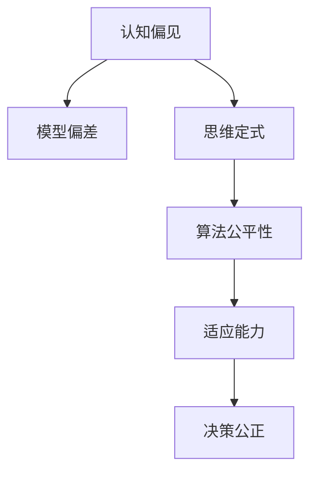

                 

# 理解的障碍：认知偏见与思维定式的克服

## 1. 背景介绍

### 1.1 问题由来
在人工智能(AI)和机器学习(ML)领域，理解能力是许多算法和模型的核心组成部分。然而，理解不仅仅是简单的信息解析，它还涉及到复杂的认知过程、情感因素、上下文理解和推理。这导致在理解任务中存在各种障碍，其中最常见的是认知偏见和思维定式。

### 1.2 问题核心关键点
认知偏见指的是人们在决策和推理过程中，由于先入为主的观点或情绪所导致的判断偏差。这种偏见可以是先验的，也可以是情境性的。思维定式则是人们在面对相似情境时，习惯性地采用相同的思考模式或方法，导致创新和适应能力下降。

这些认知偏见和思维定式在AI和ML系统中往往表现为模型偏差、决策不公和适应能力差等。研究如何克服这些障碍，不仅对于提升AI和ML系统的性能至关重要，对于人类社会的公平、公正和可持续发展也具有重要意义。

### 1.3 问题研究意义
研究认知偏见和思维定式的克服方法，能够提升AI和ML系统的理解能力和决策公正性，增强其在复杂情境下的适应能力和创新能力。具体来说，具有以下几方面意义：

1. **提升系统性能**：通过减少偏见和定式，可以使模型更准确、公正地处理信息，从而提高系统的整体性能。
2. **保障决策公正**：消除认知偏见有助于确保模型决策不因个人或群体偏好而失衡，从而实现更公正的社会决策。
3. **增强适应能力**：克服思维定式使系统能够更灵活地应对变化，增强在复杂环境中的适应和生存能力。
4. **推动公平社会**：通过消除系统偏差，有助于构建一个更为公平、公正的社会，促进社会和谐发展。

## 2. 核心概念与联系

### 2.1 核心概念概述

为了更好地理解认知偏见和思维定式的克服方法，本节将介绍几个密切相关的核心概念：

- **认知偏见(Cognitive Bias)**：指人们在信息处理过程中由于个人主观因素导致的判断偏差。常见的认知偏见包括确认偏误、幸存者偏误、自利偏误等。
- **思维定式(Thinking Style)**：指人们面对相似问题时，习惯性地采用相同的思考模式或方法。常见的思维定式包括习惯性推理、从众效应、固定思维等。
- **模型偏差(Model Bias)**：指在模型训练和推理过程中，由于数据、算法或环境因素导致的输出偏差。
- **算法公平性(Algorithm Fairness)**：指模型在处理不同类别或群体数据时，输出结果的一致性和无歧视性。
- **适应能力(Adaptability)**：指系统面对新情境或变化时的快速适应和学习能力。

这些核心概念之间的逻辑关系可以通过以下Mermaid流程图来展示：



这个流程图展示了几大核心概念之间的内在联系：认知偏见和思维定式直接影响了模型的偏差，进而影响了算法的公平性和系统的适应能力，最终作用于决策的公正性。

## 3. 核心算法原理 & 具体操作步骤

### 3.1 算法原理概述

克服认知偏见和思维定式，本质上是通过优化模型训练、数据处理和系统设计，减少偏差和提高灵活性。其中，监督学习、强化学习和无监督学习是常用的技术手段。

监督学习：通过有标签的数据训练模型，使模型能够学习正确的推理方式，减少基于先入为主偏见的错误推理。

强化学习：通过与环境的交互，模型不断调整策略，优化决策过程，减少固定思维和过拟合。

无监督学习：通过未标记的数据训练模型，使其能够发现数据中的内在结构，增强系统的适应性和鲁棒性。

### 3.2 算法步骤详解

#### 3.2.1 数据处理

- **数据清洗**：去除噪音数据、异常值，确保数据质量和代表性。
- **数据增强**：通过旋转、缩放、添加噪声等方式扩充数据集，提高模型的泛化能力。
- **数据分割**：将数据集划分为训练集、验证集和测试集，确保模型评估的公正性。

#### 3.2.2 模型训练

- **选择算法**：根据任务特性选择合适的算法，如决策树、支持向量机、深度神经网络等。
- **设计损失函数**：设计损失函数，反映模型输出与真实标签之间的差异，如交叉熵损失、均方误差损失等。
- **设置超参数**：调整学习率、正则化系数、批大小等超参数，优化模型性能。

#### 3.2.3 模型评估

- **交叉验证**：通过交叉验证评估模型泛化能力，避免过拟合。
- **对抗测试**：使用对抗样本测试模型的鲁棒性，确保模型对输入变化具有免疫力。
- **公平性测试**：通过不同群体数据集的测试，评估模型的公平性，确保输出不偏不倚。

#### 3.2.4 模型部署

- **模型裁剪**：去除冗余层和参数，减小模型大小，加快推理速度。
- **量化加速**：将浮点模型转换为定点模型，降低存储和计算需求。
- **服务化封装**：将模型封装为API服务，便于集成调用。

### 3.3 算法优缺点

克服认知偏见和思维定式的算法有以下优点：

- **准确性**：通过优化模型训练和数据处理，提升模型输出准确性。
- **公平性**：减少模型偏差，确保不同群体数据得到公平对待。
- **适应性**：增强系统在变化环境中的适应能力，提升长期稳定性。

同时，这些算法也存在一些局限性：

- **复杂度**：优化算法通常较为复杂，需要更多计算资源和时间。
- **可解释性**：部分算法模型黑盒化，难以解释决策过程，增加理解难度。
- **数据需求**：部分算法对数据质量和数据量有较高要求，数据不足可能导致模型性能下降。

### 3.4 算法应用领域

克服认知偏见和思维定式的算法广泛应用于以下领域：

- **金融风控**：通过消除模型偏差，实现更公平、公正的信贷评估和风险控制。
- **医疗诊断**：通过增强模型的泛化能力和适应性，提升疾病诊断的准确性和鲁棒性。
- **司法审判**：通过公平性测试，确保司法判决的公正性，减少系统性偏见。
- **自然灾害预测**：通过适应性强的模型，提升对极端天气等自然灾害的预测准确性。
- **智能推荐**：通过公平性优化，确保推荐系统对不同用户的推荐公正性，减少个性化偏差。

## 4. 数学模型和公式 & 详细讲解 & 举例说明

### 4.1 数学模型构建

在克服认知偏见和思维定式的算法中，数学模型扮演了关键角色。以线性回归模型为例，构建模型过程如下：

假设输入特征向量为 $x = [x_1, x_2, ..., x_n]$，输出标签为 $y$，目标函数为最小二乘法损失函数 $L$，线性模型为 $y = \theta_0 + \theta_1 x_1 + ... + \theta_n x_n$，其中 $\theta$ 为模型参数。

则目标函数 $L$ 可表示为：

$$L(\theta) = \frac{1}{2m} \sum_{i=1}^m (y_i - \theta_0 - \theta_1 x_{i,1} - ... - \theta_n x_{i,n})^2$$

其中 $m$ 为样本数量。

### 4.2 公式推导过程

#### 4.2.1 梯度下降

梯度下降是求解线性回归模型参数 $\theta$ 的常用算法。其基本思想是通过不断更新参数，使得损失函数 $L$ 最小化。具体步骤如下：

1. 初始化模型参数 $\theta$。
2. 对于每个样本 $(x_i, y_i)$，计算梯度 $\nabla_{\theta} L$。
3. 更新参数：$\theta \leftarrow \theta - \eta \nabla_{\theta} L$，其中 $\eta$ 为学习率。

#### 4.2.2 交叉验证

交叉验证是一种常用的模型评估方法，其步骤如下：

1. 将数据集随机分为 $k$ 个相等大小的子集。
2. 选择其中一个子集作为验证集，其余子集作为训练集。
3. 重复 $k$ 次，每次使用不同子集作为验证集，得到 $k$ 次评估结果。
4. 计算 $k$ 次评估结果的平均，作为最终模型性能评估。

### 4.3 案例分析与讲解

以金融风控模型为例，分析克服认知偏见和思维定式的方法：

#### 4.3.1 数据处理

- **数据清洗**：去除噪音数据、异常值，确保数据质量和代表性。
- **数据增强**：通过旋转、缩放、添加噪声等方式扩充数据集，提高模型的泛化能力。
- **数据分割**：将数据集划分为训练集、验证集和测试集，确保模型评估的公正性。

#### 4.3.2 模型训练

- **选择算法**：选择决策树算法，以应对不同客户群体的多样化特征。
- **设计损失函数**：使用交叉熵损失函数，反映模型输出与真实标签之间的差异。
- **设置超参数**：调整学习率、正则化系数、批大小等超参数，优化模型性能。

#### 4.3.3 模型评估

- **交叉验证**：通过交叉验证评估模型泛化能力，避免过拟合。
- **对抗测试**：使用对抗样本测试模型的鲁棒性，确保模型对输入变化具有免疫力。
- **公平性测试**：通过不同群体数据集的测试，评估模型的公平性，确保输出不偏不倚。

#### 4.3.4 模型部署

- **模型裁剪**：去除冗余层和参数，减小模型大小，加快推理速度。
- **量化加速**：将浮点模型转换为定点模型，降低存储和计算需求。
- **服务化封装**：将模型封装为API服务，便于集成调用。

## 5. 项目实践：代码实例和详细解释说明

### 5.1 开发环境搭建

在进行克服认知偏见和思维定式算法的实践前，我们需要准备好开发环境。以下是使用Python进行Scikit-learn开发的工程环境配置流程：

1. 安装Anaconda：从官网下载并安装Anaconda，用于创建独立的Python环境。

2. 创建并激活虚拟环境：
```bash
conda create -n sklearn-env python=3.8 
conda activate sklearn-env
```

3. 安装Scikit-learn：从官网获取安装命令，例如：
```bash
conda install scikit-learn
```

4. 安装各类工具包：
```bash
pip install numpy pandas scikit-learn matplotlib tqdm jupyter notebook ipython
```

完成上述步骤后，即可在`sklearn-env`环境中开始项目实践。

### 5.2 源代码详细实现

下面我们以金融风控模型为例，给出使用Scikit-learn对线性回归模型进行训练和评估的PyTorch代码实现。

首先，定义数据处理函数：

```python
import numpy as np
from sklearn.model_selection import train_test_split
from sklearn.linear_model import LinearRegression
from sklearn.metrics import mean_squared_error

def load_data():
    X = np.loadtxt('data/X.csv', delimiter=',')
    y = np.loadtxt('data/y.csv', delimiter=',')
    return X, y

def train_model(X, y, test_size=0.2, random_state=42):
    X_train, X_test, y_train, y_test = train_test_split(X, y, test_size=test_size, random_state=random_state)
    model = LinearRegression()
    model.fit(X_train, y_train)
    y_pred = model.predict(X_test)
    mse = mean_squared_error(y_test, y_pred)
    return model, mse

# 加载数据
X, y = load_data()

# 训练模型
model, mse = train_model(X, y)
print(f"Mean Squared Error: {mse:.4f}")
```

然后，定义评估函数：

```python
def evaluate_model(model, X, y):
    y_pred = model.predict(X)
    mse = mean_squared_error(y, y_pred)
    return mse

# 评估模型
mse = evaluate_model(model, X, y)
print(f"Mean Squared Error: {mse:.4f}")
```

最后，启动模型训练和评估流程：

```python
# 训练模型
model, mse = train_model(X, y)

# 评估模型
mse = evaluate_model(model, X, y)
print(f"Mean Squared Error: {mse:.4f}")
```

以上就是使用Scikit-learn对线性回归模型进行训练和评估的完整代码实现。可以看到，Scikit-learn库的强大封装使得模型训练和评估变得简洁高效。

### 5.3 代码解读与分析

让我们再详细解读一下关键代码的实现细节：

**load_data函数**：
- 定义了加载数据和分割数据的函数。使用NumPy库读取CSV文件，将特征矩阵和标签向量转换为数组格式。

**train_model函数**：
- 定义了模型训练函数。使用Scikit-learn的`train_test_split`函数将数据集分割为训练集和测试集。
- 创建线性回归模型，使用训练集数据拟合模型，并计算测试集的预测均方误差。

**evaluate_model函数**：
- 定义了模型评估函数。使用测试集数据计算模型的预测均方误差。

**训练流程**：
- 加载数据
- 训练模型
- 评估模型

可以看到，Scikit-learn库使得线性回归模型的训练和评估变得非常简单。开发者可以专注于模型的设计和优化，而不必过多关注底层的实现细节。

当然，工业级的系统实现还需考虑更多因素，如模型的保存和部署、超参数的自动搜索、更灵活的任务适配层等。但核心的算法过程基本与此类似。

## 6. 实际应用场景

### 6.1 金融风控

克服认知偏见和思维定式的算法在金融风控中具有重要应用。传统金融风控主要依赖人工经验进行风险评估，容易受个人经验和主观偏见的影响。通过机器学习模型，可以有效克服认知偏见和思维定式，提升风险评估的准确性和公正性。

在实践中，可以收集客户的历史信用记录、交易行为、社交媒体信息等数据，构建监督学习模型，预测客户未来违约概率。通过公平性测试和对抗样本训练，确保模型在处理不同群体数据时不产生偏见，增强模型的泛化能力和适应性。

### 6.2 医疗诊断

在医疗诊断中，认知偏见和思维定式可能导致医生对某些疾病的诊断偏差。通过克服这些偏见，可以提升诊断的准确性和公正性。

具体而言，可以收集大量患者的历史病历数据，包括疾病症状、实验室检查结果等，构建监督学习模型，预测患者是否患有某种疾病。通过交叉验证和对抗样本测试，确保模型在面对不同群体和复杂症状时，仍能保持高准确性和鲁棒性。

### 6.3 司法审判

司法审判中，认知偏见和思维定式可能导致判决不公。通过克服这些偏见，可以确保司法判决的公正性和公平性。

可以收集法官过往判决记录，构建监督学习模型，预测判决结果。通过公平性测试和对抗样本训练，确保模型在处理不同案件时不产生偏见，增强判决的公正性和透明性。

### 6.4 自然灾害预测

在自然灾害预测中，认知偏见和思维定式可能导致模型预测不准确。通过克服这些偏见，可以提升预测的准确性和鲁棒性。

可以收集历史气象数据，包括温度、湿度、气压等，构建监督学习模型，预测未来天气情况。通过交叉验证和对抗样本测试，确保模型在面对不同环境变化时，仍能保持高准确性和鲁棒性。

## 7. 工具和资源推荐

### 7.1 学习资源推荐

为了帮助开发者系统掌握克服认知偏见和思维定式的算法理论基础和实践技巧，这里推荐一些优质的学习资源：

1. 《机器学习实战》系列博文：由大模型技术专家撰写，深入浅出地介绍了监督学习、强化学习和无监督学习等前沿话题。

2. 《深度学习与机器学习》课程：由斯坦福大学开设的深度学习课程，涵盖了机器学习的基础理论和技术实现，是入门学习的好资源。

3. 《Python数据科学手册》书籍：介绍Python在数据科学领域的应用，包括数据清洗、特征工程、模型训练等全流程操作，适合实践学习。

4. Kaggle平台：提供大量开源数据集和竞赛项目，通过实际案例学习如何应用克服偏见和定式的算法，提升实战能力。

5. Coursera平台：提供来自世界一流大学和企业的在线课程，涵盖深度学习、机器学习等领域的最新进展，拓宽视野。

通过对这些资源的学习实践，相信你一定能够快速掌握克服认知偏见和思维定式的算法的精髓，并用于解决实际的NLP问题。

### 7.2 开发工具推荐

高效的开发离不开优秀的工具支持。以下是几款用于克服认知偏见和思维定式算法开发的常用工具：

1. Python：基于Python的开源编程语言，功能丰富，易于学习和使用。

2. Scikit-learn：基于Python的数据科学库，提供了大量机器学习算法和工具，适合数据处理和模型训练。

3. TensorFlow：由Google主导开发的开源深度学习框架，生产部署方便，适合大规模工程应用。

4. Weights & Biases：模型训练的实验跟踪工具，可以记录和可视化模型训练过程中的各项指标，方便对比和调优。

5. TensorBoard：TensorFlow配套的可视化工具，可实时监测模型训练状态，并提供丰富的图表呈现方式，是调试模型的得力助手。

6. Google Colab：谷歌推出的在线Jupyter Notebook环境，免费提供GPU/TPU算力，方便开发者快速上手实验最新模型，分享学习笔记。

合理利用这些工具，可以显著提升克服认知偏见和思维定式算法的开发效率，加快创新迭代的步伐。

### 7.3 相关论文推荐

克服认知偏见和思维定式的算法研究源于学界的持续研究。以下是几篇奠基性的相关论文，推荐阅读：

1. Bias Mitigation in Machine Learning: A Survey: 综述了机器学习中的偏见和公平性问题，并提出了多种克服偏见的方法。

2. Fairness Beyond Equal Opportunity: 讨论了如何在不同群体之间实现公平性，并提出了多种衡量公平性的指标。

3. Adversarial Robustness in Machine Learning: 综述了对抗样本对机器学习系统的影响，并提出了多种提升鲁棒性的方法。

4. Deep Learning in Neuroscience: 探讨了深度学习在神经科学研究中的应用，包括认知偏见和思维定式的建模。

5. Towards a Generalized Theory of Interpretability: 讨论了可解释性在机器学习中的重要性，并提出了多种提升模型可解释性的方法。

这些论文代表了大语言模型克服认知偏见和思维定式技术的发展脉络。通过学习这些前沿成果，可以帮助研究者把握学科前进方向，激发更多的创新灵感。

## 8. 总结：未来发展趋势与挑战

### 8.1 总结

本文对克服认知偏见和思维定式的方法进行了全面系统的介绍。首先阐述了认知偏见和思维定式在AI和ML系统中的表现和影响，明确了克服这些偏见和定式对于提升系统性能、保障决策公正和增强系统适应能力的重要性。其次，从原理到实践，详细讲解了监督学习、强化学习和无监督学习等克服偏见和定式的方法，给出了具体的代码实例。同时，本文还广泛探讨了这些方法在金融风控、医疗诊断、司法审判、自然灾害预测等多个行业领域的应用前景，展示了克服偏见和定式范式的巨大潜力。最后，本文精选了克服偏见和定式的各类学习资源，力求为读者提供全方位的技术指引。

通过本文的系统梳理，可以看到，克服认知偏见和思维定式的方法正在成为AI和ML系统的重要范式，极大地提升了系统的理解能力和决策公正性。这些方法的开发和应用，为实现公平、公正、智能的社会决策提供了有力支持。未来，伴随预训练语言模型和微调方法的持续演进，相信AI和ML技术将在更广阔的应用领域大放异彩，深刻影响人类的生产生活方式。

### 8.2 未来发展趋势

展望未来，克服认知偏见和思维定式的方法将呈现以下几个发展趋势：

1. **算法复杂度降低**：通过引入元学习、自适应算法等技术，使模型更加轻量级，适应性更强。
2. **模型透明性提高**：通过可解释性方法，使模型决策过程更加透明，更容易被理解和接受。
3. **数据驱动优化**：通过数据增强、对抗训练等方法，使模型在面对新数据时，具备更强的适应性和鲁棒性。
4. **跨领域应用拓展**：通过多模态学习、跨领域迁移学习等技术，使模型在不同领域间具有更强的迁移能力。
5. **公平性保障加强**：通过算法公平性评估和改进，确保模型在处理不同群体数据时不产生偏见，增强公平性。
6. **伦理道德重视**：在算法设计中引入伦理道德考量，确保模型的决策过程符合人类价值观和伦理规范。

以上趋势凸显了克服认知偏见和思维定式方法的广阔前景。这些方向的探索发展，必将进一步提升AI和ML系统的理解能力和决策公正性，为构建安全、可靠、可解释、可控的智能系统铺平道路。面向未来，克服认知偏见和思维定式技术还需要与其他AI技术进行更深入的融合，如知识表示、因果推理、强化学习等，多路径协同发力，共同推动智能系统的进步。

### 8.3 面临的挑战

尽管克服认知偏见和思维定式的方法已经取得了一定成果，但在迈向更加智能化、普适化应用的过程中，它仍面临着诸多挑战：

1. **数据质量问题**：高质量标注数据的获取成本高、难度大，如何高效地利用有限标注数据进行训练，是一个重要问题。
2. **模型复杂性**：部分模型结构复杂，难以解释和调试，如何在保持高性能的同时，增强模型的透明性，是一个挑战。
3. **泛化能力不足**：模型在新数据上的泛化能力有限，如何进一步提高模型的适应性和鲁棒性，需要更多的创新和优化。
4. **伦理道德困境**：在算法设计中，如何平衡公平性、公正性与隐私保护、安全需求，是一个复杂而重要的伦理问题。
5. **计算资源需求高**：部分方法需要大量的计算资源和时间，如何降低资源消耗，提高算法效率，是一个实际应用中的难题。

这些挑战需要多方努力，才能逐步解决。只有克服这些难题，才能使AI和ML系统真正实现公平、公正、智能的社会决策。

### 8.4 研究展望

面对克服认知偏见和思维定式方法所面临的挑战，未来的研究需要在以下几个方面寻求新的突破：

1. **自动化数据标注**：探索自动化数据标注技术，如无监督学习、半监督学习等，减少人工标注成本，提升数据质量。
2. **简化模型结构**：研究更简单、更轻量级的模型结构，提高模型的透明性和可解释性，降低复杂度。
3. **多模态学习**：探索多模态学习技术，将视觉、语音、文本等多种模态数据融合，提升模型的泛化能力和适应性。
4. **增强模型公平性**：研究更高效的公平性评估和改进方法，确保模型在处理不同群体数据时，仍能保持高公平性和公正性。
5. **伦理道德框架**：构建伦理道德框架，将公平性、公正性、隐私保护、安全需求等伦理问题纳入算法设计，确保算法决策符合人类价值观和伦理规范。

这些研究方向将引领克服认知偏见和思维定式技术迈向更高的台阶，为构建安全、可靠、可解释、可控的智能系统铺平道路。只有勇于创新、敢于突破，才能不断拓展AI和ML系统的边界，让智能技术更好地造福人类社会。

## 9. 附录：常见问题与解答

**Q1：如何定义认知偏见和思维定式？**

A: 认知偏见是指人们在决策和推理过程中，由于个人主观因素导致的判断偏差，如确认偏误、幸存者偏误、自利偏误等。思维定式是指人们面对相似问题时，习惯性地采用相同的思考模式或方法，如习惯性推理、从众效应、固定思维等。

**Q2：如何克服认知偏见和思维定式？**

A: 克服认知偏见和思维定式，需要采用多种方法，包括数据清洗、数据增强、公平性测试、对抗样本训练等。具体来说，可以：

1. 数据清洗：去除噪音数据、异常值，确保数据质量和代表性。
2. 数据增强：通过旋转、缩放、添加噪声等方式扩充数据集，提高模型的泛化能力。
3. 公平性测试：通过不同群体数据集的测试，评估模型的公平性，确保输出不偏不倚。
4. 对抗样本训练：使用对抗样本测试模型的鲁棒性，确保模型对输入变化具有免疫力。

**Q3：克服认知偏见和思维定式的方法有哪些？**

A: 克服认知偏见和思维定式的方法包括但不限于：

1. 监督学习：通过有标签的数据训练模型，使模型能够学习正确的推理方式，减少基于先入为主偏见的错误推理。
2. 强化学习：通过与环境的交互，模型不断调整策略，优化决策过程，减少固定思维和过拟合。
3. 无监督学习：通过未标记的数据训练模型，使其能够发现数据中的内在结构，增强系统的适应性和鲁棒性。

这些方法需要根据具体任务和数据特点进行灵活组合。只有在数据、模型、训练、推理等各环节进行全面优化，才能最大限度地发挥克服认知偏见和思维定式算法的威力。

**Q4：克服认知偏见和思维定式的方法在实际应用中有哪些局限性？**

A: 克服认知偏见和思维定式的方法在实际应用中也存在一些局限性：

1. 数据需求高：部分方法对数据质量和数据量有较高要求，数据不足可能导致模型性能下降。
2. 模型复杂性：部分模型结构复杂，难以解释和调试，需要在保持高性能的同时，增强模型的透明性。
3. 计算资源需求高：部分方法需要大量的计算资源和时间，需要优化算法效率。

这些局限性需要通过更多的技术创新和工程实践来解决。

**Q5：如何评估模型的公平性？**

A: 评估模型公平性，通常需要考虑以下指标：

1. 等价性：不同群体数据在模型中的预测结果应一致。
2. 均方误差：不同群体数据在模型中的预测误差应一致。
3. 特征重要性：不同群体数据中的关键特征在模型中的影响应一致。

通过公平性测试和对抗样本训练，可以评估模型的公平性和鲁棒性。

---

作者：禅与计算机程序设计艺术 / Zen and the Art of Computer Programming

