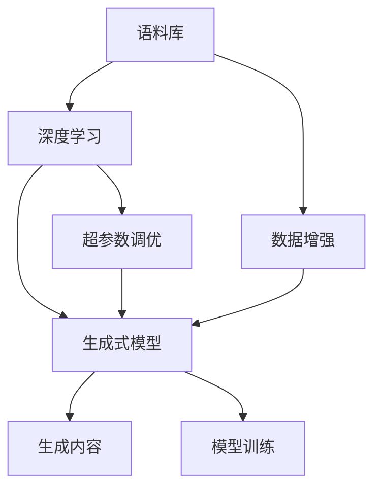

                 

# 生成式AIGC是金矿还是泡沫:AI不是万能药

## 1. 背景介绍

随着人工智能技术的快速发展，生成式人工智能(AI Generated Content, AIGC)正在成为风口。无论是新闻、文学、音乐，还是广告、视频、游戏，生成式AIGC技术的应用场景正在不断扩展。然而，就在生成式AIGC如火如荼之际，也有不少质疑声音，认为其泡沫成分过重。本文章将系统梳理生成式AIGC技术的原理与应用，探讨其未来发展趋势与挑战，帮助读者更清晰地看待这一前沿技术。

## 2. 核心概念与联系

### 2.1 核心概念概述

生成式AIGC是指通过人工智能算法生成自然语言、音乐、图像等内容的技术。与传统的基于规则的生成方式不同，生成式AIGC主要依赖于深度学习模型和大规模语料库，通过自监督、无监督或监督学习进行训练，生成高质量、逼真的人造内容。

核心概念包括：

- **生成式模型(Generative Model)**：用于生成内容的深度学习模型，如变分自编码器(VAE)、生成对抗网络(GAN)、Transformer等。
- **语料库(Corpus)**：用于训练生成式模型的文本、图像等数据集，是模型输出的主要信息源。
- **深度学习(Deep Learning)**：生成式AIGC的基础算法，通过对大量数据进行自监督学习，提取数据的隐含特征，从而生成新内容。
- **自动编码器(Autoder)、变分自编码器(VAE)、生成对抗网络(GAN)**：经典的生成式模型，用于不同场景的生成任务。
- **Transformer**：最新的生成式模型，应用于文本生成、语言建模等任务，效果好，计算资源要求高。

这些核心概念之间通过深度学习算法和生成式模型的训练与推断过程相联系，形成了一个完整的生成式AIGC技术框架。

### 2.2 核心概念原理和架构的 Mermaid 流程图



## 3. 核心算法原理 & 具体操作步骤

### 3.1 算法原理概述

生成式AIGC的核心原理是基于深度学习模型的生成任务，主要通过自监督或监督学习实现内容的生成。以Transformer模型为例，其工作原理包括：

1. **编码**：通过多头自注意力机制提取输入序列的信息特征。
2. **解码**：通过多头自注意力机制生成输出序列，并结合语言模型预测下一个token。
3. **生成**：反复迭代上述步骤，生成新的文本序列。

### 3.2 算法步骤详解

生成式AIGC的详细步骤包括：

**Step 1: 数据准备**

- 收集并预处理语料库。通常需要清洗文本数据，去除噪声，标准化符号等。

**Step 2: 模型搭建**

- 选择合适的生成模型，如Transformer，并进行初始化设置。
- 设置模型的超参数，如层数、隐藏维度、学习率等。

**Step 3: 训练过程**

- 将预处理好的数据集输入模型进行训练。
- 定义损失函数，如交叉熵损失、L1损失等。
- 使用优化器更新模型参数，最小化损失函数。

**Step 4: 内容生成**

- 训练完成后，使用模型生成新的文本、图像等内容。

**Step 5: 评估与优化**

- 对生成的内容进行评估，如BLEU分数、Inception得分等。
- 根据评估结果，调整模型参数，进行再训练或优化。

### 3.3 算法优缺点

**优点**：

- 可生成高质量内容。生成式AIGC能够生成逼真的文本、图像等内容，应用广泛。
- 自动化程度高。通过模型训练即可自动生成内容，无需人工干预。
- 应用场景多。生成式AIGC能够应用于新闻、广告、影视、游戏等多个领域。

**缺点**：

- 数据依赖性强。生成内容的质量很大程度上取决于训练数据的质量和多样性。
- 模型复杂度高。生成式AIGC模型通常较大，计算资源要求高。
- 可解释性差。生成式模型如Transformer等，通常是"黑盒"系统，难以解释其决策过程。

### 3.4 算法应用领域

生成式AIGC的应用领域广泛，包括但不限于：

- **文本生成**：如新闻摘要、诗歌、小说、博客等。
- **图像生成**：如人脸生成、艺术绘画、建筑设计等。
- **音乐生成**：如旋律创作、背景音乐生成等。
- **视频生成**：如电影、动画、虚拟主播等。
- **游戏生成**：如角色、场景、任务等。

## 4. 数学模型和公式 & 详细讲解 & 举例说明

### 4.1 数学模型构建

生成式AIGC模型的构建基于深度学习框架，如TensorFlow、PyTorch等。以Transformer模型为例，其数学模型可表示为：

$$
\begin{aligned}
    & h_t = \text{MultiHeadAttention}(Q_t, K_t, V_t) \\
    & h_t = \text{LayerNorm}(h_t + h_{t-1}) \\
    & h_t = \text{FeedForward}(h_t) \\
    & y_t = \text{Softmax}(h_t h_{t-1}^T) \cdot h_{t-1}
\end{aligned}
$$

其中，$h_t$ 表示模型在时间步 $t$ 的隐状态表示，$Q_t, K_t, V_t$ 分别表示自注意力机制的查询、键、值向量，$y_t$ 表示模型在时间步 $t$ 的输出。

### 4.2 公式推导过程

以Transformer模型为例，其生成过程的数学推导如下：

- 编码器模块：输入序列 $x_1, x_2, \ldots, x_T$，通过多头自注意力机制提取信息，生成编码器输出 $h_T$。
- 解码器模块：以编码器输出 $h_T$ 和当前输入 $x_t$ 为条件，生成下一个token $y_t$。
- 整个生成过程通过自回归方式迭代，最终生成整个序列 $y_1, y_2, \ldots, y_T$。

### 4.3 案例分析与讲解

以文本生成为例，通过训练好的Transformer模型，可以生成逼真的人类文本。例如，训练好的模型可以生成文章、诗歌、对话等内容。这些内容通过生成式模型的训练过程，学习到了语言的隐含规律和知识，从而能够按照语言模型进行预测。

## 5. 项目实践：代码实例和详细解释说明

### 5.1 开发环境搭建

- 安装Python环境，推荐使用Anaconda。
- 安装TensorFlow或PyTorch等深度学习框架。
- 下载并准备语料库。

### 5.2 源代码详细实现

以生成文本为例，可以使用以下Python代码实现：

```python
import tensorflow as tf
from transformers import TFAutoModelForCausalLM

model = TFAutoModelForCausalLM.from_pretrained('gpt2')

# 定义输入
input_ids = tf.constant([1, 2, 3], dtype=tf.int32)
attention_mask = tf.constant([0, 0, 0], dtype=tf.int32)

# 生成文本
output_ids = model.generate(input_ids, max_length=10, num_return_sequences=5, top_k=50, top_p=0.9, repetition_penalty=1.0)

# 解码输出
decoded_output = [tf.keras.utils.get_sequence_as_text(tokenizer.decode(x)) for x in output_ids]
```

### 5.3 代码解读与分析

- `TFAutoModelForCausalLM`：用于生成文本的Transformer模型，通过预训练生成语言模型。
- `generate`函数：根据输入的token，生成一定长度的文本序列。
- `top_k, top_p, repetition_penalty`：控制生成的文本多样性和连贯性，避免重复。

### 5.4 运行结果展示

运行上述代码后，可以得到一系列生成的文本序列。

## 6. 实际应用场景

### 6.1 新闻推荐

生成式AIGC技术可以用于新闻推荐系统，自动生成新闻摘要，提高推荐效率。例如，可以训练模型自动生成某篇文章的摘要，将其与用户历史行为匹配，推荐相关新闻。

### 6.2 自动写作

生成式AIGC可以用于自动写作，生成文章、博客、新闻报道等。例如，可以训练模型生成各类内容，减少人工写作工作量。

### 6.3 广告文案生成

生成式AIGC可以用于广告文案的自动生成，提高广告的覆盖率和点击率。例如，训练模型自动生成各类广告文案，个性化推送给用户。

### 6.4 未来应用展望

未来，生成式AIGC技术将在更多领域得到应用，如：

- **自动驾驶**：自动生成路标、导航指示等。
- **智能客服**：自动生成对话内容，提高客户体验。
- **医疗健康**：自动生成医疗报告、诊断说明等。
- **教育培训**：自动生成教学内容、考试试卷等。

## 7. 工具和资源推荐

### 7.1 学习资源推荐

- **TensorFlow官方文档**：详细介绍TensorFlow框架，涵盖深度学习、生成式模型等内容。
- **Transformers库文档**：Hugging Face开发的生成式模型库，提供各类模型的预训练和微调接口。
- **OpenAI GPT-3论文**：介绍GPT-3模型的原理、训练过程和生成效果。
- **Deep Learning Specialization**：Coursera上的深度学习专项课程，由Andrew Ng主讲，涵盖深度学习基础与生成式模型等内容。

### 7.2 开发工具推荐

- **Jupyter Notebook**：Python代码开发环境，支持代码调试、运行等。
- **TensorBoard**：深度学习模型训练可视化工具，支持模型监控、调试等。
- **PyTorch Lightning**：简化深度学习模型训练过程，支持自动调参、分布式训练等。

### 7.3 相关论文推荐

- **Attention is All You Need**：Transformer论文，介绍生成式模型的工作原理。
- **Generative Adversarial Nets**：生成对抗网络论文，介绍GAN模型的原理。
- **Neural Machine Translation by Jointly Learning to Align and Translate**：Transformer论文，介绍Transformer模型的应用。

## 8. 总结：未来发展趋势与挑战

### 8.1 研究成果总结

生成式AIGC技术在自然语言处理、计算机视觉、音乐生成等多个领域取得了显著进展，推动了AI技术的发展。其未来发展趋势包括：

- **多模态生成**：结合文本、图像、语音等多种信息，生成更加丰富、逼真的内容。
- **人机协同生成**：与人类协同生成内容，提升内容的真实性和多样性。
- **实时生成**：提高实时生成内容的能力，支持即时响应需求。
- **元生成**：生成式模型的生成过程自我优化，生成更加准确、合理的内容。

### 8.2 未来发展趋势

未来，生成式AIGC技术将在多个领域得到应用，推动人类社会的进步：

- **教育**：自动生成教学内容，个性化推荐学习资源。
- **医疗**：自动生成医疗报告，辅助医生诊断。
- **艺术**：自动生成艺术作品，提升艺术创作效率。
- **工业**：自动生成工业设计图纸，提高设计效率。

### 8.3 面临的挑战

生成式AIGC技术仍面临以下挑战：

- **数据质量**：生成内容的质量很大程度上取决于训练数据的质量和多样性。
- **计算资源**：生成式模型通常较大，计算资源要求高。
- **可解释性**：生成式模型如Transformer等，通常是"黑盒"系统，难以解释其决策过程。

### 8.4 研究展望

未来，需要在以下方面进行研究：

- **生成式模型的优化**：通过改进算法和模型结构，提高生成内容的质量和多样性。
- **数据的增强和扩充**：通过数据增强和扩充技术，提高模型的泛化能力和鲁棒性。
- **与人类协同生成**：结合人类的创造力和经验，提升生成内容的质量和多样性。
- **伦理和安全**：生成式模型的生成过程需要考虑伦理和安全问题，确保其生成的内容符合人类价值观和社会规范。

## 9. 附录：常见问题与解答

**Q1：生成式AIGC是否会产生版权问题？**

A: 生成式AIGC技术可以生成逼真的人类文本、音乐、图像等内容，可能会产生版权问题。需要在使用过程中，遵守相关法律法规，并尽可能标注原作者的版权信息。

**Q2：生成式AIGC是否会降低内容创作的激励？**

A: 生成式AIGC技术可以大幅提高内容创作效率，但也会对人类创作者造成一定影响。需要在使用过程中，尊重人类作者的知识产权，鼓励多样性和原创性。

**Q3：生成式AIGC是否会对文化多样性产生负面影响？**

A: 生成式AIGC技术可能会对文化多样性产生负面影响，需要在使用过程中，注意生成内容的多样性和包容性，避免单一文化的推广。

**Q4：生成式AIGC是否会加剧虚假信息传播？**

A: 生成式AIGC技术可以生成逼真的虚假信息，需要注意其传播的道德和法律问题，加强信息审查和监管。

**Q5：生成式AIGC是否会影响就业市场？**

A: 生成式AIGC技术可能会对某些低技能岗位造成影响，但也会催生新的就业机会。需要在使用过程中，注意平衡技术发展和就业市场的关系。

---

作者：禅与计算机程序设计艺术 / Zen and the Art of Computer Programming

