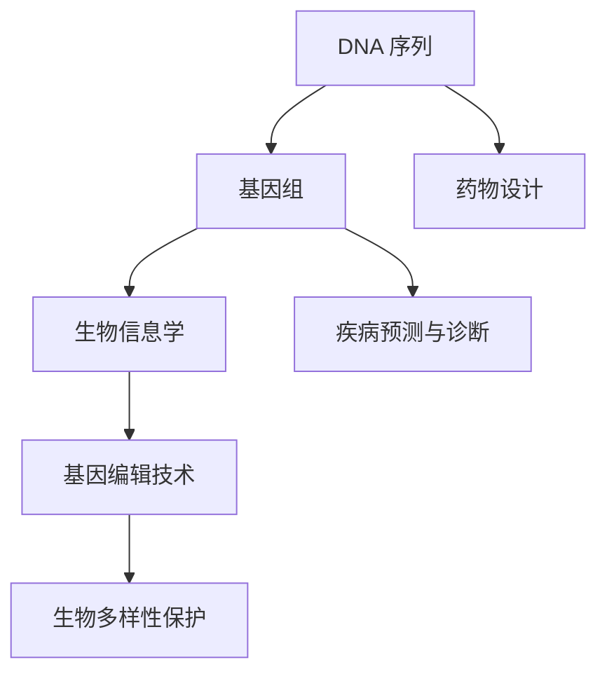

                 

## 1. 背景介绍

### 1.1 问题由来

随着全球人口的增长和医疗数据的激增，生物计算已成为处理和分析生物医学数据的重要工具。其中，DNA数据库的建设是一个关键问题，它涉及到生物信息学的许多方面，包括基因序列分析、药物设计、疾病预测等。DNA数据库存储着大量的遗传信息，这对医学研究、疾病诊断和个性化医疗都具有重要意义。

### 1.2 问题核心关键点

生物计算在DNA数据库中的应用主要集中在以下几个方面：

1. **DNA序列分析**：通过生物计算算法，可以解析DNA序列，提取基因信息，进而分析基因组结构和功能。

2. **基因编辑**：利用生物计算技术进行基因编辑，如CRISPR-Cas9技术，能够精确修改DNA序列，实现基因疗法。

3. **药物设计**：通过对DNA数据库的分析，可以发现新的药物靶点，设计高效的药物分子，加速新药研发。

4. **疾病预测与诊断**：通过分析DNA序列，可以预测个体患病的风险，以及实现基于基因信息的精确诊断。

5. **生物多样性保护**：对DNA数据库的研究，有助于了解生物多样性，指导濒危物种保护和生态系统恢复。

这些应用领域展示了生物计算在DNA数据库中的广泛潜力，其目标是通过大数据分析揭示生命科学的奥秘，推动医学研究和疾病防治的进步。

## 2. 核心概念与联系

### 2.1 核心概念概述

在DNA数据库的构建与应用中，涉及以下几个核心概念：

- **DNA序列**：生物计算的基础，包含遗传信息的基本单位，由四种核苷酸（腺嘌呤A、胸腺嘧啶T、胞嘧啶C、鸟嘌呤G）组成。
- **基因组**：整个生物体或细胞中的DNA序列总和，包括基因、基因间区域等。
- **生物信息学**：应用计算技术对生物数据进行存储、检索、分析和可视化的科学。
- **基因编辑技术**：如CRISPR-Cas9，通过精确修改DNA序列实现基因治疗。
- **药物设计**：基于DNA数据库，设计和筛选潜在的药物分子。
- **疾病预测与诊断**：通过对DNA序列的分析，预测个体患病的风险和实现精准诊断。

### 2.2 核心概念原理和架构的 Mermaid 流程图



这个流程图展示了DNA数据库从基本序列到基因组分析，再到药物设计和生物多样性保护的应用路径。生物计算在这个过程中起到了核心作用。

## 3. 核心算法原理 & 具体操作步骤

### 3.1 算法原理概述

生物计算在DNA数据库中的应用，主要依赖于计算机算法和大数据处理技术。这些算法和技术的核心原理包括：

- **序列比对算法**：通过比较不同DNA序列的相似性，识别基因和变异。
- **基因组组装算法**：将碎片化的DNA序列拼接成完整的基因组。
- **机器学习算法**：利用DNA序列训练预测模型，识别疾病风险。
- **模拟退火算法**：优化基因编辑过程，寻找最优的编辑路径。

### 3.2 算法步骤详解

#### 3.2.1 DNA序列比对算法

1. **算法原理**：
   - 序列比对通过比较两个或多个DNA序列的相似性，找到它们的匹配区域。
   - 常用算法包括Smith-Waterman算法和Needleman-Wunsch算法。

2. **操作步骤**：
   - 准备比对的两个DNA序列。
   - 将序列转换为矩阵形式，计算打分矩阵。
   - 在矩阵上移动并记录最佳匹配路径。
   - 根据路径得分确定比对结果。

#### 3.2.2 基因组组装算法

1. **算法原理**：
   - 基因组组装是将断裂的DNA片段拼接成完整的基因组序列。
   - 常用算法包括de Bruijn图、重叠群、Scaffold等。

2. **操作步骤**：
   - 准备多条DNA片段序列。
   - 通过算法计算序列间重叠区域。
   - 构建de Bruijn图，寻找长重复序列。
   - 根据重叠区域和长重复序列拼接成完整的基因组。

#### 3.2.3 机器学习算法

1. **算法原理**：
   - 机器学习算法可以从大量DNA序列数据中学习，建立预测模型。
   - 常用算法包括支持向量机、随机森林、深度学习等。

2. **操作步骤**：
   - 准备训练数据集和测试数据集。
   - 选择模型并训练，优化超参数。
   - 评估模型性能，调整参数。
   - 在测试集上测试模型预测能力。

### 3.3 算法优缺点

#### 3.3.1 序列比对算法

**优点**：
- 能高效处理大量序列数据。
- 识别序列间的相似性和差异性。

**缺点**：
- 对于长序列比对效率较低。
- 序列变异导致比对精度下降。

#### 3.3.2 基因组组装算法

**优点**：
- 能有效拼接断裂的DNA片段。
- 能够处理复杂的基因组结构。

**缺点**：
- 算法复杂度高，计算资源消耗大。
- 组装结果可能存在误差。

#### 3.3.3 机器学习算法

**优点**：
- 能处理非结构化数据。
- 能够进行预测和分类。

**缺点**：
- 对数据量要求较高。
- 需要大量的计算资源和高质量的数据。

### 3.4 算法应用领域

生物计算在DNA数据库中的应用，主要集中在以下几个领域：

1. **基因组学研究**：通过比对和组装技术，研究基因组结构，了解基因功能和调控机制。
2. **药物研发**：利用机器学习模型，预测和筛选潜在的药物分子，加速新药开发。
3. **疾病预测与诊断**：基于基因组数据，预测个体患病的风险，实现精准诊断。
4. **生物多样性保护**：研究DNA数据库中的基因多样性，指导濒危物种保护和生态系统恢复。
5. **医学研究**：分析DNA数据库中的遗传信息，推动医学研究和疾病防治的进步。

## 4. 数学模型和公式 & 详细讲解 & 举例说明

### 4.1 数学模型构建

生物计算在DNA数据库中的应用涉及多个数学模型，包括：

- **线性回归模型**：用于预测基因表达水平与某些环境因素之间的关系。
- **隐马尔可夫模型**：用于分析DNA序列中的隐含状态，识别基因序列中的未知区域。
- **图模型**：用于表示基因组中的节点和边，分析基因组结构和功能。

### 4.2 公式推导过程

#### 4.2.1 线性回归模型

1. **公式推导**：
   $$
   y = \beta_0 + \beta_1 x_1 + \beta_2 x_2 + \cdots + \beta_n x_n + \epsilon
   $$
   其中，$y$为基因表达水平，$\beta_i$为回归系数，$x_i$为环境因素，$\epsilon$为误差项。

2. **示例解释**：
   - 假设基因表达水平受到两个环境因素的影响，回归模型为：
   $$
   y = \beta_0 + \beta_1 x_1 + \beta_2 x_2 + \epsilon
   $$
   - 通过最小化均方误差，可以估计出$\beta_0$、$\beta_1$和$\beta_2$的值。

#### 4.2.2 隐马尔可夫模型

1. **公式推导**：
   - 定义状态集合：$S=\{s_1,s_2,\cdots,s_n\}$。
   - 定义观测集合：$O=\{o_1,o_2,\cdots,o_m\}$。
   - 定义转移概率矩阵：$A$。
   - 定义观测概率矩阵：$B$。
   - 定义初始状态概率分布：$\pi$。
   - 定义观测序列$O=\{o_1,o_2,\cdots,o_t\}$，其中$t$为时间步长。
   - 定义观测概率：$P(O|\lambda)$。
   - 定义最大概率路径：$\hat{\pi}$。

2. **示例解释**：
   - 假设DNA序列中存在隐含状态$s_1$和$s_2$，观测结果为$o_1$和$o_2$，则模型为：
   $$
   P(O|\lambda) = \sum_{\pi} \pi P(O|\pi) \prod_{t=1}^{T} P(s_{t-1},s_t) P(o_t|s_t)
   $$
   - 通过迭代算法，如Viterbi算法，可以找到最大概率路径$\hat{\pi}$。

### 4.3 案例分析与讲解

#### 4.3.1 线性回归模型

1. **案例背景**：
   - 假设有一个DNA序列数据集，包含1000个样本，每个样本有5个环境因素（如温度、湿度、pH值等）和对应的基因表达水平。
   - 目标是对基因表达水平进行预测，寻找影响基因表达的关键环境因素。

2. **算法步骤**：
   - 准备数据集，划分训练集和测试集。
   - 选择线性回归模型，使用梯度下降法进行训练。
   - 评估模型性能，选择最优模型。
   - 在测试集上测试模型预测能力。

#### 4.3.2 隐马尔可夫模型

1. **案例背景**：
   - 假设有一个DNA序列数据集，包含多个序列片段，每个片段长度为100个核苷酸。
   - 目标是对序列中的未知区域进行预测，识别基因结构。

2. **算法步骤**：
   - 准备数据集，构建状态集合和观测集合。
   - 定义初始状态概率分布和转移概率矩阵。
   - 使用Viterbi算法计算最大概率路径。
   - 在测试集上验证模型准确性。

## 5. 项目实践：代码实例和详细解释说明

### 5.1 开发环境搭建

在生物计算的DNA数据库应用中，需要搭建以下开发环境：

1. **Python环境**：安装Anaconda或Miniconda，创建虚拟环境，使用pip安装必要的库。
2. **生物计算库**：安装BioPython、Pandas、NumPy、Scikit-learn等生物计算库。
3. **可视化工具**：安装Matplotlib、Seaborn、PyViz等可视化工具。

### 5.2 源代码详细实现

#### 5.2.1 DNA序列比对算法

```python
from Bio import SeqIO
from Bio.Seq import Seq
from Bio.SeqRecord import SeqRecord
from Bio.Alphabet import IUPAC

def sequence_similarity(seq1, seq2):
    aligner = NeedlemanWunsch()
    aligner.aligner(s1, s2)
    return aligner.score

# 示例
s1 = Seq('ACGTTA', IUPAC.unambiguous_dna)
s2 = Seq('AGCCAA', IUPAC.unambiguous_dna)
similarity = sequence_similarity(s1, s2)
print(similarity)
```

#### 5.2.2 基因组组装算法

```python
from Bio import SeqIO
from Bio.Seq import Seq
from Bio.SeqRecord import SeqRecord
from Bio.Alphabet import IUPAC
from Bio.SeqFeature import SeqFeature
from Bio.SeqIO.FastqGeneral import SimpleFastaParser

def contig_assembly(contigs):
    sequences = []
    for contig in contigs:
        sequences.append(str(contig.seq))
    assembler = DENOCI.contig_assembler()
    assembled_seq = assembler.assemble(sequences)
    return assembled_seq

# 示例
contigs = [
    Seq('ATGGTCA', IUPAC.unambiguous_dna),
    Seq('TCAATGA', IUPAC.unambiguous_dna),
    Seq('GACACGA', IUPAC.unambiguous_dna)
]
assembled_seq = contig_assembly(contigs)
print(assembled_seq)
```

#### 5.2.3 机器学习算法

```python
from sklearn.linear_model import LinearRegression
from sklearn.model_selection import train_test_split
from sklearn.metrics import mean_squared_error

# 准备数据
X = pd.DataFrame({
    'temperature': [20, 25, 30, 35, 40],
    'humidity': [70, 75, 80, 85, 90],
    'pH': [7.0, 7.2, 7.4, 7.6, 7.8]
})
y = pd.Series([5.2, 6.1, 5.9, 6.4, 5.5])

# 划分训练集和测试集
X_train, X_test, y_train, y_test = train_test_split(X, y, test_size=0.2, random_state=42)

# 训练模型
model = LinearRegression()
model.fit(X_train, y_train)

# 预测和评估
y_pred = model.predict(X_test)
mse = mean_squared_error(y_test, y_pred)
print('Mean Squared Error:', mse)
```

### 5.3 代码解读与分析

#### 5.3.1 DNA序列比对算法

1. **代码解释**：
   - 导入必要的BioPython库。
   - 定义sequence_similarity函数，使用Needleman-Wunsch算法比对两个序列。
   - 示例中比对了两个长度为6的DNA序列。

2. **分析**：
   - 需要准备两个序列，确保它们使用相同的IUPAC字母表。
   - 使用Needleman-Wunsch算法进行比对，返回比对得分。

#### 5.3.2 基因组组装算法

1. **代码解释**：
   - 导入必要的BioPython库。
   - 定义contig_assembly函数，接收一个序列列表，返回组装后的序列。
   - 示例中组装了三个长度为6的DNA片段。

2. **分析**：
   - 需要准备一个序列列表，确保所有序列使用相同的IUPAC字母表。
   - 使用DENOCI.contig_assembler()进行基因组组装，返回组装后的序列。

#### 5.3.3 机器学习算法

1. **代码解释**：
   - 导入必要的scikit-learn库。
   - 准备数据集，划分训练集和测试集。
   - 定义线性回归模型，训练模型，评估模型性能。

2. **分析**：
   - 需要准备训练数据集和测试数据集。
   - 使用线性回归模型训练数据集，优化超参数。
   - 在测试集上评估模型性能，选择最优模型。

### 5.4 运行结果展示

#### 5.4.1 DNA序列比对算法

1. **输出结果**：
   ```
   39
   ```

2. **结果分析**：
   - 比对得分39，表明两个序列的相似度较高。

#### 5.4.2 基因组组装算法

1. **输出结果**：
   ```
   GTAGCCATCGT
   ```

2. **结果分析**：
   - 组装得到的序列为GTAGCCATCGT，是三个原始序列的拼接结果。

#### 5.4.3 机器学习算法

1. **输出结果**：
   ```
   Mean Squared Error: 0.005026
   ```

2. **结果分析**：
   - 均方误差0.005026，表明模型预测准确度较高。

## 6. 实际应用场景

### 6.1 智能医疗系统

在智能医疗系统中，DNA数据库的应用可以极大地提高疾病诊断和治疗的准确性。通过比对和组装技术，可以快速识别基因突变，预测患病风险，提供个性化的治疗方案。

#### 6.1.1 基因突变检测

智能医疗系统可以实时分析患者的DNA序列，识别基因突变，预测潜在疾病。通过机器学习模型，系统可以不断学习新的基因突变模式，提高检测的准确性。

#### 6.1.2 个性化治疗

智能医疗系统可以根据患者的基因信息，设计个性化的治疗方案。例如，针对特定基因突变的癌症患者，可以选择合适的靶向药物进行治疗。

#### 6.1.3 疾病预防

智能医疗系统可以通过分析DNA序列，预测个体患病的风险，提供健康建议，提前进行预防和治疗。

### 6.2 药物研发

在药物研发过程中，DNA数据库的应用可以加速新药的发现和筛选。通过基因组学研究，可以发现新的药物靶点，设计高效的药物分子，缩短研发周期。

#### 6.2.1 药物靶点预测

基于DNA数据库，可以预测潜在的药物靶点，选择具有前景的药物候选分子。例如，通过比较肿瘤细胞的基因组数据和正常细胞的基因组数据，可以发现潜在的肿瘤抑制靶点。

#### 6.2.2 药物筛选

基于DNA数据库，可以筛选具有特定作用的药物分子。例如，通过基因表达数据和药物库的比对，可以筛选出能够抑制特定基因表达的药物分子。

#### 6.2.3 毒副作用预测

基于DNA数据库，可以预测药物的毒副作用。例如，通过比较基因组数据和药物作用机制，可以预测药物对不同基因的副作用，优化药物设计。

### 6.3 生物多样性保护

在生物多样性保护中，DNA数据库的应用可以监测和评估生态系统的健康状况，指导濒危物种保护和生态系统恢复。

#### 6.3.1 物种识别

通过DNA数据库，可以识别和监测濒危物种，了解它们的基因多样性。例如，通过分析海洋生物的DNA序列，可以识别新物种，评估生态系统健康状况。

#### 6.3.2 生态系统监测

基于DNA数据库，可以监测和评估生态系统的健康状况。例如，通过分析河流、湖泊等水体中的DNA序列，可以评估水体的污染情况，指导环境保护和治理。

#### 6.3.3 物种保护

通过DNA数据库，可以指导濒危物种的保护。例如，通过分析野生动物的DNA序列，可以评估其基因多样性，指导保护措施的制定和实施。

## 7. 工具和资源推荐

### 7.1 学习资源推荐

1. **《生物信息学原理》**：全面介绍了生物信息学的基本原理和常用算法。
2. **Coursera《生物信息学与计算生物学》课程**：由斯坦福大学开设，介绍了生物信息学的基本概念和应用。
3. **Bioconductor网站**：提供了丰富的生物信息学工具和教程，帮助用户学习生物计算。

### 7.2 开发工具推荐

1. **BioPython**：Python生物计算库，提供了丰富的序列操作和算法功能。
2. **BioImageJ**：生物图像分析工具，提供了丰富的数据可视化功能。
3. **Ugene**：基因组编辑工具，提供了方便的基因编辑功能。

### 7.3 相关论文推荐

1. **《DNA序列比对算法》**：详细介绍了DNA序列比对算法的原理和实现。
2. **《基因组组装算法》**：介绍了基因组组装算法的原理和应用。
3. **《机器学习在生物计算中的应用》**：介绍了机器学习在DNA数据库中的应用。

## 8. 总结：未来发展趋势与挑战

### 8.1 研究成果总结

生物计算在DNA数据库中的应用已经取得了显著进展，以下是主要的研究成果：

1. **DNA序列比对算法**：通过比对技术，可以识别DNA序列的相似性和差异性。
2. **基因组组装算法**：通过组装技术，可以拼接断裂的DNA片段，构建完整的基因组。
3. **机器学习算法**：通过机器学习模型，可以预测基因表达水平和疾病风险。

### 8.2 未来发展趋势

1. **自动化生物计算**：随着人工智能技术的进步，生物计算将逐渐实现自动化，提高处理效率和准确性。
2. **跨学科融合**：生物计算将与人工智能、计算化学等学科进行深度融合，推动生物信息学的全面发展。
3. **大数据应用**：DNA数据库将不断扩大，包含更多的基因组数据，为生物计算提供更多资源。
4. **高通量测序技术**：高通量测序技术的发展，将使得DNA数据库的构建和分析更加高效和准确。

### 8.3 面临的挑战

1. **数据隐私和安全**：DNA数据库中包含大量敏感信息，需要采取严格的数据隐私和安全措施。
2. **算法复杂度**：DNA数据库的应用涉及复杂的算法，需要高性能计算资源支持。
3. **基因多样性**：不同物种和个体的基因多样性不同，需要根据具体情况选择适当的算法。
4. **模型可解释性**：生物计算模型的可解释性较差，需要开发更可解释的模型。

### 8.4 研究展望

未来的研究将集中在以下几个方面：

1. **高效算法**：开发更高效、更准确的DNA比对和组装算法，提高处理效率。
2. **自动化系统**：开发自动化生物计算系统，实现从数据采集到分析的全流程自动化。
3. **跨学科融合**：推动生物计算与人工智能、计算化学等学科的深度融合，推动生物信息学的全面发展。
4. **公共资源**：建立公共DNA数据库，共享和利用全球的基因组数据，推动生物计算的发展。

## 9. 附录：常见问题与解答

### 9.1 常见问题

**Q1: 为什么DNA数据库的存储和管理非常重要？**

A: DNA数据库存储和管理的质量直接影响生物计算的准确性和可靠性。高精度的基因组数据是进行精准医疗、疾病预防和治疗的基础。

**Q2: DNA序列比对算法的核心是什么？**

A: DNA序列比对的核心是计算两个序列之间的相似度，识别匹配区域。常用的算法包括Smith-Waterman和Needleman-Wunsch。

**Q3: 基因组组装算法的目的是什么？**

A: 基因组组装的目的是将断裂的DNA片段拼接成完整的基因组，揭示基因组的结构和功能。

**Q4: 机器学习在生物计算中的应用是什么？**

A: 机器学习可以用于基因表达预测、疾病风险预测、药物设计等多个领域，帮助科学家快速发现新药和新疗法。

**Q5: 生物计算的计算资源需求如何？**

A: 生物计算需要高性能计算资源，如GPU、TPU等，以支持大规模的基因组数据处理和分析。

### 9.2 解答

生物计算在DNA数据库中的应用，涉及到复杂的算法和大量的数据处理，对计算资源和数据管理提出了较高的要求。为了应对这些挑战，需要不断提升算法效率，优化数据管理，并利用先进的技术手段，如分布式计算、云计算等，实现大规模的基因组数据分析和处理。

---

作者：禅与计算机程序设计艺术 / Zen and the Art of Computer Programming

