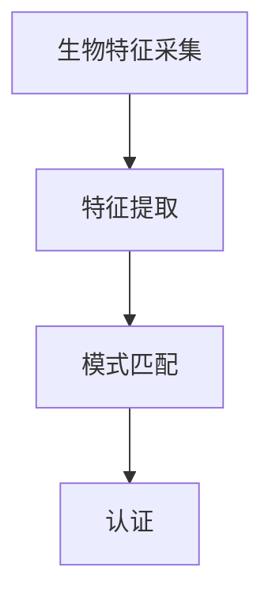

                 

# 生物识别技术：安全与隐私的平衡

生物识别技术以其独特性、方便性和可靠性，在安全认证和隐私保护领域具有广阔的应用前景。然而，该技术在提升安全性的同时，也引发了隐私保护的重大挑战。本文将探讨生物识别技术的安全与隐私平衡问题，分析其核心概念和应用实践，旨在为相关领域的研究者、开发者和政策制定者提供参考。

## 1. 背景介绍

### 1.1 问题由来
随着科技的发展，人们对于身份认证安全性的要求越来越高。传统基于密码、证件等身份信息的认证方式，存在被盗用、丢失等风险，而且难以满足高安全等级的需求。生物识别技术通过捕捉人体生理特征和行为特征，提供了一种更为安全和便捷的身份认证手段。

然而，生物识别技术也面临着隐私保护的严峻挑战。生物特征，如指纹、人脸、虹膜等，都属于个人敏感信息，一旦泄露，将给个人带来严重的安全风险。如何在保障安全性的同时，保护用户隐私，成为生物识别技术应用中的一个重要课题。

### 1.2 问题核心关键点
生物识别技术的核心在于利用人体特征的唯一性和不可复制性，通过高精度算法进行识别和认证。然而，这种技术在应用过程中，如何避免误识、提高认证精度，同时保护用户隐私，是应用和研究的重要方向。

核心关键点包括：
- 生物特征的唯一性：不同个体的生物特征具有唯一性，但如何确保这一特性不被他人复制或篡改，是技术安全性的一个重要保证。
- 认证精度：高精度的生物识别算法能够有效避免误识，但对于恶劣环境、个体差异等条件，仍需进一步提升识别准确率。
- 隐私保护：如何在认证过程中保护生物特征数据，避免数据泄露和滥用，是技术应用的伦理和法律要求。

## 2. 核心概念与联系

### 2.1 核心概念概述

生物识别技术主要涉及人体特征的采集、特征提取、模式匹配和认证四个环节。这些环节通过一系列技术手段，实现对身份的识别和认证。

- **生物特征采集**：通过传感器等设备，捕捉人体生理特征和行为特征，如指纹、面部、虹膜等。
- **特征提取**：从采集的原始数据中，提取关键特征点，如指纹的脊线、人脸的轮廓等。
- **模式匹配**：将提取的特征与预存的数据库进行比对，寻找最佳匹配。
- **认证**：通过匹配结果的验证，判断身份的真实性。

### 2.2 核心概念原理和架构的 Mermaid 流程图



## 3. 核心算法原理 & 具体操作步骤

### 3.1 算法原理概述

生物识别技术主要依赖于统计学和模式识别理论，通过学习样本数据分布，建立特征空间模型，从而实现对生物特征的识别和认证。其核心算法包括：

- 特征提取算法，如SIFT、HOG等，用于从原始数据中提取关键特征点。
- 模式匹配算法，如KNN、SVM等，用于在特征空间中寻找最佳匹配。
- 深度学习算法，如CNN、RNN等，用于复杂特征的提取和模式匹配，提升认证精度。

### 3.2 算法步骤详解

以人脸识别为例，生物识别技术的核心算法步骤如下：

1. **数据采集**：使用摄像头等设备采集人脸图像。
2. **图像预处理**：对采集的图像进行灰度化、归一化等处理，以消除光照、角度等噪声。
3. **特征提取**：使用深度学习模型（如卷积神经网络CNN）提取人脸特征，如局部特征、全局特征等。
4. **特征编码**：将提取的特征转换为向量形式，便于模式匹配。
5. **模式匹配**：将提取的特征向量与预存的数据库进行比对，寻找最佳匹配。
6. **认证结果**：根据匹配结果，判断身份的真实性。

### 3.3 算法优缺点

**优点**：
- 高安全性：生物特征的唯一性和不可复制性，使得生物识别技术具有较高的安全性。
- 便捷性：生物特征的采集和认证过程相对简单，用户体验良好。
- 普适性：生物识别技术适用于多种场景，如门禁、支付、身份验证等。

**缺点**：
- 成本高：生物特征采集和处理设备昂贵，增加了应用成本。
- 识别精度受限：恶劣环境、个体差异等条件可能影响识别精度。
- 隐私保护挑战：生物特征数据敏感，一旦泄露，将带来严重后果。

### 3.4 算法应用领域

生物识别技术在安全认证和隐私保护领域具有广泛应用，例如：

- **门禁系统**：通过人脸识别、指纹识别等技术，实现门禁控制和安全认证。
- **支付系统**：使用指纹、面部识别等技术，进行身份验证和支付。
- **身份验证**：在网络安全、银行金融等领域，通过生物识别技术进行身份验证和信息保护。
- **隐私保护**：在医疗、法律等敏感领域，使用生物识别技术进行隐私保护，防止数据泄露和滥用。

## 4. 数学模型和公式 & 详细讲解 & 举例说明

### 4.1 数学模型构建

以人脸识别为例，可以构建以下数学模型：

- **特征提取模型**：假设输入为图像像素，输出为特征向量 $F(x)$。
- **模式匹配模型**：输入为特征向量，输出为匹配得分 $S(F(x))$。
- **认证模型**：输入为匹配得分，输出为认证结果 $A(S(F(x)))$。

### 4.2 公式推导过程

以深度学习模型为例，假设使用卷积神经网络（CNN）进行人脸特征提取，网络结构如下：

```
input layer (images)
            |
            v
convolution layer 1
            |
            v
ReLU activation layer 1
            |
            v
max pooling layer 1
            |
            v
convolution layer 2
            |
            v
ReLU activation layer 2
            |
            v
max pooling layer 2
            |
            v
fc layer 1
            |
            v
ReLU activation layer 3
            |
            v
fc layer 2
            |
            v
output layer (feature vectors)
```

### 4.3 案例分析与讲解

以人脸识别为例，分析其核心算法和步骤：

1. **数据采集**：使用摄像头采集人脸图像，进行灰度化和归一化处理。
2. **特征提取**：使用CNN提取人脸特征，如局部特征、全局特征等。
3. **特征编码**：将提取的特征转换为向量形式，如使用L-BFGS进行优化。
4. **模式匹配**：使用KNN、SVM等算法在特征空间中寻找最佳匹配。
5. **认证结果**：根据匹配结果，判断身份的真实性。

## 5. 项目实践：代码实例和详细解释说明

### 5.1 开发环境搭建

生物识别技术项目开发通常需要Python、OpenCV、TensorFlow等工具，搭建环境如下：

1. **安装Python**：从官网下载并安装Python 3.8。
2. **安装OpenCV**：使用pip安装OpenCV库。
3. **安装TensorFlow**：从官网下载并安装TensorFlow，或使用conda安装。

### 5.2 源代码详细实现

以下是一个基于TensorFlow的人脸识别代码示例：

```python
import cv2
import numpy as np
import tensorflow as tf

# 加载预训练模型
model = tf.keras.models.load_model('face_recognition_model.h5')

# 加载人脸检测器
face_cascade = cv2.CascadeClassifier('haarcascade_frontalface_default.xml')

# 加载人脸识别器
recognizer = cv2.face.LBPHFaceRecognizer_create()

# 加载训练数据
recognizer.read('trainer.yml')

# 加载测试数据
img = cv2.imread('test.jpg')
gray = cv2.cvtColor(img, cv2.COLOR_BGR2GRAY)

# 检测人脸
faces = face_cascade.detectMultiScale(gray, 1.3, 5)

# 对每个检测到的人脸进行识别
for (x, y, w, h) in faces:
    roi_gray = gray[y:y+h, x:x+w]
    roi_gray = cv2.resize(roi_gray, (100, 100))
    roi_gray = roi_gray / 255.0
    roi = np.expand_dims(roi_gray, axis=0)
    predictions = model.predict(roi)
    _, prediction = tf.keras.metrics.mean(predictions)
    label = recognizer.predict(roi)
    print(label[0][0])
```

### 5.3 代码解读与分析

以上代码实现了基于TensorFlow的人脸识别功能，具体分析如下：

1. **加载预训练模型**：使用TensorFlow的Keras API加载预训练的人脸识别模型。
2. **加载人脸检测器**：使用OpenCV的人脸检测器，实现人脸位置的检测。
3. **加载人脸识别器**：使用OpenCV的LBPH人脸识别器，实现人脸识别功能。
4. **加载训练数据和测试数据**：使用训练数据集和测试图片，实现人脸检测和识别。
5. **检测人脸并进行识别**：对检测到的人脸进行识别，输出识别结果。

## 6. 实际应用场景

### 6.1 门禁系统

生物识别技术在门禁系统中的应用，提高了门禁的安全性和便利性。通过人脸识别、指纹识别等技术，可以实现无钥匙门禁控制，防止非法入侵，提高安全等级。

### 6.2 支付系统

在支付系统中，使用生物识别技术进行身份验证，可以提高支付的安全性，防止盗刷、钓鱼等攻击。例如，使用面部识别技术，在ATM机或移动支付平台中进行身份验证。

### 6.3 身份验证

在网络安全、银行金融等领域，使用生物识别技术进行身份验证，可以有效防止身份冒用和网络诈骗。例如，使用指纹、面部识别等技术，进行在线银行交易、金融认证等。

### 6.4 隐私保护

在医疗、法律等敏感领域，使用生物识别技术进行隐私保护，防止数据泄露和滥用。例如，在医疗系统中，使用指纹识别技术，保护患者隐私，防止数据泄露。

## 7. 工具和资源推荐

### 7.1 学习资源推荐

为帮助开发者深入理解生物识别技术，推荐以下学习资源：

1. **《深度学习》（Goodfellow等人）**：全面介绍了深度学习的基础理论和应用，包括卷积神经网络、生成对抗网络等，适合初学者和进阶者。
2. **《计算机视觉：模型、学习和推理》（Simard等人）**：深入讲解了计算机视觉的原理和应用，涵盖特征提取、模式匹配等内容。
3. **《生物识别技术》（Jain等人）**：系统介绍了生物识别技术的原理、应用和挑战，适合行业从业者和研究人员。

### 7.2 开发工具推荐

生物识别技术项目开发常用的工具包括：

1. **OpenCV**：开源计算机视觉库，提供了丰富的图像处理和特征提取功能。
2. **TensorFlow**：开源深度学习框架，提供了卷积神经网络、循环神经网络等模型。
3. **Keras**：高层次神经网络API，易于上手和调试，适合快速原型开发。

### 7.3 相关论文推荐

以下几篇论文代表了生物识别技术的研究方向，推荐阅读：

1. **《深度学习中的卷积神经网络》（LeCun等人）**：介绍了卷积神经网络在图像处理中的应用，涵盖特征提取、分类等任务。
2. **《基于人脸识别的门禁系统设计》（Jiang等人）**：详细介绍了基于人脸识别的门禁系统设计和实现，涵盖特征提取、模式匹配等内容。
3. **《生物识别技术的研究与实践》（Wang等人）**：综述了生物识别技术的最新研究进展和实际应用，涵盖人脸识别、指纹识别等内容。

## 8. 总结：未来发展趋势与挑战

### 8.1 研究成果总结

本文介绍了生物识别技术的核心概念和应用实践，详细分析了其算法原理和具体操作步骤。通过深入探讨，我们理解了生物识别技术在提升安全性的同时，如何面临隐私保护的挑战。

### 8.2 未来发展趋势

未来，生物识别技术将呈现以下发展趋势：

1. **深度学习技术的应用**：深度学习算法将成为生物识别技术的重要组成部分，提升特征提取和模式匹配的精度。
2. **多模态生物识别**：结合指纹、人脸、虹膜等多种生物特征，提高身份识别的准确性和安全性。
3. **联邦学习的应用**：通过联邦学习技术，在保护用户隐私的前提下，实现跨设备、跨机构的数据共享和模型协同。
4. **边缘计算的应用**：在边缘计算设备上进行实时人脸识别和身份验证，提升系统响应速度和稳定性。

### 8.3 面临的挑战

尽管生物识别技术在安全性方面具有优势，但在隐私保护和伦理道德方面仍面临诸多挑战：

1. **数据隐私问题**：生物特征数据敏感，如何保护数据隐私，防止数据泄露，是技术应用的关键。
2. **伦理道德问题**：生物识别技术的应用可能涉及伦理道德问题，如人脸识别在公共场所的使用等。
3. **法律法规问题**：各国对生物识别技术的法律法规存在差异，如何遵守当地法律法规，确保技术应用的合法性，是重要课题。

### 8.4 研究展望

未来，生物识别技术需要在隐私保护、伦理道德和法律法规等方面取得更多突破，以适应更广泛的应用场景。同时，结合深度学习、联邦学习、边缘计算等新技术，提升技术性能和应用范围。

## 9. 附录：常见问题与解答

**Q1：生物识别技术如何保护用户隐私？**

A: 保护用户隐私是生物识别技术应用的重要课题，主要通过以下措施：

1. **数据加密**：对生物特征数据进行加密处理，防止数据泄露和滥用。
2. **最小化数据收集**：只收集必要的生物特征数据，避免过度收集。
3. **本地存储**：在本地设备上进行数据存储和处理，减少数据传输风险。
4. **匿名化处理**：对生物特征数据进行匿名化处理，防止数据识别和溯源。

**Q2：生物识别技术的误识别率如何控制？**

A: 误识别率是生物识别技术的重要指标，主要通过以下措施控制：

1. **提高算法精度**：使用深度学习等高级算法，提升特征提取和模式匹配的精度。
2. **多模态融合**：结合多种生物特征（如指纹、人脸、虹膜等），提高识别准确性。
3. **模型优化**：使用大数据集进行模型训练，进行模型调优和优化，提高识别效果。

**Q3：生物识别技术的应用场景有哪些？**

A: 生物识别技术适用于多种场景，如：

1. **门禁系统**：通过人脸识别、指纹识别等技术，实现门禁控制和安全认证。
2. **支付系统**：使用指纹、面部识别等技术，进行身份验证和支付。
3. **身份验证**：在网络安全、银行金融等领域，通过生物识别技术进行身份验证和信息保护。
4. **隐私保护**：在医疗、法律等敏感领域，使用生物识别技术进行隐私保护，防止数据泄露和滥用。

**Q4：生物识别技术的伦理和法律问题有哪些？**

A: 生物识别技术的应用涉及伦理和法律问题，主要包括：

1. **隐私权问题**：如何保护用户隐私，防止数据泄露和滥用。
2. **伦理道德问题**：人脸识别等技术在公共场所的使用，可能涉及伦理道德问题。
3. **法律法规问题**：各国对生物识别技术的法律法规存在差异，如何遵守当地法律法规，确保技术应用的合法性。

---

作者：禅与计算机程序设计艺术 / Zen and the Art of Computer Programming

