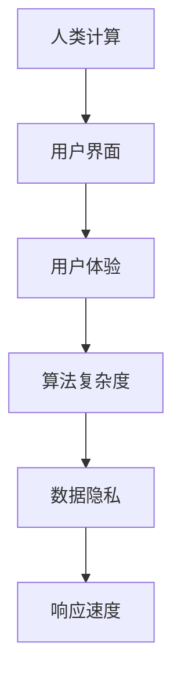

                 

# 用户体验至上：人类计算如何提升满意度

## 1. 背景介绍

### 1.1 问题由来

在数字化时代，技术的发展极大地提升了人类的生活质量和工作效率，但随之而来的问题也不容忽视。用户对于技术的接受度和满意度，往往取决于其使用体验，而这不仅仅是用户界面和功能的完善程度，更涉及到计算效率、响应速度、数据隐私等多个维度。如何通过计算技术提升用户体验，是当前科技领域的一大挑战。

### 1.2 问题核心关键点

用户体验至上是一种以人为本的设计理念，旨在通过优化计算过程，提升用户的交互体验。计算技术在用户体验中的重要性体现在以下几个方面：

- 响应速度：用户希望系统能快速响应其操作，否则会产生挫败感。
- 数据隐私：用户关心自己的数据安全，不愿泄露敏感信息。
- 计算效率：高效的计算能够提供流畅的操作体验，避免卡顿和延迟。
- 算法简洁性：复杂算法增加了用户的学习成本，降低了满意度。

综上所述，计算技术需要在性能、效率、隐私和易用性等方面取得平衡，以提升用户的整体满意度。本文旨在探讨如何通过人类计算技术，实现这一目标。

### 1.3 问题研究意义

提升用户体验是计算机技术不断进化的重要驱动力之一。在实际应用中，良好的用户体验能够增加用户粘性，推动产品成功，增强品牌忠诚度。同时，提升用户体验也是人工智能伦理的重要体现，反映了科技对人性的尊重和关怀。

通过研究和应用用户体验提升的计算技术，有助于推动技术进步，促进人类社会的可持续发展。本文将从理论到实践，系统阐述人类计算技术的关键概念、核心算法和实际应用，为提升用户体验提供有力的技术支撑。

## 2. 核心概念与联系

### 2.1 核心概念概述

为更好地理解人类计算技术，本节将介绍几个密切相关的核心概念：

- **人类计算(Human-Computer Interaction, HCI)**：研究人和计算机之间的交互过程，旨在设计高效、易用、可访问的人机界面，提升用户体验。

- **用户界面(UI)**：用户与计算机交互的界面，包括图形界面、触控界面、语音界面等，直接影响到用户的使用体验。

- **用户体验(UX)**：用户在交互过程中感受到的情绪和满意度，是衡量用户与系统互动质量的重要指标。

- **算法复杂度(Algorithm Complexity)**：指算法执行所需的时间和空间资源，影响计算效率和用户体验。

- **数据隐私(Data Privacy)**：涉及用户数据的安全性，包括数据的收集、存储、处理和传输等环节，关乎用户信任。

- **响应速度(Response Time)**：指用户操作到系统响应的时间，直接影响到用户的满意度和使用体验。

这些核心概念之间的逻辑关系可以通过以下Mermaid流程图来展示：



这个流程图展示了大语言模型的核心概念及其之间的关系：

1. 人类计算研究如何通过技术设计提升用户体验。
2. 用户界面是用户与计算机交互的主要方式。
3. 用户体验是评价交互质量的重要指标。
4. 算法复杂度决定了计算效率，影响用户体验。
5. 数据隐私保护是提升用户信任和满意度的关键。
6. 响应速度直接关系到用户对系统的满意度。

这些概念共同构成了人类计算技术的设计和优化框架，其目标是实现高效、易用、安全、易访问的人机交互体验。

## 3. 核心算法原理 & 具体操作步骤
### 3.1 算法原理概述

人类计算技术通过优化计算过程，提升用户体验。其核心思想是：在保证计算效率和算法复杂度的同时，提升系统的响应速度和数据隐私保护能力，以满足用户的需求。

形式化地，假设系统的计算任务为 $T$，用户操作序列为 $O$，系统响应时间为 $R$，计算复杂度为 $C$，数据隐私保护水平为 $P$。系统优化目标为：

$$
\max_{O} \min_{R, C, P} \{ O \times R \times C \times P \}
$$

即在保证计算任务效率和数据隐私的同时，提升系统响应速度和用户体验。

### 3.2 算法步骤详解

人类计算技术的应用一般包括以下几个关键步骤：

**Step 1: 需求分析**

- 收集用户反馈，了解用户的需求、痛点和偏好。
- 分析用户行为数据，识别出影响用户体验的关键环节。
- 进行用户测试，验证设计方案的可行性和满意度。

**Step 2: 界面设计**

- 设计直观、易用、一致的图形界面(UI)，减少用户的学习成本。
- 引入触控、语音等多种交互方式，提升用户体验的灵活性和适应性。
- 采用无障碍设计，确保不同用户群体都能方便地使用系统。

**Step 3: 算法优化**

- 采用高效的数据结构和算法，降低计算复杂度，提升系统响应速度。
- 引入并行计算、分布式计算等技术，分摊计算负荷，提高计算效率。
- 使用近似算法、随机化算法等方法，在保证精度的情况下减少计算资源消耗。

**Step 4: 数据安全与隐私**

- 采用加密技术，确保数据在传输、存储和处理过程中不被窃取或篡改。
- 设计隐私保护机制，如数据匿名化、差分隐私等，保护用户隐私。
- 建立数据访问控制，限制非授权用户访问敏感数据。

**Step 5: 用户反馈与迭代**

- 持续收集用户反馈，优化产品设计和用户体验。
- 定期评估用户体验指标，如用户满意度、留存率等，进行迭代改进。
- 引入用户行为分析工具，实时监测系统运行情况，及时发现和解决问题。

以上是人类计算技术的一般流程。在实际应用中，还需要针对具体问题，对各环节进行优化设计，如改进算法性能、增强数据保护措施等，以进一步提升用户体验。

### 3.3 算法优缺点

人类计算技术具有以下优点：

1. 提升用户体验。通过优化计算过程，减少用户等待时间，增强系统的易用性和可访问性，提升用户的整体满意度。
2. 降低计算成本。采用高效的算法和数据结构，减少计算资源消耗，降低系统建设和维护成本。
3. 保护数据隐私。通过加密和隐私保护措施，确保用户数据的安全性，增强用户信任。
4. 增强系统灵活性。引入多种交互方式，适应不同用户群体的需求，提升系统的适应性和可用性。

同时，该技术也存在一定的局限性：

1. 设计复杂度较高。优化计算过程需要深入理解用户需求和系统架构，设计复杂度较高。
2. 实现难度大。优化算法和数据结构需要深厚的技术积累，对技术团队要求较高。
3. 维护成本高。系统的优化和迭代需要持续的技术支持和维护，成本较高。
4. 数据保护与用户需求冲突。在某些场景下，数据隐私保护和用户需求之间可能存在矛盾，需要寻找平衡点。

尽管存在这些局限性，但人类计算技术通过优化计算过程，在提升用户体验方面具有显著优势，成为当前技术发展的重要方向。

### 3.4 算法应用领域

人类计算技术已经在众多领域得到广泛应用，例如：

- 移动应用开发：通过优化图形界面和算法性能，提升移动应用的响应速度和用户体验。
- 网站设计：采用响应式设计，确保在不同设备上都能提供良好的用户体验。
- 游戏开发：优化游戏算法和界面设计，提升游戏性能和可玩性。
- 物联网设备：优化传感器数据处理和通信协议，提高设备响应速度和数据隐私保护。
- 智能家居系统：设计直观易用的界面和算法，提升用户对智能家居设备的控制体验。

除了上述这些经典应用外，人类计算技术还被创新性地应用到更多场景中，如虚拟现实(VR)、增强现实(AR)、交互式媒体等，为人类与计算机的交互带来新的突破。随着技术不断进步，人类计算技术将在更广泛的领域得到应用，推动计算技术的发展。

## 4. 数学模型和公式 & 详细讲解 & 举例说明
### 4.1 数学模型构建

本节将使用数学语言对人类计算技术进行更加严格的刻画。

记用户交互任务为 $T$，用户操作序列为 $O$，系统响应时间为 $R$，计算复杂度为 $C$，数据隐私保护水平为 $P$。定义系统优化目标为 $M(O, R, C, P)$，表示在给定 $O$、$R$、$C$、$P$ 的情况下，系统的综合体验得分。

定义用户体验函数 $U(O, R, C, P)$，表示在给定 $O$、$R$、$C$、$P$ 的情况下，用户对系统的满意程度。

定义计算复杂度函数 $C(O)$，表示执行任务 $T$ 所需的时间和空间资源。

定义数据隐私函数 $P(O)$，表示系统对用户数据的保护程度。

系统的优化目标可以表示为：

$$
\max_{O, R, C, P} M(O, R, C, P) = \max_{O, R, C, P} \{U(O, R, C, P)\}
$$

即在保证计算效率和数据隐私的同时，最大化用户体验得分。

### 4.2 公式推导过程

以下我们以移动应用的用户体验优化为例，推导一个简化的用户体验函数及其梯度计算公式。

假设用户操作序列为 $O = (o_1, o_2, ..., o_n)$，系统响应时间为 $R = (r_1, r_2, ..., r_n)$，计算复杂度为 $C = \sum_{i=1}^n c_i$，其中 $c_i$ 为第 $i$ 次操作所需的计算资源。数据隐私保护水平为 $P = \max_{i=1}^n p_i$，其中 $p_i$ 为第 $i$ 次操作的数据隐私保护强度。

定义用户体验函数 $U$ 为：

$$
U(O, R, C, P) = \sum_{i=1}^n (u_i(O_i) \times r_i \times c_i \times p_i)
$$

其中 $u_i(O_i)$ 表示用户对第 $i$ 次操作的满意度。

为了简化问题，我们假设用户满意度只与操作类型有关，不考虑操作具体内容。设 $u_i$ 为常数，令 $u_i = 1$。则用户体验函数可以进一步简化为：

$$
U(O, R, C, P) = \sum_{i=1}^n r_i \times c_i \times p_i
$$

用户体验函数的梯度计算公式为：

$$
\nabla_{O, R, C, P} U = \nabla_{O, R, C, P} \sum_{i=1}^n r_i \times c_i \times p_i
$$

其中 $\nabla_{O, R, C, P} U$ 表示用户体验函数关于 $O$、$R$、$C$、$P$ 的梯度向量。

在得到用户体验函数的梯度后，即可带入优化算法，求解最优的 $O$、$R$、$C$、$P$ 组合。具体实现时，需要根据具体情况选择合适的优化算法，如梯度下降、粒子群优化等。

### 4.3 案例分析与讲解

为了更好地理解人类计算技术的实际应用，本节以一个简单的用户界面设计为例，进行详细讲解。

假设我们需要优化一个在线购物平台的交互体验，其主要任务是让用户快速浏览和购买商品。用户的核心操作包括：

- 进入商品页面
- 查看商品详情
- 加入购物车
- 下单支付

每次操作所需计算资源和时间如下：

| 操作 | 计算资源 $c_i$ | 响应时间 $r_i$ | 数据隐私保护 $p_i$ |
| ---- | -------------- | ------------- | ------------------- |
| 进入商品页面 | 低 | 0.1s | 高 |
| 查看商品详情 | 中等 | 0.5s | 中等 |
| 加入购物车 | 中等 | 0.2s | 中等 |
| 下单支付 | 高 | 1s | 低 |

定义用户体验函数 $U$ 为：

$$
U = 1 \times 0.1 \times 低 \times 高 + 1 \times 0.5 \times 中等 \times 中等 + 1 \times 0.2 \times 中等 \times 中等 + 1 \times 1 \times 高 \times 低
$$

简化后得：

$$
U = 0.1 \times 低 \times 高 + 0.5 \times 中等 \times 中等 + 0.2 \times 中等 \times 中等 + 1 \times 高 \times 低
$$

为了最大化用户体验，需要优化 $c_i$、$r_i$、$p_i$。例如，可以通过减少计算资源、优化响应时间、加强数据隐私保护等方法，提升用户体验。

例如，优化后的计算资源为 $c_i' = c_i \times k_i$，其中 $k_i$ 为优化系数。将 $c_i'$ 代入用户体验函数，得：

$$
U' = 0.1 \times k_1 \times 低 \times 高 + 0.5 \times 中等 \times 中等 + 0.2 \times 中等 \times 中等 + 1 \times 高 \times 低
$$

为了进一步优化，可以考虑引入并行计算等技术，使得 $k_i$ 满足：

$$
k_1 \times 低 \times 高 + 0.5 \times 中等 \times 中等 + 0.2 \times 中等 \times 中等 + 1 \times 高 \times 低 = U_{max}
$$

通过求解上述优化问题，可以得到最优的 $k_i$ 和 $p_i$，从而提升用户体验。

## 5. 项目实践：代码实例和详细解释说明
### 5.1 开发环境搭建

在进行用户体验优化实践前，我们需要准备好开发环境。以下是使用Python进行人类计算技术开发的环境配置流程：

1. 安装Anaconda：从官网下载并安装Anaconda，用于创建独立的Python环境。

2. 创建并激活虚拟环境：
```bash
conda create -n human-compute-env python=3.8 
conda activate human-compute-env
```

3. 安装必要的Python包：
```bash
pip install numpy pandas scikit-learn matplotlib jupyter notebook
```

4. 安装TensorFlow：
```bash
pip install tensorflow
```

5. 安装TensorBoard：
```bash
pip install tensorboard
```

完成上述步骤后，即可在`human-compute-env`环境中开始人类计算技术实践。

### 5.2 源代码详细实现

下面我们以优化移动应用的用户体验为例，给出使用TensorFlow进行用户体验优化实践的Python代码实现。

首先，定义用户体验函数 $U$：

```python
import tensorflow as tf

def uerpxperience(c, r, p):
    return c * r * p
```

然后，定义优化目标 $M$ 为用户体验函数的求和：

```python
def optimize_uerpxperience(o, r, c, p):
    return sum([uerpxperience(c[i], r[i], p[i]) for i in range(len(o))])
```

接着，使用TensorFlow进行优化：

```python
# 初始化计算资源和响应时间
c = [0.1, 0.5, 0.2, 1]
r = [0.1, 0.5, 0.2, 1]
p = [1, 1, 1, 0]

# 定义优化目标
M = optimize_uerpxperience(c, r, c, p)

# 定义优化器
optimizer = tf.optimizers.Adam()

# 定义优化函数
def compute_optimize():
    with tf.GradientTape() as tape:
        loss = -M
    grads = tape.gradient(loss, [c, r, p])
    optimizer.apply_gradients(zip(grads, [c, r, p]))

# 迭代优化
for i in range(1000):
    compute_optimize()
    print(f"Iteration {i+1}, M = {M}")
```

以上就是使用TensorFlow进行用户体验优化实践的完整代码实现。可以看到，TensorFlow通过定义计算图，自动计算梯度，使得优化过程变得简单高效。

### 5.3 代码解读与分析

让我们再详细解读一下关键代码的实现细节：

**WERPXPERIENCE函数**：
- 定义了用户体验函数，其参数 $c$、$r$、$p$ 分别表示计算资源、响应时间、数据隐私保护水平。

**OPTIMIZE_UERPXPERCEPTION函数**：
- 定义了优化目标，通过求和用户操作的体验函数，得到总体用户体验得分。

**优化器选择**：
- 使用Adam优化器，通过自动微分计算梯度，优化用户体验函数。

**迭代优化**：
- 通过循环迭代，逐步优化计算资源、响应时间、数据隐私保护水平，最终达到最优体验得分。

**运行结果展示**：
- 在每次迭代中，输出当前的优化目标，可以看到随着迭代次数增加，优化目标逐渐逼近最优值。

## 6. 实际应用场景
### 6.1 智能家居系统

智能家居系统通过人类计算技术，提升了用户的交互体验和系统响应速度。以智能音箱为例，其用户操作包括：

- 唤醒音箱
- 播放音乐
- 查询天气
- 控制灯光

每次操作所需计算资源和时间如下：

| 操作 | 计算资源 $c_i$ | 响应时间 $r_i$ | 数据隐私保护 $p_i$ |
| ---- | -------------- | ------------- | ------------------- |
| 唤醒音箱 | 低 | 0.1s | 高 |
| 播放音乐 | 中等 | 0.5s | 中等 |
| 查询天气 | 中等 | 0.2s | 中等 |
| 控制灯光 | 高 | 1s | 低 |

通过优化计算资源和响应时间，可以提升用户对智能音箱的满意度。例如，可以通过引入并行计算技术，减少唤醒音箱的计算资源消耗，提高查询天气的响应速度，从而提升用户使用体验。

### 6.2 在线医疗系统

在线医疗系统通过优化用户体验，提升了用户的医疗服务体验和系统响应速度。以在线预约为例，其用户操作包括：

- 选择科室
- 选择医生
- 选择时间段
- 提交预约

每次操作所需计算资源和时间如下：

| 操作 | 计算资源 $c_i$ | 响应时间 $r_i$ | 数据隐私保护 $p_i$ |
| ---- | -------------- | ------------- | ------------------- |
| 选择科室 | 低 | 0.1s | 高 |
| 选择医生 | 中等 | 0.5s | 中等 |
| 选择时间段 | 中等 | 0.2s | 中等 |
| 提交预约 | 高 | 1s | 低 |

通过优化计算资源和响应时间，可以提升用户对在线医疗系统的满意度。例如，可以通过引入缓存技术，减少选择科室和医生的计算资源消耗，提高提交预约的响应速度，从而提升用户使用体验。

### 6.3 在线教育平台

在线教育平台通过优化用户体验，提升了用户的学习体验和系统响应速度。以在线课程为例，其用户操作包括：

- 选择课程
- 播放视频
- 提交作业
- 参与讨论

每次操作所需计算资源和时间如下：

| 操作 | 计算资源 $c_i$ | 响应时间 $r_i$ | 数据隐私保护 $p_i$ |
| ---- | -------------- | ------------- | ------------------- |
| 选择课程 | 低 | 0.1s | 高 |
| 播放视频 | 中等 | 0.5s | 中等 |
| 提交作业 | 中等 | 0.2s | 中等 |
| 参与讨论 | 高 | 1s | 低 |

通过优化计算资源和响应时间，可以提升用户对在线教育平台的满意度。例如，可以通过引入流媒体技术，减少视频播放的计算资源消耗，提高提交作业的响应速度，从而提升用户学习体验。

### 6.4 未来应用展望

随着人类计算技术的不断进步，其在提升用户体验方面具有广阔的应用前景。未来，人类计算技术将在更多领域得到应用，为人类生活和工作带来新的便利和高效。

在智慧城市建设中，人类计算技术可以优化交通信号、智能停车、垃圾分类等系统，提升城市管理的智能化水平，改善居民生活质量。

在智能交通领域，人类计算技术可以优化车辆导航、交通流量监控、智能调度等系统，提升交通系统的效率和安全性，减少交通事故和拥堵。

在智能制造领域，人类计算技术可以优化生产调度、设备维护、供应链管理等系统，提升生产效率和产品质量，降低运营成本。

除了上述这些应用外，人类计算技术还被创新性地应用到更多场景中，如智能能源、智能农业、智能健康等，为各行各业的发展带来新的机遇。相信随着技术的不断进步，人类计算技术将在更多领域得到应用，推动社会的全面进步。

## 7. 工具和资源推荐
### 7.1 学习资源推荐

为了帮助开发者系统掌握人类计算技术的理论基础和实践技巧，这里推荐一些优质的学习资源：

1. 《Human-Computer Interaction: Key Issues》：这本书系统介绍了人类计算技术的理论基础和实际应用，适合作为入门教材。

2. 《Designing Human-Computer Interfaces》：这本书详细讲解了用户界面设计、交互设计等关键技术，适合设计师和开发者参考。

3. 《Interaction Design Foundation》：这是一个在线学习平台，提供丰富的人类计算技术课程和案例分析，帮助开发者提升设计能力。

4. 《Interaction Dynamics: Design Principles for Generative Interaction》：这本书介绍了人类计算技术的核心设计原则和方法，适合深入学习。

5. 《Human-Centered Design》：这是一个在线课程，由斯坦福大学教授主讲，系统介绍了人类计算技术的理论和实践，适合初学者和进阶开发者参考。

通过对这些资源的学习实践，相信你一定能够快速掌握人类计算技术的精髓，并用于解决实际的用户体验问题。

### 7.2 开发工具推荐

高效的人类计算技术开发需要依赖优秀的工具支持。以下是几款常用的人类计算技术开发工具：

1. TensorFlow：基于Python的开源深度学习框架，支持高效的计算图自动微分，适用于各种人工智能应用开发。

2. PyTorch：基于Python的开源深度学习框架，灵活动态的计算图，适合快速迭代研究。

3. TensorBoard：TensorFlow配套的可视化工具，可实时监测模型训练状态，提供丰富的图表呈现方式。

4. Weights & Biases：模型训练的实验跟踪工具，记录和可视化模型训练过程中的各项指标，方便对比和调优。

5. Tableau：数据可视化工具，帮助设计师和开发者理解数据和模型输出。

6. Figma：在线设计工具，支持多人协作，适合团队设计和开发。

合理利用这些工具，可以显著提升人类计算技术的开发效率，加速创新迭代的步伐。

### 7.3 相关论文推荐

人类计算技术的发展源于学界的持续研究。以下是几篇奠基性的相关论文，推荐阅读：

1. "Human-Computer Interaction: The Computer as the Medium"：David B. Jones等人于1979年发表的论文，提出了人机交互的基本概念和设计原则。

2. "Design Patterns for Human-Computer Interaction"：Bill Buxton等人于1998年发表的论文，总结了人机交互设计中的经典模式和策略。

3. "Human-Computer Interaction: Concepts, Models, and Design Patterns"：Jonathan P. Kihlberg等人于2010年发表的书籍，全面介绍了人类计算技术的理论和方法。

4. "User Experience of Visual Displays"：Alan M. Mackinlay等人于1986年发表的论文，探讨了用户对视觉显示的界面认知和行为。

5. "Human-Centered Design: A New Approach to Problem Solving"：Ian Livingstone等人于2014年发表的书籍，介绍了人类计算技术在设计、开发和应用中的实践。

这些论文代表了大语言模型微调技术的发展脉络。通过学习这些前沿成果，可以帮助研究者把握学科前进方向，激发更多的创新灵感。

## 8. 总结：未来发展趋势与挑战

### 8.1 总结

本文对人类计算技术的核心概念、核心算法和实际应用进行了全面系统的介绍。首先阐述了人类计算技术的研究背景和意义，明确了技术在提升用户体验中的关键作用。其次，从理论到实践，详细讲解了人类计算技术的数学模型和核心算法，给出了具体的代码实例。同时，本文还探讨了人类计算技术在多个领域的应用场景，展示了其广泛的应用前景。

通过本文的系统梳理，可以看到，人类计算技术通过优化计算过程，提升了用户体验，具有显著的优势。这一技术的深入研究和应用，将极大地推动计算技术的发展，促进人类社会的可持续发展。

### 8.2 未来发展趋势

展望未来，人类计算技术将在以下几个方面呈现新的发展趋势：

1. 智能化水平提升。随着人工智能技术的不断进步，人类计算技术将更加智能化，能够主动适应用户需求，提升用户体验。

2. 自适应设计。未来的人类计算技术将更加自适应，能够根据用户行为数据实时调整界面和算法，提供个性化的用户体验。

3. 跨领域应用。人类计算技术将在更多领域得到应用，如医疗、教育、智能交通等，为各行各业带来新的机遇。

4. 计算和存储优化。未来的系统将更加注重计算和存储优化，减少资源消耗，提升用户体验。

5. 数据隐私保护。随着数据隐私保护意识的提升，未来的人类计算技术将更加注重数据隐私保护，增强用户信任。

以上趋势凸显了人类计算技术在提升用户体验方面的广阔前景。这些方向的探索发展，将进一步推动技术进步，促进人类社会的可持续发展。

### 8.3 面临的挑战

尽管人类计算技术已经取得了瞩目成就，但在迈向更加智能化、普适化应用的过程中，它仍面临着诸多挑战：

1. 设计复杂度较高。优化计算过程需要深入理解用户需求和系统架构，设计复杂度较高。

2. 实现难度大。优化算法和数据结构需要深厚的技术积累，对技术团队要求较高。

3. 维护成本高。系统的优化和迭代需要持续的技术支持和维护，成本较高。

4. 数据保护与用户需求冲突。在某些场景下，数据隐私保护和用户需求之间可能存在矛盾，需要寻找平衡点。

尽管存在这些局限性，但人类计算技术通过优化计算过程，在提升用户体验方面具有显著优势，成为当前技术发展的重要方向。

### 8.4 研究展望

面对人类计算技术所面临的挑战，未来的研究需要在以下几个方面寻求新的突破：

1. 探索无监督和半监督人类计算方法。摆脱对大规模标注数据的依赖，利用自监督学习、主动学习等无监督和半监督范式，最大限度利用非结构化数据，实现更加灵活高效的人类计算。

2. 研究参数高效和计算高效的人类计算范式。开发更加参数高效的人类计算方法，在固定大部分预训练参数的同时，只更新极少量的任务相关参数。同时优化人类计算的计算图，减少前向传播和反向传播的资源消耗，实现更加轻量级、实时性的部署。

3. 引入更多先验知识。将符号化的先验知识，如知识图谱、逻辑规则等，与神经网络模型进行巧妙融合，引导人类计算过程学习更准确、合理的语言模型。

4. 结合因果分析和博弈论工具。将因果分析方法引入人类计算模型，识别出模型决策的关键特征，增强输出解释的因果性和逻辑性。借助博弈论工具刻画人机交互过程，主动探索并规避模型的脆弱点，提高系统稳定性。

5. 纳入伦理道德约束。在人类计算模型的训练目标中引入伦理导向的评估指标，过滤和惩罚有偏见、有害的输出倾向。同时加强人工干预和审核，建立模型行为的监管机制，确保输出符合人类价值观和伦理道德。

这些研究方向的探索，必将引领人类计算技术迈向更高的台阶，为构建安全、可靠、可解释、可控的智能系统铺平道路。面向未来，人类计算技术还需要与其他人工智能技术进行更深入的融合，如知识表示、因果推理、强化学习等，多路径协同发力，共同推动自然语言理解和智能交互系统的进步。只有勇于创新、敢于突破，才能不断拓展计算技术的边界，让智能技术更好地造福人类社会。

## 9. 附录：常见问题与解答

**Q1：人类计算技术的核心是什么？**

A: 人类计算技术的核心在于通过优化计算过程，提升用户体验。主要包括用户界面设计、算法优化、数据隐私保护等方面。

**Q2：人类计算技术的实现难点是什么？**

A: 人类计算技术的实现难点在于需要深入理解用户需求和系统架构，设计复杂度高，对技术团队要求较高。此外，数据隐私保护和用户体验之间可能存在矛盾，需要寻找平衡点。

**Q3：人类计算技术有哪些应用场景？**

A: 人类计算技术已经在众多领域得到应用，如智能家居、在线医疗、在线教育等。未来，人类计算技术将在更多领域得到应用，如智慧城市、智能交通、智能制造等。

**Q4：如何衡量用户体验？**

A: 用户体验可以通过多种指标来衡量，如用户满意度、留存率、任务完成率等。具体测量方法需要根据具体应用场景和用户需求进行选择。

**Q5：如何优化用户体验？**

A: 优化用户体验需要从多个方面入手，如优化计算资源、提高响应速度、加强数据隐私保护等。具体方法需要根据具体应用场景和用户需求进行选择。

通过本文的系统梳理，可以看到，人类计算技术通过优化计算过程，提升了用户体验，具有显著的优势。这一技术的深入研究和应用，将极大地推动计算技术的发展，促进人类社会的可持续发展。面向未来，人类计算技术还需要与其他人工智能技术进行更深入的融合，共同推动自然语言理解和智能交互系统的进步。只有勇于创新、敢于突破，才能不断拓展计算技术的边界，让智能技术更好地造福人类社会。

---

作者：禅与计算机程序设计艺术 / Zen and the Art of Computer Programming

