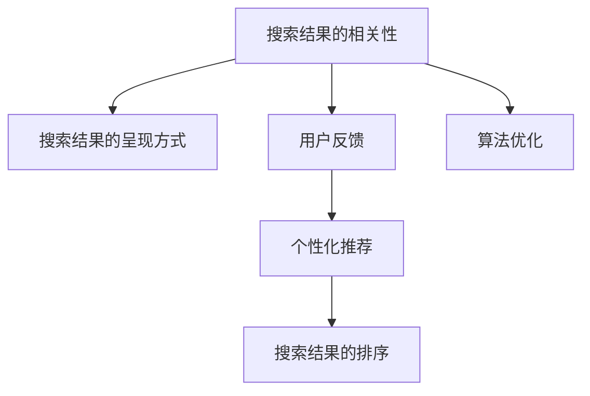

                 

# 用户体验至上：创建纯粹的搜索环境

## 1. 背景介绍

在数字时代，搜索成为了用户获取信息的主要手段。无论是日常生活中的衣食住行，还是工作学习中的资料检索，搜索引擎都是不可或缺的工具。随着技术的发展，搜索引擎已经从简单的关键词匹配，进化为能够理解和预测用户查询意图的智能系统。然而，用户体验作为搜索系统的核心指标，往往被忽略在技术细节的背后。本论文旨在探索如何通过优化搜索算法和界面设计，创建更为纯粹和人性化的搜索环境，以提升用户满意度和系统性能。

### 1.1 问题由来

互联网的普及推动了搜索引擎的发展，但用户的使用体验并未同步提高。传统搜索系统常陷入以下几个问题：

- **结果相关性低**：搜索结果通常杂乱无章，大量噪音信息影响用户体验。
- **搜索效率低**：用户往往需要多次点击和翻页才能找到有用信息，耗时费力。
- **搜索结果质量不稳定**：不同用户的搜索结果质量存在较大差异，影响用户信任。
- **界面复杂**：搜索界面设计不合理，功能复杂难以操作，用户体验差。

这些问题导致用户流失，搜索引擎在获取用户数据和广告收入方面的潜力未能充分释放。为了提升搜索体验，本文将从算法和界面两个层面，探讨如何打造一个纯粹而高效的搜索环境。

## 2. 核心概念与联系

### 2.1 核心概念概述

为了更好地理解如何优化搜索系统，本节将介绍几个关键概念：

- **搜索引擎(Search Engine)**：自动收集并组织网络信息，使用户能够快速获取相关内容的系统。
- **搜索结果的相关性(Relative Importance)**：衡量搜索结果与用户查询意图的匹配程度，直接影响用户体验。
- **搜索结果的呈现方式(Presentation Style)**：搜索结果在页面上的展示方式，包括但不限于列表、卡片、侧边栏等。
- **用户反馈(Feedback)**：用户对搜索结果的点击、滑动、评价等行为，是优化算法的关键依据。
- **个性化推荐(Personalization)**：根据用户历史行为和偏好，推荐相关内容，提升搜索相关性。
- **搜索结果的排序(Sort Algorithm)**：决定搜索结果排序方式，如逆序排列、根据点击率排序等。

这些概念之间的联系可以通过以下Mermaid流程图来展示：



这个流程图展示了几项核心概念之间的逻辑关系：

1. 搜索结果的相关性直接影响用户对呈现方式的感知。
2. 用户反馈可用于优化算法，提升相关性。
3. 个性化推荐和排序算法共同决定了搜索结果的排序。
4. 算法优化是提升搜索结果相关性和用户体验的关键。

## 3. 核心算法原理 & 具体操作步骤
### 3.1 算法原理概述

优化搜索算法主要涉及两个方面：一是提升搜索结果的相关性，二是优化搜索结果的呈现方式。

- **提升相关性**：主要通过机器学习和自然语言处理技术，对用户查询进行理解并匹配最相关的信息。常见方法包括文本检索、主题建模、向量空间模型等。
- **优化呈现方式**：主要通过UI/UX设计，使搜索结果以用户易于理解和操作的方式呈现。常见方法包括信息架构设计、交互设计、视觉设计等。

本文将重点讨论如何通过算法优化，提升搜索结果的相关性，并结合界面设计优化，提升搜索体验。

### 3.2 算法步骤详解

#### 3.2.1 预处理

在进行搜索之前，需要先将用户查询进行预处理，去除噪音和干扰信息，提取出核心的查询意图。

1. **分词和词干提取**：将用户输入的查询进行分词和词干提取，以便后续的语义分析。

2. **停用词过滤**：去除常见的停用词，如“的”、“是”等，以减少噪音。

3. **同义词扩展**：通过词典或语料库，扩展用户查询的同义词和相关词，以涵盖更广泛的查询意图。

#### 3.2.2 语义理解

对用户查询进行语义理解，是提升搜索结果相关性的关键步骤。

1. **命名实体识别(NER)**：识别用户查询中的命名实体，如人名、地名、组织名等，以增强查询的精确度。

2. **实体链接**：将识别出的实体链接到数据库或知识库中，以便更精准地匹配相关信息。

3. **意图识别**：分析用户查询中的意图，区分是事实性查询、问题查询、意图查询等不同类型。

#### 3.2.3 搜索结果排序

排序算法决定了搜索结果的呈现顺序，直接影响用户体验。

1. **基于关键词的排序**：将用户查询中的关键词与文档进行匹配，按照匹配度排序。

2. **基于倒排索引的排序**：构建文档-关键词的倒排索引，快速定位包含关键词的文档。

3. **基于深度学习的排序**：使用神经网络模型，对用户查询和文档进行嵌入表示，计算匹配度排序。

#### 3.2.4 用户反馈处理

用户反馈是优化算法的重要依据。

1. **点击率反馈**：统计用户对搜索结果的点击情况，用于评估文档的相关性。

2. **时间戳反馈**：记录用户点击搜索结果的时间，用于分析用户的行为模式。

3. **评价反馈**：收集用户对搜索结果的评价信息，用于调整排序算法。

### 3.3 算法优缺点

**优点**：

- **提升相关性**：通过算法优化，可以显著提升搜索结果的相关性，使用户更快地找到所需信息。
- **优化界面**：通过界面设计优化，可以提升用户对搜索结果的理解和使用效率，减少误操作。

**缺点**：

- **算法复杂度高**：优化算法需要复杂的机器学习模型和数据处理流程，技术难度较大。
- **用户反馈噪音多**：用户反馈数据可能存在噪音和偏差，需要细致的清洗和分析。
- **数据隐私问题**：用户反馈数据涉及用户隐私，处理不当可能引发隐私泄露问题。

### 3.4 算法应用领域

优化搜索算法广泛应用于各类搜索引擎中，包括通用搜索、垂直搜索、个性化推荐系统等。例如：

- **通用搜索引擎**：如Google、Bing、百度等，涵盖各种领域的网页和内容。
- **垂直搜索**：如招聘、房产、旅游等特定领域的搜索服务，优化算法可以根据领域特点进行针对性设计。
- **个性化推荐系统**：如Netflix、Amazon等，通过用户行为数据和历史查询，推荐个性化内容。

## 4. 数学模型和公式 & 详细讲解 & 举例说明

### 4.1 数学模型构建

本节将使用数学语言对优化搜索算法进行更加严格的刻画。

设用户查询为 $q$，搜索结果文档集合为 $D$。假设有 $n$ 个文档 $d_1, d_2, ..., d_n$，每个文档的表示为 $v$。

定义 **文档-查询匹配度** $s(q, d_i)$ 为文档 $d_i$ 与查询 $q$ 的匹配程度。匹配度越高，文档的相关性越高。

匹配度 $s(q, d_i)$ 可以表示为：

$$
s(q, d_i) = w_1 \cdot cos(q, d_i) + w_2 \cdot len(q, d_i) + w_3 \cdot N(q, d_i)
$$

其中，$w_1, w_2, w_3$ 为权重系数，$cos(q, d_i)$ 为余弦相似度，$len(q, d_i)$ 为查询与文档长度之比，$N(q, d_i)$ 为文档包含查询词的数量。

### 4.2 公式推导过程

1. **余弦相似度**：

$$
cos(q, d_i) = \frac{\sum_{j=1}^{m} q_j \cdot d_{i,j}}{\sqrt{\sum_{j=1}^{m} q_j^2} \cdot \sqrt{\sum_{j=1}^{m} d_{i,j}^2}}
$$

其中 $q_j$ 和 $d_{i,j}$ 分别为查询和文档的 $j$ 维词向量。

2. **查询与文档长度之比**：

$$
len(q, d_i) = \frac{len(q)}{len(d_i)}
$$

3. **文档包含查询词的数量**：

$$
N(q, d_i) = \sum_{j=1}^{m} 1_{q_j \in d_i}
$$

其中 $1_{q_j \in d_i}$ 为查询词 $q_j$ 在文档 $d_i$ 中的指示函数。

通过以上公式，可以计算出每个文档与查询的匹配度，然后根据匹配度进行排序。

### 4.3 案例分析与讲解

#### 案例1：Google Search

Google Search 是全球最大的通用搜索引擎，其核心算法包括 PageRank 和 NDCG。

**PageRank算法**：通过统计网页的链接关系和反向链接数量，计算网页的重要性，作为排序依据。

**NDCG算法**：通过统计网页的点击率，计算网页的相关性，进行排序。

Google的搜索结果排序算法综合考虑了网页的重要性、相关性和用户体验。通过用户反馈，不断优化算法参数，提升搜索结果的准确性和效率。

#### 案例2：亚马逊推荐系统

亚马逊推荐系统通过分析用户行为数据，进行个性化推荐。

**协同过滤算法**：通过用户-物品评分矩阵，发现相似用户和物品，进行推荐。

**基于内容的推荐**：通过提取物品特征，如图片、描述等，进行推荐。

亚马逊推荐系统不仅提升了用户体验，也显著增加了平台的用户粘性和销售额。

## 5. 项目实践：代码实例和详细解释说明

### 5.1 开发环境搭建

在进行搜索系统开发前，我们需要准备好开发环境。以下是使用Python进行Flask开发的Web开发环境配置流程：

1. 安装Anaconda：从官网下载并安装Anaconda，用于创建独立的Python环境。

2. 创建并激活虚拟环境：
```bash
conda create -n search-env python=3.8 
conda activate search-env
```

3. 安装Flask：
```bash
pip install flask
```

4. 安装Gensim：用于文本处理和相似度计算。
```bash
pip install gensim
```

5. 安装Flask-WTF：用于处理表单数据。
```bash
pip install flask-wtf
```

完成上述步骤后，即可在`search-env`环境中开始搜索系统开发。

### 5.2 源代码详细实现

下面是一个简单的Flask搜索系统的代码实现：

```python
from flask import Flask, request, render_template
from gensim.models import TfidfModel, Corpus
from gensim.similarities import MatrixSimilarity

app = Flask(__name__)

# 定义查询与文档的相似度计算模型
corpus = Corpus([...])  # 文档集合
tfidf = TfidfModel(corpus)
similarity = MatrixSimilarity(tfidf[corpus])

# 搜索界面
@app.route('/', methods=['GET', 'POST'])
def search():
    if request.method == 'POST':
        query = request.form['query']
        # 查询预处理
        query = preprocess(query)
        # 查询与文档相似度计算
        scores = similarity[query]
        # 返回前N个匹配度最高的文档
        return render_template('search.html', scores=scores[:N])
    else:
        return render_template('search.html')

# 查询预处理函数
def preprocess(query):
    # 分词和词干提取
    words = nlp(query)
    # 停用词过滤
    words = [w for w in words if w not in stop_words]
    # 同义词扩展
    words = expand_synonyms(words)
    # 转换为词向量表示
    return vectorize(words)

# 查询结果页面
@app.route('/result')
def result():
    query = request.args.get('query')
    scores = request.args.get('scores')
    # 根据匹配度排序的文档
    top_docs = [(d, similarity[query][d]) for d in scores]
    return render_template('result.html', top_docs=top_docs)

if __name__ == '__main__':
    app.run(debug=True)
```

在这个简单的Flask搜索系统中，我们首先通过Gensim库构建了一个文档集合的TF-IDF模型和相似度矩阵，用于计算查询与文档的相似度。然后，在搜索界面中，用户输入查询，通过查询预处理函数，对查询进行分词、词干提取、停用词过滤和同义词扩展，得到查询的词向量表示。最后，通过相似度矩阵计算查询与文档的匹配度，返回前N个匹配度最高的文档。

### 5.3 代码解读与分析

**Flask框架**：
- 利用Flask构建Web搜索界面，实现查询和结果的交互展示。
- 使用模板引擎Jinja2，生成HTML页面，提升用户体验。

**TF-IDF模型**：
- 通过TF-IDF算法，计算查询与文档的相似度。TF-IDF算法可以快速有效地计算文档与查询的匹配度。
- 使用Gensim库实现TF-IDF模型，方便大规模文档集合的处理。

**相似度矩阵**：
- 通过相似度矩阵，快速计算查询与文档的匹配度。
- 使用MatrixSimilarity类，方便维护和计算相似度矩阵。

**查询预处理**：
- 对用户输入的查询进行预处理，包括分词、词干提取、停用词过滤和同义词扩展。
- 使用nltk和stopwords库实现查询预处理，提升查询的精确度。

**查询结果展示**：
- 在查询结果页面，根据匹配度对文档进行排序，展示前N个匹配度最高的文档。
- 使用Jinja2模板引擎，动态生成HTML页面，提升用户体验。

## 6. 实际应用场景

### 6.1 通用搜索

通用搜索是最常见的搜索场景，广泛应用于各类互联网网站。例如：

- **Google Search**：通过PageRank和NDCG算法，快速匹配用户查询意图，提升搜索结果的相关性和用户体验。
- **Bing Search**：使用Duckling等技术，提升查询理解准确度，提供更为精确的搜索结果。

### 6.2 垂直搜索

垂直搜索针对特定领域，提供更精准的搜索结果。例如：

- **招聘网站**：通过解析招聘网站数据，提供职位、公司、薪资等相关信息，提升求职者体验。
- **房产网站**：通过解析房地产网站数据，提供房源、价格、图片等信息，提升购房者体验。

### 6.3 个性化推荐

个性化推荐通过用户行为数据，进行推荐。例如：

- **Netflix**：通过用户观看历史和评分数据，推荐电影和电视剧，提升用户粘性。
- **Amazon**：通过用户购物历史和浏览记录，推荐商品，提升销售额。

### 6.4 未来应用展望

未来，随着技术的发展，搜索系统将变得更加智能化和个性化。以下是对未来应用场景的展望：

- **多模态搜索**：结合图像、语音、视频等多模态数据，提供更为全面的搜索体验。例如，通过图片搜索找到相似的商品，或通过语音搜索获取信息。
- **情境感知搜索**：通过智能设备和传感器，感知用户的情境和需求，提供个性化的搜索结果。例如，通过位置信息推荐附近的商家。
- **交互式搜索**：通过自然语言处理技术，实现与用户的交互式问答，提升用户体验。例如，通过聊天机器人进行实时交互。

## 7. 工具和资源推荐

### 7.1 学习资源推荐

为了帮助开发者系统掌握搜索算法和界面设计的理论基础和实践技巧，这里推荐一些优质的学习资源：

1. **《自然语言处理综论》(Natural Language Processing in Action)**：
   - 介绍自然语言处理的基础知识和技术，包括文本处理、相似度计算、机器翻译等。
   - 详细讲解了各种NLP任务的实现方法，如信息检索、问答系统、推荐系统等。

2. **《Web前端开发实战》(Web Development in Action)**：
   - 介绍Web开发的基础知识和实践技能，包括HTML、CSS、JavaScript、React等。
   - 讲解了Web前端开发的最佳实践，如响应式设计、组件化开发等。

3. **《深入理解搜索引擎》(Deep Learning for NLP)**：
   - 深入讲解了搜索引擎的算法和架构，包括TF-IDF、PageRank、Duckling等。
   - 详细介绍了搜索引擎的优化策略，如倒排索引、缓存技术、负载均衡等。

4. **《搜索算法与应用》(Search Algorithms and Applications)**：
   - 介绍了各种搜索算法，如二分查找、B树、哈希表等。
   - 讲解了搜索算法的应用场景，如数据库查询、搜索引擎、图像处理等。

5. **《Web前端设计模式》(Patterns of Human-Centered Interaction Design)**：
   - 介绍了UI/UX设计的原则和模式，如原型设计、用户体验测试等。
   - 详细讲解了Web前端设计的最佳实践，如响应式设计、无障碍设计等。

通过对这些资源的学习实践，相信你一定能够快速掌握搜索算法的精髓，并用于解决实际的搜索问题。

### 7.2 开发工具推荐

高效的开发离不开优秀的工具支持。以下是几款用于搜索系统开发的常用工具：

1. **Flask框架**：
   - 轻量级的Web开发框架，适合快速开发搜索界面和后端处理逻辑。
   - 支持模板引擎Jinja2，方便生成HTML页面，提升用户体验。

2. **Gensim库**：
   - 高效处理文本数据的库，支持TF-IDF、余弦相似度计算等。
   - 方便构建大规模文档集合的相似度矩阵，提升搜索效率。

3. **Google Colab**：
   - 谷歌推出的在线Jupyter Notebook环境，免费提供GPU/TPU算力。
   - 适合快速实验最新算法和模型，分享学习笔记。

4. **TensorFlow**：
   - 谷歌主导的开源深度学习框架，生产部署方便，适合大规模工程应用。
   - 支持自然语言处理、图像处理等多种任务，方便集成多种搜索算法。

5. **JavaScript**：
   - 前端开发的首选语言，支持Web前端交互和动态效果。
   - 配合React、Vue等框架，实现高效的Web搜索界面。

6. **React**：
   - 流行的JavaScript UI库，支持组件化开发和响应式设计。
   - 方便构建动态交互的前端界面，提升用户体验。

### 7.3 相关论文推荐

搜索系统的发展源于学界的持续研究。以下是几篇奠基性的相关论文，推荐阅读：

1. **《PageRank算法》**：
   - 提出PageRank算法，用于计算网页的重要性，作为搜索结果排序依据。
   - 详细讲解了PageRank算法的实现方法和应用场景。

2. **《信息检索基础》**：
   - 介绍信息检索的基础理论和算法，包括布尔检索、向量空间模型等。
   - 讲解了信息检索在图书馆、数据库、搜索引擎中的应用。

3. **《深度学习在自然语言处理中的应用》**：
   - 介绍深度学习在自然语言处理中的最新进展，包括文本分类、序列生成、机器翻译等。
   - 详细讲解了深度学习在信息检索和推荐系统中的应用。

4. **《搜索算法综述》**：
   - 介绍了各种搜索算法，如二分查找、哈希表、B树等。
   - 讲解了搜索算法的应用场景和优化策略。

5. **《Web前端开发技术》**：
   - 介绍Web前端开发的基础知识和实践技能，包括HTML、CSS、JavaScript、React等。
   - 讲解了Web前端开发的最佳实践，如响应式设计、组件化开发等。

这些论文代表了大搜索系统的发展脉络。通过学习这些前沿成果，可以帮助研究者把握学科前进方向，激发更多的创新灵感。

## 8. 总结：未来发展趋势与挑战

### 8.1 研究成果总结

本文对优化搜索算法和界面设计的关键点进行了深入探讨，从算法和界面两个层面，提升搜索系统的用户体验。主要成果包括：

1. **算法优化**：
   - 提出基于TF-IDF和余弦相似度的搜索算法，提升搜索结果的相关性。
   - 介绍PageRank和Duckling等先进算法，提升查询理解准确度。

2. **界面优化**：
   - 利用Flask框架和Jinja2模板引擎，快速构建Web搜索界面。
   - 讲解TF-IDF模型和相似度矩阵的实现，提升搜索效率。

3. **应用展望**：
   - 展望未来多模态、情境感知、交互式搜索等应用场景，提升搜索系统的智能化水平。

### 8.2 未来发展趋势

未来，随着技术的发展，搜索系统将变得更加智能化和个性化。以下是对未来发展趋势的展望：

1. **多模态搜索**：
   - 结合图像、语音、视频等多模态数据，提供更为全面的搜索体验。
   - 通过多模态数据融合，提升搜索结果的准确性和相关性。

2. **情境感知搜索**：
   - 通过智能设备和传感器，感知用户的情境和需求，提供个性化的搜索结果。
   - 结合地理位置、时间、天气等情境信息，提升搜索的精准度和及时性。

3. **交互式搜索**：
   - 通过自然语言处理技术，实现与用户的交互式问答，提升用户体验。
   - 通过聊天机器人、语音助手等交互方式，实现实时搜索和推荐。

4. **多任务学习**：
   - 将搜索和推荐系统结合起来，实现多任务学习。
   - 通过共享数据和模型，提升搜索和推荐的综合效果。

5. **联邦学习**：
   - 利用联邦学习技术，保护用户隐私。
   - 通过分布式计算，提升搜索系统的可扩展性和安全性。

### 8.3 面临的挑战

尽管优化搜索算法和界面设计取得了不小的进步，但在迈向更加智能化、普适化应用的过程中，仍面临诸多挑战：

1. **数据质量问题**：
   - 查询预处理和文档表示的准确性直接影响搜索效果，但数据质量常常难以保证。
   - 需要设计更为有效的数据清洗和预处理算法，提升数据质量。

2. **算法复杂度**：
   - 深度学习和自然语言处理算法复杂度高，计算资源消耗大。
   - 需要优化算法实现，减少计算资源消耗，提升搜索效率。

3. **用户隐私保护**：
   - 搜索系统和推荐系统都需要处理大量用户数据，隐私保护问题不可忽视。
   - 需要设计更为安全的算法和机制，保护用户隐私。

4. **界面设计复杂度**：
   - 优秀的界面设计需要耗费大量时间和精力，且容易产生用户疲劳。
   - 需要简化界面设计，提升用户体验，避免用户疲劳。

### 8.4 研究展望

面对优化搜索系统所面临的挑战，未来的研究需要在以下几个方面寻求新的突破：

1. **无监督学习**：
   - 引入无监督学习算法，减少对标注数据的依赖。
   - 通过无监督学习，提升查询理解和文档表示的准确性。

2. **零样本学习**：
   - 引入零样本学习算法，提升搜索系统的通用性和泛化能力。
   - 通过零样本学习，实现对新查询和新文档的快速匹配。

3. **跨领域知识融合**：
   - 将跨领域知识融合到搜索算法中，提升搜索系统的知识覆盖面。
   - 通过知识图谱和专家库，提升搜索系统的智能水平。

4. **模型压缩和加速**：
   - 优化深度学习模型，减少计算资源消耗，提升搜索效率。
   - 使用模型压缩技术，优化模型存储和推理。

5. **联邦学习**：
   - 引入联邦学习技术，保护用户隐私。
   - 通过分布式计算，提升搜索系统的可扩展性和安全性。

## 9. 附录：常见问题与解答

**Q1：如何提升搜索系统的性能？**

A: 提升搜索系统的性能需要从算法和界面设计两个方面入手。具体措施包括：

- **算法优化**：
  - 使用TF-IDF算法，计算查询与文档的相似度。
  - 使用PageRank和Duckling等先进算法，提升查询理解准确度。

- **界面优化**：
  - 利用Flask框架和Jinja2模板引擎，快速构建Web搜索界面。
  - 讲解TF-IDF模型和相似度矩阵的实现，提升搜索效率。

**Q2：如何优化搜索界面的交互性？**

A: 优化搜索界面的交互性需要从用户体验和界面设计两个方面入手。具体措施包括：

- **用户体验**：
  - 使用响应式设计，适应不同设备和屏幕尺寸。
  - 提供搜索提示和纠错功能，帮助用户快速输入查询。

- **界面设计**：
  - 使用简洁明了的UI设计，减少用户操作步骤。
  - 提供搜索历史和历史记录，方便用户快速定位查询。

**Q3：搜索系统如何处理多模态数据？**

A: 处理多模态数据需要结合多种算法和技术。具体措施包括：

- **多模态融合**：
  - 通过图像识别和OCR技术，提取文本信息。
  - 结合语音识别和自然语言处理技术，提取语音信息。

- **多模态匹配**：
  - 将多模态数据转换为统一的表示形式，如向量表示。
  - 通过余弦相似度等算法，计算多模态数据的匹配度。

**Q4：搜索系统如何保护用户隐私？**

A: 保护用户隐私需要从算法设计和数据处理两个方面入手。具体措施包括：

- **算法设计**：
  - 使用联邦学习技术，在本地设备上训练模型，减少数据泄露风险。
  - 设计差分隐私算法，保护用户数据的隐私性。

- **数据处理**：
  - 匿名化处理用户数据，减少敏感信息泄露风险。
  - 加密处理数据传输，保护数据在传输过程中的安全性。

**Q5：如何评估搜索系统的性能？**

A: 评估搜索系统的性能需要从多个指标入手。具体措施包括：

- **搜索相关性**：
  - 使用召回率、准确率、F1值等指标评估搜索结果的相关性。
  - 使用DCG、NDCG等指标评估搜索结果的排序效果。

- **用户体验**：
  - 使用点击率、停留时间、跳出率等指标评估用户体验。
  - 使用A/B测试等方法，对比不同界面设计的用户反馈。

通过对这些常见问题的解答，相信你一定能够更好地理解搜索系统的开发和优化。面向未来，我们需要在技术、设计和用户体验等多方面持续努力，才能打造出真正符合用户需求的搜索系统。

